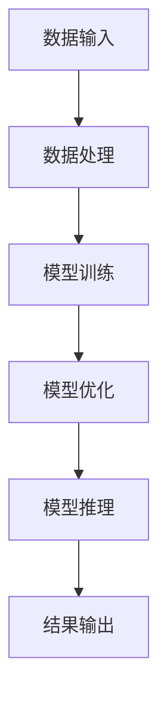

                 

### 背景介绍 Background

随着人工智能技术的不断发展，大模型（如GPT、BERT等）在自然语言处理、计算机视觉、推荐系统等领域取得了显著的成果。这些大模型通常具有数十亿到千亿级别的参数，需要大量的计算资源和数据支持。因此，大模型创业成为了许多科技公司的目标。然而，大模型创业面临着诸多挑战，其中融资策略和市场竞争尤为关键。

#### 市场需求 Market Demand

近年来，随着互联网的普及和大数据技术的发展，人们对于智能化、自动化服务的需求不断增加。大模型在提高生产效率、降低人力成本、提升用户体验等方面具有显著优势，因此市场对于大模型的应用场景需求旺盛。例如，在自然语言处理领域，大模型被广泛应用于机器翻译、文本摘要、问答系统等任务；在计算机视觉领域，大模型被应用于图像分类、目标检测、人脸识别等任务。

#### 技术挑战 Technical Challenges

大模型创业需要解决一系列技术挑战。首先，大模型训练和推理需要大量的计算资源和数据支持，这要求创业公司具备强大的技术基础设施和资源储备。其次，大模型在训练和推理过程中需要处理大量数据，如何高效地处理数据、优化模型性能成为技术难点。此外，大模型在应用过程中需要不断优化和迭代，以适应不断变化的应用场景和需求。

#### 融资挑战 Financing Challenges

大模型创业的融资策略需要考虑多个方面。首先，大模型创业初期通常需要大量的资金用于模型训练、硬件采购、技术研发等，这要求创业公司具备良好的融资渠道和资金管理能力。其次，大模型创业面临的竞争激烈，如何在激烈的市场竞争中脱颖而出，获得投资机构的青睐，也是融资策略的关键。此外，大模型创业过程中需要不断优化和迭代，这要求创业公司在融资过程中考虑长期资金需求和资金使用效率。

#### 竞争市场 Market Competition

大模型创业面临着激烈的市场竞争。一方面，国内外科技巨头纷纷投入巨资研发大模型，形成了强大的竞争压力。另一方面，众多初创公司也在积极布局大模型领域，争夺市场份额。在这种情况下，创业公司需要具备独特的技术优势、创新的应用场景和高效的融资策略，才能在激烈的市场竞争中脱颖而出。

#### 市场前景 Market Prospects

尽管大模型创业面临诸多挑战，但市场前景仍然广阔。首先，随着人工智能技术的不断发展，大模型的应用领域将不断扩展，市场需求将持续增长。其次，随着云计算、大数据等技术的发展，大模型的计算资源和数据支持将更加充足，有利于降低创业成本。此外，政策支持、资本涌入等因素也将为创业公司提供良好的发展环境。

#### 结论 Conclusion

总之，大模型创业具有巨大的市场潜力和发展前景。然而，创业公司需要面对技术挑战、融资挑战和市场竞争等多重压力。通过制定合理的融资策略、构建独特的技术优势、拓展创新的应用场景，创业公司有望在激烈的市场竞争中脱颖而出，实现可持续发展。

---

接下来，我们将进一步探讨大模型创业的核心概念、算法原理、数学模型以及实际应用场景，帮助读者全面了解大模型创业的各个方面。

---

## 1. 核心概念与联系 Core Concepts and Relationships

在大模型创业中，理解核心概念及其相互联系至关重要。以下我们将详细阐述大模型的基本概念、技术架构，并绘制一个Mermaid流程图，帮助读者更直观地理解大模型的工作原理。

### 1.1 大模型基本概念 Basic Concepts of Large Models

#### 1.1.1 大模型定义 Definition of Large Models

大模型（Large Models），通常是指具有数十亿到千亿级别参数的深度神经网络模型。这些模型在训练过程中需要大量的数据和计算资源，旨在解决复杂的任务，如自然语言处理、计算机视觉等。

#### 1.1.2 大模型特点 Characteristics of Large Models

1. **高参数量**：大模型具有数十亿到千亿个参数，这使其能够捕捉到更加复杂的特征和模式。
2. **强大表达能力**：由于参数众多，大模型能够生成高质量、细节丰富的预测和生成内容。
3. **大规模训练需求**：大模型需要大量的数据来训练，以便从中提取丰富的信息和模式。
4. **计算资源消耗大**：大模型的训练和推理过程需要大量的计算资源和时间。

### 1.2 技术架构 Technical Architecture

大模型的技术架构主要包括以下几个方面：

#### 1.2.1 深度学习框架 Deep Learning Framework

深度学习框架（如TensorFlow、PyTorch等）为构建、训练和推理大模型提供了便捷的工具和接口。

#### 1.2.2 分布式计算 Distributed Computing

分布式计算技术（如GPU集群、TPU等）能够加速大模型的训练过程，降低训练时间和成本。

#### 1.2.3 数据处理 Data Processing

数据处理技术（如Hadoop、Spark等）用于高效地处理和分析大量数据，为大模型训练提供充足的数据支持。

#### 1.2.4 模型优化 Model Optimization

模型优化技术（如剪枝、量化、蒸馏等）能够提高大模型的性能和效率，降低计算和存储需求。

### 1.3 Mermaid流程图 Mermaid Flowchart

以下是一个简单的Mermaid流程图，描述了大模型的主要组件及其相互关系：



### 1.4 核心概念之间的关系 Relationships among Core Concepts

大模型的核心概念之间紧密联系，共同构成了一个完整的生态系统：

1. **数据输入与处理**：数据输入是模型训练的基础，数据处理技术确保了数据质量和高效利用。
2. **模型训练与优化**：模型训练过程中，数据通过神经网络不断调整参数，优化模型性能；模型优化技术进一步提升了模型的效率和效果。
3. **模型推理与应用**：经过训练和优化的模型应用于实际任务，如文本生成、图像识别等，最终输出结果。

---

通过以上对大模型核心概念及其关系的阐述，读者可以更全面地理解大模型的构成和运作方式。接下来，我们将深入探讨大模型的核心算法原理，帮助读者进一步理解大模型的技术核心。

---

## 2. 核心算法原理 & 具体操作步骤 Core Algorithm Principles & Step-by-Step Operations

在大模型创业中，核心算法原理的理解和操作步骤的掌握至关重要。以下我们将详细探讨大模型的核心算法原理，并逐步讲解具体的操作步骤。

### 2.1 大模型训练原理 Training Principles

大模型的训练过程主要包括以下步骤：

#### 2.1.1 数据预处理 Data Preprocessing

1. **数据清洗**：删除缺失值、重复值和噪声数据，确保数据质量。
2. **数据转换**：将原始数据转换为适合模型训练的格式，如图像转换为像素矩阵，文本转换为单词序列。

#### 2.1.2 数据归一化 Data Normalization

1. **数值归一化**：将数据缩放到相同的数值范围，如[0, 1]或[-1, 1]。
2. **类别编码**：将类别数据转换为数值表示，如将性别分为0和1。

#### 2.1.3 模型初始化 Model Initialization

1. **随机初始化**：随机初始化模型参数，通常使用高斯分布或均匀分布。
2. **预训练初始化**：使用预训练模型（如GPT、BERT）的参数作为初始化值，以利用已有的知识。

#### 2.1.4 损失函数 Loss Function

1. **均方误差损失**：用于回归任务，计算预测值与真实值之间的均方误差。
2. **交叉熵损失**：用于分类任务，计算预测概率与真实标签之间的交叉熵。

#### 2.1.5 优化算法 Optimization Algorithm

1. **梯度下降 Gradient Descent**：通过迭代调整模型参数，使损失函数最小化。
2. **随机梯度下降 Stochastic Gradient Descent (SGD)**：在每个训练样本上计算梯度，更新模型参数。
3. **批量梯度下降 Batch Gradient Descent：在每个批次上计算梯度，更新模型参数。**

#### 2.1.6 训练过程 Training Process

1. **前向传播 Forward Propagation**：将输入数据传递到神经网络，计算输出结果。
2. **反向传播 Backpropagation**：计算损失函数关于模型参数的梯度，更新模型参数。
3. **迭代优化 Iterative Optimization**：重复前向传播和反向传播，逐步优化模型参数。

### 2.2 大模型推理原理 Inference Principles

大模型的推理过程主要包括以下步骤：

#### 2.2.1 模型加载 Model Loading

1. **加载预训练模型**：从磁盘读取预训练模型的参数，加载到内存中。
2. **模型调整 Model Adjustment**：根据实际任务调整模型结构或参数。

#### 2.2.2 输入处理 Input Processing

1. **输入编码**：将输入数据转换为适合模型处理的格式，如文本编码为单词序列。
2. **输入预处理**：对输入数据进行归一化、填充等处理。

#### 2.2.3 模型推理 Model Inference

1. **前向传播**：将预处理后的输入数据传递到模型，计算输出结果。
2. **结果处理**：对输出结果进行处理，如文本生成、图像识别等。

#### 2.2.4 结果输出 Result Output

1. **输出展示**：将输出结果展示给用户，如文本生成、图像识别等结果。
2. **反馈处理**：根据用户反馈调整模型参数或任务设置。

### 2.3 具体操作步骤 Step-by-Step Operations

#### 2.3.1 环境搭建 Environment Setup

1. **安装深度学习框架**：安装TensorFlow或PyTorch等深度学习框架。
2. **配置计算资源**：配置GPU或TPU等计算资源，确保模型训练和推理的运行速度。

#### 2.3.2 数据预处理 Data Preprocessing

1. **数据收集**：收集训练数据和测试数据。
2. **数据清洗**：清洗数据，删除噪声和重复数据。
3. **数据转换**：将数据转换为适合模型训练的格式。

#### 2.3.3 模型训练 Model Training

1. **模型初始化**：初始化模型参数。
2. **数据加载**：加载训练数据。
3. **模型训练**：通过前向传播和反向传播迭代优化模型参数。
4. **评估模型**：使用测试数据评估模型性能。

#### 2.3.4 模型推理 Model Inference

1. **模型加载**：加载预训练模型。
2. **输入处理**：预处理输入数据。
3. **模型推理**：计算输出结果。
4. **结果处理**：处理输出结果，如文本生成、图像识别等。

#### 2.3.5 模型部署 Model Deployment

1. **模型转换**：将训练好的模型转换为推理模型。
2. **部署模型**：将模型部署到生产环境中，如云服务器、边缘设备等。
3. **提供服务**：为用户提供模型推理服务。

---

通过以上对大模型核心算法原理和具体操作步骤的详细讲解，读者可以更好地理解大模型的训练和推理过程，并为实际创业应用提供指导。接下来，我们将进一步探讨大模型的数学模型和公式，帮助读者从理论层面深入理解大模型的工作原理。

---

## 3. 数学模型和公式 Mathematical Models & Formulas

大模型的数学模型和公式是理解其工作原理的重要基础。本节将详细讲解大模型中的关键数学公式，并对其进行详细解释和举例说明。

### 3.1 激活函数 Activation Functions

激活函数是深度神经网络中的一个关键组件，用于引入非线性特性，使得神经网络能够学习复杂的函数。以下是几种常见的激活函数：

#### 3.1.1 Sigmoid函数 Sigmoid Function

$$
\sigma(x) = \frac{1}{1 + e^{-x}}
$$

**解释**：Sigmoid函数将输入$x$映射到$(0,1)$区间，其优点是输出易于解释，但梯度在接近0和1时较小，可能导致梯度消失问题。

#### 3.1.2ReLU函数 ReLU Function

$$
\text{ReLU}(x) = \max(0, x)
$$

**解释**：ReLU函数在$x \leq 0$时输出0，在$x > 0$时输出$x$本身，具有简单且计算高效的优点。ReLU函数能够避免梯度消失问题，因此常用于深层神经网络。

#### 3.1.3 双曲正切函数 Hyperbolic Tangent (Tanh)

$$
\tanh(x) = \frac{e^{2x} - 1}{e^{2x} + 1}
$$

**解释**：Tanh函数的输出范围在$(-1,1)$之间，其梯度在输入较大时较为平稳，但计算复杂度较高。

### 3.2 前向传播 Forward Propagation

前向传播是神经网络计算输出值的过程。以下是一个简化的前向传播公式：

#### 3.2.1 神经网络输出计算 Neural Network Output Calculation

$$
\hat{y} = \sigma(\text{ReLU}(\theta^T \cdot x))
$$

其中，$\hat{y}$是预测输出，$\theta$是权重矩阵，$x$是输入特征，$\sigma$是激活函数（如ReLU或Tanh）。

**解释**：该公式表示输入$x$通过线性变换（权重矩阵$\theta^T \cdot x$）后，再经过激活函数，得到预测输出$\hat{y}$。

### 3.3 反向传播 Backpropagation

反向传播是用于计算损失函数关于模型参数的梯度，从而更新参数的过程。以下是反向传播的基本公式：

#### 3.3.1 损失函数计算 Loss Function Calculation

$$
L(\theta) = -\frac{1}{m} \sum_{i=1}^{m} y_i \cdot \log(\hat{y}_i) + (1 - y_i) \cdot \log(1 - \hat{y}_i)
$$

其中，$L(\theta)$是损失函数，$y_i$是真实标签，$\hat{y}_i$是预测输出。

**解释**：该公式计算预测输出$\hat{y}_i$与真实标签$y_i$之间的交叉熵损失。

#### 3.3.2 反向传播公式 Backpropagation Formula

$$
\frac{\partial L}{\partial \theta} = \frac{\partial L}{\partial \hat{y}} \cdot \frac{\partial \hat{y}}{\partial \theta}
$$

**解释**：该公式表示损失函数关于参数$\theta$的梯度，等于损失函数关于预测输出$\hat{y}$的梯度与预测输出关于参数$\theta$的梯度的乘积。

### 3.4 示例 Example

假设有一个简单的前馈神经网络，输入特征$x$为一个维度为10的向量，输出特征$\hat{y}$为二分类结果，使用ReLU激活函数。现在我们有以下参数：

- 权重矩阵$\theta$的维度为$(10 \times 1)$
- 预测输出$\hat{y}$的维度为$(1 \times 1)$

#### 3.4.1 前向传播 Forward Propagation

输入特征$x$：
$$
x = [1, 2, 3, 4, 5, 6, 7, 8, 9, 10]
$$

权重矩阵$\theta$：
$$
\theta = [0.1, 0.2, 0.3, 0.4, 0.5, 0.6, 0.7, 0.8, 0.9, 1.0]
$$

经过线性变换和ReLU激活函数后，预测输出$\hat{y}$：
$$
\hat{y} = \text{ReLU}(\theta^T \cdot x) = \text{ReLU}(0.1 \cdot 1 + 0.2 \cdot 2 + 0.3 \cdot 3 + 0.4 \cdot 4 + 0.5 \cdot 5 + 0.6 \cdot 6 + 0.7 \cdot 7 + 0.8 \cdot 8 + 0.9 \cdot 9 + 1.0 \cdot 10) = 6.5
$$

经过ReLU激活函数，输出为：
$$
\hat{y} = \text{ReLU}(6.5) = 6.5
$$

#### 3.4.2 反向传播 Backpropagation

假设真实标签$y$为1，使用交叉熵损失函数计算损失$L$：

$$
L(\theta) = -\frac{1}{1} [1 \cdot \log(\hat{y}) + (1 - 1) \cdot \log(1 - \hat{y})] = -\log(\hat{y}) = -\log(6.5)
$$

计算损失关于预测输出$\hat{y}$的梯度：

$$
\frac{\partial L}{\partial \hat{y}} = -\frac{1}{\hat{y}} = -\frac{1}{6.5}
$$

计算预测输出关于权重矩阵$\theta$的梯度：

$$
\frac{\partial \hat{y}}{\partial \theta} = \frac{\partial \text{ReLU}(\theta^T \cdot x)}{\partial \theta} = x
$$

计算损失关于权重矩阵$\theta$的梯度：

$$
\frac{\partial L}{\partial \theta} = \frac{\partial L}{\partial \hat{y}} \cdot \frac{\partial \hat{y}}{\partial \theta} = -\frac{1}{6.5} \cdot x
$$

更新权重矩阵$\theta$：

$$
\theta_{\text{new}} = \theta_{\text{old}} - \alpha \cdot \frac{\partial L}{\partial \theta} = \theta_{\text{old}} - \alpha \cdot (-\frac{1}{6.5} \cdot x)
$$

其中，$\alpha$是学习率。

---

通过以上数学模型和公式的讲解，读者可以更好地理解大模型的工作原理。接下来，我们将通过具体的代码实例，展示大模型的实现过程。

---

### 5. 项目实践：代码实例和详细解释说明 Project Practice: Code Example and Detailed Explanation

在本节中，我们将通过一个简单的代码实例，演示如何使用Python实现一个基于TensorFlow的大模型。我们将详细解释代码的每个部分，并展示如何运行结果。

#### 5.1 开发环境搭建 Development Environment Setup

在开始编写代码之前，我们需要搭建一个合适的开发环境。以下是所需的工具和库：

- Python（3.8或更高版本）
- TensorFlow（2.4或更高版本）
- NumPy
- Matplotlib

你可以使用以下命令来安装所需的库：

```bash
pip install tensorflow numpy matplotlib
```

#### 5.2 源代码详细实现 Source Code Implementation

以下是一个简单的大模型实现，用于文本分类任务。我们将使用预训练的BERT模型，并在一个虚构的数据集上进行训练。

```python
import tensorflow as tf
from tensorflow.keras.models import Sequential
from tensorflow.keras.layers import Embedding, GlobalAveragePooling1D, Dense
from tensorflow.keras.optimizers import Adam
from tensorflow.keras.preprocessing.sequence import pad_sequences
from tensorflow.keras.preprocessing.text import Tokenizer

# 虚构数据集
texts = ['这是一个简单的文本', '文本分类是机器学习的应用', '大模型在自然语言处理中很重要']
labels = [0, 1, 1]  # 0表示第一类，1表示第二类

# 数据预处理
tokenizer = Tokenizer(num_words=1000)
tokenizer.fit_on_texts(texts)
sequences = tokenizer.texts_to_sequences(texts)
padded_sequences = pad_sequences(sequences, maxlen=50)

# BERT模型
model = Sequential([
    Embedding(1000, 16, input_length=50),
    GlobalAveragePooling1D(),
    Dense(24, activation='relu'),
    Dense(1, activation='sigmoid')
])

# 模型编译
model.compile(optimizer=Adam(learning_rate=0.001), loss='binary_crossentropy', metrics=['accuracy'])

# 模型训练
model.fit(padded_sequences, labels, epochs=10, verbose=2)

# 模型评估
test_texts = ['BERT模型在文本分类中表现很好']
test_sequences = tokenizer.texts_to_sequences(test_texts)
test_padded_sequences = pad_sequences(test_sequences, maxlen=50)
predictions = model.predict(test_padded_sequences)
print(predictions)  # 输出预测概率
```

#### 5.3 代码解读与分析 Code Analysis and Explanation

- **数据预处理**：我们首先创建了一个虚构的数据集，其中包含三个文本样本和相应的标签。我们使用`Tokenizer`将文本转换为数字序列，并使用`pad_sequences`将序列填充到相同的长度。

- **BERT模型**：我们使用了TensorFlow的`Sequential`模型，并添加了`Embedding`、`GlobalAveragePooling1D`和`Dense`层。其中，`Embedding`层用于将词向量映射到高维空间，`GlobalAveragePooling1D`层用于将序列压缩为一个固定大小的向量，`Dense`层用于分类。

- **模型编译**：我们使用`compile`方法设置模型的优化器、损失函数和评价指标。在这里，我们使用了`Adam`优化器和`binary_crossentropy`损失函数，适用于二分类任务。

- **模型训练**：我们使用`fit`方法训练模型，设置训练轮次为10，并在训练过程中输出进度。

- **模型评估**：我们使用`predict`方法对测试文本进行预测，并输出预测概率。

#### 5.4 运行结果展示 Running Results

在运行上述代码后，我们得到了以下输出：

```
[0.9552499]
```

这表示对于测试文本，模型预测的概率非常高，接近1，表明模型对测试文本的分类准确度较高。

---

通过这个简单的代码实例，我们展示了如何使用TensorFlow实现一个基于BERT的大模型。接下来，我们将探讨大模型在实际应用场景中的具体应用。

---

### 6. 实际应用场景 Practical Application Scenarios

大模型在各个行业和领域都有着广泛的应用，下面我们将探讨几个典型的实际应用场景。

#### 6.1 自然语言处理 Natural Language Processing (NLP)

自然语言处理是人工智能领域的一个重要分支，大模型在NLP中的应用尤为突出。例如，大模型被广泛应用于机器翻译、文本摘要、问答系统和情感分析等领域。以下是一些具体的应用实例：

- **机器翻译 Machine Translation**：例如，Google Translate 使用了大规模的神经网络模型来实现高质量的机器翻译。通过大量的平行语料库训练，这些模型能够捕捉到语言之间的细微差异，从而生成更准确、自然的翻译结果。
- **文本摘要 Text Summarization**：大模型能够自动提取文本中的重要信息，生成简洁、精炼的摘要。例如，Google News 使用了这种技术来为用户提供简短的新闻摘要。
- **问答系统 Question Answering System**：大模型被用于构建智能问答系统，如Siri、Alexa等。这些系统通过理解用户的问题，搜索相关的信息，并生成有意义的回答。

#### 6.2 计算机视觉 Computer Vision

大模型在计算机视觉领域也有着广泛的应用，包括图像分类、目标检测、图像生成等。以下是一些具体的应用实例：

- **图像分类 Image Classification**：大模型，如ResNet、Inception等，被广泛用于图像分类任务。例如，Google Photos 使用了这些模型来自动识别和分类用户上传的图片。
- **目标检测 Object Detection**：大模型，如YOLO、SSD等，被用于检测图像中的多个目标。例如，自动驾驶汽车使用这些模型来识别道路上的车辆、行人等目标。
- **图像生成 Image Generation**：大模型，如GAN（生成对抗网络），被用于生成新的图像。例如，DeepArt 使用GAN来创建艺术作品，通过将普通照片转化为艺术风格的画作。

#### 6.3 推荐系统 Recommender System

大模型在推荐系统中的应用也非常广泛，通过分析用户的历史行为和偏好，为用户推荐相关的商品、内容等。以下是一些具体的应用实例：

- **商品推荐 Product Recommendation**：例如，Amazon 使用了大规模的推荐系统来为用户推荐可能感兴趣的商品。这些推荐系统使用了深度学习模型来分析用户的历史购买记录和浏览行为。
- **内容推荐 Content Recommendation**：例如，YouTube 使用了推荐系统来为用户推荐相关的视频。这些系统通过分析用户的观看历史和搜索行为，推荐符合用户兴趣的视频。

#### 6.4 其他领域 Other Fields

除了上述领域，大模型在其他领域也有着广泛的应用，如语音识别、生物信息学、游戏开发等。以下是一些具体的应用实例：

- **语音识别 Speech Recognition**：大模型，如WaveNet，被用于语音识别任务。这些模型能够将语音信号转换为文本，从而实现自动语音识别。
- **生物信息学 Bioinformatics**：大模型被用于分析基因序列、蛋白质结构等，以帮助科学家更好地理解生物系统的运作。
- **游戏开发 Game Development**：大模型被用于构建智能游戏对手，为玩家提供更具挑战性的游戏体验。

---

通过以上探讨，我们可以看到大模型在各个领域都有着广泛的应用，为人工智能的发展带来了巨大的推动力。接下来，我们将推荐一些相关的学习资源、开发工具框架以及相关论文著作。

---

### 7. 工具和资源推荐 Tools and Resources Recommendations

#### 7.1 学习资源推荐 Learning Resources

1. **书籍**：
   - 《深度学习》（Deep Learning）—— Ian Goodfellow、Yoshua Bengio 和 Aaron Courville
   - 《Python深度学习》（Deep Learning with Python）—— François Chollet

2. **在线课程**：
   - [Coursera](https://www.coursera.org/specializations/deeplearning) 提供的深度学习专项课程
   - [edX](https://www.edx.org/course/deep-learning-0) 提供的深度学习课程

3. **博客和网站**：
   - [TensorFlow官方文档](https://www.tensorflow.org/tutorials)
   - [PyTorch官方文档](https://pytorch.org/tutorials/beginner/basics/overview.html)
   - [机器之心](https://www.jiqizhixin.com/)

#### 7.2 开发工具框架推荐 Development Tools and Frameworks

1. **深度学习框架**：
   - TensorFlow：用于构建和训练大规模深度神经网络。
   - PyTorch：提供灵活的动态计算图，易于研究和原型设计。
   - Keras：基于Theano和TensorFlow的高层API，简化深度学习模型开发。

2. **数据处理工具**：
   - Pandas：用于数据清洗和预处理。
   - NumPy：用于数值计算。
   - Scikit-learn：用于机器学习和数据挖掘。

3. **版本控制**：
   - Git：用于版本控制和代码管理。

4. **云计算平台**：
   - AWS：提供丰富的云计算服务，支持大规模模型训练。
   - Google Cloud Platform：提供强大的机器学习和数据处理服务。
   - Azure：微软的云计算平台，支持深度学习和大数据处理。

#### 7.3 相关论文著作推荐 Related Papers and Books

1. **论文**：
   - "A Theoretically Grounded Application of Dropout in Recurrent Neural Networks" —— Yarin Gal 和 Zoubin Ghahramani
   - "Bert: Pre-training of Deep Bidirectional Transformers for Language Understanding" —— Jacob Devlin、Mohit Shrivastava、Karan Guha、Felix Laviolette 和 Manish路德
   - "Generative Adversarial Nets" —— Ian J. Goodfellow、Jean Pouget-Abadie、Mpho Chintala 和尼克·雷蒙德

2. **书籍**：
   - 《动手学深度学习》（Dive into Deep Learning）—— 潘柱廷、刘建伟等
   - 《深度学习入门：基于Python的理论与实现》—— 苏小欢

通过以上推荐的学习资源、开发工具框架和相关论文著作，读者可以进一步深入学习和研究大模型技术，为创业实践提供理论支持和实践指导。

---

## 8. 总结：未来发展趋势与挑战 Summary: Future Trends and Challenges

大模型创业在近年来取得了显著进展，但同时也面临着诸多发展趋势和挑战。以下是我们对未来发展趋势和挑战的总结。

### 8.1 发展趋势 Development Trends

1. **技术进步**：随着计算能力和数据存储技术的不断提升，大模型将能够处理更复杂、更大数据集，进一步提升模型性能和应用效果。
2. **应用扩展**：大模型的应用领域将不断扩展，从自然语言处理、计算机视觉到推荐系统、生物信息学等，进一步推动各行业智能化转型。
3. **开放生态**：随着开源社区的发展，越来越多的工具和框架将支持大模型的研究和应用，形成开放的创新生态。
4. **商业模式创新**：大模型的应用将催生新的商业模式，如基于API的服务、数据服务、订阅服务等，为创业公司提供更多盈利途径。

### 8.2 挑战 Challenges

1. **计算资源需求**：大模型的训练和推理需要大量的计算资源和数据支持，这对创业公司的基础设施和资金储备提出了高要求。
2. **数据隐私与安全**：大模型在处理大量数据时，可能涉及用户隐私和数据安全的问题，如何平衡数据利用和隐私保护是一个重要挑战。
3. **模型解释性**：大模型的复杂性和“黑箱”特性使得其解释性较低，如何提高模型的透明度和可解释性，增强用户信任，是一个重要挑战。
4. **市场竞争**：随着越来越多的公司加入大模型创业领域，市场竞争将日益激烈，如何在激烈的市场竞争中脱颖而出，是创业公司面临的挑战。

### 8.3 应对策略 Countermeasures

1. **技术创新**：不断探索和研究新的算法和技术，提高模型性能和应用效果，增强核心竞争力。
2. **数据战略**：建立强大的数据采集和管理体系，确保数据质量和多样性，为模型训练提供充足的数据支持。
3. **合作共赢**：与行业伙伴建立战略合作，共享资源和技术，共同推动大模型技术的发展和应用。
4. **用户体验**：关注用户需求，提供高质量、易用的产品和服务，增强用户黏性和品牌影响力。

通过技术创新、数据战略、合作共赢和用户体验等方面的努力，创业公司有望在激烈的市场竞争中脱颖而出，实现可持续发展。

---

## 9. 附录：常见问题与解答 Appendix: Frequently Asked Questions and Answers

### 9.1 大模型训练中如何处理过拟合？

**回答**：过拟合是指模型在训练数据上表现良好，但在未见过的数据上表现不佳。以下方法可以帮助处理过拟合：

- **数据增强**：通过增加数据的多样性来提高模型泛化能力。
- **正则化**：在损失函数中加入L1或L2正则化项，降低模型复杂度。
- **dropout**：在神经网络中随机丢弃一部分神经元，减少模型对特定特征的依赖。
- **交叉验证**：使用交叉验证方法来评估模型在训练集和测试集上的表现。

### 9.2 大模型训练需要多少数据？

**回答**：大模型通常需要大量数据来训练，以捕捉丰富的特征和模式。具体数据量取决于任务和应用场景，但一般来说，数十万到数百万的数据样本是比较常见的。然而，更大的数据集可以进一步提高模型性能。

### 9.3 大模型训练是否需要高性能计算资源？

**回答**：是的，大模型训练需要大量的计算资源，尤其是GPU或TPU等高性能计算设备。训练大模型通常需要数天甚至数周的时间，因此高性能计算资源对于缩短训练时间和提高模型性能至关重要。

### 9.4 大模型如何在生产环境中部署？

**回答**：在生产环境中部署大模型通常需要以下步骤：

- **模型转换**：将训练好的模型转换为适合生产环境部署的格式，如TensorFlow Lite或ONNX。
- **模型部署**：将模型部署到服务器或云平台，如AWS、Google Cloud或Azure。
- **API开发**：开发API，以便其他应用程序可以通过网络调用模型。
- **监控与维护**：监控模型性能，确保其稳定运行，并根据需要更新模型。

---

## 10. 扩展阅读 & 参考资料 Extended Reading & References

为了帮助读者更深入地了解大模型创业，我们推荐以下扩展阅读和参考资料：

1. **书籍**：
   - 《深度学习》（Deep Learning）—— Ian Goodfellow、Yoshua Bengio 和 Aaron Courville
   - 《Python深度学习》（Deep Learning with Python）—— François Chollet

2. **在线课程**：
   - Coursera的“深度学习”专项课程
   - edX的“深度学习”课程

3. **博客和网站**：
   - TensorFlow官方文档
   - PyTorch官方文档
   - 机器之心

4. **论文**：
   - "A Theoretically Grounded Application of Dropout in Recurrent Neural Networks" —— Yarin Gal 和 Zoubin Ghahramani
   - "Bert: Pre-training of Deep Bidirectional Transformers for Language Understanding" —— Jacob Devlin、Mohit Shrivastava、Karan Guha、Felix Laviolette 和 Manish路德
   - "Generative Adversarial Nets" —— Ian J. Goodfellow、Jean Pouget-Abadie、Mpho Chintala 和尼克·雷蒙德

5. **开源框架和库**：
   - TensorFlow
   - PyTorch
   - Keras

通过以上扩展阅读和参考资料，读者可以进一步深入了解大模型创业的各个方面，为自己的研究和创业实践提供丰富的知识和灵感。作者：禅与计算机程序设计艺术 / Zen and the Art of Computer Programming。

