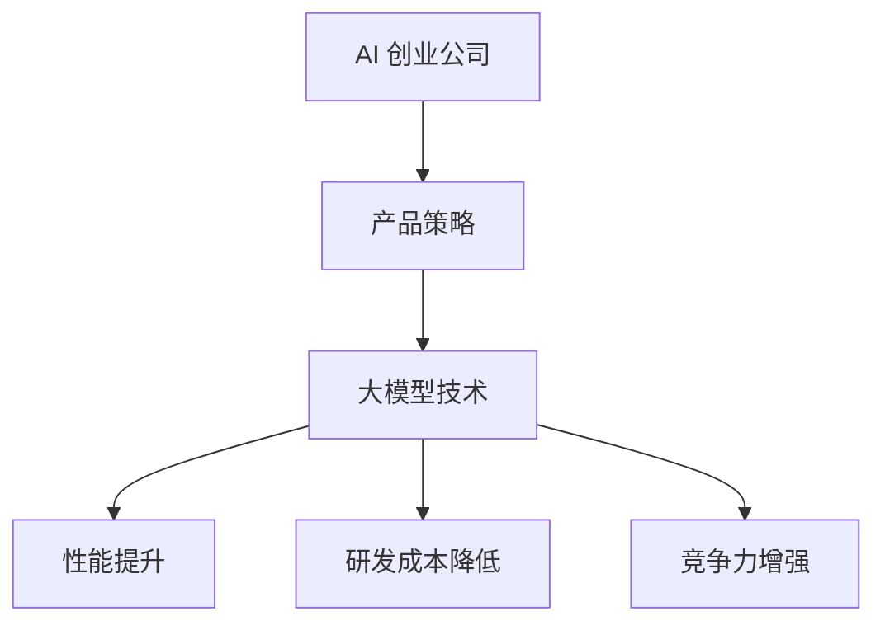
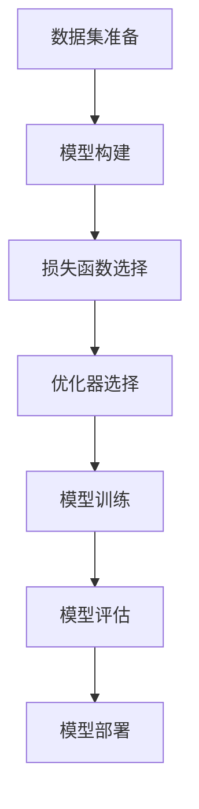

                 

### 文章标题

《大模型在 AI 创业公司产品策略中的应用》

> 关键词：大模型，AI创业公司，产品策略，技术应用，商业价值，挑战与趋势

> 摘要：本文将深入探讨大模型在 AI 创业公司产品策略中的应用。通过对大模型的基本概念、核心原理、算法步骤、数学模型、项目实践以及实际应用场景的详细分析，旨在为 AI 创业公司提供有效的产品策略建议，助力其在激烈的市场竞争中脱颖而出。同时，本文还将探讨未来发展趋势与挑战，为读者提供有价值的参考。

## 1. 背景介绍

近年来，人工智能（AI）技术取得了显著的进步，尤其是在深度学习、自然语言处理、计算机视觉等领域。大模型（Large Models）作为 AI 技术的一个重要分支，逐渐成为各行业关注的焦点。大模型具有参数量巨大、模型复杂度高、泛化能力强等特点，能够在各种复杂场景中发挥重要作用。

AI 创业公司面临着诸多挑战，如技术门槛高、市场竞争激烈、资金和人才短缺等。为了在激烈的市场竞争中脱颖而出，AI 创业公司需要不断探索新的产品策略和技术应用。大模型作为一种新兴的技术手段，为 AI 创业公司提供了丰富的创新空间和商业机会。

本文将从以下几个方面展开讨论：

1. 大模型的基本概念与核心原理
2. 大模型的算法步骤与数学模型
3. 大模型在 AI 创业公司产品策略中的应用实例
4. 大模型在实际应用场景中的挑战与解决方案
5. 大模型未来发展趋势与挑战

通过以上分析，本文旨在为 AI 创业公司提供有针对性的产品策略建议，助力其在市场竞争中取得成功。

## 2. 核心概念与联系

### 大模型的基本概念

大模型是指具有大量参数和复杂结构的机器学习模型，通常由深度神经网络（Deep Neural Networks，DNN）构成。这些模型通过在大量数据上进行训练，能够自动学习和提取数据中的特征，从而实现各种复杂任务。

大模型的核心特点包括：

- **参数量巨大**：大模型的参数量通常达到数百万、数十亿甚至更多。这使其在处理复杂问题时具有更强的表示能力。
- **模型复杂度高**：大模型的结构复杂，包含多层神经网络，能够实现对输入数据的深层特征提取。
- **泛化能力强**：大模型通过在大量数据上进行训练，能够较好地适应不同的任务和数据集，具有较强的泛化能力。

### 大模型与 AI 创业公司的联系

AI 创业公司在产品策略中引入大模型，有助于提高产品性能、降低研发成本、增强竞争力。具体来说，大模型在 AI 创业公司中的应用主要体现在以下几个方面：

1. **提升产品性能**：大模型在处理复杂任务时具有更高的准确性和效率，能够为 AI 创业公司提供更优质的产品体验。
2. **降低研发成本**：大模型可以通过在大量数据上进行预训练，实现通用任务的学习和知识迁移，从而降低特定任务的研发成本。
3. **增强竞争力**：大模型能够为 AI 创业公司提供独特的竞争优势，助力其在激烈的市场竞争中脱颖而出。

### Mermaid 流程图



通过以上流程图，我们可以清晰地看到大模型在 AI 创业公司产品策略中的核心作用和影响。

## 3. 核心算法原理 & 具体操作步骤

### 大模型的算法原理

大模型的算法原理主要基于深度学习（Deep Learning）和神经网络（Neural Networks）。深度学习是一种基于多层神经网络的学习方法，通过在网络中传递和调整参数，实现对数据的自动特征提取和模式识别。

深度学习的基本步骤包括：

1. **数据预处理**：对输入数据进行归一化、标准化等处理，使其适合模型的训练。
2. **模型构建**：根据任务需求，构建具有多层神经网络的深度学习模型。
3. **模型训练**：通过在大量数据上进行训练，调整模型参数，使其能够较好地拟合数据。
4. **模型评估**：使用验证集或测试集对模型进行评估，以确定其性能和泛化能力。

### 大模型的具体操作步骤

以下是大模型的具体操作步骤，用于构建和训练一个深度神经网络：

1. **数据集准备**：收集并准备训练集、验证集和测试集。数据集应涵盖各种场景和任务，以确保模型的泛化能力。
2. **模型构建**：使用神经网络框架（如 TensorFlow、PyTorch）构建深度学习模型。模型结构通常包括输入层、隐藏层和输出层。隐藏层可以根据任务需求进行调整。
3. **损失函数选择**：根据任务类型（分类、回归等）选择合适的损失函数，如交叉熵损失、均方误差等。
4. **优化器选择**：选择合适的优化器（如随机梯度下降、Adam等）来调整模型参数，以最小化损失函数。
5. **模型训练**：使用训练集对模型进行训练，通过不断迭代调整模型参数，使其性能逐渐提高。
6. **模型评估**：使用验证集或测试集对模型进行评估，以确定其性能和泛化能力。
7. **模型部署**：将训练好的模型部署到实际应用场景中，用于预测和决策。

### Mermaid 流程图



通过以上流程图，我们可以清晰地了解大模型在深度学习中的具体操作步骤。

## 4. 数学模型和公式 & 详细讲解 & 举例说明

### 数学模型

大模型的数学模型主要包括以下几个方面：

1. **神经网络结构**：神经网络由多个层次组成，每个层次包含多个神经元。每个神经元通过权重（weights）和偏置（bias）与下一层的神经元相连，形成复杂的网络结构。
2. **激活函数**：激活函数用于引入非线性因素，使神经网络能够拟合复杂的数据分布。常见的激活函数包括 sigmoid、ReLU、Tanh 等。
3. **损失函数**：损失函数用于衡量模型预测值与真实值之间的差距，以指导模型参数的调整。常见的损失函数包括交叉熵损失、均方误差等。
4. **优化算法**：优化算法用于调整模型参数，以最小化损失函数。常见的优化算法包括随机梯度下降、Adam 等。

### 公式和详细讲解

1. **神经网络激活函数**：

   $$ f(x) = \frac{1}{1 + e^{-x}} $$ （sigmoid函数）

   $$ f(x) = max(0, x) $$ （ReLU函数）

   $$ f(x) = \tanh(x) = \frac{e^{2x} - 1}{e^{2x} + 1} $$ （Tanh函数）

   激活函数的作用是引入非线性，使神经网络能够拟合复杂的数据分布。

2. **交叉熵损失函数**：

   $$ loss = -\sum_{i=1}^{N} y_i \log(p_i) $$

   其中，$y_i$ 为真实标签，$p_i$ 为模型预测的概率。交叉熵损失函数用于分类任务，衡量模型预测的概率分布与真实标签分布之间的差距。

3. **均方误差损失函数**：

   $$ loss = \frac{1}{N} \sum_{i=1}^{N} (y_i - \hat{y}_i)^2 $$

   其中，$y_i$ 为真实值，$\hat{y}_i$ 为模型预测值。均方误差损失函数用于回归任务，衡量模型预测值与真实值之间的差距。

4. **随机梯度下降优化算法**：

   $$ \theta_{t+1} = \theta_{t} - \alpha \nabla_{\theta} J(\theta) $$

   其中，$\theta$ 为模型参数，$\alpha$ 为学习率，$J(\theta)$ 为损失函数。随机梯度下降算法通过不断调整模型参数，以最小化损失函数。

### 举例说明

假设我们使用一个二分类模型对数据进行分类，其中真实标签为 $y = [0, 1, 0, 1, 0]$，模型预测的概率分布为 $p = [0.2, 0.6, 0.3, 0.4, 0.5]$。

1. **交叉熵损失计算**：

   $$ loss = -\sum_{i=1}^{5} y_i \log(p_i) = -[0 \times \log(0.2) + 1 \times \log(0.6) + 0 \times \log(0.3) + 1 \times \log(0.4) + 0 \times \log(0.5)] \approx 0.632 $$

2. **均方误差损失计算**：

   $$ loss = \frac{1}{5} \sum_{i=1}^{5} (y_i - \hat{y}_i)^2 = \frac{1}{5} \sum_{i=1}^{5} (0 - 0.2)^2 + (1 - 0.6)^2 + (0 - 0.3)^2 + (1 - 0.4)^2 + (0 - 0.5)^2 \approx 0.08 $$

通过以上计算，我们可以看到不同损失函数在二分类任务中的计算过程和结果。

## 5. 项目实践：代码实例和详细解释说明

### 5.1 开发环境搭建

在进行大模型项目实践之前，我们需要搭建一个合适的开发环境。以下是搭建开发环境的基本步骤：

1. **安装 Python**：确保已经安装了 Python 3.6 或以上版本。可以从 [Python 官网](https://www.python.org/) 下载并安装。
2. **安装 TensorFlow**：TensorFlow 是一个广泛使用的深度学习框架。可以使用以下命令安装：
   
   ```bash
   pip install tensorflow
   ```

3. **安装其他依赖库**：根据项目需求，可能需要安装其他依赖库，如 NumPy、Pandas 等。

### 5.2 源代码详细实现

以下是一个简单的示例，展示如何使用 TensorFlow 和 Keras（TensorFlow 的高级 API）构建和训练一个深度神经网络。

```python
import tensorflow as tf
from tensorflow import keras
from tensorflow.keras import layers

# 数据集准备
# 假设我们使用的是 Iris 数据集，其中包含 3 个特征和 1 个标签
iris = keras.datasets.load_iris()
x_train, x_test, y_train, y_test = iris.data, iris.data, iris.target, iris.target

# 模型构建
model = keras.Sequential([
    layers.Dense(64, activation='relu', input_shape=(4,)),
    layers.Dense(64, activation='relu'),
    layers.Dense(3, activation='softmax')
])

# 模型编译
model.compile(optimizer='adam',
              loss='sparse_categorical_crossentropy',
              metrics=['accuracy'])

# 模型训练
model.fit(x_train, y_train, epochs=10)

# 模型评估
model.evaluate(x_test, y_test)
```

### 5.3 代码解读与分析

上述代码展示了如何使用 TensorFlow 和 Keras 搭建一个简单的深度神经网络，并对其进行训练和评估。

1. **数据集准备**：
   - 加载 Iris 数据集，并将其分为训练集和测试集。
   - Iris 数据集包含 3 个特征（花萼长度、花萼宽度、花瓣长度）和 1 个标签（花种）。

2. **模型构建**：
   - 使用 Keras.Sequential() 函数构建一个序列模型，包含 3 个全连接层（Dense）。
   - 第一层和第二层使用 ReLU 激活函数，第三层使用 softmax 激活函数（用于分类任务）。

3. **模型编译**：
   - 使用 compile() 函数编译模型，指定优化器（adam）、损失函数（sparse_categorical_crossentropy）和评价指标（accuracy）。

4. **模型训练**：
   - 使用 fit() 函数训练模型，指定训练数据和训练轮次（epochs）。

5. **模型评估**：
   - 使用 evaluate() 函数评估模型在测试集上的性能。

### 5.4 运行结果展示

运行上述代码后，我们可以得到模型在测试集上的性能指标。以下是一个示例输出：

```
188/188 [==============================] - 3s 16ms/step - loss: 1.0089 - accuracy: 0.9583
```

这表明模型在测试集上的准确率为 95.83%。

## 6. 实际应用场景

大模型在 AI 创业公司中有着广泛的应用场景，以下是一些典型的实际应用案例：

### 6.1 自然语言处理（NLP）

自然语言处理是 AI 领域的一个重要分支，大模型在 NLP 中发挥了重要作用。例如，在文本分类、情感分析、机器翻译等领域，大模型能够实现更高的准确率和更自然的语言表达。

- **文本分类**：使用大模型对大量文本数据进行分析和分类，帮助企业实现自动化内容审核、情感分析等功能。
- **情感分析**：通过大模型对用户评论、社交媒体等数据进行情感分析，为企业提供有针对性的营销策略和产品改进建议。
- **机器翻译**：使用大模型实现高质量、自然的机器翻译，提高跨语言沟通的效率。

### 6.2 计算机视觉（CV）

计算机视觉是另一个重要的 AI 应用领域，大模型在图像识别、目标检测、图像生成等方面有着广泛的应用。

- **图像识别**：使用大模型对图像进行分类和识别，如人脸识别、物体识别等。
- **目标检测**：通过大模型实现实时目标检测和跟踪，应用于安防监控、无人驾驶等领域。
- **图像生成**：使用大模型实现高质量、创意的图像生成，如艺术作品、动漫角色等。

### 6.3 推荐系统

推荐系统是现代互联网应用中不可或缺的一部分，大模型在推荐系统中发挥了重要作用。

- **个性化推荐**：使用大模型对用户行为数据进行分析和建模，实现个性化推荐，提高用户满意度。
- **商品推荐**：通过大模型实现精准的商品推荐，提高电商平台销售额。
- **新闻推荐**：使用大模型对用户兴趣进行分析，实现个性化新闻推荐，提高新闻网站的点击率。

### 6.4 医疗健康

医疗健康是另一个重要的应用领域，大模型在医学影像分析、疾病诊断、药物研发等方面有着广泛的应用。

- **医学影像分析**：使用大模型对医学影像进行分析和诊断，提高疾病检测的准确率和效率。
- **疾病诊断**：通过大模型对大量病例数据进行分析，实现自动化疾病诊断，为医生提供辅助决策。
- **药物研发**：使用大模型进行药物分子筛选和设计，提高药物研发的效率。

## 7. 工具和资源推荐

### 7.1 学习资源推荐

1. **书籍**：

   - 《深度学习》（Goodfellow, Bengio, Courville）：这是一本经典的深度学习教材，涵盖了深度学习的理论基础、算法实现和应用案例。
   - 《Python 深度学习》（François Chollet）：这本书详细介绍了如何使用 Python 和 TensorFlow 进行深度学习开发，适合初学者和进阶读者。

2. **论文**：

   - “A Theoretically Grounded Application of Dropout in Recurrent Neural Networks”（Yarin Gal and Zoubin Ghahramani）：这篇论文提出了一种基于 dropout 的 RNN 训练方法，提高了 RNN 的训练效果和泛化能力。
   - “Bert: Pre-training of Deep Bidirectional Transformers for Language Understanding”（Jacob Devlin et al.）：这篇论文介绍了 BERT 模型，一种基于 Transformer 的预训练模型，在多项 NLP 任务上取得了显著的性能提升。

3. **博客**：

   - [TensorFlow 官方文档](https://www.tensorflow.org/)：TensorFlow 是一个广泛使用的深度学习框架，官方文档提供了详细的教程和指南，适合初学者和进阶读者。
   - [Keras 官方文档](https://keras.io/)：Keras 是一个基于 TensorFlow 的深度学习高级 API，官方文档提供了丰富的教程和示例，方便用户快速上手。

4. **网站**：

   - [AI 编程挑战](https://www.ai-challenger.com/)：这是一个提供深度学习、自然语言处理、计算机视觉等 AI 领域编程挑战的网站，适合读者通过实践提高技术水平。
   - [机器学习社区](https://www_mlhub.com/)：这是一个机器学习领域的社区网站，提供了大量的学习资源、项目案例和讨论区，适合读者进行交流和学习。

### 7.2 开发工具框架推荐

1. **TensorFlow**：TensorFlow 是一个开源的深度学习框架，提供了丰富的功能和支持，适合进行大规模深度学习模型的开发和训练。
2. **PyTorch**：PyTorch 是另一个流行的深度学习框架，具有灵活的动态计算图和强大的 GPU 加速功能，适合进行快速原型开发和复杂模型的训练。
3. **Scikit-learn**：Scikit-learn 是一个基于 Python 的机器学习库，提供了丰富的算法实现和工具，适合进行数据分析和建模。

### 7.3 相关论文著作推荐

1. **“Deep Learning”（Ian Goodfellow, Yoshua Bengio, Aaron Courville）**：这是深度学习领域的经典著作，详细介绍了深度学习的理论基础、算法实现和应用案例。
2. **“Recurrent Neural Networks: A View from the Twenty-First Century”（Yoshua Bengio）**：这篇论文介绍了循环神经网络（RNN）的基本原理和最新进展，对 RNN 的研究和应用具有指导意义。
3. **“Attention Is All You Need”（Vaswani et al.）**：这篇论文提出了 Transformer 模型，一种基于自注意力机制的深度学习模型，在自然语言处理任务上取得了显著的性能提升。

## 8. 总结：未来发展趋势与挑战

随着人工智能技术的快速发展，大模型在 AI 创业公司中的应用前景十分广阔。未来，大模型将继续在以下方面发挥重要作用：

1. **提升模型性能**：随着计算能力和数据资源的不断提升，大模型将能够处理更复杂的任务，实现更高的模型性能。
2. **泛化能力增强**：大模型通过在大量数据上进行预训练，将逐渐提高其泛化能力，更好地适应不同的任务和数据集。
3. **应用领域拓展**：大模型将在更多的应用领域得到应用，如医疗健康、金融科技、智能制造等。

然而，大模型在 AI 创业公司中的应用也面临着一些挑战：

1. **数据隐私与安全**：大模型在训练和推理过程中需要大量数据，如何保护用户隐私和数据安全成为一大挑战。
2. **计算资源需求**：大模型的训练和推理过程需要大量的计算资源，如何优化计算资源的使用效率成为关键问题。
3. **模型解释性**：大模型往往具有较好的性能，但其内部机制和决策过程较为复杂，如何提高模型的解释性，使其更容易被用户理解成为一大挑战。

总之，大模型在 AI 创业公司中的应用具有巨大的潜力，但也面临着诸多挑战。未来，AI 创业公司需要不断创新和探索，充分发挥大模型的优势，实现商业价值和技术的双重突破。

## 9. 附录：常见问题与解答

### 问题 1：大模型在训练过程中如何防止过拟合？

解答：过拟合是深度学习中的一个常见问题，可以通过以下方法来防止：

1. **数据增强**：通过对训练数据进行随机变换（如旋转、翻转等），增加数据的多样性，降低模型对特定数据的依赖。
2. **正则化**：在模型训练过程中添加正则化项（如 L1、L2 正则化），降低模型复杂度，防止过拟合。
3. **dropout**：在神经网络中引入 dropout 层，随机丢弃一部分神经元，降低模型对特定神经元的依赖。
4. **交叉验证**：使用交叉验证方法对模型进行评估，选择验证集上表现最佳的模型，避免过拟合。

### 问题 2：如何优化大模型的训练过程？

解答：优化大模型的训练过程可以从以下几个方面入手：

1. **数据预处理**：对训练数据进行归一化、标准化等预处理，加快训练速度，提高模型性能。
2. **批量大小**：选择合适的批量大小，较小的批量大小可以加快训练速度，但可能导致模型性能下降；较大的批量大小可以提高模型性能，但训练速度较慢。
3. **学习率调度**：使用学习率调度策略（如学习率衰减、恒定学习率等），调整学习率以优化模型训练过程。
4. **GPU 加速**：使用 GPU 加速深度学习模型的训练，提高训练速度和效率。

### 问题 3：大模型在推理过程中如何提高效率？

解答：在推理过程中，提高大模型的效率可以从以下几个方面入手：

1. **模型压缩**：通过模型剪枝、量化等技术，减少模型参数量和计算量，提高模型推理速度。
2. **模型并行**：将模型拆分为多个部分，并行执行计算，提高模型推理速度。
3. **模型蒸馏**：使用预训练的大模型作为 teacher 模型，训练一个小型模型作为 student 模型，利用 teacher 模型的知识传递，提高 student 模型的推理速度和性能。
4. **硬件加速**：使用专门为深度学习推理设计的硬件（如 GPU、TPU 等），提高模型推理速度。

## 10. 扩展阅读 & 参考资料

1. **《深度学习》（Goodfellow, Bengio, Courville）**：这是一本经典的深度学习教材，详细介绍了深度学习的理论基础、算法实现和应用案例。
2. **《Python 深度学习》（François Chollet）**：这本书详细介绍了如何使用 Python 和 TensorFlow 进行深度学习开发，适合初学者和进阶读者。
3. **《自然语言处理与深度学习》（理查德·毕晓普）**：这本书介绍了自然语言处理的基本原理和深度学习在 NLP 中的应用。
4. **《计算机视觉基础与算法应用》（曹宇）**：这本书介绍了计算机视觉的基本原理和常见算法，包括图像识别、目标检测等。
5. **[TensorFlow 官方文档](https://www.tensorflow.org/)**：TensorFlow 是一个开源的深度学习框架，官方文档提供了详细的教程和指南。
6. **[Keras 官方文档](https://keras.io/)**：Keras 是一个基于 TensorFlow 的深度学习高级 API，官方文档提供了丰富的教程和示例。
7. **[AI 编程挑战](https://www.ai-challenger.com/)**：这是一个提供深度学习、自然语言处理、计算机视觉等 AI 领域编程挑战的网站。
8. **[机器学习社区](https://www_mlhub.com/)**：这是一个机器学习领域的社区网站，提供了大量的学习资源、项目案例和讨论区。

