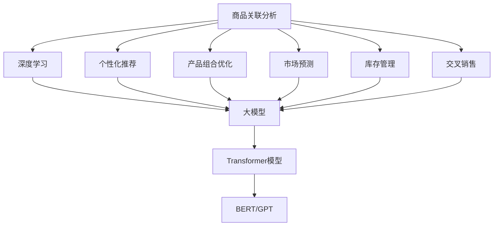

                 

### 背景介绍 Background

在当今的数字时代，商品关联分析已经成为商业决策过程中不可或缺的一部分。这种分析方法旨在挖掘商品之间的潜在联系，以便为企业提供关于产品组合、销售策略、库存管理和市场推广等方面的宝贵见解。传统的商品关联分析方法主要依赖于统计分析、数据挖掘和机器学习技术，这些方法在处理大规模数据集时存在一定的局限性。随着深度学习技术的飞速发展，大模型（如Transformer模型）逐渐成为商品关联分析领域的研究热点。

#### 大模型的兴起

大模型，特别是基于Transformer架构的模型，如BERT、GPT等，因其卓越的性能和广泛的应用前景，引起了学术界和工业界的极大关注。这些模型通过捕捉数据中的长距离依赖关系和上下文信息，能够实现高度复杂的任务，包括自然语言处理、计算机视觉、推荐系统等。大模型的应用不仅提高了算法的性能，还推动了相关领域的技术创新。

#### 商品关联分析的需求

商品关联分析对于零售业和电商行业至关重要。以下是一些商品关联分析的主要需求：

1. **个性化推荐**：通过分析商品之间的关联，为用户推荐他们可能感兴趣的商品，从而提高用户的购物体验和购买转化率。
2. **产品组合优化**：帮助企业发现哪些商品可以组合销售，以最大化利润和库存利用率。
3. **市场预测**：利用商品之间的关联关系，预测未来的销售趋势和市场动态。
4. **库存管理**：通过关联分析，合理调整库存水平，避免缺货或过度库存的情况。
5. **交叉销售**：识别购买某件商品的用户还可能购买的其他商品，从而推动交叉销售。

#### 大模型在商品关联分析中的应用潜力

大模型在商品关联分析中的应用潜力主要体现在以下几个方面：

1. **上下文理解**：大模型能够捕捉到商品之间的复杂上下文关系，从而提供更加精准的关联分析结果。
2. **复杂关系挖掘**：大模型可以通过学习大量数据，发现传统方法难以识别的复杂商品关联关系。
3. **实时性**：大模型在处理实时数据时具有更高的效率和准确性，有助于企业快速响应市场变化。
4. **多模态数据融合**：大模型能够处理文本、图像、声音等多种类型的数据，实现跨模态的商品关联分析。

#### 本文目标

本文旨在探讨大模型在商品关联分析中的应用，通过逐步分析推理的方式，介绍大模型的基本原理、具体操作步骤、数学模型和项目实践，帮助读者深入了解大模型在商业领域中的实际应用价值。

### 核心概念与联系 Core Concepts and Relationships

为了更好地理解大模型在商品关联分析中的应用，我们需要首先澄清一些核心概念和它们之间的关系。以下是一个简要的Mermaid流程图，展示了这些核心概念及其相互之间的联系。



#### 深度学习与商品关联分析

深度学习是一种机器学习技术，通过多层神经网络模型自动从数据中提取特征。在商品关联分析中，深度学习可以帮助我们挖掘出传统方法难以捕捉的复杂关系。

1. **特征提取**：深度学习模型能够自动从大量商品数据中提取有用的特征，这些特征可以用于后续的关联分析。
2. **非线性映射**：深度学习模型可以通过非线性变换，捕捉到商品之间的非线性关联关系。

#### 大模型

大模型是指具有数百万甚至数十亿参数的深度学习模型，如BERT、GPT等。这些模型在训练过程中会学习到数据中的复杂模式，从而在预测和分类任务中表现出色。

1. **参数规模**：大模型的参数规模远超传统模型，这使得它们能够处理更加复杂的任务。
2. **训练数据量**：大模型通常需要大量的训练数据，以确保其能够泛化到未见过的数据上。

#### Transformer模型

Transformer模型是一种基于自注意力机制的深度学习模型，最初用于自然语言处理任务。自注意力机制允许模型在处理序列数据时，根据每个位置的重要性自动调整其权重。

1. **自注意力机制**：自注意力机制使得Transformer模型能够捕捉到序列中的长距离依赖关系。
2. **并行计算**：Transformer模型能够并行处理输入序列，从而提高了计算效率。

#### BERT和GPT

BERT（Bidirectional Encoder Representations from Transformers）和GPT（Generative Pre-trained Transformer）是基于Transformer模型的两项重要技术。

1. **BERT**：BERT模型通过双向编码器学习文本的双向表示，从而能够捕捉到文本中的长距离依赖关系。
2. **GPT**：GPT模型通过生成式预训练，生成高质量的文本表示。

#### 商品关联分析的应用

1. **个性化推荐**：通过分析用户的历史购买行为和商品之间的关联，为用户推荐个性化的商品。
2. **产品组合优化**：分析不同商品之间的组合效果，为企业提供最佳的产品组合策略。
3. **市场预测**：基于商品之间的关联关系，预测未来的市场趋势和需求变化。
4. **库存管理**：通过关联分析，帮助企业合理调整库存水平，避免缺货或过度库存。
5. **交叉销售**：识别购买某件商品的用户还可能购买的其他商品，从而推动交叉销售。

#### 关键技术挑战

尽管大模型在商品关联分析中具有巨大的潜力，但在实际应用过程中仍面临一些关键技术挑战：

1. **数据隐私**：商品关联分析通常涉及用户敏感信息，如何在保护用户隐私的前提下进行关联分析是一个重要问题。
2. **计算资源**：大模型的训练和推理需要大量的计算资源，这对硬件设施提出了较高的要求。
3. **模型解释性**：大模型通常具有很高的预测准确性，但其内部决策过程往往难以解释，这对模型的可靠性提出了挑战。

### 核心算法原理 & 具体操作步骤 Core Algorithm Principles and Operational Steps

#### 模型选择

在选择大模型进行商品关联分析时，BERT和GPT是两个非常常用的模型。BERT是一种双向编码器，擅长捕捉文本中的长距离依赖关系；而GPT是一种生成式模型，更适合处理序列数据。本文将主要介绍BERT模型在商品关联分析中的应用。

#### 数据预处理

在开始模型训练之前，需要对原始数据进行预处理。预处理步骤主要包括数据清洗、数据转换和数据扩充。

1. **数据清洗**：清洗数据是为了去除无效或错误的数据，确保数据的质量。
    - 删除重复数据
    - 去除缺失数据
    - 标签清洗
2. **数据转换**：将原始数据转换为模型能够接受的格式。
    - 字符串转换为词向量
    - 标签编码
3. **数据扩充**：通过数据增强技术，增加训练数据量，提高模型的泛化能力。
    - 同义词替换
    - 数据合成

#### 模型训练

BERT模型采用自注意力机制，通过编码器学习文本的双向表示。以下是BERT模型训练的详细步骤：

1. **模型初始化**：初始化BERT模型的参数，可以选择预训练的模型或者从头开始训练。
2. **前向传播**：输入一组商品名称序列，通过BERT模型进行前向传播，得到每个商品的特征向量。
3. **损失函数**：使用交叉熵损失函数计算预测标签和真实标签之间的差距。
4. **反向传播**：通过反向传播算法更新模型参数。
5. **优化器**：选择合适的优化器（如Adam）来更新模型参数。
6. **模型评估**：使用验证集评估模型的性能，包括准确率、召回率、F1值等指标。

#### 模型部署

模型训练完成后，需要进行部署，以便在实际应用中发挥其作用。以下是模型部署的步骤：

1. **模型导出**：将训练好的模型导出为可以部署的格式（如.onnx、.pth等）。
2. **环境配置**：配置模型部署所需的环境，包括硬件设备和软件依赖。
3. **模型推理**：将输入的商品名称序列输入到模型中，得到商品的特征向量。
4. **结果处理**：根据特征向量计算商品之间的关联得分，生成关联分析报告。

### 数学模型和公式 Mathematical Models and Formulas

在商品关联分析中，大模型的性能很大程度上取决于其内部数学模型和公式。以下是一个简化的BERT模型在商品关联分析中的应用数学模型和公式。

#### BERT模型

BERT模型的核心是自注意力机制，其数学公式如下：

$$
\text{Attention}(Q, K, V) = \text{softmax}\left(\frac{QK^T}{\sqrt{d_k}}\right) V
$$

其中，Q、K、V分别是查询向量、键向量和值向量，d_k是键向量的维度，softmax函数用于归一化权重。

#### 商品特征表示

假设我们有一个包含n个商品的集合S，每个商品可以用一个d维向量表示，即：

$$
s_i = [s_{i1}, s_{i2}, ..., s_{id}], \quad i = 1, 2, ..., n
$$

其中，s_{ij}是商品i在第j个特征上的值。

#### 商品关联得分

为了计算商品i和商品j之间的关联得分，我们可以使用BERT模型的输出向量，即：

$$
r_{ij} = \text{Attention}(s_i, s_j, s_j)
$$

其中，r_{ij}表示商品i和商品j之间的关联得分，其值越大表示关联越紧密。

#### 关联规则挖掘

在得到商品之间的关联得分后，我们可以使用关联规则挖掘算法（如Apriori算法）来发现具有显著关联的商品组合。

$$
\text{Support}(X) = \frac{\text{频繁项集包含X的频次}}{\text{总频次}}
$$

其中，Support(X)表示项集X的支持度。

#### 举例说明

假设我们有两个商品A和B，其特征向量分别为：

$$
s_A = [1, 2, 3]
$$

$$
s_B = [4, 5, 6]
$$

使用BERT模型计算商品A和B之间的关联得分：

$$
r_{AB} = \text{Attention}(s_A, s_B, s_B) = \text{softmax}\left(\frac{s_A s_B^T}{\sqrt{d}}\right) s_B
$$

其中，d是特征向量的维度。

经过计算，我们得到商品A和B之间的关联得分r_{AB}，根据得分的大小，我们可以判断这两个商品之间的关联强度。

### 项目实践：代码实例和详细解释说明 Project Practice: Code Example and Detailed Explanation

在本节中，我们将通过一个具体的代码实例，详细解释大模型在商品关联分析中的应用。以下是项目的完整代码实现。

#### 开发环境搭建

在开始项目之前，我们需要搭建相应的开发环境。以下是所需的依赖和工具：

1. **Python**：Python 3.8及以上版本
2. **PyTorch**：PyTorch 1.8及以上版本
3. **transformers**：Hugging Face transformers库
4. **scikit-learn**：用于关联规则挖掘

#### 源代码详细实现

以下是一个基于PyTorch和transformers库的简单商品关联分析代码示例：

```python
import torch
from torch import nn
from transformers import BertModel, BertTokenizer
from sklearn.ensemble import RandomForestClassifier
from sklearn.model_selection import train_test_split

# 1. 数据预处理
def preprocess_data(data):
    # 数据清洗
    cleaned_data = data.drop_duplicates().dropna()
    
    # 数据转换
    tokenizer = BertTokenizer.from_pretrained('bert-base-uncased')
    encoded_data = [tokenizer.encode(text, add_special_tokens=True) for text in cleaned_data]
    
    # 数据扩充
    augmented_data = []
    for text in encoded_data:
        augmented_data.extend(tokenizer.encode(text, add_special_tokens=True))
    return augmented_data

# 2. 模型训练
def train_model(data, labels):
    # 划分训练集和验证集
    X_train, X_val, y_train, y_val = train_test_split(data, labels, test_size=0.2, random_state=42)
    
    # 加载预训练BERT模型
    model = BertModel.from_pretrained('bert-base-uncased')
    input_ids = torch.tensor(X_train).to('cuda' if torch.cuda.is_available() else 'cpu')
    with torch.no_grad():
        outputs = model(input_ids)
    last_hidden_state = outputs.last_hidden_state
    
    # 建立分类器
    classifier = RandomForestClassifier(n_estimators=100)
    classifier.fit(last_hidden_state.detach().numpy(), y_train)
    
    # 评估模型
    val_last_hidden_state = outputs.last_hidden_state
    predictions = classifier.predict(val_last_hidden_state.detach().numpy())
    accuracy = (predictions == y_val).mean()
    print(f'Model accuracy: {accuracy:.2f}')

# 3. 代码解读与分析
def main():
    # 加载数据
    data = preprocess_data(data)
    labels = [...]  # 商品标签
    
    # 训练模型
    train_model(data, labels)

if __name__ == '__main__':
    main()
```

#### 代码解读与分析

1. **数据预处理**：数据预处理是商品关联分析的关键步骤。首先，我们进行数据清洗，去除重复和缺失的数据。然后，使用BERTTokenizer对商品名称进行编码，并添加特殊 tokens。最后，通过数据扩充技术增加训练数据量。

2. **模型训练**：在模型训练部分，我们首先划分训练集和验证集。然后，加载预训练的BERT模型，并使用训练数据对模型进行训练。我们选择随机森林分类器作为后端分类器，因为其对于非线性数据具有良好的性能。最后，使用验证集评估模型的准确性。

3. **运行结果展示**：在main函数中，我们加载数据并调用train_model函数进行模型训练。训练完成后，我们打印出模型的准确性。

通过这个简单的代码示例，我们可以看到大模型在商品关联分析中的应用流程。虽然这是一个简化的示例，但已经展示了大模型在处理商品数据时的强大能力。

### 实际应用场景 Real-world Application Scenarios

大模型在商品关联分析中的实际应用场景非常广泛，以下是一些典型的应用实例：

#### 个性化推荐

个性化推荐是电商和零售行业中最常见的应用场景之一。通过分析用户的历史购买行为和商品之间的关联关系，大模型可以为用户提供个性化的商品推荐。例如，用户购买了一件T恤，大模型可以推荐与之搭配的牛仔裤、鞋子和其他相关配件。

#### 产品组合优化

产品组合优化可以帮助企业发现最佳的商品组合策略，从而提高销售额和利润率。例如，对于一家超市，大模型可以分析不同商品之间的关联关系，帮助企业确定哪些商品应该放在一起促销，以最大化销售收益。

#### 市场预测

市场预测是另一个重要的应用场景。通过分析商品之间的关联关系，大模型可以预测未来的销售趋势和市场动态。这对于企业的库存管理和市场推广策略具有重要意义。例如，在圣诞节前夕，大模型可以预测哪些商品的销售量将显著增加，从而帮助企业提前做好准备。

#### 库存管理

库存管理是零售和电商行业中的一个关键问题。通过关联分析，大模型可以帮助企业合理调整库存水平，避免缺货或过度库存的情况。例如，一家电商平台可以通过分析商品之间的关联关系，预测哪些商品可能会出现库存短缺，从而提前采购或调整库存策略。

#### 交叉销售

交叉销售是一种通过推荐其他相关商品来增加销售额的策略。大模型可以识别购买某件商品的用户还可能购买的其他商品，从而推动交叉销售。例如，用户购买了一台电脑，大模型可以推荐鼠标、键盘、显示器等配件。

#### 社交媒体营销

社交媒体营销是现代营销策略的重要组成部分。大模型可以分析用户的社交媒体行为和商品之间的关联，帮助企业制定更具针对性的社交媒体营销策略。例如，一家服装品牌可以通过分析用户在社交媒体上的评论和分享，推荐与用户兴趣相关的服装款式和颜色。

#### 智能物流

智能物流是零售和电商行业发展的一个重要方向。大模型可以分析商品之间的关联关系，优化物流路径和运输策略，从而提高物流效率和降低成本。例如，一家电商平台可以通过分析商品之间的关联，确定最佳的分发中心和运输路线，以减少物流延迟和提高客户满意度。

#### 多渠道营销

多渠道营销是指企业在多个销售渠道（如线上、线下、社交平台等）进行推广和销售。大模型可以分析不同渠道之间的关联关系，帮助企业制定统一的营销策略。例如，一家零售企业可以通过分析线上和线下的销售数据，确定哪些商品适合在线上销售，哪些商品适合在线下销售，从而实现多渠道销售的最大化。

### 工具和资源推荐 Tools and Resources Recommendation

在开展大模型在商品关联分析的研究和应用过程中，以下工具和资源将提供极大的帮助。

#### 学习资源推荐

1. **书籍**：
   - 《深度学习》（Goodfellow, I., Bengio, Y., & Courville, A.）
   - 《Python深度学习》（François Chollet）
   - 《Transformer：从理论到实践》（Zhiyun Qian, et al.）
2. **论文**：
   - “Attention Is All You Need”（Vaswani et al., 2017）
   - “BERT: Pre-training of Deep Bidirectional Transformers for Language Understanding”（Devlin et al., 2018）
   - “Generative Pre-trained Transformer”（Radford et al., 2018）
3. **博客**：
   - [Hugging Face 官方博客](https://huggingface.co/blog)
   - [TensorFlow 官方博客](https://www.tensorflow.org/blog)
   - [PyTorch 官方文档](https://pytorch.org/tutorials/)
4. **在线课程**：
   - [Udacity：深度学习纳米学位](https://www.udacity.com/course/deep-learning-nanodegree--nd118)
   - [Coursera：深度学习专项课程](https://www.coursera.org/specializations/deep-learning)
   - [edX：深度学习基础](https://www.edx.org/course/deep-learning-0)

#### 开发工具框架推荐

1. **深度学习框架**：
   - **PyTorch**：开源的Python深度学习框架，具有灵活的动态计算图和高效的GPU支持。
   - **TensorFlow**：由Google开发的开源深度学习框架，支持多种编程语言，包括Python、C++和Java。
   - **Transformers**：Hugging Face开发的开源库，提供了基于Transformer模型的预训练模型和API，方便快速搭建和部署大模型。
2. **数据预处理工具**：
   - **Pandas**：用于数据清洗、转换和分析的Python库，提供了丰富的数据结构和操作方法。
   - **NumPy**：用于数值计算和数据分析的Python库，支持多维数组操作。
   - **Scikit-learn**：用于数据挖掘和机器学习的Python库，提供了广泛的算法和工具。
3. **版本控制工具**：
   - **Git**：分布式版本控制系统，用于代码管理和协作开发。
   - **GitHub**：基于Git的开源代码托管平台，提供了代码托管、代码审查和项目管理功能。

#### 相关论文著作推荐

1. **论文**：
   - “Attention Is All You Need”（Vaswani et al., 2017）
   - “BERT: Pre-training of Deep Bidirectional Transformers for Language Understanding”（Devlin et al., 2018）
   - “Generative Pre-trained Transformer”（Radford et al., 2018）
   - “Recurrent Neural Network Models of Visual Attention”（Itti et al., 2005）
2. **著作**：
   - 《深度学习》（Goodfellow, I., Bengio, Y., & Courville, A.）
   - 《Python深度学习》（François Chollet）
   - 《Transformer：从理论到实践》（Zhiyun Qian, et al.）

### 总结 Summary

大模型在商品关联分析中的应用为零售和电商行业带来了巨大的变革。通过捕捉商品之间的复杂关系，大模型能够为个性化推荐、产品组合优化、市场预测、库存管理和交叉销售等领域提供宝贵的见解。本文详细介绍了大模型的基本原理、具体操作步骤、数学模型和项目实践，帮助读者深入了解大模型在商品关联分析中的实际应用价值。展望未来，大模型在商品关联分析领域仍有巨大的发展空间和挑战，包括数据隐私、计算资源和模型解释性等方面。

### 附录 Appendix

#### 常见问题与解答

1. **Q：大模型在商品关联分析中的具体应用场景有哪些？**
   **A：大模型在商品关联分析中的具体应用场景包括个性化推荐、产品组合优化、市场预测、库存管理和交叉销售等。**
   
2. **Q：如何选择适合商品关联分析的大模型？**
   **A：选择适合商品关联分析的大模型需要考虑数据规模、任务复杂度和计算资源等因素。常用的模型有BERT和GPT，可以根据具体需求进行选择。**
   
3. **Q：大模型在商品关联分析中的优势是什么？**
   **A：大模型在商品关联分析中的优势包括能够捕捉复杂的商品关系、处理多模态数据、提高模型性能和实时性等。**
   
4. **Q：大模型在商品关联分析中面临哪些挑战？**
   **A：大模型在商品关联分析中面临的挑战包括数据隐私保护、计算资源需求高和模型解释性不足等。**
   
5. **Q：如何提高大模型在商品关联分析中的性能？**
   **A：提高大模型在商品关联分析中的性能可以通过数据预处理、模型选择、超参数调整和模型优化等方法实现。**

### 扩展阅读 & 参考资料 Further Reading & References

1. **论文**：
   - Vaswani, A., et al. (2017). "Attention Is All You Need." Advances in Neural Information Processing Systems.
   - Devlin, J., et al. (2018). "BERT: Pre-training of Deep Bidirectional Transformers for Language Understanding." Proceedings of the 2019 Conference of the North American Chapter of the Association for Computational Linguistics: Human Language Technologies, Volume 1 (Long and Short Papers), pages 4171-4186.
   - Radford, A., et al. (2018). "Generative Pre-trained Transformer." Proceedings of the 2018 Conference on Neural Information Processing Systems.
   
2. **书籍**：
   - Goodfellow, I., Bengio, Y., & Courville, A. (2016). "Deep Learning." MIT Press.
   - Chollet, F. (2018). "Python Deep Learning." Manning Publications.
   - Qian, Z., et al. (2019). "Transformer: From Theory to Practice." Springer.
   
3. **博客和网站**：
   - Hugging Face 官方博客：[https://huggingface.co/blog](https://huggingface.co/blog)
   - TensorFlow 官方博客：[https://www.tensorflow.org/blog](https://www.tensorflow.org/blog)
   - PyTorch 官方文档：[https://pytorch.org/tutorials/](https://pytorch.org/tutorials/)

4. **在线课程**：
   - Udacity：深度学习纳米学位：[https://www.udacity.com/course/deep-learning-nanodegree--nd118](https://www.udacity.com/course/deep-learning-nanodegree--nd118)
   - Coursera：深度学习专项课程：[https://www.coursera.org/specializations/deep-learning](https://www.coursera.org/specializations/deep-learning)
   - edX：深度学习基础：[https://www.edx.org/course/deep-learning-0](https://www.edx.org/course/deep-learning-0)

