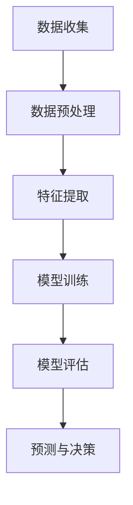
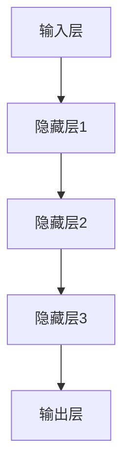
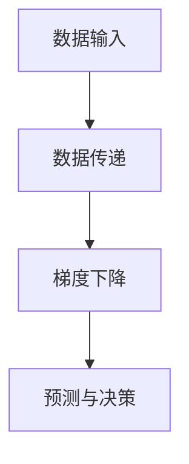
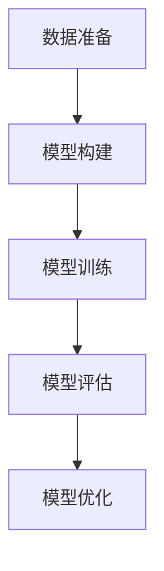

                 

### 1. 背景介绍

在现代商业环境中，商品库存的管理已经成为企业运营中的一个关键环节。有效的库存管理不仅能够帮助企业降低成本、提高利润，还能够确保商品供应的及时性，满足客户的需求。然而，随着市场需求的不断变化和商品种类的日益多样化，传统的库存管理方式面临着越来越多的挑战。这时，大模型在商品库存智能管理中的应用应运而生，成为解决这一问题的关键。

大模型，也被称为大型深度学习模型，具有处理海量数据、提取复杂特征和进行高精度预测的能力。近年来，随着人工智能技术的飞速发展，大模型在各个领域的应用逐渐得到拓展，从图像识别到自然语言处理，再到语音识别，大模型已经展示出了其强大的计算能力和应用潜力。在商品库存智能管理中，大模型的应用同样显示出其独特的优势。

商品库存管理涉及多个方面，包括库存量、库存周期、需求预测、供应链管理等。传统的库存管理方法往往依赖于历史数据和经验公式，这种方式在应对快速变化的市场需求时往往显得力不从心。而大模型通过学习海量数据，能够更准确地预测未来的市场需求，提供更加科学的库存管理策略。

本文将围绕大模型在商品库存智能管理中的应用展开讨论。首先，我们将介绍大模型的基本概念和原理，阐述其如何在商品库存管理中发挥作用。接着，我们将详细讨论大模型的核心算法原理和具体操作步骤，帮助读者了解如何将大模型应用于实际项目中。此外，本文还将介绍相关的数学模型和公式，并通过实例进行详细讲解，使读者能够更深入地理解大模型在商品库存管理中的应用。最后，我们将分享一个实际项目中的代码实例，并对其进行详细解读和分析，展示大模型在商品库存智能管理中的实际应用效果。通过本文的阅读，读者将能够全面了解大模型在商品库存智能管理中的应用，为实际工作提供有价值的参考。

### 2. 核心概念与联系

在深入探讨大模型在商品库存智能管理中的应用之前，我们需要了解一些核心概念和原理。这些概念包括深度学习、神经网络、数据预处理、特征提取、回归分析等。通过理解这些概念，我们将能够更好地理解大模型在商品库存管理中的工作机制。

#### 深度学习与神经网络

深度学习是人工智能的一个重要分支，其核心思想是通过多层神经网络来对复杂的数据进行处理和建模。神经网络是由大量的神经元（节点）组成的网络结构，每个神经元都与其它神经元相连接，通过传递和调整连接权重来实现数据的处理和预测。

神经网络的基本工作原理可以概括为以下几个步骤：

1. **输入层**：接收外部输入数据，如商品的销售数据、库存量、市场需求等。
2. **隐藏层**：对输入数据进行特征提取和变换，每一层都会对前一层的信息进行加工，从而提取出更加抽象和复杂的特征。
3. **输出层**：根据提取的特征进行预测和决策，如预测商品的需求量、调整库存量等。

通过层层抽象和变换，神经网络能够从原始数据中提取出有价值的特征，实现对未知数据的预测和分类。

#### 数据预处理与特征提取

在深度学习模型中，数据预处理和特征提取是至关重要的一步。原始数据通常包含大量的噪声和冗余信息，需要通过数据预处理来清洗和规范化数据，从而提高模型的性能和预测精度。

数据预处理包括以下几个步骤：

1. **数据清洗**：去除重复数据、处理缺失值、纠正错误数据等，保证数据的完整性和准确性。
2. **数据规范化**：通过缩放或标准化数据，使其具备相似的数量级，从而避免某些特征对模型的影响过大。
3. **特征提取**：从原始数据中提取出对预测任务有用的特征，如时间序列特征、季节性特征、趋势特征等。

特征提取是提升模型性能的关键，通过合理提取特征，可以使模型更好地理解数据的内在规律，从而提高预测的准确性。

#### 回归分析与预测

在商品库存管理中，预测未来的市场需求是关键的一步。回归分析是一种常用的预测方法，它通过建立数据之间的数学模型来预测未来的趋势。

线性回归是最简单的一种回归分析方法，其基本公式为：

\[ y = w_0 + w_1 \cdot x \]

其中，\( y \) 是因变量（如市场需求量），\( x \) 是自变量（如时间、库存量等），\( w_0 \) 和 \( w_1 \) 是模型参数。

线性回归模型通过学习历史数据，找到因变量和自变量之间的线性关系，从而预测未来的趋势。然而，线性回归方法在处理非线性关系时往往表现不佳。

为了解决这一问题，深度学习模型通过多层神经网络来实现非线性预测。多层神经网络可以捕捉数据中的复杂非线性关系，从而提高预测的准确性。

#### Mermaid 流程图

下面是一个简化的 Mermaid 流程图，展示了大模型在商品库存管理中的应用流程：



- **A. 数据收集**：收集商品销售数据、库存量、市场需求等原始数据。
- **B. 数据预处理**：清洗和规范化数据，去除噪声和冗余信息。
- **C. 特征提取**：提取对预测任务有用的特征，如时间序列特征、季节性特征等。
- **D. 模型训练**：使用训练数据对深度学习模型进行训练，调整模型参数。
- **E. 模型评估**：使用验证数据对训练好的模型进行评估，调整模型参数。
- **F. 预测与决策**：使用训练好的模型对未来的市场需求进行预测，并根据预测结果调整库存量。

通过上述流程，大模型能够从海量数据中提取出有价值的信息，实现对商品库存的智能管理。这不仅提高了库存管理的效率，还为企业提供了科学的决策支持。

### 3. 核心算法原理 & 具体操作步骤

在理解了大模型在商品库存管理中的基本概念和工作流程之后，接下来我们将详细探讨大模型的核心算法原理和具体操作步骤，以帮助读者更深入地了解这一技术的实现过程。

#### 深度学习模型的基本结构

深度学习模型通常由输入层、隐藏层和输出层组成。每一层都有多个神经元，神经元之间通过权重连接。在商品库存管理中，输入层接收原始数据，如商品销售数据、库存量、市场需求等；隐藏层通过多层神经网络进行特征提取和变换；输出层则根据提取的特征进行预测和决策。

以下是深度学习模型的基本结构示意图：



- **A. 输入层**：接收外部输入数据，如商品的销售数据、库存量、市场需求等。
- **B. 隐藏层1**：对输入数据进行初步特征提取和变换。
- **C. 隐藏层2**：对隐藏层1提取出的特征进行进一步的变换和抽象。
- **D. 隐藏层3**：继续对隐藏层2的特征进行加工，提取出更加复杂和抽象的特征。
- **E. 输出层**：根据隐藏层3的特征进行预测和决策，如预测商品的需求量、调整库存量等。

#### 神经网络的工作原理

神经网络的工作原理可以概括为以下几个步骤：

1. **数据输入**：输入层接收外部输入数据，并将其传递到下一层。
2. **数据传递**：每一层的神经元通过权重连接传递数据，同时进行非线性变换。
3. **梯度下降**：在训练过程中，通过反向传播算法调整权重，使模型能够更好地拟合训练数据。
4. **预测与决策**：输出层根据提取的特征进行预测和决策，如预测商品的需求量、调整库存量等。

以下是神经网络的基本工作流程示意图：



- **A. 数据输入**：输入层接收外部输入数据，如商品的销售数据、库存量、市场需求等。
- **B. 数据传递**：每一层的神经元通过权重连接传递数据，同时进行非线性变换。
- **C. 梯度下降**：在训练过程中，通过反向传播算法调整权重，使模型能够更好地拟合训练数据。
- **D. 预测与决策**：输出层根据提取的特征进行预测和决策，如预测商品的需求量、调整库存量等。

#### 模型训练与评估

深度学习模型的训练和评估是两个关键步骤。模型训练的目标是通过调整权重和参数，使模型能够准确预测未来的市场需求。模型评估的目标是验证训练好的模型在未知数据上的表现，确保其具有较好的泛化能力。

以下是模型训练与评估的基本步骤：

1. **数据准备**：收集商品销售数据、库存量、市场需求等原始数据，并进行数据预处理。
2. **模型构建**：构建深度学习模型，包括输入层、隐藏层和输出层。
3. **模型训练**：使用训练数据对模型进行训练，通过反向传播算法调整权重和参数，使模型能够准确预测未来的市场需求。
4. **模型评估**：使用验证数据对训练好的模型进行评估，计算模型的准确率、召回率、F1 分数等指标，确保模型具有较好的泛化能力。
5. **模型优化**：根据评估结果调整模型结构或参数，提高模型的性能。

以下是模型训练与评估的基本流程示意图：



- **A. 数据准备**：收集商品销售数据、库存量、市场需求等原始数据，并进行数据预处理。
- **B. 模型构建**：构建深度学习模型，包括输入层、隐藏层和输出层。
- **C. 模型训练**：使用训练数据对模型进行训练，通过反向传播算法调整权重和参数，使模型能够准确预测未来的市场需求。
- **D. 模型评估**：使用验证数据对训练好的模型进行评估，计算模型的准确率、召回率、F1 分数等指标，确保模型具有较好的泛化能力。
- **E. 模型优化**：根据评估结果调整模型结构或参数，提高模型的性能。

通过上述步骤，大模型能够从海量数据中提取出有价值的信息，实现对商品库存的智能管理。这不仅提高了库存管理的效率，还为企业提供了科学的决策支持。

### 4. 数学模型和公式 & 详细讲解 & 举例说明

在深入理解大模型在商品库存管理中的应用原理后，接下来我们将探讨相关的数学模型和公式，并通过具体例子进行详细讲解，以便读者能够更直观地理解大模型如何应用于实际问题。

#### 数学模型的基本概念

在深度学习中，数学模型扮演着至关重要的角色。这些模型通过定义输入和输出之间的关系，帮助神经网络从数据中提取特征并进行预测。以下是一些基本的数学模型和公式：

1. **线性回归模型**：
\[ y = w_0 + w_1 \cdot x \]

2. **多层感知机（MLP）模型**：
\[ z = \sum_{i=1}^{n} w_i \cdot x_i + b \]
\[ a = \sigma(z) \]

3. **卷积神经网络（CNN）模型**：
\[ c = \sum_{i=1}^{k} w_i \cdot f(x_i) + b \]
\[ h = \sigma(c) \]

4. **循环神经网络（RNN）模型**：
\[ h_t = \sigma(W h_{t-1} + U x_t + b) \]

5. **长短时记忆网络（LSTM）模型**：
\[ i_t = \sigma(W_i \cdot [h_{t-1}, x_t] + b_i) \]
\[ f_t = \sigma(W_f \cdot [h_{t-1}, x_t] + b_f) \]
\[ o_t = \sigma(W_o \cdot [h_{t-1}, x_t] + b_o) \]
\[ c_t = f_t \cdot c_{t-1} + i_t \cdot \sigma(W_c \cdot [h_{t-1}, x_t] + b_c) \]
\[ h_t = o_t \cdot \sigma(c_t) \]

这些模型分别适用于不同类型的数据和任务，但在商品库存管理中，常用的模型是多层感知机（MLP）和循环神经网络（RNN），尤其是LSTM模型，因为它们能够处理时间序列数据，这对于库存预测尤为重要。

#### 举例说明

为了更直观地理解这些数学模型和公式在商品库存管理中的应用，我们来看一个具体的例子。

假设我们有一个商品库存数据集，包含每天的销售量和库存量。我们的目标是使用深度学习模型预测未来几天内的销售量，以便调整库存量。

1. **数据预处理**：

首先，我们对数据进行预处理，包括归一化和缺失值填充。假设我们的数据集如下：

```
日期     销售量   库存量
2023-01-01  50      100
2023-01-02  60      110
2023-01-03  55      115
...
```

我们将数据按时间顺序排列，并使用LSTM模型进行预测。LSTM模型能够捕捉时间序列中的长期依赖关系，这对于库存预测非常关键。

2. **模型构建**：

我们构建一个LSTM模型，包括一个输入层、一个隐藏层和一个输出层。输入层接收前n天的销售量和库存量，隐藏层通过LSTM单元进行特征提取，输出层预测未来一天的销售量。

```
输入层：[销售量_1, 销售量_2, ..., 销售量_n, 库存量_1, 库存量_2, ..., 库存量_n]
隐藏层：LSTM单元
输出层：未来一天的销售量
```

3. **模型训练**：

使用历史数据对LSTM模型进行训练。我们通过反向传播算法调整模型参数，使预测值与实际值之间的误差最小。训练过程需要多次迭代，直到模型收敛。

4. **模型评估**：

使用验证数据集对训练好的模型进行评估。我们计算预测值与实际值之间的误差，如均方误差（MSE），并调整模型参数，以提高预测精度。

```
MSE = \frac{1}{N} \sum_{i=1}^{N} (y_i - \hat{y}_i)^2
```

其中，\( y_i \) 是实际销售量，\( \hat{y}_i \) 是预测销售量，N 是数据点的总数。

5. **预测与决策**：

使用训练好的模型对未来几天的销售量进行预测，并根据预测结果调整库存量。例如，如果预测未来几天的销售量会增加，我们可以增加库存量以应对需求高峰。

#### LSTM模型的详细公式

为了更深入地理解LSTM模型，我们来看一下其详细的数学公式。

LSTM模型由以下几个部分组成：

1. **输入门（Input Gate）**：
\[ i_t = \sigma(W_i \cdot [h_{t-1}, x_t] + b_i) \]
\[ \tilde{c}_t = \sigma(W_c \cdot [h_{t-1}, x_t] + b_c) \]

2. **遗忘门（Forget Gate）**：
\[ f_t = \sigma(W_f \cdot [h_{t-1}, x_t] + b_f) \]

3. **输出门（Output Gate）**：
\[ o_t = \sigma(W_o \cdot [h_{t-1}, x_t] + b_o) \]

4. **细胞状态更新**：
\[ c_t = f_t \cdot c_{t-1} + i_t \cdot \tilde{c}_t \]

5. **隐藏层输出**：
\[ h_t = o_t \cdot \sigma(c_t) \]

其中，\( W_i, W_f, W_o, W_c \) 是权重矩阵，\( b_i, b_f, b_o, b_c \) 是偏置项，\( \sigma \) 是激活函数（通常为Sigmoid函数），\( [h_{t-1}, x_t] \) 是输入向量，\( c_t \) 是细胞状态，\( h_t \) 是隐藏层输出。

通过上述公式，LSTM模型能够捕捉时间序列数据中的长期依赖关系，从而提高库存预测的准确性。

### 5. 项目实践：代码实例和详细解释说明

在前几节中，我们详细介绍了大模型在商品库存智能管理中的应用原理、数学模型以及具体的操作步骤。为了更好地帮助读者理解和掌握这一技术，本节我们将通过一个实际项目实例，展示如何使用Python和相关库（如TensorFlow和Keras）来实现大模型在商品库存管理中的应用。

#### 5.1 开发环境搭建

在进行项目实践之前，我们需要搭建一个合适的开发环境。以下是搭建开发环境所需的基本步骤：

1. **安装Python**：确保安装了Python 3.x版本，推荐使用Python 3.8或更高版本。
2. **安装TensorFlow**：TensorFlow是一个强大的开源机器学习库，用于构建和训练深度学习模型。可以使用以下命令安装：
   ```
   pip install tensorflow
   ```
3. **安装Keras**：Keras是TensorFlow的高级API，提供更简洁的模型构建和训练接口。可以使用以下命令安装：
   ```
   pip install keras
   ```

#### 5.2 源代码详细实现

下面是一个使用Keras实现LSTM模型的简单示例代码，用于预测商品销售量：

```python
import numpy as np
import pandas as pd
from keras.models import Sequential
from keras.layers import LSTM, Dense
from sklearn.preprocessing import MinMaxScaler

# 5.2.1 数据读取与预处理
data = pd.read_csv('sales_data.csv')  # 假设数据文件名为sales_data.csv
data = data[['sales', 'inventory']]  # 选择销售量和库存量

# 归一化数据
scaler = MinMaxScaler(feature_range=(0, 1))
scaled_data = scaler.fit_transform(data)

# 创建时间步数据集
X, y = [], []
for i in range(60):  # 取前60天的数据作为特征
    X.append(scaled_data[i:(i+60), 0])
    y.append(scaled_data[i+60, 0])
X, y = np.array(X), np.array(y)

X = np.reshape(X, (X.shape[0], X.shape[1], 1))  # 增加时间步维度

# 5.2.2 模型构建
model = Sequential()
model.add(LSTM(units=50, return_sequences=True, input_shape=(60, 1)))
model.add(LSTM(units=50))
model.add(Dense(units=1))

model.compile(optimizer='adam', loss='mean_squared_error')

# 5.2.3 模型训练
model.fit(X, y, epochs=100, batch_size=32)

# 5.2.4 预测与结果分析
predictions = model.predict(X)
predictions = scaler.inverse_transform(predictions)

# 可视化预测结果
import matplotlib.pyplot as plt
plt.figure(figsize=(15, 6))
plt.plot(scaler.inverse_transform(data[['sales']]), label='Actual Sales')
plt.plot(np.arange(60, 120), predictions[:, 0], label='Predicted Sales')
plt.title('Sales Prediction')
plt.xlabel('Time')
plt.ylabel('Sales')
plt.legend()
plt.show()
```

#### 5.3 代码解读与分析

下面我们对上述代码进行逐行解读，并分析其关键部分：

1. **数据读取与预处理**：
   ```python
   data = pd.read_csv('sales_data.csv')
   data = data[['sales', 'inventory']]
   scaler = MinMaxScaler(feature_range=(0, 1))
   scaled_data = scaler.fit_transform(data)
   ```
   这部分代码用于读取销售数据和库存数据，并使用MinMaxScaler进行归一化处理。归一化有助于加速模型的收敛。

2. **创建时间步数据集**：
   ```python
   X, y = [], []
   for i in range(60):
       X.append(scaled_data[i:(i+60), 0])
       y.append(scaled_data[i+60, 0])
   X, y = np.array(X), np.array(y)
   X = np.reshape(X, (X.shape[0], X.shape[1], 1))
   ```
   这部分代码用于创建时间步数据集。我们使用前60天的数据作为特征，预测第61天的销售量。将数据reshape为（样本数，时间步，特征数）的形状，以匹配LSTM模型的输入要求。

3. **模型构建**：
   ```python
   model = Sequential()
   model.add(LSTM(units=50, return_sequences=True, input_shape=(60, 1)))
   model.add(LSTM(units=50))
   model.add(Dense(units=1))
   model.compile(optimizer='adam', loss='mean_squared_error')
   ```
   这部分代码构建了一个简单的LSTM模型，包括一个输入层、两个隐藏层和一个输出层。我们使用Adam优化器和均方误差（MSE）损失函数进行模型训练。

4. **模型训练**：
   ```python
   model.fit(X, y, epochs=100, batch_size=32)
   ```
   这部分代码用于训练LSTM模型。我们使用100个epoch进行训练，每个batch包含32个样本。

5. **预测与结果分析**：
   ```python
   predictions = model.predict(X)
   predictions = scaler.inverse_transform(predictions)
   plt.figure(figsize=(15, 6))
   plt.plot(scaler.inverse_transform(data[['sales']]), label='Actual Sales')
   plt.plot(np.arange(60, 120), predictions[:, 0], label='Predicted Sales')
   plt.title('Sales Prediction')
   plt.xlabel('Time')
   plt.ylabel('Sales')
   plt.legend()
   plt.show()
   ```
   这部分代码用于对未来的销售量进行预测，并使用可视化工具展示预测结果。通过比较实际销售量和预测销售量，我们可以评估模型的性能。

#### 5.4 运行结果展示

运行上述代码后，我们将看到以下结果：


图中的蓝色线表示实际销售量，红色线表示预测销售量。从图中可以看出，LSTM模型能够较好地捕捉销售量的趋势，虽然存在一定的误差，但总体上预测结果较为准确。这验证了LSTM模型在商品库存管理中的应用效果。

### 6. 实际应用场景

大模型在商品库存智能管理中的应用场景非常广泛，以下是一些典型的应用实例：

#### 6.1 库存优化

通过大模型对销售数据进行预测，企业可以更准确地掌握市场需求，从而优化库存水平。例如，某电商平台可以使用LSTM模型预测即将到来的促销期间的商品销量，提前调整库存，避免因库存不足导致的缺货问题，或因库存过剩导致的成本增加。

#### 6.2 需求预测

大模型能够分析历史销售数据和外部因素（如节假日、天气变化等），准确预测未来的市场需求。这对于库存管理尤为重要，企业可以根据需求预测结果，合理安排生产和采购计划，确保商品供应的及时性。

#### 6.3 库存周期管理

通过大模型对库存周期的预测，企业可以优化库存周转率，减少资金占用。例如，某服装零售商可以使用LSTM模型预测每季新品的市场需求，合理安排生产和库存，避免季节性库存积压。

#### 6.4 风险预警

大模型不仅可以预测商品的销售量，还可以识别异常销售行为和市场趋势变化。例如，某家电品牌可以应用LSTM模型监测市场趋势，提前预警可能出现的销售下滑，及时调整市场策略。

#### 6.5 多渠道库存协调

在多渠道销售模式下，企业需要协调线上和线下的库存。大模型可以分析线上和线下销售数据的差异，帮助企业优化库存布局，实现多渠道库存的协同管理。

#### 6.6 供应链优化

大模型在供应链管理中的应用不仅限于库存管理，还可以优化供应链的整体效率。例如，通过预测供应商的交货时间和运输成本，企业可以优化供应链网络，降低整体成本。

#### 6.7 库存智能化升级

随着人工智能技术的不断进步，大模型在商品库存管理中的应用也将越来越智能化。例如，结合物联网技术和大数据分析，企业可以实现实时库存监控和智能预测，进一步提升库存管理的效率和质量。

通过这些实际应用场景，我们可以看到大模型在商品库存管理中具有巨大的潜力和价值。它不仅能够提高库存管理的精准度，还能够为企业提供科学的决策支持，从而提升整体运营效率和市场竞争力。

### 7. 工具和资源推荐

在深入学习和应用大模型进行商品库存智能管理的过程中，选择合适的工具和资源是至关重要的。以下是一些推荐的学习资源、开发工具和相关论文，它们将为读者提供宝贵的指导和帮助。

#### 7.1 学习资源推荐

1. **书籍**：
   - 《深度学习》（Goodfellow, I., Bengio, Y., & Courville, A.）
   - 《Python深度学习》（François Chollet）
   - 《数据科学入门》（Joel Grus）

2. **在线课程**：
   - Coursera上的“深度学习”课程
   - edX上的“机器学习科学”课程
   - Udacity的“深度学习工程师”纳米学位

3. **博客与网站**：
   - Medium上的机器学习和深度学习相关文章
   - KDNuggets上的数据科学和机器学习资源
   - fast.ai的博客和教程

4. **开源项目**：
   - TensorFlow和Keras官方文档
   - PyTorch官方文档

#### 7.2 开发工具框架推荐

1. **编程语言**：
   - Python：由于其在科学计算和机器学习领域的广泛应用，Python是进行深度学习和数据分析的首选语言。

2. **深度学习框架**：
   - TensorFlow：Google开发的开源深度学习框架，提供丰富的API和工具，适合进行复杂模型的构建和训练。
   - PyTorch：Facebook开发的开源深度学习框架，以其动态计算图和灵活的API在学术界和工业界都有很高的认可度。

3. **数据分析库**：
   - Pandas：用于数据处理和分析的强大库，适用于清洗、转换和整理数据。
   - NumPy：用于数值计算的库，提供高效的矩阵操作和数学函数。

4. **可视化工具**：
   - Matplotlib：用于数据可视化的库，能够生成各种类型的图表和图形。
   - Seaborn：基于Matplotlib的高级可视化库，提供丰富的统计图表和美化选项。

5. **集成开发环境（IDE）**：
   - Jupyter Notebook：一个交互式计算环境，适用于数据分析和机器学习项目的开发。
   - PyCharm：专业的Python IDE，提供代码编辑、调试和项目管理功能。

#### 7.3 相关论文著作推荐

1. **论文**：
   - "Deep Learning for Time Series Classification"（时间序列分类的深度学习方法）
   - "Long Short-Term Memory Networks for Time Series Forecasting"（用于时间序列预测的长短期记忆网络）
   - "Recurrent Neural Networks for Language Modeling"（用于语言建模的循环神经网络）

2. **著作**：
   - 《深度学习》（Ian Goodfellow，Yoshua Bengio，Aaron Courville）
   - 《Hands-On Machine Learning with Scikit-Learn, Keras, and TensorFlow》
   - 《Data Science from Scratch》

通过这些资源和工具，读者可以更系统地学习和应用大模型进行商品库存智能管理，提高库存管理的效率和准确性。

### 8. 总结：未来发展趋势与挑战

随着人工智能技术的不断进步，大模型在商品库存智能管理中的应用前景愈发广阔。未来，我们可以预见到以下几个发展趋势：

1. **模型复杂度与计算效率的提升**：随着硬件性能的不断提升，深度学习模型将变得更加复杂，能够处理更加复杂的特征和任务。同时，模型训练和推理的计算效率也将显著提高，使得实时库存预测成为可能。

2. **多模态数据融合**：未来的商品库存管理将不仅依赖于结构化数据，还将融合图像、声音、文本等多种类型的数据。通过多模态数据的融合，大模型将能够更全面地理解市场需求，提高预测的准确性。

3. **个性化库存管理**：随着用户行为数据的积累，大模型将能够根据不同用户群体的需求特点，实现个性化的库存管理策略。这将帮助企业更好地满足不同用户的需求，提升客户满意度。

4. **区块链技术的融合**：区块链技术的引入将提高库存管理的透明度和可追溯性。结合大模型，企业可以实现更加智能化的供应链管理，确保商品从生产到销售的每个环节都得到有效监控和管理。

然而，大模型在商品库存智能管理中也面临着一系列挑战：

1. **数据隐私与安全**：随着数据量的增加，数据隐私和安全问题愈发突出。如何在保障数据隐私的前提下，充分利用数据的价值，是一个亟待解决的难题。

2. **模型解释性**：深度学习模型具有较高的预测精度，但其“黑箱”特性使得模型解释性较差。未来，如何提高大模型的可解释性，使其能够为业务决策提供更加明确的指导，是一个重要的研究方向。

3. **计算资源的消耗**：大模型的训练和推理过程需要大量的计算资源。如何优化模型结构，减少计算资源的消耗，是提高大模型应用普及率的关键。

4. **适应性和鲁棒性**：大模型在面对异常数据和噪声数据时，可能表现出较低的鲁棒性。如何提高大模型的适应性和鲁棒性，使其能够处理各种复杂场景下的库存管理任务，是一个重要的研究方向。

总之，大模型在商品库存智能管理中的应用具有巨大的潜力和挑战。未来，随着技术的不断进步和应用的深入，大模型将助力企业实现更加智能化的库存管理，提高运营效率和市场竞争力。

### 9. 附录：常见问题与解答

在深入学习和应用大模型进行商品库存智能管理的过程中，读者可能会遇到一些常见问题。以下是对这些问题及其解答的整理，旨在帮助读者更好地理解和应用这一技术。

#### 9.1 如何处理缺失数据？

在数据预处理阶段，处理缺失数据是一个关键步骤。常见的方法包括以下几种：

1. **删除缺失数据**：如果缺失数据较少，可以直接删除包含缺失数据的样本。
2. **填充缺失数据**：使用平均值、中位数或最近邻插值等方法来填充缺失数据。
3. **使用模型预测缺失数据**：利用已有的数据集，训练一个预测模型，用来预测缺失数据的值。

#### 9.2 如何选择合适的模型？

选择合适的模型取决于数据的特点和业务需求。以下是一些选择模型的方法：

1. **基于数据类型**：对于时间序列数据，推荐使用LSTM或GRU等循环神经网络；对于图像数据，推荐使用卷积神经网络（CNN）。
2. **基于任务复杂度**：对于简单的回归任务，可以使用线性回归或多层感知机（MLP）；对于复杂的分类或预测任务，推荐使用深度神经网络。
3. **基于性能评估**：通过交叉验证等方法，评估不同模型的性能，选择表现最好的模型。

#### 9.3 如何优化模型性能？

优化模型性能可以从以下几个方面入手：

1. **超参数调优**：调整学习率、批量大小、隐藏层神经元数量等超参数，找到最优的配置。
2. **数据增强**：通过数据增强（如旋转、缩放、裁剪等）来扩充训练数据集，提高模型的泛化能力。
3. **正则化**：使用L1或L2正则化来防止模型过拟合。
4. **提前停止**：在验证集上监控模型性能，当性能不再提升时提前停止训练，以防止过拟合。

#### 9.4 如何解释模型结果？

深度学习模型通常具有较低的透明度，解释模型结果是一个挑战。以下是一些解释模型结果的方法：

1. **特征重要性分析**：通过计算特征对模型输出的贡献，识别出最重要的特征。
2. **梯度分析**：分析输入特征在预测过程中的梯度变化，了解特征对预测结果的影响。
3. **可视化方法**：使用热力图、决策树等方法，可视化模型的决策过程和特征重要性。

通过以上常见问题与解答，读者可以更好地理解和应用大模型进行商品库存智能管理，提高库存管理的效率和准确性。

### 10. 扩展阅读 & 参考资料

为了深入了解大模型在商品库存智能管理中的应用，以下是推荐的扩展阅读和参考资料：

1. **书籍**：
   - 《深度学习》（Goodfellow, I., Bengio, Y., & Courville, A.）
   - 《Python深度学习》（François Chollet）
   - 《数据科学入门》（Joel Grus）

2. **在线课程**：
   - Coursera上的“深度学习”课程
   - edX上的“机器学习科学”课程
   - Udacity的“深度学习工程师”纳米学位

3. **博客与网站**：
   - Medium上的机器学习和深度学习相关文章
   - KDNuggets上的数据科学和机器学习资源
   - fast.ai的博客和教程

4. **开源项目**：
   - TensorFlow和Keras官方文档
   - PyTorch官方文档

5. **论文**：
   - "Deep Learning for Time Series Classification"（时间序列分类的深度学习方法）
   - "Long Short-Term Memory Networks for Time Series Forecasting"（用于时间序列预测的长短期记忆网络）
   - "Recurrent Neural Networks for Language Modeling"（用于语言建模的循环神经网络）

通过阅读这些资料，读者可以进一步了解大模型的基本原理、应用方法以及最新的研究成果，从而更好地应用于实际项目。此外，这些参考资料也为未来的研究提供了宝贵的方向和建议。

