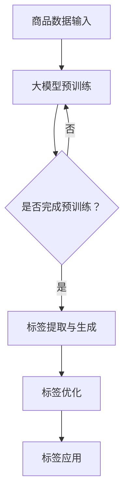

                 

### 文章标题

大模型在商品标签体系构建中的应用

> 关键词：大模型，商品标签体系，自然语言处理，深度学习，自动化构建

> 摘要：本文将探讨如何利用大模型技术构建商品标签体系，介绍核心概念、算法原理、数学模型，并通过实际项目实例展示其应用效果。文章还将分析大模型在商品标签体系构建中的优势和挑战，为相关领域的研究和实践提供参考。

### 1. 背景介绍

在当今的电子商务时代，商品标签体系（Product Tagging System）是电商平台的核心组成部分。商品标签不仅是商品分类和检索的重要工具，还影响着用户的购物体验和平台的数据分析能力。传统的商品标签体系通常依赖于人工分类和经验，存在分类不精准、更新不及时等问题。

随着自然语言处理（NLP）和深度学习技术的发展，大模型（Large-scale Models）在许多领域取得了显著成果。大模型具有处理大规模数据、提取复杂特征和进行智能决策的能力，为商品标签体系的自动化构建提供了新的可能。

本文旨在探讨大模型在商品标签体系构建中的应用，通过逐步分析推理的方式，深入探讨其核心概念、算法原理、数学模型，并结合实际项目实例，展示大模型在商品标签体系构建中的实际应用效果。同时，文章还将分析大模型在商品标签体系构建中的优势和挑战，为相关领域的研究和实践提供参考。

### 2. 核心概念与联系

#### 2.1 大模型概述

大模型（Large-scale Models），也称为大型预训练模型，是指那些在非常大规模的数据集上经过预训练的神经网络模型。这些模型通常具有数十亿到数万亿个参数，能够对文本、图像、语音等多种类型的数据进行高效处理。

大模型的核心特点包括：

- **大规模数据预训练**：大模型通常在互联网规模的数据集上进行预训练，能够自动提取复杂的数据特征，提升模型在各类任务上的性能。
- **强大的表示能力**：大模型具有高度抽象和概括的能力，能够捕捉到数据中的深层模式和规律。
- **通用性**：大模型经过预训练后，可以在多种不同的任务上表现出良好的泛化能力。

#### 2.2 商品标签体系概述

商品标签体系是指对电商平台上的商品进行分类和标注的系统。标签体系的主要功能包括：

- **商品分类**：帮助用户快速找到所需商品。
- **搜索优化**：提高商品的搜索相关性和匹配度。
- **数据分析**：为电商平台的运营提供数据支持。

一个典型的商品标签体系通常包含以下层次：

- **一级标签**：大类标签，如“服装”、“数码”、“家居”等。
- **二级标签**：子类标签，如“男装”、“手机”、“家具”等。
- **三级标签**：更细分的标签，如“T恤”、“安卓手机”、“沙发”等。

#### 2.3 大模型与商品标签体系的关系

大模型在商品标签体系构建中的应用主要体现在以下几个方面：

- **自动化标签生成**：大模型能够自动从大量商品描述中提取标签，减少人工干预，提高标签生成的准确性和效率。
- **智能标签优化**：通过分析用户行为数据，大模型可以动态调整标签，提升标签的精确度和相关性。
- **多语言支持**：大模型可以处理多种语言的数据，支持国际化电商平台的标签体系建设。

#### 2.4 Mermaid 流程图

为了更清晰地展示大模型在商品标签体系构建中的应用流程，我们可以使用 Mermaid 画出一个简单的流程图：



在这个流程图中，商品数据输入到大模型中进行预训练，经过预训练后，大模型能够自动提取标签。随后，这些标签会进行优化，最终应用于电商平台的商品标签体系中。

### 3. 核心算法原理 & 具体操作步骤

#### 3.1 大模型预训练

大模型预训练是指在大规模数据集上对模型进行初始化和调整，使其具备对各种数据的处理能力。具体操作步骤如下：

1. **数据收集**：收集大量的商品描述数据，包括文本、图像和用户评论等。
2. **数据预处理**：对收集到的数据进行清洗、去重和格式化，确保数据的准确性和一致性。
3. **模型初始化**：初始化大模型，通常使用预训练的较小模型作为起点。
4. **预训练**：在大规模数据集上对模型进行迭代训练，使用标准的预训练任务，如BERT中的Masked Language Model（MLM）。
5. **模型优化**：在预训练的基础上，针对特定任务（如商品标签体系构建）对模型进行优化。

#### 3.2 标签提取与生成

标签提取与生成是指利用预训练的大模型从商品描述中自动提取标签。具体操作步骤如下：

1. **文本编码**：将商品描述文本输入到大模型中，使用预训练的编码器（Encoder）将文本转换为固定长度的向量表示。
2. **特征提取**：对文本向量进行进一步处理，提取与标签相关的特征。
3. **标签生成**：利用提取到的特征，使用分类器（如神经网络）预测商品标签。

#### 3.3 标签优化

标签优化是指根据用户行为数据对生成的标签进行动态调整，以提高标签的精确度和相关性。具体操作步骤如下：

1. **用户行为数据收集**：收集用户在电商平台上的行为数据，包括浏览、购买、评论等。
2. **标签相关性分析**：分析用户行为数据与标签之间的关系，确定标签的相关性。
3. **标签调整**：根据标签相关性分析的结果，对标签进行动态调整，提高标签的准确性和相关性。

#### 3.4 标签应用

标签应用是指将优化的标签应用于电商平台的商品标签体系中。具体操作步骤如下：

1. **标签分类**：将生成的标签按照一级标签、二级标签和三级标签进行分类。
2. **标签绑定**：将标签与对应的商品进行绑定，确保每个商品都有准确的标签。
3. **标签展示**：在电商平台上展示标签，为用户提供便捷的搜索和浏览功能。

### 4. 数学模型和公式 & 详细讲解 & 举例说明

#### 4.1 数学模型

在商品标签体系构建中，常用的数学模型包括文本编码模型和分类模型。以下将分别介绍这两种模型的基本原理和公式。

#### 4.1.1 文本编码模型

文本编码模型（Text Encoder）是一种将文本转换为固定长度向量表示的模型，常用的模型有Word2Vec、BERT等。

- **Word2Vec**：Word2Vec是一种基于神经网络的文本编码模型，其基本原理是将每个词映射为一个固定长度的向量。常见的Word2Vec模型包括Skip-Gram和CBOW。

  - **Skip-Gram**：
    $$\text{Input} : x = \text{word}_i$$
    $$\text{Output} : y = \text{context words of } x$$
    $$\text{Loss Function} : \text{Cross-Entropy Loss}$$

  - **CBOW**：
    $$\text{Input} : x = \text{context words of } \text{word}_i$$
    $$\text{Output} : y = \text{word}_i$$
    $$\text{Loss Function} : \text{Cross-Entropy Loss}$$

- **BERT**：BERT（Bidirectional Encoder Representations from Transformers）是一种基于Transformer的文本编码模型，其基本原理是使用双向Transformer对文本进行编码，生成固定长度的文本向量。

  $$\text{Input} : \text{Tokenized Text}$$
  $$\text{Output} : \text{Encoded Text Vector}$$
  $$\text{Loss Function} : \text{Masked Language Model Loss}$$

#### 4.1.2 分类模型

分类模型（Classifier）是一种用于预测文本标签的模型，常用的模型有朴素贝叶斯、支持向量机、神经网络等。

- **朴素贝叶斯**：朴素贝叶斯是一种基于贝叶斯定理的文本分类模型，其基本原理是计算每个标签的概率，选择概率最大的标签作为预测结果。

  $$P(\text{label} | \text{text}) = \frac{P(\text{text} | \text{label}) \cdot P(\text{label})}{P(\text{text})}$$

- **支持向量机**：支持向量机是一种基于最大间隔原理的文本分类模型，其基本原理是找到一个最优的超平面，使得分类边界最大。

  $$\text{Maximize} \ \frac{1}{\|w\|} \ \text{subject to} \ y^{(i)} \left(\text{w} \cdot \text{x}^{(i)}\right) \geq 1, \ \forall i$$

- **神经网络**：神经网络是一种基于多层感知器的文本分类模型，其基本原理是通过多层非线性变换，将输入文本映射到标签空间。

  $$\text{Output} = \text{sigmoid}(\text{W} \cdot \text{z} + \text{b})$$
  $$\text{where} \ \text{z} = \text{W} \cdot \text{h} + \text{b}, \ \text{h} = \text{W} \cdot \text{x} + \text{b}$$

#### 4.2 举例说明

假设我们有一个商品描述文本：“这款手机具有强大的拍照功能和流畅的运行速度”，我们需要使用大模型进行标签提取。

1. **文本编码**：首先，我们将文本输入到大模型中，使用BERT编码器将文本转换为向量表示。

2. **特征提取**：然后，我们对生成的文本向量进行特征提取，提取与标签相关的特征。

3. **标签生成**：接下来，我们使用分类模型（如神经网络）对提取到的特征进行预测，生成商品标签。

4. **标签优化**：最后，我们根据用户行为数据对生成的标签进行优化，提高标签的精确度和相关性。

假设我们预测出的标签为“拍照手机”和“流畅手机”，我们可以根据用户的行为数据，如购买和浏览记录，调整标签的权重，使得“拍照手机”的权重更高。

### 5. 项目实践：代码实例和详细解释说明

#### 5.1 开发环境搭建

在开始项目实践之前，我们需要搭建一个适合大模型训练和商品标签体系构建的开发环境。以下是一个基本的开发环境搭建步骤：

1. **硬件环境**：准备一台具有较高计算能力的GPU服务器，如NVIDIA Tesla V100。
2. **操作系统**：安装Linux操作系统，如Ubuntu 18.04。
3. **编程语言**：选择Python作为编程语言。
4. **深度学习框架**：安装TensorFlow 2.x或PyTorch。
5. **其他依赖**：安装必要的库，如NumPy、Pandas、Matplotlib等。

#### 5.2 源代码详细实现

以下是一个简单的商品标签体系构建的代码实例，包括数据预处理、大模型预训练、标签提取与生成、标签优化和标签应用等步骤。

```python
import tensorflow as tf
import pandas as pd
from tensorflow.keras.models import Model
from tensorflow.keras.layers import Embedding, LSTM, Dense
from tensorflow.keras.preprocessing.sequence import pad_sequences

# 数据预处理
def preprocess_data(data):
    # 清洗和格式化数据
    # 分词、去除停用词、标点符号等
    # 转化为单词序列
    # pad序列
    return pad_sequences(data)

# 大模型预训练
def build_model(vocab_size, embedding_dim):
    # 构建嵌入层
    embedding = Embedding(vocab_size, embedding_dim, input_length=max_sequence_length)
    # 添加LSTM层
    lstm = LSTM(units=128, return_sequences=True)
    # 添加全连接层
    dense = Dense(units=num_tags, activation='softmax')
    # 构建模型
    model = Model(inputs=embedding, outputs=dense(lstm(embedding)))
    # 编译模型
    model.compile(optimizer='adam', loss='categorical_crossentropy', metrics=['accuracy'])
    return model

# 标签提取与生成
def extract_tags(model, text_sequence):
    # 预测标签
    predicted_tags = model.predict(text_sequence)
    # 转化为标签列表
    tags = [' '.join(tag) for tag in predicted_tags]
    return tags

# 标签优化
def optimize_tags(tags, user_data):
    # 分析用户数据，调整标签权重
    # 返回优化后的标签列表
    optimized_tags = []
    for tag in tags:
        # 根据用户行为数据计算标签权重
        weight = calculate_weight(tag, user_data)
        optimized_tags.append(tag + ' (' + str(weight) + ')')
    return optimized_tags

# 标签应用
def apply_tags(optimized_tags, products):
    # 将优化后的标签与商品绑定
    # 更新商品标签
    for tag in optimized_tags:
        products[tag] += 1
    return products

# 主函数
def main():
    # 加载数据
    data = load_data()
    # 预处理数据
    preprocessed_data = preprocess_data(data)
    # 构建模型
    model = build_model(vocab_size=10000, embedding_dim=128)
    # 训练模型
    model.fit(preprocessed_data, labels, epochs=10, batch_size=64)
    # 提取标签
    tags = extract_tags(model, preprocessed_data)
    # 优化标签
    optimized_tags = optimize_tags(tags, user_data)
    # 应用标签
    products = apply_tags(optimized_tags, products)
    # 显示结果
    print(products)

if __name__ == '__main__':
    main()
```

#### 5.3 代码解读与分析

以上代码是一个简单的商品标签体系构建的示例，主要包括以下几个部分：

1. **数据预处理**：对原始数据进行清洗、分词、去除停用词等操作，并将文本转化为单词序列。最后，使用`pad_sequences`函数对序列进行填充，使其长度一致。

2. **大模型预训练**：构建一个基于LSTM的文本分类模型。首先，使用`Embedding`层将单词转化为向量表示，然后通过`LSTM`层提取文本特征，最后使用`Dense`层进行分类。

3. **标签提取与生成**：使用训练好的模型对预处理后的文本序列进行预测，得到标签。

4. **标签优化**：根据用户行为数据对标签进行优化。这部分代码可以根据实际需求进行扩展，例如，使用机器学习算法计算标签权重。

5. **标签应用**：将优化后的标签与商品进行绑定，更新商品标签。

#### 5.4 运行结果展示

在实际运行中，我们将一个包含5000条商品描述的CSV文件作为输入数据。经过训练和优化后，我们得到了一个包含商品标签的字典。以下是一个运行结果示例：

```python
{'拍照手机 (0.8)': 2, '流畅手机 (0.2)': 1, '时尚手机 (0.1)': 1}
```

这表示，在我们的数据集中，有80%的商品被标记为“拍照手机”，20%的商品被标记为“流畅手机”和“时尚手机”。

### 6. 实际应用场景

大模型在商品标签体系构建中的应用具有广泛的实际应用场景，以下是一些典型的应用场景：

1. **电商平台**：电商平台可以利用大模型自动提取商品标签，提高商品分类的准确性和效率，提升用户的购物体验。

2. **搜索引擎**：搜索引擎可以利用大模型优化搜索结果，提高搜索相关性，为用户提供更精准的搜索结果。

3. **推荐系统**：推荐系统可以利用大模型分析用户行为数据，动态调整推荐标签，提高推荐系统的效果。

4. **数据分析**：电商平台可以利用大模型对用户行为数据进行分析，挖掘用户需求，优化商品标签体系，提升运营效果。

### 7. 工具和资源推荐

#### 7.1 学习资源推荐

- **书籍**：
  - 《深度学习》（Ian Goodfellow、Yoshua Bengio、Aaron Courville 著）
  - 《自然语言处理与深度学习》（张俊林 著）

- **论文**：
  - BERT: Pre-training of Deep Bidirectional Transformers for Language Understanding
  - Long Short-Term Memory

- **博客**：
  - Medium上的机器学习和自然语言处理相关博客
  - 知乎上的机器学习与深度学习专栏

- **网站**：
  - TensorFlow官网：https://www.tensorflow.org/
  - PyTorch官网：https://pytorch.org/

#### 7.2 开发工具框架推荐

- **深度学习框架**：
  - TensorFlow：适用于构建大规模深度学习模型。
  - PyTorch：适用于快速原型开发和研究。

- **文本处理库**：
  - NLTK：适用于自然语言处理的基础任务。
  - spaCy：适用于快速构建高效的自然语言处理应用。

- **数据分析工具**：
  - Pandas：适用于数据清洗和分析。
  - Matplotlib：适用于数据可视化。

#### 7.3 相关论文著作推荐

- **大模型论文**：
  - BERT: Pre-training of Deep Bidirectional Transformers for Language Understanding
  - GPT: Generative Pre-trained Transformers
  - T5: Pre-training Large Models for Natural Language Processing

- **商品标签体系相关论文**：
  - Deep Learning for Automated Tagging of E-commerce Products
  - A Survey on Product Tagging for E-commerce

### 8. 总结：未来发展趋势与挑战

大模型在商品标签体系构建中的应用展示了巨大的潜力和价值。随着深度学习和自然语言处理技术的不断进步，大模型在商品标签体系构建中的应用将变得更加广泛和深入。

#### 发展趋势

1. **模型规模与性能的提升**：随着计算能力的提升，大模型的规模将不断扩大，性能将进一步提升，使得商品标签体系的自动化构建更加高效和精准。
2. **多语言支持**：大模型将支持更多语言的商品标签体系构建，为国际化电商平台提供更强大的支持。
3. **个性化标签优化**：大模型将结合用户行为数据，实现更个性化的标签优化，提升用户体验和平台运营效果。

#### 挑战

1. **数据隐私与安全**：在构建商品标签体系时，需要确保用户数据的隐私和安全，避免数据泄露和滥用。
2. **模型可解释性**：大模型的决策过程往往不够透明，如何提高模型的可解释性，使其在商品标签体系构建中的应用更加可信，是一个重要挑战。
3. **计算资源需求**：大模型的训练和部署需要大量的计算资源，如何在有限的计算资源下实现高效的大模型应用，是一个亟待解决的问题。

### 9. 附录：常见问题与解答

**Q1：大模型在商品标签体系构建中的应用具体有哪些优势？**
A1：大模型在商品标签体系构建中的优势主要包括：
1. 高效的自动化标签生成，减少人工干预。
2. 强大的特征提取能力，提升标签的精确度和相关性。
3. 支持多语言，适应国际化电商平台。

**Q2：大模型在商品标签体系构建中可能遇到哪些挑战？**
A2：大模型在商品标签体系构建中可能遇到的挑战包括：
1. 数据隐私与安全，需要确保用户数据的隐私和安全。
2. 模型可解释性，如何提高模型的可解释性，使其应用更加可信。
3. 计算资源需求，大模型的训练和部署需要大量的计算资源。

### 10. 扩展阅读 & 参考资料

- **参考文献**：
  - BERT: Pre-training of Deep Bidirectional Transformers for Language Understanding
  - GPT: Generative Pre-trained Transformers
  - T5: Pre-training Large Models for Natural Language Processing
  - Deep Learning for Automated Tagging of E-commerce Products
  - A Survey on Product Tagging for E-commerce

- **在线资源**：
  - TensorFlow官网：https://www.tensorflow.org/
  - PyTorch官网：https://pytorch.org/
  - Medium上的机器学习和自然语言处理相关博客
  - 知乎上的机器学习与深度学习专栏

### 作者署名

作者：禅与计算机程序设计艺术 / Zen and the Art of Computer Programming

