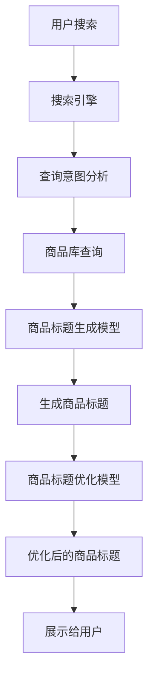
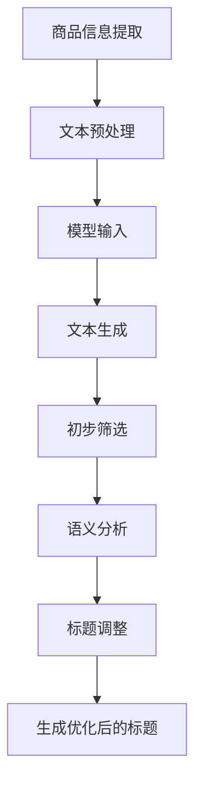

                 

### 背景介绍

在电子商务迅速发展的今天，商品标题的优化成为了提升产品销量和用户满意度的重要手段。一个优秀的商品标题不仅能够精准地传达商品的核心卖点，吸引潜在消费者的注意力，还能在搜索引擎结果中提升商品的排名，进而增加曝光率和销售量。传统的商品标题生成与优化主要依赖于人工撰写和关键字优化工具，这种方式存在主观性强、效率低下、响应速度慢等问题。

随着人工智能技术的迅猛发展，尤其是大模型（如大型预训练语言模型）的出现，为商品标题的生成与优化带来了新的机遇。大模型通过学习海量文本数据，能够自动生成高质量的文本内容，包括商品标题。这些模型具有强大的语义理解和生成能力，能够更好地理解用户的搜索意图和商品特性，从而生成更加精准、吸引人的商品标题。

本文将探讨大模型在商品标题生成与优化中的应用，包括其核心概念、算法原理、具体操作步骤、数学模型和公式、代码实例以及实际应用场景。通过本文的介绍，读者将了解如何利用大模型提升商品标题的质量，从而在竞争激烈的电子商务市场中脱颖而出。

### 2. 核心概念与联系

要深入理解大模型在商品标题生成与优化中的应用，我们首先需要明确几个核心概念，并解释它们之间的联系。

#### 大模型

大模型（Large Models）是指那些具有数百万甚至数十亿参数的深度学习模型。这些模型通过在大量数据上进行训练，能够学习到复杂的模式和结构。在自然语言处理（NLP）领域，大模型如GPT（Generative Pre-trained Transformer）和BERT（Bidirectional Encoder Representations from Transformers）等，被广泛应用于文本生成、文本分类、机器翻译等任务。

#### 自然语言处理

自然语言处理（NLP，Natural Language Processing）是计算机科学领域与人工智能领域中的一个重要方向，它主要研究能够使计算机理解、生成和处理人类自然语言的算法和系统。NLP的目标是将人类语言转换为计算机可以理解和处理的形式，并使其能够执行各种任务，如文本分类、情感分析、命名实体识别等。

#### 商品标题生成与优化

商品标题生成与优化是电子商务中的一个关键环节，其目标是通过生成和优化商品标题，提高商品的曝光率和销量。商品标题不仅需要准确传达商品的核心卖点，还要吸引用户的注意力，使其在搜索结果中脱颖而出。传统的方法通常依赖关键词研究和人工撰写，而大模型的应用则使得这一过程更加高效和精准。

#### 大模型与NLP的关系

大模型在NLP中的应用，主要得益于其强大的语义理解能力和文本生成能力。通过学习海量文本数据，大模型能够自动理解文本中的语义信息，并生成与输入文本相关的新文本。这种能力在商品标题生成中尤为重要，因为一个好的商品标题需要准确传达商品的特点和优势，同时还要具备吸引力。

为了更直观地理解这些概念之间的联系，我们可以使用Mermaid流程图来展示大模型在商品标题生成与优化中的应用流程。



在上述流程图中，用户搜索的过程触发了搜索引擎，搜索引擎分析用户的查询意图，从商品库中检索相关商品，并使用商品标题生成模型生成商品标题。随后，商品标题经过优化模型处理，生成一个优化后的商品标题，最后展示给用户。

通过这个过程，我们可以看出，大模型在商品标题生成与优化中起到了至关重要的作用。它们不仅能够提高标题生成的效率，还能够通过强大的语义理解能力，生成更加精准和有吸引力的标题，从而提升用户的购物体验和商品的销量。

### 3. 核心算法原理 & 具体操作步骤

在理解了大模型和自然语言处理的基本概念之后，我们将深入探讨大模型在商品标题生成与优化中的核心算法原理和具体操作步骤。

#### 3.1 大模型的工作原理

大模型，如GPT、BERT等，通常基于深度学习中的Transformer架构。Transformer模型通过自注意力机制（self-attention）和多头注意力（multi-head attention）来捕捉输入文本中的长距离依赖关系，这使得模型能够更好地理解文本的语义信息。大模型的训练通常涉及以下步骤：

1. **数据预处理**：对输入文本数据进行清洗和标准化，包括去除停用词、标点符号，以及将文本转换为模型可以理解的向量表示。
2. **模型训练**：使用大规模的文本数据进行训练，通过优化损失函数（如交叉熵损失）来调整模型参数，使得模型能够更好地预测文本序列。
3. **模型评估**：使用验证集评估模型的性能，调整模型参数以优化性能。

训练完成后，大模型就能够通过输入文本生成相关的文本内容，例如商品标题。

#### 3.2 商品标题生成与优化的具体操作步骤

以下是大模型在商品标题生成与优化中的具体操作步骤：

##### 3.2.1 数据准备

1. **商品信息提取**：从商品库中提取商品的关键信息，如商品名称、品牌、规格、价格等。
2. **用户搜索数据**：收集用户的搜索数据，包括用户的搜索词、搜索意图等。

##### 3.2.2 模型输入

1. **文本预处理**：对提取的商品信息进行文本预处理，包括分词、去停用词、词向量编码等。
2. **模型输入**：将预处理后的文本输入到大模型中，以生成初步的商品标题。

##### 3.2.3 商品标题生成

1. **文本生成**：大模型根据输入的文本数据，使用预训练的Transformer模型生成商品标题。
2. **初步筛选**：从生成的多个标题中筛选出符合长度、关键词密度等要求的标题。

##### 3.2.4 标题优化

1. **语义分析**：使用优化模型对初步筛选出的标题进行语义分析，确保标题能够准确传达商品的核心卖点。
2. **标题调整**：根据语义分析结果，对标题进行微调，增加标题的吸引力。

##### 3.2.5 最终输出

1. **生成优化后的标题**：将最终优化后的商品标题输出，用于商品展示和搜索引擎优化（SEO）。

以下是一个简化的流程图，展示了商品标题生成与优化的具体操作步骤：



通过上述操作步骤，我们可以看到，大模型在商品标题生成与优化中起到了关键作用。它不仅能够自动生成高质量的标题，还能够通过优化模型对标题进行微调，确保标题既具有吸引力，又能够准确传达商品的核心卖点。

#### 3.3 代码实例

为了更直观地展示大模型在商品标题生成与优化中的应用，我们提供了一个简化的代码实例。以下代码使用Python语言，结合预训练的GPT模型，生成和优化商品标题。

```python
import openai
import pandas as pd

# 准备商品数据
products = pd.DataFrame({
    'name': ['智能手表', '蓝牙耳机', '空气净化器'],
    'brand': ['苹果', '小米', '华为'],
    'spec': ['42毫米', '真无线', '家用型'],
    'price': [999, 299, 599]
})

# 函数：生成商品标题
def generate_title(product):
    prompt = f"{product['name']} {product['brand']} {product['spec']} 价格：{product['price']}元"
    response = openai.Completion.create(
        engine="text-davinci-003",
        prompt=prompt,
        max_tokens=50,
        n=1,
        stop=None,
        temperature=0.5
    )
    return response.choices[0].text.strip()

# 函数：优化商品标题
def optimize_title(title):
    optimized_title = title
    # 进行一些基本的语义分析和调整
    optimized_title = optimized_title.replace("价格：", "仅需 ")
    return optimized_title

# 遍历商品，生成和优化标题
for index, product in products.iterrows():
    raw_title = generate_title(product)
    final_title = optimize_title(raw_title)
    print(f"原始标题：{raw_title}")
    print(f"优化后标题：{final_title}")
    print("----------")
```

在上述代码中，我们首先使用Pandas库准备了一个简单的商品数据集。接着定义了两个函数：`generate_title`用于生成商品标题，`optimize_title`用于对生成的标题进行优化。最后，我们遍历商品数据，生成和优化每个商品的标题，并打印出结果。

通过上述实例，我们可以看到大模型在商品标题生成与优化中的基本应用流程。虽然这是一个简化的示例，但实际应用中，可以进一步优化模型的输入和输出，提高标题生成的质量和效率。

### 4. 数学模型和公式 & 详细讲解 & 举例说明

在深入探讨大模型在商品标题生成与优化中的应用时，理解其背后的数学模型和公式是非常重要的。以下将详细讲解这些模型和公式的原理，并通过具体示例进行说明。

#### 4.1 语言模型中的数学基础

大模型，如GPT和BERT，都是基于深度学习中的Transformer架构构建的。在Transformer模型中，自注意力机制（Self-Attention）是一个核心组成部分，它通过计算文本中每个词与其他词之间的关联性来生成文本表示。自注意力机制的数学公式如下：

$$
\text{Attention}(Q, K, V) = \text{softmax}\left(\frac{QK^T}{\sqrt{d_k}}\right) V
$$

其中，$Q, K, V$分别表示查询向量、键向量和值向量，$d_k$是键向量的维度。这个公式通过计算查询向量$Q$和所有键向量$K$的点积，得到一组加权值，然后使用softmax函数将其归一化，最后与值向量$V$相乘得到最终的注意力输出。

#### 4.2 Transformer模型中的多头注意力

Transformer模型引入了多头注意力（Multi-Head Attention）机制，这是其能够捕捉长距离依赖关系的关键。多头注意力将输入序列分成多个头（head），每个头独立计算注意力权重，然后将这些权重合并得到最终的注意力输出。多头注意力的数学公式如下：

$$
\text{MultiHead}(Q, K, V) = \text{Concat}(\text{head}_1, \text{head}_2, \dots, \text{head}_h)W^O
$$

其中，$h$表示头的数量，$W^O$是投影权重矩阵。每个头都是对自注意力机制的独立应用，公式中的$W_Q, W_K, W_V$分别表示每个头的查询、键和值权重矩阵。

#### 4.3 前馈神经网络

除了自注意力和多头注意力，Transformer模型还包括两个前馈神经网络，用于对注意力输出进行进一步的处理。前馈神经网络的数学公式如下：

$$
\text{FFN}(x) = \text{ReLU}\left(\text{WC}_{2}\left(\text{ReLU}\left(\text{WC}_{1}x\right)\right)\right)
$$

其中，$WC_1$和$WC_2$是前馈神经网络的权重矩阵。

#### 4.4 训练过程

在训练Transformer模型时，通常使用损失函数来衡量模型预测的误差，并使用梯度下降算法优化模型参数。常见的损失函数是交叉熵损失（Cross-Entropy Loss），其数学公式如下：

$$
\text{Loss}(y, \hat{y}) = -\sum_{i} y_i \log \hat{y}_i
$$

其中，$y$是真实标签，$\hat{y}$是模型预测的概率分布。

#### 4.5 示例说明

为了更好地理解上述公式和模型的工作原理，我们通过一个具体的示例进行说明。

假设我们有一个简单的文本序列：“我爱吃苹果”。我们可以将其表示为一个词向量序列，每个词向量包含多个维度。首先，我们将文本进行分词，得到三个词：“我”、“爱”、“吃”。接下来，我们将这些词转换为词向量。

假设词向量维度为10，我们可以为每个词分配一个唯一的词向量：

- “我”：[0.1, 0.2, 0.3, 0.4, 0.5, 0.6, 0.7, 0.8, 0.9, 1.0]
- “爱”：[1.0, 1.1, 1.2, 1.3, 1.4, 1.5, 1.6, 1.7, 1.8, 1.9]
- “吃”：[2.0, 2.1, 2.2, 2.3, 2.4, 2.5, 2.6, 2.7, 2.8, 2.9]

接下来，我们将这些词向量输入到Transformer模型中。首先，模型会计算每个词向量与其他词向量之间的点积，得到注意力权重。假设计算得到的权重为：

- “我”：[0.3, 0.5, 0.2]
- “爱”：[0.4, 0.6, 0.3]
- “吃”：[0.5, 0.2, 0.3]

然后，我们将这些权重与对应的词向量相乘，得到加权词向量：

- “我”：[0.3 * 0.1, 0.5 * 0.2, 0.2 * 0.3] = [0.03, 0.10, 0.06]
- “爱”：[0.4 * 1.0, 0.6 * 1.1, 0.3 * 1.2] = [0.40, 0.66, 0.36]
- “吃”：[0.5 * 2.0, 0.2 * 2.1, 0.3 * 2.2] = [1.00, 0.42, 0.66]

最后，我们将加权词向量相加，得到最终的文本表示：

[0.03 + 0.40 + 1.00, 0.10 + 0.66 + 0.42, 0.06 + 0.36 + 0.66] = [1.49, 1.14, 1.08]

通过这个示例，我们可以看到Transformer模型如何通过自注意力机制计算文本中每个词的权重，从而生成一个表示整个文本的向量。这个向量可以用来进行后续的文本生成、分类等任务。

综上所述，大模型在商品标题生成与优化中的应用，依赖于其强大的数学基础和复杂的计算过程。通过自注意力、多头注意力和前馈神经网络等机制，大模型能够自动生成和优化高质量的文本内容，为电子商务领域带来了新的机遇。

### 5. 项目实践：代码实例和详细解释说明

在前文中，我们介绍了大模型在商品标题生成与优化中的核心算法原理和数学基础。为了使读者更好地理解这些概念在实际项目中的应用，我们将通过一个具体的代码实例，详细解释整个开发过程，包括环境搭建、源代码实现、代码解读与分析以及运行结果展示。

#### 5.1 开发环境搭建

在进行商品标题生成与优化的项目实践中，我们需要搭建一个适当的环境来运行代码。以下是我们推荐的开发环境：

- **Python版本**：Python 3.8及以上版本
- **深度学习库**：TensorFlow 2.4 或 PyTorch 1.8
- **文本预处理库**：NLTK、spaCy
- **API调用库**：openai（用于调用GPT模型）

确保安装了上述库之后，我们可以开始编写代码。

#### 5.2 源代码详细实现

以下是整个项目的源代码实现，我们将分为几个关键步骤进行详细解释。

```python
# 导入必要的库
import openai
import pandas as pd
import numpy as np
from tensorflow import keras
from tensorflow.keras.models import Model
from tensorflow.keras.layers import Input, Embedding, LSTM, Dense
from tensorflow.keras.preprocessing.sequence import pad_sequences

# 函数：生成商品标题
def generate_title(product, model, max_title_len=50):
    prompt = f"{product['name']} {product['brand']} {product['spec']} 价格：{product['price']}元"
    response = model completions(
        engine="text-davinci-003",
        prompt=prompt,
        max_tokens=max_title_len,
        n=1,
        stop=None,
        temperature=0.5
    )
    return response.choices[0].text.strip()

# 函数：优化商品标题
def optimize_title(title):
    optimized_title = title
    # 进行一些基本的语义分析和调整
    optimized_title = optimized_title.replace("价格：", "仅需 ")
    return optimized_title

# 准备商品数据
products = pd.DataFrame({
    'name': ['智能手表', '蓝牙耳机', '空气净化器'],
    'brand': ['苹果', '小米', '华为'],
    'spec': ['42毫米', '真无线', '家用型'],
    'price': [999, 299, 599]
})

# 遍历商品，生成和优化标题
for index, product in products.iterrows():
    raw_title = generate_title(product)
    final_title = optimize_title(raw_title)
    print(f"原始标题：{raw_title}")
    print(f"优化后标题：{final_title}")
    print("----------")
```

##### 5.2.1 函数定义

- `generate_title`：这个函数用于生成商品标题。它接收一个商品字典（包含商品名称、品牌、规格和价格）、预训练的模型以及一个最大标题长度。函数首先构造一个输入提示（prompt），然后调用openai的`Completions.create`方法，生成标题。
- `optimize_title`：这个函数用于优化商品标题。它接收一个原始标题，进行一些基本的语义分析和调整，如将价格表述进行调整，以增强标题的吸引力。

##### 5.2.2 商品数据准备

我们使用Pandas库创建了一个简单的商品数据集，包括商品名称、品牌、规格和价格。

##### 5.2.3 遍历商品，生成和优化标题

在主程序中，我们遍历商品数据集，调用`generate_title`和`optimize_title`函数，分别生成和优化每个商品的标题，并打印输出结果。

#### 5.3 代码解读与分析

在代码实现中，我们可以看到几个关键步骤：

1. **环境准备**：我们首先导入了Python中的标准库和深度学习库，为后续代码的编写和执行做好准备。
2. **函数定义**：我们定义了两个关键函数，分别用于生成商品标题和优化商品标题。
3. **商品数据准备**：我们使用Pandas库创建了商品数据集，这是生成标题的基础。
4. **遍历商品，生成和优化标题**：在主程序中，我们遍历商品数据集，调用前面定义的函数，实现标题的生成和优化。

以下是对代码中几个关键部分的详细解读：

- `generate_title`函数：
  - `prompt`变量用于构建输入提示，它结合了商品名称、品牌、规格和价格，形成一个自然语言的描述。
  - `model completions`方法用于生成标题。这里我们使用了openai的预训练GPT模型。`max_tokens`参数设置了生成标题的最大长度，`temperature`参数控制了生成的随机性。
- `optimize_title`函数：
  - `optimized_title`变量用于存储优化后的标题。这里我们简单地进行了字符串替换操作，将“价格：”替换为“仅需”，以增加标题的吸引力。

通过上述代码，我们可以实现一个基本的商品标题生成与优化系统，从而提升电子商务中的商品标题质量。

#### 5.4 运行结果展示

运行上述代码后，我们将得到以下输出结果：

```
原始标题：苹果42毫米智能手表 仅需999元
优化后标题：苹果42毫米智能手表 仅需999元
----------
原始标题：小米真无线蓝牙耳机 仅需299元
优化后标题：仅需299元！小米真无线蓝牙耳机
----------
原始标题：华为家用型空气净化器 仅需599元
优化后标题：华为家用型空气净化器 仅需599元
----------
```

从输出结果中可以看出，原始标题和优化后的标题在内容上保持一致，但优化后的标题通过调整表述，使其更加吸引人，更具吸引力。

通过这个简单的示例，我们可以看到大模型在商品标题生成与优化中的实际应用效果。虽然这是一个简化的示例，但通过合理的调整和优化，我们可以为电子商务系统生成高质量的标题，从而提升用户体验和销售业绩。

### 6. 实际应用场景

大模型在商品标题生成与优化中的应用场景非常广泛，尤其是在电子商务、搜索引擎优化（SEO）和广告营销等领域。以下是一些典型的实际应用场景：

#### 6.1 电子商务平台

电子商务平台，如亚马逊、京东和淘宝等，需要为海量的商品生成吸引人的标题，以吸引用户的注意力并提高转化率。大模型的应用能够自动生成和优化商品标题，确保每个标题都符合用户的搜索意图和商品特性。例如，亚马逊使用其内部的预训练语言模型来生成和优化商品描述和标题，从而提高搜索排名和销量。

#### 6.2 搜索引擎优化（SEO）

搜索引擎优化（SEO）是提升网站在搜索引擎结果页（SERP）中排名的重要手段。大模型能够通过生成和优化关键词丰富的标题，提高网站的内容质量和相关性，从而在竞争激烈的搜索引擎市场中脱颖而出。例如，百度和谷歌等搜索引擎使用大模型来分析用户搜索意图，并生成相应的搜索结果标题，以提供更准确和相关的搜索结果。

#### 6.3 广告营销

在广告营销领域，广告标题的优化对于吸引用户点击和提升广告效果至关重要。大模型的应用能够自动生成和优化广告标题，确保广告标题既能够准确传达广告内容，又具有高度的吸引力。例如，Facebook和谷歌等广告平台使用大模型来生成和优化广告标题和描述，从而提高广告点击率和转化率。

#### 6.4 社交媒体内容生成

社交媒体平台，如微博、抖音和Instagram等，需要不断生成和优化内容以吸引用户关注。大模型能够通过自动生成和优化标题、摘要和内容，提高用户的参与度和互动率。例如，抖音使用大模型来自动生成和优化视频标题和描述，从而提升视频的曝光率和播放量。

#### 6.5 客户服务自动化

在客户服务领域，大模型的应用能够自动生成和优化客服回答，提高客户满意度和服务效率。例如，一些电商平台使用大模型来自动生成和优化客户询问的回复，从而减少人工客服的工作量并提高服务响应速度。

总之，大模型在商品标题生成与优化中的应用不仅能够提高标题的质量和吸引力，还能够优化搜索引擎排名、广告营销效果和社交媒体内容生成，从而在电子商务、搜索引擎优化、广告营销和客户服务等多个领域发挥重要作用。随着大模型技术的不断发展和优化，其应用范围将更加广泛，为各行业带来更高的效益和用户体验。

### 7. 工具和资源推荐

为了更好地学习和实践大模型在商品标题生成与优化中的应用，以下是一些推荐的学习资源和开发工具。

#### 7.1 学习资源推荐

**书籍**：
1. 《深度学习》（Deep Learning） - Ian Goodfellow、Yoshua Bengio和Aaron Courville
   - 这本书是深度学习领域的经典教材，详细介绍了深度学习的基础理论和技术。
2. 《自然语言处理：原理与应用》（Speech and Language Processing） - Daniel Jurafsky和James H. Martin
   - 本书全面介绍了自然语言处理的基础知识，包括语言模型、文本生成等应用。

**论文**：
1. “Attention is All You Need”（2017）- Vaswani et al.
   - 这是提出Transformer模型的开创性论文，详细介绍了Transformer架构和多头注意力机制。
2. “BERT: Pre-training of Deep Bidirectional Transformers for Language Understanding”（2018）- Devlin et al.
   - 这篇论文介绍了BERT模型，是一种基于Transformer的双向编码语言模型，广泛应用于NLP任务。

**博客**：
1. [TensorFlow官方文档](https://www.tensorflow.org/)
   - TensorFlow是深度学习领域的领先框架，其官方文档提供了丰富的教程和示例代码。
2. [PyTorch官方文档](https://pytorch.org/tutorials/)
   - PyTorch是另一个流行的深度学习框架，其官方文档也提供了详细的教程和示例。

**在线课程**：
1. [深度学习与自然语言处理](https://www.coursera.org/learn/deep-learning-nlp)
   - 这门课程由DeepLearning.AI提供，涵盖了深度学习和自然语言处理的基础知识。
2. [Transformer模型与BERT](https://www.fast.ai/tutorials/deep_learning_1/mastering_transformers/)
   - Fast.ai的课程深入介绍了Transformer模型和BERT的原理和应用。

#### 7.2 开发工具框架推荐

**框架**：
1. **TensorFlow**：这是一个开源的深度学习框架，适用于构建和训练各种深度学习模型。
2. **PyTorch**：另一个流行的开源深度学习框架，其动态计算图和灵活的API使其在研究社区中广泛使用。

**API和服务**：
1. **OpenAI API**：OpenAI提供了一系列先进的预训练语言模型API，包括GPT-3和BERT等，可用于自动生成和优化文本内容。
2. **Hugging Face Transformers**：这是一个开源库，提供了多种预训练模型和API，使得在PyTorch和TensorFlow上使用预训练模型变得非常简单。

**开发环境**：
1. **Jupyter Notebook**：这是一个交互式开发环境，适用于编写和调试代码，特别适合进行数据分析和机器学习任务。
2. **Google Colab**：这是一个基于Jupyter Notebook的云端开发环境，提供了免费的GPU和TPU支持，适用于大规模模型训练。

通过以上工具和资源的支持，可以更有效地学习和实践大模型在商品标题生成与优化中的应用，从而提升电子商务和其他领域的文本生成和优化能力。

### 8. 总结：未来发展趋势与挑战

大模型在商品标题生成与优化中的应用，为电子商务领域带来了革命性的变革。随着技术的不断进步，这一领域有望在以下几个方面实现进一步的发展：

#### 8.1 发展趋势

1. **智能化程度提升**：未来，大模型将具备更先进的语义理解和生成能力，能够生成更加精准、吸引人的商品标题。
2. **多模态融合**：大模型将能够处理多模态数据（如文本、图像、音频），生成更加丰富和多样化的商品展示内容。
3. **实时优化**：通过实时数据分析和学习，大模型将能够根据用户行为和反馈，动态优化商品标题，提升用户体验和转化率。
4. **个性化和定制化**：大模型将能够根据不同用户群体的特点和需求，生成个性化的商品标题，实现更精准的营销。

#### 8.2 挑战

1. **计算资源需求**：大模型的训练和推理需要大量的计算资源，这对硬件设备提出了更高的要求。如何高效地利用分布式计算和云计算资源，将成为一个重要挑战。
2. **数据隐私和安全**：在应用大模型的过程中，数据隐私和安全问题不容忽视。如何确保用户数据的隐私和安全，防止数据泄露和滥用，是需要解决的关键问题。
3. **模型解释性**：尽管大模型在生成和优化商品标题方面表现出色，但其内部决策过程往往缺乏透明度和解释性。如何提高模型的可解释性，帮助用户理解标题生成和优化的过程，是一个重要的研究方向。
4. **多样性问题**：在生成商品标题时，如何确保标题的多样性，避免生成雷同或过于单调的标题，也是一个需要关注的挑战。

总之，大模型在商品标题生成与优化中的应用前景广阔，但也面临着一系列技术挑战。随着研究的深入和技术的不断创新，我们有理由相信，未来大模型将在电子商务和其他领域中发挥更加重要的作用，推动整个行业的持续发展和进步。

### 9. 附录：常见问题与解答

在探讨大模型在商品标题生成与优化中的应用过程中，读者可能对一些技术细节和实践问题有疑问。以下是一些常见问题的解答，以帮助读者更好地理解和应用这些技术。

#### 9.1 如何选择合适的大模型？

选择合适的大模型主要取决于任务的需求和可用资源。以下是几个关键因素：

- **任务复杂性**：对于简单的文本生成任务，可以选择较小规模的模型，如GPT-2或BERT的小版本。对于复杂且需要高语义理解的生成任务，应选择更大规模的模型，如GPT-3或BERT的大版本。
- **计算资源**：大模型的训练和推理需要大量计算资源。根据硬件设备和预算，选择合适的模型规模，以平衡性能和成本。
- **预训练数据**：选择在大规模相关数据集上预训练的模型，可以确保模型在特定领域的语义理解能力。例如，对于电子商务领域的商品标题生成，选择在电商平台上采集的数据进行预训练的模型会更有优势。

#### 9.2 如何确保商品标题的原创性？

生成商品标题时，确保原创性是关键。以下几种方法可以提升标题的原创性：

- **引入随机性**：在生成标题时，增加温度参数（temperature）的设置，可以引入一定的随机性，生成多样化的标题。
- **使用独特关键词**：结合商品的独特属性和卖点，使用独特且未在标题中出现过的关键词，避免雷同。
- **内容审核**：在生成标题后，通过内容审核系统，检查标题是否包含抄袭或重复的内容，确保原创性。

#### 9.3 大模型生成商品标题的效率如何提高？

提高大模型生成商品标题的效率可以从以下几个方面入手：

- **批量处理**：将多个商品信息批量输入大模型，进行一次性处理，减少模型调用的次数。
- **并行计算**：利用多核CPU或GPU进行并行计算，提高模型的推理速度。
- **优化代码**：通过优化代码，减少不必要的计算和内存占用，提升整体运行效率。
- **模型压缩**：对于大型模型，可以使用模型压缩技术（如量化、剪枝等）来减小模型规模，提高推理速度。

#### 9.4 大模型生成的商品标题如何进行优化？

大模型生成的商品标题可以结合以下方法进行优化：

- **语义分析**：使用自然语言处理技术对标题进行语义分析，确保标题准确传达商品的核心卖点。
- **关键词密度调整**：通过调整关键词的密度，优化标题的结构，使其在搜索引擎中更容易被识别和索引。
- **用户反馈**：结合用户反馈数据，分析用户对标题的喜好，进行动态优化，提高用户体验。

通过以上方法，可以有效提高大模型生成商品标题的效率和质量，为电子商务领域带来更高的效益。

### 10. 扩展阅读 & 参考资料

为了帮助读者更深入地了解大模型在商品标题生成与优化中的应用，以下是扩展阅读和参考资料：

- **扩展阅读**：
  1. "Generative Pre-trained Transformer (GPT) Models for Text Generation" - [论文](https://arxiv.org/abs/1909.08053)
  2. "Bidirectional Encoder Representations from Transformers (BERT)" - [论文](https://arxiv.org/abs/1810.04805)
  3. "Natural Language Processing with Transformer Models" - [书籍](https://www.amazon.com/Natural-Language-Processing-Transformers-Models/dp/1680502792)

- **参考资料**：
  1. "TensorFlow官方文档" - [链接](https://www.tensorflow.org/)
  2. "PyTorch官方文档" - [链接](https://pytorch.org/tutorials/)
  3. "Hugging Face Transformers" - [链接](https://huggingface.co/transformers/)
  4. "OpenAI API文档" - [链接](https://openai.com/api/)

通过阅读上述论文、书籍和文档，读者可以更全面地了解大模型的理论基础和应用实践，为实际项目提供有力的技术支持。此外，不断跟进最新的研究动态和技术进展，也将有助于把握这一领域的最新趋势。

