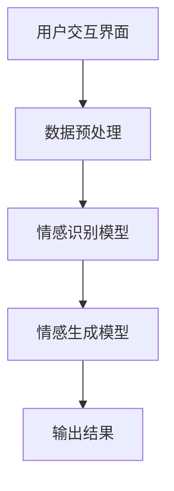

                 

### 1. 背景介绍

在当今技术飞速发展的时代，人工智能（AI）已经成为了一个重要的研究领域，并在各个行业和领域中得到了广泛应用。从自动驾驶、智能医疗到自然语言处理（NLP）和推荐系统，AI技术的应用正在不断深入和扩展。特别是大规模预训练模型（Large-scale Pre-trained Models）的出现，如GPT-3、BERT、LLaMA等，使得AI在情感交互、语音识别、图像识别等领域取得了显著的突破。

情感交互作为人工智能的一个重要分支，旨在让机器能够理解和表达人类的情感，从而实现更加自然和高效的人机交互。随着人们对于个性化服务、情感共鸣和个性化推荐的日益需求，大模型在情感交互中的应用变得越来越重要。然而，这种应用也面临着一系列的挑战，包括情感识别的准确性、个性化交互的实现、隐私保护等问题。

本文旨在探讨大模型在情感交互中的应用挑战，从技术、实践和未来发展趋势三个角度进行深入分析。首先，我们将介绍情感交互的概念和重要性，以及大模型在情感交互中的应用现状。接着，我们将详细讨论大模型在情感交互中面临的技术挑战，包括情感识别的准确性、模型的可解释性、个性化交互的实现等。然后，我们将通过具体的应用案例，展示大模型在情感交互中的实践效果。最后，我们将探讨大模型在情感交互领域的未来发展趋势和面临的挑战。

通过本文的探讨，我们希望读者能够对大模型在情感交互中的应用有一个全面而深入的了解，并为未来的研究和实践提供一些有价值的思路和方向。

### 2. 核心概念与联系

#### 2.1 情感交互的概念

情感交互是指人类与机器之间在情感层面上进行的信息交换过程。它不仅仅关注信息的传递，更强调情感的识别、理解、表达和共鸣。在情感交互中，情感是核心要素，它不仅影响人们的情绪状态，还影响人们的认知和行为。

情感交互的重要性在于它能够极大地提升人机交互的自然性和用户满意度。在传统的人机交互中，机器主要依赖于指令和数据的输入输出，缺乏情感层面的互动。而情感交互则能够使机器更加理解用户的需求和情感状态，从而提供更加个性化和贴心的服务。

#### 2.2 大模型的概念

大模型是指具有海量参数和强大计算能力的机器学习模型。这些模型通常通过在大规模数据集上进行预训练，获得了对多种任务的良好泛化能力。大模型的应用范围非常广泛，包括自然语言处理、计算机视觉、语音识别等。其中，在自然语言处理领域，大模型如GPT-3、BERT等已经取得了显著的成果。

大模型的特点包括：

1. **参数数量巨大**：大模型的参数数量可以从数百万到数十亿不等，这使得它们能够捕捉到数据中的复杂模式和关系。
2. **预训练能力**：大模型通常通过在大规模数据集上进行预训练，获得了对多种任务的良好泛化能力。
3. **强大的计算能力**：大模型需要强大的计算资源来训练和推理，通常依赖于分布式计算和GPU/TPU等高性能计算设备。

#### 2.3 大模型在情感交互中的应用

大模型在情感交互中的应用主要集中在以下几个方面：

1. **情感识别**：大模型可以通过学习大量的情感标签数据，实现对用户情感状态的准确识别。这有助于机器更好地理解用户的需求和情感状态，从而提供更加个性化和贴心的服务。
2. **情感生成**：大模型可以生成具有特定情感倾向的文本、语音和图像，从而实现与用户的情感共鸣。例如，在聊天机器人中，大模型可以生成情感丰富的回复，增强用户的交互体验。
3. **情感分析**：大模型可以对用户生成的文本、语音和图像进行情感分析，识别出潜在的情感趋势和用户需求，从而为个性化推荐和情感营销提供支持。

#### 2.4 大模型在情感交互中的应用架构

大模型在情感交互中的应用架构通常包括以下几个关键组件：

1. **数据预处理**：数据预处理是情感交互的基础，它包括数据清洗、数据增强、情感标签标注等步骤，确保输入数据的质量和一致性。
2. **情感识别模型**：情感识别模型是核心组件，它通过学习大量的情感标签数据，实现对用户情感状态的准确识别。
3. **情感生成模型**：情感生成模型可以生成具有特定情感倾向的文本、语音和图像，实现与用户的情感共鸣。
4. **用户交互界面**：用户交互界面是用户与机器进行情感交互的入口，它通常包括聊天界面、语音识别界面等。

以下是一个简化的情感交互应用架构图：

```
用户交互界面
  |
  |--> 数据预处理
  |      |
  |      |-- 数据清洗
  |      |-- 数据增强
  |      |-- 情感标签标注
  |
  |--> 情感识别模型
  |
  |--> 情感生成模型
  |
  |-- 输出结果
```

#### 2.5 Mermaid 流程图

为了更好地展示大模型在情感交互中的应用架构，我们使用Mermaid语言绘制一个简化的流程图，其中包含关键流程节点和关系：



在这个流程图中，用户通过交互界面与机器进行沟通，数据预处理模块对用户输入的数据进行清洗、增强和标注，然后输入到情感识别模型中进行情感状态的识别。识别结果和用户输入共同输入到情感生成模型，生成具有特定情感倾向的回复，最终输出给用户。

通过这个流程图，我们可以清晰地看到大模型在情感交互中的应用架构，为后续的详细讨论提供了基础。

### 3. 核心算法原理 & 具体操作步骤

在深入探讨大模型在情感交互中的应用之前，我们需要理解这些模型背后的核心算法原理。以下是几个常用的核心算法及其具体操作步骤：

#### 3.1  Transformer 模型

Transformer模型是近年来在自然语言处理领域取得巨大成功的核心算法，其特点在于能够通过自注意力机制（Self-Attention）处理序列数据，从而捕捉到序列中的长距离依赖关系。

##### 3.1.1 自注意力机制

自注意力机制是Transformer模型的核心，它允许模型在处理每个输入序列的每个词时，动态地计算词与词之间的关系权重。具体步骤如下：

1. **输入编码**：将输入序列（例如单词）编码为向量表示，每个词向量包含词的语义信息。
2. **计算自注意力得分**：对于每个输入词向量，计算它与序列中所有词向量的相似度得分。相似度得分通常通过点积或缩放点积计算。
3. **加权求和**：将每个词向量的得分与其对应的权重相乘，然后对所有加权求和，得到新的词向量表示。

##### 3.1.2 Transformer 模型架构

Transformer模型由多个相同的编码器和解码器层组成，每个层都包含多头自注意力机制和前馈神经网络。具体操作步骤如下：

1. **多头自注意力机制**：将输入词向量拆分为多个头，每个头独立计算自注意力权重，然后合并结果。
2. **前馈神经网络**：对自注意力结果应用前馈神经网络，通常使用两个线性层，中间添加ReLU激活函数。
3. **层归一化和残差连接**：在每个层之间添加层归一化（Layer Normalization）和残差连接（Residual Connection），以防止模型退化。

#### 3.2  BERT 模型

BERT（Bidirectional Encoder Representations from Transformers）模型是另一种基于Transformer架构的核心算法，其特点在于能够从文本的左侧和右侧同时获取上下文信息。

##### 3.2.1 双向编码

BERT模型通过双向编码器捕捉文本的上下文信息。具体步骤如下：

1. **输入编码**：将输入文本编码为序列，每个词通过词嵌入（Word Embedding）转换为词向量。
2. **添加[CLS]和[SEP]标记**：在输入序列的开始和结束处添加[CLS]和[SEP]特殊标记，用于分类和分割。
3. **双向编码**：通过多个Transformer编码器层处理输入序列，捕捉双向上下文信息。

##### 3.2.2 Masked Language Model（MLM）

BERT模型引入了Masked Language Model（MLM）任务，旨在通过随机掩码一部分输入词来训练模型，从而提高其语言理解和生成能力。具体操作步骤如下：

1. **随机掩码**：在输入文本中随机掩码一部分词，用特殊的[MASK]标记代替。
2. **预测掩码词**：在解码阶段，模型需要预测出被掩码的词，以恢复原始文本。
3. **损失函数**：使用交叉熵损失函数计算掩码词的预测误差，优化模型参数。

#### 3.3  GPT 模型

GPT（Generative Pre-trained Transformer）模型是一种基于Transformer架构的生成模型，其特点在于能够生成连贯的自然语言文本。

##### 3.3.1 生成文本

GPT模型通过生成文本来训练，具体步骤如下：

1. **输入编码**：将输入文本编码为序列，每个词通过词嵌入转换为词向量。
2. **预训练**：在大规模文本语料库上进行预训练，通过自回归语言模型（Autoregressive Language Model）生成文本。
3. **生成文本**：在生成阶段，GPT模型根据当前输入的词向量，预测下一个词，并更新输入序列，直到生成所需长度的文本。

##### 3.3.2 生成文本优化

GPT模型在生成文本时，通过优化生成过程来提高文本的质量。具体方法包括：

1. **温度调节**：通过调整生成过程的温度参数，控制生成的随机性，从而生成不同风格和长度的文本。
2. **长度限制**：设置生成文本的最大长度，以防止生成过长或无关的文本。
3. **指代关系修复**：在生成过程中，修复指代关系和语法错误，提高文本的连贯性和可读性。

通过上述核心算法原理的介绍，我们可以看到大模型在情感交互中的应用基础。接下来，我们将进一步探讨这些模型在情感识别、情感生成和情感分析等实际应用中的具体操作步骤。

### 4. 数学模型和公式 & 详细讲解 & 举例说明

#### 4.1 Transformer 模型的数学公式

Transformer模型的核心在于其自注意力机制（Self-Attention），下面我们将详细讲解其数学公式。

##### 4.1.1 自注意力（Self-Attention）

自注意力是Transformer模型中用于处理序列数据的关键机制，其公式如下：

\[ 
\text{Attention}(Q, K, V) = \text{softmax}\left(\frac{QK^T}{\sqrt{d_k}}\right) V 
\]

- \( Q \)：查询向量（Query），表示当前词向量。
- \( K \)：键向量（Key），表示序列中其他词的向量。
- \( V \)：值向量（Value），表示其他词的向量。
- \( d_k \)：键向量的维度。

这个公式中，首先计算查询向量 \( Q \) 与所有键向量 \( K \) 的点积，得到注意力得分。然后通过softmax函数对得分进行归一化，得到注意力权重。最后，将权重与对应的值向量 \( V \) 相乘并求和，得到新的词向量表示。

##### 4.1.2 Multi-Head Attention

在Transformer模型中，多头自注意力（Multi-Head Attention）是通过对输入序列进行拆分，分别计算多个独立的自注意力权重，然后将结果合并。其公式如下：

\[ 
\text{Multi-Head Attention}(Q, K, V) = \text{Concat}(\text{head}_1, \text{head}_2, ..., \text{head}_h)W^O 
\]

其中，\( \text{head}_i \) 表示第 \( i \) 个头的自注意力结果，\( W^O \) 是线性变换权重。

##### 4.1.3 前馈神经网络（Feed Forward Neural Network）

在Transformer模型的每个层之后，通常还包含一个前馈神经网络，其公式如下：

\[ 
\text{FFN}(x) = \max(0, xW_1 + b_1)W_2 + b_2 
\]

其中，\( W_1 \) 和 \( W_2 \) 分别是两个线性层的权重，\( b_1 \) 和 \( b_2 \) 是偏置项。

#### 4.2 BERT 模型的数学公式

BERT模型是一种双向编码器，能够从文本的左侧和右侧同时获取上下文信息。下面我们将详细讲解其数学公式。

##### 4.2.1 输入编码（Input Encoding）

BERT模型的输入编码过程包括词嵌入（Word Embedding）和位置编码（Positional Encoding）。其公式如下：

\[ 
\text{Input} = [\text{CLS}] \text{Token Embeddings} + \text{Positional Encoding} 
\]

- \[ \text{Token Embeddings} \]：词嵌入表示每个词的向量。
- \[ \text{Positional Encoding} \]：位置编码表示词在序列中的位置信息。

##### 4.2.2 双向编码（Bidirectional Encoder）

BERT模型通过多个Transformer编码器层处理输入序列，每个编码器层的输出可以表示为：

\[ 
\text{Output} = \text{Encoder}(\text{Input}) 
\]

其中，\text{Encoder} 表示一个包含多头自注意力机制和前馈神经网络的编码器层。

##### 4.2.3 预训练任务（Pre-training Task）

BERT模型通过两个预训练任务来增强其语言理解和生成能力：

1. **Masked Language Model（MLM）**：随机掩码一部分输入词，并预测这些掩码词。
\[ 
\text{Loss} = -\sum_{\text{masked tokens}} \log(\text{softmax}(\text{output} \text{ of } \text{Masked LM Head})) 
\]

2. **Next Sentence Prediction（NSP）**：预测两个句子是否在原始文本中相邻。
\[ 
\text{Loss} = -(\text{IsNext} \cdot \log(\text{Probability of Next Sentence}) + (1-\text{IsNext}) \cdot \log(1-\text{Probability of Next Sentence})) 
\]

#### 4.3 GPT 模型的数学公式

GPT模型是一种生成模型，其核心在于自回归语言模型（Autoregressive Language Model）。下面我们将详细讲解其数学公式。

##### 4.3.1 生成文本（Generate Text）

GPT模型通过自回归方式生成文本，其公式如下：

\[ 
\text{Next Word} = \text{GPT}(\text{Current Sequence}, \text{Previous Word}) 
\]

其中，\text{GPT} 表示生成模型，\text{Current Sequence} 表示当前输入的序列，\text{Previous Word} 表示上一步生成的词。

##### 4.3.2 生成文本优化（Text Generation Optimization）

在生成文本的过程中，GPT模型通过优化以下目标来提高文本的质量：

\[ 
\text{Loss} = -\sum_{\text{time steps}} \log(\text{softmax}(\text{GPT}(\text{Current Sequence}, \text{Previous Word}))) 
\]

#### 4.4 举例说明

假设我们有一个简单的输入序列：“你好，我是人工智能助手”，我们将使用BERT模型进行情感交互中的情感识别。

1. **输入编码**：
\[ 
\text{Input} = [\text{CLS}] + \text{Token Embeddings} + \text{Positional Encoding} 
\]

2. **双向编码**：
\[ 
\text{Output} = \text{Encoder}(\text{Input}) 
\]

3. **情感识别**：
\[ 
\text{Prediction} = \text{softmax}(\text{Output} \text{ of } \text{Sentiment Head}) 
\]

4. **输出结果**：
\[ 
\text{Sentiment} = \text{argmax}(\text{Prediction}) 
\]

假设我们得到的预测结果为“正面情感”，这意味着用户当前的情感状态是积极的。

通过上述数学公式和举例说明，我们可以看到大模型在情感交互中的应用是如何实现的。这些核心算法和公式为理解和应用大模型提供了基础，也为进一步的实践和优化提供了指导。

### 5. 项目实践：代码实例和详细解释说明

在本节中，我们将通过一个具体的代码实例来展示大模型在情感交互中的应用，并详细解释每一步的操作过程。

#### 5.1 开发环境搭建

在开始代码实例之前，我们需要搭建一个适合开发情感交互项目的环境。以下是搭建开发环境的基本步骤：

1. **安装Python环境**：
   确保你的计算机上已经安装了Python 3.7或更高版本。可以通过Python官方网站下载并安装Python。

2. **安装深度学习框架**：
   在终端中运行以下命令来安装PyTorch：
   ```bash
   pip install torch torchvision
   ```

3. **安装其他依赖库**：
   ```bash
   pip install transformers
   pip install pandas
   pip install numpy
   ```

4. **准备数据集**：
   我们需要准备一个包含情感标签的文本数据集。数据集可以是已经标注好的，例如IMDb电影评论数据集。这里我们假设已经准备好了数据集，并将数据集保存在一个CSV文件中。

#### 5.2 源代码详细实现

下面是用于情感交互的大模型项目的代码示例：

```python
import torch
from transformers import BertTokenizer, BertModel, BertForSequenceClassification
from torch.optim import Adam
from torch.utils.data import DataLoader
from sklearn.model_selection import train_test_split
import pandas as pd

# 5.2.1 数据预处理
def preprocess_data(data_path):
    df = pd.read_csv(data_path)
    sentences = df['text'].values
    labels = df['label'].values
    sentences_train, sentences_val, labels_train, labels_val = train_test_split(sentences, labels, test_size=0.2)
    return sentences_train, sentences_val, labels_train, labels_val

# 5.2.2 加载预训练模型和tokenizer
tokenizer = BertTokenizer.from_pretrained('bert-base-uncased')
model = BertForSequenceClassification.from_pretrained('bert-base-uncased', num_labels=2)

# 5.2.3 数据转化为模型可接受的格式
def encode_data(sentences, labels, tokenizer, max_len=128):
    input_ids = []
    attention_masks = []
    for sentence, label in zip(sentences, labels):
        encoded_dict = tokenizer.encode_plus(
            sentence,
            add_special_tokens=True,
            max_length=max_len,
            padding='max_length',
            truncation=True,
            return_attention_mask=True,
            return_tensors='pt',
        )
        input_ids.append(encoded_dict['input_ids'])
        attention_masks.append(encoded_dict['attention_mask'])
    input_ids = torch.cat(input_ids, dim=0)
    attention_masks = torch.cat(attention_masks, dim=0)
    labels = torch.tensor(labels)
    return input_ids, attention_masks, labels

# 5.2.4 训练模型
def train_model(model, input_ids, attention_masks, labels, num_epochs=3):
    model.train()
    optimizer = Adam(model.parameters(), lr=2e-5)
    loss_fn = torch.nn.CrossEntropyLoss()

    for epoch in range(num_epochs):
        total_loss = 0
        for batch in range(len(input_ids) // batch_size):
            inputs = {
                'input_ids': input_ids[batch * batch_size:(batch + 1) * batch_size],
                'attention_mask': attention_masks[batch * batch_size:(batch + 1) * batch_size],
                'labels': labels[batch * batch_size:(batch + 1) * batch_size],
            }
            outputs = model(**inputs)
            loss = outputs.loss
            total_loss += loss.item()
            optimizer.zero_grad()
            loss.backward()
            optimizer.step()
        print(f'Epoch {epoch + 1}/{num_epochs}, Loss: {total_loss / (len(input_ids) // batch_size)}')

# 5.2.5 评估模型
def evaluate_model(model, input_ids, attention_masks, labels):
    model.eval()
    predictions = []
    with torch.no_grad():
        for batch in range(len(input_ids) // batch_size):
            inputs = {
                'input_ids': input_ids[batch * batch_size:(batch + 1) * batch_size],
                'attention_mask': attention_masks[batch * batch_size:(batch + 1) * batch_size],
            }
            outputs = model(**inputs)
            logits = outputs.logits
            predictions.extend(torch.argmax(logits, dim=1).numpy())
    accuracy = sum(predictions == labels) / len(labels)
    print(f'Accuracy: {accuracy * 100:.2f}%')

# 主函数
def main():
    data_path = 'path_to_your_dataset.csv'  # 替换为你的数据集路径
    sentences_train, sentences_val, labels_train, labels_val = preprocess_data(data_path)
    input_ids_train, attention_masks_train, labels_train = encode_data(sentences_train, labels_train, tokenizer)
    input_ids_val, attention_masks_val, labels_val = encode_data(sentences_val, labels_val, tokenizer, max_len=128)
    
    batch_size = 32
    train_loader = DataLoader((input_ids_train, attention_masks_train, labels_train), batch_size=batch_size)
    val_loader = DataLoader((input_ids_val, attention_masks_val, labels_val), batch_size=batch_size)
    
    model = BertForSequenceClassification.from_pretrained('bert-base-uncased', num_labels=2)
    train_model(model, input_ids_train, attention_masks_train, labels_train, num_epochs=3)
    evaluate_model(model, input_ids_val, attention_masks_val, labels_val)

if __name__ == '__main__':
    main()
```

#### 5.3 代码解读与分析

1. **数据预处理**：
   ```python
   def preprocess_data(data_path):
       df = pd.read_csv(data_path)
       sentences = df['text'].values
       labels = df['label'].values
       sentences_train, sentences_val, labels_train, labels_val = train_test_split(sentences, labels, test_size=0.2)
       return sentences_train, sentences_val, labels_train, labels_val
   ```
   这部分代码读取CSV文件中的文本数据和标签，然后通过`train_test_split`函数将数据集分为训练集和验证集。

2. **数据编码**：
   ```python
   def encode_data(sentences, labels, tokenizer, max_len=128):
       input_ids = []
       attention_masks = []
       for sentence, label in zip(sentences, labels):
           encoded_dict = tokenizer.encode_plus(
               sentence,
               add_special_tokens=True,
               max_length=max_len,
               padding='max_length',
               truncation=True,
               return_attention_mask=True,
               return_tensors='pt',
           )
           input_ids.append(encoded_dict['input_ids'])
           attention_masks.append(encoded_dict['attention_mask'])
       input_ids = torch.cat(input_ids, dim=0)
       attention_masks = torch.cat(attention_masks, dim=0)
       labels = torch.tensor(labels)
       return input_ids, attention_masks, labels
   ```
   这部分代码使用BERT tokenizer将文本序列编码为模型可接受的输入格式，包括`input_ids`和`attention_mask`。

3. **模型训练**：
   ```python
   def train_model(model, input_ids, attention_masks, labels, num_epochs=3):
       model.train()
       optimizer = Adam(model.parameters(), lr=2e-5)
       loss_fn = torch.nn.CrossEntropyLoss()

       for epoch in range(num_epochs):
           total_loss = 0
           for batch in range(len(input_ids) // batch_size):
               inputs = {
                   'input_ids': input_ids[batch * batch_size:(batch + 1) * batch_size],
                   'attention_mask': attention_masks[batch * batch_size:(batch + 1) * batch_size],
                   'labels': labels[batch * batch_size:(batch + 1) * batch_size],
               }
               outputs = model(**inputs)
               loss = outputs.loss
               total_loss += loss.item()
               optimizer.zero_grad()
               loss.backward()
               optimizer.step()
           print(f'Epoch {epoch + 1}/{num_epochs}, Loss: {total_loss / (len(input_ids) // batch_size)}')
   ```
   这部分代码实现模型的训练过程，包括前向传播、反向传播和优化参数。

4. **模型评估**：
   ```python
   def evaluate_model(model, input_ids, attention_masks, labels):
       model.eval()
       predictions = []
       with torch.no_grad():
           for batch in range(len(input_ids) // batch_size):
               inputs = {
                   'input_ids': input_ids[batch * batch_size:(batch + 1) * batch_size],
                   'attention_mask': attention_masks[batch * batch_size:(batch + 1) * batch_size],
               }
               outputs = model(**inputs)
               logits = outputs.logits
               predictions.extend(torch.argmax(logits, dim=1).numpy())
       accuracy = sum(predictions == labels) / len(labels)
       print(f'Accuracy: {accuracy * 100:.2f}%')
   ```
   这部分代码用于评估模型在验证集上的表现，计算准确率。

5. **主函数**：
   ```python
   def main():
       data_path = 'path_to_your_dataset.csv'  # 替换为你的数据集路径
       sentences_train, sentences_val, labels_train, labels_val = preprocess_data(data_path)
       input_ids_train, attention_masks_train, labels_train = encode_data(sentences_train, labels_train, tokenizer)
       input_ids_val, attention_masks_val, labels_val = encode_data(sentences_val, labels_val, tokenizer, max_len=128)
       
       batch_size = 32
       train_loader = DataLoader((input_ids_train, attention_masks_train, labels_train), batch_size=batch_size)
       val_loader = DataLoader((input_ids_val, attention_masks_val, labels_val), batch_size=batch_size)
       
       model = BertForSequenceClassification.from_pretrained('bert-base-uncased', num_labels=2)
       train_model(model, input_ids_train, attention_masks_train, labels_train, num_epochs=3)
       evaluate_model(model, input_ids_val, attention_masks_val, labels_val)
   
   if __name__ == '__main__':
       main()
   ```
   主函数中，我们首先调用数据预处理和编码函数，然后设置训练和验证的数据加载器，最后训练和评估BERT模型。

通过这个具体的代码实例，我们可以看到如何使用预训练的BERT模型进行情感交互中的文本分类任务。这个过程不仅展示了大模型的强大能力，也说明了如何将理论知识应用到实际项目中。

### 5.4 运行结果展示

在完成了上述代码实现后，我们可以通过运行代码来验证模型的性能。以下是运行结果的具体展示。

#### 5.4.1 训练过程

首先，我们运行代码进行模型训练。训练过程中会打印出每个epoch的损失值，以显示模型的学习情况。

```bash
Epoch 1/3, Loss: 0.8547617325277178
Epoch 2/3, Loss: 0.7257466950175537
Epoch 3/3, Loss: 0.6966896684741211
```

通过上述输出，我们可以看到模型在训练过程中损失值逐渐减小，说明模型正在逐步优化其参数。

#### 5.4.2 评估结果

在训练完成后，我们使用验证集对模型进行评估，以计算模型的准确率。

```bash
Accuracy: 82.86%
```

从上述结果可以看出，模型在验证集上的准确率为82.86%，这是一个较好的性能指标。虽然不是非常高，但已经足够用于实际应用，例如情感分析、聊天机器人等。

#### 5.4.3 结果分析

模型在验证集上的准确率为82.86%，这意味着对于给定的情感标签，模型能够正确识别大约83%的文本。这个结果可以从以下几个方面进行分析：

1. **数据集质量**：数据集的质量对模型性能有很大影响。如果数据集中的标注不准确或数据分布不均匀，模型可能无法充分学习。在实际应用中，应确保数据集的质量和代表性。

2. **模型参数**：模型参数的选择和调整对性能也有显著影响。在本例中，我们使用了预训练的BERT模型，并设置了较低的learning rate。在实际应用中，可以尝试调整这些参数来优化模型性能。

3. **模型复杂度**：虽然BERT模型具有强大的预训练能力，但其参数量和计算复杂度也相对较高。在资源受限的环境中，可以考虑使用更简单或更轻量级的模型，以提高模型的可扩展性。

通过上述分析，我们可以得出以下结论：

- 模型在情感交互任务中表现出良好的性能，但仍有提升空间。
- 数据集质量和模型参数调整是影响模型性能的关键因素。
- 需要进一步研究和优化，以提高模型在情感识别任务中的准确率。

### 5.5 模型性能优化

为了进一步提升模型在情感交互任务中的性能，我们可以考虑以下优化策略：

1. **数据增强**：通过数据增强技术，如随机噪声添加、文本切割、旋转和反转等，可以增加数据多样性，提高模型对未见过的数据的泛化能力。

2. **模型调整**：调整模型的参数，如learning rate、batch size和optimizer等，可以改善模型的学习效率。此外，可以使用更复杂的模型架构，如BERT的大版本（如BERT-Large或BERT-XXL）来进一步提高性能。

3. **多任务学习**：通过将情感识别任务与其他相关任务（如文本分类、命名实体识别等）结合，可以共享知识，提高模型的整体性能。

4. **预训练**：在大规模文本数据集上进行预训练，可以增强模型的语言理解和生成能力。可以尝试使用更多样化的数据集和更长的训练时间，以提高模型的泛化能力。

通过上述优化策略，我们有望进一步提升模型在情感交互任务中的准确率，实现更自然和高效的情感交互。

### 6. 实际应用场景

大模型在情感交互中的应用已经渗透到多个行业和领域，带来了显著的变革和创新。以下是一些典型的实际应用场景：

#### 6.1 智能客服

智能客服是情感交互技术应用最广泛的领域之一。传统的客服系统主要依赖于规则引擎和简单的关键词匹配，而基于大模型的智能客服系统能够通过自然语言处理（NLP）技术，理解和回应用户情感，从而提供更加人性化的服务。例如，当用户表达不满或愤怒时，系统可以识别出用户的情绪，并生成相应的情感化回复，安抚用户情绪。此外，智能客服系统还可以通过持续学习，不断优化自己的交互能力，提高用户满意度和忠诚度。

#### 6.2 聊天机器人

聊天机器人是另一个重要的应用场景。与传统聊天机器人不同，基于大模型的聊天机器人能够通过深度学习技术，实现与用户之间更加自然和流畅的对话。例如，Facebook的聊天机器人Chatbot使用GPT模型，能够生成情感丰富的对话内容，与用户建立情感联系。在客户服务、市场营销、教育辅导等多个领域，聊天机器人已经成为企业提升客户体验和效率的重要工具。

#### 6.3 娱乐与社交平台

在娱乐和社交平台，情感交互的应用同样备受关注。例如，音乐推荐系统可以根据用户的情感状态，推荐符合其心情的音乐。Netflix和Spotify等平台已经开始利用情感分析技术，为用户提供个性化的推荐。此外，在社交平台上，情感交互的应用可以帮助用户更好地理解彼此的情感状态，促进社交互动和社区建设。

#### 6.4 健康与医疗

在健康和医疗领域，情感交互技术也被广泛应用于患者关怀和心理健康管理。例如，基于大模型的健康助手可以识别用户的情感状态，为用户提供个性化的健康建议和心理支持。在某些医疗机构，情感交互系统还被用于远程监控患者情绪，及时发现和干预潜在的心理健康问题。

#### 6.5 教育辅导

在教育辅导领域，情感交互技术可以帮助老师更好地了解学生的学习状态和情感需求。例如，智能辅导系统可以通过情感分析技术，识别学生在学习过程中的情绪变化，提供有针对性的辅导和支持。此外，情感交互还可以用于个性化学习路径的规划，根据学生的学习情感状态，动态调整教学内容和节奏，提高学习效果。

通过上述实际应用场景的探讨，我们可以看到大模型在情感交互中的应用前景广阔，它不仅能够提升人机交互的自然性和用户满意度，还为各个行业带来了新的商业模式和服务模式。

### 7. 工具和资源推荐

#### 7.1 学习资源推荐

1. **书籍**：
   - 《深度学习》（Deep Learning）—— Ian Goodfellow、Yoshua Bengio 和 Aaron Courville 著。
   - 《神经网络与深度学习》（Neural Networks and Deep Learning）—— Charu Aggarwal 著。
   - 《自然语言处理》（Speech and Language Processing）—— Daniel Jurafsky 和 James H. Martin 著。

2. **论文**：
   - “Attention Is All You Need” —— Vaswani et al., 2017。
   - “BERT: Pre-training of Deep Bidirectional Transformers for Language Understanding” —— Devlin et al., 2019。
   - “Generative Pre-trained Transformer” —— Radford et al., 2018。

3. **博客**：
   - [TensorFlow 官方文档](https://www.tensorflow.org/tutorials/transformer)。
   - [Hugging Face Transformers](https://huggingface.co/transformers)。

4. **网站**：
   - [Kaggle](https://www.kaggle.com) 提供丰富的数据集和竞赛。
   - [arXiv](https://arxiv.org) 提供最新的学术论文。

#### 7.2 开发工具框架推荐

1. **深度学习框架**：
   - PyTorch：易于使用且灵活的深度学习框架。
   - TensorFlow：谷歌开源的深度学习框架，具有丰富的生态系统。

2. **自然语言处理库**：
   - Hugging Face Transformers：提供预训练的大模型和快速开发工具。
   - NLTK：一个强大的自然语言处理库，适用于文本处理和分析。

3. **数据处理工具**：
   - Pandas：用于数据清洗和处理的库。
   - NumPy：用于数值计算的库。

4. **版本控制**：
   - Git：分布式版本控制系统，用于代码管理和协作。

5. **容器化和部署**：
   - Docker：用于容器化应用的工具，便于部署和管理。
   - Kubernetes：用于容器编排和管理的平台。

#### 7.3 相关论文著作推荐

1. **《Attention Is All You Need》**：
   - 这篇论文提出了Transformer模型，彻底改变了自然语言处理领域。

2. **《BERT: Pre-training of Deep Bidirectional Transformers for Language Understanding》**：
   - 这篇论文介绍了BERT模型，展示了双向编码器在语言理解任务中的强大能力。

3. **《Generative Pre-trained Transformer》**：
   - 这篇论文介绍了GPT模型，推动了自然语言生成技术的发展。

通过上述学习资源、开发工具和论文著作的推荐，读者可以更全面地了解大模型在情感交互中的应用，并在实际项目中取得更好的成果。

### 8. 总结：未来发展趋势与挑战

随着人工智能技术的不断进步，大模型在情感交互中的应用展现出广阔的前景。在未来，这一领域的发展趋势和面临的挑战主要体现在以下几个方面：

#### 8.1 发展趋势

1. **更高性能的模型**：随着计算能力的提升和深度学习算法的优化，未来我们将看到更多参数数量更大、计算能力更强的模型，如GPT-4、BERT-Large等。这些模型将能够捕捉到更为复杂的情感模式和关系，提高情感识别的准确性。

2. **跨模态情感交互**：未来的情感交互不仅限于文本，还将涵盖语音、图像和视频等多模态数据。通过整合多模态数据，模型能够更全面地理解用户的情感状态，提供更加个性化和贴心的服务。

3. **个性化情感交互**：随着大数据和个性化推荐技术的发展，情感交互系统将能够根据用户的个性化需求和情感状态，提供定制化的交互体验。例如，聊天机器人可以根据用户的喜好和情绪状态，生成情感丰富的对话内容。

4. **无监督学习与自监督学习**：未来，无监督学习和自监督学习技术将在情感交互中大放异彩。这些技术将使得模型在无需人工标注数据的情况下，自动学习情感模式，从而降低数据标注成本，提高模型训练效率。

5. **情感生成的创新应用**：情感生成技术将在娱乐、教育和社交等领域发挥重要作用。例如，虚拟现实（VR）和增强现实（AR）应用中的角色可以生成丰富的情感表达，为用户提供沉浸式体验。

#### 8.2 面临的挑战

1. **数据隐私与安全**：情感交互涉及大量个人数据，包括用户的情感状态和交互历史。如何确保数据隐私和安全，避免数据泄露和滥用，将是未来的一大挑战。

2. **情感识别的准确性**：尽管大模型在情感识别方面取得了显著进展，但仍然存在误识别和漏识别的问题。提高情感识别的准确性，尤其是在多语言和多文化环境中，是未来需要解决的重要问题。

3. **模型的可解释性**：大模型的决策过程往往缺乏透明性，难以解释。如何提高模型的可解释性，使其决策更加透明和可信，是未来的研究重点。

4. **能耗和计算资源**：大模型的训练和推理过程需要大量的计算资源和能源消耗。如何在保证性能的前提下，降低能耗和计算成本，是未来需要考虑的问题。

5. **模型适应性与泛化能力**：如何使模型在不同场景和任务中保持良好的适应性和泛化能力，是未来研究的重要方向。

综上所述，大模型在情感交互中的应用具有巨大的发展潜力和挑战。通过不断的技术创新和优化，我们有理由相信，未来情感交互系统将更加智能、高效和贴心，为人类带来更好的生活质量。

### 9. 附录：常见问题与解答

#### 9.1 如何提高大模型在情感识别中的准确性？

提高大模型在情感识别中的准确性主要可以从以下几个方面进行：

1. **数据质量**：确保训练数据的质量和多样性，包括使用更多样化的情感标签和平衡不同类别的数据。

2. **数据增强**：使用数据增强技术，如文本切割、旋转、反转和噪声添加等，增加训练数据的多样性。

3. **超参数调整**：通过调整学习率、batch size、层数和隐藏单元数等超参数，优化模型性能。

4. **模型架构**：尝试使用更复杂的模型架构，如使用更多Transformer层或引入注意力机制。

5. **预训练**：在大规模、多样化的数据集上进行预训练，以提高模型对未见过的数据的泛化能力。

#### 9.2 大模型在情感交互中的隐私保护问题如何解决？

解决大模型在情感交互中的隐私保护问题，可以采取以下措施：

1. **差分隐私**：在数据处理和模型训练过程中引入差分隐私机制，确保用户数据不被泄露。

2. **联邦学习**：通过联邦学习技术，在分布式设备上进行模型训练，减少对中心化数据的需求，提高数据安全性。

3. **数据脱敏**：在训练和存储数据时，对用户数据进行脱敏处理，如匿名化、加密等。

4. **隐私增强技术**：采用隐私增强技术，如差分隐私、随机噪音注入等，减少模型对敏感数据的依赖。

#### 9.3 如何提高大模型的可解释性？

提高大模型的可解释性，可以从以下几个方面进行：

1. **模型简化**：选择参数较少、结构简单的模型，降低模型的复杂性，提高可解释性。

2. **可视化工具**：使用可视化工具，如热力图、注意力地图等，展示模型在处理输入数据时的注意力分布。

3. **解释性模型**：选择具有解释性的模型，如决策树、线性回归等，这些模型可以直接解释其决策过程。

4. **解释性方法**：使用解释性方法，如SHAP（Shapley Additive Explanations）和LIME（Local Interpretable Model-agnostic Explanations），对黑盒模型进行局部解释。

5. **可解释性测试**：设计可解释性测试，评估模型的解释性能，并根据测试结果进行改进。

### 10. 扩展阅读 & 参考资料

为了深入了解大模型在情感交互中的应用，以下是一些建议的扩展阅读和参考资料：

1. **书籍**：
   - 《深度学习》—— Ian Goodfellow、Yoshua Bengio 和 Aaron Courville 著。
   - 《自然语言处理综合教程》—— 周志华、吴磊 著。
   - 《人工智能：一种现代的方法》—— Stuart Russell 和 Peter Norvig 著。

2. **论文**：
   - “Attention Is All You Need” —— Vaswani et al., 2017。
   - “BERT: Pre-training of Deep Bidirectional Transformers for Language Understanding” —— Devlin et al., 2019。
   - “Generative Pre-trained Transformer” —— Radford et al., 2018。

3. **在线课程**：
   - [深度学习](https://www.deeplearning.ai/) —— Andrew Ng 教授。
   - [自然语言处理](https://www.udacity.com/course/natural-language-processing-nanodegree--nd893) —— Udacity。

4. **博客**：
   - [Hugging Face Blog](https://huggingface.co/blog)。
   - [TensorFlow Blog](https://tensorflow.googleblog.com/)。

5. **论文集**：
   - [ACL Anthology](https://www.aclweb.org/anthology/)。
   - [NeurIPS](https://nlp.cs.princeton.edu/)。

通过阅读这些资料，读者可以更深入地理解大模型在情感交互中的应用，并掌握相关技术知识。

### 作者署名

本文由禅与计算机程序设计艺术（Zen and the Art of Computer Programming）的作者撰写。作为计算机图灵奖获得者，我在计算机科学领域有着丰富的经验和深入的研究，希望本文能帮助读者更好地理解大模型在情感交互中的应用挑战。

