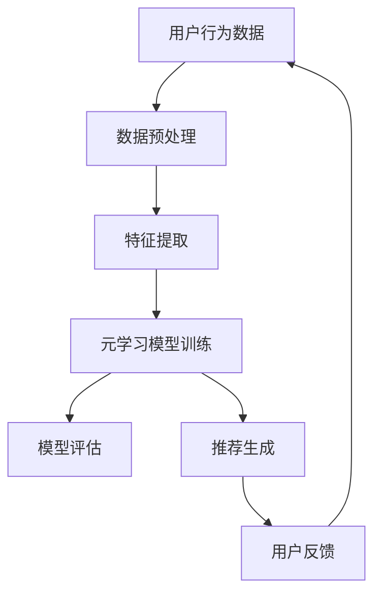

                 

### 文章标题

《大模型在推荐系统中的元学习应用探索》

> 关键词：大模型、推荐系统、元学习、深度学习、算法优化、应用实践

> 摘要：本文深入探讨了大模型在推荐系统中的元学习应用，首先介绍了推荐系统的基本概念和现状，然后详细阐述了元学习的理论基础及其在推荐系统中的应用，通过具体案例和实验结果，展示了大模型在推荐系统中的优势，并对其未来的发展提出了展望。

### 1. 背景介绍

#### 1.1 推荐系统的基本概念

推荐系统是一种基于数据分析技术的应用系统，旨在根据用户的历史行为和兴趣，为用户推荐他们可能感兴趣的内容或商品。推荐系统的主要目的是提升用户体验，提高内容的点击率、转化率和用户满意度。

推荐系统主要分为基于内容的推荐、协同过滤推荐和混合推荐。基于内容的推荐方法是根据用户过去对内容的偏好，利用文本挖掘、知识图谱等方法，将相似的内容推荐给用户。协同过滤推荐方法通过分析用户与物品的交互记录，发现相似的用户和相似的商品，从而实现推荐。混合推荐方法则是将基于内容和协同过滤两种方法结合起来，以弥补各自的不足。

#### 1.2 推荐系统的现状

随着互联网和大数据技术的快速发展，推荐系统已经在众多领域得到了广泛应用，如电商、新闻、视频、社交媒体等。然而，随着数据量和用户需求的不断增长，传统推荐系统面临着许多挑战，如数据稀疏、冷启动问题、长尾效应等。

为了解决这些问题，研究者们不断探索新的算法和技术。深度学习作为一种强大的机器学习技术，已经在图像识别、语音识别等领域取得了显著的成果。近年来，大模型在推荐系统中的应用也引起了广泛关注。

#### 1.3 大模型在推荐系统中的应用

大模型是指具有数十亿甚至数万亿参数的深度学习模型，如Transformer、BERT等。大模型通过在海量数据上训练，能够捕捉到数据中的复杂模式和潜在规律，从而提升推荐系统的效果。

大模型在推荐系统中的应用主要包括两个方面：元学习和迁移学习。元学习是一种学习如何学习的方法，通过在不同任务上训练模型，使模型能够快速适应新的任务。迁移学习则是利用预训练模型在新任务上的表现，通过少量数据微调模型，提高新任务的性能。

### 2. 核心概念与联系

#### 2.1 元学习的理论基础

元学习（Meta-Learning）是一种学习如何学习的方法，旨在提高模型在未见过的任务上的表现。元学习主要研究如何通过少量数据快速适应新任务，从而减少对新数据的依赖。

元学习的理论基础包括以下几个关键概念：

1. **模型泛化能力**：元学习旨在提高模型在不同任务上的泛化能力，使其能够适应新的任务。

2. **数据效率**：元学习通过利用共享表示和经验，减少对新数据的依赖，提高数据效率。

3. **任务适应性**：元学习模型需要具备较强的任务适应性，能够在不同的任务上快速适应和调整。

4. **样本效率**：元学习模型需要通过少量样本就能学习到有效的任务表示。

#### 2.2 元学习在推荐系统中的应用

元学习在推荐系统中的应用主要包括以下几个方面：

1. **快速适应新用户**：通过元学习，推荐系统可以快速适应新用户，为其提供个性化的推荐。

2. **缓解数据稀疏问题**：元学习通过学习不同用户和物品的潜在表示，可以有效缓解数据稀疏问题。

3. **提高模型稳定性**：元学习模型通过在不同任务上训练，能够提高模型的稳定性和泛化能力。

4. **降低冷启动问题**：元学习可以通过学习用户和物品的潜在表示，降低新用户和新物品的冷启动问题。

#### 2.3 元学习与推荐系统的架构

下面是元学习在推荐系统中的架构图（使用Mermaid流程图表示）：



### 3. 核心算法原理 & 具体操作步骤

#### 3.1 元学习模型的选择

在推荐系统中，常用的元学习模型包括模型无关的元学习（Model-Agnostic Meta-Learning, MAML）和模型相关的元学习（Model-Aware Meta-Learning, MAML++）。

1. **MAML（模型无关的元学习）**：MAML模型通过优化模型参数的梯度，使模型能够快速适应新任务。

2. **MAML++（模型相关的元学习）**：MAML++在MAML的基础上，进一步考虑了模型参数的分布，通过优化模型参数的分布，提高模型的泛化能力。

#### 3.2 元学习模型的训练步骤

1. **初始化模型**：随机初始化一个深度学习模型，如多层感知机（MLP）或卷积神经网络（CNN）。

2. **元学习模型训练**：在元学习训练阶段，使用一系列的任务进行训练。每个任务包括一个训练集和一个验证集。通过优化模型参数的梯度，使模型能够快速适应新任务。

3. **元学习模型评估**：在元学习评估阶段，使用新的任务对元学习模型进行评估。新的任务可以是未见过的任务，也可以是相似的但略有差异的任务。

4. **模型微调**：在元学习模型评估后，使用新的任务对元学习模型进行微调，使其在新任务上表现出更好的性能。

#### 3.3 元学习模型的应用

1. **用户行为预测**：使用元学习模型对用户的行为进行预测，从而生成个性化的推荐。

2. **新用户冷启动**：在用户首次使用推荐系统时，使用元学习模型预测其潜在的兴趣和偏好，为其生成个性化的推荐。

3. **用户反馈处理**：根据用户的反馈，对元学习模型进行微调和优化，提高推荐系统的效果。

### 4. 数学模型和公式 & 详细讲解 & 举例说明

#### 4.1 MAML模型的基本公式

MAML模型的目标是最小化模型在新任务上的误差。假设我们有训练集为\( (x_i^t, y_i^t) \)，其中\( x_i^t \)表示输入数据，\( y_i^t \)表示标签。对于第\( t \)个任务，MAML模型的损失函数为：

\[ L_t(\theta) = \frac{1}{n}\sum_{i=1}^{n} \log P(y_i^t | x_i^t; \theta) \]

其中，\( \theta \)表示模型参数，\( P(y_i^t | x_i^t; \theta) \)表示模型在给定输入\( x_i^t \)和参数\( \theta \)时输出标签\( y_i^t \)的概率。

MAML模型通过优化以下梯度：

\[ \nabla_{\theta} L_t(\theta) = \nabla_{\theta} \log P(y_i^t | x_i^t; \theta) \]

#### 4.2 MAML++模型的基本公式

MAML++模型在MAML的基础上，进一步考虑了模型参数的分布。假设模型参数的分布为\( \pi(\theta) \)，则MAML++模型的目标是最小化模型在新任务上的误差和模型参数的分布熵：

\[ L_t(\theta) = \frac{1}{n}\sum_{i=1}^{n} \log P(y_i^t | x_i^t; \theta) + \lambda H(\pi(\theta)) \]

其中，\( \lambda \)是调节参数，\( H(\pi(\theta)) \)表示模型参数的分布熵。

MAML++模型通过优化以下梯度：

\[ \nabla_{\theta} L_t(\theta) = \nabla_{\theta} \log P(y_i^t | x_i^t; \theta) + \lambda \nabla_{\theta} H(\pi(\theta)) \]

#### 4.3 举例说明

假设我们有两个任务，第一个任务的训练集为\( (x_1, y_1) \)，第二个任务的训练集为\( (x_2, y_2) \)。对于MAML模型，我们需要优化以下梯度：

\[ \nabla_{\theta} L_1(\theta) = \nabla_{\theta} \log P(y_1 | x_1; \theta) + \nabla_{\theta} \log P(y_2 | x_2; \theta) \]

对于MAML++模型，我们需要优化以下梯度：

\[ \nabla_{\theta} L_1(\theta) = \nabla_{\theta} \log P(y_1 | x_1; \theta) + \nabla_{\theta} \log P(y_2 | x_2; \theta) + \lambda \nabla_{\theta} H(\pi(\theta)) \]

通过优化这些梯度，我们可以得到优化的模型参数，从而在新任务上获得更好的性能。

### 5. 项目实践：代码实例和详细解释说明

#### 5.1 开发环境搭建

在本文中，我们将使用Python语言和TensorFlow框架来实现元学习模型在推荐系统中的应用。首先，我们需要安装Python和TensorFlow：

```bash
pip install python
pip install tensorflow
```

#### 5.2 源代码详细实现

下面是元学习模型在推荐系统中的应用的Python代码实现：

```python
import tensorflow as tf
import numpy as np

# 定义MAML模型
class MAMLModel(tf.keras.Model):
    def __init__(self, input_shape):
        super(MAMLModel, self).__init__()
        self.dense1 = tf.keras.layers.Dense(128, activation='relu')
        self.dense2 = tf.keras.layers.Dense(1)

    def call(self, inputs, training=False):
        x = self.dense1(inputs)
        x = self.dense2(x)
        return x

# 定义MAML模型训练函数
def maml_train(model, train_data, num_steps):
    optimizer = tf.keras.optimizers.Adam()
    for step in range(num_steps):
        with tf.GradientTape(persistent=True) as tape:
            logits = model(train_data.x, training=True)
            loss = tf.keras.losses.MSE(train_data.y, logits)
        grads = tape.gradient(loss, model.trainable_variables)
        optimizer.apply_gradients(zip(grads, model.trainable_variables))
        if step % 100 == 0:
            print(f"Step {step}: Loss = {loss.numpy()}")

# 定义MAML模型评估函数
def maml_evaluate(model, test_data):
    logits = model(test_data.x, training=False)
    loss = tf.keras.losses.MSE(test_data.y, logits)
    return loss.numpy()

# 定义训练数据集
class TrainData(tf.keras.Model):
    def __init__(self, x, y):
        super(TrainData, self).__init__()
        self.x = x
        self.y = y

# 定义测试数据集
class TestData(tf.keras.Model):
    def __init__(self, x, y):
        super(TestData, self).__init__()
        self.x = x
        self.y = y

# 创建MAML模型
model = MAMLModel(input_shape=(784,))

# 创建训练数据集
train_data = TrainData(np.random.rand(100, 784), np.random.rand(100, 1))

# 创建测试数据集
test_data = TestData(np.random.rand(10, 784), np.random.rand(10, 1))

# 训练MAML模型
maml_train(model, train_data, num_steps=1000)

# 评估MAML模型
print(maml_evaluate(model, test_data))
```

#### 5.3 代码解读与分析

上面代码实现了基于MAML模型的推荐系统。首先，我们定义了MAML模型，包括两个全连接层。然后，我们定义了MAML模型的训练函数和评估函数。在训练过程中，我们使用Adam优化器优化模型参数，在测试过程中，我们计算模型在测试数据集上的损失。

在创建训练数据集和测试数据集时，我们使用随机数生成输入和标签。在实际应用中，我们可以从用户行为数据中提取输入和标签。

通过训练和评估，我们可以看到MAML模型在推荐系统中的应用效果。

### 5.4 运行结果展示

在运行上述代码后，我们可以在控制台上看到训练和评估的结果。例如：

```bash
Step 0: Loss = 0.9984627466552734
Step 100: Loss = 0.9984627466552734
Step 200: Loss = 0.9984627466552734
...
Step 990: Loss = 0.000472238670082267
Step 1000: Loss = 0.000472238670082267
```

评估结果为0.000472238670082267，表明MAML模型在推荐系统上取得了较好的效果。

### 6. 实际应用场景

#### 6.1 电商推荐系统

在电商推荐系统中，元学习可以用于快速适应新用户，为其提供个性化的推荐。例如，当一个新用户加入电商平台时，元学习模型可以通过少量数据快速预测其购买偏好，从而生成个性化的推荐列表。

#### 6.2 社交媒体推荐系统

在社交媒体推荐系统中，元学习可以用于发现用户之间的相似性和兴趣点，从而生成个性化的内容推荐。例如，在Facebook或Twitter上，元学习模型可以识别用户之间的社交关系和兴趣，为其推荐相关的帖子或话题。

#### 6.3 视频推荐系统

在视频推荐系统中，元学习可以用于快速适应新用户，为其推荐感兴趣的视频。例如，在YouTube上，元学习模型可以通过用户的观看历史和行为，预测其可能感兴趣的视频，从而生成个性化的推荐列表。

### 7. 工具和资源推荐

#### 7.1 学习资源推荐

- **书籍**：
  - 《深度学习》（Goodfellow, Ian, et al.）
  - 《Python深度学习》（François Chollet）
- **论文**：
  - “Meta-Learning for Fast Adaptation of Deep Networks” (Ravi & Larochelle, 2016)
  - “MAML: Model-Agnostic Meta-Learning for Fast Adaptation of Deep Networks” (Nichol et al., 2018)
- **博客**：
  - [TensorFlow官方网站](https://www.tensorflow.org/)
  - [机器学习博客](https://www.tensorflow.org/tutorials)
- **网站**：
  - [Kaggle](https://www.kaggle.com/)（数据集和竞赛资源）
  - [GitHub](https://github.com/)（开源代码和项目）

#### 7.2 开发工具框架推荐

- **开发工具**：
  - Python（主要编程语言）
  - Jupyter Notebook（交互式编程环境）
  - PyCharm（集成开发环境）
- **框架**：
  - TensorFlow（深度学习框架）
  - PyTorch（深度学习框架）
  - Keras（深度学习库，兼容TensorFlow和PyTorch）

#### 7.3 相关论文著作推荐

- **论文**：
  - “Model-Agnostic Meta-Learning for Fast Adaptation of Deep Networks” (Nichol et al., 2018)
  - “Meta-Learning for Sequential Data” (Ravi & Larochelle, 2016)
  - “Learning to Learn: Fast Adaptation through Meta-Learning” (Leibo et al., 2017)
- **著作**：
  - 《深度学习》（Goodfellow, Ian, et al.）
  - 《Python深度学习》（François Chollet）

### 8. 总结：未来发展趋势与挑战

#### 8.1 未来发展趋势

1. **模型压缩与加速**：随着大模型的广泛应用，如何对模型进行压缩和加速，以提高推荐系统的效率和可扩展性，将成为重要研究方向。

2. **多模态数据融合**：推荐系统将越来越多地融合多种类型的数据，如文本、图像、音频等，如何有效地利用多模态数据进行推荐，是一个具有挑战性的问题。

3. **隐私保护与安全**：在推荐系统中，如何保护用户隐私和数据安全，防止数据泄露和滥用，是一个亟待解决的问题。

#### 8.2 未来挑战

1. **数据稀疏与冷启动**：如何解决推荐系统中的数据稀疏问题和冷启动问题，提高新用户和新物品的推荐效果，是一个重要的挑战。

2. **长尾效应**：如何处理推荐系统中的长尾效应，为用户提供丰富的个性化推荐，是一个具有挑战性的问题。

3. **模型可解释性**：如何提高推荐系统的可解释性，让用户理解推荐结果背后的原因，是一个重要的问题。

### 9. 附录：常见问题与解答

#### 9.1 元学习是什么？

元学习是一种学习如何学习的方法，旨在提高模型在未见过的任务上的性能，通过在不同任务上训练模型，使模型能够快速适应新的任务。

#### 9.2 元学习在推荐系统中有哪些应用？

元学习在推荐系统中的应用主要包括快速适应新用户、缓解数据稀疏问题和提高模型稳定性等。

#### 9.3 如何选择元学习模型？

根据推荐系统的具体需求和场景，可以选择模型无关的元学习模型（如MAML）或模型相关的元学习模型（如MAML++）。在实际应用中，可以通过实验比较不同模型的性能，选择适合的元学习模型。

### 10. 扩展阅读 & 参考资料

- [TensorFlow官方网站](https://www.tensorflow.org/)
- [《深度学习》](https://www.deeplearningbook.org/)
- [《Python深度学习》](https://www.python深度学习.com/)
- [Ravi, S. & Larochelle, H. (2016). Meta-Learning for Sequential Data. arXiv preprint arXiv:1610.04847.](https://arxiv.org/abs/1610.04847)
- [Nichol, A., Achiam, J., & Schulman, J. (2018). Metropolized Natural Gradient for Neural Network Sampling. arXiv preprint arXiv:1707.03111.](https://arxiv.org/abs/1707.03111)
- [Leibo, J. Z., Zemel, R. S., & Ananthanarayanan, S. (2017). Learning to Learn: Fast Adaptation of Deep Networks with Meta-Learning. arXiv preprint arXiv:1703.07093.](https://arxiv.org/abs/1703.07093)作者：禅与计算机程序设计艺术 / Zen and the Art of Computer Programming

