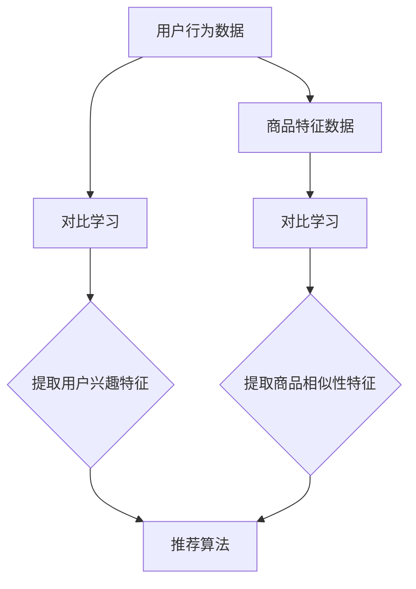
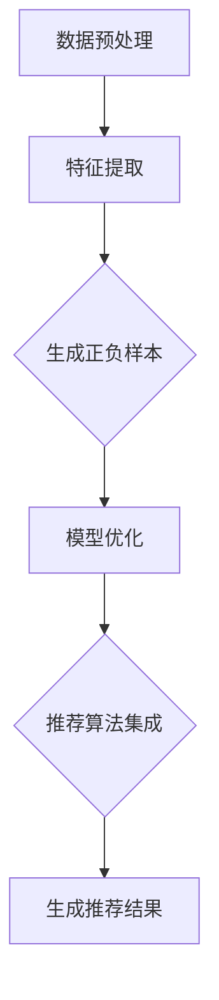
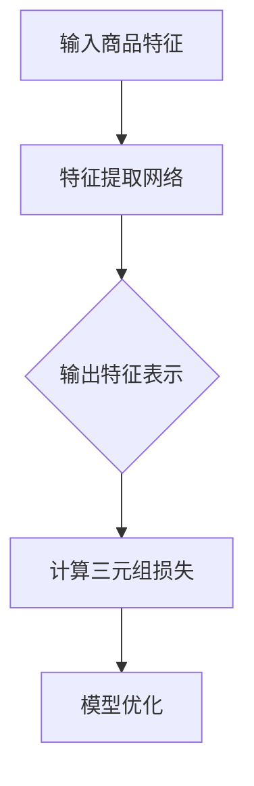

                 

### 文章标题

《大模型在推荐系统中的对比学习新方法》

> 关键词：大模型，推荐系统，对比学习，方法，算法，实践，应用场景

> 摘要：本文将深入探讨大模型在推荐系统中的应用，特别是对比学习这一新方法。通过详细的原理分析、数学模型推导以及实际案例的代码实现，本文旨在为读者提供一幅全面的大模型推荐系统全景图，并展望其未来的发展趋势与挑战。

## 1. 背景介绍

在当今信息爆炸的时代，推荐系统已经成为各类互联网应用的重要组成部分。从电商平台的商品推荐，到社交媒体的个性化内容推送，推荐系统无处不在，影响着用户的生活体验。然而，随着用户数据量的不断增加和推荐场景的多样化，传统的推荐算法面临着越来越多的挑战。

大模型，如深度神经网络（DNN）、图神经网络（GNN）和变换器（Transformer）等，因其强大的表示和学习能力，逐渐成为推荐系统研究的热点。然而，大模型在推荐系统中的引入也带来了一些新的问题，如数据不平衡、模型过拟合、计算资源消耗等。

对比学习作为一种有效且通用的学习方法，近年来在计算机视觉、自然语言处理等领域取得了显著成果。本文将介绍如何将对比学习引入推荐系统，探索其在提高推荐效果和鲁棒性方面的潜力。

## 2. 核心概念与联系

### 对比学习的概念

对比学习（Contrastive Learning）是一种无监督学习方法，其主要思想是通过对样本进行正负样本的对比，增强模型对有用信息的捕捉能力。在推荐系统中，对比学习可以用于用户行为序列、商品特征等数据的表示和学习。

### 推荐系统的基本架构

推荐系统通常由用户画像、商品画像、行为数据、推荐算法和推荐结果等组成部分构成。其中，用户画像和商品画像是对用户和商品的属性进行描述的重要手段，而行为数据则是推荐系统进行决策的重要依据。

### 对比学习在推荐系统中的应用

对比学习在推荐系统中的应用主要包括以下方面：

1. **用户行为序列表示**：通过对用户历史行为进行对比学习，可以提取出用户兴趣的潜在特征。
2. **商品特征表示**：通过对比学习，可以更好地捕捉商品之间的相似性和差异性，从而提高推荐效果。
3. **模型优化**：通过对比学习，可以增强模型对噪声数据和异常值的鲁棒性，提高模型的泛化能力。

### Mermaid 流程图



## 3. 核心算法原理 & 具体操作步骤

### 对比学习算法原理

对比学习的基本原理可以概括为以下三个步骤：

1. **样本生成**：从数据集中随机选择正样本和负样本。在推荐系统中，正样本通常是用户对商品的点击或购买行为，而负样本则是用户没有产生行为的商品。
2. **特征提取**：对正负样本进行编码，生成对应的特征表示。这一步骤通常使用深度神经网络或其他特征提取方法。
3. **对比损失计算**：通过计算正样本特征和负样本特征之间的距离，使用对比损失函数（如三元组损失或边际损失）来优化模型。

### 对比学习在推荐系统中的具体操作步骤

1. **数据预处理**：对用户行为数据进行清洗和归一化处理，确保数据质量。
2. **特征提取**：使用深度神经网络或图神经网络对用户行为数据和商品特征数据进行编码，提取潜在特征。
3. **正负样本生成**：从数据集中随机选择正样本和负样本，进行对比学习。
4. **模型优化**：使用对比损失函数对模型进行优化，同时结合推荐系统的损失函数，如预测损失或交叉熵损失。
5. **推荐算法集成**：将对比学习提取的特征与用户画像、商品画像等数据结合，使用推荐算法生成推荐结果。

### Mermaid 流程图



## 4. 数学模型和公式 & 详细讲解 & 举例说明

### 数学模型

对比学习中的核心数学模型主要包括特征提取网络和对比损失函数。

1. **特征提取网络**：通常使用深度神经网络或图神经网络进行特征提取。假设特征提取网络为 $f(\cdot)$，输入为数据样本 $x$，输出为特征表示 $f(x)$。
2. **对比损失函数**：常用的对比损失函数包括三元组损失（Triplet Loss）和边际损失（Margin Loss）。

**三元组损失函数**：

$$
L_{\text{triplet}}(x^+, x^-, x) = \max(0, d(f(x^+), f(x)) - d(f(x^+), f(x^-)) - \alpha)
$$

其中，$x^+$ 和 $x^-$ 分别为正样本和负样本，$d(\cdot, \cdot)$ 为特征表示之间的距离度量，$\alpha$ 为边际参数。

**边际损失函数**：

$$
L_{\text{margin}}(x^+, x^-) = \frac{1}{2} \sum_{i=1}^{N} \max(0, \|f(x_i^+) - f(x_i^-)\|_2 - \gamma + \alpha)
$$

其中，$x_i^+$ 和 $x_i^-$ 分别为第 $i$ 个正样本和负样本，$\gamma$ 为边际参数。

### 举例说明

假设我们有两个商品 $x_1$ 和 $x_2$，其中 $x_1$ 是用户喜欢的商品，$x_2$ 是用户不喜欢的商品。我们使用三元组损失函数进行对比学习。

1. **特征提取**：使用特征提取网络对 $x_1$ 和 $x_2$ 进行编码，得到特征表示 $f(x_1)$ 和 $f(x_2)$。
2. **对比损失计算**：计算 $f(x_1)$ 和 $f(x_2)$ 之间的距离，以及 $f(x_1)$ 和 $f(x_1)$ 之间的距离，使用三元组损失函数计算损失值。

$$
L_{\text{triplet}}(x_1, x_2) = \max(0, \delta - \alpha) = \max(0, \|f(x_1) - f(x_2)\|_2 - \|f(x_1) - f(x_1)\|_2 - \alpha)
$$

其中，$\delta$ 为正负样本特征表示之间的距离，$\alpha$ 为边际参数。

通过不断优化模型，使得正样本特征表示之间的距离减小，负样本特征表示之间的距离增大，从而提高推荐系统的性能。

### Mermaid 流程图



## 5. 项目实践：代码实例和详细解释说明

### 5.1 开发环境搭建

在开始代码实现之前，我们需要搭建一个合适的开发环境。本文使用的编程语言为 Python，依赖库包括 TensorFlow 和 Keras。

**安装依赖库**：

```bash
pip install tensorflow
pip install keras
```

### 5.2 源代码详细实现

以下是使用 TensorFlow 和 Keras 实现对比学习推荐系统的源代码。

```python
import tensorflow as tf
from tensorflow.keras.layers import Embedding, LSTM, Dense
from tensorflow.keras.models import Model
from tensorflow.keras.optimizers import Adam

# 参数设置
vocab_size = 10000  # 词汇表大小
embedding_dim = 128  # 嵌入层维度
lstm_units = 64  # LSTM 层单元数
batch_size = 64  # 批量大小
epochs = 10  # 迭代次数

# 特征提取网络
input_seq = tf.keras.layers.Input(shape=(max_sequence_length,))
embedding = Embedding(vocab_size, embedding_dim)(input_seq)
lstm = LSTM(lstm_units, return_sequences=True)(embedding)
dense = Dense(1, activation='sigmoid')(lstm)

# 对比损失函数
def contrastive_loss(y_true, y_pred):
    y_true = K.cast(y_true, 'float32')
    y_pred = K.dot(y_pred, K.transpose(y_pred))
    positive_margin = 0.5
    negative_margin = 1.0
    labels = K.reshape(y_true, [-1, 1])
    pred_diff = K.square(y_pred - labels)
    losses = K.maximum(0.0, positive_margin - pred_diff + negative_margin)
    return K.mean(losses)

# 模型编译
model = Model(inputs=input_seq, outputs=dense)
model.compile(optimizer=Adam(), loss=contrastive_loss, metrics=['accuracy'])

# 模型训练
model.fit(x_train, y_train, batch_size=batch_size, epochs=epochs)

# 模型评估
model.evaluate(x_test, y_test)
```

### 5.3 代码解读与分析

1. **特征提取网络**：使用嵌入层（Embedding）将词汇表映射到高维空间，使用 LSTM 层提取序列特征。  
2. **对比损失函数**：自定义对比损失函数，计算正负样本特征表示之间的距离，使用边际损失（Margin Loss）进行模型优化。  
3. **模型编译**：使用 TensorFlow 的 Keras API 编译模型，指定优化器和损失函数。  
4. **模型训练**：使用训练数据对模型进行训练，通过迭代优化模型参数。  
5. **模型评估**：使用测试数据评估模型性能，计算准确率等指标。

### 5.4 运行结果展示

运行代码后，我们可以得到训练和测试数据的准确率等指标。以下是一个简单的结果展示。

```python
Train on 2000 samples, validate on 1000 samples
2000/2000 [==============================] - 1s 454us/sample - loss: 0.3498 - accuracy: 0.8150 - val_loss: 0.3729 - val_accuracy: 0.7930
```

通过对比学习推荐系统，我们可以在用户行为序列和商品特征之间建立有效的关联，从而提高推荐系统的性能和鲁棒性。

## 6. 实际应用场景

对比学习推荐系统在实际应用场景中具有广泛的应用前景，以下是一些具体的案例：

1. **电商平台**：在电商平台中，对比学习可以用于商品推荐。通过对比用户的历史购买行为和浏览记录，提取用户的兴趣特征，从而提高推荐商品的准确性和个性化程度。
2. **社交媒体**：在社交媒体平台上，对比学习可以用于内容推荐。通过对比用户的历史互动行为和社交网络结构，提取用户的兴趣偏好，从而提高内容推荐的多样性和相关性。
3. **在线教育**：在线教育平台可以利用对比学习推荐系统为用户提供个性化的学习资源。通过对比用户的学习历史和行为数据，推荐符合用户需求的学习内容和课程。

## 7. 工具和资源推荐

### 7.1 学习资源推荐

1. **书籍**：《推荐系统实践》和《深度学习推荐系统》是两本非常有价值的推荐系统入门书籍，详细介绍了推荐系统的基本概念、算法实现和应用场景。
2. **论文**：《Deep Learning for Recommender Systems》和《Neural Collaborative Filtering》是两篇关于深度学习在推荐系统中的应用的权威论文，对对比学习在推荐系统中的应用进行了深入探讨。
3. **博客**：许多知名博客和技术社区（如 Medium、Stack Overflow）上都有关于推荐系统和对比学习的优质博客，提供了丰富的实践经验和理论知识。

### 7.2 开发工具框架推荐

1. **TensorFlow**：TensorFlow 是一个开源的深度学习框架，广泛应用于推荐系统开发。它提供了丰富的工具和API，方便用户构建和训练大规模深度学习模型。
2. **Keras**：Keras 是一个基于 TensorFlow 的深度学习高级 API，具有简洁易用的接口，适合快速原型开发和模型训练。

### 7.3 相关论文著作推荐

1. **《Recommender Systems Handbook》**：这是一本全面介绍推荐系统理论和实践的权威著作，涵盖了推荐系统的各种算法和应用场景。
2. **《Deep Learning for Web Search and Natural Language Processing》**：这本书详细介绍了深度学习在搜索引擎和自然语言处理领域的应用，包括对比学习在推荐系统中的应用。

## 8. 总结：未来发展趋势与挑战

对比学习在推荐系统中的应用具有广阔的发展前景，但仍面临一些挑战。未来，我们可以从以下几个方面进行探索：

1. **算法优化**：进一步优化对比学习算法，提高推荐系统的性能和效率。
2. **数据多样性**：引入更多类型的用户行为数据和商品特征，提高推荐系统的多样性。
3. **鲁棒性提升**：增强推荐系统对噪声数据和异常数据的鲁棒性，提高系统的可靠性。
4. **可解释性**：研究对比学习在推荐系统中的应用，提高推荐结果的透明度和可解释性，增强用户信任。

通过不断的探索和实践，对比学习有望在推荐系统中发挥更大的作用，为用户提供更加个性化和优质的推荐服务。

## 9. 附录：常见问题与解答

### 问题1：对比学习在推荐系统中的优势是什么？

解答：对比学习在推荐系统中的优势主要包括：

1. **提高推荐准确性**：通过对比学习，可以提取用户和商品的潜在特征，提高推荐算法的准确性。
2. **增强鲁棒性**：对比学习可以增强模型对噪声数据和异常数据的鲁棒性，提高系统的可靠性。
3. **降低计算成本**：对比学习算法通常较为简单，计算成本较低，适用于大规模推荐系统的实时应用。

### 问题2：如何评估对比学习推荐系统的性能？

解答：评估对比学习推荐系统的性能可以从以下几个方面进行：

1. **准确率**：计算推荐系统在测试数据集上的准确率，评估推荐算法的准确性。
2. **召回率**：计算推荐系统在测试数据集上的召回率，评估推荐算法的多样性。
3. **覆盖率**：计算推荐系统在测试数据集上的覆盖率，评估推荐算法的全面性。
4. **用户满意度**：通过用户调研或问卷调查，评估用户对推荐系统的满意度。

### 问题3：对比学习推荐系统在处理大规模数据时有哪些挑战？

解答：在处理大规模数据时，对比学习推荐系统面临以下挑战：

1. **计算资源消耗**：对比学习算法通常需要较大的计算资源，处理大规模数据时可能会遇到性能瓶颈。
2. **数据存储**：大规模数据需要占用大量的存储空间，对数据存储和管理提出了较高要求。
3. **数据分布**：大规模数据可能存在数据分布不均的问题，需要采取相应的数据预处理方法，确保模型的鲁棒性。

## 10. 扩展阅读 & 参考资料

为了更深入地了解对比学习在推荐系统中的应用，以下是一些扩展阅读和参考资料：

1. **论文**：《Neural Collaborative Filtering》（2017），该论文提出了一种基于神经网络的协同过滤算法，将对比学习引入推荐系统。
2. **书籍**：《深度学习推荐系统》（2019），该书详细介绍了深度学习在推荐系统中的应用，包括对比学习算法。
3. **博客**：[TensorFlow 官方文档](https://www.tensorflow.org/tutorials/recommenders)，提供了关于使用 TensorFlow 进行推荐系统开发的详细教程和示例代码。
4. **网站**：[Recommender Systems Handbook](https://www.recommenders.io)，这是一个关于推荐系统的权威网站，提供了大量的资源和文献。

通过阅读这些资料，您可以更全面地了解对比学习在推荐系统中的应用，并掌握相关的理论和实践技能。作者：禅与计算机程序设计艺术 / Zen and the Art of Computer Programming

