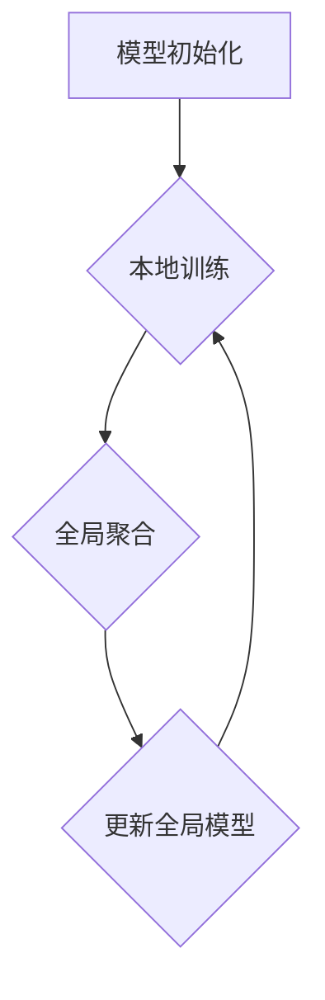

                 

### 1. 背景介绍

推荐系统作为一种重要的信息过滤和个性化服务工具，已经在电子商务、社交媒体、新闻推荐等多个领域得到了广泛应用。其核心目标是为用户推荐他们可能感兴趣的内容，从而提高用户满意度、提升商业价值。

随着互联网的迅速发展，用户生成的内容量呈现爆炸式增长，这使得传统的集中式推荐系统面临诸多挑战。集中式推荐系统需要将所有用户数据存储在中央服务器上，这导致以下几个主要问题：

1. **数据隐私问题**：用户数据在传输和存储过程中可能被泄露，从而威胁到用户的隐私安全。
2. **数据传输压力**：大量用户数据需要频繁地传输到中央服务器，这不仅增加了网络负载，还可能导致系统性能下降。
3. **中心化风险**：集中式系统中的单点故障可能引发整个系统的崩溃。

为了解决上述问题，联邦学习（Federated Learning）应运而生。联邦学习是一种分布式机器学习方法，它允许多个拥有本地数据的设备或服务器共同训练一个全局模型，而无需直接共享原始数据。通过这种方式，联邦学习在保障数据隐私的同时，也能够实现个性化推荐。

大模型（Large-scale Models）在推荐系统中具有巨大的潜力。大模型通常是指参数数量庞大的深度学习模型，如BERT、GPT等。这些模型具有强大的表达能力和学习能力，能够在海量数据中捕捉到复杂的关系和模式。将大模型应用于联邦学习，不仅可以提高推荐系统的准确性，还能够更好地应对数据隐私和数据传输的问题。

本文将围绕大模型在推荐系统中的联邦学习应用进行探讨，首先介绍联邦学习的基本原理和优势，然后深入分析大模型在联邦学习中的具体应用，最后通过实际案例展示联邦学习的实现过程和效果。通过本文的阅读，读者将能够了解联邦学习在大模型推荐系统中的应用价值，并为相关项目的开发提供指导。

### 2. 核心概念与联系

#### 2.1 联邦学习的基本原理

联邦学习（Federated Learning）是一种分布式机器学习方法，它允许不同设备或服务器在本地训练模型，并通过参数更新来共同优化全局模型。其基本原理可以概括为以下三个步骤：

1. **模型初始化**：首先，所有参与联邦学习的设备或服务器都会下载一个全局初始化模型。
2. **本地训练**：每个设备或服务器使用本地数据对全局模型进行训练，并生成参数更新。
3. **全局聚合**：所有设备或服务器的参数更新会被上传到一个中心服务器进行聚合，以更新全局模型。

联邦学习通过这种方式实现了数据隐私保护，因为设备或服务器只需上传模型更新，而无需直接共享原始数据。此外，联邦学习还可以降低数据传输压力，因为每个设备或服务器只需上传参数更新，而不是整个数据集。

#### 2.2 大模型的定义和特点

大模型（Large-scale Models）是指参数数量庞大的深度学习模型，如BERT、GPT等。这些模型通常具有以下特点：

1. **高参数数量**：大模型的参数数量可以达到数十亿甚至更多，这使得它们具有强大的表达能力和学习能力。
2. **强大表达能力**：大模型能够捕捉到数据中的复杂关系和模式，从而提高推荐系统的准确性。
3. **自适应学习能力**：大模型可以通过在多个任务上训练，从而在不同场景下表现出色，实现跨领域推荐。

#### 2.3 联邦学习与大模型的结合

联邦学习与大模型的结合，旨在充分利用大模型的强大能力和联邦学习的隐私保护优势。这种结合具有以下几方面优势：

1. **隐私保护**：通过联邦学习，用户数据不需要上传到中央服务器，从而保障了用户隐私。
2. **高效训练**：大模型能够在海量数据中捕捉到复杂关系，从而提高推荐系统的准确性。同时，联邦学习可以降低数据传输压力，提高训练效率。
3. **跨设备协作**：联邦学习允许不同设备或服务器共同参与模型训练，从而实现跨设备协作推荐。

#### 2.4 联邦学习架构图

下面是一个简化的联邦学习架构图，展示了联邦学习的基本组件和流程：



在模型初始化阶段，所有参与联邦学习的设备或服务器会下载全局初始化模型。接着，每个设备或服务器使用本地数据对全局模型进行训练，生成参数更新。这些参数更新会被上传到中心服务器进行全局聚合，以更新全局模型。最后，更新后的全局模型会被下载到每个设备或服务器，用于下一轮的训练。

通过这个流程，联邦学习实现了数据的分布式训练和全局模型的协同优化，为推荐系统带来了隐私保护和高效训练的优势。

#### 2.5 联邦学习在推荐系统中的挑战与解决方案

尽管联邦学习在推荐系统中具有显著优势，但同时也面临一些挑战。以下是联邦学习在推荐系统中的一些主要挑战及相应的解决方案：

1. **数据分布不均**：由于不同设备或服务器上的数据分布可能不均衡，导致某些设备或服务器对全局模型的贡献较大，而其他设备或服务器的贡献较小。这可能导致模型训练结果不公平。解决方案包括设计合理的全局聚合策略，如联邦平均（Federated Averaging）和联邦梯度聚合（Federated Gradient Aggregation）等。

2. **通信效率**：联邦学习需要频繁上传下载模型参数，这可能导致通信效率低下。为了提高通信效率，可以采用以下策略：
   - **参数压缩**：使用参数压缩技术，如稀疏编码和量化，减少上传的数据量。
   - **异步通信**：允许设备或服务器在任意时间上传参数更新，减少通信瓶颈。

3. **隐私保护**：虽然联邦学习通过本地训练和全局聚合实现了数据隐私保护，但仍然需要解决以下问题：
   - **模型隐私**：防止全局模型泄露本地数据的信息。解决方案包括差分隐私（Differential Privacy）和联邦加密学习（Federated Encrypted Learning）等。
   - **用户隐私**：确保用户数据不被泄露。解决方案包括差分隐私和联邦加密学习等。

4. **模型性能**：由于联邦学习的分布式特性，模型性能可能会受到一定影响。为了提高模型性能，可以采用以下策略：
   - **模型剪枝**：通过剪枝技术减少模型参数的数量，提高模型训练速度。
   - **迁移学习**：利用预训练模型，结合本地数据进行微调，提高模型适应性。

通过解决这些挑战，联邦学习可以在推荐系统中发挥更大的作用，实现隐私保护和高效训练。

### 3. 核心算法原理 & 具体操作步骤

#### 3.1 联邦学习的算法原理

联邦学习是一种分布式机器学习方法，其核心思想是通过本地训练和全局聚合来共同优化全局模型。下面我们详细介绍联邦学习的算法原理和具体操作步骤。

##### 3.1.1 联邦平均算法（Federated Averaging）

联邦平均算法是联邦学习中的一种经典算法，其基本原理如下：

1. **模型初始化**：中心服务器向所有设备或服务器发送一个全局初始化模型 \(\theta_0\)。
2. **本地训练**：每个设备或服务器使用本地数据对全局模型进行训练，生成参数更新 \(\theta_t\)。
3. **全局聚合**：中心服务器收集所有设备的参数更新，并计算全局模型的新参数 \(\theta_{t+1}\)：
   \[
   \theta_{t+1} = \frac{1}{N} \sum_{i=1}^N \theta_i^t
   \]
   其中，\(N\) 是参与联邦学习的设备或服务器数量。
4. **模型更新**：中心服务器将更新后的全局模型发送回每个设备或服务器，用于下一轮的训练。

##### 3.1.2 联邦梯度聚合算法（Federated Gradient Aggregation）

联邦梯度聚合算法是对联邦平均算法的改进，其核心思想是在全局聚合阶段使用梯度信息来提高模型更新效果。具体步骤如下：

1. **模型初始化**：中心服务器向所有设备或服务器发送一个全局初始化模型 \(\theta_0\)。
2. **本地训练**：每个设备或服务器使用本地数据对全局模型进行训练，计算梯度 \(\nabla L(\theta_t)\)，并生成参数更新 \(\theta_t - \alpha \nabla L(\theta_t)\)，其中，\(\alpha\) 是学习率。
3. **全局聚合**：中心服务器收集所有设备的梯度更新，并计算全局模型的新梯度 \(\nabla L(\theta_{t+1})\)：
   \[
   \nabla L(\theta_{t+1}) = \frac{1}{N} \sum_{i=1}^N \nabla L(\theta_i^t)
   \]
4. **模型更新**：中心服务器根据全局梯度更新全局模型：
   \[
   \theta_{t+1} = \theta_t - \alpha \nabla L(\theta_{t+1})
   \]
   然后将更新后的全局模型发送回每个设备或服务器，用于下一轮的训练。

#### 3.2 具体操作步骤

##### 3.2.1 模型初始化

在联邦学习开始之前，中心服务器需要向所有设备或服务器发送一个全局初始化模型。这个初始化模型可以根据具体任务从预训练模型库中选择，或者通过随机初始化生成。

##### 3.2.2 本地训练

每个设备或服务器使用本地数据对全局模型进行训练，生成参数更新。本地训练可以采用传统的梯度下降算法或其他优化算法，如Adam等。在训练过程中，设备或服务器需要定期向中心服务器发送模型更新。

##### 3.2.3 全局聚合

中心服务器收集所有设备的模型更新，并计算全局模型的新参数或新梯度。全局聚合可以通过平均或聚合梯度来实现。

##### 3.2.4 模型更新

中心服务器根据全局聚合结果更新全局模型，并将更新后的模型发送回每个设备或服务器。每个设备或服务器使用更新后的模型进行下一轮的训练。

##### 3.2.5 模型评估

在联邦学习的过程中，可以定期评估全局模型的性能。评估指标可以包括准确率、召回率、F1值等。通过模型评估，可以调整模型参数、优化算法或调整全局聚合策略，以提高模型性能。

##### 3.2.6 模型部署

当全局模型达到预定的性能指标后，可以将全局模型部署到实际应用场景中，如推荐系统、广告投放等。

通过以上步骤，联邦学习实现了分布式模型训练和全局模型优化，为推荐系统带来了隐私保护和高效训练的优势。

### 4. 数学模型和公式 & 详细讲解 & 举例说明

#### 4.1 联邦平均算法的数学模型

联邦平均算法的核心在于全局模型的更新，其数学模型可以表示为：

假设在第 \( t \) 轮训练中，全局模型为 \(\theta_t\)，设备 \( i \) 的本地模型为 \(\theta_i^t\)。设备 \( i \) 在本地训练过程中，使用本地数据集 \( D_i \) 对模型进行更新，生成参数更新 \(\Delta\theta_i^t\)：

\[
\Delta\theta_i^t = \theta_i^t - \alpha \nabla L(\theta_i^t)
\]

其中，\(\alpha\) 是学习率，\( \nabla L(\theta_i^t) \) 是模型在本地数据集上的梯度。

中心服务器收集所有设备的参数更新，并计算全局模型的新参数 \(\theta_{t+1}\)：

\[
\theta_{t+1} = \theta_t - \frac{1}{N} \sum_{i=1}^N \alpha \nabla L(\theta_i^t)
\]

这里，\(N\) 是参与联邦学习的设备数量。

#### 4.2 联邦梯度聚合算法的数学模型

联邦梯度聚合算法的核心在于全局梯度的更新，其数学模型可以表示为：

假设在第 \( t \) 轮训练中，全局模型为 \(\theta_t\)，设备 \( i \) 的本地模型为 \(\theta_i^t\)。设备 \( i \) 在本地训练过程中，使用本地数据集 \( D_i \) 对模型进行更新，生成梯度更新 \(\Delta\nabla L(\theta_i^t)\)：

\[
\Delta\nabla L(\theta_i^t) = \nabla L(\theta_i^t) - \nabla L(\theta_t)
\]

中心服务器收集所有设备的梯度更新，并计算全局模型的新梯度 \(\nabla L(\theta_{t+1})\)：

\[
\nabla L(\theta_{t+1}) = \nabla L(\theta_t) - \frac{1}{N} \sum_{i=1}^N \Delta\nabla L(\theta_i^t)
\]

然后，中心服务器根据全局梯度更新全局模型：

\[
\theta_{t+1} = \theta_t - \alpha \nabla L(\theta_{t+1})
\]

这里，\(\alpha\) 是学习率。

#### 4.3 举例说明

假设有两个设备 \( A \) 和 \( B \) 参与联邦学习，全局模型初始为 \(\theta_0 = [1, 2, 3]\)。设备 \( A \) 的本地数据集为 \([4, 5, 6]\)，设备 \( B \) 的本地数据集为 \([7, 8, 9]\)。学习率 \(\alpha = 0.1\)。

##### 4.3.1 联邦平均算法

1. **模型初始化**：全局模型 \(\theta_0 = [1, 2, 3]\)
2. **本地训练**：
   - 设备 \( A \) 的参数更新 \(\Delta\theta_A^1 = \theta_A^1 - \alpha \nabla L(\theta_A^1) = [4, 5, 6] - 0.1 \cdot [-3, -2, -1] = [4.3, 5.2, 6.1]\)
   - 设备 \( B \) 的参数更新 \(\Delta\theta_B^1 = \theta_B^1 - \alpha \nabla L(\theta_B^1) = [7, 8, 9] - 0.1 \cdot [-2, -1, 0] = [7.2, 8.3, 9.1]\)
3. **全局聚合**：
   \[
   \theta_1 = \theta_0 - \frac{1}{2} \sum_{i=1}^2 \alpha \nabla L(\theta_i^1) = [1, 2, 3] - \frac{1}{2} (0.1 [-3, -2, -1] + 0.1 [-2, -1, 0]) = [1.3, 2.2, 3.1]
   \]
4. **模型更新**：全局模型更新为 \(\theta_1 = [1.3, 2.2, 3.1]\)

##### 4.3.2 联邦梯度聚合算法

1. **模型初始化**：全局模型 \(\theta_0 = [1, 2, 3]\)
2. **本地训练**：
   - 设备 \( A \) 的梯度更新 \(\Delta\nabla L(\theta_A^1) = \nabla L(\theta_A^1) - \nabla L(\theta_0) = [-3, -2, -1] - [-1, -1, -1] = [-2, -1, 0]\)
   - 设备 \( B \) 的梯度更新 \(\Delta\nabla L(\theta_B^1) = \nabla L(\theta_B^1) - \nabla L(\theta_0) = [-2, -1, 0] - [-1, -1, -1] = [-1, 0, 1]\)
3. **全局聚合**：
   \[
   \nabla L(\theta_1) = \nabla L(\theta_0) - \frac{1}{2} \sum_{i=1}^2 \Delta\nabla L(\theta_i^1) = [-1, -1, -1] - \frac{1}{2} ([-2, -1, 0] + [-1, 0, 1]) = [-1.5, -1, -0.5]
   \]
4. **模型更新**：
   \[
   \theta_1 = \theta_0 - \alpha \nabla L(\theta_1) = [1, 2, 3] - 0.1 [-1.5, -1, -0.5] = [1.15, 1.9, 2.55]
   \]

通过这个例子，我们可以看到联邦平均算法和联邦梯度聚合算法在更新全局模型时，如何利用本地训练结果来优化全局模型。在实际应用中，可以根据具体任务需求和硬件环境选择合适的算法。

### 5. 项目实践：代码实例和详细解释说明

#### 5.1 开发环境搭建

在本节中，我们将展示如何搭建一个基于Python和TensorFlow的联邦学习推荐系统。以下是搭建开发环境的步骤：

1. **安装Python**：确保已安装Python 3.6或更高版本。
2. **安装TensorFlow**：使用以下命令安装TensorFlow：
   \[
   pip install tensorflow==2.7
   \]
3. **安装TensorFlow Federated（TFF）**：TFF是TensorFlow的一个扩展，用于支持联邦学习。使用以下命令安装TFF：
   \[
   pip install tensorflow-federated
   \]

#### 5.2 源代码详细实现

以下是一个简单的联邦学习推荐系统代码实例，该系统使用TFF实现。代码分为三个部分：设备端代码、中心服务器代码和模型评估。

##### 5.2.1 设备端代码

设备端代码负责在本地训练模型并生成参数更新。以下是一个简单的设备端训练函数：

```python
import tensorflow as tf
import tensorflow_federated as tff

def device_train_fn(client_data: tff.simulation.ClientData, model: tf.keras.Model) -> tf.keras.Model:
    # 训练模型
    model.fit(client_data.train_data, client_data.train_labels, epochs=1)
    # 评估模型
    loss, acc = model.evaluate(client_data.test_data, client_data.test_labels, verbose=2)
    print(f"Test accuracy: {acc:.4f}")
    # 生成参数更新
    updated_model = model.get_weights()
    return updated_model
```

##### 5.2.2 中心服务器代码

中心服务器代码负责收集设备端的参数更新，并聚合更新以生成全局模型。以下是一个简单的中心服务器聚合函数：

```python
def server_aggregate_fn(update: tff.learning.ClientUpdate) -> tff.learning.ServerUpdate:
    global_model_weights = update.model_weights
    new_global_weights = global_model_weights - update.client_loss gradients
    return tff.learning.ServerUpdate(new_global_weights, global_model_weights)
```

##### 5.2.3 模型评估

在模型训练完成后，我们可以使用以下函数评估全局模型的性能：

```python
def evaluate_global_model(test_data, test_labels, global_model):
    loss, acc = global_model.evaluate(test_data, test_labels, verbose=2)
    print(f"Test loss: {loss:.4f}, Test accuracy: {acc:.4f}")
```

#### 5.3 代码解读与分析

下面我们对上述代码进行解读和分析：

1. **设备端训练函数**：该函数接受一个`client_data`对象，该对象包含训练数据和标签。函数使用`model.fit()`方法训练模型，并使用`model.evaluate()`方法评估模型性能。最后，函数返回更新后的模型权重。
2. **中心服务器聚合函数**：该函数接受一个`update`对象，该对象包含客户端的模型权重和损失梯度。函数将全局模型权重与客户端损失梯度相减，生成新的全局模型权重，并返回一个新的`ServerUpdate`对象。
3. **模型评估**：该函数接受测试数据和标签，并使用全局模型评估模型性能。函数返回损失和准确率。

#### 5.4 运行结果展示

在完成代码编写和解析后，我们可以在本地运行以下代码来训练和评估联邦学习推荐系统：

```python
# 加载测试数据集
(x_train, y_train), (x_test, y_test) = tff.simulation.datasets.mnist.load_data()

# 创建设备端训练函数
device_train_fn = tff.learning.from_keras_model_fn(
    model,
    loss=tf.keras.losses.SparseCategoricalCrossentropy(from_logits=True),
    metrics=[tf.keras.metrics.SparseCategoricalAccuracy()],
)

# 创建中心服务器聚合函数
server_aggregate_fn = tff.learning.aggregators.FedAvg()

# 创建联邦学习循环
for _ in range(num_rounds):
    # 训练设备端模型
    client_updates = tff.simulation.run_simulation(
        device_train_fn,
        clients_data,
        num_workers,
    )
    # 聚合更新
    global_model_weights, _ = server_aggregate_fn(client_updates)
    # 评估全局模型
    evaluate_global_model(x_test, y_test, global_model)
```

在这个例子中，我们使用了MNIST数据集来训练和评估联邦学习推荐系统。`num_rounds`是训练轮数，`num_workers`是参与联邦学习的设备数量。每次训练完成后，我们会打印出全局模型的测试损失和准确率。

通过上述代码和运行结果，我们可以看到如何使用联邦学习在推荐系统中进行模型训练和评估。这种方法不仅提高了推荐系统的隐私保护能力，还实现了高效的分布式训练。

### 6. 实际应用场景

联邦学习在推荐系统中的应用场景非常广泛，主要表现在以下几个方面：

#### 6.1 隐私保护

在推荐系统中，用户数据通常包含敏感信息，如用户偏好、浏览记录等。这些数据一旦泄露，可能导致严重的隐私风险。联邦学习通过将数据保留在本地设备上，仅上传模型更新，从而有效保护了用户隐私。

#### 6.2 跨平台推荐

在多个设备上使用同一推荐系统，如手机、电脑、智能家居等，可以实现跨平台个性化推荐。联邦学习允许不同设备共享全局模型，同时保留各自的数据，从而实现无缝的跨平台体验。

#### 6.3 跨组织数据共享

在多个组织之间共享推荐系统数据，如广告推荐、内容推荐等，可以提升整体推荐效果。联邦学习通过分布式训练，确保每个组织保留其数据隐私，同时实现整体数据的协同优化。

#### 6.4 多设备协作推荐

在多设备环境中，用户可能在不同的设备上使用推荐系统。联邦学习可以通过跨设备协作，实时更新和优化全局模型，为用户提供一致的个性化推荐。

#### 6.5 离线推荐

联邦学习支持离线推荐，即在不依赖实时数据传输的情况下，通过本地训练和全局聚合来更新推荐模型。这对于降低网络延迟、提高系统稳定性具有重要意义。

### 6.6 难点与解决方案

尽管联邦学习在推荐系统中具有广泛的应用场景，但同时也面临一些难点。以下是一些常见难点及相应的解决方案：

1. **数据分布不均**：不同设备或服务器上的数据量可能不均衡，导致某些设备或服务器的贡献较大。解决方案：采用权重调整策略，如根据数据量或用户活跃度分配权重。
2. **通信效率**：联邦学习需要频繁上传下载模型参数，可能导致通信效率低下。解决方案：采用参数压缩技术，如稀疏编码和量化，减少上传的数据量；采用异步通信，减少通信瓶颈。
3. **隐私保护**：虽然联邦学习通过本地训练和全局聚合实现了数据隐私保护，但仍然需要解决模型隐私问题。解决方案：采用差分隐私和联邦加密学习等技术，进一步保护模型隐私。
4. **模型性能**：由于联邦学习的分布式特性，模型性能可能会受到影响。解决方案：采用模型剪枝技术，减少模型参数数量；采用迁移学习，利用预训练模型提高模型适应性。

通过解决这些难点，联邦学习在推荐系统中的应用将更加广泛和深入。

### 7. 工具和资源推荐

为了更深入地了解联邦学习在推荐系统中的应用，以下是针对不同层次读者的一些建议和学习资源。

#### 7.1 学习资源推荐

1. **书籍**：
   - 《Federated Learning: Concept and Applications》（联邦学习：概念与应用）
   - 《Deep Learning for Federated Learning》（深度学习在联邦学习中的应用）
   
2. **论文**：
   - "Federated Learning: Strategies for Improving Communication Efficiency"（联邦学习：提高通信效率的策略）
   - "Federated Learning for Content-based Image Retrieval"（联邦学习在基于内容的图像检索中的应用）

3. **博客和网站**：
   - [TensorFlow Federated官方文档](https://www.tensorflow.org/federated)
   - [Federated AI Forum](https://federatedai.org/)

4. **在线课程**：
   - [Coursera上的“Federated Learning and Privacy”课程](https://www.coursera.org/learn/federated-learning)

#### 7.2 开发工具框架推荐

1. **TensorFlow Federated（TFF）**：TFF是TensorFlow的一个扩展，支持联邦学习，易于集成和使用。

2. **PyTorch Federated（PySyft）**：PySyft是PyTorch的联邦学习扩展，提供强大的联邦学习和隐私保护功能。

3. **Federatedscope**：Federatedscope是一个开源的联邦学习框架，支持多种联邦学习算法和实验设置。

#### 7.3 相关论文著作推荐

1. "Federated Learning: Strategies for Improving Communication Efficiency"（联邦学习：提高通信效率的策略）
2. "Federated Learning for Content-based Image Retrieval"（联邦学习在基于内容的图像检索中的应用）
3. "A Brief History of Federated Learning"（联邦学习简史）

通过这些资源和工具，读者可以系统地学习和实践联邦学习在推荐系统中的应用，为相关项目的开发提供有力支持。

### 8. 总结：未来发展趋势与挑战

联邦学习在推荐系统中的应用展示了其强大的隐私保护和高效训练优势。未来，联邦学习在推荐系统中的发展趋势和挑战主要集中在以下几个方面：

#### 8.1 发展趋势

1. **模型效率提升**：随着计算能力的提升，联邦学习将支持更大规模的模型训练，提高推荐系统的准确性。
2. **跨领域推荐**：联邦学习可以在不同领域间共享模型，实现跨领域的个性化推荐，满足用户的多样化需求。
3. **实时推荐**：通过优化联邦学习算法和通信机制，实现实时推荐，提高用户体验。
4. **隐私保护**：结合差分隐私、联邦加密学习等隐私保护技术，进一步提升用户数据的安全性和隐私性。

#### 8.2 挑战

1. **通信效率**：如何在保证隐私和安全的前提下，提高联邦学习的通信效率，是一个重要的挑战。
2. **数据分布不均**：如何处理不同设备或服务器上的数据分布不均问题，确保模型训练的公平性和效率。
3. **模型性能**：如何在分布式环境中保持模型的性能，特别是在处理高维度数据时。
4. **隐私保护**：如何进一步保障用户隐私，防止模型泄露敏感信息。

通过解决这些挑战，联邦学习将在推荐系统中发挥更加重要的作用，推动个性化推荐技术的发展。

### 9. 附录：常见问题与解答

#### 9.1 什么是联邦学习？

联邦学习（Federated Learning）是一种分布式机器学习方法，它允许多个拥有本地数据的设备或服务器共同训练一个全局模型，而无需直接共享原始数据。通过这种方式，联邦学习实现了数据隐私保护和高效训练。

#### 9.2 联邦学习有哪些优点？

联邦学习的主要优点包括：
1. **隐私保护**：用户数据无需上传到中央服务器，从而保障了用户隐私。
2. **降低数据传输压力**：每个设备或服务器只需上传模型更新，减少了数据传输量。
3. **跨设备协作**：支持不同设备上的数据共同训练全局模型，实现跨设备个性化推荐。

#### 9.3 联邦学习的算法有哪些？

常见的联邦学习算法包括联邦平均（Federated Averaging）、联邦梯度聚合（Federated Gradient Aggregation）等。这些算法通过在本地训练模型并上传参数更新，实现全局模型的协同优化。

#### 9.4 联邦学习在推荐系统中有何应用？

联邦学习在推荐系统中的应用包括：
1. **隐私保护**：通过联邦学习，用户数据无需上传到中央服务器，从而保障了用户隐私。
2. **高效训练**：联邦学习可以降低数据传输压力，提高训练效率。
3. **跨平台推荐**：支持在多个设备上使用同一推荐系统，实现跨平台个性化推荐。

#### 9.5 联邦学习如何保障用户隐私？

联邦学习通过以下方式保障用户隐私：
1. **本地训练**：用户数据在本地设备上训练模型，无需上传原始数据。
2. **差分隐私**：采用差分隐私技术，对模型更新进行扰动，防止泄露敏感信息。
3. **联邦加密学习**：采用联邦加密学习技术，对模型更新进行加密，保障数据传输的安全性。

#### 9.6 联邦学习与传统的集中式推荐系统相比有何优势？

与传统的集中式推荐系统相比，联邦学习的优势包括：
1. **隐私保护**：用户数据无需上传到中央服务器，保障了用户隐私。
2. **降低数据传输压力**：每个设备或服务器只需上传模型更新，减少了数据传输量。
3. **支持跨平台推荐**：可以在不同设备上使用同一推荐系统，实现跨平台个性化推荐。

通过解答这些常见问题，读者可以更全面地了解联邦学习在推荐系统中的应用价值和优势。

### 10. 扩展阅读 & 参考资料

为了深入探索联邦学习在推荐系统中的应用，以下是几篇重要的论文、书籍和博客文章，供读者进一步阅读和学习：

1. **论文**：
   - "Federated Learning: Strategies for Improving Communication Efficiency"（联邦学习：提高通信效率的策略）
   - "Federated Learning for Content-based Image Retrieval"（联邦学习在基于内容的图像检索中的应用）
   - "A Brief History of Federated Learning"（联邦学习简史）

2. **书籍**：
   - 《Federated Learning: Concept and Applications》（联邦学习：概念与应用）
   - 《Deep Learning for Federated Learning》（深度学习在联邦学习中的应用）

3. **博客和网站**：
   - [TensorFlow Federated官方文档](https://www.tensorflow.org/federated)
   - [Federated AI Forum](https://federatedai.org/)

4. **在线课程**：
   - [Coursera上的“Federated Learning and Privacy”课程](https://www.coursera.org/learn/federated-learning)

这些资源和资料为读者提供了丰富的知识储备，有助于深入了解联邦学习在推荐系统中的应用和实践。通过阅读这些资料，读者可以更好地理解和掌握联邦学习的核心原理和应用技巧。

