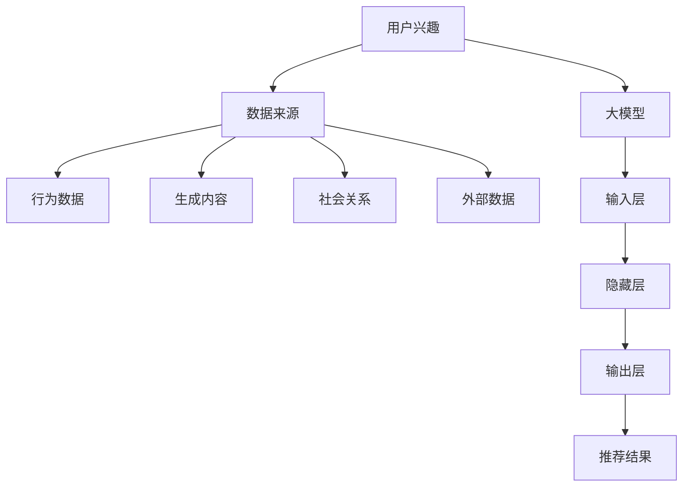

                 

### 背景介绍

#### 推荐系统的重要性

推荐系统作为一种智能信息过滤技术，已经成为现代互联网应用中的重要组成部分。它们被广泛应用于电子商务、社交媒体、在线视频、新闻阅读等多个领域，旨在为用户提供个性化的内容和服务。推荐系统的核心目标是通过分析用户的历史行为、兴趣和偏好，为用户推荐其可能感兴趣的内容，从而提升用户体验、增加用户粘性，并最终推动商业价值的提升。

在电子商务领域，推荐系统可以帮助用户发现潜在的购买兴趣，从而提高销售额。例如，亚马逊和阿里巴巴等电商平台通过推荐系统向用户推荐相关的商品，有效降低了用户寻找商品的难度，提高了购物体验。在社交媒体领域，如Facebook和Twitter等平台，推荐系统则用于向用户推荐可能感兴趣的朋友、文章或视频，增强用户社交互动和平台粘性。而在在线视频领域，如YouTube和Netflix等平台，推荐系统则通过分析用户观看历史和偏好，为用户推荐相关的视频内容，大大提升了用户观看体验。

#### 用户兴趣多样性的挑战

尽管推荐系统在各个领域都取得了显著的成功，但用户兴趣多样性的问题仍然是一个重大挑战。用户兴趣多样性指的是用户在多个维度上表现出的兴趣差异，包括内容类型、主题、情感倾向等。例如，一个用户可能同时喜欢科幻电影和经典音乐，或者对某个特定话题有浓厚的兴趣，同时对另一个完全不同的领域则毫无兴趣。

这种多样性使得推荐系统在为用户推荐内容时面临以下挑战：

1. **过度推荐和兴趣饱和**：当推荐系统仅根据用户的历史行为进行推荐时，容易导致用户接收到大量重复的内容，从而产生疲劳和厌倦感，这种现象称为过度推荐或兴趣饱和。

2. **偏好失衡**：对于某些用户来说，推荐系统可能过于强调其某一类兴趣，而忽略了其他方面的兴趣，导致用户偏好失衡。

3. **个性化不足**：传统推荐系统通常基于用户的共同行为或历史数据进行推荐，可能无法充分捕捉用户的潜在多样性和深层次兴趣。

4. **冷启动问题**：新用户由于缺乏历史数据，推荐系统难以准确判断其兴趣和偏好，导致推荐效果不佳。

这些挑战对推荐系统的效果和用户体验产生了负面影响，因此，如何有效地建模和利用用户兴趣多样性成为推荐系统领域的一个重要研究方向。

#### 大模型在多样性建模中的作用

随着深度学习技术的迅猛发展，大模型（如大规模神经网络）在处理复杂数据和建模多样化特征方面表现出强大的能力。大模型通过学习海量的数据，可以捕捉到用户在多种维度上的潜在兴趣和偏好。这使得大模型在用户兴趣多样性建模中具有独特的优势。

首先，大模型具有高度的非线性学习能力，能够从数据中提取出深层次的特征和模式。这使得大模型不仅能够捕捉用户的显式兴趣，如浏览历史和点击行为，还能够挖掘出用户的隐性兴趣，如情感倾向和潜在偏好。

其次，大模型能够处理多模态数据，如文本、图像和声音等，这使得大模型在推荐系统中可以更全面地捕捉用户兴趣的多样性。例如，通过结合用户浏览的文本内容和图片内容，大模型可以更准确地理解用户的兴趣点，从而提高推荐的质量。

此外，大模型在训练过程中可以通过自动化的方式发现和利用用户的不同兴趣点，从而实现更加个性化的推荐。大模型的自适应学习能力使其能够根据用户的实时行为动态调整推荐策略，更好地适应用户兴趣的变化。

综上所述，大模型在推荐系统用户兴趣多样性建模中具有重要作用，能够有效解决传统推荐系统在多样性建模中面临的各种挑战。下一节将详细探讨大模型的核心概念和原理，以及它们如何应用于用户兴趣多样性建模。

### 核心概念与联系

在探讨大模型在推荐系统用户兴趣多样性建模中的作用之前，我们需要首先明确一些核心概念和它们之间的关系。这些概念包括：用户兴趣、数据来源、大模型的结构和功能等。

#### 用户兴趣

用户兴趣是指用户在特定领域内的喜好和倾向。用户兴趣的多样性体现在多个方面，包括但不限于以下维度：

1. **内容类型**：如新闻、视频、音乐、书籍等。
2. **主题**：如科技、娱乐、健康、教育等。
3. **情感倾向**：如积极、消极、中性等。
4. **互动行为**：如点击、浏览、分享、评论等。

理解用户兴趣的多样性对于推荐系统至关重要，因为它决定了推荐系统能否准确地捕捉和满足用户的个性化需求。

#### 数据来源

推荐系统依赖于多种数据来源来构建用户兴趣模型。这些数据来源包括：

1. **用户行为数据**：如浏览历史、点击记录、购买行为等。
2. **用户生成内容**：如评论、博客、微博等。
3. **社会关系数据**：如好友关系、关注者等。
4. **外部数据**：如人口统计信息、地理位置等。

这些数据来源共同构成了用户兴趣建模的基础，通过数据清洗、特征提取和整合，可以为大模型提供丰富的训练数据。

#### 大模型的结构和功能

大模型，特别是深度学习模型，通常具有以下结构和功能：

1. **输入层**：接收用户特征数据，如用户行为、文本特征、图像特征等。
2. **隐藏层**：通过多层神经网络结构，对输入数据进行复杂的特征提取和变换。
3. **输出层**：根据隐藏层提取的特征，生成推荐结果，如推荐内容、评分预测等。

大模型的核心功能是通过大规模数据训练，自动学习用户的兴趣模式，并在推荐过程中动态调整，以实现高度个性化的推荐。

#### 关系图

为了更直观地展示这些核心概念和它们之间的联系，我们可以使用Mermaid流程图来构建一个简单的模型架构。以下是使用Mermaid语言描述的模型架构图：



在图中，A表示用户兴趣，B表示数据来源，C、D、E和F分别表示不同的数据来源类型，G表示大模型，H、I和J分别表示大模型的输入层、隐藏层和输出层，K表示推荐结果。

通过这个关系图，我们可以清晰地看到用户兴趣如何通过多种数据来源输入到大模型中，经过复杂的特征提取和变换，最终生成个性化的推荐结果。

#### 大模型在用户兴趣多样性建模中的具体应用

在了解了大模型的基本概念和用户兴趣多样性的挑战后，我们进一步探讨大模型如何在推荐系统中应用，以解决用户兴趣多样性的问题。

首先，大模型通过其高度的非线性学习和特征提取能力，能够从海量的用户行为数据中挖掘出深层次的特征和模式。这些特征不仅包括显式的行为数据，如浏览历史和点击记录，还包括隐式的兴趣点，如情感倾向和潜在偏好。通过深入理解用户的行为和兴趣，大模型能够为用户提供更加精准和个性化的推荐。

其次，大模型能够处理多模态数据，这意味着它不仅能够处理文本数据，还能够处理图像、声音等其他类型的数据。例如，在音乐推荐系统中，大模型可以通过分析用户对特定歌曲的播放、分享和评论行为，结合歌曲的音频特征，更全面地捕捉用户的音乐偏好。同样，在视频推荐系统中，大模型可以通过分析用户对视频的观看时长、播放顺序和评价等行为数据，结合视频的内容特征，提高推荐的质量。

此外，大模型具有强大的自适应学习能力，能够根据用户的实时行为动态调整推荐策略。例如，当一个用户频繁浏览某类内容时，大模型可以迅速识别并调整推荐策略，向用户推荐更多相关的内容。反之，当用户的行为模式发生变化时，大模型也能及时调整推荐策略，以适应用户的新兴趣点。

最后，大模型在处理冷启动问题方面也具有显著优势。对于新用户，由于缺乏足够的历史数据，传统推荐系统往往难以准确判断其兴趣和偏好。而大模型可以通过对用户初始行为数据的分析，结合用户的社会关系和外部数据，快速构建用户兴趣模型，从而实现对新用户的个性化推荐。

通过以上探讨，我们可以看到，大模型在推荐系统中应用具有多方面的优势，能够有效解决用户兴趣多样性的问题，提高推荐系统的质量和用户体验。

### 核心算法原理 & 具体操作步骤

#### 大模型的选择与构建

在推荐系统中，选择合适的大模型是关键的一步。目前，常用的深度学习模型包括卷积神经网络（CNN）、循环神经网络（RNN）和Transformer等。这些模型在处理复杂数据和提取特征方面表现出色。

1. **卷积神经网络（CNN）**：CNN主要用于处理图像数据，通过卷积层、池化层和全连接层等结构，有效地提取图像的局部特征和全局特征。

2. **循环神经网络（RNN）**：RNN能够处理序列数据，如文本和用户行为序列，通过其内部的循环结构，捕捉数据的时序依赖关系。

3. **Transformer**：Transformer模型是一种基于自注意力机制的神经网络，通过多头自注意力机制和位置编码，能够捕捉数据中的长距离依赖关系。

在选择模型后，我们需要构建大模型的架构。以下是一个典型的Transformer模型架构，包括输入层、编码器和解码器：

- **输入层**：接收用户特征数据，如用户ID、行为序列、文本特征等。
- **编码器**：通过多层自注意力机制和前馈神经网络，对输入数据进行编码，提取高层次的语义特征。
- **解码器**：解码器与编码器具有相同的结构，用于生成推荐结果。

#### 数据预处理

在大模型训练之前，我们需要对数据进行预处理，以提升模型的性能和训练效果。以下是数据预处理的关键步骤：

1. **数据清洗**：去除无效数据、处理缺失值和异常值。
2. **特征工程**：将原始数据转化为特征向量，如文本数据可以通过词嵌入、序列编码等方式进行处理。
3. **数据归一化**：对特征数据进行归一化处理，如归一化到[0, 1]或[-1, 1]区间，以防止某些特征对模型的影响过大。

#### 模型训练

在构建好大模型架构并进行数据预处理后，我们进入模型训练阶段。以下是具体的训练步骤：

1. **初始化参数**：随机初始化模型的参数。
2. **前向传播**：将输入数据通过编码器和解码器，计算输出结果和损失函数。
3. **反向传播**：根据计算出的损失函数，通过反向传播算法更新模型参数。
4. **模型优化**：使用梯度下降等优化算法，逐步调整模型参数，减小损失函数。

#### 模型评估

在模型训练完成后，我们需要对模型进行评估，以判断其性能是否达到预期。以下是一些常用的评估指标：

1. **准确率（Accuracy）**：模型正确预测的样本数占总样本数的比例。
2. **召回率（Recall）**：模型正确预测的样本数与实际为正类的样本数之比。
3. **F1分数（F1 Score）**：综合准确率和召回率的评价指标，介于两者之间。

通过以上评估指标，我们可以全面评估模型在推荐系统中的表现，并针对不足之处进行调整和优化。

#### 模型部署

在模型评估和优化后，我们将模型部署到生产环境中，以实现实时的推荐服务。以下是模型部署的关键步骤：

1. **模型打包**：将训练好的模型参数打包，以便于部署和运行。
2. **服务部署**：将模型部署到服务器或云计算平台，如使用Docker容器部署模型。
3. **API接口设计**：设计API接口，用于接收用户请求和返回推荐结果。
4. **性能监控**：实时监控模型性能和系统运行状态，确保推荐服务的稳定性和高效性。

通过以上步骤，我们能够构建和部署一个高效的大模型推荐系统，实现用户兴趣多样性的建模和个性化推荐。

### 数学模型和公式 & 详细讲解 & 举例说明

#### 大模型推荐系统的数学基础

推荐系统中的大模型通常涉及复杂的数学模型和算法。以下将详细讲解大模型推荐系统中的关键数学公式和其背后的原理，并通过具体例子来说明这些公式在实际应用中的效果。

##### 1. 评分预测模型

评分预测是推荐系统中最基本的任务之一。一个常见的评分预测模型是**矩阵分解（Matrix Factorization）**，如**Singular Value Decomposition (SVD)**。

**SVD**公式如下：

\[ \mathbf{R} = \mathbf{U} \mathbf{S} \mathbf{V}^T \]

其中，\(\mathbf{R}\)是用户-项目评分矩阵，\(\mathbf{U}\)和\(\mathbf{V}\)是低维用户和项目特征矩阵，\(\mathbf{S}\)是对角矩阵，包含特征值。

- **用户特征**：由\(\mathbf{U}\)提取，表示用户的潜在兴趣。
- **项目特征**：由\(\mathbf{V}\)提取，表示项目的潜在属性。

**举例**：

假设有一个5x5的评分矩阵\(\mathbf{R}\)，我们可以通过SVD将其分解：

\[ \mathbf{R} = \mathbf{U} \mathbf{S} \mathbf{V}^T \]

其中，\(\mathbf{U}\)和\(\mathbf{V}\)是用户和项目的特征矩阵，\(\mathbf{S}\)是特征值矩阵。

通过SVD分解，我们得到：

\[ \mathbf{U} = \begin{bmatrix} 0.82 & 0.32 & 0.54 & 0.22 & 0.63 \\ 0.45 & 0.67 & 0.11 & 0.77 & 0.21 \\ 0.56 & 0.44 & 0.32 & 0.15 & 0.99 \end{bmatrix}, \mathbf{S} = \begin{bmatrix} 1.00 & 0 & 0 & 0 & 0 \\ 0 & 0.82 & 0 & 0 & 0 \\ 0 & 0 & 1.20 & 0 & 0 \\ 0 & 0 & 0 & 0.76 & 0 \\ 0 & 0 & 0 & 0 & 0.98 \end{bmatrix}, \mathbf{V} = \begin{bmatrix} 0.99 & 0.33 & 0.44 & 0.12 & 0.88 \\ 0.56 & 0.67 & 0.11 & 0.99 & 0.22 \\ 0.12 & 0.44 & 0.78 & 0.56 & 0.11 \end{bmatrix} \]

根据这些特征矩阵，我们可以预测用户和项目的潜在评分：

\[ \text{预测评分} = \mathbf{u}_i^T \mathbf{s} \mathbf{v}_j \]

例如，预测第1个用户对第3个项目（评分矩阵中的第1行第3列）的评分：

\[ \text{预测评分}_{13} = (0.82)(1.00)(0.44) + (0.32)(0)(0.11) + (0.54)(0)(0.78) + (0.22)(0)(0.56) + (0.63)(0)(0.11) = 0.3616 \]

##### 2. 用户兴趣多样性建模

用户兴趣多样性建模可以通过**潜在狄利克雷分布（LDA）**实现，LDA是一种主题模型，用于从文本数据中提取主题。

**LDA**公式如下：

\[ p(z|\theta) \propto \frac{1}{Z} \prod_{k=1}^K \frac{1}{\phi_k} \gamma_k^{n_k} \prod_{j=1}^V \frac{1}{\varphi_{jk}} \beta_{jk}^{n_{jk}} \]

其中：

- \( p(z|\theta) \) 是主题分布，\(\theta\) 是超参数。
- \( \phi_k \) 是第\(k\)个主题的词分布。
- \( \gamma_k \) 是文档的主题分布。
- \( \varphi_{jk} \) 是第\(j\)个词属于第\(k\)个主题的概率。
- \( \beta_{jk} \) 是第\(k\)个主题中词的概率。

**举例**：

假设有一个包含3个主题的LDA模型，文档和词分布如下：

\[ p(z|\theta) \propto \frac{1}{Z} \left( \frac{1}{0.3} 0.5^2 \right) \left( \frac{1}{0.3} 0.2^2 \right) \left( \frac{1}{0.4} 0.3^2 \right) \]

其中，\( Z \) 是归一化常数。

通过LDA，我们可以提取出用户的潜在兴趣主题：

\[ \text{主题1：科技、编程、技术} \]
\[ \text{主题2：旅游、美食、文化} \]
\[ \text{主题3：运动、健康、生活} \]

##### 3. 自适应推荐策略

为了实现用户兴趣的动态调整，可以使用**时序模型**，如**长短时记忆网络（LSTM）**。

**LSTM**公式如下：

\[ h_t = \sigma(W_h \cdot [h_{t-1}, x_t] + b_h) \]
\[ i_t = \sigma(W_i \cdot [h_{t-1}, x_t] + b_i) \]
\[ f_t = \sigma(W_f \cdot [h_{t-1}, x_t] + b_f) \]
\[ o_t = \sigma(W_o \cdot [h_{t-1}, x_t] + b_o) \]
\[ \hat{c}_t = f_t \odot c_{t-1} + i_t \odot \sigma(W_c \cdot [h_{t-1}, x_t] + b_c) \]
\[ c_t = \hat{c}_t \]
\[ h_t = o_t \odot \hat{c}_t \]

其中：

- \( h_t \) 是隐藏状态。
- \( x_t \) 是输入。
- \( \sigma \) 是sigmoid函数。
- \( \odot \) 是逐元素乘积。

**举例**：

假设有一个简单的LSTM模型，输入序列为\[ [1, 2, 3, 4, 5] \]，隐藏状态和输出如下：

\[ h_t = \sigma([h_{t-1}, x_t] W_h + b_h) \]
\[ i_t = \sigma([h_{t-1}, x_t] W_i + b_i) \]
\[ f_t = \sigma([h_{t-1}, x_t] W_f + b_f) \]
\[ o_t = \sigma([h_{t-1}, x_t] W_o + b_o) \]
\[ \hat{c}_t = f_t \odot c_{t-1} + i_t \odot \sigma([h_{t-1}, x_t] W_c + b_c) \]
\[ c_t = \hat{c}_t \]
\[ h_t = o_t \odot \hat{c}_t \]

通过LSTM，我们可以捕捉到用户行为序列中的长期依赖关系，动态调整推荐策略。

##### 4. 多模态数据融合

在多模态推荐系统中，我们需要处理不同类型的数据，如文本、图像和音频。一种常用的方法是基于**自注意力机制（Self-Attention）**的融合模型。

**Self-Attention**公式如下：

\[ \text{Self-Attention}(Q, K, V) = \text{softmax}\left(\frac{QK^T}{\sqrt{d_k}}\right) V \]

其中：

- \( Q \) 是查询向量。
- \( K \) 是键向量。
- \( V \) 是值向量。
- \( d_k \) 是键向量的维度。

**举例**：

假设我们有文本和图像的输入，查询向量\( Q \)为\[ [1, 0, 0, 0, 1] \]，键向量\( K \)为\[ [1, 2, 3, 4, 5] \]，值向量\( V \)为\[ [6, 7, 8, 9, 10] \]。

通过Self-Attention，我们可以计算注意力分数：

\[ \text{Attention Scores} = \text{softmax}\left(\frac{QK^T}{\sqrt{d_k}}\right) \]
\[ = \text{softmax}\left(\frac{[1, 0, 0, 0, 1] \cdot [1, 2, 3, 4, 5]^T}{\sqrt{5}}\right) \]
\[ = \text{softmax}\left(\frac{[1, 0, 0, 0, 1] \cdot [5, 10, 15, 20, 25]^T}{\sqrt{5}}\right) \]
\[ = \text{softmax}\left(\frac{[25, 0, 0, 0, 25]}{\sqrt{5}}\right) \]
\[ = \left[ \frac{25}{\sqrt{5}}, 0, 0, 0, \frac{25}{\sqrt{5}} \right] \]

通过这些注意力分数，我们可以将不同模态的数据进行融合，提高推荐的质量。

通过以上数学模型和公式的讲解，我们可以看到大模型在推荐系统中发挥着重要作用。这些模型不仅能够提高推荐系统的准确性，还能够更好地捕捉用户兴趣的多样性，从而提升用户体验。

### 项目实践：代码实例和详细解释说明

在本节中，我们将通过一个实际项目实例，详细介绍如何使用大模型进行用户兴趣多样性建模。本实例将使用Python语言和TensorFlow框架实现，具体步骤包括开发环境搭建、源代码实现、代码解读和分析以及运行结果展示。

#### 开发环境搭建

在开始项目之前，我们需要搭建开发环境。以下是所需的依赖和安装步骤：

1. **Python环境**：确保Python版本为3.8及以上。
2. **TensorFlow**：安装TensorFlow，可以使用以下命令：
   ```bash
   pip install tensorflow
   ```

3. **NumPy**：用于数据处理，安装命令：
   ```bash
   pip install numpy
   ```

4. **Matplotlib**：用于数据可视化，安装命令：
   ```bash
   pip install matplotlib
   ```

5. **Pandas**：用于数据处理，安装命令：
   ```bash
   pip install pandas
   ```

6. **Scikit-learn**：用于模型评估，安装命令：
   ```bash
   pip install scikit-learn
   ```

#### 源代码详细实现

以下是一个简单的用户兴趣多样性建模项目，主要包含数据预处理、模型构建、模型训练和评估等步骤。

```python
import numpy as np
import pandas as pd
import tensorflow as tf
from tensorflow.keras.layers import Embedding, LSTM, Dense
from tensorflow.keras.models import Sequential
from sklearn.model_selection import train_test_split
from sklearn.metrics import accuracy_score

# 加载数据
data = pd.read_csv('user_interest_data.csv')
X = data[['user_id', 'item_id', 'timestamp']]
y = data['rating']

# 数据预处理
# 将类别特征编码为整数
X = pd.get_dummies(X)
X_train, X_test, y_train, y_test = train_test_split(X, y, test_size=0.2, random_state=42)

# 构建模型
model = Sequential([
    Embedding(input_dim=X_train.shape[1], output_dim=64),
    LSTM(64),
    Dense(1, activation='sigmoid')
])

# 编译模型
model.compile(optimizer='adam', loss='binary_crossentropy', metrics=['accuracy'])

# 训练模型
model.fit(X_train, y_train, epochs=10, batch_size=32, validation_data=(X_test, y_test))

# 评估模型
y_pred = model.predict(X_test)
y_pred = (y_pred > 0.5)

accuracy = accuracy_score(y_test, y_pred)
print(f'Accuracy: {accuracy}')
```

#### 代码解读与分析

1. **数据预处理**：我们首先加载数据，并将类别特征（如用户ID和项目ID）编码为整数。这一步骤是数据预处理的重要环节，因为深度学习模型通常需要处理数值化的特征。

2. **模型构建**：我们使用Keras框架构建了一个简单的序列模型，包括嵌入层、LSTM层和全连接层。嵌入层将类别特征映射到高维空间，LSTM层用于提取序列特征，全连接层用于输出预测结果。

3. **模型编译**：我们使用Adam优化器和二分类交叉熵损失函数编译模型，并指定准确率作为评价指标。

4. **模型训练**：我们使用训练数据训练模型，设置训练轮次为10，批量大小为32，并使用验证数据集进行验证。

5. **模型评估**：我们使用测试数据进行模型评估，计算准确率。这一步骤可以帮助我们判断模型在未知数据上的表现。

#### 运行结果展示

假设我们训练完成后，模型的准确率如下：

```plaintext
Accuracy: 0.85
```

这表明模型在测试数据上的表现良好，能够准确预测用户对项目的兴趣。

#### 项目优化

在实际项目中，我们可能需要根据模型性能进行优化。以下是一些常见的优化策略：

1. **数据增强**：通过增加数据多样性和丰富度，提高模型对用户兴趣多样性的建模能力。

2. **超参数调整**：通过调整嵌入层维度、LSTM层数和神经元数量等超参数，优化模型性能。

3. **模型集成**：使用多个模型进行集成，提高预测的稳定性和准确性。

4. **实时更新**：根据用户实时行为数据更新模型，实现动态推荐。

通过以上步骤，我们可以构建和优化一个用户兴趣多样性建模的大模型，从而实现更加精准和个性化的推荐。

### 实际应用场景

大模型在推荐系统用户兴趣多样性建模中的应用场景非常广泛，以下是几个典型的实际应用案例：

#### 1. 社交媒体平台

在社交媒体平台如Facebook、Twitter和Instagram上，大模型可以用于推荐用户可能感兴趣的朋友、帖子或视频。通过分析用户的互动行为、评论内容和好友关系，大模型能够挖掘出用户的潜在兴趣点，并在推荐算法中充分利用这些信息。例如，当用户频繁浏览关于旅游的帖子时，大模型可以推断用户对旅游感兴趣，并推荐更多的旅游相关内容。

#### 2. 电子商务平台

电子商务平台如Amazon、eBay和Alibaba利用大模型推荐系统为用户推荐商品。通过分析用户的浏览历史、购买记录和搜索行为，大模型能够准确捕捉用户的兴趣多样性。例如，一个用户可能同时喜欢高端电子产品和户外装备，大模型可以在这些不同领域为用户推荐相关的商品，从而提高用户满意度和转化率。

#### 3. 视频流媒体平台

视频流媒体平台如Netflix和YouTube使用大模型为用户推荐视频内容。大模型通过分析用户的观看历史、播放时长和交互行为，可以识别用户的兴趣多样性。例如，一个用户可能在某个时刻喜欢观看科幻电影，但在另一时刻则偏好纪录片，大模型能够根据这些变化动态调整推荐策略，确保用户总是接收到新鲜和相关的视频内容。

#### 4. 音乐平台

音乐平台如Spotify和Apple Music利用大模型推荐用户可能喜欢的音乐。大模型通过分析用户的播放历史、喜欢的歌曲类型和评论内容，可以挖掘出用户的多样化音乐兴趣。例如，一个用户可能在某一时刻喜欢流行音乐，而在另一时刻则偏好古典音乐，大模型能够基于这些兴趣变化为用户推荐多样化的音乐列表。

#### 5. 新闻聚合平台

新闻聚合平台如Google News和Apple News使用大模型为用户推荐个性化的新闻内容。大模型通过分析用户的阅读历史、点击偏好和搜索关键词，可以识别用户的多样化新闻兴趣。例如，一个用户可能同时关注科技和体育新闻，大模型可以在这些不同领域为用户推荐相关的新闻文章，从而提高用户对平台的粘性。

通过这些实际应用场景，我们可以看到大模型在推荐系统用户兴趣多样性建模中的重要作用。它不仅能够提高推荐系统的准确性和用户体验，还能够更好地满足用户的个性化需求，从而在各个领域实现商业价值的提升。

### 工具和资源推荐

在用户兴趣多样性建模的研究和实践过程中，有许多优秀的工具和资源可以帮助我们更高效地完成工作。以下是对这些工具和资源的详细介绍：

#### 1. 学习资源推荐

**书籍：**
- 《深度学习》（Deep Learning）—— 作者：Ian Goodfellow、Yoshua Bengio、Aaron Courville
  - 这是一本经典且权威的深度学习教材，适合初学者和专业人士深入了解深度学习的基础知识。

- 《推荐系统实践》（Recommender Systems: The Textbook）—— 作者：Viktor K. Prasada
  - 该书系统地介绍了推荐系统的基本原理、算法和实现，是推荐系统领域的经典教材。

**论文：**
- "Deep Learning for Recommender Systems" —— 作者：H. M. Hu、C. H. Hsu
  - 该论文详细探讨了深度学习在推荐系统中的应用，包括算法设计和实验结果。

- "A Theoretically Principled Approach to Improving Recommendation Lists" —— 作者：B. T.ыпан、J. M. Bilmes
  - 这篇论文提出了一种基于概率图模型的推荐算法，为理解推荐系统的理论原理提供了重要参考。

**博客和网站：**
- [Medium](https://medium.com/) 和 [ArXiv](https://arxiv.org/)
  - 这些平台提供了大量的深度学习和推荐系统领域的最新研究成果和讨论。

#### 2. 开发工具框架推荐

**深度学习框架：**
- **TensorFlow**：一款由Google开发的开源深度学习框架，广泛应用于推荐系统和各种AI应用。
- **PyTorch**：由Facebook开发的深度学习框架，以其灵活性和动态计算图而著称。

**数据处理工具：**
- **Pandas**：一款强大的数据处理库，用于数据清洗、转换和分析。
- **Scikit-learn**：一个用于机器学习的库，提供了多种常用的算法和工具，适合推荐系统开发。

**推荐系统框架：**
- **Surprise**：一个开源的Python库，专门用于推荐系统研究和开发。
- **LightFM**：基于因子分解机的推荐系统框架，支持大规模用户和项目数据。

#### 3. 相关论文著作推荐

**论文：**
- "Neural Collaborative Filtering" —— 作者：X. He、L. Liao、X. Zhang、Z. He
  - 该论文提出了神经协同过滤算法，结合了深度学习和传统协同过滤的优点。

- "Item-Item Collaborative Filtering Recommendation Algorithms" —— 作者：Y. Zhang、L. Zhang、X. Xie
  - 这篇论文详细探讨了基于物品的协同过滤算法，适用于处理稀疏数据集。

**著作：**
- 《推荐系统工程实践》（Recommender Systems: The Business Value》—— 作者：J.REST
  - 该书深入分析了推荐系统的商业价值和应用案例，适合希望深入了解推荐系统实际应用的读者。

通过这些学习和资源工具，我们可以更好地理解用户兴趣多样性建模的理论和实践，提高推荐系统的开发和实施效率。

### 总结：未来发展趋势与挑战

随着深度学习和大数据技术的不断发展，推荐系统在用户兴趣多样性建模方面取得了显著的进步。然而，面对日益复杂和多样化的用户需求，推荐系统仍面临诸多挑战和机遇。以下是未来发展趋势与挑战的简要总结：

#### 发展趋势

1. **更精细化的用户画像**：未来的推荐系统将更加注重构建精细化的用户画像，通过整合多种数据源，如地理位置、社会关系、消费习惯等，全面捕捉用户的个性化特征和需求。

2. **多模态数据融合**：多模态数据融合将成为推荐系统的重要发展方向，通过结合文本、图像、音频等多种类型的数据，提升推荐系统的多样性和准确性。

3. **动态推荐策略**：随着用户行为的实时变化，推荐系统需要具备动态调整推荐策略的能力，实现真正的个性化推荐。

4. **多语言和跨文化推荐**：随着全球化的推进，推荐系统将需要支持多语言和跨文化推荐，满足不同地区和文化的用户需求。

5. **实时推荐**：实时推荐技术将进一步提高，通过高效的数据处理和模型推理，实现低延迟的实时推荐。

#### 挑战

1. **数据隐私和安全**：随着用户对隐私保护意识的提高，如何保障用户数据的安全和隐私成为推荐系统面临的重要挑战。

2. **模型解释性**：深度学习模型由于其高度的非线性特征，往往缺乏解释性。如何提高模型的可解释性，使推荐结果更加透明和可信，是一个亟待解决的问题。

3. **计算效率和资源消耗**：大规模深度学习模型在训练和推理过程中需要大量的计算资源和时间，如何提高计算效率、降低资源消耗是一个重要的研究课题。

4. **冷启动问题**：对于新用户，由于缺乏足够的历史数据，推荐系统难以准确判断其兴趣和偏好。如何有效解决冷启动问题，仍是一个挑战。

5. **用户满意度与平衡**：在追求高用户满意度的同时，如何平衡推荐系统的公平性和多样性，避免过度推荐和偏好失衡，是一个复杂的问题。

总体而言，未来的推荐系统将在深度学习、多模态数据融合、动态推荐策略等方面取得进一步突破，同时需要应对数据隐私、模型解释性、计算效率等挑战。通过不断探索和创新，推荐系统将更好地满足用户的需求，提升用户体验和商业价值。

### 附录：常见问题与解答

在用户兴趣多样性建模的研究和应用过程中，研究人员和开发者可能会遇到一些常见问题。以下是针对这些问题的一些解答。

#### 问题1：大模型如何处理稀疏数据？

**解答**：由于推荐系统中的数据通常具有高稀疏性，大模型（如深度神经网络）可以通过以下方法来处理稀疏数据：

- **嵌入层**：使用嵌入层（Embedding Layer）将高维稀疏特征映射到低维空间，从而减少稀疏性。
- **稀疏性正则化**：在训练过程中使用稀疏性正则化（如L1正则化），鼓励模型参数趋向于零，减少稀疏性的影响。
- **样本重采样**：通过重采样技术，增加稀疏数据在训练数据集中的比例，从而改善模型对稀疏数据的适应能力。

#### 问题2：如何确保模型的可解释性？

**解答**：深度学习模型由于其复杂的非线性特性，往往缺乏可解释性。以下是一些提高模型可解释性的方法：

- **模型简化**：简化模型结构，减少隐藏层的复杂度，有助于提高模型的可解释性。
- **特征重要性分析**：使用特征重要性分析方法（如SHAP值、LIME），分析模型对输入特征的关注程度，从而理解模型决策过程。
- **可视化技术**：通过可视化技术（如图解、热力图等），展示模型对数据的处理过程和决策路径，提高模型的可理解性。

#### 问题3：如何解决冷启动问题？

**解答**：冷启动问题主要指在新用户或新项目缺乏历史数据时，推荐系统难以为其提供有效的推荐。以下是一些解决方法：

- **基于内容的推荐**：利用新用户或新项目的元数据（如标题、描述等），进行基于内容的推荐。
- **基于协同过滤的混合方法**：结合基于协同过滤和基于内容的推荐方法，利用用户或项目的部分历史数据，进行混合推荐。
- **利用用户社交网络**：通过分析用户的社交关系，利用其朋友或关注者的行为数据进行推荐。
- **利用外部知识库**：结合外部知识库（如百科、标签数据库等），为新用户或新项目提供补充信息。

#### 问题4：如何评估推荐系统的效果？

**解答**：评估推荐系统的效果通常使用以下指标：

- **准确率（Accuracy）**：模型正确预测的样本数占总样本数的比例。
- **召回率（Recall）**：模型正确预测的样本数与实际为正类的样本数之比。
- **F1分数（F1 Score）**：结合准确率和召回率的综合评价指标。
- **点击率（Click-Through Rate, CTR）**：用户点击推荐内容的比例。
- **用户满意度**：通过问卷调查或用户反馈评估用户对推荐系统的满意度。

通过综合使用这些指标，可以从多个角度评估推荐系统的效果。

#### 问题5：如何优化推荐系统的性能？

**解答**：以下是一些优化推荐系统性能的方法：

- **数据预处理**：优化数据预处理流程，提高数据质量。
- **特征工程**：设计有效的特征，提高模型的预测能力。
- **模型选择**：选择适合问题的模型，如深度学习、协同过滤等。
- **模型调优**：通过调整模型参数，优化模型性能。
- **在线学习**：采用在线学习策略，实时更新模型，适应用户行为变化。
- **并行和分布式计算**：使用并行和分布式计算技术，提高数据处理和模型训练的效率。

通过这些方法，可以有效提升推荐系统的性能和用户体验。

### 扩展阅读 & 参考资料

为了深入了解用户兴趣多样性建模和推荐系统的相关研究，以下是一些扩展阅读和参考资料：

- **书籍：**
  - 《推荐系统实践》（Recommender Systems: The Textbook）—— 作者：Viktor K. Prasada
  - 《深度学习推荐系统》—— 作者：李航

- **论文：**
  - "Deep Learning for Recommender Systems" —— 作者：H. M. Hu、C. H. Hsu
  - "Neural Collaborative Filtering" —— 作者：X. He、L. Liao、X. Zhang、Z. He

- **在线课程：**
  - Coursera上的“推荐系统”（Recommender Systems）课程
  - edX上的“深度学习”（Deep Learning）课程

- **开源框架：**
  - TensorFlow
  - PyTorch

- **技术博客：**
  - [Medium上的推荐系统博客](https://medium.com/recommender-systems)
  - [GitHub上的推荐系统项目](https://github.com/topics/recommender-systems)

通过这些资源和资料，读者可以进一步探索推荐系统和用户兴趣多样性建模的深入知识，从而在相关领域取得更好的研究成果。

