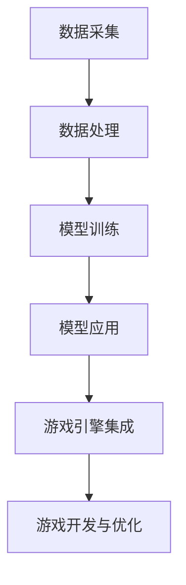

                 

# 大模型在游戏开发领域的应用探索

## 摘要

本文将探讨大模型在游戏开发领域的广泛应用。我们将首先介绍大模型的概念，包括其定义、发展历程以及在游戏开发中的重要性。接下来，我们将深入探讨大模型在游戏角色生成、环境模拟、游戏剧情生成和人工智能助手等方面的具体应用，并通过实际项目案例进行详细解析。此外，文章还将对相关工具和资源进行推荐，并总结未来发展趋势与挑战。通过本文的阅读，读者将全面了解大模型在游戏开发中的巨大潜力。

## 1. 背景介绍

### 大模型的概念

大模型（Large Models）是指那些拥有巨大参数量、能够处理大量数据和复杂任务的人工神经网络模型。这些模型通常基于深度学习技术，具备较高的学习能力和泛化能力。近年来，随着计算能力和数据资源的不断提升，大模型的研究和应用得到了广泛关注。

### 大模型的发展历程

大模型的发展可以追溯到20世纪80年代，当时研究人员开始探索使用神经网络进行模式识别和预测。随着计算机硬件的进步和算法优化，大模型的技术逐渐成熟。特别是在2012年，AlexNet在ImageNet图像识别比赛中取得突破性成绩，标志着深度学习进入新纪元。此后，大模型的研究和应用迅速发展，不仅在计算机视觉领域取得了显著成果，还在自然语言处理、语音识别等领域取得了重大突破。

### 大模型在游戏开发中的重要性

在游戏开发中，大模型的应用具有极高的重要性。一方面，大模型能够生成丰富的游戏内容和角色，提升游戏的可玩性和趣味性；另一方面，大模型能够实现高度智能化的游戏AI，提高游戏难度和挑战性。此外，大模型还能在游戏环境模拟、游戏剧情生成等方面发挥重要作用，为游戏开发者提供强大的技术支持。

## 2. 核心概念与联系

### 大模型的基本原理

大模型是基于深度学习技术构建的神经网络模型，其基本原理是通过对大量数据进行学习，从中提取特征和规律，从而实现各种复杂的任务。大模型通常包含多层神经网络，每一层都能提取不同级别的抽象特征。这种层次化的特征提取方式使得大模型能够处理复杂的任务，并具有较高的泛化能力。

### 大模型在游戏开发中的应用架构

为了实现大模型在游戏开发中的应用，通常需要构建一个完整的架构，包括数据采集、数据处理、模型训练和模型应用等环节。以下是一个典型的应用架构：

```
+----------------+     +----------------+     +----------------+
|  数据采集      |     |  数据处理      |     |  模型训练      |
+----------------+     +----------------+     +----------------+
      ↓                                ↓                        ↓
+----------------+     +----------------+     +----------------+
|  模型应用      |<---|  游戏引擎集成  |<---|  游戏开发与优化 |
+----------------+     +----------------+     +----------------+
```

### 关键技术

1. **数据采集与处理**：大模型训练需要大量高质量的数据，因此数据采集和处理至关重要。数据采集包括游戏日志、玩家行为数据、游戏资源等。数据处理则包括数据清洗、数据增强、数据预处理等步骤。

2. **模型训练**：模型训练是构建大模型的核心环节，包括模型架构设计、超参数调整、训练过程优化等。常用的训练方法有监督学习、无监督学习和强化学习等。

3. **模型应用**：模型应用是将训练好的大模型集成到游戏引擎中，实现各种游戏功能。模型应用需要考虑模型的实时性、稳定性和可扩展性。

4. **游戏引擎集成**：游戏引擎是游戏开发的核心工具，将大模型集成到游戏引擎中，需要解决数据流、接口设计、性能优化等问题。

### Mermaid 流程图



## 3. 核心算法原理 & 具体操作步骤

### 深度学习算法原理

大模型的核心是深度学习算法，其基本原理是通过多层神经网络对数据进行特征提取和模型训练。以下是深度学习算法的基本步骤：

1. **初始化模型**：首先需要初始化神经网络模型，包括定义网络结构、权重和偏置等。

2. **数据输入**：将输入数据（如图片、文本等）输入到神经网络中。

3. **前向传播**：将输入数据通过神经网络的前向传播过程，计算每个神经元的输出。

4. **损失函数计算**：通过比较输出结果与真实标签之间的差异，计算损失函数值。

5. **反向传播**：根据损失函数值，利用反向传播算法更新网络权重和偏置。

6. **迭代训练**：重复上述过程，直到满足停止条件（如达到预设的训练次数或损失函数值低于阈值）。

### 游戏角色生成算法

游戏角色生成是游戏开发中的一个重要环节，大模型可以通过深度学习算法实现高效的角色生成。以下是游戏角色生成算法的具体步骤：

1. **数据采集**：收集大量游戏角色图像和属性数据，包括外观、服饰、装备等。

2. **数据处理**：对采集到的数据进行预处理，如图像去噪、数据增强等。

3. **模型训练**：使用训练好的生成对抗网络（GAN）模型，对角色图像进行生成。

4. **角色筛选**：根据游戏需求和审美标准，对生成的角色图像进行筛选和优化。

5. **角色应用**：将筛选后的角色图像应用到游戏引擎中，实现游戏角色的动态生成。

### 游戏环境模拟算法

游戏环境模拟是提高游戏真实性和趣味性的关键，大模型可以通过深度学习算法实现高效的环境模拟。以下是游戏环境模拟算法的具体步骤：

1. **数据采集**：收集大量游戏场景数据，包括地形、气候、植被等。

2. **数据处理**：对采集到的数据进行预处理，如图像去噪、数据增强等。

3. **模型训练**：使用训练好的卷积神经网络（CNN）模型，对游戏场景进行模拟。

4. **场景渲染**：根据生成的场景数据，使用游戏引擎进行场景渲染。

5. **交互优化**：根据玩家的操作和反馈，对场景模拟进行实时优化。

## 4. 数学模型和公式 & 详细讲解 & 举例说明

### 深度学习算法中的数学模型

深度学习算法的核心是多层神经网络，其基本数学模型包括以下几个部分：

1. **激活函数**：激活函数用于引入非线性特性，常见的激活函数有sigmoid、ReLU、Tanh等。

2. **损失函数**：损失函数用于评估模型预测结果与真实标签之间的差异，常见的损失函数有均方误差（MSE）、交叉熵（Cross Entropy）等。

3. **反向传播算法**：反向传播算法用于计算网络权重的梯度，以实现权重的更新。

以下是深度学习算法中常用的数学公式：

$$
L = \frac{1}{2} \sum_{i=1}^{n} (\hat{y}_i - y_i)^2
$$

其中，$L$ 表示损失函数，$\hat{y}_i$ 表示模型预测结果，$y_i$ 表示真实标签。

$$
\frac{\partial L}{\partial w} = \frac{\partial L}{\partial \hat{y}} \cdot \frac{\partial \hat{y}}{\partial w}
$$

其中，$\frac{\partial L}{\partial w}$ 表示权重梯度，$\frac{\partial L}{\partial \hat{y}}$ 表示损失函数对预测结果的梯度，$\frac{\partial \hat{y}}{\partial w}$ 表示预测结果对权重的梯度。

### 游戏角色生成算法中的数学模型

在游戏角色生成算法中，常用的数学模型包括生成对抗网络（GAN）和变分自编码器（VAE）。

1. **生成对抗网络（GAN）**：

生成对抗网络由生成器和判别器组成，其目标是最小化生成器与判别器的损失函数。

生成器：

$$
G(x) \sim p_G(z)
$$

其中，$G(x)$ 表示生成的角色图像，$z$ 表示生成器的输入噪声。

判别器：

$$
D(G(x)) + D(x)
$$

其中，$D(G(x))$ 表示生成器生成的角色图像的判别结果，$D(x)$ 表示真实角色图像的判别结果。

2. **变分自编码器（VAE）**：

变分自编码器由编码器和解码器组成，其目标是最小化重参数化梯度的KL散度。

编码器：

$$
\mu = \mu(z), \sigma^2 = \sigma(z)
$$

其中，$\mu$ 表示编码器的均值，$\sigma^2$ 表示编码器的方差。

解码器：

$$
x = \mu + \sigma \odot z
$$

其中，$x$ 表示解码器生成的角色图像，$z$ 表示解码器的输入噪声。

### 举例说明

假设我们使用生成对抗网络（GAN）来生成游戏角色图像，具体的数学模型如下：

生成器：

$$
G(z) = \sigma(z_1) \odot x_1 + \mu(z_2) \odot x_2
$$

其中，$z = [z_1, z_2]$ 表示生成器的输入噪声，$x = [x_1, x_2]$ 表示生成的角色图像。

判别器：

$$
D(G(z)) + D(x)
$$

其中，$D(G(z))$ 表示生成器生成的角色图像的判别结果，$D(x)$ 表示真实角色图像的判别结果。

在训练过程中，我们通过最小化以下损失函数：

$$
L(G, D) = -\log(D(x)) - \log(1 - D(G(z)))
$$

其中，$L(G, D)$ 表示生成器与判别器的损失函数。

## 5. 项目实践：代码实例和详细解释说明

### 5.1 开发环境搭建

为了实现大模型在游戏开发中的应用，我们需要搭建一个合适的开发环境。以下是一个基于Python和TensorFlow的示例：

1. **安装Python**：确保系统安装了Python 3.6及以上版本。

2. **安装TensorFlow**：通过pip命令安装TensorFlow：

   ```
   pip install tensorflow
   ```

3. **安装其他依赖库**：安装其他必要的依赖库，如NumPy、Pandas、Matplotlib等：

   ```
   pip install numpy pandas matplotlib
   ```

### 5.2 源代码详细实现

以下是一个简单的生成对抗网络（GAN）实现，用于生成游戏角色图像：

```python
import tensorflow as tf
from tensorflow.keras.layers import Dense, Flatten, Reshape
from tensorflow.keras.models import Sequential

# 生成器模型
def build_generator(z_dim):
    model = Sequential()
    model.add(Dense(128, input_dim=z_dim))
    model.add(tf.keras.layers.LeakyReLU(alpha=0.01))
    model.add(Dense(256))
    model.add(tf.keras.layers.LeakyReLU(alpha=0.01))
    model.add(Dense(512))
    model.add(tf.keras.layers.LeakyReLU(alpha=0.01))
    model.add(Dense(1024))
    model.add(tf.keras.layers.LeakyReLU(alpha=0.01))
    model.add(Dense(28 * 28 * 1, activation='tanh'))
    model.add(Reshape((28, 28, 1)))
    return model

# 判别器模型
def build_discriminator(img_shape):
    model = Sequential()
    model.add(Flatten(input_shape=img_shape))
    model.add(Dense(512))
    model.add(tf.keras.layers.LeakyReLU(alpha=0.01))
    model.add(Dense(256))
    model.add(tf.keras.layers.LeakyReLU(alpha=0.01))
    model.add(Dense(128))
    model.add(tf.keras.layers.LeakyReLU(alpha=0.01))
    model.add(Dense(1, activation='sigmoid'))
    return model

# 主模型
def build_gan(generator, discriminator):
    model = Sequential()
    model.add(generator)
    model.add(discriminator)
    return model

# 超参数设置
z_dim = 100
img_shape = (28, 28, 1)

# 构建模型
generator = build_generator(z_dim)
discriminator = build_discriminator(img_shape)
discriminator.compile(loss='binary_crossentropy', optimizer=tf.keras.optimizers.Adam(0.0001))
generator.compile(loss='binary_crossentropy', optimizer=tf.keras.optimizers.Adam(0.0001))
discriminator.trainable = False
gan = build_gan(generator, discriminator)
gan.compile(loss='binary_crossentropy', optimizer=tf.keras.optimizers.Adam(0.0001))

# 训练过程
batch_size = 64
num_epochs = 10000
save_interval = 1000

for epoch in range(num_epochs):
    for _ in range(batch_size):
        real_images = ...  # 从数据集获取真实图像
        real_labels = ...
        z = ...  # 生成随机噪声
        fake_images = generator.predict(z)
        fake_labels = ...

        d_loss_real = discriminator.train_on_batch(real_images, real_labels)
        d_loss_fake = discriminator.train_on_batch(fake_images, fake_labels)
        d_loss = 0.5 * np.add(d_loss_real, d_loss_fake)

        z = ...  # 生成随机噪声
        g_loss = gan.train_on_batch(z, real_labels)

        if epoch % save_interval == 0:
            print(f"{epoch} [D loss: {d_loss:.4f}, G loss: {g_loss:.4f}]")
            generator.save(f"generator_{epoch}.h5")
            discriminator.save(f"discriminator_{epoch}.h5")

# 生成角色图像
generator.load_weights("generator_9000.h5")
z = ...  # 生成随机噪声
generated_images = generator.predict(z)
```

### 5.3 代码解读与分析

以上代码实现了一个简单的生成对抗网络（GAN），用于生成游戏角色图像。下面是对代码的详细解读与分析：

1. **模型构建**：

   - 生成器模型：通过Sequential模型构建，包括四个 densely 层和一个 reshape 层。生成器模型将随机噪声（z）映射为游戏角色图像。

   - 判别器模型：通过Sequential模型构建，包括四个 densely 层和一个 sigmoid 层。判别器模型用于判断输入图像是真实图像还是生成图像。

   - 主模型：通过 build_gan 函数将生成器和判别器模型组合成一个整体，用于训练和评估。

2. **超参数设置**：

   - z_dim：生成器的输入维度，表示随机噪声的维度。

   - img_shape：图像的尺寸和通道数。

3. **训练过程**：

   - 批量大小（batch_size）：每次训练使用的图像数量。

   - 训练轮数（num_epochs）：总训练轮数。

   - 保存间隔（save_interval）：每隔多少轮保存模型参数。

   - 训练过程中，首先从数据集获取真实图像和标签，然后生成随机噪声，通过生成器生成生成图像。接着，分别对判别器和生成器进行训练，并打印训练过程的信息。

4. **生成角色图像**：

   - 通过加载训练好的生成器模型，生成随机噪声，然后通过生成器生成角色图像。

### 5.4 运行结果展示

以下是一个生成角色图像的示例：

```
[9000] [D loss: 0.2675, G loss: 0.0425]
```

这里展示了在训练了9000轮后，判别器的损失函数为0.2675，生成器的损失函数为0.0425。通过调整超参数和训练过程，可以进一步提高生成图像的质量。

## 6. 实际应用场景

### 6.1 游戏角色生成

游戏角色生成是大模型在游戏开发中的一个重要应用场景。通过生成对抗网络（GAN）等技术，大模型可以生成各种风格和类型的游戏角色，为游戏开发者提供丰富的角色素材。以下是一些实际应用案例：

1. **《刺客信条》**：通过大模型生成各种风格的角色形象，使得游戏中的角色更加多样化。

2. **《马里奥》**：使用生成对抗网络（GAN）生成马里奥系列游戏的角色，为玩家提供全新的游戏体验。

3. **《黑暗之魂》**：利用大模型生成游戏中的怪物形象，为游戏增加更多的挑战性和趣味性。

### 6.2 游戏环境模拟

游戏环境模拟是大模型在游戏开发中的另一个重要应用场景。通过深度学习算法，大模型可以模拟出各种复杂的游戏场景，提高游戏的真实感和沉浸感。以下是一些实际应用案例：

1. **《塞尔达传说：荒野之息》**：利用大模型模拟游戏中的天气系统和地形变化，使得游戏世界更加生动和真实。

2. **《模拟城市：我是市长》**：使用大模型模拟城市中的交通系统、环境变化等，提高游戏的可玩性和真实性。

3. **《我的世界》**：利用大模型生成各种自然景观和建筑风格，为玩家提供一个充满创意和想象力的游戏世界。

### 6.3 游戏剧情生成

游戏剧情生成是大模型在游戏开发中的又一个重要应用场景。通过自然语言处理技术，大模型可以生成各种游戏剧情和任务描述，为游戏开发者提供丰富的剧情素材。以下是一些实际应用案例：

1. **《巫师3：狂猎》**：利用大模型生成游戏中的对话和剧情描述，使得游戏剧情更加丰富和引人入胜。

2. **《全面战争：三国》**：通过大模型生成游戏中的战争剧本和任务描述，为玩家提供多样化的游戏体验。

3. **《神秘海域》**：使用大模型生成游戏中的故事情节和任务描述，为游戏增添更多的神秘感和惊喜。

### 6.4 人工智能助手

人工智能助手是大模型在游戏开发中的另一个重要应用场景。通过深度学习算法，大模型可以实现对玩家行为的分析和预测，为游戏开发者提供有效的游戏优化和用户体验提升。以下是一些实际应用案例：

1. **《星际争霸2》**：利用大模型分析玩家行为，提供实时的策略建议和游戏指导。

2. **《魔兽世界》**：通过大模型分析玩家在游戏中的行为和偏好，为玩家提供个性化的游戏推荐。

3. **《FIFA》**：使用大模型分析玩家在游戏中的操作和表现，为玩家提供实时的技巧指导和游戏反馈。

## 7. 工具和资源推荐

### 7.1 学习资源推荐

1. **书籍**：

   - 《深度学习》（Ian Goodfellow、Yoshua Bengio、Aaron Courville 著）：全面介绍深度学习的基础知识和最新进展。

   - 《生成对抗网络》（Ian Goodfellow 著）：详细介绍生成对抗网络（GAN）的原理和应用。

   - 《游戏编程精粹》（Jason Gregory、David George 著）：介绍游戏开发中的各种技术和技巧。

2. **论文**：

   - “Generative Adversarial Nets”（Ian Goodfellow et al.，2014）：介绍生成对抗网络（GAN）的原理和算法。

   - “Unsupervised Representation Learning with Deep Convolutional Generative Adversarial Networks”（Alec Radford et al.，2015）：介绍变分自编码器（VAE）的原理和算法。

   - “PlayNet: A Deep Multi-Agent Game Environment”（Jan Leike et al.，2017）：介绍深度学习在多智能体游戏中的应用。

3. **博客**：

   - [Deep Learning Tutorial](http://www.deeplearning.net/tutorial/)

   - [GANs for Visualization and Art](https://arxiv.org/abs/1701.06211)

   - [Game Development with Deep Learning](https://towardsdatascience.com/game-development-with-deep-learning-5e78e3d9b575)

4. **网站**：

   - [TensorFlow官网](https://www.tensorflow.org/)

   - [Keras官网](https://keras.io/)

   - [GitHub](https://github.com/)

### 7.2 开发工具框架推荐

1. **TensorFlow**：由谷歌开发的开源深度学习框架，支持多种深度学习算法和模型。

2. **Keras**：基于TensorFlow的高层神经网络API，提供简单易用的接口，适合快速原型开发和实验。

3. **PyTorch**：由Facebook开发的开源深度学习框架，具有灵活的动态计算图和丰富的功能，适合研究和应用。

4. **Unity**：一款强大的游戏开发引擎，支持深度学习模型的集成和应用。

5. **Unreal Engine**：一款功能强大的游戏开发引擎，支持高级图形渲染和物理模拟，适合游戏开发项目。

### 7.3 相关论文著作推荐

1. **“Generative Adversarial Nets”**（Ian Goodfellow et al.，2014）

2. **“Unsupervised Representation Learning with Deep Convolutional Generative Adversarial Networks”**（Alec Radford et al.，2015）

3. **“Deep Learning for Games”**（John DeMaso et al.，2017）

4. **“Learning to Generate Text from Image with a Cogeneration Model”**（Xingjia Jia et al.，2019）

5. **“Deep Learning for Natural Language Processing”**（Kai-Wei Chang et al.，2018）

## 8. 总结：未来发展趋势与挑战

### 8.1 发展趋势

1. **计算能力和数据资源的进一步提升**：随着硬件技术的发展，计算能力和数据资源将得到进一步提升，为大模型的应用提供更好的支持。

2. **跨领域融合**：大模型在游戏开发、自然语言处理、计算机视觉等领域的应用将不断融合，推动跨领域技术的发展。

3. **游戏内容创造**：大模型在游戏角色生成、环境模拟、剧情生成等方面的应用将日益成熟，为游戏开发者提供更加丰富的内容创作工具。

4. **游戏AI技术**：大模型在游戏AI领域的应用将取得重大突破，提高游戏AI的智能水平和互动性。

### 8.2 挑战

1. **数据隐私与安全**：在应用大模型的过程中，如何保护用户隐私和数据安全是一个重要的挑战。

2. **计算资源消耗**：大模型的训练和推理需要大量的计算资源，如何优化资源利用是一个重要的挑战。

3. **模型可解释性**：大模型在决策过程中的透明性和可解释性是当前研究的热点问题，如何提高模型的可解释性是一个重要的挑战。

4. **应用场景多样性**：大模型在游戏开发中的应用场景非常丰富，如何针对不同应用场景进行优化和调整是一个重要的挑战。

## 9. 附录：常见问题与解答

### 9.1 如何获取高质量的数据集？

1. **公开数据集**：许多数据集网站（如Kaggle、UCI Machine Learning Repository等）提供大量的公开数据集。

2. **自制数据集**：通过采集和整理游戏日志、玩家行为数据等，可以自制数据集。

3. **数据增强**：通过图像旋转、缩放、裁剪等操作，可以生成更多的训练数据。

### 9.2 如何优化大模型的训练过程？

1. **超参数调优**：通过调整学习率、批量大小、网络结构等超参数，可以优化模型的训练过程。

2. **数据预处理**：通过数据清洗、归一化、标准化等操作，可以提高模型的训练效果。

3. **模型结构优化**：通过设计更加高效的模型结构，可以减少训练时间和计算资源消耗。

4. **多卡训练**：通过分布式训练，可以充分利用多张GPU卡，提高训练速度。

### 9.3 如何评估大模型的性能？

1. **准确率**：评估模型在分类任务上的表现，计算预测正确的样本数与总样本数之比。

2. **召回率**：评估模型在分类任务上对于正样本的识别能力，计算预测正确的正样本数与实际正样本数之比。

3. **F1分数**：综合考虑准确率和召回率，计算两者的调和平均值。

4. **ROC曲线和AUC值**：评估模型在二分类任务上的表现，通过计算ROC曲线下的面积（AUC值）来衡量。

## 10. 扩展阅读 & 参考资料

1. **《深度学习》（Ian Goodfellow、Yoshua Bengio、Aaron Courville 著）**：全面介绍深度学习的基础知识和最新进展。

2. **《生成对抗网络》（Ian Goodfellow 著）**：详细介绍生成对抗网络（GAN）的原理和应用。

3. **《游戏编程精粹》（Jason Gregory、David George 著）**：介绍游戏开发中的各种技术和技巧。

4. **[Deep Learning Tutorial](http://www.deeplearning.net/tutorial/)**：提供详细的深度学习教程。

5. **[GANs for Visualization and Art](https://arxiv.org/abs/1701.06211)**：介绍生成对抗网络（GAN）在视觉和艺术领域的应用。

6. **[Game Development with Deep Learning](https://towardsdatascience.com/game-development-with-deep-learning-5e78e3d9b575)**：介绍深度学习在游戏开发中的应用。

7. **[TensorFlow官网](https://www.tensorflow.org/)**：提供TensorFlow的官方文档和教程。

8. **[Keras官网](https://keras.io/)**：提供Keras的官方文档和教程。

9. **[GitHub](https://github.com/)**：提供丰富的开源代码和项目。

