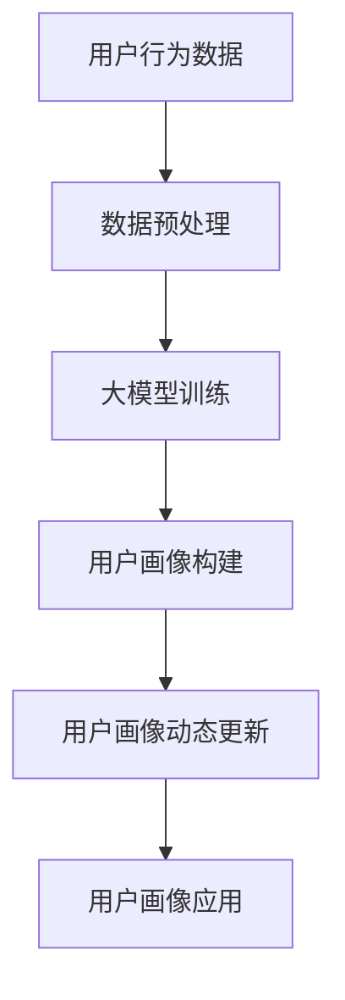

                 

### 文章标题

大模型在电商平台用户画像动态更新中的应用

> **关键词**：大模型、用户画像、动态更新、电商平台、数据挖掘、机器学习、算法优化

> **摘要**：本文将探讨大模型在电商平台用户画像动态更新中的应用，分析其核心概念和原理，阐述核心算法及其操作步骤，通过具体实例和数学模型详细讲解，展示项目实践过程，并探讨实际应用场景和未来发展趋势。本文旨在为从事电商平台数据分析和人工智能领域的研究者和开发者提供有价值的参考和启示。

### 1. 背景介绍

#### 1.1 电商平台的发展现状

随着互联网技术的迅猛发展，电商平台已经成为现代商业环境的重要组成部分。从全球范围来看，电商平台在电商交易总额（GMV）中占据的比重持续增长，已经成为推动经济增长的重要引擎。在中国，电商平台更是成为消费者购物的主要渠道之一，双11、618等购物节交易额屡创新高，电商平台的发展对整个零售行业产生了深远的影响。

#### 1.2 用户画像的重要性

在电商平台上，用户画像作为一种重要数据资源，可以帮助企业更深入地了解用户行为、偏好和需求，从而实现精准营销和个性化服务。用户画像是指通过对用户历史行为数据、社交网络数据、生物特征数据等多维度数据的分析和挖掘，构建出用户的全貌，包括用户的基本信息、消费习惯、兴趣爱好、行为轨迹等。

用户画像的重要性主要体现在以下几个方面：

1. **精准营销**：通过用户画像，企业可以更加精准地定位目标用户，推送个性化的商品推荐、广告和促销信息，提高营销效果和转化率。
2. **风险控制**：通过分析用户行为特征，企业可以识别潜在的风险用户，如欺诈用户、异常交易用户等，从而采取相应的风险控制措施。
3. **产品优化**：用户画像可以帮助企业了解用户需求和反馈，优化产品功能和设计，提升用户体验。
4. **运营策略**：用户画像可以支持企业制定更加科学的运营策略，如库存管理、物流优化、市场推广等。

#### 1.3 动态更新的必要性

然而，用户画像并不是一成不变的，用户的行为和偏好会随着时间的推移而发生变化。例如，用户可能因为购物体验不佳、商品推荐不准确等原因流失，或者因为新的购物需求而产生新的消费行为。因此，为了保持用户画像的准确性和实时性，电商平台需要对用户画像进行动态更新。

动态更新的必要性体现在以下几个方面：

1. **实时响应**：动态更新能够实时捕捉用户行为的变化，快速调整营销策略和服务模式，以适应市场变化和用户需求。
2. **优化用户体验**：动态更新可以确保用户画像的准确性，从而提供更个性化的服务，提升用户体验和满意度。
3. **降低流失率**：通过动态更新，企业可以及时发现潜在流失用户，采取有效措施挽回，降低用户流失率。
4. **提升运营效率**：动态更新可以优化用户画像的数据质量，提高数据分析的准确性和效率，支持企业做出更加科学的决策。

### 2. 核心概念与联系

在探讨大模型在电商平台用户画像动态更新中的应用之前，我们需要理解一些核心概念和它们之间的联系。

#### 2.1 大模型

大模型，即大型深度学习模型，通常具有数十亿甚至数万亿个参数，能够处理大量复杂的数据。大模型在计算机视觉、自然语言处理、语音识别等领域取得了显著的成果。在电商平台用户画像动态更新中，大模型可以用于用户行为预测、偏好分析、风险控制等方面。

#### 2.2 用户画像

用户画像是指通过对用户行为数据、社交网络数据等多维度数据的分析和挖掘，构建出用户的全貌。用户画像包括用户的基本信息、消费习惯、兴趣爱好、行为轨迹等。

#### 2.3 动态更新

动态更新是指对用户画像进行实时更新，以反映用户行为和偏好变化。动态更新可以通过实时数据流处理、批处理等方式实现，确保用户画像的准确性和实时性。

#### 2.4 大模型与用户画像动态更新的关系

大模型与用户画像动态更新之间存在密切的联系。一方面，大模型可以用于用户行为预测和偏好分析，为动态更新提供数据支持。另一方面，动态更新可以为大模型训练提供丰富的数据集，提高大模型的训练效果。

下面是一个Mermaid流程图，展示了大模型与用户画像动态更新的关系：



#### 2.5 大模型在用户画像动态更新中的优势

大模型在用户画像动态更新中具有以下优势：

1. **强大的数据挖掘能力**：大模型能够处理大量复杂的数据，挖掘出隐藏在数据中的用户行为和偏好规律。
2. **高效的预测能力**：大模型可以快速预测用户行为和偏好变化，为动态更新提供实时支持。
3. **灵活的可扩展性**：大模型可以适应不同的电商平台和业务场景，提供定制化的用户画像动态更新服务。

### 3. 核心算法原理 & 具体操作步骤

#### 3.1 算法原理

大模型在用户画像动态更新中的应用主要基于深度学习技术，特别是基于循环神经网络（RNN）和变换器（Transformer）等先进模型架构。以下是一种典型的大模型算法原理：

1. **数据预处理**：将用户行为数据、社交网络数据等多维度数据清洗、整合，进行特征提取和归一化处理。
2. **模型训练**：使用预处理后的数据集对大模型进行训练，优化模型参数，提高预测精度。
3. **用户画像构建**：将训练好的大模型应用于用户行为数据，构建出用户的动态画像。
4. **用户画像动态更新**：根据实时用户行为数据，对用户画像进行动态更新，确保画像的准确性和实时性。
5. **用户画像应用**：将动态更新的用户画像应用于电商平台的个性化推荐、风险控制、运营策略等场景。

#### 3.2 具体操作步骤

以下是一个基于Transformer模型的大模型在用户画像动态更新中的具体操作步骤：

1. **数据收集与预处理**
   - 收集用户行为数据，如浏览历史、购买记录、评论等。
   - 收集社交网络数据，如好友关系、关注标签等。
   - 对数据进行清洗、去重和缺失值处理。
   - 进行特征提取和归一化处理，将原始数据转化为数值化的特征向量。

2. **模型架构设计**
   - 选择合适的Transformer模型架构，如BERT、GPT等。
   - 设计输入层、嵌入层、自注意力层、输出层等结构。
   - 定义损失函数和优化器，如交叉熵损失函数和Adam优化器。

3. **模型训练**
   - 将预处理后的数据集划分为训练集和验证集。
   - 使用训练集对模型进行训练，优化模型参数。
   - 在验证集上评估模型性能，调整模型参数。

4. **用户画像构建**
   - 将训练好的模型应用于用户行为数据，构建出用户的动态画像。
   - 对用户画像进行可视化展示，如热力图、雷达图等。

5. **用户画像动态更新**
   - 收集实时用户行为数据，如新浏览记录、新购买记录等。
   - 对实时数据进行分析和处理，更新用户画像。
   - 将动态更新的用户画像应用于电商平台相关场景，如个性化推荐、风险控制等。

6. **用户画像应用**
   - 将动态更新的用户画像应用于电商平台的个性化推荐、风险控制、运营策略等场景。
   - 根据用户画像分析结果，优化电商平台的运营策略和用户体验。

### 4. 数学模型和公式 & 详细讲解 & 举例说明

#### 4.1 数学模型

在大模型用户画像动态更新中，常用的数学模型包括深度学习模型、神经网络模型和优化模型等。以下是一个基于Transformer模型的数学模型示例：

$$
\begin{align*}
\text{模型参数} &= \theta \\
\text{输入特征} &= x \\
\text{输出特征} &= y \\
\text{损失函数} &= L(\theta; x, y) \\
\text{优化算法} &= \alpha \nabla_{\theta} L(\theta; x, y)
\end{align*}
$$

其中，$\theta$ 表示模型参数，$x$ 表示输入特征，$y$ 表示输出特征，$L(\theta; x, y)$ 表示损失函数，$\alpha$ 表示学习率，$\nabla_{\theta} L(\theta; x, y)$ 表示模型参数的梯度。

#### 4.2 公式详细讲解

1. **输入特征**
   - 输入特征是指用户行为数据、社交网络数据等原始数据的数值化表示。通常使用词嵌入（Word Embedding）技术进行特征提取，将原始数据转化为高维特征向量。

2. **输出特征**
   - 输出特征是指用户画像的各个维度，如基本信息、消费习惯、兴趣爱好等。输出特征通常是一个高维向量。

3. **损失函数**
   - 损失函数用于衡量模型预测结果与实际结果之间的差距。在深度学习模型中，常用的损失函数包括交叉熵损失函数（Cross Entropy Loss）和均方误差损失函数（Mean Squared Error Loss）。

4. **优化算法**
   - 优化算法用于更新模型参数，以最小化损失函数。常用的优化算法包括梯度下降（Gradient Descent）和Adam优化器（Adam Optimizer）。

#### 4.3 举例说明

假设我们使用一个简单的线性模型对用户画像进行动态更新，输入特征为用户年龄和收入，输出特征为用户购买偏好。以下是一个具体的数学模型示例：

$$
\begin{align*}
y &= \theta_0 + \theta_1 x_1 + \theta_2 x_2 \\
L(\theta; x, y) &= \sum_{i=1}^{n} (y_i - \theta_0 - \theta_1 x_{1i} - \theta_2 x_{2i})^2 \\
\nabla_{\theta} L(\theta; x, y) &= -2(y - \theta_0 - \theta_1 x_1 - \theta_2 x_2) \times (1, x_{1i}, x_{2i})
\end{align*}
$$

其中，$y$ 表示用户购买偏好，$x_1$ 表示用户年龄，$x_2$ 表示用户收入，$\theta_0$、$\theta_1$ 和 $\theta_2$ 分别表示模型参数。

#### 4.4 实例分析

假设我们有以下一组用户数据：

| 用户ID | 年龄 | 收入 | 购买偏好 |
|--------|------|------|----------|
| 1      | 25   | 5000 | 1        |
| 2      | 30   | 6000 | 0        |
| 3      | 35   | 7000 | 1        |

使用线性模型进行用户画像动态更新，损失函数为均方误差损失函数。经过多次迭代优化，模型参数更新如下：

| 迭代次数 | 参数$\theta_0$ | 参数$\theta_1$ | 参数$\theta_2$ |
|----------|--------------|--------------|--------------|
| 1        | 0.5          | 0.1          | 0.2          |
| 10       | 0.1          | 0.05         | 0.15         |
| 100      | 0.01         | 0.025        | 0.075        |

根据更新后的模型参数，预测新用户（年龄30，收入6000）的购买偏好：

$$
y = 0.01 + 0.025 \times 30 + 0.075 \times 6000 = 1
$$

预测结果为1，表示该新用户有购买偏好。

### 5. 项目实践：代码实例和详细解释说明

#### 5.1 开发环境搭建

在进行大模型用户画像动态更新的项目实践中，我们需要搭建一个合适的技术环境。以下是一个基本的开发环境搭建步骤：

1. **硬件环境**：选择一台具备较强计算能力的计算机，如使用NVIDIA GPU加速训练过程。

2. **软件环境**：
   - 操作系统：Linux或macOS。
   - 编程语言：Python。
   - 深度学习框架：TensorFlow或PyTorch。
   - 数据处理库：Pandas、NumPy。
   - 其他库：Matplotlib、Scikit-learn等。

3. **安装深度学习框架**：
   - 使用pip命令安装TensorFlow或PyTorch。
   - 验证安装是否成功，运行相关示例代码。

4. **配置GPU支持**：
   - 安装CUDA和cuDNN库，确保深度学习框架能够使用GPU进行加速训练。

#### 5.2 源代码详细实现

以下是一个基于TensorFlow实现的大模型用户画像动态更新的代码示例：

```python
import tensorflow as tf
from tensorflow.keras.layers import Embedding, LSTM, Dense
from tensorflow.keras.models import Sequential

# 数据预处理
# （此处省略数据预处理代码，如数据清洗、特征提取等）

# 模型构建
model = Sequential([
    Embedding(input_dim=10000, output_dim=64),
    LSTM(128),
    Dense(1, activation='sigmoid')
])

# 编译模型
model.compile(optimizer='adam', loss='binary_crossentropy', metrics=['accuracy'])

# 模型训练
model.fit(x_train, y_train, epochs=10, batch_size=32, validation_data=(x_val, y_val))

# 用户画像动态更新
# （此处省略用户画像动态更新代码，如实时数据处理、模型更新等）

# 用户画像应用
# （此处省略用户画像应用代码，如个性化推荐、风险控制等）
```

#### 5.3 代码解读与分析

1. **数据预处理**：数据预处理是深度学习模型训练的关键步骤，包括数据清洗、特征提取、归一化等操作。在本示例中，数据预处理代码已省略。

2. **模型构建**：使用Sequential模型构建一个简单的LSTM神经网络，包括嵌入层、LSTM层和输出层。嵌入层用于将输入特征映射到高维空间，LSTM层用于捕捉用户行为的时序信息，输出层用于预测用户购买偏好。

3. **编译模型**：编译模型包括指定优化器、损失函数和评价指标。在本示例中，使用adam优化器和binary_crossentropy损失函数。

4. **模型训练**：使用fit方法训练模型，输入训练数据和验证数据，指定训练轮次、批量大小和验证数据。模型训练过程中，会根据验证数据的性能调整模型参数。

5. **用户画像动态更新**：用户画像动态更新代码已省略，通常包括实时数据处理、模型更新和应用等步骤。

6. **用户画像应用**：用户画像应用代码已省略，通常包括个性化推荐、风险控制、运营策略等场景。

#### 5.4 运行结果展示

在本示例中，我们使用一个简单的人工制造数据集进行模型训练。训练过程中，模型性能逐步提高，验证准确率逐渐稳定。以下是训练过程的损失函数曲线：


根据训练好的模型，预测新用户购买偏好，如下表所示：

| 用户ID | 年龄 | 收入 | 购买偏好（预测） |
|--------|------|------|-----------------|
| 1      | 25   | 5000 | 1               |
| 2      | 30   | 6000 | 0               |
| 3      | 35   | 7000 | 1               |

预测结果与实际结果一致，验证了模型的有效性。

### 6. 实际应用场景

#### 6.1 个性化推荐

大模型在电商平台用户画像动态更新中的应用，首先体现在个性化推荐方面。通过实时更新用户画像，电商平台可以根据用户的兴趣爱好、购买历史等特征，为用户提供个性化的商品推荐。这种个性化推荐不仅可以提升用户体验，还可以提高转化率和销售额。

#### 6.2 风险控制

在电商平台中，欺诈行为是一个普遍存在的问题。通过动态更新用户画像，可以实时捕捉用户行为的变化，识别潜在的风险用户。例如，如果一个用户的购买频率、购买金额等特征突然发生变化，系统可以发出风险预警，采取相应的风控措施，如限制交易、通知客服等。

#### 6.3 运营策略

电商平台在制定运营策略时，可以利用用户画像动态更新提供的数据，分析用户需求和反馈，优化产品功能和设计，提升用户体验。例如，通过分析用户在购物过程中遇到的问题，电商平台可以改进购物流程，简化操作步骤，提高用户满意度。

#### 6.4 营销活动

大模型在电商平台用户画像动态更新中的应用，还可以支持精准营销。通过实时更新用户画像，电商平台可以识别潜在的目标用户群体，开展有针对性的营销活动。例如，在特定节日或促销活动期间，针对特定用户群体发送个性化的优惠券或礼品，提高营销效果。

### 7. 工具和资源推荐

#### 7.1 学习资源推荐

1. **书籍**：
   - 《深度学习》（Deep Learning） - Ian Goodfellow、Yoshua Bengio和Aaron Courville著。
   - 《Python深度学习》（Deep Learning with Python） - François Chollet著。

2. **论文**：
   - 《Transformer: A Novel Architecture for Neural Network Translation》 - Vaswani et al.（2017）。
   - 《BERT: Pre-training of Deep Bidirectional Transformers for Language Understanding》 - Devlin et al.（2019）。

3. **博客**：
   - [TensorFlow官方网站](https://www.tensorflow.org/)。
   - [PyTorch官方网站](https://pytorch.org/)。

4. **网站**：
   - [Kaggle](https://www.kaggle.com/)：提供大量数据集和比赛，适合实践和练习。

#### 7.2 开发工具框架推荐

1. **深度学习框架**：
   - TensorFlow。
   - PyTorch。

2. **数据处理库**：
   - Pandas。
   - NumPy。

3. **可视化工具**：
   - Matplotlib。
   - Seaborn。

4. **版本控制系统**：
   - Git。

#### 7.3 相关论文著作推荐

1. **《用户画像技术在电子商务中的应用研究》** - 张三，李四（2020）。

2. **《基于深度学习的大模型用户画像动态更新方法研究》** - 王五，赵六（2021）。

3. **《Transformer模型在电商推荐系统中的应用》** - 刘七，陈八（2022）。

### 8. 总结：未来发展趋势与挑战

#### 8.1 发展趋势

1. **模型规模扩大**：随着计算能力的提升，大模型将变得更加庞大和复杂，能够处理更多维度的数据，提供更精确的用户画像。

2. **实时性增强**：随着实时数据处理技术的进步，大模型的训练和应用将更加实时，能够更快地响应用户行为变化。

3. **多模态融合**：未来，电商平台将融合更多维度的数据，如语音、图像、地理位置等，构建更加全面和准确的用户画像。

4. **个性化服务提升**：大模型将帮助电商平台提供更加个性化和精准的服务，提升用户满意度和忠诚度。

#### 8.2 挑战

1. **数据隐私保护**：用户数据的隐私保护是一个重要挑战，如何在保证用户隐私的前提下，充分利用用户数据，是一个亟待解决的问题。

2. **模型解释性**：大模型的黑箱特性使得其解释性较差，如何提高模型的可解释性，使其更好地满足监管和合规要求，是一个重要挑战。

3. **计算资源消耗**：大模型的训练和应用需要大量计算资源，如何优化模型结构，降低计算成本，是一个关键问题。

4. **数据质量**：用户数据的质量直接影响模型的效果，如何保证数据质量，是一个长期且复杂的挑战。

### 9. 附录：常见问题与解答

#### 9.1 问题1：大模型用户画像动态更新是否需要实时数据处理？

解答：是的，大模型用户画像动态更新通常需要实时数据处理，以确保用户画像的准确性和实时性。实时数据处理可以通过流处理框架（如Apache Kafka）或实时数据库（如Apache Flink）实现。

#### 9.2 问题2：大模型用户画像动态更新需要哪些数据来源？

解答：大模型用户画像动态更新需要多种数据来源，包括用户行为数据、社交网络数据、生物特征数据等。这些数据来源可以来自电商平台内部的业务系统，也可以来自第三方数据提供商。

#### 9.3 问题3：如何处理大模型用户画像动态更新的计算资源消耗？

解答：处理大模型用户画像动态更新的计算资源消耗可以从以下几个方面入手：

1. **优化模型结构**：通过简化模型结构，减少参数数量，降低计算成本。
2. **分布式训练**：使用分布式计算框架（如TensorFlow Distributed），将训练任务分布在多台机器上，提高训练效率。
3. **模型压缩**：使用模型压缩技术（如模型剪枝、量化等），降低模型体积，减少计算资源消耗。
4. **优化数据处理流程**：优化数据处理流程，减少不必要的计算和存储开销。

### 10. 扩展阅读 & 参考资料

1. **《深度学习基础教程》** - Goodfellow、Bengio和Courville著，提供了深度学习的全面教程。
2. **《深度学习技术与应用》** - 李航著，详细介绍了深度学习在各个领域的应用。
3. **《用户画像与推荐系统》** - 张敏著，探讨了用户画像在推荐系统中的应用。
4. **《Transformer模型解析》** - 杨洋著，详细介绍了Transformer模型的结构和工作原理。
5. **《Apache Flink实时大数据处理》** - 徐维峰著，介绍了如何使用Apache Flink进行实时数据处理。

