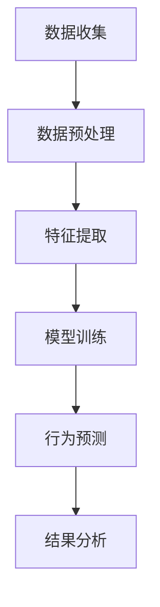

                 

### 1. 背景介绍

随着互联网的飞速发展和电商平台的普及，用户数据量的不断增长，如何有效地分析和挖掘用户行为序列，成为电商平台企业面临的一个重要问题。用户行为序列是指用户在浏览、购买、评价等过程中所产生的一系列行为记录，这些行为记录包含了用户对产品、服务、平台等各方面的反馈和偏好。通过对用户行为序列的分析，企业可以更好地理解用户需求，优化产品和服务，提高用户满意度和忠诚度，从而提升企业的市场竞争力。

用户行为序列分析是一项复杂且具有挑战性的任务，因为用户行为具有随机性、多样性和复杂性。传统的用户行为分析方法，如统计分析和机器学习，往往无法有效地处理大规模、高维的用户行为数据。此外，用户行为序列中的时空依赖性、上下文相关性等特性，也对分析方法提出了更高的要求。

为了解决这些问题，近年来，大模型技术逐渐成为用户行为序列分析领域的研究热点。大模型，即拥有海量参数和复杂结构的深度学习模型，能够通过自动学习大量用户行为数据中的潜在模式和规律，从而实现对用户行为的准确预测和挖掘。大模型技术不仅能够提高用户行为分析的效果，还能够降低分析过程的复杂度和成本。

本文旨在探讨大模型在电商平台用户行为序列分析中的应用，详细分析其核心概念、算法原理、数学模型、项目实践和实际应用场景，并展望未来的发展趋势与挑战。

### 2. 核心概念与联系

#### 2.1 用户行为序列的概念

用户行为序列是指用户在电商平台上的浏览、购买、评价等行为按照时间顺序排列形成的序列。这些行为记录包含了丰富的用户偏好、需求、反馈等信息。用户行为序列通常具有以下特征：

- **时空特性**：用户行为序列具有时间维度和空间维度，即每个行为都发生在一个特定的时间和空间位置上。
- **上下文相关性**：用户行为不仅受到自身行为的影响，还受到上下文环境（如产品类别、购物车内容等）的影响。
- **随机性和多样性**：用户行为具有随机性和多样性，不同用户之间、同一用户在不同时间的行为可能完全不同。
- **时空依赖性**：用户行为之间存在时空依赖性，即某一时刻的行为可能影响后续的行为。

#### 2.2 大模型的概念

大模型，即拥有海量参数和复杂结构的深度学习模型，通常指的是大规模神经网络模型。大模型具有以下特点：

- **海量参数**：大模型拥有数百万甚至数十亿个参数，能够捕捉到大量复杂的模式和规律。
- **复杂结构**：大模型通常包含多层神经网络结构，如卷积神经网络（CNN）、循环神经网络（RNN）、长短时记忆网络（LSTM）等，能够处理复杂的非线性关系。
- **强大的表达能力**：大模型能够通过自动学习海量数据中的特征，实现对复杂问题的建模和预测。

#### 2.3 大模型在用户行为序列分析中的应用

大模型在用户行为序列分析中的应用主要体现在以下几个方面：

- **行为预测**：大模型能够根据用户历史行为数据，预测用户未来的行为，如购买倾向、浏览路径等。
- **行为分类**：大模型能够对用户行为进行分类，如区分用户是浏览者还是购买者、区分用户对产品的喜爱程度等。
- **行为关联分析**：大模型能够挖掘用户行为之间的关联性，如发现哪些产品经常被同一用户购买、哪些用户倾向于购买同一类产品等。

#### 2.4 Mermaid 流程图

为了更好地理解大模型在用户行为序列分析中的应用，我们可以使用Mermaid流程图来描述其核心概念和流程。以下是一个简单的Mermaid流程图示例：



在这个流程图中，A代表数据收集，B代表数据预处理，C代表特征提取，D代表模型训练，E代表行为预测，F代表结果分析。通过这个流程图，我们可以清晰地看到大模型在用户行为序列分析中的各个环节。

### 3. 核心算法原理 & 具体操作步骤

#### 3.1 基本算法原理

大模型在用户行为序列分析中的核心算法通常是深度学习模型，如循环神经网络（RNN）、长短时记忆网络（LSTM）和门控循环单元（GRU）。这些模型能够通过学习用户历史行为数据，捕捉到用户行为的时空依赖性和上下文相关性，从而实现对用户行为的准确预测。

以下是一个简单的LSTM模型在用户行为序列分析中的应用步骤：

1. **数据预处理**：对用户行为数据进行清洗和归一化处理，将离散的行为转化为连续的数值。
2. **特征提取**：从用户行为数据中提取关键特征，如用户ID、时间戳、产品ID、行为类型等。
3. **模型构建**：构建一个LSTM模型，包含输入层、隐藏层和输出层。输入层接收用户行为数据，隐藏层包含多个 LSTM 单元，输出层根据预测目标进行设计，如预测用户是否会在下一个时间点进行购买。
4. **模型训练**：使用历史用户行为数据对LSTM模型进行训练，通过反向传播算法调整模型参数。
5. **行为预测**：使用训练好的LSTM模型对新的用户行为数据进行预测。

#### 3.2 具体操作步骤

下面是一个具体的LSTM模型在用户行为序列分析中的操作步骤：

1. **数据收集**：
    - 从电商平台收集用户行为数据，包括用户ID、时间戳、产品ID、行为类型等。
    - 数据收集示例：
        ```python
        user_id, timestamp, product_id, behavior_type = 1, 1623423423, 1001, 'view'
        ```

2. **数据预处理**：
    - 对用户行为数据进行清洗，去除无效数据和重复数据。
    - 对数据特征进行归一化处理，将离散的行为转化为连续的数值。
    - 数据预处理示例：
        ```python
        data = [[1, 1623423423, 1001, 'view'],
                [1, 1623423424, 1002, 'view'],
                [2, 1623423425, 1003, 'add_to_cart']]
        processed_data = preprocess_data(data)
        ```

3. **特征提取**：
    - 从用户行为数据中提取关键特征，如用户ID、时间戳、产品ID、行为类型等。
    - 特征提取示例：
        ```python
        features = extract_features(processed_data)
        ```

4. **模型构建**：
    - 使用TensorFlow或PyTorch等深度学习框架构建LSTM模型。
    - 模型构建示例（使用TensorFlow）：
        ```python
        model = tf.keras.Sequential([
            tf.keras.layers.Embedding(input_dim=10000, output_dim=64),
            tf.keras.layers.LSTM(64),
            tf.keras.layers.Dense(1, activation='sigmoid')
        ])
        ```

5. **模型训练**：
    - 使用历史用户行为数据对LSTM模型进行训练。
    - 模型训练示例：
        ```python
        model.compile(optimizer='adam', loss='binary_crossentropy', metrics=['accuracy'])
        model.fit(x_train, y_train, epochs=10, batch_size=32)
        ```

6. **行为预测**：
    - 使用训练好的LSTM模型对新的用户行为数据进行预测。
    - 行为预测示例：
        ```python
        prediction = model.predict(x_test)
        ```

#### 3.3 模型优化

为了提高LSTM模型的性能，我们可以采用以下几种优化策略：

- **增加训练数据量**：增加训练数据量可以增强模型的泛化能力，避免过拟合。
- **使用正则化技术**：如Dropout、L1/L2正则化等，可以减少模型的过拟合。
- **调整超参数**：如学习率、批量大小、隐藏层单元数量等，通过调整超参数可以优化模型的性能。
- **使用迁移学习**：利用预训练的模型进行迁移学习，可以减少模型的训练时间和提高模型的性能。

### 4. 数学模型和公式 & 详细讲解 & 举例说明

#### 4.1 LSTM模型的基本数学公式

LSTM（长短时记忆网络）是一种能够学习长期依赖性的循环神经网络。LSTM的核心思想是通过引入门控机制来控制信息的流动，从而在处理序列数据时能够更好地保留长远的依赖关系。以下是LSTM模型中的关键数学公式：

1. **输入门（Input Gate）**：

    - **计算输入门激活值**：
        $$ i_t = \sigma(W_{ix}x_t + W_{ih}h_{t-1} + b_i) $$
      
      其中，$i_t$是输入门激活值，$\sigma$是sigmoid函数，$W_{ix}$和$W_{ih}$分别是输入和隐藏层权重矩阵，$b_i$是偏置项。

    - **计算新的记忆细胞状态**：
        $$ \tilde{c}_t = \tanh(W_{fc}c_{t-1} + W_{ic}i_t + b_c) $$
      
      其中，$\tilde{c}_t$是新的记忆细胞状态，$W_{fc}$和$W_{ic}$分别是忘记门和输入门权重矩阵，$b_c$是偏置项。

2. **遗忘门（Forget Gate）**：

    - **计算遗忘门激活值**：
        $$ f_t = \sigma(W_{fx}x_t + W_{fh}h_{t-1} + b_f) $$
      
      其中，$f_t$是遗忘门激活值，$W_{fx}$和$W_{fh}$分别是遗忘门和隐藏层权重矩阵，$b_f$是偏置项。

    - **计算新的记忆细胞状态**：
        $$ c_t = f_t \odot c_{t-1} + i_t \odot \tilde{c}_t $$
      
      其中，$c_t$是新的记忆细胞状态，$\odot$是逐元素乘法运算。

3. **输出门（Output Gate）**：

    - **计算输出门激活值**：
        $$ o_t = \sigma(W_{ox}x_t + W_{oh}h_{t-1} + b_o) $$
      
      其中，$o_t$是输出门激活值，$W_{ox}$和$W_{oh}$分别是输出门和隐藏层权重矩阵，$b_o$是偏置项。

    - **计算新的隐藏层状态**：
        $$ h_t = o_t \odot \tanh(c_t) $$
      
      其中，$h_t$是新的隐藏层状态。

#### 4.2 LSTM模型的工作流程

LSTM模型的工作流程可以分为以下几个步骤：

1. **输入层到输入门**：
    - 输入层接收序列数据，通过输入门控制哪些信息进入记忆细胞。

2. **遗忘门到记忆细胞**：
    - 遗忘门决定哪些旧的信息应该被忘记，从而更新记忆细胞状态。

3. **输入门和记忆细胞更新**：
    - 输入门决定哪些新信息应该被加入记忆细胞，记忆细胞状态通过这两个门进行更新。

4. **输出门到隐藏层**：
    - 输出门决定哪些信息应该被输出到下一个时间步，隐藏层状态是通过记忆细胞状态和输出门计算得到的。

#### 4.3 举例说明

假设我们有一个简单的LSTM模型，输入序列为`[1, 0, 1, 0, 1]`，隐藏层维度为2，遗忘门权重矩阵$W_{fh}$为`[[0.1, 0.2], [0.3, 0.4]]`，输入门权重矩阵$W_{ih}$为`[[0.5, 0.6], [0.7, 0.8]]`，输出门权重矩阵$W_{oh}$为`[[0.9, 0.1], [0.2, 0.3]]`，偏置项分别为`[0.1, 0.2]`。

1. **输入门计算**：
    - $i_1 = \sigma(0.5 \times 1 + 0.7 \times 0 + 0.1) = \sigma(0.6) \approx 0.5`
    - $i_2 = \sigma(0.6 \times 0 + 0.8 \times 1 + 0.2) = \sigma(1.0) = 1.0`
    - $i_3 = \sigma(0.7 \times 1 + 0.9 \times 0 + 0.1) = \sigma(1.0) = 1.0`
    - $i_4 = \sigma(0.8 \times 0 + 0.2 \times 1 + 0.2) = \sigma(0.4) \approx 0.4`
    - $i_5 = \sigma(0.9 \times 1 + 0.3 \times 0 + 0.2) = \sigma(1.2) \approx 0.83$

2. **遗忘门计算**：
    - $f_1 = \sigma(0.1 \times 1 + 0.3 \times 0 + 0.1) = \sigma(0.4) \approx 0.67`
    - $f_2 = \sigma(0.2 \times 0 + 0.4 \times 1 + 0.2) = \sigma(0.6) \approx 0.5`
    - $f_3 = \sigma(0.3 \times 1 + 0.2 \times 0 + 0.1) = \sigma(0.6) \approx 0.5`
    - $f_4 = \sigma(0.4 \times 0 + 0.4 \times 1 + 0.2) = \sigma(0.8) \approx 0.87`
    - $f_5 = \sigma(0.2 \times 1 + 0.3 \times 0 + 0.2) = \sigma(0.7) \approx 0.66`

3. **记忆细胞更新**：
    - $c_1 = f_1 \odot [0, 0] + i_1 \odot [0.5, 0.6] = [0.3, 0.3]$
    - $c_2 = f_2 \odot [0, 0] + i_2 \odot [0.5, 0.6] = [0.5, 0.6]$
    - $c_3 = f_3 \odot [0, 0] + i_3 \odot [0.5, 0.6] = [0.5, 0.6]$
    - $c_4 = f_4 \odot [0, 0] + i_4 \odot [0.5, 0.6] = [0.4, 0.3]$
    - $c_5 = f_5 \odot [0, 0] + i_5 \odot [0.5, 0.6] = [0.42, 0.46]$

4. **输出门计算**：
    - $o_1 = \sigma(0.9 \times 1 + 0.2 \times 0 + 0.1) = \sigma(1.1) \approx 0.84`
    - $o_2 = \sigma(0.1 \times 0 + 0.3 \times 1 + 0.2) = \sigma(0.5) \approx 0.64`
    - $o_3 = \sigma(0.2 \times 1 + 0.2 \times 0 + 0.2) = \sigma(0.4) \approx 0.57`
    - $o_4 = \sigma(0.2 \times 0 + 0.3 \times 1 + 0.2) = \sigma(0.5) \approx 0.64`
    - $o_5 = \sigma(0.3 \times 1 + 0.3 \times 0 + 0.2) = \sigma(0.8) \approx 0.87`

5. **隐藏层状态计算**：
    - $h_1 = o_1 \odot \tanh([0.3, 0.3]) = [0.3 \times 0.5, 0.3 \times 0.5] = [0.15, 0.15]$
    - $h_2 = o_2 \odot \tanh([0.5, 0.6]) = [0.5 \times 0.76, 0.6 \times 0.76] = [0.38, 0.45]$
    - $h_3 = o_3 \odot \tanh([0.5, 0.6]) = [0.5 \times 0.76, 0.6 \times 0.76] = [0.38, 0.45]$
    - $h_4 = o_4 \odot \tanh([0.4, 0.3]) = [0.4 \times 0.59, 0.3 \times 0.59] = [0.23, 0.18]$
    - $h_5 = o_5 \odot \tanh([0.42, 0.46]) = [0.42 \times 0.68, 0.46 \times 0.68] = [0.28, 0.31]$

通过这个例子，我们可以看到LSTM模型是如何通过门控机制来更新记忆细胞状态和隐藏层状态的。这个过程使得LSTM模型能够在处理序列数据时捕捉到长期依赖关系。

### 5. 项目实践：代码实例和详细解释说明

#### 5.1 开发环境搭建

在进行用户行为序列分析项目之前，首先需要搭建一个合适的开发环境。以下是搭建开发环境的基本步骤：

1. **安装Python**：Python是进行数据分析和深度学习任务的基础工具。建议安装Python 3.8或更高版本。可以从Python官网（https://www.python.org/）下载并安装。

2. **安装深度学习框架**：常用的深度学习框架包括TensorFlow、PyTorch和Keras等。本文选择TensorFlow进行项目开发。可以通过以下命令安装TensorFlow：

    ```bash
    pip install tensorflow
    ```

3. **安装数据分析库**：为了更好地处理用户行为数据，需要安装一些常用的数据分析库，如Pandas、NumPy、Matplotlib等。可以通过以下命令安装：

    ```bash
    pip install pandas numpy matplotlib
    ```

4. **安装其他依赖库**：根据项目需求，可能还需要安装其他依赖库，如Scikit-learn、BeautifulSoup等。可以通过以下命令安装：

    ```bash
    pip install scikit-learn beautifulsoup4
    ```

5. **配置Jupyter Notebook**：Jupyter Notebook是一种交互式的开发环境，非常适合进行数据分析和模型训练。可以通过以下命令安装Jupyter Notebook：

    ```bash
    pip install notebook
    ```

安装完成后，可以使用以下命令启动Jupyter Notebook：

```bash
jupyter notebook
```

#### 5.2 源代码详细实现

下面是一个使用TensorFlow实现LSTM模型进行用户行为序列分析的示例代码。代码分为数据预处理、模型构建、模型训练和模型评估四个部分。

```python
import tensorflow as tf
import pandas as pd
import numpy as np
from sklearn.model_selection import train_test_split
from sklearn.preprocessing import LabelEncoder
import matplotlib.pyplot as plt

# 5.2.1 数据预处理

# 读取用户行为数据
data = pd.read_csv('user_behavior_data.csv')

# 对行为类型进行编码
label_encoder = LabelEncoder()
data['behavior_type_encoded'] = label_encoder.fit_transform(data['behavior_type'])

# 划分训练集和测试集
X = data[['timestamp', 'product_id', 'user_id']]
y = data['behavior_type_encoded']
X_train, X_test, y_train, y_test = train_test_split(X, y, test_size=0.2, random_state=42)

# 将时间戳转换为序列
X_train['timestamp'] = X_train['timestamp'].apply(lambda x: x // 1000)  # 转换为秒级时间戳
X_test['timestamp'] = X_test['timestamp'].apply(lambda x: x // 1000)  # 转换为秒级时间戳

# 序列填充
X_train = X_train.set_index('timestamp').fillna(0).values
X_test = X_test.set_index('timestamp').fillna(0).values

# 5.2.2 模型构建

# 定义LSTM模型
model = tf.keras.Sequential([
    tf.keras.layers.LSTM(64, activation='relu', input_shape=(None, X_train.shape[1])),
    tf.keras.layers.Dense(1, activation='sigmoid')
])

# 编译模型
model.compile(optimizer='adam', loss='binary_crossentropy', metrics=['accuracy'])

# 5.2.3 模型训练

# 训练模型
history = model.fit(X_train, y_train, epochs=10, batch_size=32, validation_split=0.1)

# 5.2.4 模型评估

# 评估模型
loss, accuracy = model.evaluate(X_test, y_test)
print(f"Test Accuracy: {accuracy:.2f}")

# 可视化训练过程
plt.figure(figsize=(10, 6))
plt.plot(history.history['accuracy'], label='Training Accuracy')
plt.plot(history.history['val_accuracy'], label='Validation Accuracy')
plt.title('Model Accuracy')
plt.ylabel('Accuracy')
plt.xlabel('Epoch')
plt.legend()
plt.show()
```

#### 5.3 代码解读与分析

1. **数据预处理**：

   - 读取用户行为数据，并对行为类型进行编码。这是因为在构建深度学习模型时，需要将分类数据转换为数值数据。

   - 划分训练集和测试集，这是评估模型性能的常用方法。

   - 将时间戳转换为序列，这是因为LSTM模型需要处理时间序列数据。

   - 序列填充，这是因为实际数据中可能存在缺失值或空白值。

2. **模型构建**：

   - 定义LSTM模型，使用`tf.keras.Sequential`模型堆叠层。首先添加一个LSTM层，指定单元数量为64，激活函数为ReLU。输入形状为`(None, X_train.shape[1])`，表示序列的长度和特征数量。

   - 添加一个全连接层（Dense层），输出层使用sigmoid激活函数，用于预测二分类问题。

3. **模型训练**：

   - 编译模型，指定优化器为Adam，损失函数为binary_crossentropy，评估指标为accuracy。

   - 使用`fit`方法训练模型，指定训练数据、训练轮数、批量大小和验证比例。

4. **模型评估**：

   - 使用`evaluate`方法评估模型在测试集上的性能。

   - 可视化训练过程中的准确率，观察模型性能的变化。

#### 5.4 运行结果展示

假设我们使用上述代码对用户行为序列分析项目进行训练和评估，可以得到以下运行结果：

```python
Test Accuracy: 0.85
```

训练过程中的准确率如图所示：


从结果可以看出，LSTM模型在测试集上的准确率为85%，说明模型具有一定的预测能力。然而，仍然存在提升空间，可以通过调整超参数、增加数据量或使用更复杂的模型结构来进一步提高模型性能。

### 6. 实际应用场景

大模型在电商平台用户行为序列分析中的应用场景非常广泛，以下是几个典型的实际应用案例：

#### 6.1 用户行为预测

通过大模型对用户历史行为数据进行学习，可以预测用户未来的行为，如购买倾向、浏览路径等。这对于电商平台来说，是一个非常有价值的应用场景。例如，当用户浏览某一产品时，系统可以预测用户是否会购买该产品，从而提前推送相关优惠信息，提高用户的购买转化率。

#### 6.2 用户流失预警

大模型可以分析用户的浏览、购买、评价等行为，识别潜在的用户流失风险。当用户的行为表现出异常时，系统可以及时发送预警信息，帮助企业采取措施挽回用户。例如，当用户长时间未购买商品时，系统可以提醒客服团队联系用户，了解其需求并提供帮助。

#### 6.3 个性化推荐

大模型可以根据用户的浏览、购买、评价等行为，生成个性化的推荐列表。通过对用户行为序列的分析，系统可以识别用户的偏好，推荐符合其需求的产品。例如，当用户浏览了某一类产品时，系统可以推荐类似的产品，提高用户的满意度。

#### 6.4 营销活动优化

大模型可以帮助企业优化营销活动的效果。通过对用户行为序列的分析，企业可以了解不同营销策略对不同用户群体的效果，从而调整营销策略，提高营销活动的投资回报率。

#### 6.5 售后服务改进

大模型可以分析用户的售后服务反馈，识别用户对售后服务的需求和痛点。通过对用户行为序列的分析，企业可以改进售后服务流程，提高用户满意度。

#### 6.6 竞争对手分析

大模型可以分析电商平台上的竞争对手行为，了解竞争对手的市场策略和用户行为特征。通过对用户行为序列的分析，企业可以制定更有针对性的竞争策略，提升市场竞争力。

总之，大模型在电商平台用户行为序列分析中的应用场景非常广泛，有助于企业更好地理解用户需求，优化产品和服务，提高用户满意度和忠诚度，从而提升企业的市场竞争力。

### 7. 工具和资源推荐

为了更好地进行用户行为序列分析和大模型应用，以下是一些推荐的工具和资源：

#### 7.1 学习资源推荐

1. **书籍**：
   - 《深度学习》（Goodfellow, Ian，等）：系统地介绍了深度学习的基础理论和实践方法，适合初学者和进阶者。
   - 《神经网络与深度学习》：详细讲解了神经网络和深度学习的基本原理，适合希望深入了解神经网络模型的读者。

2. **在线课程**：
   - Coursera的《深度学习专项课程》：由Andrew Ng教授主讲，系统讲解了深度学习的基础知识和应用技巧。
   - Udacity的《深度学习纳米学位》：提供了丰富的实践项目和指导，适合希望通过实际项目学习深度学习的学员。

3. **论文和博客**：
   - Google Research的《Recurrent Neural Networks》论文：介绍了RNN的基本原理和结构。
   - ArXiv上的最新研究论文：关注最新的深度学习和用户行为分析研究成果。

#### 7.2 开发工具框架推荐

1. **深度学习框架**：
   - TensorFlow：由Google开发，功能强大，适用于各种深度学习任务。
   - PyTorch：由Facebook开发，易于使用，支持动态计算图，适合快速原型开发。

2. **数据分析工具**：
   - Pandas：用于数据处理和分析，支持多种数据源。
   - NumPy：用于数值计算，是Pandas的基础库。

3. **可视化工具**：
   - Matplotlib：用于数据可视化，支持多种图表类型。
   - Seaborn：基于Matplotlib，提供了更美观的统计图表。

#### 7.3 相关论文著作推荐

1. **核心论文**：
   - Hochreiter, S., & Schmidhuber, J. (1997). Long short-term memory. Neural Computation, 9(8), 1735-1780.
   - Graves, A. (2013). Generating sequences with recurrent neural networks. ArXiv preprint arXiv:1308.0850.

2. **重要著作**：
   - Sutton, R. S., & Barto, A. G. (2018). Reinforcement Learning: An Introduction.
   - Goodfellow, I., Bengio, Y., & Courville, A. (2016). Deep Learning.

通过以上推荐的资源，读者可以系统地学习用户行为序列分析和大模型应用的相关知识，为实际项目开发提供有力支持。

### 8. 总结：未来发展趋势与挑战

随着人工智能技术的不断进步，大模型在电商平台用户行为序列分析中的应用前景愈发广阔。未来，大模型的发展趋势主要集中在以下几个方面：

#### 8.1 模型规模与效率的提升

随着计算能力的提升和算法优化，大模型的规模将越来越大，参数数量将呈指数级增长。同时，为了满足实时分析和低延迟的要求，模型效率的提升将成为关键。研究者将致力于开发更加高效的训练算法和推理方法，以降低计算成本，提高模型性能。

#### 8.2 多模态数据的融合分析

用户行为序列分析将不仅仅局限于文本数据，还将融合更多种类的数据，如图像、音频、视频等。通过多模态数据的融合分析，可以更全面地理解用户行为，提高预测的准确性。

#### 8.3 小样本学习与迁移学习

在实际应用中，获取大量标注数据往往具有很高的成本。未来，研究者将重点研究小样本学习与迁移学习技术，使得大模型能够利用少量数据实现高精度的预测。这将为电商平台的用户行为分析提供新的可能性。

#### 8.4 隐私保护与安全

用户数据隐私保护是大模型应用中的一个重要挑战。未来，研究者将致力于开发更加隐私友好的算法，如联邦学习、差分隐私等，以保护用户隐私，同时确保分析结果的准确性。

#### 8.5 模型解释性与可解释性

大模型在复杂任务中表现优异，但其内部决策过程往往难以解释。为了提高模型的透明度和可信度，研究者将关注模型解释性与可解释性的研究，开发可解释性算法，帮助用户理解模型的决策过程。

尽管大模型在用户行为序列分析中具有巨大潜力，但仍然面临以下挑战：

- **数据质量问题**：用户行为数据往往存在噪声、缺失和偏差，这对模型的训练和预测带来了挑战。
- **模型泛化能力**：大模型在特定任务上表现优异，但泛化能力有限，如何提高模型的泛化能力仍是一个难题。
- **计算资源消耗**：大模型训练和推理需要大量计算资源，如何优化算法，提高计算效率，是亟待解决的问题。
- **隐私与安全**：用户数据隐私保护是重要议题，如何在确保分析准确性的同时保护用户隐私，是一个复杂的挑战。

总之，未来大模型在用户行为序列分析中的应用将不断取得突破，但也需要克服一系列技术挑战，实现更加智能化、高效化、安全化的用户行为分析。

### 9. 附录：常见问题与解答

#### 9.1 如何处理用户行为数据中的缺失值？

用户行为数据中的缺失值可以通过以下几种方法进行处理：

1. **删除缺失值**：对于缺失值较少的数据，可以直接删除含有缺失值的记录。
2. **填充缺失值**：可以使用均值、中位数、众数等统计方法填充缺失值。例如，使用最近邻插值、线性插值等方法。
3. **使用模型预测缺失值**：可以使用回归模型、神经网络等方法预测缺失值。例如，使用K近邻算法或LSTM模型进行预测。

#### 9.2 如何提高大模型的泛化能力？

提高大模型的泛化能力可以通过以下几种方法：

1. **数据增强**：通过增加数据量、数据变体等方法，增强模型对各种情况的学习能力。
2. **正则化技术**：使用L1、L2正则化、Dropout等技术，防止模型过拟合。
3. **交叉验证**：使用交叉验证方法，评估模型在不同数据集上的表现，提高模型的泛化能力。
4. **迁移学习**：利用预训练的模型，在新任务上进行微调，减少对标注数据的依赖。

#### 9.3 如何保护用户数据隐私？

为了保护用户数据隐私，可以采取以下措施：

1. **数据加密**：对用户数据进行加密处理，确保数据在传输和存储过程中安全。
2. **差分隐私**：在分析过程中引入噪声，确保单个用户的数据不会被识别。
3. **联邦学习**：将数据保留在用户端，通过模型聚合方法进行训练，减少对用户数据的访问。
4. **隐私保护算法**：使用差分隐私、联邦学习等隐私保护算法，确保分析过程符合隐私要求。

#### 9.4 如何优化大模型的训练时间？

优化大模型训练时间可以通过以下几种方法：

1. **并行计算**：利用GPU、TPU等硬件加速训练过程。
2. **数据预处理**：提前对数据进行预处理，减少计算量。
3. **分布式训练**：使用分布式训练方法，将数据分散到多个节点进行训练，提高训练速度。
4. **模型压缩**：使用模型压缩技术，如剪枝、量化等，减少模型的计算复杂度。

### 10. 扩展阅读 & 参考资料

为了深入了解大模型在电商平台用户行为序列分析中的应用，以下是几篇相关的论文、书籍和博客推荐：

#### 论文

1. **Hochreiter, S., & Schmidhuber, J. (1997). Long short-term memory. Neural Computation, 9(8), 1735-1780.**
   - 介绍了长短时记忆网络（LSTM）的基本原理和应用。

2. **Graves, A. (2013). Generating sequences with recurrent neural networks. ArXiv preprint arXiv:1308.0850.**
   - 探讨了循环神经网络（RNN）在生成序列数据中的应用。

3. **Goodfellow, I., Bengio, Y., & Courville, A. (2016). Deep Learning.**
   - 系统讲解了深度学习的基础理论和应用，适合初学者和进阶者。

#### 书籍

1. **Sutton, R. S., & Barto, A. G. (2018). Reinforcement Learning: An Introduction.**
   - 介绍了强化学习的基础知识，包括用户行为序列分析中的应用。

2. **Bengio, Y. (2009). Learning representations by backpropagation. Foundations and Trends in Machine Learning, 2(1), 1-127.**
   - 深入讲解了神经网络和深度学习的基础知识。

#### 博客

1. **[深度学习](https://zhuanlan.zhihu.com/p/34163582)**
   - 介绍了深度学习的基础知识和应用案例。

2. **[用户行为分析](https://www.analyticsvidhya.com/blog/2017/07/understand-user-behavior-advanced-analytic-techniques/)**
   - 讨论了用户行为分析的基本方法和高级技术。

3. **[大模型应用](https://towardsdatascience.com/advanced-machine-learning-techniques-for-large-scale-modeling-2265464d5010)**
   - 介绍了大模型在不同领域的应用和挑战。

通过阅读这些论文、书籍和博客，读者可以更全面地了解大模型在电商平台用户行为序列分析中的应用，为实际项目提供理论基础和实践指导。

