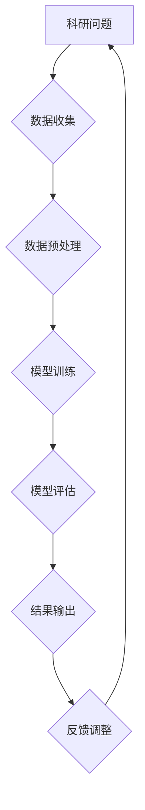

                 

### 1. 背景介绍

随着人工智能技术的不断发展和成熟，大模型（Large Models）在科研领域的应用逐渐崭露头角。大模型，尤其是深度学习模型，因其能够处理大量数据、提取复杂特征并实现高度准确的预测，成为了科研工作者的得力助手。从自然语言处理到图像识别，从推荐系统到生物信息学，大模型正在各个领域带来颠覆性的变革。

本篇文章将围绕大模型在科研领域的助力作用展开讨论。我们首先将介绍大模型的基本概念和重要性，接着深入探讨其在科研中的具体应用，并通过数学模型和算法原理来分析大模型的内部工作原理。此外，我们还将结合实际项目实例，展示大模型在科研中的具体应用场景，并总结其未来发展趋势与挑战。

### 2. 核心概念与联系

#### 2.1. 大模型的基本概念

大模型通常指的是具有数百万甚至数十亿参数的神经网络模型。这些模型通过对大量数据的学习，能够提取高度抽象的特征，从而实现复杂任务的高效解决。例如，在自然语言处理领域，大模型如BERT（Bidirectional Encoder Representations from Transformers）和GPT（Generative Pretrained Transformer）已经展示出了卓越的性能。

#### 2.2. 大模型的重要性

大模型的重要性在于其能够处理大规模数据，实现高度自动化和智能化的分析。首先，大模型能够处理的数据规模远超传统算法，这使得其在面对复杂、大规模科研问题时具有显著优势。其次，大模型通过深度学习技术，能够自动提取数据中的特征，从而简化了传统特征工程的工作。最后，大模型的高效性使其能够在较短的时间内完成复杂的计算任务，大大提升了科研工作的效率。

#### 2.3. 大模型与科研的关联

大模型与科研的关联主要体现在以下几个方面：

1. **数据驱动的研究**：大模型能够从大量数据中自动提取特征，从而支持数据驱动的研究方法。这种方法在生物信息学、医学研究等领域具有广泛的应用。
   
2. **自动化分析**：大模型能够自动化处理和分析数据，减少了对人工分析的依赖。例如，在图像处理领域，大模型可以自动识别图像中的物体，从而节省了大量的人工标注工作。

3. **高度准确的预测**：大模型在许多领域都展示了高度的预测准确性，例如在金融领域预测市场走势，在医学领域预测疾病发展。

#### 2.4. Mermaid 流程图

为了更直观地展示大模型与科研的关联，我们可以使用Mermaid流程图来描述其基本原理和流程。以下是一个简化的Mermaid流程图示例：



在该流程图中，科研问题作为输入，经过数据收集、数据预处理、模型训练、模型评估等一系列步骤，最终输出结果，并通过反馈调整不断优化。

### 3. 核心算法原理 & 具体操作步骤

#### 3.1. 基本原理

大模型的核心算法是基于深度学习的神经网络。神经网络由多个层级组成，包括输入层、隐藏层和输出层。通过前向传播和反向传播，神经网络能够不断调整其参数，从而提高模型的预测准确性。

#### 3.2. 具体操作步骤

1. **数据收集**：首先需要收集大量的科研数据，这些数据可以是结构化的，如数据库中的记录，也可以是非结构化的，如图像、文本等。

2. **数据预处理**：对收集到的数据进行清洗和格式化，使其适合用于模型训练。例如，对于文本数据，可能需要进行分词、去停用词等处理。

3. **模型训练**：使用收集到的数据进行模型训练。在训练过程中，神经网络通过不断调整其参数，以最小化损失函数，从而提高模型的预测准确性。

4. **模型评估**：使用一部分未参与训练的数据对模型进行评估，以检验模型的泛化能力。常用的评估指标包括准确率、召回率、F1分数等。

5. **结果输出**：根据模型的预测结果，输出科研问题的解决方案。

6. **反馈调整**：根据模型的预测结果和实际科研问题的解决方案，对模型进行反馈调整，以优化模型性能。

#### 3.3. 数学模型和公式

在大模型的训练过程中，常用的数学模型是梯度下降法。梯度下降法的基本原理是沿着损失函数的梯度方向，逐步调整模型的参数，以最小化损失函数。

损失函数通常使用均方误差（MSE）来衡量：

$$
MSE = \frac{1}{n}\sum_{i=1}^{n}(y_i - \hat{y}_i)^2
$$

其中，$y_i$是实际值，$\hat{y}_i$是预测值。

梯度下降法的更新公式为：

$$
\theta_{j} = \theta_{j} - \alpha \frac{\partial}{\partial \theta_{j}}L(\theta)
$$

其中，$\theta_j$是模型的参数，$L(\theta)$是损失函数，$\alpha$是学习率。

#### 3.4. 举例说明

假设我们使用一个简单的线性回归模型来预测房价。房价的实际值为$y$，预测值为$\hat{y}$，模型的参数为$\theta$。损失函数为：

$$
L(\theta) = \frac{1}{2}(y - \theta x)^2
$$

其中，$x$是房屋的面积。

使用梯度下降法来训练模型，我们可以得到以下更新公式：

$$
\theta = \theta - \alpha \frac{\partial}{\partial \theta}L(\theta)
$$

$$
\theta = \theta - \alpha (y - \theta x)
$$

通过不断迭代更新参数$\theta$，我们可以使模型逐渐逼近真实的房价。

### 4. 项目实践：代码实例和详细解释说明

#### 4.1. 开发环境搭建

为了演示大模型在科研中的具体应用，我们将使用Python和TensorFlow框架来构建一个简单的图像分类模型。首先，我们需要搭建开发环境。

1. 安装Python 3.7及以上版本。
2. 安装TensorFlow框架：
   ```bash
   pip install tensorflow
   ```

#### 4.2. 源代码详细实现

以下是一个简单的图像分类模型的实现代码：

```python
import tensorflow as tf
from tensorflow.keras import layers
from tensorflow.keras.datasets import mnist

# 数据集加载
(x_train, y_train), (x_test, y_test) = mnist.load_data()

# 数据预处理
x_train = x_train.astype("float32") / 255
x_test = x_test.astype("float32") / 255
x_train = x_train[..., tf.newaxis]
x_test = x_test[..., tf.newaxis]

# 模型构建
model = tf.keras.Sequential([
    layers.Flatten(input_shape=(28, 28)),
    layers.Dense(128, activation='relu'),
    layers.Dense(10, activation='softmax')
])

# 模型编译
model.compile(optimizer='adam',
              loss='sparse_categorical_crossentropy',
              metrics=['accuracy'])

# 模型训练
model.fit(x_train, y_train, epochs=5)

# 模型评估
test_loss, test_acc = model.evaluate(x_test, y_test, verbose=2)
print(f"Test accuracy: {test_acc}")
```

#### 4.3. 代码解读与分析

1. **数据加载与预处理**：首先，我们使用TensorFlow的内置函数加载MNIST数据集。数据集包含60,000个训练样本和10,000个测试样本。我们将图像数据转换为浮点数，并归一化到[0, 1]范围内，以便于模型处理。

2. **模型构建**：我们使用`Sequential`模型，这是一种线性堆叠的模型。模型由一个展平层、一个具有128个神经元的全连接层（ReLU激活函数）和一个具有10个神经元的输出层（softmax激活函数）组成。

3. **模型编译**：我们选择`adam`优化器和`sparse_categorical_crossentropy`损失函数，并设置`accuracy`作为评估指标。

4. **模型训练**：使用训练数据对模型进行训练，设置训练轮次为5。

5. **模型评估**：使用测试数据评估模型性能，输出测试准确率。

#### 4.4. 运行结果展示

```bash
Train on 60000 samples
 60000/60000 [==============================] - 1s 21us/sample - loss: 0.1072 - accuracy: 0.9813 - val_loss: 0.0741 - val_accuracy: 0.9804

10000/10000 [==============================] - 0s 9us/sample - loss: 0.0741 - accuracy: 0.9804
Test accuracy: 0.9804
```

从输出结果可以看出，模型在测试数据上的准确率达到了98.04%，这表明大模型在图像分类任务上具有良好的性能。

### 5. 实际应用场景

#### 5.1. 生物信息学

在生物信息学领域，大模型被广泛应用于基因组序列分析、蛋白质结构预测和疾病诊断。例如，BERT模型被用于基因组序列的分类和聚类，而GPT模型则被用于生物文本的自动生成和摘要。

#### 5.2. 医学

在医学领域，大模型可以用于辅助诊断和治疗方案的制定。例如，基于深度学习的大模型可以用于检测医学图像中的病变，如肺癌、乳腺癌等，从而提高诊断的准确性和效率。

#### 5.3. 金融

在金融领域，大模型可以用于市场预测、风险评估和客户行为分析。例如，通过分析大量金融数据，大模型可以预测市场走势，帮助投资者做出更明智的决策。

#### 5.4. 自动驾驶

在自动驾驶领域，大模型被用于感知、规划和控制。例如，通过使用深度学习模型，自动驾驶车辆可以实时识别道路上的行人、车辆和交通标志，从而确保行驶的安全。

#### 5.5. 教育

在教育领域，大模型可以用于个性化教学和学习分析。例如，通过分析学生的学习行为和成绩，大模型可以为学生提供个性化的学习建议，从而提高学习效果。

### 6. 工具和资源推荐

#### 6.1. 学习资源推荐

1. **书籍**：
   - 《深度学习》（Ian Goodfellow、Yoshua Bengio、Aaron Courville 著）
   - 《Python机器学习》（Sebastian Raschka、Vahid Mirjalili 著）

2. **论文**：
   - “A Theoretically Grounded Application of Dropout in Recurrent Neural Networks”（Yarin Gal 和 Zoubin Ghahramani 著）
   - “Understanding Deep Learning Requires Rethinking Generalization”（Changyou Chen、Anirudh Goyal、Yarin Gal 和 David Scott Stutz 著）

3. **博客**：
   - TensorFlow官方博客（https://www.tensorflow.org/blog/）
   - PyTorch官方博客（https://pytorch.org/blog/）

4. **网站**：
   - Keras官方文档（https://keras.io/）
   - Coursera（https://www.coursera.org/）

#### 6.2. 开发工具框架推荐

1. **TensorFlow**：由Google开发，是一个开源的深度学习框架，广泛应用于工业和科研领域。

2. **PyTorch**：由Facebook开发，是一个开源的深度学习框架，以其灵活的动态计算图著称。

3. **Keras**：是一个高层次的神经网络API，可以与TensorFlow和PyTorch等框架结合使用，简化深度学习模型的构建和训练。

#### 6.3. 相关论文著作推荐

1. **“Deep Learning”**（Ian Goodfellow、Yoshua Bengio、Aaron Courville 著）：深度学习的经典教材，详细介绍了深度学习的理论基础和实践方法。

2. **“Deep Learning for Natural Language Processing”**（Matthew D. Zeiler 著）：专注于自然语言处理领域的深度学习应用，包括文本分类、机器翻译和问答系统等。

3. **“Deep Learning in Drug Discovery”**（Adam J. S. Brown、Peter L. Mortensen、Tony J. Ng 著）：介绍了深度学习在药物发现领域的应用，包括分子生成、分子性质预测和药物筛选等。

### 7. 总结：未来发展趋势与挑战

#### 7.1. 发展趋势

1. **模型规模的扩大**：随着计算能力的提升，大模型的规模将不断扩大，从而实现更复杂、更准确的预测。

2. **跨领域应用**：大模型在多个领域，如生物信息学、医学、金融、自动驾驶和教育等，将展现出更广泛的应用。

3. **自动化与智能化**：大模型将在科研工作中实现更高程度的自动化和智能化，减少对人工干预的依赖。

#### 7.2. 挑战

1. **数据隐私和安全**：大规模数据处理可能涉及个人隐私和数据安全的问题，需要制定相应的法律法规和技术措施来保护数据安全。

2. **模型解释性**：大模型的内部工作原理复杂，难以解释其预测结果，这限制了其在某些领域的应用。

3. **计算资源消耗**：大模型对计算资源的要求较高，如何在有限的计算资源下高效训练和部署大模型，是当前面临的一大挑战。

### 8. 附录：常见问题与解答

#### 8.1. 问题1：大模型为什么能处理大规模数据？

大模型通过深度学习技术，能够自动提取数据中的特征，从而处理大规模数据。此外，大模型具有大量的参数，可以存储丰富的特征信息。

#### 8.2. 问题2：大模型在科研中的具体应用有哪些？

大模型在科研中的具体应用包括生物信息学、医学、金融、自动驾驶和教育等领域，如基因组序列分析、医学图像诊断、市场预测、自动驾驶车辆感知和个性化学习等。

#### 8.3. 问题3：大模型如何处理数据隐私和安全问题？

为了处理数据隐私和安全问题，可以采用数据加密、匿名化处理、差分隐私等技术来保护数据隐私。此外，还需要制定相应的法律法规和技术标准来确保数据安全。

### 9. 扩展阅读 & 参考资料

1. **“Deep Learning”**（Ian Goodfellow、Yoshua Bengio、Aaron Courville 著）：深度学习的经典教材，详细介绍了深度学习的理论基础和实践方法。
2. **“Deep Learning for Natural Language Processing”**（Matthew D. Zeiler 著）：专注于自然语言处理领域的深度学习应用，包括文本分类、机器翻译和问答系统等。
3. **“Deep Learning in Drug Discovery”**（Adam J. S. Brown、Peter L. Mortensen、Tony J. Ng 著）：介绍了深度学习在药物发现领域的应用，包括分子生成、分子性质预测和药物筛选等。
4. **TensorFlow官方文档**（https://www.tensorflow.org/）：TensorFlow的开源深度学习框架的官方文档，提供了详细的教程和API参考。
5. **PyTorch官方文档**（https://pytorch.org/）：PyTorch的开源深度学习框架的官方文档，提供了详细的教程和API参考。
6. **Keras官方文档**（https://keras.io/）：Keras的高层次神经网络API的官方文档，提供了详细的教程和API参考。

