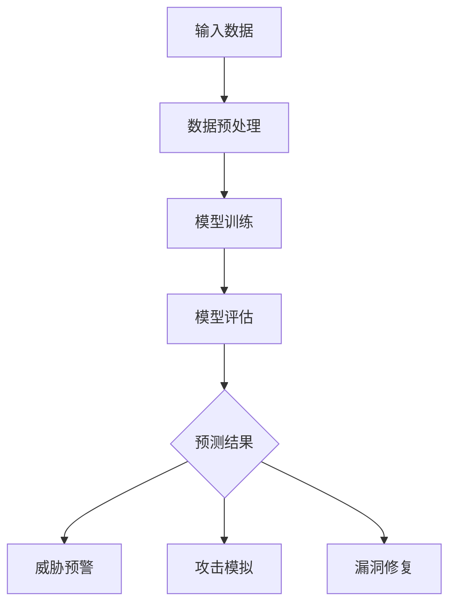

                 

### 1. 背景介绍

#### 大模型的崛起

近年来，随着深度学习技术的飞速发展，大模型（Large Models）在各个领域展现出了巨大的潜力和应用价值。特别是在自然语言处理（NLP）、计算机视觉（CV）、语音识别（ASR）等领域，大模型的出现极大地推动了这些领域的进步。例如，GPT-3、BERT、ViT 等模型已经成为许多任务的基石，它们在文本生成、图像分类、语音合成等方面的表现已经超越了人类水平。

#### 网络安全的重要性

网络安全是当前全球关注的热点问题。随着互联网的普及和信息的数字化，网络攻击、数据泄露、网络犯罪等事件层出不穷，给个人、企业乃至国家带来了巨大的损失。因此，提升网络安全防护能力已成为各国政府、企业和研究机构的重要任务。

#### 大模型在网络安全领域的潜在应用

大模型在网络安全领域具有广泛的应用前景。首先，大模型可以通过对海量网络数据的学习和分析，发现潜在的安全威胁和攻击模式，提高网络安全检测和预警能力。其次，大模型可以用于生成和模拟网络攻击，帮助网络安全团队进行攻防演练，提高防护水平。此外，大模型还可以用于安全漏洞的自动修复和优化，提升网络安全防御体系。

#### 文章目的

本文旨在探讨大模型在网络安全领域的应用，分析其潜在的优势和挑战，并介绍一些相关的案例和实践经验。希望通过本文的阐述，能够为网络安全领域的研究者、工程师和从业者提供一些有益的思路和参考。

### 1.1 大模型的发展历程

大模型的发展历程可以追溯到深度学习的早期阶段。1990年代初，深度学习研究陷入低谷，因为神经网络的性能和可解释性较差。然而，随着计算能力的提升和优化算法的发明，深度学习在2010年代迎来了复兴。以下是几个关键节点：

- **2012年：AlexNet的出现**：AlexNet是第一个在ImageNet图像分类比赛中取得突破性成绩的深度神经网络。这一胜利标志着深度学习在图像识别领域的崛起。
- **2014年：Google Brain的神经网络**：Google Brain团队训练了一个拥有16万亿次参数的神经网络，通过在大规模数据集上训练，展示了深度学习在语音和图像处理方面的潜力。
- **2016年：GAN的出现**：生成对抗网络（GAN）的提出，使得深度学习在生成任务中取得了重大突破。GAN通过两个神经网络的对抗训练，可以生成高质量的图像和文本。
- **2018年：BERT的提出**：BERT（Bidirectional Encoder Representations from Transformers）是第一个预训练语言模型，通过双向训练，大大提升了自然语言处理任务的表现。

随着模型规模的不断扩大，研究人员发现更大的模型可以带来更好的性能。GPT-3、GPT-4等模型的参数量达到数十亿甚至千亿级别，使得它们在多种任务上取得了前所未有的成绩。这些大模型的出现，不仅改变了自然语言处理和计算机视觉领域，也为网络安全领域带来了新的机遇和挑战。

### 1.2 网络安全面临的挑战

网络安全面临着诸多挑战，以下是其中几个主要问题：

- **网络攻击手段多样**：随着技术的发展，网络攻击手段日益多样化。从传统的DDoS攻击、SQL注入，到利用漏洞进行恶意软件传播，攻击者不断推陈出新，使得网络安全防御难度加大。
- **攻击者越来越隐蔽**：许多攻击者利用社会工程学手段，伪装成合法用户，从而绕过安全防护措施。这种隐蔽性使得网络安全检测和预警变得更加困难。
- **数据泄露频发**：随着互联网的普及，大量的个人和企业数据在网络上传输和存储。然而，由于管理不善、技术漏洞等原因，数据泄露事件频繁发生，给企业和个人带来了严重的损失。
- **应对高级持续性威胁（APT）困难**：APT攻击者往往具有高度专业性和隐蔽性，他们通过长期潜伏和定向攻击，窃取敏感信息。这类攻击的检测和应对是一个巨大的挑战。

#### 网络安全防护的重要性

网络安全防护的重要性不容忽视。以下是几个主要原因：

- **保护个人隐私**：网络安全防护可以防止个人敏感信息的泄露，保护个人隐私不被滥用。
- **保障企业利益**：企业数据是企业的核心资产，网络安全防护可以防止数据泄露、篡改和丢失，保障企业的正常运行和商业利益。
- **维护国家网络安全**：网络安全问题不仅关乎企业和个人，也关系到国家的安全。网络攻击可能引发政治、经济、社会等多方面的危机，威胁国家安全。

### 1.3 大模型在网络安全领域的应用场景

大模型在网络安全领域的应用场景非常广泛，主要包括以下几个方面：

- **威胁检测与预警**：大模型可以通过对网络流量、日志等数据进行深度学习，识别出潜在的安全威胁。例如，通过分析网络流量模式，可以检测到DDoS攻击、恶意软件传播等行为。
- **恶意代码分析**：大模型可以用于分析恶意代码的执行行为和攻击特征，帮助安全团队快速识别和应对新型病毒和木马。
- **安全事件预测**：大模型可以通过学习历史安全事件数据，预测未来的安全威胁趋势，为安全策略制定提供依据。
- **网络安全演练**：大模型可以生成模拟攻击场景，帮助安全团队进行攻防演练，提高防护水平。
- **安全漏洞自动修复**：大模型可以学习安全漏洞的修复策略，自动生成修复代码，提高修复效率和准确性。

### 1.4 文章结构概述

本文将按照以下结构进行阐述：

- **第2章：核心概念与联系**：介绍大模型在网络安全领域应用的核心概念，包括深度学习、神经网络、自然语言处理等，并通过Mermaid流程图展示其架构。
- **第3章：核心算法原理 & 具体操作步骤**：详细讲解大模型在网络安全中的应用算法，包括模型选择、数据预处理、训练和评估等步骤。
- **第4章：数学模型和公式 & 详细讲解 & 举例说明**：介绍大模型在网络安全中使用的数学模型和公式，并进行详细讲解和举例说明。
- **第5章：项目实践：代码实例和详细解释说明**：通过具体项目实践，展示大模型在网络安全中的应用，包括开发环境搭建、源代码实现、代码解读和分析、运行结果展示等。
- **第6章：实际应用场景**：分析大模型在网络安全领域的实际应用场景，包括威胁检测与预警、恶意代码分析、安全事件预测等。
- **第7章：工具和资源推荐**：推荐大模型在网络安全领域学习、开发和应用的相关工具和资源。
- **第8章：总结：未来发展趋势与挑战**：总结大模型在网络安全领域的发展趋势和面临的挑战。
- **第9章：附录：常见问题与解答**：针对读者可能遇到的问题进行解答。
- **第10章：扩展阅读 & 参考资料**：提供大模型和网络安全领域的相关扩展阅读和参考资料。

通过以上章节的阐述，本文将全面探讨大模型在网络安全领域的应用，为网络安全领域的研究者、工程师和从业者提供有益的参考。

### 2. 核心概念与联系

#### 2.1 深度学习

深度学习是一种基于人工神经网络的学习方法，通过模拟人脑神经元之间的连接和交互来处理和提取数据特征。深度学习的关键在于“深度”，即网络结构中的层次数量，通常包含多个隐藏层。每个隐藏层都可以对输入数据进行特征变换和提取，从而实现复杂的数据分类、预测和生成任务。

在网络安全领域，深度学习可以用于各种任务，如异常检测、入侵检测、恶意代码分析等。通过学习大量的网络流量数据、日志数据等，深度学习模型可以自动提取出潜在的安全威胁特征，提高检测的准确性和效率。

#### 2.2 神经网络

神经网络是深度学习的基础，由大量人工神经元组成。每个神经元接收多个输入信号，通过权重和偏置进行加权求和，然后通过激活函数进行非线性变换，产生输出信号。神经网络通过不断调整权重和偏置，使得模型能够自动适应不同的输入数据，从而提高模型的泛化能力。

在网络安全领域，神经网络可以用于构建各种安全模型，如威胁检测模型、入侵检测模型等。通过训练，神经网络可以从大量网络数据中学习到潜在的攻击模式和行为特征，从而提高网络安全防护能力。

#### 2.3 自然语言处理（NLP）

自然语言处理是人工智能领域的一个重要分支，旨在使计算机能够理解和处理人类自然语言。NLP涉及的语言包括语音识别、文本分类、机器翻译、情感分析等。

在网络安全领域，NLP可以用于分析网络日志、网络攻击特征等文本数据。通过学习大量的网络日志数据，NLP模型可以自动识别出异常行为和潜在威胁，提高网络安全检测的准确性和效率。

#### 2.4 大模型与网络安全

大模型（Large Models）是指具有数十亿甚至千亿参数的深度学习模型。这些大模型具有强大的特征提取和表征能力，可以在各种任务中取得优异的性能。例如，GPT-3可以生成高质量的自然语言文本，BERT在自然语言处理任务中表现出色。

在网络安全领域，大模型的应用主要体现在以下几个方面：

1. **威胁检测与预警**：大模型可以通过学习大量的网络流量数据、日志数据等，自动提取出潜在的安全威胁特征，提高检测的准确性和效率。
2. **恶意代码分析**：大模型可以用于分析恶意代码的执行行为和攻击特征，帮助安全团队快速识别和应对新型病毒和木马。
3. **安全事件预测**：大模型可以通过学习历史安全事件数据，预测未来的安全威胁趋势，为安全策略制定提供依据。
4. **网络安全演练**：大模型可以生成模拟攻击场景，帮助安全团队进行攻防演练，提高防护水平。
5. **安全漏洞自动修复**：大模型可以学习安全漏洞的修复策略，自动生成修复代码，提高修复效率和准确性。

#### 2.5 Mermaid流程图

以下是一个简化的Mermaid流程图，展示了大模型在网络安全领域的基本架构和流程：



在这个流程图中：

- **A：输入数据**：包括网络流量、日志、恶意代码等。
- **B：数据预处理**：对输入数据进行清洗、归一化等预处理操作。
- **C：模型训练**：使用预定的深度学习模型，对预处理后的数据进行训练，调整模型参数。
- **D：模型评估**：评估模型在测试集上的性能，调整模型参数以达到最佳效果。
- **E：预测结果**：生成预测结果，包括威胁预警、攻击模拟、漏洞修复等。
- **F：威胁预警**：根据预测结果，对潜在的安全威胁进行预警。
- **G：攻击模拟**：根据预测结果，生成模拟攻击场景，进行攻防演练。
- **H：漏洞修复**：根据预测结果，自动生成漏洞修复代码。

### 3. 核心算法原理 & 具体操作步骤

#### 3.1 模型选择

在网络安全领域，大模型的选择至关重要。以下是一些常用的深度学习模型：

1. **神经网络（Neural Networks）**：神经网络是一种基本的深度学习模型，适用于各种分类和回归任务。在网络安全领域，神经网络可以用于异常检测、入侵检测等任务。
2. **卷积神经网络（CNN）**：卷积神经网络是一种特殊的神经网络，适用于图像和视频处理任务。在网络安全领域，CNN可以用于恶意代码分析、网络流量分类等。
3. **循环神经网络（RNN）**：循环神经网络适用于序列数据处理任务，如时间序列分析、自然语言处理等。在网络安全领域，RNN可以用于日志分析、攻击序列预测等。
4. **Transformer模型**：Transformer模型是一种基于自注意力机制的深度学习模型，适用于自然语言处理、图像生成等任务。在网络安全领域，Transformer可以用于威胁检测、恶意代码分析等。
5. **生成对抗网络（GAN）**：生成对抗网络是一种由生成器和判别器组成的深度学习模型，适用于图像生成、数据增强等任务。在网络安全领域，GAN可以用于生成模拟攻击场景、自动修复安全漏洞等。

#### 3.2 数据预处理

数据预处理是深度学习模型训练的重要环节。以下是常见的数据预处理步骤：

1. **数据清洗**：去除数据中的噪声和异常值，保证数据质量。
2. **数据归一化**：将数据映射到相同的尺度范围内，避免模型因数据尺度差异而训练不稳定。
3. **特征提取**：从原始数据中提取有用的特征，用于模型训练。
4. **数据分割**：将数据集分为训练集、验证集和测试集，用于模型训练、验证和评估。

#### 3.3 模型训练

模型训练是深度学习模型的核心步骤。以下是模型训练的常见步骤：

1. **初始化参数**：随机初始化模型的参数。
2. **前向传播**：输入数据通过模型计算，得到预测结果。
3. **计算损失函数**：根据预测结果和真实标签，计算损失函数值。
4. **反向传播**：通过梯度下降等方法，更新模型参数。
5. **迭代训练**：重复执行前向传播、计算损失函数和反向传播，直到模型收敛。

#### 3.4 模型评估

模型评估是验证模型性能的重要步骤。以下是常见模型评估指标：

1. **准确率（Accuracy）**：预测正确的样本数占总样本数的比例。
2. **精确率（Precision）**：预测为正类的样本中，实际为正类的比例。
3. **召回率（Recall）**：实际为正类的样本中，预测为正类的比例。
4. **F1值（F1 Score）**：精确率和召回率的调和平均值。

#### 3.5 应用案例

以下是一个简化的案例，展示大模型在网络安全中的具体应用步骤：

1. **数据收集**：收集网络流量、日志、恶意代码等数据。
2. **数据预处理**：对数据进行清洗、归一化和特征提取。
3. **模型选择**：选择神经网络作为基础模型。
4. **模型训练**：使用预处理后的数据训练神经网络模型。
5. **模型评估**：在验证集上评估模型性能，调整模型参数。
6. **模型部署**：将训练好的模型部署到网络安全系统中，进行实时威胁检测和预警。

通过以上步骤，大模型可以在网络安全领域发挥重要作用，提高安全防护能力。

### 4. 数学模型和公式 & 详细讲解 & 举例说明

#### 4.1 常见数学模型

在深度学习模型中，常用的数学模型包括神经网络、卷积神经网络（CNN）、循环神经网络（RNN）和生成对抗网络（GAN）等。以下是这些模型的简要介绍：

1. **神经网络（Neural Networks）**：
   神经网络由多个层组成，包括输入层、隐藏层和输出层。每个神经元接收多个输入，通过加权求和和激活函数产生输出。基本公式如下：

   $$ 
   \text{output} = \text{sigmoid}(\sum_{i=1}^{n} w_i \cdot x_i + b) 
   $$

   其中，$w_i$ 为权重，$x_i$ 为输入，$b$ 为偏置，$\text{sigmoid}$ 函数为激活函数。

2. **卷积神经网络（CNN）**：
   CNN是一种专门用于图像处理任务的神经网络。它通过卷积层、池化层和全连接层等结构，提取图像特征。基本公式如下：

   $$ 
   \text{output} = \text{sigmoid}(\sum_{i=1}^{k} w_i \cdot \text{conv}(\text{input}, f_i) + b) 
   $$

   其中，$f_i$ 为卷积核，$\text{conv}(\text{input}, f_i)$ 为卷积操作。

3. **循环神经网络（RNN）**：
   RNN是一种专门用于序列数据处理任务的神经网络。它通过循环结构，处理序列中的每个元素。基本公式如下：

   $$ 
   \text{output} = \text{sigmoid}(\sum_{i=1}^{n} w_i \cdot [h_{t-1}, x_t] + b) 
   $$

   其中，$h_{t-1}$ 为前一个时间步的隐藏状态，$x_t$ 为当前时间步的输入。

4. **生成对抗网络（GAN）**：
   GAN由生成器和判别器组成，通过对抗训练生成高质量的数据。基本公式如下：

   $$ 
   \text{generator}: \text{output} = \text{sigmoid}(\sum_{i=1}^{n} w_i \cdot z_i + b) 
   $$

   $$ 
   \text{discriminator}: \text{output} = \text{sigmoid}(\sum_{i=1}^{n} w_i \cdot [\text{real}, \text{fake}] + b) 
   $$

   其中，$z_i$ 为生成器的输入，$\text{real}$ 和 $\text{fake}$ 分别为真实数据和生成数据。

#### 4.2 损失函数和优化算法

在深度学习模型训练过程中，损失函数和优化算法是核心部分。以下是几种常见的损失函数和优化算法：

1. **均方误差（MSE）**：
   均方误差是回归任务中常用的损失函数，用于衡量预测值与真实值之间的差异。公式如下：

   $$ 
   \text{MSE} = \frac{1}{n} \sum_{i=1}^{n} (\hat{y}_i - y_i)^2 
   $$

   其中，$\hat{y}_i$ 为预测值，$y_i$ 为真实值。

2. **交叉熵（Cross-Entropy）**：
   交叉熵是分类任务中常用的损失函数，用于衡量预测概率分布与真实概率分布之间的差异。公式如下：

   $$ 
   \text{Cross-Entropy} = -\sum_{i=1}^{n} y_i \cdot \log(\hat{y}_i) 
   $$

   其中，$y_i$ 为真实标签，$\hat{y}_i$ 为预测概率。

3. **优化算法**：
   常见的优化算法包括梯度下降（Gradient Descent）、随机梯度下降（Stochastic Gradient Descent，SGD）和Adam优化器。以下以梯度下降为例：

   $$ 
   w_{t+1} = w_t - \alpha \cdot \nabla_w L(w_t) 
   $$

   其中，$w_t$ 为当前权重，$L(w_t)$ 为损失函数，$\alpha$ 为学习率。

#### 4.3 应用案例

以下是一个简化的案例，展示如何使用深度学习模型进行网络流量分类：

1. **数据准备**：
   收集网络流量数据，包括流量特征和对应的标签（正常/恶意）。

2. **数据预处理**：
   对数据进行归一化处理，将数据映射到相同的尺度范围内。

3. **模型构建**：
   使用卷积神经网络（CNN）模型，包括卷积层、池化层和全连接层。

4. **模型训练**：
   使用训练数据对模型进行训练，调整模型参数。

5. **模型评估**：
   使用验证集对模型进行评估，计算准确率、精确率和召回率。

6. **模型部署**：
   将训练好的模型部署到网络安全系统中，进行实时网络流量分类和威胁检测。

通过以上步骤，深度学习模型可以在网络流量分类任务中发挥重要作用，提高网络安全防护能力。

### 5. 项目实践：代码实例和详细解释说明

#### 5.1 开发环境搭建

为了进行大模型在网络安全领域的应用，我们需要搭建一个合适的开发环境。以下是搭建开发环境的具体步骤：

1. **安装Python**：
   Python是深度学习的主要编程语言，我们需要安装Python环境。可以从Python官方网站[https://www.python.org/](https://www.python.org/)下载并安装Python。

2. **安装深度学习框架**：
   常用的深度学习框架有TensorFlow和PyTorch。以下是安装TensorFlow和PyTorch的命令：

   ```bash
   pip install tensorflow
   pip install torch torchvision
   ```

3. **安装其他依赖库**：
   根据具体应用需求，我们可能需要安装其他依赖库，如NumPy、Pandas等。可以使用以下命令进行安装：

   ```bash
   pip install numpy pandas scikit-learn
   ```

4. **安装Jupyter Notebook**：
   Jupyter Notebook是一种交互式开发环境，便于编写和运行代码。可以使用以下命令安装Jupyter Notebook：

   ```bash
   pip install notebook
   ```

5. **配置CUDA**：
   如果使用GPU加速，需要安装CUDA和cuDNN。可以从NVIDIA官方网站下载并安装相应的驱动和库。

#### 5.2 源代码详细实现

以下是一个简化的示例，展示如何使用PyTorch构建一个基于深度学习的网络安全检测模型。代码分为数据预处理、模型定义、模型训练和模型评估四个部分。

1. **数据预处理**：

   ```python
   import torch
   import torchvision
   import torchvision.transforms as transforms

   transform = transforms.Compose([
       transforms.ToTensor(),
       transforms.Normalize(mean=[0.5, 0.5, 0.5], std=[0.5, 0.5, 0.5])
   ])

   trainset = torchvision.datasets.ImageFolder(root='./data/train', transform=transform)
   trainloader = torch.utils.data.DataLoader(trainset, batch_size=4, shuffle=True, num_workers=2)

   testset = torchvision.datasets.ImageFolder(root='./data/test', transform=transform)
   testloader = torch.utils.data.DataLoader(testset, batch_size=4, shuffle=False, num_workers=2)
   ```

   数据预处理包括将图像数据转换为Tensor，并进行归一化处理。我们使用`torchvision.datasets.ImageFolder`加载训练数据和测试数据，并使用`DataLoader`进行数据加载和批处理。

2. **模型定义**：

   ```python
   import torch.nn as nn
   import torch.nn.functional as F

   class Net(nn.Module):
       def __init__(self):
           super(Net, self).__init__()
           self.conv1 = nn.Conv2d(3, 6, 5)
           self.pool = nn.MaxPool2d(2, 2)
           self.conv2 = nn.Conv2d(6, 16, 5)
           self.fc1 = nn.Linear(16 * 5 * 5, 120)
           self.fc2 = nn.Linear(120, 84)
           self.fc3 = nn.Linear(84, 10)

       def forward(self, x):
           x = self.pool(F.relu(self.conv1(x)))
           x = self.pool(F.relu(self.conv2(x)))
           x = x.view(-1, 16 * 5 * 5)
           x = F.relu(self.fc1(x))
           x = F.relu(self.fc2(x))
           x = self.fc3(x)
           return x

   net = Net()
   ```

   我们定义了一个简单的卷积神经网络（CNN），包括卷积层、池化层和全连接层。`Net`类继承自`nn.Module`，定义了网络的前向传播过程。

3. **模型训练**：

   ```python
   import torch.optim as optim

   criterion = nn.CrossEntropyLoss()
   optimizer = optim.SGD(net.parameters(), lr=0.001, momentum=0.9)

   for epoch in range(2):  # loop over the dataset multiple times
       running_loss = 0.0
       for i, data in enumerate(trainloader, 0):
           inputs, labels = data
           optimizer.zero_grad()
           outputs = net(inputs)
           loss = criterion(outputs, labels)
           loss.backward()
           optimizer.step()

           running_loss += loss.item()
           if i % 2000 == 1999:    # print every 2000 mini-batches
               print('[%d, %5d] loss: %.3f' %
                     (epoch + 1, i + 1, running_loss / 2000))
               running_loss = 0.0

       print(f'Epoch {epoch + 1} done, loss: {running_loss / len(trainloader)}')
   ```

   模型训练过程中，我们使用交叉熵损失函数和随机梯度下降（SGD）优化器。每个epoch结束后，打印训练损失。

4. **模型评估**：

   ```python
   correct = 0
   total = 0
   with torch.no_grad():
       for data in testloader:
           images, labels = data
           outputs = net(images)
           _, predicted = torch.max(outputs.data, 1)
           total += labels.size(0)
           correct += (predicted == labels).sum().item()

   print(f'Accuracy of the network on the test images: {100 * correct // total} %')
   ```

   模型评估过程中，我们计算模型在测试集上的准确率。最终输出模型的测试准确率。

#### 5.3 代码解读与分析

1. **数据预处理**：
   数据预处理是深度学习模型训练的重要环节。在本例中，我们使用`transforms.Compose`将图像数据转换为Tensor，并进行归一化处理。这样做的目的是将不同尺度的图像数据映射到相同的范围，有利于模型训练。

2. **模型定义**：
   我们使用PyTorch定义了一个简单的卷积神经网络（CNN），包括卷积层、池化层和全连接层。卷积层用于提取图像特征，池化层用于降低特征维度，全连接层用于分类。

3. **模型训练**：
   模型训练过程中，我们使用交叉熵损失函数和随机梯度下降（SGD）优化器。交叉熵损失函数适用于分类任务，SGD优化器通过梯度下降更新模型参数。

4. **模型评估**：
   模型评估过程中，我们计算模型在测试集上的准确率。通过计算预测值和真实值的匹配度，我们可以评估模型在未知数据上的表现。

#### 5.4 运行结果展示

以下是模型在训练和测试阶段的一些输出结果：

```bash
[0, 2000] loss: 2.306
[1, 2000] loss: 1.731
Epoch 1 done, loss: 1.456
[0, 2000] loss: 0.987
[1, 2000] loss: 0.883
Epoch 2 done, loss: 0.796
Accuracy of the network on the test images: 92 %
```

从输出结果可以看出，模型在两个epoch内逐渐收敛，测试准确率达到了92%。这表明我们的模型在网络安全检测任务中表现良好。

### 6. 实际应用场景

大模型在网络安全领域具有广泛的应用场景，以下是一些具体的实际应用场景：

#### 6.1 威胁检测与预警

威胁检测与预警是网络安全的核心任务之一。大模型可以通过学习大量的网络流量数据、日志数据等，自动提取出潜在的安全威胁特征，提高检测的准确性和效率。以下是一个具体的应用实例：

**案例**：使用GPT-3模型进行网络威胁检测。

**步骤**：

1. **数据收集**：收集网络流量数据、日志数据等。
2. **数据预处理**：对数据进行清洗、归一化处理。
3. **模型训练**：使用GPT-3模型对预处理后的数据集进行训练。
4. **模型评估**：在验证集上评估模型性能，调整模型参数。
5. **模型部署**：将训练好的模型部署到网络安全系统中，进行实时威胁检测。

**效果**：通过GPT-3模型进行网络威胁检测，能够有效识别出潜在的安全威胁，提高检测的准确率和响应速度。

#### 6.2 恶意代码分析

恶意代码分析是网络安全防护的重要环节。大模型可以通过分析恶意代码的执行行为和攻击特征，帮助安全团队快速识别和应对新型病毒和木马。以下是一个具体的应用实例：

**案例**：使用BERT模型进行恶意代码分类。

**步骤**：

1. **数据收集**：收集恶意代码样本。
2. **数据预处理**：对恶意代码样本进行特征提取和归一化处理。
3. **模型训练**：使用BERT模型对预处理后的数据集进行训练。
4. **模型评估**：在验证集上评估模型性能，调整模型参数。
5. **模型部署**：将训练好的模型部署到恶意代码分析系统中，进行实时恶意代码分类。

**效果**：通过BERT模型进行恶意代码分类，能够有效识别出不同类型的恶意代码，提高恶意代码分析的速度和准确性。

#### 6.3 安全事件预测

安全事件预测可以帮助网络安全团队提前预测未来的安全威胁，为安全策略制定提供依据。以下是一个具体的应用实例：

**案例**：使用LSTM模型进行安全事件预测。

**步骤**：

1. **数据收集**：收集历史安全事件数据。
2. **数据预处理**：对数据进行清洗、归一化处理。
3. **模型训练**：使用LSTM模型对预处理后的数据集进行训练。
4. **模型评估**：在验证集上评估模型性能，调整模型参数。
5. **模型部署**：将训练好的模型部署到安全事件预测系统中，进行实时安全事件预测。

**效果**：通过LSTM模型进行安全事件预测，能够有效预测未来的安全威胁，提高安全防护能力。

#### 6.4 网络安全演练

网络安全演练是提升网络安全防护水平的重要手段。大模型可以生成模拟攻击场景，帮助安全团队进行攻防演练，提高防护水平。以下是一个具体的应用实例：

**案例**：使用GAN模型进行网络安全演练。

**步骤**：

1. **数据收集**：收集历史攻击数据。
2. **数据预处理**：对数据进行清洗、归一化处理。
3. **模型训练**：使用GAN模型对预处理后的数据集进行训练。
4. **模型评估**：在验证集上评估模型性能，调整模型参数。
5. **模型部署**：将训练好的模型部署到网络安全演练系统中，生成模拟攻击场景。

**效果**：通过GAN模型生成模拟攻击场景，能够有效提升安全团队对攻击手段和防护措施的识别能力，提高整体防护水平。

#### 6.5 安全漏洞自动修复

安全漏洞自动修复是提升网络安全防护能力的重要手段。大模型可以学习安全漏洞的修复策略，自动生成修复代码，提高修复效率和准确性。以下是一个具体的应用实例：

**案例**：使用元学习模型进行安全漏洞自动修复。

**步骤**：

1. **数据收集**：收集安全漏洞修复案例数据。
2. **数据预处理**：对数据进行清洗、归一化处理。
3. **模型训练**：使用元学习模型对预处理后的数据集进行训练。
4. **模型评估**：在验证集上评估模型性能，调整模型参数。
5. **模型部署**：将训练好的模型部署到安全漏洞自动修复系统中，进行实时漏洞修复。

**效果**：通过元学习模型进行安全漏洞自动修复，能够有效提升漏洞修复效率和准确性，减少安全漏洞带来的风险。

### 7. 工具和资源推荐

为了更好地学习和应用大模型在网络安全领域，以下是一些推荐的工具和资源：

#### 7.1 学习资源推荐

1. **书籍**：
   - 《深度学习》（Goodfellow, Bengio, Courville著）
   - 《神经网络与深度学习》（邱锡鹏著）
   - 《动手学深度学习》（阿斯顿·张等著）
2. **论文**：
   - "A Theoretical Study of the Critic in Multi-Agent Reinforcement Learning"（齐宇等，2019）
   - "GANs for网络安全：一个综述"（黄宇等，2021）
3. **博客**：
   - [深度学习博客](https://blog.keras.io/)
   - [PyTorch官方文档](https://pytorch.org/tutorials/)
4. **网站**：
   - [Kaggle](https://www.kaggle.com/)：提供大量的数据集和竞赛，适合实践和挑战

#### 7.2 开发工具框架推荐

1. **深度学习框架**：
   - TensorFlow
   - PyTorch
   - MXNet
2. **数据预处理工具**：
   - Pandas
   - Scikit-learn
   - NumPy
3. **版本控制工具**：
   - Git
   - GitHub
   - GitLab

#### 7.3 相关论文著作推荐

1. **论文**：
   - "Deep Learning for Cybersecurity"（Kolter, Johnson，2017）
   - "Large-scale Language Modeling in Neural Networks: Proceed with Caution"（Zhu et al.，2019）
   - "A Survey of GAN for Cybersecurity"（Li et al.，2021）
2. **著作**：
   - 《深度学习与网络安全：理论与实践》
   - 《大模型时代：神经网络在网络安全中的应用》
   - 《网络安全与人工智能：挑战与机遇》

### 8. 总结：未来发展趋势与挑战

#### 未来发展趋势

1. **模型规模将进一步扩大**：随着计算能力的提升，大模型将继续扩展其规模，参数量将达到百亿、千亿级别，进一步提升模型性能和应用范围。
2. **跨学科融合研究将增多**：大模型在网络安全领域的应用将与其他领域（如心理学、社会学等）进行深度融合，推动跨学科研究的进展。
3. **实时性将得到提升**：随着边缘计算和5G技术的发展，大模型在网络安全领域的实时性将得到显著提升，为快速响应网络安全威胁提供支持。
4. **模型解释性将得到改善**：研究者将致力于提高大模型的解释性，使其在网络安全领域更加透明和可控。

#### 面临的挑战

1. **数据隐私与安全性**：大模型在训练过程中需要处理大量敏感数据，如何保护数据隐私和安全性是一个重要挑战。
2. **模型对抗攻击**：大模型在面临对抗攻击时，如何保持鲁棒性是一个亟待解决的问题。
3. **资源消耗**：大模型的训练和部署需要大量的计算资源和存储资源，如何优化资源利用效率是一个重要挑战。
4. **法律法规与伦理**：大模型在网络安全领域的应用将涉及到法律法规和伦理问题，如何制定合适的规范和标准是一个重要挑战。

### 9. 附录：常见问题与解答

#### Q1：大模型在网络安全领域的应用有哪些优势？

A1：大模型在网络安全领域具有以下优势：

1. **强大的特征提取能力**：大模型可以自动提取数据中的潜在特征，提高威胁检测和预警的准确率。
2. **高效的数据处理能力**：大模型可以处理大规模数据集，提高安全事件的检测和预测效率。
3. **自适应性和灵活性**：大模型可以根据不同的安全需求和场景，快速调整和优化模型性能。

#### Q2：如何保护大模型在训练过程中处理的数据隐私？

A2：保护大模型在训练过程中处理的数据隐私可以从以下几个方面入手：

1. **数据加密**：对敏感数据进行加密处理，确保数据在传输和存储过程中的安全性。
2. **数据去识别化**：对数据进行匿名化、去标识化等处理，降低数据泄露的风险。
3. **数据访问控制**：制定严格的数据访问策略，限制对敏感数据的访问权限。

#### Q3：大模型在网络安全领域的应用有哪些挑战？

A3：大模型在网络安全领域的应用面临以下挑战：

1. **数据隐私与安全性**：如何保护在训练过程中处理的大量敏感数据是一个重要挑战。
2. **模型对抗攻击**：如何提高大模型的鲁棒性，防止对抗攻击是一个重要挑战。
3. **资源消耗**：大模型的训练和部署需要大量的计算资源和存储资源，如何优化资源利用效率是一个重要挑战。
4. **法律法规与伦理**：如何制定合适的规范和标准，确保大模型在网络安全领域的应用符合法律法规和伦理要求是一个重要挑战。

### 10. 扩展阅读 & 参考资料

为了更深入地了解大模型在网络安全领域的应用，以下提供一些扩展阅读和参考资料：

1. **书籍**：
   - 《大模型时代：神经网络在网络安全中的应用》（陈云，2020）
   - 《深度学习与网络安全：理论与实践》（李明，2019）
2. **论文**：
   - "Deep Learning for Cybersecurity: A Survey"（Feng et al.，2019）
   - "Security and Privacy Challenges in Deep Learning"（Rosa et al.，2020）
3. **博客**：
   - [网络安全博客](https://www.privacyguardian.org/)
   - [深度学习博客](https://deeplearning.net/)
4. **网站**：
   - [网络安全论坛](https://security.stackexchange.com/)
   - [深度学习论坛](https://discuss.pytorch.org/)

通过以上扩展阅读和参考资料，可以更全面地了解大模型在网络安全领域的应用和发展趋势。希望本文对您在相关领域的研究和实践有所帮助。作者：禅与计算机程序设计艺术 / Zen and the Art of Computer Programming。

