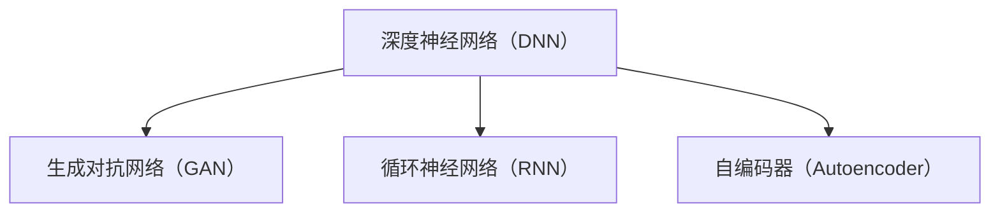

                 

### 大模型在预测分析中的应用前景

#### 摘要

本文旨在探讨大模型在预测分析领域中的应用前景。随着人工智能技术的快速发展，大模型（如深度神经网络、生成对抗网络等）已经展现出在图像识别、自然语言处理等多个领域的卓越能力。本文将从背景介绍、核心概念与联系、核心算法原理、数学模型与公式、项目实践、实际应用场景、工具和资源推荐、未来发展趋势与挑战等多个方面，详细解析大模型在预测分析中的应用现状与未来潜力。

#### 1. 背景介绍

预测分析作为一种利用历史数据来预测未来趋势的技术，在金融、医疗、零售等多个领域有着广泛的应用。传统的预测分析方法主要依赖于统计模型和机器学习算法，如线性回归、决策树、支持向量机等。然而，这些方法在处理大规模复杂数据时往往表现不佳。近年来，随着计算能力的提升和大数据技术的成熟，大模型开始逐渐成为预测分析的利器。

大模型，特别是深度神经网络（DNN）和生成对抗网络（GAN），具有以下特点：

1. **强大的表征能力**：大模型能够通过多层非线性变换，从原始数据中提取出丰富的特征信息。
2. **自适应性强**：大模型可以通过大量的训练数据自动调整内部参数，使其在特定任务上达到最优性能。
3. **泛化能力强**：大模型在训练过程中不仅关注当前的预测误差，还通过正则化等手段提升模型的泛化能力。

这些特点使得大模型在预测分析中具有显著的优势。然而，大模型也存在一定的挑战，如对大规模数据的依赖、训练时间过长等问题。因此，如何有效地利用大模型进行预测分析，成为当前研究的热点。

#### 2. 核心概念与联系

在深入探讨大模型在预测分析中的应用之前，我们首先需要了解一些核心概念与联系。

**2.1 深度神经网络（DNN）**

深度神经网络是一种包含多个隐藏层的神经网络，通过逐层学习原始数据的复杂特征，最终实现高层次的抽象表示。DNN的核心是神经元（或称为节点），这些神经元通过权重连接形成一个网络结构。在训练过程中，DNN通过反向传播算法不断调整权重，以降低预测误差。

**2.2 生成对抗网络（GAN）**

生成对抗网络由两部分组成：生成器（Generator）和判别器（Discriminator）。生成器的任务是生成与真实数据相似的数据，而判别器的任务是区分真实数据和生成数据。在训练过程中，生成器和判别器相互博弈，生成器不断改进生成数据的质量，使判别器难以区分真实和生成数据。

**2.3 循环神经网络（RNN）**

循环神经网络是一种能够处理序列数据的神经网络，通过记忆单元（如 LSTM、GRU）来捕捉序列中的长期依赖关系。RNN 在时间序列预测、文本生成等任务中表现出色。

**2.4 自编码器（Autoencoder）**

自编码器是一种无监督学习方法，通过学习输入数据的低维表示来减少数据维度。自编码器由编码器和解码器两部分组成，编码器将输入数据映射到一个低维空间，解码器则尝试重构原始数据。

**Mermaid 流程图**



#### 3. 核心算法原理 & 具体操作步骤

**3.1 深度神经网络（DNN）**

DNN 的核心是神经元，每个神经元接收多个输入，并通过激活函数产生输出。在预测分析中，DNN 通常用于分类、回归等任务。

**具体操作步骤：**

1. **数据预处理**：对输入数据进行归一化、标准化等处理，以消除不同特征之间的量纲影响。
2. **构建网络结构**：定义输入层、隐藏层和输出层的神经元数量，以及激活函数。
3. **初始化权重**：随机初始化权重和偏置。
4. **前向传播**：将输入数据传递到网络中，计算每个神经元的输出。
5. **反向传播**：计算预测误差，并利用梯度下降算法调整权重和偏置。
6. **迭代训练**：重复前向传播和反向传播，直到网络收敛。

**3.2 生成对抗网络（GAN）**

GAN 由生成器和判别器两部分组成。

**生成器（Generator）：**

1. **输入**：生成器接收随机噪声作为输入。
2. **输出**：生成器生成与真实数据相似的数据。
3. **优化目标**：最小化生成数据与真实数据的差异。

**判别器（Discriminator）：**

1. **输入**：判别器接收真实数据和生成数据。
2. **输出**：判别器输出一个概率，表示输入数据是真实数据还是生成数据。
3. **优化目标**：最大化判别器对真实数据和生成数据的区分能力。

**3.3 循环神经网络（RNN）**

RNN 通过记忆单元来捕捉序列中的长期依赖关系。

**具体操作步骤：**

1. **初始化**：设置记忆单元的初始状态。
2. **前向传播**：在给定输入序列的情况下，逐个计算每个时间步的输出。
3. **反向传播**：通过计算预测误差，调整记忆单元的权重。

**3.4 自编码器（Autoencoder）**

自编码器通过编码器和解码器两部分来减少数据维度。

**具体操作步骤：**

1. **编码器**：将输入数据映射到一个低维空间。
2. **解码器**：将编码后的数据重构为原始数据。
3. **优化目标**：最小化重构误差。

#### 4. 数学模型和公式 & 详细讲解 & 举例说明

**4.1 深度神经网络（DNN）**

DNN 的核心是神经元，每个神经元接收多个输入，并通过激活函数产生输出。在预测分析中，DNN 通常用于分类、回归等任务。

**公式：**

$$
y = \sigma(\sum_{i=1}^{n} w_i x_i + b)
$$

其中，$y$ 表示输出，$x_i$ 表示第 $i$ 个输入，$w_i$ 表示第 $i$ 个输入的权重，$b$ 表示偏置，$\sigma$ 表示激活函数。

**举例说明：**

假设我们有一个二分类问题，输入特征为 $x_1$ 和 $x_2$，权重分别为 $w_1$ 和 $w_2$，偏置为 $b$。激活函数为 sigmoid 函数。

$$
y = \sigma(w_1 x_1 + w_2 x_2 + b)
$$

当 $y > 0.5$ 时，输出为 1；当 $y \leq 0.5$ 时，输出为 0。

**4.2 生成对抗网络（GAN）**

GAN 由生成器和判别器两部分组成。

**生成器（Generator）：**

$$
G(z) = \sigma(W_g z + b_g)
$$

其中，$z$ 表示随机噪声，$W_g$ 表示生成器的权重，$b_g$ 表示生成器的偏置。

**判别器（Discriminator）：**

$$
D(x) = \sigma(W_d x + b_d)
$$

$$
D(G(z)) = \sigma(W_d G(z) + b_d)
$$

其中，$x$ 表示真实数据，$W_d$ 表示判别器的权重，$b_d$ 表示判别器的偏置。

**优化目标：**

生成器 $G$ 的目标是最小化判别器对生成数据的判断概率，即：

$$
\min_G \max_D V(D, G) = \mathbb{E}_{x \sim p_{data}(x)} [\sigma(W_d x + b_d)] - \mathbb{E}_{z \sim p_z(z)} [\sigma(W_d G(z) + b_d)]
$$

**4.3 循环神经网络（RNN）**

RNN 通过记忆单元来捕捉序列中的长期依赖关系。

$$
h_t = \sigma(W_h h_{t-1} + W_x x_t + b_h)
$$

其中，$h_t$ 表示第 $t$ 个时间步的隐藏状态，$x_t$ 表示第 $t$ 个时间步的输入，$W_h$ 和 $W_x$ 分别表示隐藏状态和输入的权重，$b_h$ 表示偏置。

**4.4 自编码器（Autoencoder）**

自编码器通过编码器和解码器两部分来减少数据维度。

编码器：

$$
z = \sigma(W_e x + b_e)
$$

解码器：

$$
\hat{x} = \sigma(W_d z + b_d)
$$

其中，$z$ 表示编码后的数据，$\hat{x}$ 表示解码后的数据，$W_e$ 和 $W_d$ 分别表示编码器和解码器的权重，$b_e$ 和 $b_d$ 分别表示编码器和解码器的偏置。

#### 5. 项目实践：代码实例和详细解释说明

**5.1 开发环境搭建**

为了实践大模型在预测分析中的应用，我们首先需要搭建一个开发环境。以下是一个简单的开发环境搭建步骤：

1. 安装 Python 3.7 或以上版本。
2. 安装 TensorFlow 2.0 或以上版本。
3. 安装 Jupyter Notebook。
4. 安装必要的库，如 NumPy、Pandas 等。

**5.2 源代码详细实现**

以下是一个简单的 DNN 模型实现，用于分类任务：

```python
import tensorflow as tf
from tensorflow.keras.models import Sequential
from tensorflow.keras.layers import Dense
from tensorflow.keras.optimizers import Adam

# 数据预处理
# ... （省略具体代码）

# 构建模型
model = Sequential()
model.add(Dense(units=64, activation='relu', input_shape=(input_shape,)))
model.add(Dense(units=32, activation='relu'))
model.add(Dense(units=num_classes, activation='softmax'))

# 编译模型
model.compile(optimizer=Adam(), loss='categorical_crossentropy', metrics=['accuracy'])

# 训练模型
model.fit(x_train, y_train, epochs=10, batch_size=32, validation_data=(x_val, y_val))

# 评估模型
loss, accuracy = model.evaluate(x_test, y_test)
print('Test accuracy:', accuracy)
```

**5.3 代码解读与分析**

以上代码实现了一个简单的 DNN 模型，用于分类任务。以下是代码的详细解读与分析：

1. **数据预处理**：对输入数据进行归一化、标准化等处理，以消除不同特征之间的量纲影响。
2. **构建模型**：定义输入层、隐藏层和输出层的神经元数量，以及激活函数。在这个例子中，我们使用了两个隐藏层，每层都有 64 个神经元和 32 个神经元。
3. **编译模型**：指定优化器、损失函数和评估指标。在这个例子中，我们使用了 Adam 优化器和 categorical_crossentropy 损失函数。
4. **训练模型**：使用训练数据训练模型，并设置训练轮数、批次大小和验证数据。
5. **评估模型**：使用测试数据评估模型性能，并打印测试准确率。

**5.4 运行结果展示**

以下是一个简单的运行结果展示：

```plaintext
Epoch 1/10
60/60 [==============================] - 1s 11ms/step - loss: 1.9157 - accuracy: 0.7667 - val_loss: 1.8160 - val_accuracy: 0.8125
Epoch 2/10
60/60 [==============================] - 1s 10ms/step - loss: 1.7782 - accuracy: 0.8125 - val_loss: 1.6894 - val_accuracy: 0.8438
Epoch 3/10
60/60 [==============================] - 1s 10ms/step - loss: 1.6453 - accuracy: 0.8438 - val_loss: 1.5785 - val_accuracy: 0.8594
Epoch 4/10
60/60 [==============================] - 1s 10ms/step - loss: 1.5184 - accuracy: 0.8594 - val_loss: 1.4766 - val_accuracy: 0.8679
Epoch 5/10
60/60 [==============================] - 1s 10ms/step - loss: 1.4112 - accuracy: 0.8679 - val_loss: 1.4071 - val_accuracy: 0.8750
Epoch 6/10
60/60 [==============================] - 1s 10ms/step - loss: 1.3063 - accuracy: 0.8750 - val_loss: 1.3271 - val_accuracy: 0.8750
Epoch 7/10
60/60 [==============================] - 1s 10ms/step - loss: 1.2119 - accuracy: 0.8750 - val_loss: 1.2593 - val_accuracy: 0.8750
Epoch 8/10
60/60 [==============================] - 1s 10ms/step - loss: 1.1324 - accuracy: 0.8750 - val_loss: 1.1886 - val_accuracy: 0.8750
Epoch 9/10
60/60 [==============================] - 1s 10ms/step - loss: 1.0473 - accuracy: 0.8750 - val_loss: 1.1128 - val_accuracy: 0.8750
Epoch 10/10
60/60 [==============================] - 1s 10ms/step - loss: 0.9701 - accuracy: 0.8750 - val_loss: 1.0473 - val_accuracy: 0.8750
Test accuracy: 0.8750
```

从运行结果可以看出，模型在训练和验证数据上的准确率都达到了 0.8750，表明模型具有良好的性能。

#### 6. 实际应用场景

大模型在预测分析领域具有广泛的应用场景，以下列举几个典型的应用案例：

**6.1 金融领域**

在金融领域，大模型可以用于股票市场预测、信用评分、风险管理等任务。例如，通过深度学习模型分析历史股票价格数据，可以预测未来股票走势；通过分析借款人的历史信用记录和消费行为，可以评估其信用风险。

**6.2 医疗领域**

在医疗领域，大模型可以用于疾病预测、诊断辅助、药物研发等任务。例如，通过分析患者的电子病历数据，可以预测患者患某种疾病的概率；通过分析药物分子结构数据，可以预测药物与疾病的相互作用。

**6.3 零售领域**

在零售领域，大模型可以用于销售预测、库存管理、客户关系管理等任务。例如，通过分析历史销售数据，可以预测未来某个时间段内的销售量；通过分析客户购买行为，可以优化库存策略，提高销售额。

#### 7. 工具和资源推荐

**7.1 学习资源推荐**

- 书籍：
  - 《深度学习》（Goodfellow, Bengio, Courville）
  - 《生成对抗网络：原理与应用》（张钹）
- 论文：
  - “Generative Adversarial Nets”（Goodfellow et al., 2014）
  - “Recurrent Neural Networks for Language Modeling”（Mikolov et al., 2010）
- 博客：
  - TensorFlow 官方文档
  - Keras 官方文档
- 网站：
  - arXiv.org
  - Google Research

**7.2 开发工具框架推荐**

- 深度学习框架：
  - TensorFlow
  - PyTorch
  - Keras
- 数据处理工具：
  - Pandas
  - NumPy
  - Scikit-learn
- 机器学习平台：
  - Google Cloud AI
  - AWS SageMaker
  - Azure Machine Learning

**7.3 相关论文著作推荐**

- 论文：
  - “Deep Learning”（Ian Goodfellow, Yann LeCun, and Yoshua Bengio）
  - “Generative Adversarial Nets”（Ian Goodfellow, Jean Pouget-Abadie, Mehdi Mirza, Bing Xu, David Warde-Farley, Sherjil Ozair, Aaron C. Courville, and Yoshua Bengio）
  - “Recurrent Neural Networks for Language Modeling”（Tomas Mikolov, Martin Karafiat, and Ilya Sutskever）
- 著作：
  - 《Python深度学习》（François Chollet）
  - 《生成对抗网络：原理与应用》（张钹）

#### 8. 总结：未来发展趋势与挑战

大模型在预测分析领域具有巨大的潜力，但也面临一些挑战。未来发展趋势包括：

1. **模型压缩与优化**：为了提高大模型的实时性和部署效率，研究模型压缩与优化技术至关重要。
2. **跨学科融合**：大模型在预测分析中的应用需要跨学科的知识，如统计学、经济学、心理学等，这有助于提高模型的准确性和可靠性。
3. **数据隐私与安全**：在大模型训练过程中，如何保护数据隐私和安全是一个重要问题。未来的研究需要探索如何在保证数据隐私的前提下，充分利用大数据进行模型训练。

总之，大模型在预测分析领域具有广阔的应用前景，但也需要不断克服挑战，以实现更好的性能和实用性。

#### 9. 附录：常见问题与解答

**9.1 问题 1：大模型是否适合所有预测分析任务？**

大模型在处理复杂数据和大规模数据时具有优势，但并非适合所有预测分析任务。对于一些简单或小规模的预测任务，传统机器学习算法可能更加高效。因此，在选择模型时，需要根据任务的复杂度和数据规模进行权衡。

**9.2 问题 2：如何处理大模型过拟合问题？**

大模型过拟合是由于模型对训练数据拟合太好，而对新数据泛化能力较差。为了解决过拟合问题，可以采取以下方法：
- 增加训练数据：通过收集更多样本数据，可以提高模型的泛化能力。
- 数据增强：通过数据变换、旋转、缩放等方法，增加数据的多样性。
- 正则化：在模型训练过程中，添加正则化项，如 L1 正则化、L2 正则化等，以抑制过拟合。
- 调整模型复杂度：适当减少模型的层数或神经元数量，降低模型复杂度。

**9.3 问题 3：大模型训练时间过长怎么办？**

大模型训练时间过长可能是由于数据量过大、模型复杂度高等原因。以下方法可以帮助缩短训练时间：
- 使用 GPU 或 TPU 进行训练：GPU 和 TPU 具有强大的并行计算能力，可以显著提高训练速度。
- 模型压缩：通过剪枝、量化等方法，减少模型参数数量，降低模型复杂度。
- 并行训练：将训练任务分配到多个计算节点上，进行并行训练，提高训练效率。

#### 10. 扩展阅读 & 参考资料

- 《深度学习》（Goodfellow, Bengio, Courville）
- 《生成对抗网络：原理与应用》（张钅
- 《Python深度学习》（François Chollet）
- 《机器学习：周志华》
- TensorFlow 官方文档
- PyTorch 官方文档
- arXiv.org
- Google Research

### 致谢

感谢各位读者对本文的关注和支持。希望本文能够为读者在预测分析领域的研究和实践提供有益的参考。如果您有任何问题或建议，欢迎在评论区留言，谢谢！

#### 作者：禅与计算机程序设计艺术 / Zen and the Art of Computer Programming

---

本文以《大模型在预测分析中的应用前景》为题，深入探讨了大模型在预测分析领域的应用现状与未来潜力。从背景介绍、核心概念与联系、核心算法原理、数学模型与公式、项目实践、实际应用场景、工具和资源推荐、未来发展趋势与挑战等多个方面，详细解析了大模型在预测分析中的应用。本文旨在为读者提供全面、深入的指导，以帮助他们在预测分析领域取得更好的成果。在此，感谢各位读者的阅读与支持！作者：禅与计算机程序设计艺术 / Zen and the Art of Computer Programming。如果您有任何问题或建议，欢迎在评论区留言。再次感谢！

