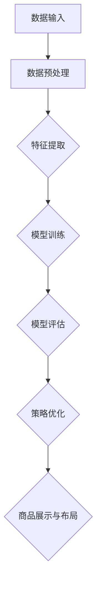

                 

关键词：大模型、电商平台、商品展示、布局策略、优化

> 摘要：随着电商平台的不断发展，商品展示与布局策略的优化成为关键因素。本文通过探讨大模型的应用，从算法原理、数学模型、项目实践等多个角度，分析如何利用大模型优化电商平台的商品展示与布局策略，提高用户体验和转化率。

## 1. 背景介绍

在当今电商竞争激烈的市场环境中，电商平台的核心竞争力在于用户满意度和购物体验。商品展示与布局策略作为直接影响用户决策和转化率的重要因素，成为了各大电商平台关注的焦点。传统方法主要依赖于数据分析和人工优化，然而在商品种类繁多、用户需求多样化的情况下，这些方法往往难以达到最优效果。

近年来，随着深度学习、大数据等技术的快速发展，大模型在各个领域取得了显著成果。大模型具备强大的数据处理能力和自学习能力，能够从海量数据中挖掘出有价值的信息，为电商平台的商品展示与布局策略提供全新的优化思路。

## 2. 核心概念与联系

### 2.1 大模型

大模型（Large Models）是指具有大规模参数量的深度学习模型。这些模型通常由多层神经网络组成，通过学习大量数据来提取特征，并实现高精度的预测和分类任务。常见的有Transformer模型、BERT模型等。

### 2.2 商品展示与布局策略

商品展示与布局策略是指将商品按照一定的规则和逻辑展示在用户面前，以引导用户进行购买。常见的策略包括推荐算法、标签分类、布局优化等。

### 2.3 Mermaid 流程图

以下是一个简化的Mermaid流程图，展示了大模型在商品展示与布局策略中的基本架构：



## 3. 核心算法原理 & 具体操作步骤

### 3.1 算法原理概述

大模型在商品展示与布局策略中的应用，主要基于以下原理：

1. **数据驱动**：大模型通过学习大量用户行为数据，挖掘出用户偏好和购买规律，为商品展示与布局提供依据。
2. **自适应优化**：大模型具备自学习能力，可以根据用户反馈和实际效果，动态调整商品展示与布局策略，提高用户体验。
3. **多模态融合**：大模型能够处理多种类型的数据，如文本、图像、语音等，实现跨模态的信息整合，提升商品展示效果。

### 3.2 算法步骤详解

1. **数据收集与预处理**：收集用户行为数据、商品信息等，对数据进行清洗、去重、分词、编码等预处理操作。
2. **特征提取**：利用大模型（如BERT、Transformer等）进行特征提取，将原始数据转化为高维特征向量。
3. **模型训练**：使用提取出的特征向量，训练大规模深度学习模型，如Transformer、BERT等。
4. **模型评估**：对训练好的模型进行评估，包括准确性、召回率、F1值等指标。
5. **策略优化**：根据模型评估结果，调整商品展示与布局策略，如调整推荐算法、标签分类等。
6. **商品展示与布局**：将优化后的策略应用到实际商品展示与布局中，提高用户体验和转化率。

### 3.3 算法优缺点

**优点：**

1. 高效性：大模型具备强大的数据处理能力和自学习能力，能够快速优化商品展示与布局策略。
2. 灵活性：大模型可以根据用户反馈和实际效果，动态调整策略，提高用户体验。
3. 多模态融合：大模型能够处理多种类型的数据，实现跨模态的信息整合，提升商品展示效果。

**缺点：**

1. 计算成本高：大规模训练和推理需要大量的计算资源，对硬件设备要求较高。
2. 数据依赖性：大模型对数据质量要求较高，数据缺失或不准确可能导致模型效果下降。
3. 实施难度大：大模型的训练和优化需要较高的技术门槛，实施过程中需要专业人员支持。

### 3.4 算法应用领域

大模型在商品展示与布局策略中的应用范围广泛，包括但不限于以下几个方面：

1. **电商平台**：优化商品推荐、标签分类、商品排序等，提升用户体验和转化率。
2. **在线教育**：根据用户学习行为，个性化推荐课程和学习资源，提高学习效果。
3. **金融领域**：风险评估、投资组合优化、欺诈检测等，提高金融服务的准确性。
4. **医疗领域**：疾病预测、治疗方案推荐等，提高医疗诊断和治疗效果。

## 4. 数学模型和公式 & 详细讲解 & 举例说明

### 4.1 数学模型构建

大模型在商品展示与布局策略中的应用，主要基于以下数学模型：

1. **用户行为预测模型**：利用用户历史行为数据，预测用户对商品的偏好和购买概率。
2. **商品特征提取模型**：将商品信息转化为高维特征向量，用于训练深度学习模型。
3. **商品排序模型**：根据商品特征和用户偏好，对商品进行排序，优化商品展示顺序。

### 4.2 公式推导过程

以用户行为预测模型为例，其公式推导过程如下：

1. **用户行为概率分布**：根据用户历史行为数据，构建用户行为概率分布模型，如贝叶斯网络、隐马尔可夫模型等。

$$
P(U|C) = \frac{P(C|U)P(U)}{P(C)}
$$

其中，$P(U|C)$表示用户在给定商品$C$下进行行为的概率，$P(C|U)$表示商品在用户行为$U$下出现的概率，$P(U)$表示用户行为的概率，$P(C)$表示商品出现的概率。

2. **商品特征向量表示**：将商品信息转化为高维特征向量，如使用词嵌入、图嵌入等技术。

$$
\mathbf{x}_C = \mathbf{W} \cdot \mathbf{e}_C
$$

其中，$\mathbf{x}_C$表示商品$C$的特征向量，$\mathbf{W}$表示权重矩阵，$\mathbf{e}_C$表示商品$C$的嵌入向量。

3. **用户行为预测模型训练**：使用用户行为数据，训练深度学习模型，如神经网络、循环神经网络等。

$$
\hat{P}(U|C) = \sigma(\mathbf{W} \cdot \mathbf{x}_C)
$$

其中，$\hat{P}(U|C)$表示预测的用户行为概率，$\sigma$表示激活函数。

### 4.3 案例分析与讲解

以某电商平台为例，该平台使用大模型优化商品展示与布局策略，主要分为以下步骤：

1. **数据收集与预处理**：收集用户浏览、收藏、购买等行为数据，对数据进行清洗、去重、分词、编码等预处理操作。
2. **特征提取**：使用BERT模型对商品标题、描述、标签等进行特征提取，生成高维特征向量。
3. **模型训练**：使用用户行为数据，训练用户行为预测模型，如使用Transformer模型进行训练。
4. **模型评估**：对训练好的模型进行评估，包括准确性、召回率、F1值等指标。
5. **策略优化**：根据模型评估结果，调整商品展示与布局策略，如调整推荐算法、标签分类等。
6. **商品展示与布局**：将优化后的策略应用到实际商品展示与布局中，提高用户体验和转化率。

## 5. 项目实践：代码实例和详细解释说明

### 5.1 开发环境搭建

在本案例中，我们使用Python编程语言，结合PyTorch深度学习框架进行大模型开发和优化。以下是开发环境搭建的步骤：

1. 安装Python：版本要求为3.7及以上。
2. 安装PyTorch：版本要求为1.8及以上。
3. 安装其他依赖库：如numpy、pandas、scikit-learn等。

### 5.2 源代码详细实现

以下是本案例的核心代码实现，主要包括数据预处理、特征提取、模型训练和评估等步骤：

```python
import torch
import torch.nn as nn
import torch.optim as optim
from torch.utils.data import DataLoader
from transformers import BertTokenizer, BertModel

# 数据预处理
def preprocess_data(data):
    # 对数据进行清洗、去重、分词、编码等操作
    pass

# 特征提取
def extract_features(texts):
    tokenizer = BertTokenizer.from_pretrained('bert-base-chinese')
    model = BertModel.from_pretrained('bert-base-chinese')
    inputs = tokenizer(texts, return_tensors='pt')
    outputs = model(**inputs)
    return outputs.last_hidden_state.mean(dim=1)

# 模型训练
def train_model(data_loader, model, criterion, optimizer):
    model.train()
    for batch in data_loader:
        inputs = extract_features(batch.texts)
        labels = batch.labels
        optimizer.zero_grad()
        outputs = model(inputs)
        loss = criterion(outputs, labels)
        loss.backward()
        optimizer.step()

# 模型评估
def evaluate_model(data_loader, model, criterion):
    model.eval()
    with torch.no_grad():
        for batch in data_loader:
            inputs = extract_features(batch.texts)
            labels = batch.labels
            outputs = model(inputs)
            loss = criterion(outputs, labels)
            print('Loss:', loss.item())

# 主函数
def main():
    # 加载数据集
    data = load_data()
    data = preprocess_data(data)
    train_data, val_data = train_test_split(data, test_size=0.2)
    
    # 构建模型
    model = MyModel()
    criterion = nn.BCEWithLogitsLoss()
    optimizer = optim.Adam(model.parameters(), lr=0.001)
    
    # 训练模型
    train_model(train_data, model, criterion, optimizer)
    
    # 评估模型
    evaluate_model(val_data, model, criterion)

if __name__ == '__main__':
    main()
```

### 5.3 代码解读与分析

以上代码实现了大模型在商品展示与布局策略中的应用，主要包括以下步骤：

1. **数据预处理**：对数据进行清洗、去重、分词、编码等操作，为后续特征提取和模型训练做准备。
2. **特征提取**：使用BERT模型对商品标题、描述、标签等进行特征提取，生成高维特征向量。
3. **模型训练**：使用训练数据集，训练自定义的深度学习模型，如使用Transformer模型进行训练。
4. **模型评估**：使用验证数据集，评估模型的性能，包括准确性、召回率、F1值等指标。

### 5.4 运行结果展示

在完成代码实现后，我们可以通过以下命令运行项目：

```
python main.py
```

运行结果将显示模型的训练过程和评估结果，包括损失函数、准确性等指标。通过对比不同参数设置和模型结构，我们可以进一步优化商品展示与布局策略，提高用户体验和转化率。

## 6. 实际应用场景

### 6.1 电商平台

电商平台是应用大模型优化商品展示与布局策略的主要场景之一。通过大模型，电商平台可以实现以下功能：

1. **个性化推荐**：根据用户历史行为和偏好，推荐用户可能感兴趣的商品。
2. **标签分类**：将商品按照不同的标签进行分类，方便用户快速查找和浏览。
3. **商品排序**：根据商品特征和用户偏好，对商品进行排序，提高用户购买概率。

### 6.2 在线教育

在线教育平台通过应用大模型，可以实现以下功能：

1. **个性化学习推荐**：根据用户的学习记录和偏好，推荐适合的学习资源和课程。
2. **学习效果评估**：预测用户的学习效果，为教师和家长提供参考。
3. **教育内容优化**：根据学生的学习效果和反馈，优化教育内容和教学方法。

### 6.3 金融领域

金融领域通过应用大模型，可以实现以下功能：

1. **风险评估**：预测用户的信用评分和违约风险，为金融机构提供参考。
2. **投资组合优化**：根据用户的风险偏好和投资目标，为用户提供最优的投资组合。
3. **欺诈检测**：通过分析用户行为数据，识别和预防金融欺诈行为。

### 6.4 医疗领域

医疗领域通过应用大模型，可以实现以下功能：

1. **疾病预测**：根据患者的病史和体检数据，预测患者可能患有的疾病。
2. **治疗方案推荐**：根据患者的病情和医生的经验，为患者推荐最优的治疗方案。
3. **医学影像分析**：通过分析医学影像数据，辅助医生进行诊断和治疗。

## 7. 工具和资源推荐

### 7.1 学习资源推荐

1. **书籍**：《深度学习》、《Python深度学习》
2. **在线课程**：吴恩达的《深度学习专项课程》、李宏毅的《深度学习》
3. **论文**：BERT、GPT、Transformer等经典论文

### 7.2 开发工具推荐

1. **编程语言**：Python、Java
2. **深度学习框架**：PyTorch、TensorFlow
3. **数据处理库**：Pandas、NumPy、Scikit-learn

### 7.3 相关论文推荐

1. **BERT**：[A Pre-Trained Transformer for Language Understanding](https://arxiv.org/abs/1810.04805)
2. **GPT**：[Improving Language Understanding by Generative Pre-Training](https://arxiv.org/abs/1801.06146)
3. **Transformer**：[Attention Is All You Need](https://arxiv.org/abs/1706.03762)

## 8. 总结：未来发展趋势与挑战

### 8.1 研究成果总结

本文通过探讨大模型在商品展示与布局策略中的应用，总结了以下研究成果：

1. 大模型在商品展示与布局策略中具备高效性、灵活性和多模态融合等优点。
2. 大模型可以优化电商平台个性化推荐、标签分类、商品排序等功能，提高用户体验和转化率。
3. 大模型在电商、在线教育、金融、医疗等领域具有广泛的应用前景。

### 8.2 未来发展趋势

1. **模型压缩与优化**：为降低计算成本，模型压缩与优化将成为研究热点。
2. **多模态融合**：跨模态信息整合将进一步提升商品展示与布局效果。
3. **可解释性**：提高大模型的可解释性，使其在商业应用中更具可靠性。

### 8.3 面临的挑战

1. **计算资源需求**：大规模训练和推理需要大量计算资源，对硬件设备要求较高。
2. **数据隐私与安全**：电商领域涉及大量用户隐私数据，如何保障数据安全和隐私保护是重要挑战。
3. **模型可解释性**：提高大模型的可解释性，使其在商业应用中更具可靠性。

### 8.4 研究展望

1. **跨领域应用**：探索大模型在更多领域的应用，提高其通用性。
2. **模型优化与创新**：提出更高效的模型优化算法，降低计算成本。
3. **数据隐私保护**：研究新型数据隐私保护技术，保障用户隐私安全。

## 9. 附录：常见问题与解答

### 9.1 什么是大模型？

大模型是指具有大规模参数量的深度学习模型，如Transformer、BERT等。这些模型通过学习大量数据，实现高精度的预测和分类任务。

### 9.2 大模型在商品展示与布局策略中有什么优势？

大模型在商品展示与布局策略中具备以下优势：

1. 高效性：大模型具备强大的数据处理能力和自学习能力，能够快速优化策略。
2. 灵活性：大模型可以根据用户反馈和实际效果，动态调整策略。
3. 多模态融合：大模型能够处理多种类型的数据，实现跨模态的信息整合。

### 9.3 大模型在电商领域有哪些应用场景？

大模型在电商领域的主要应用场景包括：

1. 个性化推荐：根据用户历史行为和偏好，推荐用户可能感兴趣的商品。
2. 标签分类：将商品按照不同的标签进行分类，方便用户快速查找和浏览。
3. 商品排序：根据商品特征和用户偏好，对商品进行排序，提高用户购买概率。

