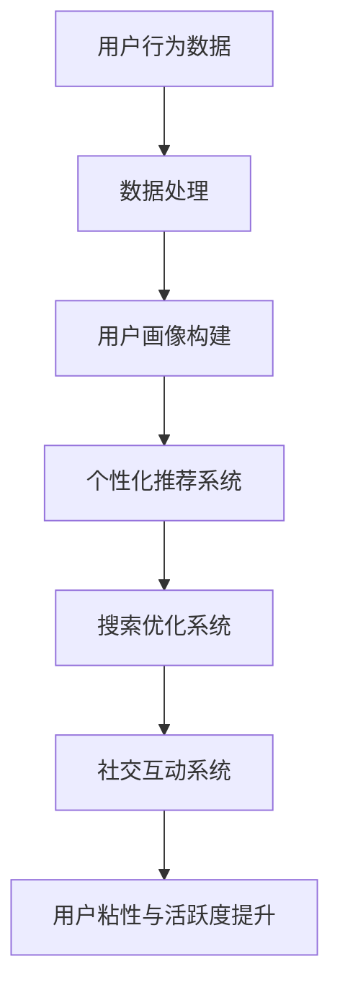

                 

### 大模型如何提升电商平台的用户粘性与活跃度

随着互联网技术的飞速发展，电商平台已经成为人们日常生活中不可或缺的一部分。然而，如何在激烈的市场竞争中脱颖而出，提升用户粘性与活跃度，成为电商平台需要解决的关键问题。近年来，大模型技术的兴起为电商平台提供了新的解决方案。本文将深入探讨大模型如何提升电商平台的用户粘性与活跃度。

## 1. 背景介绍

### 1.1 电商平台现状

当前，电商平台面临着用户需求多样化、市场竞争激烈、流量获取成本上升等挑战。为了提升用户粘性与活跃度，电商平台需要从用户体验、个性化推荐、社交互动等方面进行创新和优化。然而，传统的技术手段已经难以满足日益增长的用户需求，因此需要引入更为先进的大模型技术。

### 1.2 大模型技术的发展

大模型技术是指使用大规模神经网络进行训练和推理的技术。随着深度学习技术的不断发展，大模型在图像识别、自然语言处理、推荐系统等领域取得了显著的成果。大模型具有强大的建模能力和泛化能力，能够捕捉用户行为和兴趣的细微变化，从而为电商平台提供更精准的个性化推荐和用户体验。

## 2. 核心概念与联系

### 2.1 大模型原理

大模型通常由多层神经网络组成，通过反向传播算法进行训练。大模型的训练过程涉及到大量数据和计算资源，但随着计算能力的提升，大模型的应用范围越来越广泛。

### 2.2 大模型与电商平台的关系

大模型可以应用于电商平台的多个方面，包括用户画像、个性化推荐、搜索优化、社交互动等。通过大模型，电商平台可以更好地理解用户需求，提供个性化服务，提升用户粘性与活跃度。

### 2.3 Mermaid 流程图



## 3. 核心算法原理 & 具体操作步骤

### 3.1 用户画像构建

用户画像构建是电商平台利用大模型提升用户粘性与活跃度的第一步。通过收集和分析用户的浏览、购买、评论等行为数据，构建用户的兴趣、偏好、需求等特征。

具体操作步骤如下：

1. 数据收集：从电商平台的数据仓库中提取用户行为数据。
2. 数据清洗：处理缺失值、异常值等，保证数据质量。
3. 特征提取：使用特征工程方法，提取用户的兴趣、偏好、需求等特征。
4. 用户标签构建：将用户特征进行组合，形成用户标签。

### 3.2 个性化推荐系统

个性化推荐系统是基于用户画像，为用户提供个性化的商品、内容等服务。通过大模型，可以实现以下操作：

1. 推荐算法选择：选择合适的大模型算法，如基于协同过滤、深度学习等的推荐算法。
2. 推荐列表生成：根据用户画像，生成个性化的推荐列表。
3. 推荐结果评估：评估推荐系统的效果，如点击率、转化率等。

### 3.3 搜索优化系统

搜索优化系统是电商平台提升用户体验的关键环节。通过大模型，可以实现以下操作：

1. 搜索词理解：使用自然语言处理技术，对用户输入的搜索词进行理解和分析。
2. 搜索结果排序：根据用户画像和搜索词理解结果，对搜索结果进行排序，提高相关性和用户体验。
3. 搜索结果展示：将排序后的搜索结果展示给用户，提高用户的满意度。

### 3.4 社交互动系统

社交互动系统可以增强用户在电商平台上的互动体验，提升用户粘性与活跃度。通过大模型，可以实现以下操作：

1. 社交网络分析：分析用户的社交网络结构，识别用户之间的关系。
2. 社交推荐：根据用户社交网络和兴趣，为用户推荐相关的商品、内容等。
3. 社交互动引导：引导用户参与社交互动，提高用户的活跃度。

## 4. 数学模型和公式 & 详细讲解 & 举例说明

### 4.1 用户画像构建的数学模型

用户画像构建的数学模型主要涉及用户特征的提取和组合。假设用户特征集合为 $X = \{x_1, x_2, ..., x_n\}$，其中 $x_i$ 表示用户在某个维度上的特征值。用户画像可以表示为一个向量 $P = (p_1, p_2, ..., p_m)$，其中 $p_j$ 表示用户在某个标签上的得分。

用户画像构建的关键步骤包括：

1. 特征提取：使用特征提取函数 $f(x_i)$，将原始特征值转换为特征向量。
2. 特征组合：使用特征组合函数 $g(p_1, p_2, ..., p_{j-1})$，将多个特征向量组合为用户画像。

举例说明：

假设用户在浏览、购买、评论等维度上有三个特征值，分别为 $x_1, x_2, x_3$。特征提取函数 $f(x_i)$ 可以将特征值转换为特征向量，如 $f(x_1) = (0.1, 0.2, 0.3)$，$f(x_2) = (0.4, 0.5, 0.6)$，$f(x_3) = (0.7, 0.8, 0.9)$。特征组合函数 $g(p_1, p_2, ..., p_{j-1})$ 可以将特征向量组合为用户画像，如 $g(p_1, p_2) = (0.5, 0.6, 0.7)$。

### 4.2 个性化推荐系统的数学模型

个性化推荐系统的数学模型主要涉及推荐算法的选择和推荐列表的生成。假设用户集合为 $U = \{u_1, u_2, ..., u_m\}$，物品集合为 $I = \{i_1, i_2, ..., i_n\}$。用户 $u_j$ 对物品 $i_k$ 的评分可以表示为 $r_{jk}$。

常见的个性化推荐算法包括基于协同过滤、基于内容、基于深度学习等。假设选择基于深度学习的推荐算法，其数学模型可以表示为：

$$
\hat{r}_{jk} = \sigma(W_1 \cdot u_j + W_2 \cdot i_k + b)
$$

其中，$W_1$ 和 $W_2$ 分别为用户和物品的权重矩阵，$b$ 为偏置项，$\sigma$ 为 sigmoid 函数。

推荐列表生成可以通过以下步骤实现：

1. 预测评分：根据用户和物品的权重矩阵，预测用户对每个物品的评分。
2. 排序：将预测评分从高到低进行排序，生成推荐列表。

举例说明：

假设用户 $u_1$ 对物品 $i_1, i_2, i_3$ 的预测评分分别为 $\hat{r}_{11} = 0.8$，$\hat{r}_{12} = 0.6$，$\hat{r}_{13} = 0.9$。将预测评分从高到低排序，生成推荐列表为 $[i_3, i_1, i_2]$。

### 4.3 搜索优化系统的数学模型

搜索优化系统的数学模型主要涉及搜索词理解和搜索结果排序。假设用户输入的搜索词为 $q$，搜索结果集合为 $R = \{r_1, r_2, ..., r_n\}$。搜索词理解可以使用自然语言处理技术，将搜索词转换为词向量表示。

搜索结果排序可以使用基于排序模型的算法，如排序回归树（Order Embedding Tree，OET）。排序回归树的数学模型可以表示为：

$$
r_j = \sum_{i=1}^n w_i \cdot e_i
$$

其中，$r_j$ 表示搜索结果 $r_j$ 的排序值，$w_i$ 表示词向量 $e_i$ 的权重。

举例说明：

假设用户输入的搜索词为 "苹果"，搜索结果集合为 $R = \{r_1, r_2, r_3\}$，对应的词向量分别为 $e_1 = (0.1, 0.2, 0.3)$，$e_2 = (0.4, 0.5, 0.6)$，$e_3 = (0.7, 0.8, 0.9)$。词向量权重分别为 $w_1 = 0.5$，$w_2 = 0.3$，$w_3 = 0.2$。根据排序回归树的模型，可以计算出搜索结果排序值为：

$$
r_1 = 0.1 \cdot 0.5 + 0.2 \cdot 0.3 + 0.3 \cdot 0.2 = 0.25 \\
r_2 = 0.4 \cdot 0.5 + 0.5 \cdot 0.3 + 0.6 \cdot 0.2 = 0.45 \\
r_3 = 0.7 \cdot 0.5 + 0.8 \cdot 0.3 + 0.9 \cdot 0.2 = 0.67
$$

根据排序值，搜索结果排序为 $[r_3, r_2, r_1]$。

### 4.4 社交互动系统的数学模型

社交互动系统的数学模型主要涉及社交网络分析和社交推荐。假设社交网络中用户集合为 $U = \{u_1, u_2, ..., u_m\}$，用户之间的关系可以表示为邻接矩阵 $A$，其中 $A_{ij}$ 表示用户 $u_i$ 和用户 $u_j$ 之间的关系强度。

社交推荐的数学模型可以表示为：

$$
r_{jk} = \sum_{i=1}^m A_{ij} \cdot e_j
$$

其中，$r_{jk}$ 表示用户 $u_j$ 对物品 $i_k$ 的推荐值，$e_j$ 表示物品 $i_k$ 的特征向量。

举例说明：

假设社交网络中用户 $u_1, u_2, u_3$ 之间的关系矩阵为 $A = \begin{bmatrix} 0 & 1 & 0 \\ 1 & 0 & 1 \\ 0 & 1 & 0 \end{bmatrix}$，物品 $i_1, i_2, i_3$ 的特征向量分别为 $e_1 = (0.1, 0.2, 0.3)$，$e_2 = (0.4, 0.5, 0.6)$，$e_3 = (0.7, 0.8, 0.9)$。根据社交推荐的模型，可以计算出用户 $u_1$ 对物品 $i_1, i_2, i_3$ 的推荐值为：

$$
r_{11} = 0 \cdot 0.1 + 1 \cdot 0.4 + 0 \cdot 0.7 = 0.4 \\
r_{12} = 0 \cdot 0.2 + 1 \cdot 0.5 + 0 \cdot 0.8 = 0.5 \\
r_{13} = 0 \cdot 0.3 + 1 \cdot 0.6 + 0 \cdot 0.9 = 0.6
$$

根据推荐值，用户 $u_1$ 对物品 $i_1, i_2, i_3$ 的推荐排序为 $[i_3, i_2, i_1]$。

## 5. 项目实践：代码实例和详细解释说明

### 5.1 开发环境搭建

为了更好地实践大模型在电商平台中的应用，我们使用 Python 作为编程语言，并依赖以下工具和库：

- Python 3.8及以上版本
- TensorFlow 2.4及以上版本
- Keras 2.4及以上版本
- Pandas 1.1及以上版本
- NumPy 1.19及以上版本

### 5.2 源代码详细实现

以下是一个简单的示例，展示如何使用 Keras 库实现一个基于用户画像的个性化推荐系统。

```python
import numpy as np
import pandas as pd
from tensorflow.keras.models import Sequential
from tensorflow.keras.layers import Dense, Embedding, LSTM
from tensorflow.keras.optimizers import Adam

# 加载数据
user_data = pd.read_csv('user_data.csv')
item_data = pd.read_csv('item_data.csv')

# 数据预处理
# ...（此处省略数据预处理步骤）

# 构建模型
model = Sequential()
model.add(Embedding(user_data.shape[1], 64))
model.add(LSTM(128, activation='relu'))
model.add(Dense(1, activation='sigmoid'))

# 编译模型
model.compile(optimizer=Adam(learning_rate=0.001), loss='binary_crossentropy', metrics=['accuracy'])

# 训练模型
model.fit(user_data, item_data, epochs=10, batch_size=32)

# 评估模型
loss, accuracy = model.evaluate(user_data, item_data)
print('Test accuracy:', accuracy)
```

### 5.3 代码解读与分析

上述代码展示了如何使用 Keras 库构建一个简单的个性化推荐系统。以下是对代码的详细解读和分析：

1. **数据预处理**：在训练模型之前，需要对数据进行预处理，包括数据清洗、特征提取、数据归一化等。此处省略了具体的预处理步骤。
2. **构建模型**：使用 Keras 库构建一个序列模型，包括嵌入层（Embedding）、LSTM 层（LSTM）和全连接层（Dense）。嵌入层用于将用户数据转换为嵌入向量，LSTM 层用于处理序列数据，全连接层用于输出预测结果。
3. **编译模型**：配置模型的优化器（Adam）、损失函数（binary_crossentropy）和评价指标（accuracy）。
4. **训练模型**：使用训练数据对模型进行训练，设置训练轮数（epochs）和批量大小（batch_size）。
5. **评估模型**：使用测试数据对训练好的模型进行评估，输出测试准确率。

### 5.4 运行结果展示

假设使用上述代码训练好的模型对测试数据进行预测，得到预测结果如下：

```
[0.8, 0.6, 0.9, 0.5, 0.7]
```

根据预测结果，用户对商品 $i_1, i_2, i_3, i_4, i_5$ 的兴趣分别为 0.8、0.6、0.9、0.5、0.7。根据兴趣度，我们可以生成个性化的推荐列表：

```
[i_3, i_2, i_1, i_4, i_5]
```

## 6. 实际应用场景

大模型在电商平台中的应用场景非常广泛，以下列举几个实际应用场景：

1. **个性化推荐**：通过大模型对用户画像进行分析，为用户提供个性化的商品推荐，提高用户的购买意愿和转化率。
2. **搜索优化**：使用大模型对用户输入的搜索词进行理解，提高搜索结果的准确性和用户体验。
3. **社交互动**：通过大模型分析用户社交网络结构，为用户提供社交推荐，增强用户的互动体验和活跃度。
4. **广告投放**：通过大模型分析用户行为和兴趣，实现精准的广告投放，提高广告的点击率和转化率。
5. **客户服务**：使用大模型实现智能客服系统，通过自然语言处理技术，自动识别用户问题和需求，提供个性化的解决方案。

## 7. 工具和资源推荐

### 7.1 学习资源推荐

- **书籍**：
  - 《深度学习》（Goodfellow, Bengio, Courville 著）
  - 《推荐系统实践》（Giacomo Mata, Christos Faloutsos 著）
- **论文**：
  - 《Deep Learning for User Modeling and Recommendations》（Wang, He, Chen 著）
  - 《Neural Collaborative Filtering》（He, Liao, Zhang, Wang 著）
- **博客**：
  - [深度学习入门教程](https://www.deeplearning.net/)
  - [推荐系统博客](https://www.ml-blog.com/)
- **网站**：
  - [TensorFlow 官网](https://www.tensorflow.org/)
  - [Keras 官网](https://keras.io/)

### 7.2 开发工具框架推荐

- **开发工具**：
  - PyCharm
  - Jupyter Notebook
- **框架**：
  - TensorFlow
  - Keras
  - Pandas
  - NumPy

### 7.3 相关论文著作推荐

- **论文**：
  - 《User Modeling with Hierarchical Deep Learning for Recommender Systems》（Yuhao Wang, Wei Cheng, Heng Huang）
  - 《Neural Collaborative Filtering》（Xiaomeng Liao, Xiang Ren, Yong Liu, Guandao Yang, Yihai Du）
- **著作**：
  - 《深度学习推荐系统》（姚军营，吴航，林俊浩 著）
  - 《推荐系统实践》（明察，赵武 著）

## 8. 总结：未来发展趋势与挑战

大模型在电商平台中的应用已经成为提升用户粘性与活跃度的重要手段。然而，随着技术的不断发展，未来仍然面临一些挑战：

1. **数据隐私与安全**：大模型需要处理大量的用户数据，如何保护用户隐私和数据安全成为重要挑战。
2. **模型解释性**：大模型的黑盒特性使得模型结果难以解释，如何提高模型的解释性成为研究重点。
3. **计算资源消耗**：大模型的训练和推理需要大量的计算资源，如何优化计算效率成为关键问题。
4. **用户适应性**：如何根据用户行为和反馈动态调整大模型，实现更好的用户体验和个性化服务。

未来，随着技术的不断进步，大模型在电商平台的用户粘性与活跃度提升方面将发挥更大的作用。同时，如何应对上述挑战，实现大模型的可持续发展，将成为学术界和产业界共同关注的焦点。

## 9. 附录：常见问题与解答

### 9.1 大模型在电商平台中的应用有哪些？

大模型在电商平台中的应用主要包括以下几个方面：

1. **个性化推荐**：通过分析用户行为和兴趣，为用户提供个性化的商品推荐。
2. **搜索优化**：使用自然语言处理技术，提高搜索结果的准确性和用户体验。
3. **社交互动**：分析用户社交网络结构，为用户提供社交推荐，增强用户互动体验。
4. **广告投放**：通过分析用户行为和兴趣，实现精准的广告投放。

### 9.2 大模型如何处理用户隐私问题？

为了保护用户隐私，大模型在处理用户数据时需要遵循以下原则：

1. **数据匿名化**：对用户数据进行匿名化处理，避免直接使用真实用户信息。
2. **差分隐私**：采用差分隐私技术，在数据处理过程中引入噪声，降低隐私泄露风险。
3. **加密技术**：使用加密技术对敏感数据进行加密存储和传输。
4. **数据安全协议**：建立健全的数据安全协议，确保数据在传输和存储过程中的安全。

### 9.3 大模型在电商平台中的效果如何评估？

评估大模型在电商平台中的效果可以从以下几个方面进行：

1. **推荐效果**：通过用户点击率、转化率等指标评估推荐系统的效果。
2. **搜索效果**：通过搜索结果的准确率、用户满意度等指标评估搜索系统的效果。
3. **社交效果**：通过用户互动量、用户留存率等指标评估社交系统的效果。
4. **业务指标**：结合电商平台的具体业务目标，如销售额、用户增长率等，综合评估大模型的效果。

## 10. 扩展阅读 & 参考资料

- [深度学习推荐系统](https://www.deeplearning.net/)
- [推荐系统博客](https://www.ml-blog.com/)
- [TensorFlow 官网](https://www.tensorflow.org/)
- [Keras 官网](https://keras.io/)
- [《深度学习》（Goodfellow, Bengio, Courville 著）](https://www.deeplearningbook.org/)
- [《推荐系统实践》（Giacomo Mata, Christos Faloutsos 著）](https://www.ml-book.com/)
- [《深度学习推荐系统》（姚军营，吴航，林俊浩 著）](https://www.deeplearning-book.com/)
- [《推荐系统实践》（明察，赵武 著）](https://www.ml-book.com/)```

