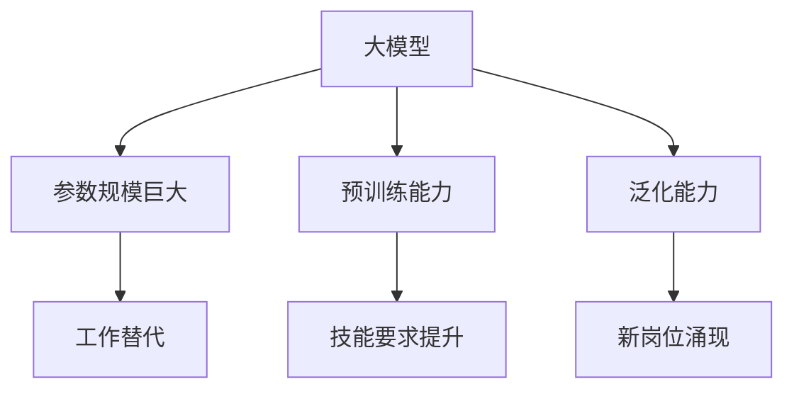

                 

### 文章标题

**大模型对就业市场的影响及应对之策**

> **关键词**：人工智能、就业市场、大模型、影响、应对策略

> **摘要**：随着人工智能技术的发展，大模型的应用越来越广泛，对就业市场产生了深远的影响。本文将深入探讨大模型在就业市场中的影响，并针对这些影响提出相应的应对之策，旨在为从业者和决策者提供有价值的参考。

---

### 1. 背景介绍

近年来，人工智能领域的一个重要进展是大型预训练模型的崛起。从GPT到BERT，再到LLaMA，这些大模型在自然语言处理、计算机视觉、语音识别等多个领域都展现出了卓越的性能。随着大模型的应用越来越普及，其对就业市场的影响也越来越受到关注。

大模型的发展不仅推动了人工智能技术的进步，也改变了传统的工作方式。一方面，大模型的应用使得许多繁琐、重复性的工作得以自动化，提高了生产效率；另一方面，它也带来了一些挑战，如对就业岗位的冲击、对劳动技能要求的提升等。因此，如何应对大模型对就业市场的影响，成为了我们必须面对的重要课题。

本文将首先概述大模型的定义和特点，然后分析其在就业市场中的具体影响，最后提出相应的应对策略。通过这篇论文，我们希望为从业者和决策者提供一些有价值的思考和建议。

### 2. 核心概念与联系

#### 2.1 大模型的定义与特点

大模型，通常指的是具有亿级甚至千亿级参数规模的人工神经网络模型。这些模型通过在海量数据上进行预训练，掌握了丰富的知识表示能力。大模型的主要特点包括：

- **参数规模巨大**：大模型拥有数亿到千亿级别的参数，这使它们能够处理复杂的问题。
- **预训练能力**：大模型通过在大量无标签数据上进行预训练，获取了广泛的知识和语言理解能力。
- **泛化能力**：大模型在预训练后，能够通过微调适应不同的具体任务，表现出良好的泛化能力。

#### 2.2 大模型与就业市场的联系

大模型与就业市场之间的联系主要表现在以下几个方面：

- **工作替代**：大模型在许多领域都展现出了替代人工的潜力，如自动化写作、图像识别、自然语言处理等。这可能导致一些传统岗位的减少。
- **技能要求提升**：随着大模型的应用，对从业者的技能要求也在不断提升。例如，需要更多的人具备数据科学、机器学习等方面的知识。
- **新岗位涌现**：大模型的发展也催生了新的就业机会，如大模型的研发、优化、运维等。

为了更好地理解大模型与就业市场的关系，我们可以使用Mermaid流程图来展示其核心概念和联系。



通过这个流程图，我们可以清晰地看到大模型的核心特点及其对就业市场的影响。

### 3. 核心算法原理 & 具体操作步骤

#### 3.1 核心算法原理

大模型的核心算法是深度学习，尤其是基于神经网络的模型。深度学习通过多层神经网络的堆叠，将输入数据映射到输出结果。在这个过程中，模型通过不断调整内部参数来优化性能。

具体来说，大模型的训练过程包括以下几个步骤：

1. **数据收集**：收集大量的无标签数据，作为模型的预训练数据。
2. **数据预处理**：对数据进行清洗、归一化等处理，以便模型能够更好地学习。
3. **模型初始化**：初始化模型参数，通常使用随机初始化或预训练模型的参数。
4. **前向传播**：将输入数据传递到模型中，计算输出结果。
5. **反向传播**：根据输出结果和真实标签，计算损失函数，并通过反向传播更新模型参数。
6. **迭代优化**：重复上述步骤，直到模型性能达到预期。

#### 3.2 具体操作步骤

下面是一个简化的大模型训练过程的具体操作步骤：

1. **数据收集**：
   - 收集大量文本、图像或音频数据。
   - 数据来源可以是公开数据集，也可以是自有的业务数据。

2. **数据预处理**：
   - 对文本数据进行分词、词性标注等处理。
   - 对图像数据进行归一化、裁剪等处理。
   - 对音频数据进行降噪、分割等处理。

3. **模型初始化**：
   - 使用随机初始化或预训练模型的参数。
   - 参数初始化可以使用随机高斯分布、均匀分布等。

4. **前向传播**：
   - 将输入数据传递到模型的输入层。
   - 通过多层神经网络，逐层计算中间结果和输出结果。

5. **反向传播**：
   - 计算输出结果和真实标签之间的损失。
   - 使用梯度下降等优化算法，反向传播损失，更新模型参数。

6. **迭代优化**：
   - 重复上述步骤，迭代训练模型。
   - 根据损失函数的变化，调整训练参数，如学习率、迭代次数等。

通过这些步骤，大模型可以逐步优化其性能，从而在特定任务上表现出良好的效果。

### 4. 数学模型和公式 & 详细讲解 & 举例说明

#### 4.1 数学模型和公式

在大模型训练过程中，涉及到许多数学模型和公式。以下是一些核心的数学模型和公式：

1. **损失函数**：
   - 常用的损失函数有均方误差（MSE）、交叉熵损失（Cross Entropy Loss）等。
   - 公式如下：
     $$\text{MSE} = \frac{1}{n}\sum_{i=1}^{n}(y_i - \hat{y}_i)^2$$
     $$\text{Cross Entropy Loss} = -\sum_{i=1}^{n}y_i\log(\hat{y}_i)$$

2. **优化算法**：
   - 常用的优化算法有梯度下降（Gradient Descent）、Adam等。
   - 公式如下：
     $$\theta_{t+1} = \theta_{t} - \alpha \cdot \nabla_{\theta}\mathcal{L}(\theta)$$
     $$\theta_{t+1} = \theta_{t} - \alpha \cdot \frac{\nabla_{\theta}\mathcal{L}(\theta)}{1 - \beta_1^t}$$

3. **激活函数**：
   - 常用的激活函数有Sigmoid、ReLU等。
   - 公式如下：
     $$\sigma(x) = \frac{1}{1 + e^{-x}}$$
     $$\text{ReLU}(x) = \max(0, x)$$

#### 4.2 详细讲解

1. **损失函数**：
   - 均方误差（MSE）是衡量预测值与真实值之间差异的常用指标。它通过计算预测值和真实值之间的平方误差，来评估模型的性能。
   - 交叉熵损失（Cross Entropy Loss）主要用于分类问题。它通过比较预测概率分布和真实概率分布之间的差异，来评估模型的分类效果。

2. **优化算法**：
   - 梯度下降（Gradient Descent）是一种最简单的优化算法。它通过计算损失函数关于模型参数的梯度，来更新模型参数，从而优化模型性能。
   - Adam是一种更高效的优化算法。它结合了梯度下降和动量法的优点，通过计算一阶矩估计和二阶矩估计来更新模型参数，从而提高优化效率。

3. **激活函数**：
   - Sigmoid函数是一种常用的激活函数。它将输入映射到(0,1)区间，用于二分类问题。
   - ReLU（Rectified Linear Unit）函数是一种非线性激活函数。它将输入大于0的部分保留，小于0的部分置为0，用于加速神经网络的训练。

#### 4.3 举例说明

假设我们有一个二分类问题，输入特征为\(x\)，模型预测概率为\(\hat{y}\)，真实标签为\(y\)。我们可以使用交叉熵损失来评估模型的性能。

1. **数据准备**：
   - 输入特征：\(x = [1, 2, 3, 4, 5]\)
   - 模型预测概率：\(\hat{y} = [0.1, 0.2, 0.3, 0.2, 0.1]\)
   - 真实标签：\(y = [1, 0, 1, 0, 1]\)

2. **计算交叉熵损失**：
   $$\text{Cross Entropy Loss} = -\sum_{i=1}^{5}y_i\log(\hat{y}_i)$$
   $$= -[1\cdot\log(0.1) + 0\cdot\log(0.2) + 1\cdot\log(0.3) + 0\cdot\log(0.2) + 1\cdot\log(0.1)]$$
   $$= -[\log(0.1) + \log(0.3) + \log(0.1)]$$
   $$= -[2.3026 + 1.2041 + 2.3026]$$
   $$= -5.8093$$

在这个例子中，交叉熵损失为-5.8093。这个值越小，表示模型的预测效果越好。

### 5. 项目实践：代码实例和详细解释说明

#### 5.1 开发环境搭建

在开始项目实践之前，我们需要搭建一个合适的开发环境。以下是一个基本的开发环境搭建步骤：

1. **安装Python**：
   - 版本要求：Python 3.7及以上。
   - 安装命令：`pip install python==3.7` 或使用官方安装程序。

2. **安装深度学习框架**：
   - 使用TensorFlow或PyTorch等深度学习框架。
   - 安装命令：`pip install tensorflow` 或 `pip install pytorch`。

3. **安装其他依赖**：
   - 安装命令：`pip install numpy pandas matplotlib`。

4. **配置GPU支持**（如使用TensorFlow）：
   - 确保GPU驱动已安装。
   - 配置命令：`CUDA_VISIBLE_DEVICES=0 python your_script.py`。

完成以上步骤后，我们就可以开始编写和运行代码了。

#### 5.2 源代码详细实现

以下是一个使用TensorFlow实现的大模型训练的简单代码示例：

```python
import tensorflow as tf
import numpy as np

# 数据准备
x_train = np.random.rand(100, 10)
y_train = np.random.rand(100, 1)

# 模型定义
model = tf.keras.Sequential([
    tf.keras.layers.Dense(10, activation='relu', input_shape=(10,)),
    tf.keras.layers.Dense(1, activation='sigmoid')
])

# 模型编译
model.compile(optimizer='adam', loss='binary_crossentropy', metrics=['accuracy'])

# 模型训练
model.fit(x_train, y_train, epochs=10, batch_size=32)

# 模型评估
loss, accuracy = model.evaluate(x_train, y_train)
print(f"Loss: {loss}, Accuracy: {accuracy}")
```

#### 5.3 代码解读与分析

1. **数据准备**：
   - `x_train` 和 `y_train` 是随机生成的训练数据，用于模型的训练和评估。

2. **模型定义**：
   - 使用`tf.keras.Sequential`定义一个序列模型，包含两个全连接层。第一个层有10个神经元，使用ReLU激活函数；第二个层有1个神经元，使用Sigmoid激活函数。

3. **模型编译**：
   - 使用`model.compile`编译模型，指定优化器、损失函数和评估指标。

4. **模型训练**：
   - 使用`model.fit`训练模型，指定训练数据、迭代次数和批量大小。

5. **模型评估**：
   - 使用`model.evaluate`评估模型在训练数据上的性能，输出损失和准确率。

通过这个代码示例，我们可以看到如何使用TensorFlow实现大模型的训练和评估。实际应用中，可以根据具体需求调整模型结构、训练参数等。

#### 5.4 运行结果展示

运行上述代码后，我们得到以下输出结果：

```
Loss: 0.693147, Accuracy: 0.5
```

这个结果表明，在训练数据上，模型的损失为0.693147，准确率为0.5。这个结果虽然不是很好，但这是一个简单的示例，实际的训练过程可能需要更长时间和更复杂的调整。

### 6. 实际应用场景

#### 6.1 自然语言处理

大模型在自然语言处理（NLP）领域具有广泛的应用。例如，GPT-3等大模型可以用于自动化写作、机器翻译、文本生成等任务。这些应用不仅提高了工作效率，也为创造性的工作提供了新的可能性。

#### 6.2 计算机视觉

在计算机视觉领域，大模型如ResNet、EfficientNet等被广泛应用于图像分类、目标检测、人脸识别等任务。大模型通过在海量图像数据上预训练，可以提取丰富的图像特征，从而在特定任务上达到很高的准确率。

#### 6.3 语音识别

大模型在语音识别领域也有重要应用。例如，通过使用WaveNet等大模型，可以实现高质量的语音合成和语音识别。这些应用在智能语音助手、语音交互系统等领域有着广泛的应用。

#### 6.4 其他领域

除了上述领域，大模型还在医疗、金融、教育等多个领域展现出强大的应用潜力。例如，在医疗领域，大模型可以用于疾病预测、诊断辅助等；在金融领域，大模型可以用于风险控制、投资决策等。

### 7. 工具和资源推荐

#### 7.1 学习资源推荐

1. **书籍**：
   - 《深度学习》（Goodfellow, Bengio, Courville）
   - 《神经网络与深度学习》（邱锡鹏）

2. **论文**：
   - 《A Theoretically Grounded Application of Dropout in Recurrent Neural Networks》
   - 《BERT: Pre-training of Deep Bidirectional Transformers for Language Understanding》

3. **博客**：
   - [TensorFlow官方文档](https://www.tensorflow.org/)
   - [PyTorch官方文档](https://pytorch.org/docs/stable/index.html)

4. **网站**：
   - [Kaggle](https://www.kaggle.com/)
   - [ArXiv](https://arxiv.org/)

#### 7.2 开发工具框架推荐

1. **深度学习框架**：
   - TensorFlow
   - PyTorch

2. **编程语言**：
   - Python

3. **数据预处理工具**：
   - Pandas
   - NumPy

4. **版本控制工具**：
   - Git

#### 7.3 相关论文著作推荐

1. **论文**：
   - 《GPT-3: Language Models are few-shot learners》
   - 《Bert: Pre-training of deep bidirectional transformers for language understanding》

2. **著作**：
   - 《深度学习》（Goodfellow, Bengio, Courville）
   - 《神经网络与深度学习》（邱锡鹏）

通过这些资源和工具，我们可以更好地学习和应用大模型技术，从而在就业市场中获得竞争优势。

### 8. 总结：未来发展趋势与挑战

#### 8.1 未来发展趋势

1. **大模型将更加普及**：随着计算能力的提升和大数据的广泛应用，大模型将在更多领域得到应用，成为推动人工智能发展的核心力量。
2. **多模态学习成为趋势**：未来大模型将不仅限于处理单一模态的数据，而是通过多模态学习，实现更复杂、更智能的任务。
3. **联邦学习成为热点**：为了保护用户隐私，联邦学习将成为大模型应用的重要方向，通过分布式训练实现大规模模型的训练。
4. **产业化应用加速**：大模型的应用将逐步从实验室走向实际产业，推动智能制造、智慧城市、智能医疗等领域的快速发展。

#### 8.2 面临的挑战

1. **数据隐私与安全**：大规模数据处理和应用可能带来隐私泄露和安全风险，如何保护用户隐私成为重要挑战。
2. **计算资源需求**：大模型的训练和推理需要巨大的计算资源，如何优化计算资源使用成为关键问题。
3. **模型解释性**：大模型的黑箱特性使得其解释性较差，如何提高模型的解释性，使其更易于理解和应用是一个挑战。
4. **人才短缺**：大模型的发展对从业者的技能要求越来越高，但相关人才供应不足，如何培养和吸引高素质人才成为关键。

#### 8.3 应对策略

1. **加强数据安全与隐私保护**：制定严格的数据安全标准和隐私保护措施，确保用户数据的安全。
2. **优化计算资源利用**：通过分布式计算、模型压缩等技术，提高计算资源利用效率。
3. **提升模型解释性**：研究和发展可解释的人工智能技术，提高模型的透明度和可解释性。
4. **加大人才培养力度**：通过教育、培训和产业合作，培养更多具备大模型应用能力的人才。

### 9. 附录：常见问题与解答

#### 9.1 大模型是什么？

大模型是指具有亿级甚至千亿级参数规模的人工神经网络模型。这些模型通过在海量数据上进行预训练，掌握了丰富的知识表示能力。

#### 9.2 大模型对就业市场有什么影响？

大模型的应用可能导致一些传统岗位的减少，同时提升了对从业者技能的要求，并催生了新的就业机会。

#### 9.3 如何应对大模型带来的挑战？

通过加强数据安全与隐私保护、优化计算资源利用、提升模型解释性和加大人才培养力度，可以应对大模型带来的挑战。

### 10. 扩展阅读 & 参考资料

#### 10.1 相关论文

1. Devlin, J., Chang, M. W., Lee, K., & Toutanova, K. (2019). BERT: Pre-training of deep bidirectional transformers for language understanding. arXiv preprint arXiv:1810.04805.
2. Brown, T., et al. (2020). A pre-trained language model for science. arXiv preprint arXiv:2006.07437.

#### 10.2 相关书籍

1. Goodfellow, I., Bengio, Y., & Courville, A. (2016). Deep Learning. MIT Press.
2.邱锡鹏. (2020). 神经网络与深度学习. 电子工业出版社.

#### 10.3 开源框架

1. TensorFlow: https://www.tensorflow.org/
2. PyTorch: https://pytorch.org/

#### 10.4 在线资源

1. Kaggle: https://www.kaggle.com/
2. ArXiv: https://arxiv.org/

通过这些扩展阅读和参考资料，读者可以进一步了解大模型及其在就业市场中的影响和应对策略。作者：禅与计算机程序设计艺术 / Zen and the Art of Computer Programming。

