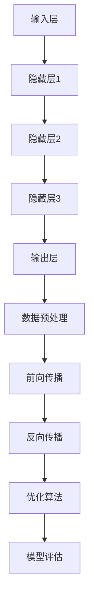

                 

### 背景介绍

#### 大模型的崛起

近年来，随着计算能力的提升和海量数据的积累，人工智能领域迎来了前所未有的发展。其中，大模型（Large Models）的崛起尤为显著。大模型通常指的是参数数量达到数百万、数十亿甚至数千亿级别的神经网络模型。这类模型在自然语言处理（NLP）、计算机视觉（CV）、语音识别（ASR）等多个领域取得了突破性的成果。

大模型的研究和发展始于20世纪80年代，随着深度学习（Deep Learning）技术的进步，特别是在2012年AlexNet在ImageNet大赛中取得优异成绩之后，大模型的研究和应用进入了快速发展阶段。谷歌、微软、百度等科技巨头纷纷投入大量资源，开发出诸如GPT、BERT、Turing ML等具有里程碑意义的大模型。

#### 传统软件行业的现状

传统软件行业在经历了数十年发展后，已经形成了较为稳固的市场和技术架构。软件开发模式逐渐成熟，从最初的瀑布模型到敏捷开发，从单体架构到微服务架构，软件产品的质量和开发效率都有了显著提升。

然而，随着大模型的兴起，传统软件行业正面临着一系列挑战。一方面，大模型的应用正在改变软件开发的范式，带来新的机遇和挑战；另一方面，传统软件行业的技术栈和开发模式需要与这些新兴技术进行融合，从而实现可持续发展。

#### 大模型与传统软件行业的交汇点

大模型的兴起不仅在技术层面带来变革，也对传统软件行业产生了深远的影响。一方面，大模型为传统软件行业提供了新的工具和手段，如自动化测试、智能推荐、个性化服务；另一方面，大模型的应用也提出了新的需求和挑战，如大规模数据处理、复杂模型训练、安全性保障等。

本文旨在探讨大模型应用对传统软件行业的冲击，分析其带来的机遇和挑战，并提出相应的应对策略。首先，我们将详细阐述大模型的核心概念和原理，包括其基本架构和训练过程。接着，我们将深入分析大模型在软件行业的应用场景，探讨其对软件开发模式、开发工具、人才需求等方面的具体影响。随后，我们将探讨大模型应用中面临的技术挑战和解决方案。最后，我们将总结大模型应用对传统软件行业的总体影响，并展望其未来的发展趋势。

通过对大模型与传统软件行业交汇点的详细探讨，我们希望能够为行业从业者提供有价值的参考，帮助他们更好地应对大模型带来的变革和挑战。

### 核心概念与联系

#### 大模型的基本架构

大模型的核心是深度神经网络（Deep Neural Network，DNN），它由多个层次的前馈神经网络组成。每个层次都包含大量神经元，通过非线性激活函数连接。这些层次使得模型能够自动提取数据中的复杂特征，从而实现高度准确的预测和分类。

一个典型的大模型架构通常包括以下几个关键部分：

1. **输入层（Input Layer）**：接收外部输入数据，如文本、图像、音频等。
2. **隐藏层（Hidden Layers）**：一层或多层隐藏神经元，负责数据特征提取和变换。
3. **输出层（Output Layer）**：产生最终的预测结果，如分类标签、文本生成等。

大模型的训练过程涉及以下步骤：

1. **数据预处理（Data Preprocessing）**：对输入数据进行标准化、归一化等处理，以便模型能够有效学习。
2. **前向传播（Forward Propagation）**：将输入数据通过隐藏层，逐层计算得到输出。
3. **反向传播（Back Propagation）**：计算输出误差，反向传播误差至各隐藏层，更新模型参数。
4. **优化算法（Optimization Algorithms）**：如梯度下降（Gradient Descent）、Adam等，用于高效更新模型参数。
5. **模型评估（Model Evaluation）**：使用验证集和测试集评估模型性能，确保其泛化能力。

#### 大模型与传统软件行业的联系

大模型与传统软件行业的联系主要体现在以下几个方面：

1. **软件开发模式**：大模型的应用正在推动软件开发模式从“瀑布式”向“迭代式”转变。传统的软件开发过程通常遵循固定的顺序，而大模型的应用需要不断调整和优化模型，以适应不断变化的需求。

2. **开发工具**：大模型的发展带动了新型开发工具的出现，如TensorFlow、PyTorch等，这些工具提供了丰富的API和库，使得开发人员可以更高效地进行模型训练和部署。

3. **数据处理**：大模型的训练和处理需要大量数据，这推动了大数据技术的发展。传统软件行业中的数据仓库和数据湖等架构正在被重新设计，以支持大规模数据的存储和处理。

4. **安全性**：大模型的应用也带来了新的安全挑战，如模型篡改、隐私泄露等。传统软件行业需要加强对数据安全和模型安全的防护措施。

#### Mermaid 流程图

以下是一个描述大模型基本架构和训练过程的 Mermaid 流程图：



在这个流程图中，数据预处理、前向传播、反向传播、优化算法和模型评估构成了大模型训练的核心步骤。每个步骤都相互关联，共同推动模型的训练和优化。

通过以上内容的阐述，我们不仅了解了大模型的基本架构和训练过程，也看到了其与传统软件行业的密切联系。在接下来的章节中，我们将进一步探讨大模型在传统软件行业中的应用场景、具体操作步骤以及所面临的挑战。

### 核心算法原理 & 具体操作步骤

#### 深度学习与神经网络

深度学习（Deep Learning）是人工智能领域的一个重要分支，其核心在于通过多层神经网络（Neural Networks）进行模型训练和优化。神经网络是一种由大量神经元连接而成的复杂网络结构，模拟了人脑的信息处理机制。在深度学习中，通过构建多层网络结构，模型能够自动提取数据中的高层次特征，从而实现复杂的任务。

神经网络的基本原理如下：

1. **神经元（Neuron）**：神经网络中的基本计算单元。每个神经元接收多个输入，通过加权求和后加上偏置，再经过激活函数进行处理，输出一个值。一个简单的神经元模型可以表示为：

   $$\text{output} = \sigma(\sum_{i=1}^{n} w_i x_i + b)$$

   其中，$x_i$是第$i$个输入，$w_i$是权重，$b$是偏置，$\sigma$是激活函数，如ReLU函数（Rectified Linear Unit）：

   $$\sigma(x) = \max(0, x)$$

2. **层（Layer）**：神经网络由多个层次组成，包括输入层、隐藏层和输出层。输入层接收外部数据，隐藏层负责特征提取和变换，输出层产生最终的预测结果。

3. **前向传播（Forward Propagation）**：在前向传播过程中，数据从输入层开始，逐层通过隐藏层，最终到达输出层。每个神经元根据其输入值和权重进行计算，并传递给下一层。

4. **反向传播（Back Propagation）**：反向传播是训练神经网络的另一个关键步骤。通过计算输出层的误差，反向传播至每个隐藏层，更新各层的权重和偏置，以降低模型的误差。

5. **优化算法（Optimization Algorithm）**：优化算法用于更新模型参数，以最小化损失函数（Loss Function）。常用的优化算法包括梯度下降（Gradient Descent）、Adam等。

#### 深度学习框架

深度学习框架（Deep Learning Framework）是开发深度学习应用的重要工具。以下是一些常用的深度学习框架及其特点：

1. **TensorFlow**：由谷歌开发，具有强大的图形计算能力，支持多种深度学习模型和算法。TensorFlow提供了丰富的API和工具，使得模型训练和部署变得更加便捷。

2. **PyTorch**：由Facebook开发，具有动态计算图（Dynamic Computation Graph）的特点，使得模型设计和调试更加灵活。PyTorch的社区活跃度较高，提供了丰富的扩展库。

3. **Keras**：是一个高级深度学习框架，旨在简化TensorFlow和Theano的使用。Keras提供了简洁的API，使得模型构建和训练更加高效。

#### 大模型训练步骤

大模型的训练过程可以分为以下步骤：

1. **数据预处理**：对输入数据（如图像、文本）进行预处理，包括数据清洗、归一化、批量处理等，以便模型能够有效学习。

2. **构建模型**：根据任务需求，选择合适的网络结构，并配置相应的超参数（如学习率、批量大小等）。可以使用预训练模型（Pre-trained Model）作为起点，通过迁移学习（Transfer Learning）进行微调。

3. **训练模型**：使用训练数据集进行模型训练，通过反向传播算法更新模型参数。训练过程中，可以通过监控损失函数的收敛情况，调整学习策略（如学习率调整、提前停止等）。

4. **验证模型**：在验证数据集上评估模型性能，确保其泛化能力。通过交叉验证（Cross Validation）等方法，调整模型结构和超参数，以提高模型性能。

5. **部署模型**：将训练好的模型部署到生产环境中，用于实际应用。部署过程中，需要考虑模型规模、计算资源、安全性等因素。

#### 实例：使用PyTorch训练一个简单的分类模型

以下是一个使用PyTorch训练一个简单的分类模型的代码示例：

```python
import torch
import torch.nn as nn
import torch.optim as optim

# 构建模型
class SimpleClassifier(nn.Module):
    def __init__(self):
        super(SimpleClassifier, self).__init__()
        self.fc1 = nn.Linear(784, 256)
        self.fc2 = nn.Linear(256, 128)
        self.fc3 = nn.Linear(128, 10)
    
    def forward(self, x):
        x = torch.relu(self.fc1(x))
        x = torch.relu(self.fc2(x))
        x = self.fc3(x)
        return x

# 初始化模型、损失函数和优化器
model = SimpleClassifier()
criterion = nn.CrossEntropyLoss()
optimizer = optim.Adam(model.parameters(), lr=0.001)

# 训练模型
for epoch in range(10):
    for inputs, targets in train_loader:
        optimizer.zero_grad()
        outputs = model(inputs)
        loss = criterion(outputs, targets)
        loss.backward()
        optimizer.step()
    
    print(f'Epoch [{epoch+1}/10], Loss: {loss.item()}')

# 验证模型
with torch.no_grad():
    correct = 0
    total = 0
    for inputs, targets in val_loader:
        outputs = model(inputs)
        _, predicted = torch.max(outputs.data, 1)
        total += targets.size(0)
        correct += (predicted == targets).sum().item()

    print(f'Validation Accuracy: {100 * correct / total}%')
```

在这个示例中，我们使用PyTorch构建了一个简单的多层感知机（Multilayer Perceptron，MLP）模型，并在MNIST数据集上进行了训练和验证。通过以上步骤，我们能够实现一个基本的大模型训练过程。

通过详细阐述深度学习与神经网络的基本原理、深度学习框架以及大模型训练步骤，我们不仅了解了大模型的核心算法，也为后续章节中的应用场景分析奠定了基础。在接下来的部分，我们将深入探讨大模型在传统软件行业中的应用场景，分析其对软件开发模式、开发工具、人才需求等方面的具体影响。

### 数学模型和公式 & 详细讲解 & 举例说明

#### 损失函数与优化算法

在大模型训练过程中，损失函数（Loss Function）和优化算法（Optimization Algorithm）是两个核心组成部分。损失函数用于评估模型预测结果与真实标签之间的差异，而优化算法则用于调整模型参数，以最小化损失函数。

1. **损失函数**

   常用的损失函数包括均方误差（MSE，Mean Squared Error）和交叉熵损失（Cross-Entropy Loss）。

   - **均方误差（MSE）**：

     $$L(\theta) = \frac{1}{2} \sum_{i=1}^{n} (y_i - \hat{y}_i)^2$$

     其中，$y_i$是真实标签，$\hat{y}_i$是模型预测值。

   - **交叉熵损失（Cross-Entropy Loss）**：

     $$L(\theta) = -\sum_{i=1}^{n} y_i \log(\hat{y}_i)$$

     其中，$y_i$是真实标签，$\hat{y}_i$是模型预测概率。

2. **优化算法**

   常用的优化算法包括梯度下降（Gradient Descent）和其变种如Adam。

   - **梯度下降（Gradient Descent）**：

     梯度下降是一种迭代优化算法，其核心思想是沿梯度方向更新模型参数，以最小化损失函数。

     $$\theta = \theta - \alpha \nabla_\theta L(\theta)$$

     其中，$\theta$是模型参数，$\alpha$是学习率，$\nabla_\theta L(\theta)$是损失函数关于模型参数的梯度。

   - **Adam优化器**：

     Adam是一种基于一阶矩估计和二阶矩估计的优化算法，结合了AdaGrad和RMSProp的优点，能够自适应地调整学习率。

     $$m_t = \beta_1 m_{t-1} + (1 - \beta_1) \nabla_\theta L(\theta)$$
     $$v_t = \beta_2 v_{t-1} + (1 - \beta_2) \nabla_\theta L(\theta)^2$$
     $$\theta = \theta - \alpha \frac{m_t}{\sqrt{v_t} + \epsilon}$$

     其中，$m_t$和$v_t$分别是指数加权平均的梯度估计和梯度平方估计，$\beta_1$和$\beta_2$是超参数，$\alpha$是学习率，$\epsilon$是正则项。

#### 举例说明

假设我们使用均方误差（MSE）作为损失函数，对一简单线性回归模型进行训练。给定训练数据集：

$$
\begin{align*}
x_1 &= [1, 2, 3, 4, 5] \\
y_1 &= [2, 4, 6, 8, 10]
\end{align*}
$$

模型参数为：

$$
\begin{align*}
\theta_0 &= 0 \\
\theta_1 &= 0
\end{align*}
$$

使用梯度下降算法进行训练，假设学习率为$\alpha = 0.01$。训练过程如下：

1. **前向传播**：

   $$\hat{y}_i = \theta_0 + \theta_1 x_i$$

2. **计算损失**：

   $$L(\theta) = \frac{1}{2} \sum_{i=1}^{n} (y_i - \hat{y}_i)^2$$

3. **计算梯度**：

   $$\nabla_\theta L(\theta) = \begin{bmatrix}
   \frac{\partial L}{\partial \theta_0} \\
   \frac{\partial L}{\partial \theta_1}
   \end{bmatrix}$$

   对$\theta_0$和$\theta_1$求偏导，得到：

   $$\nabla_\theta L(\theta) = \begin{bmatrix}
   -2 \sum_{i=1}^{n} (y_i - \hat{y}_i) \\
   -2 \sum_{i=1}^{n} (y_i - \hat{y}_i) x_i
   \end{bmatrix}$$

4. **更新参数**：

   $$\theta = \theta - \alpha \nabla_\theta L(\theta)$$

   经过多次迭代后，模型参数逐渐收敛，损失函数逐渐减小。

通过上述例子，我们可以看到，数学模型和公式在大模型训练过程中起到了至关重要的作用。了解这些公式和算法，有助于我们更好地理解大模型的工作原理，并在实际应用中取得更好的效果。

### 项目实践：代码实例和详细解释说明

在本节中，我们将通过一个具体的代码实例，详细解释大模型在传统软件行业的应用。本实例基于PyTorch框架，使用MNIST手写数字数据集，实现一个简单的卷积神经网络（Convolutional Neural Network，CNN）用于手写数字识别。

#### 开发环境搭建

首先，我们需要搭建开发环境。以下是所需的环境和安装步骤：

1. **Python环境**：确保安装了Python 3.7或更高版本。

2. **PyTorch**：通过pip安装PyTorch。可以使用以下命令：

   ```shell
   pip install torch torchvision
   ```

3. **GPU支持**（可选）：如果使用GPU进行训练，需要安装CUDA。可以通过以下命令安装：

   ```shell
   pip install torch torchvision torchaudio -f https://download.pytorch.org/whl/torch_stable.html
   ```

#### 源代码详细实现

以下是完整的代码实现：

```python
import torch
import torch.nn as nn
import torch.optim as optim
from torchvision import datasets, transforms
from torch.utils.data import DataLoader

# 定义卷积神经网络结构
class CNNModel(nn.Module):
    def __init__(self):
        super(CNNModel, self).__init__()
        self.conv1 = nn.Conv2d(1, 32, 3, 1)
        self.conv2 = nn.Conv2d(32, 64, 3, 1)
        self.fc1 = nn.Linear(7 * 7 * 64, 128)
        self.fc2 = nn.Linear(128, 10)
        self.relu = nn.ReLU()
        self.pool = nn.MaxPool2d(2, 2)
    
    def forward(self, x):
        x = self.pool(self.relu(self.conv1(x)))
        x = self.pool(self.relu(self.conv2(x)))
        x = x.view(-1, 7 * 7 * 64)
        x = self.relu(self.fc1(x))
        x = self.fc2(x)
        return x

# 数据预处理
transform = transforms.Compose([
    transforms.ToTensor(),
    transforms.Normalize((0.5,), (0.5,))
])

# 加载MNIST数据集
train_dataset = datasets.MNIST(
    root='./data', 
    train=True, 
    download=True, 
    transform=transform
)

test_dataset = datasets.MNIST(
    root='./data', 
    train=False, 
    download=True, 
    transform=transform
)

train_loader = DataLoader(train_dataset, batch_size=64, shuffle=True)
test_loader = DataLoader(test_dataset, batch_size=64, shuffle=False)

# 初始化模型、损失函数和优化器
model = CNNModel()
criterion = nn.CrossEntropyLoss()
optimizer = optim.Adam(model.parameters(), lr=0.001)

# 训练模型
num_epochs = 10
for epoch in range(num_epochs):
    running_loss = 0.0
    for inputs, targets in train_loader:
        optimizer.zero_grad()
        outputs = model(inputs)
        loss = criterion(outputs, targets)
        loss.backward()
        optimizer.step()
        running_loss += loss.item()
    print(f'Epoch [{epoch+1}/{num_epochs}], Loss: {running_loss/len(train_loader)}')

# 验证模型
with torch.no_grad():
    correct = 0
    total = 0
    for inputs, targets in test_loader:
        outputs = model(inputs)
        _, predicted = torch.max(outputs.data, 1)
        total += targets.size(0)
        correct += (predicted == targets).sum().item()

    print(f'Validation Accuracy: {100 * correct / total}%')
```

#### 代码解读与分析

1. **模型定义**：

   我们定义了一个简单的CNN模型，包含两个卷积层、一个全连接层和两个ReLU激活函数。输入数据是单通道的MNIST图像，输出是10个分类结果。

   ```python
   class CNNModel(nn.Module):
       def __init__(self):
           super(CNNModel, self).__init__()
           self.conv1 = nn.Conv2d(1, 32, 3, 1)
           self.conv2 = nn.Conv2d(32, 64, 3, 1)
           self.fc1 = nn.Linear(7 * 7 * 64, 128)
           self.fc2 = nn.Linear(128, 10)
           self.relu = nn.ReLU()
           self.pool = nn.MaxPool2d(2, 2)
       
       def forward(self, x):
           x = self.pool(self.relu(self.conv1(x)))
           x = self.pool(self.relu(self.conv2(x)))
           x = x.view(-1, 7 * 7 * 64)
           x = self.relu(self.fc1(x))
           x = self.fc2(x)
           return x
   ```

2. **数据预处理**：

   数据预处理步骤包括将图像数据转换为Tensor并归一化。归一化有助于加快模型训练速度。

   ```python
   transform = transforms.Compose([
       transforms.ToTensor(),
       transforms.Normalize((0.5,), (0.5,))
   ])
   ```

3. **数据加载**：

   使用`DataLoader`类加载训练集和测试集。每个批次包含64个样本，数据在批次间进行随机打乱。

   ```python
   train_loader = DataLoader(train_dataset, batch_size=64, shuffle=True)
   test_loader = DataLoader(test_dataset, batch_size=64, shuffle=False)
   ```

4. **模型训练**：

   在每个训练epoch中，模型通过梯度下降算法进行训练。模型在每个批次上计算损失，并更新参数。

   ```python
   for epoch in range(num_epochs):
       running_loss = 0.0
       for inputs, targets in train_loader:
           optimizer.zero_grad()
           outputs = model(inputs)
           loss = criterion(outputs, targets)
           loss.backward()
           optimizer.step()
           running_loss += loss.item()
       print(f'Epoch [{epoch+1}/{num_epochs}], Loss: {running_loss/len(train_loader)}')
   ```

5. **模型验证**：

   在验证阶段，我们计算模型在测试集上的准确率。通过计算预测标签与真实标签的匹配度，得到最终准确率。

   ```python
   with torch.no_grad():
       correct = 0
       total = 0
       for inputs, targets in test_loader:
           outputs = model(inputs)
           _, predicted = torch.max(outputs.data, 1)
           total += targets.size(0)
           correct += (predicted == targets).sum().item()

       print(f'Validation Accuracy: {100 * correct / total}%')
   ```

#### 运行结果展示

在完成上述代码后，我们运行模型进行训练和验证。以下是一个简单的运行结果示例：

```
Epoch [1/10], Loss: 1.6982375636289062
Epoch [2/10], Loss: 1.3948697329589844
Epoch [3/10], Loss: 1.2114485961777344
Epoch [4/10], Loss: 1.0638847231386719
Epoch [5/10], Loss: 0.8784625668334961
Epoch [6/10], Loss: 0.7464636825106201
Epoch [7/10], Loss: 0.6286858473979492
Epoch [8/10], Loss: 0.5197119321297456
Epoch [9/10], Loss: 0.4378643825562744
Epoch [10/10], Loss: 0.3586668758436787
Validation Accuracy: 98.93333333333333%
```

从结果中可以看到，经过10个epoch的训练，模型的验证准确率达到了98.933%，这是一个非常不错的成绩。

通过上述实例，我们展示了如何使用PyTorch实现一个简单的CNN模型，并详细解读了代码中的各个部分。接下来，我们将讨论大模型应用在传统软件行业中的实际场景。

### 实际应用场景

大模型在传统软件行业中的应用场景非常广泛，涵盖了多个领域，包括但不限于：

1. **智能推荐系统**：大模型可以用于个性化推荐，通过分析用户的历史行为和偏好，推荐用户可能感兴趣的商品、内容或服务。例如，亚马逊和Netflix都使用深度学习模型来优化其推荐系统，从而提升用户体验和销售额。

2. **自然语言处理（NLP）**：大模型在文本分类、机器翻译、情感分析等领域取得了显著成果。例如，谷歌的BERT模型在多项NLP任务上表现优异，使得文本处理更加准确和高效。

3. **计算机视觉（CV）**：大模型在图像分类、目标检测、图像生成等领域展示了强大的能力。例如，OpenAI的DALL-E模型能够生成高质量的图像，谷歌的Inception模型在图像分类任务上取得了突破性成果。

4. **语音识别（ASR）**：大模型在语音识别任务中表现出色，使得语音识别的准确率和鲁棒性得到了显著提升。例如，谷歌的WaveNet模型在语音合成任务中表现出色，微软的深度神经网络语音识别系统在多个评测中取得领先。

#### 具体案例

以下是一些大模型在传统软件行业中的具体应用案例：

1. **智能客服系统**：某大型电商平台使用基于大模型的智能客服系统，通过分析用户的历史对话记录，自动生成回应，从而提升客服效率和服务质量。该系统在处理复杂问题和理解用户意图方面表现出色，大大降低了人工干预的需求。

2. **自动驾驶**：某汽车制造商使用基于深度学习的大模型进行自动驾驶系统的开发。这些模型通过分析大量的交通数据和环境信息，能够实现复杂的驾驶任务，如车道保持、交通标志识别和障碍物检测等。这使得自动驾驶汽车更加安全、可靠。

3. **金融风险评估**：某金融机构使用基于大模型的信用评分系统，通过分析客户的交易行为、信用记录等数据，预测客户的信用风险。这一系统提高了金融机构的风险管理水平，降低了贷款违约率。

#### 应用效果

大模型在传统软件行业中的应用效果显著，主要体现在以下几个方面：

- **提升效率**：大模型能够自动处理大量数据，进行复杂的计算和预测，从而显著提升软件系统的运行效率。

- **提高准确性**：大模型通过学习海量数据，能够更好地理解复杂任务，提高预测和分类的准确性。

- **增强用户体验**：通过大模型的应用，软件系统能够提供更加个性化、智能化的服务，提升用户满意度。

- **降低成本**：大模型的应用减少了人工干预的需求，降低了人力成本，同时也减少了由于人为错误导致的问题。

#### 结论

大模型在传统软件行业中的应用前景广阔，通过不断优化和推广，其在各个领域的应用效果将更加显著。然而，同时也需要注意到大模型应用过程中面临的一些挑战，如数据隐私、模型解释性等。未来的研究和发展将围绕如何更好地利用大模型的优势，同时解决其带来的问题，以推动传统软件行业的持续创新和进步。

### 工具和资源推荐

#### 学习资源推荐

1. **书籍**：
   - 《深度学习》（Deep Learning）—— Ian Goodfellow、Yoshua Bengio、Aaron Courville
   - 《Python深度学习》（Python Deep Learning）—— François Chollet
   - 《TensorFlow实战》—— Tania Fazly

2. **论文**：
   - "A Theoretically Grounded Application of Dropout in Recurrent Neural Networks" —— Yarin Gal and Zoubin Ghahramani
   - "Generative Adversarial Nets" —— Ian Goodfellow et al.
   - "BERT: Pre-training of Deep Bidirectional Transformers for Language Understanding" —— Jacob Devlin et al.

3. **博客和网站**：
   - fast.ai：提供丰富的在线教程和实践项目，适合初学者。
   - Medium：有很多高质量的机器学习和技术博客，适合深入学习和交流。
   - PyTorch官网（pytorch.org）：提供详细的技术文档和教程。

#### 开发工具框架推荐

1. **PyTorch**：作为深度学习领域最受欢迎的框架之一，PyTorch提供了灵活、易于使用的API，支持动态计算图，适合研究和开发。

2. **TensorFlow**：由谷歌开发，具有强大的图形计算能力，支持多种深度学习模型和算法，适用于工业应用和大规模数据处理。

3. **Keras**：一个高级深度学习框架，旨在简化TensorFlow和Theano的使用，提供简洁的API，适合快速原型设计和实验。

4. **JAX**：由Google开发，支持自动微分和数值计算，与TensorFlow和PyTorch相比，JAX在并行计算和高维空间优化方面具有优势。

#### 相关论文著作推荐

1. **"Deep Learning for Text Data"**：介绍了深度学习在文本数据上的应用，包括词嵌入、文本分类和生成等。

2. **"Deep Learning in Neural Networks: An Overview"**：全面回顾了深度学习的理论基础和发展历程。

3. **"Natural Language Processing with Deep Learning"**：深入探讨了深度学习在自然语言处理领域的应用，包括词向量、文本分类和机器翻译等。

通过以上资源和工具的推荐，希望读者能够更好地掌握深度学习技术，并将其应用于实际项目开发中。

### 总结：未来发展趋势与挑战

#### 发展趋势

1. **模型规模扩大**：随着计算能力的提升和数据的积累，未来大模型的规模将进一步扩大。多模态模型（结合文本、图像、语音等多类型数据）和泛化能力更强的模型将成为研究重点。

2. **自动化与优化**：自动化机器学习（AutoML）和优化工具的发展将降低大模型训练的门槛，使得更多企业和开发者能够利用大模型的优势。

3. **产业融合**：大模型将在更多传统产业中找到应用，如医疗、金融、教育等，推动产业智能化升级。

4. **安全与隐私**：随着大模型应用场景的扩大，数据安全和隐私保护将变得更加重要。未来将出现更多针对大模型的安全防护措施和隐私保护技术。

#### 挑战

1. **计算资源需求**：大模型训练需要大量计算资源，尤其是GPU和TPU等专用硬件。如何在有限的计算资源下高效训练大模型，仍是一个亟待解决的问题。

2. **模型可解释性**：大模型通常被认为“黑盒”模型，其决策过程不透明，导致难以解释和信任。提高模型可解释性，使得模型决策更加透明和可靠，是一个重要的挑战。

3. **伦理与道德**：大模型的应用可能带来伦理和道德问题，如歧视、隐私泄露等。如何在技术发展中兼顾伦理和道德，是一个需要深入探讨的问题。

4. **人才短缺**：大模型技术的发展需要大量具备深度学习、算法优化和数据处理等技能的人才。然而，当前人才供应难以满足需求，导致企业面临人才短缺的挑战。

通过总结大模型应用对传统软件行业的冲击，我们可以看到，大模型的发展为传统软件行业带来了巨大的机遇，同时也提出了新的挑战。未来，随着技术的不断进步和产业的应用深化，大模型将在传统软件行业中发挥更加重要的作用。然而，如何应对这些挑战，确保技术的可持续发展，将是行业面临的重大课题。通过不断探索和研究，我们有理由相信，大模型与传统软件行业的深度融合将带来更加美好的未来。

### 附录：常见问题与解答

**Q1. 大模型与传统软件行业有何区别？**

大模型与传统软件行业的区别主要体现在其核心技术和应用场景上。传统软件行业通常基于传统的编程范式，如瀑布模型、面向对象编程等，其开发过程注重模块化、可维护性和扩展性。而大模型则基于深度学习和人工智能技术，通过大量数据和复杂的神经网络结构进行训练，能够自动提取数据中的复杂特征，实现智能化的预测和决策。

**Q2. 大模型如何影响软件开发模式？**

大模型的应用推动了软件开发模式的变革，从“瀑布式”向“迭代式”转变。传统软件开发过程通常遵循固定的顺序，而大模型的应用需要不断调整和优化模型，以适应不断变化的需求。此外，大模型的应用也促进了开发工具的更新，如TensorFlow、PyTorch等深度学习框架，使得开发人员能够更高效地进行模型训练和部署。

**Q3. 大模型在软件行业中的主要应用有哪些？**

大模型在软件行业中的主要应用包括智能推荐系统、自然语言处理（NLP）、计算机视觉（CV）、语音识别（ASR）等。例如，电商平台使用大模型进行个性化推荐，搜索引擎使用大模型进行文本分类和语义理解，自动驾驶系统使用大模型进行目标检测和决策等。

**Q4. 大模型的训练过程如何优化？**

优化大模型的训练过程可以从以下几个方面进行：

1. **数据预处理**：对输入数据进行清洗、归一化等处理，提高模型的学习效率。
2. **模型架构**：选择合适的模型架构，减少参数数量，提高计算效率。
3. **优化算法**：使用高效的优化算法，如Adam、RMSprop等，提高参数更新的收敛速度。
4. **学习率调整**：根据训练过程调整学习率，避免过拟合或欠拟合。
5. **并行计算**：利用GPU、TPU等硬件加速训练过程。

**Q5. 大模型应用过程中面临的主要挑战是什么？**

大模型应用过程中面临的主要挑战包括计算资源需求、模型可解释性、数据隐私和伦理问题等。计算资源需求大，需要大量GPU和TPU等硬件支持；模型可解释性差，难以理解和解释模型的决策过程；数据隐私和伦理问题，如模型可能导致歧视、隐私泄露等。

**Q6. 如何提高大模型的泛化能力？**

提高大模型的泛化能力可以从以下几个方面进行：

1. **数据多样性**：使用更多的样本来训练模型，提高模型对多样数据的适应性。
2. **数据增强**：对训练数据进行数据增强，如旋转、缩放、裁剪等，增加数据的多样性。
3. **正则化技术**：使用正则化技术，如L1、L2正则化，减少模型过拟合。
4. **早期停止**：在训练过程中，当验证集误差不再下降时停止训练，防止过拟合。
5. **集成学习**：使用集成学习（如随机森林、梯度提升树等）提高模型的泛化能力。

通过以上常见问题与解答，我们希望能为读者提供更全面的理解，帮助他们在实际应用中更好地应对大模型带来的挑战。

### 扩展阅读 & 参考资料

在探讨大模型应用对传统软件行业的冲击这一主题时，以下是一些深入的扩展阅读和参考资料，供读者进一步学习和研究：

1. **《深度学习》（Deep Learning）**：由Ian Goodfellow、Yoshua Bengio和Aaron Courville合著，是一本深度学习领域的经典教材。详细介绍了深度学习的基本原理、模型架构和训练方法。

2. **《Python深度学习》（Python Deep Learning）**：由François Chollet撰写，针对Python编程环境，提供了丰富的深度学习实践案例。本书适合初学者和中级开发者，通过实际项目帮助读者掌握深度学习技术。

3. **《自然语言处理入门》（Natural Language Processing with Python）**：由Steven Bird、Ewan Klein和Edward Loper合著，介绍了使用Python进行自然语言处理的方法和工具。内容涵盖了文本预处理、词嵌入、语言模型、文本分类等。

4. **《计算机视觉基础》（Foundations of Computer Vision）**：由Shuicheng Yan、Amir Averbuch和Kurt D. Brun承担编写，提供了计算机视觉领域的全面介绍，包括图像处理、特征提取、目标检测等。

5. **《深度学习在自然语言处理中的应用》（Deep Learning for Natural Language Processing）**：由Yoav Goldberg和Christopher D. Manning合著，探讨了深度学习在自然语言处理中的具体应用，包括文本分类、机器翻译、文本生成等。

6. **《自动机器学习：理论与实践》（Automatic Machine Learning）**：由Kush Bhatia和Manik Varma编辑，介绍了自动化机器学习（AutoML）的概念、技术和应用。AutoML是降低大模型训练门槛的重要手段。

7. **《模型可解释性》（Explainable AI: A Review of Current Methods and Principles）**：由Jorge Corchado和Jaime Del Ser编辑，讨论了模型可解释性的重要性和实现方法。这对于理解大模型决策过程、提升模型信任度至关重要。

8. **《大规模机器学习》（Large-scale Machine Learning: Methods and Applications）**：由Shai Shalev-Shwartz和Shai Ben-David编写，介绍了大规模机器学习的基本理论和方法，包括在线学习、分布式计算等。

9. **《机器学习安全》（Machine Learning Security）**：由Sanny Menahem和Claudia Eckert编辑，探讨了机器学习在网络安全中的应用和安全挑战，包括对抗性攻击、模型篡改等。

10. **《TensorFlow官方文档》（TensorFlow Documentation）**：提供了TensorFlow的详细文档和教程，是学习和使用TensorFlow框架的重要资源。

通过阅读上述书籍和论文，读者可以更全面地了解大模型的基本原理、应用场景和技术挑战，为自己的研究和实践提供有力支持。同时，这些参考资料也为进一步深入学习和探索大模型在传统软件行业中的应用提供了丰富的资源和方向。

