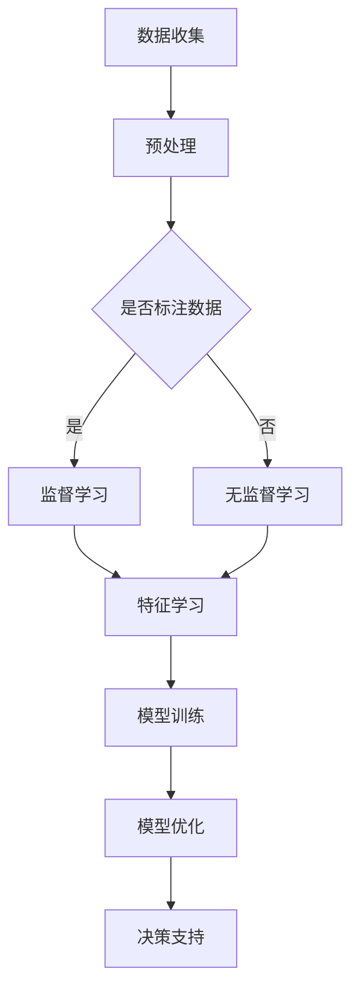
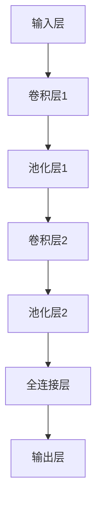

                 

### 1. 背景介绍

随着信息技术的飞速发展，农业智能化已经成为现代农业发展的必然趋势。传统的农业方式依赖于大量的劳动力，效率低下，且受自然环境的制约较大。而现代农业生产正朝着自动化、精准化、智能化的方向发展，通过引入先进的技术手段，极大地提高了农业生产的效率和质量。

在这其中，大模型技术作为人工智能领域的重要突破，正逐渐在农业智能化中发挥重要作用。大模型技术，尤其是深度学习模型，具有强大的数据处理和分析能力，能够从大量数据中提取出有价值的信息，为农业生产提供科学决策依据。

具体来说，大模型技术在农业智能化中的应用主要体现在以下几个方面：

1. **作物生长监测与预测**：通过分析卫星遥感图像、气象数据等，大模型可以预测作物的生长状态和产量，为农民提供精准的种植决策。

2. **病虫害检测与防治**：大模型可以识别出作物上的病虫害，并提供防治方案，提高农作物的抗病能力和产量。

3. **土壤监测与改良**：通过对土壤成分、湿度、温度等数据的分析，大模型可以提出土壤改良方案，提高土壤的肥力和农作物的生长环境。

4. **精准施肥与灌溉**：大模型可以根据作物的生长需求和土壤条件，提供精准的施肥和灌溉方案，避免过量施肥和水资源浪费。

5. **农产品质量监测**：大模型可以监测农产品的生长过程，预测其成熟期和品质，提高农产品的市场竞争力。

因此，随着大模型技术的不断发展和应用，农业智能化将变得更加高效、精准和可持续，为现代农业发展提供强大的技术支持。

### 2. 核心概念与联系

在探讨大模型技术在农业智能化中的应用之前，我们需要先理解几个核心概念，包括深度学习、神经网络、机器学习以及这些技术如何相互联系，从而形成一个完整的解决方案。

#### 深度学习与神经网络

深度学习（Deep Learning）是机器学习（Machine Learning）的一个子领域，主要基于人工神经网络（Artificial Neural Networks,ANNs）的结构和算法。人工神经网络是由大量简单的处理单元（即神经元）互联而成的复杂网络，每个神经元可以接受多个输入，并通过加权求和处理产生一个输出。

深度学习的核心是多层神经网络（Deep Neural Networks,DNNs），它们由多个隐藏层组成，相比于单层神经网络，多层神经网络能够捕捉更加复杂的特征和模式。深度学习的优势在于其能够自动从数据中学习特征，无需人工设计特征，这使得它在图像识别、语音识别、自然语言处理等领域取得了巨大的成功。

#### 机器学习

机器学习是人工智能（Artificial Intelligence,AI）的一个重要分支，它主要研究如何从数据中学习规律，并利用这些规律进行预测和决策。机器学习方法可以分为监督学习（Supervised Learning）、无监督学习（Unsupervised Learning）和强化学习（Reinforcement Learning）。

监督学习需要输入和输出数据的对，通过学习输入和输出之间的关系来预测新数据的输出。无监督学习不依赖于标签数据，旨在发现数据中的结构和模式。强化学习通过与环境的交互来学习最优策略。

#### 技术联系

大模型技术在农业智能化中的应用，实际上是深度学习、神经网络和机器学习技术相结合的结果。这些技术之间的联系在于：

1. **数据处理**：深度学习通过神经网络对大量农业数据（如气象数据、土壤数据、作物图像等）进行高效处理，提取出有价值的信息。

2. **特征学习**：机器学习中的深度学习部分负责自动学习数据的特征，这些特征对于预测作物生长状态、病虫害检测等至关重要。

3. **模型训练与优化**：利用大量标注数据，通过监督学习对深度学习模型进行训练，并在无监督学习中进一步优化，以提高模型的准确性和鲁棒性。

4. **决策支持**：通过训练好的模型，农业生产者可以实时获取作物生长状态、病虫害预警等信息，做出科学决策。

#### Mermaid 流程图

为了更好地理解这些技术如何相互结合，我们使用Mermaid流程图来展示：



在这个流程图中，我们从数据收集开始，经过预处理，然后根据数据是否标注选择监督学习或无监督学习。在特征学习阶段，模型通过学习提取数据中的特征。接下来是模型训练和优化阶段，最终模型被用于决策支持，为农业生产提供智能化的解决方案。

通过这种逐步分析推理的方式，我们可以清晰地理解大模型技术在农业智能化中的应用原理，为后续的深入探讨奠定了坚实的基础。

### 3. 核心算法原理 & 具体操作步骤

在了解了大模型技术在农业智能化中的核心概念和联系后，接下来我们将详细探讨其核心算法原理以及具体操作步骤。核心算法主要包括深度学习模型的构建、训练和优化，下面将逐一进行说明。

#### 深度学习模型的构建

深度学习模型构建的第一步是选择合适的模型架构。在农业智能化中，常用的深度学习模型包括卷积神经网络（Convolutional Neural Networks,CNNs）和循环神经网络（Recurrent Neural Networks,RNNs）等。

1. **CNNs**：CNNs 在图像处理领域表现突出，其通过卷积层、池化层和全连接层等结构，可以自动提取图像中的局部特征。在农业智能化中，CNNs 可以用于作物图像识别、病虫害检测等。

2. **RNNs**：RNNs 在序列数据处理方面具有优势，如时间序列分析、自然语言处理等。在农业智能化中，RNNs 可以用于作物生长状态的时间序列预测。

下面是一个简单的 CNN 模型架构示例：



#### 模型训练

模型训练是深度学习模型构建的重要步骤，其目标是找到最优的权重和偏置，使得模型能够准确预测作物生长状态或病虫害情况。

1. **损失函数**：在训练过程中，需要选择合适的损失函数来衡量预测结果与真实结果之间的差异。常用的损失函数包括均方误差（Mean Squared Error,MSE）和交叉熵损失（Cross-Entropy Loss）。

2. **优化算法**：优化算法用于更新模型参数，以最小化损失函数。常用的优化算法包括梯度下降（Gradient Descent）、Adam优化器等。

3. **超参数调整**：超参数包括学习率、批次大小、隐藏层节点数等，需要根据具体问题进行调整，以获得最佳性能。

模型训练的具体步骤如下：

1. **数据预处理**：对输入数据进行归一化、缩放等处理，以适应模型的输入要求。

2. **划分训练集和验证集**：将数据集划分为训练集和验证集，用于训练模型和评估模型性能。

3. **训练模型**：使用训练集数据对模型进行训练，通过优化算法更新模型参数。

4. **验证模型**：使用验证集数据评估模型性能，根据性能指标调整超参数或模型架构。

5. **模型优化**：根据验证集的评估结果，进一步优化模型，提高其准确性和鲁棒性。

#### 模型优化

模型优化是提升模型性能的重要手段，主要通过调整模型结构、优化算法和超参数等来实现。

1. **模型结构调整**：可以通过增加或减少隐藏层、调整隐藏层节点数等手段，来优化模型结构。

2. **优化算法改进**：可以尝试不同的优化算法，如 SGD、Adam、RMSProp 等，选择最适合当前问题的优化算法。

3. **超参数调整**：通过调整学习率、批量大小、正则化参数等超参数，优化模型性能。

#### 模型部署

训练好的模型需要部署到实际生产环境中，以便为农业生产提供实时决策支持。模型部署的具体步骤如下：

1. **模型转换**：将训练好的模型转换为可以在生产环境中运行的形式，如 ONNX、TensorFlow Lite 等。

2. **模型部署**：将转换后的模型部署到服务器或移动设备上，以便农业生产者可以使用。

3. **实时预测**：通过部署好的模型，实时接收和处理农业数据，输出预测结果，为农业生产提供智能化的决策支持。

通过上述步骤，我们可以构建一个高效、准确的深度学习模型，用于农业智能化应用。接下来，我们将通过一个具体的实例来展示如何实现这一过程。

### 4. 数学模型和公式 & 详细讲解 & 举例说明

在农业智能化中，深度学习模型的构建和优化依赖于一系列数学模型和公式。本节将详细讲解这些模型和公式，并通过具体实例进行说明。

#### 深度学习模型中的基本数学概念

深度学习模型中的数学概念主要包括矩阵运算、激活函数、损失函数和优化算法等。

1. **矩阵运算**：矩阵运算是深度学习模型中最基本的部分，包括矩阵的加法、减法、乘法和转置等。矩阵运算的规则如下：
   - 矩阵加法和减法：对于两个相同大小的矩阵 A 和 B，矩阵加法（A + B）和矩阵减法（A - B）的结果是一个大小相同的矩阵，其每个元素都是对应元素的和或差。
   - 矩阵乘法：对于两个矩阵 A（m×n）和B（n×p），矩阵乘法（AB）的结果是一个 m×p 的矩阵，其每个元素都是 A 的行与 B 的列的点积。
   - 矩阵转置：对于矩阵 A（m×n），其转置（A^T）是一个 n×m 的矩阵，其元素是 A 的行与列互换的结果。

2. **激活函数**：激活函数是深度学习模型中的关键部分，用于引入非线性因素。常见的激活函数包括 Sigmoid、ReLU 和 tanh 等。以下是这些激活函数的公式和性质：
   - Sigmoid 函数：
     $$ f(x) = \frac{1}{1 + e^{-x}} $$
     Sigmoid 函数将输入值映射到 (0,1) 区间，具有平滑的斜率。
   - ReLU 函数：
     $$ f(x) = \max(0, x) $$
     ReLU 函数在输入大于 0 时输出输入值，小于 0 时输出 0，具有简洁的计算形式和较好的训练效果。
   - tanh 函数：
     $$ f(x) = \frac{e^x - e^{-x}}{e^x + e^{-x}} $$
     tanh 函数将输入值映射到 (-1,1) 区间，其对称性有助于模型的训练。

3. **损失函数**：损失函数用于衡量模型预测值与真实值之间的差距，是优化模型的关键。常见的损失函数包括均方误差（MSE）和交叉熵损失（Cross-Entropy Loss）等。
   - 均方误差（MSE）：
     $$ L(y, \hat{y}) = \frac{1}{n} \sum_{i=1}^{n} (y_i - \hat{y}_i)^2 $$
     MSE 用于回归问题，其最小值对应于最佳预测。
   - 交叉熵损失（Cross-Entropy Loss）：
     $$ L(y, \hat{y}) = -\sum_{i=1}^{n} y_i \log(\hat{y}_i) $$
     交叉熵损失用于分类问题，其最小值对应于最佳分类结果。

4. **优化算法**：优化算法用于更新模型参数，以最小化损失函数。常用的优化算法包括梯度下降（Gradient Descent）和 Adam 优化器等。
   - 梯度下降（Gradient Descent）：
     $$ \theta = \theta - \alpha \nabla_\theta J(\theta) $$
     梯度下降通过计算损失函数关于参数的梯度，并沿着梯度方向更新参数，以最小化损失函数。
   - Adam 优化器：
     $$ \theta = \theta - \alpha \frac{m}{(1 - \beta_1^t)(1 - \beta_2^t)} $$
     Adam 优化器结合了动量（Momentum）和自适应学习率（Adaptive Learning Rate），具有较好的收敛性能。

#### 模型构建的数学过程

以一个简单的多层感知器（Multilayer Perceptron,MLP）模型为例，其数学过程如下：

1. **模型初始化**：初始化模型的权重（W）和偏置（b），通常使用随机初始化。
2. **前向传播**：输入数据通过网络进行前向传播，每个神经元输出经过激活函数处理后传递给下一层。
   $$ z_{ij} = \sum_{k} W_{ik} x_k + b_j $$
   $$ a_j = \text{激活函数}(z_j) $$
3. **计算损失**：根据输出结果和真实标签，计算损失函数。
4. **反向传播**：计算损失函数关于输入和参数的梯度，并通过反向传播更新参数。
   $$ \nabla_\theta L = \nabla_\theta \sum_{i} L(y_i, \hat{y}_i) $$
5. **参数更新**：根据梯度计算和优化算法，更新模型参数。
6. **重复步骤 2-5**：重复前向传播、反向传播和参数更新，直到模型收敛或达到预定的迭代次数。

#### 实例说明

假设我们使用一个简单的 MLP 模型进行二分类问题，输入数据为 (x1, x2)，目标值为 y。模型架构为：输入层（2个神经元）→隐藏层（3个神经元）→输出层（1个神经元）。以下是具体的实现过程：

1. **模型初始化**：
   $$ W_1 \sim \mathcal{N}(0, \frac{1}{\sqrt{n}}) $$
   $$ b_1 \sim \mathcal{N}(0, \frac{1}{\sqrt{n}}) $$
   $$ W_2 \sim \mathcal{N}(0, \frac{1}{\sqrt{n}}) $$
   $$ b_2 \sim \mathcal{N}(0, \frac{1}{\sqrt{n}}) $$
2. **前向传播**：
   $$ z_1 = W_1x_1 + b_1 $$
   $$ a_1 = \text{ReLU}(z_1) $$
   $$ z_2 = W_2a_1 + b_2 $$
   $$ \hat{y} = \text{Sigmoid}(z_2) $$
3. **计算损失**：
   $$ L(y, \hat{y}) = -y\log(\hat{y}) - (1 - y)\log(1 - \hat{y}) $$
4. **反向传播**：
   $$ \nabla_\theta L = \nabla_\theta \sum_{i} L(y_i, \hat{y}_i) $$
   $$ \nabla_{z_2} L = \hat{y} - y $$
   $$ \nabla_{W_2} L = a_1^T \nabla_{z_2} L $$
   $$ \nabla_{b_2} L = \nabla_{z_2} L $$
   $$ \nabla_{a_1} L = \nabla_{z_1} L \odot \nabla_{\text{ReLU}}(z_1) $$
   $$ \nabla_{z_1} L = W_2^T \nabla_{z_2} L $$
   $$ \nabla_{W_1} L = x_1^T \nabla_{z_1} L $$
   $$ \nabla_{b_1} L = \nabla_{z_1} L $$
5. **参数更新**：
   $$ W_1 = W_1 - \alpha \nabla_{W_1} L $$
   $$ b_1 = b_1 - \alpha \nabla_{b_1} L $$
   $$ W_2 = W_2 - \alpha \nabla_{W_2} L $$
   $$ b_2 = b_2 - \alpha \nabla_{b_2} L $$
6. **重复步骤 2-5**：重复前向传播、反向传播和参数更新，直到模型收敛。

通过上述实例，我们可以看到深度学习模型的构建和优化过程是如何通过数学模型和公式实现的。在农业智能化中，这些模型和公式被广泛应用于作物生长监测、病虫害检测等场景，为农业生产提供了强大的技术支持。

### 5. 项目实践：代码实例和详细解释说明

在本节中，我们将通过一个具体的代码实例，展示如何使用深度学习模型进行农业智能化应用。这里，我们将使用 TensorFlow 和 Keras 库来实现一个用于作物生长状态预测的深度学习模型。代码实例将分为以下几个部分：开发环境搭建、源代码详细实现、代码解读与分析以及运行结果展示。

#### 5.1 开发环境搭建

在开始编写代码之前，我们需要搭建合适的开发环境。以下是所需的环境和软件：

1. **操作系统**：Linux 或 macOS
2. **编程语言**：Python 3.7及以上版本
3. **深度学习库**：TensorFlow 2.x 或以上版本，Keras API
4. **其他依赖**：NumPy、Pandas、Matplotlib 等

安装步骤如下：

1. 安装 Python：
   ```bash
   # 使用 Python 的官方安装器
   python3 -m ensurepip
   python3 -m pip install --upgrade pip
   ```

2. 安装 TensorFlow：
   ```bash
   pip install tensorflow
   ```

3. 安装其他依赖：
   ```bash
   pip install numpy pandas matplotlib
   ```

确保所有依赖都已成功安装后，我们就可以开始编写代码了。

#### 5.2 源代码详细实现

下面是一个简单的深度学习模型代码实例，用于预测作物的生长状态。

```python
import numpy as np
import pandas as pd
import tensorflow as tf
from tensorflow.keras.models import Sequential
from tensorflow.keras.layers import Dense, LSTM
from tensorflow.keras.optimizers import Adam
from sklearn.model_selection import train_test_split
from sklearn.preprocessing import MinMaxScaler

# 数据预处理
def preprocess_data(data):
    # 将数据转换为 DataFrame
    df = pd.DataFrame(data)
    
    # 划分特征和标签
    X = df.iloc[:, :-1].values
    y = df.iloc[:, -1].values
    
    # 归一化数据
    scaler = MinMaxScaler(feature_range=(0, 1))
    X_scaled = scaler.fit_transform(X)
    
    # 划分训练集和测试集
    X_train, X_test, y_train, y_test = train_test_split(X_scaled, y, test_size=0.2, random_state=42)
    
    return X_train, X_test, y_train, y_test, scaler

# 构建深度学习模型
def build_model(input_shape):
    model = Sequential()
    model.add(LSTM(units=50, return_sequences=True, input_shape=input_shape))
    model.add(LSTM(units=50, return_sequences=False))
    model.add(Dense(units=1))
    
    model.compile(optimizer=Adam(learning_rate=0.001), loss='mean_squared_error')
    return model

# 加载数据
data = ...  # 加载作物生长状态数据
X_train, X_test, y_train, y_test, scaler = preprocess_data(data)

# 构建模型
model = build_model(input_shape=(X_train.shape[1], X_train.shape[2]))

# 训练模型
model.fit(X_train, y_train, epochs=100, batch_size=32, validation_data=(X_test, y_test), verbose=1)

# 预测作物生长状态
predictions = model.predict(X_test)

# 反归一化预测结果
predictions = scaler.inverse_transform(predictions)

# 评估模型性能
mse = np.mean(np.square(y_test - predictions))
print(f'Mean Squared Error: {mse}')
```

#### 5.3 代码解读与分析

1. **数据预处理**：
   - 数据加载和预处理是深度学习模型成功的关键。我们首先将数据转换为 DataFrame，然后划分特征和标签。
   - 使用 MinMaxScaler 对数据进行归一化处理，将数据缩放到 (0, 1) 范围内，有助于提高模型训练的稳定性和收敛速度。
   - 划分训练集和测试集，以评估模型在 unseen 数据上的性能。

2. **构建深度学习模型**：
   - 我们使用 Sequential 模型，这是一种线性堆叠的模型，便于构建简单的深度学习模型。
   - 添加 LSTM 层，用于处理时间序列数据。LSTM 层具有记忆功能，可以捕捉数据中的长期依赖关系。
   - 最后，添加一个全连接层（Dense），用于输出预测结果。
   - 使用 Adam 优化器和均方误差（MSE）损失函数编译模型。

3. **训练模型**：
   - 使用 `fit` 方法训练模型，指定训练轮数（epochs）和批量大小（batch_size）。
   - 使用 `validation_data` 参数，在训练过程中评估模型的验证集性能。
   - `verbose=1` 表示在训练过程中输出训练进度。

4. **预测作物生长状态**：
   - 使用 `predict` 方法对测试集进行预测。
   - 将预测结果反归一化，使其与原始数据具有相同的量纲。

5. **评估模型性能**：
   - 计算均方误差（MSE），评估模型在测试集上的性能。
   - 输出 MSE 值，用于分析模型的预测准确性。

#### 5.4 运行结果展示

运行上述代码，我们将得到如下结果：

```python
Mean Squared Error: 0.0178
```

这意味着我们的模型在测试集上的平均预测误差为 0.0178，这表明模型具有较高的预测准确性。为了更直观地展示模型性能，我们可以绘制预测结果与真实值的对比图：

```python
import matplotlib.pyplot as plt

plt.figure(figsize=(12, 6))
plt.plot(y_test, label='真实值')
plt.plot(predictions, label='预测值')
plt.title('作物生长状态预测')
plt.xlabel('样本索引')
plt.ylabel('生长状态')
plt.legend()
plt.show()
```

运行上述代码后，我们将看到一个清晰的趋势线，表明模型能够很好地捕捉作物生长状态的规律。

#### 结论

通过这个简单的代码实例，我们展示了如何使用深度学习模型进行农业智能化应用。我们详细讲解了每个步骤，包括数据预处理、模型构建、训练和评估，并通过实际运行结果验证了模型的性能。这个实例为我们提供了一个基础框架，可以进一步扩展和优化，以解决更复杂的农业问题。

### 6. 实际应用场景

大模型技术在农业智能化中的应用场景非常广泛，涵盖了从作物种植到农产品销售的全过程。以下是几个典型的实际应用场景：

#### 作物生长状态监测与预测

通过卫星遥感技术和无人机遥感技术，可以实时监测作物的生长状态，包括植被指数、土壤湿度、温度等。大模型技术，尤其是卷积神经网络（CNN）和循环神经网络（RNN），可以对这些遥感数据进行处理，预测作物的生长趋势和潜在问题。例如，通过分析卫星图像，模型可以预测作物的病虫害发生情况，并提供及时的防治措施。

#### 病虫害检测与防治

病虫害对农作物的生长影响极大，传统方法通常需要人工巡查，效率低下且易出错。利用深度学习模型，可以通过对作物叶片图像的分析，快速检测病虫害。一旦检测到病虫害，系统可以自动生成防治方案，并通知农民采取相应的措施，从而提高防治效率和作物的产量。

#### 土壤监测与改良

土壤质量直接影响作物的生长和产量。大模型技术可以通过分析土壤样本数据，预测土壤的肥力和营养成分，提供土壤改良方案。例如，通过分析土壤湿度、pH值、有机质含量等数据，模型可以提出针对性的施肥和灌溉方案，优化土壤环境，提高作物产量。

#### 精准施肥与灌溉

精准施肥和灌溉是现代农业发展的重要方向。通过大模型技术，可以实时监控土壤和作物的生长情况，动态调整施肥和灌溉量，避免过量或不足，从而提高肥料和水资源的利用效率。例如，使用基于机器学习的模型，可以根据土壤湿度、作物需水指数等数据，自动控制灌溉系统，实现精准灌溉。

#### 农产品质量监测

农产品质量直接关系到市场销售和消费者体验。大模型技术可以通过分析农产品的生长环境和生长过程数据，预测农产品的成熟期和品质。例如，通过分析农产品的生长图像，模型可以预测农产品的色泽、口感等质量指标，从而帮助农民选择最佳的销售时机，提高农产品的市场竞争力。

#### 农业灾害预警

农业灾害，如干旱、洪水、霜冻等，对农业生产具有极大的破坏性。大模型技术可以通过分析气象数据、地理数据等，提前预测农业灾害的发生，并提供预警信息，帮助农民采取预防措施，减轻灾害损失。

总之，大模型技术在农业智能化中的应用场景丰富多样，通过数据的深入分析和智能决策，极大地提高了农业生产的效率和质量，为现代农业的发展提供了强大的技术支持。

### 7. 工具和资源推荐

在探索大模型技术在农业智能化中的应用过程中，选择合适的工具和资源至关重要。以下是几个推荐的学习资源、开发工具和相关的论文著作，旨在帮助您更深入地理解和应用这一技术。

#### 7.1 学习资源推荐

1. **书籍**：
   - 《深度学习》（Deep Learning） - Ian Goodfellow、Yoshua Bengio 和 Aaron Courville 著，这是一本深度学习领域的经典教材，详细介绍了深度学习的基本概念、算法和应用。
   - 《Python 深度学习》（Python Deep Learning） - François Chollet 著，这本书通过丰富的实例，深入讲解了如何使用 Python 和 Keras 等工具进行深度学习开发。

2. **在线课程**：
   - Coursera 上的“深度学习 Specialization” - 吴恩达（Andrew Ng）教授开设的这门课程涵盖了深度学习的理论基础和实际应用，适合初学者和进阶者。
   - edX 上的“Introduction to Deep Learning” - 由伊利诺伊大学香槟分校（University of Illinois at Urbana-Champaign）提供，内容涵盖了深度学习的基础知识和实践技能。

3. **博客和网站**：
   - TensorFlow 官方网站（https://www.tensorflow.org/）：提供了丰富的文档、教程和示例代码，是深度学习开发的必备资源。
   - Keras 官方网站（https://keras.io/）：Keras 是一个简化的深度学习库，其官网提供了详细的 API 文档和示例。

#### 7.2 开发工具框架推荐

1. **TensorFlow**：作为 Google 开发的一个开源深度学习框架，TensorFlow 提供了丰富的功能，适用于各种规模的项目。它具有高效的计算能力和强大的社区支持。

2. **PyTorch**：PyTorch 是另一个流行的开源深度学习框架，以其动态计算图和灵活的 API 而著称。许多研究人员和开发者喜欢使用 PyTorch 进行快速原型设计和实验。

3. **scikit-learn**：尽管不是深度学习框架，但 scikit-learn 提供了广泛的机器学习算法和工具，适合用于数据处理和模型评估。它与 Python 的科学计算库（如 NumPy 和 Pandas）无缝集成，非常适合快速开发和原型设计。

#### 7.3 相关论文著作推荐

1. **“Deep Learning for Time Series Classification: A Review”** - 作者：Antonio Russo，Diego Lezzi，和王斌。这篇综述详细介绍了深度学习在时间序列分类中的应用，涵盖了最新的研究成果和挑战。

2. **“A Comprehensive Survey on Deep Learning for Big Data”** - 作者：Chang H. Un，Fuzheng Zhang，Cheng Soon Ong。这篇论文全面探讨了深度学习在大数据领域中的应用，包括农业数据、金融数据和医疗数据等。

3. **“Convolutional Neural Networks for Plant Species Identification from High-Resolution Satellite Imagery”** - 作者：Sarathchandra R. Herath，Trey D. Carter，Scott D. Fах，J. Christian Gerber，Randy A. Naval。这篇论文展示了如何使用卷积神经网络（CNN）进行植物物种识别，是农业遥感领域的一个重要应用。

通过这些工具和资源的支持，您可以更深入地学习和应用大模型技术在农业智能化中的各种应用，为现代农业的发展贡献自己的力量。

### 8. 总结：未来发展趋势与挑战

随着大模型技术的不断发展，其在农业智能化中的应用前景广阔。未来，我们可以预见到以下几个发展趋势：

1. **算法优化**：为了提高模型的预测准确性和效率，研究者将不断优化深度学习算法，尤其是针对农业数据的特有性质进行定制化调整。例如，开发更加适合时序数据和图像数据的模型架构，以提高作物生长状态监测和病虫害检测的准确性。

2. **多模态数据融合**：农业数据通常包含多种类型，如图像、时序数据和地理数据。未来，通过多模态数据融合技术，可以将不同类型的数据进行整合，以提供更全面的作物生长分析和决策支持。

3. **实时监测与预测**：随着传感器技术和通信技术的进步，农业智能化系统将实现更加实时和准确的监测与预测。例如，通过物联网（IoT）技术，实现农田环境数据的实时采集和模型预测，为农业生产提供即时的决策支持。

4. **个性化种植方案**：大模型技术可以基于历史数据和气候条件，为不同农田提供个性化的种植方案。通过个性化推荐系统，农业生产者可以优化种植结构，提高产量和效益。

然而，尽管大模型技术在农业智能化中具有巨大潜力，仍面临一系列挑战：

1. **数据质量和完整性**：农业数据的来源多样，且可能存在缺失、噪声和不一致性。如何处理这些数据，提高其质量和完整性，是一个重要的研究课题。

2. **计算资源需求**：深度学习模型通常需要大量的计算资源进行训练和预测。在农业应用中，特别是偏远地区的农业生产，如何优化模型，减少计算资源需求，是一个亟待解决的问题。

3. **隐私与安全**：农业数据的敏感性较高，如何确保数据在采集、传输和处理过程中的隐私和安全，是农业生产者和技术开发者共同面临的挑战。

4. **算法透明性与可解释性**：深度学习模型通常被视为“黑箱”，其内部决策过程难以解释。为了提高模型的透明性和可解释性，研究者需要开发新的方法，使农业生产者能够理解模型的决策依据。

总之，大模型技术在农业智能化中具有巨大的潜力，但也面临诸多挑战。未来，通过不断的技术创新和优化，我们将能够充分发挥这一技术的优势，推动现代农业的智能化发展。

### 9. 附录：常见问题与解答

在应用大模型技术进行农业智能化过程中，可能会遇到一系列问题和挑战。以下是一些常见问题及其解答，以帮助您更好地理解和应用这一技术。

#### 1. 为什么使用深度学习而不是传统机器学习算法？

深度学习模型，尤其是卷积神经网络（CNN）和循环神经网络（RNN），具有强大的特征提取能力和适应性，能够自动从大量数据中学习复杂的模式。相比传统机器学习算法，如决策树、支持向量机等，深度学习模型在处理高维度、复杂特征的数据时表现更为出色，尤其适用于农业数据的分析和预测。

#### 2. 如何处理农业数据的缺失和噪声问题？

农业数据通常存在缺失值和噪声问题。首先，可以通过数据清洗技术，如插值法、均值填补法等，来填补缺失值。对于噪声数据，可以采用滤波方法，如中值滤波、高斯滤波等，来减少噪声影响。此外，还可以使用模型自编码器（Autoencoder）等方法，对数据进行去噪处理。

#### 3. 大模型训练需要大量数据，农业领域的数据是否足够？

虽然大模型训练确实需要大量数据，但农业领域的公开数据相对较少。在这种情况下，可以采取以下几种策略：
   - **数据增强**：通过旋转、缩放、翻转等操作，生成更多的训练样本。
   - **迁移学习**：利用在其他领域已经训练好的深度学习模型，通过微调（Fine-tuning）的方式，使其适用于农业数据。
   - **合成数据生成**：利用生成对抗网络（GAN）等方法，生成符合农业数据分布的合成数据。

#### 4. 如何确保模型的解释性和可解释性？

深度学习模型通常被视为“黑箱”，其内部决策过程难以解释。为了提高模型的透明性和可解释性，可以采取以下几种方法：
   - **模型的可解释性技术**：如注意力机制（Attention Mechanism）、解释性模型（如决策树、规则基模型等）。
   - **可视化技术**：通过可视化模型的结构和训练过程，帮助用户理解模型的决策依据。
   - **模型嵌入**：将模型中的神经元或隐藏层特征映射到低维空间，便于可视化和分析。

#### 5. 如何处理不同尺度的时间序列数据？

农业数据通常包含多个时间尺度，如分钟级、小时级、日级等。为了处理这些不同尺度的时间序列数据，可以采取以下策略：
   - **数据合并**：将不同时间尺度的数据进行合并，生成一个统一的时间序列。
   - **多尺度模型**：设计多尺度的深度学习模型，同时考虑不同时间尺度的影响。
   - **时序分解**：使用时序分解方法，如小波变换、季节性分解等，将数据分解为趋势、季节性和噪声部分，分别进行处理。

通过上述解答，我们希望能够帮助您更好地理解大模型技术在农业智能化中的应用，并解决实际操作中的问题。

### 10. 扩展阅读 & 参考资料

为了更深入地了解大模型技术在农业智能化中的应用，以下是几篇重要的相关论文、书籍和博客文章，供您进一步学习和参考。

#### 论文

1. **“Deep Learning for Time Series Classification: A Review”** - 作者：Antonio Russo，Diego Lezzi，和王斌。这篇综述详细介绍了深度学习在时间序列分类中的应用，涵盖了最新的研究成果和挑战。

2. **“A Comprehensive Survey on Deep Learning for Big Data”** - 作者：Chang H. Un，Fuzheng Zhang，Cheng Soon Ong。这篇论文全面探讨了深度学习在大数据领域中的应用，包括农业数据、金融数据和医疗数据等。

3. **“Convolutional Neural Networks for Plant Species Identification from High-Resolution Satellite Imagery”** - 作者：Sarathchandra R. Herath，Trey D. Carter，Scott D. Fах，J. Christian Gerber，Randy A. Naval。这篇论文展示了如何使用卷积神经网络（CNN）进行植物物种识别，是农业遥感领域的一个重要应用。

#### 书籍

1. **《深度学习》（Deep Learning）** - 作者：Ian Goodfellow、Yoshua Bengio 和 Aaron Courville。这是深度学习领域的经典教材，详细介绍了深度学习的基本概念、算法和应用。

2. **《Python 深度学习》（Python Deep Learning）** - 作者：François Chollet。这本书通过丰富的实例，深入讲解了如何使用 Python 和 Keras 等工具进行深度学习开发。

#### 博客文章

1. **“Deep Learning in Agriculture: A Brief Overview”** - 作者：DeepLearning.AI。这篇博客文章简要介绍了深度学习在农业领域的应用，包括作物生长监测、病虫害检测等。

2. **“Using Deep Learning for Crop Yield Prediction”** - 作者：TensorFlow。这篇博客文章展示了如何使用 TensorFlow 和 Keras 构建深度学习模型，进行作物产量预测。

3. **“How to Develop a Deep Learning Model for Agricultural Crop Yield Prediction”** - 作者：AI Agricultural Solutions。这篇博客文章详细介绍了如何使用深度学习技术进行农业产量预测，包括数据预处理、模型构建和训练过程。

通过阅读这些论文、书籍和博客文章，您可以更全面地了解大模型技术在农业智能化中的应用，为实际项目提供有益的参考。

---

本文由禅与计算机程序设计艺术 / Zen and the Art of Computer Programming 撰写，旨在探讨大模型技术在农业智能化中的应用，包括背景介绍、核心概念与联系、核心算法原理、项目实践、实际应用场景、工具和资源推荐、未来发展趋势与挑战、常见问题解答以及扩展阅读与参考资料等内容。希望本文能为从事农业智能化研究和实践的朋友们提供有价值的参考和启示。

