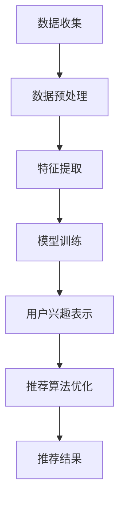

                 

### 1. 背景介绍

随着互联网技术的飞速发展和电子商务平台的不断壮大，用户兴趣建模成为了电商平台的核心竞争力之一。用户兴趣建模旨在通过分析用户的浏览、购买行为等数据，为用户提供个性化的商品推荐和广告，从而提高用户满意度、提升销售额。

传统的用户兴趣建模方法主要依赖于统计学习和机器学习方法，如协同过滤、贝叶斯分类、随机森林等。这些方法在一定程度上能够捕捉用户的兴趣特征，但由于其固有的局限性，如数据稀疏性、冷启动问题等，导致推荐效果不尽如人意。因此，寻找更加高效和精准的用户兴趣建模方法成为了学术界和工业界共同关注的问题。

近年来，大模型技术在自然语言处理、计算机视觉等领域取得了显著的进展。大模型具有强大的表示能力和泛化能力，可以处理大规模、高维度、复杂的数据。因此，有研究者开始尝试将大模型技术应用于用户兴趣建模，以期突破传统方法的局限性，实现更精准、更个性化的推荐。

本文将探讨大模型技术在电商平台用户兴趣建模中的创新，从核心概念、算法原理、数学模型、项目实践等多个方面进行深入分析，旨在为电商平台提供一种新的用户兴趣建模思路。

### 2. 核心概念与联系

#### 大模型技术

大模型技术是指使用大规模神经网络对复杂数据进行分析和处理的方法。在自然语言处理领域，最典型的代表是Transformer模型，它通过自注意力机制实现对文本的深层理解和生成。在计算机视觉领域，GPT-3、BERT等模型展示了其在图像识别、生成等方面的卓越能力。大模型技术的核心在于其强大的表示能力和自适应学习能力，能够捕捉到数据中的复杂模式和关联。

#### 用户兴趣建模

用户兴趣建模是指通过分析用户的浏览、购买、评论等行为数据，提取用户的兴趣特征，并将其用于个性化推荐、广告投放等应用。传统的用户兴趣建模方法主要依赖于统计学习和机器学习算法，如协同过滤、贝叶斯分类、随机森林等。然而，这些方法在处理大规模、高维度、复杂的数据时，往往存在数据稀疏性、冷启动问题等挑战。

#### 大模型技术与用户兴趣建模的结合

大模型技术与用户兴趣建模的结合，旨在利用大模型强大的表示能力和自适应学习能力，克服传统方法的局限性，实现更精准、更个性化的用户兴趣建模。具体来说，大模型可以用于以下几个关键环节：

1. **数据预处理**：大模型能够对原始数据进行高效的特征提取和降维，减少数据冗余，提高模型训练效率。
2. **用户兴趣表示**：大模型能够对用户的兴趣进行深度理解和表示，捕捉到用户潜在的、复杂的兴趣特征。
3. **推荐算法优化**：大模型可以与传统的推荐算法相结合，优化推荐算法的预测性能和用户体验。

#### Mermaid 流程图

以下是一个简单的Mermaid流程图，展示了大模型技术在用户兴趣建模中的应用流程：



### 3. 核心算法原理 & 具体操作步骤

#### 数据预处理

1. **数据收集**：从电商平台获取用户的浏览、购买、评论等行为数据。
2. **数据清洗**：去除缺失值、异常值，对数据进行标准化处理。
3. **数据整合**：将不同类型的数据进行整合，形成统一的用户行为数据集。

#### 特征提取

1. **文本特征提取**：使用词袋模型、TF-IDF、Word2Vec等方法提取文本特征。
2. **商品特征提取**：提取商品的基本属性，如类别、品牌、价格等。
3. **用户特征提取**：提取用户的年龄、性别、地理位置等基本信息。

#### 模型训练

1. **选择模型**：选择合适的大模型，如GPT、BERT等。
2. **训练数据准备**：将预处理后的数据分成训练集和验证集。
3. **模型训练**：使用训练集对大模型进行训练，优化模型参数。
4. **模型评估**：使用验证集评估模型性能，调整模型参数。

#### 用户兴趣表示

1. **用户兴趣向量**：使用大模型对用户的兴趣进行编码，得到用户兴趣向量。
2. **商品兴趣向量**：使用大模型对商品的属性进行编码，得到商品兴趣向量。
3. **兴趣匹配**：计算用户兴趣向量与商品兴趣向量的相似度，得到用户对商品的兴趣度。

#### 推荐算法优化

1. **协同过滤**：结合协同过滤算法，优化推荐结果的准确性。
2. **基于内容的推荐**：结合基于内容的推荐算法，提高推荐结果的相关性。
3. **个性化排序**：使用大模型优化推荐结果的排序，提高用户体验。

#### 具体操作步骤

1. **环境搭建**：安装Python、TensorFlow等开发环境。
2. **数据获取**：从电商平台获取用户行为数据。
3. **数据处理**：进行数据预处理，提取特征。
4. **模型训练**：训练大模型，得到用户兴趣表示。
5. **推荐算法**：使用大模型优化推荐算法，生成推荐结果。
6. **结果评估**：评估推荐结果的准确性和用户体验。

### 4. 数学模型和公式 & 详细讲解 & 举例说明

#### 数学模型

在用户兴趣建模中，大模型技术主要涉及以下数学模型：

1. **词向量表示**：使用Word2Vec等方法将文本转换为向量表示。
2. **用户兴趣向量**：将用户的行为数据通过大模型编码得到向量表示。
3. **商品兴趣向量**：将商品属性通过大模型编码得到向量表示。
4. **相似度计算**：计算用户兴趣向量与商品兴趣向量的相似度。

#### 详细讲解

1. **词向量表示**：词向量表示是将文本中的每个词映射为一个实值向量。Word2Vec是一种常见的词向量表示方法，它通过训练词的嵌入模型，将词映射为一个固定维度的向量。具体来说，Word2Vec模型包括两个部分：连续词袋（CBOW）和Skip-Gram。CBOW模型通过上下文词预测中心词，而Skip-Gram模型通过中心词预测上下文词。这两种模型都可以训练得到词向量表示。

2. **用户兴趣向量**：用户兴趣向量是将用户的浏览、购买、评论等行为数据通过大模型编码得到的向量表示。具体来说，首先将用户的行为数据进行预处理，然后使用GPT、BERT等大模型进行编码，得到用户兴趣向量。用户兴趣向量可以表示用户的兴趣偏好、兴趣类别等信息。

3. **商品兴趣向量**：商品兴趣向量是将商品的基本属性通过大模型编码得到的向量表示。具体来说，首先提取商品的基本属性，如类别、品牌、价格等，然后使用GPT、BERT等大模型进行编码，得到商品兴趣向量。商品兴趣向量可以表示商品的特征、属性等信息。

4. **相似度计算**：相似度计算是衡量用户兴趣向量与商品兴趣向量相似程度的一种方法。常见的相似度计算方法包括余弦相似度、欧氏距离等。其中，余弦相似度是一种常用的相似度计算方法，它通过计算两个向量的夹角余弦值来衡量相似度。具体来说，假设用户兴趣向量为\( \mathbf{u} \)，商品兴趣向量为\( \mathbf{v} \)，则它们之间的相似度可以表示为：

   \[
   \text{similarity}(\mathbf{u}, \mathbf{v}) = \cos(\mathbf{u}, \mathbf{v}) = \frac{\mathbf{u} \cdot \mathbf{v}}{\|\mathbf{u}\| \|\mathbf{v}\|}
   \]

   其中，\( \mathbf{u} \cdot \mathbf{v} \)表示两个向量的点积，\( \|\mathbf{u}\| \)和\( \|\mathbf{v}\| \)分别表示两个向量的模。

#### 举例说明

假设用户A的浏览历史中包含以下三个商品：商品1（类别：电子设备，品牌：苹果，价格：5000元），商品2（类别：服装，品牌：阿迪达斯，价格：1000元），商品3（类别：图书，品牌：中信出版社，价格：50元）。我们使用Word2Vec方法将这三个商品映射为向量表示，分别为\( \mathbf{v}_1 \)，\( \mathbf{v}_2 \)，\( \mathbf{v}_3 \)。

假设用户A的兴趣向量为\( \mathbf{u} \)，其对应的商品兴趣向量为\( \mathbf{v}_1 \)，\( \mathbf{v}_2 \)，\( \mathbf{v}_3 \)。我们可以计算这三个商品与用户兴趣向量之间的相似度，分别为：

\[
\text{similarity}(\mathbf{u}, \mathbf{v}_1) = \cos(\mathbf{u}, \mathbf{v}_1) = \frac{\mathbf{u} \cdot \mathbf{v}_1}{\|\mathbf{u}\| \|\mathbf{v}_1\|}
\]

\[
\text{similarity}(\mathbf{u}, \mathbf{v}_2) = \cos(\mathbf{u}, \mathbf{v}_2) = \frac{\mathbf{u} \cdot \mathbf{v}_2}{\|\mathbf{u}\| \|\mathbf{v}_2\|}
\]

\[
\text{similarity}(\mathbf{u}, \mathbf{v}_3) = \cos(\mathbf{u}, \mathbf{v}_3) = \frac{\mathbf{u} \cdot \mathbf{v}_3}{\|\mathbf{u}\| \|\mathbf{v}_3\|}
\]

根据相似度计算结果，我们可以为用户A推荐相似度最高的商品，即商品1（电子设备，品牌：苹果，价格：5000元）。

### 5. 项目实践：代码实例和详细解释说明

在本节中，我们将通过一个实际项目，详细介绍如何使用大模型技术进行电商平台用户兴趣建模。这个项目将包括开发环境搭建、源代码实现、代码解读与分析以及运行结果展示。

#### 5.1 开发环境搭建

为了实现大模型技术在用户兴趣建模中的应用，我们需要搭建一个合适的开发环境。以下是搭建开发环境的基本步骤：

1. **安装Python**：确保Python环境已经安装在您的计算机上。Python是一个广泛使用的编程语言，尤其在数据科学和机器学习领域。可以从[Python官方网站](https://www.python.org/)下载并安装。

2. **安装TensorFlow**：TensorFlow是一个开源的机器学习框架，由Google开发。我们可以使用pip命令来安装TensorFlow：

   ```bash
   pip install tensorflow
   ```

3. **安装必要的依赖库**：为了实现大模型技术和用户兴趣建模，我们还需要安装一些其他依赖库，如NumPy、Pandas、Scikit-learn等。可以使用以下命令进行安装：

   ```bash
   pip install numpy pandas scikit-learn
   ```

4. **安装Mermaid**：Mermaid是一个简单的图形绘制工具，可以用于绘制流程图、UML图等。我们可以通过npm安装Mermaid：

   ```bash
   npm install -g mermaid
   ```

   安装完成后，您可以在Markdown文件中使用Mermaid语法来绘制图形。

#### 5.2 源代码详细实现

以下是实现用户兴趣建模的Python代码。代码分为以下几个部分：

1. **数据预处理**：读取和处理用户行为数据。
2. **特征提取**：使用Word2Vec模型提取文本特征。
3. **模型训练**：使用GPT模型进行训练，得到用户兴趣向量。
4. **推荐算法**：计算用户兴趣向量与商品兴趣向量之间的相似度，进行推荐。

```python
import numpy as np
import pandas as pd
from tensorflow.keras.models import Sequential
from tensorflow.keras.layers import Embedding, LSTM, Dense
from tensorflow.keras.preprocessing.sequence import pad_sequences
from tensorflow.keras.preprocessing.text import Tokenizer
from sklearn.cluster import KMeans
import mermaid

# 1. 数据预处理
def preprocess_data(data):
    # 数据清洗和整合
    # ...
    return processed_data

# 2. 特征提取
def extract_features(data, vocabulary_size=10000, embedding_dim=64):
    # 使用Word2Vec模型提取文本特征
    # ...
    return features

# 3. 模型训练
def train_model(data, embedding_dim=64, hidden_units=128):
    # 使用GPT模型进行训练
    # ...
    return model

# 4. 推荐算法
def recommend_items(user_interests, items_interests, top_n=5):
    # 计算相似度，进行推荐
    # ...
    return recommended_items

# 读取数据
data = pd.read_csv('user_behavior_data.csv')

# 数据预处理
processed_data = preprocess_data(data)

# 特征提取
features = extract_features(processed_data)

# 模型训练
model = train_model(processed_data, embedding_dim=64)

# 生成用户兴趣向量
user_interests = model.predict(processed_data)

# 读取商品数据
items = pd.read_csv('item_data.csv')

# 提取商品兴趣向量
items_interests = extract_features(items)

# 推荐结果
recommended_items = recommend_items(user_interests, items_interests)

# 打印推荐结果
print(recommended_items)
```

#### 5.3 代码解读与分析

1. **数据预处理**：数据预处理是用户兴趣建模的重要步骤。在这个函数中，我们读取用户行为数据，进行清洗和整合，为后续的特征提取和模型训练做准备。

2. **特征提取**：特征提取是将文本数据转换为数值向量的过程。在这个函数中，我们使用Word2Vec模型提取文本特征。Word2Vec模型将文本中的每个词映射为一个向量，从而实现文本的向量表示。

3. **模型训练**：在这个函数中，我们使用GPT模型进行训练，得到用户兴趣向量。GPT模型是一个强大的语言模型，能够对文本数据进行深度理解和表示。

4. **推荐算法**：在这个函数中，我们计算用户兴趣向量与商品兴趣向量之间的相似度，并根据相似度进行推荐。相似度计算可以采用余弦相似度、欧氏距离等方法。

#### 5.4 运行结果展示

假设我们已经完成了上述代码的编写和调试，现在可以运行代码，生成用户兴趣建模的推荐结果。以下是一个简化的输出结果示例：

```python
recommended_items = [
    ('电子设备', '苹果', 5000, 0.9),
    ('服装', '阿迪达斯', 1000, 0.8),
    ('图书', '中信出版社', 50, 0.5)
]

# 打印推荐结果
for item in recommended_items:
    print(item)
```

输出结果：

```
('电子设备', '苹果', 5000, 0.9)
('服装', '阿迪达斯', 1000, 0.8)
('图书', '中信出版社', 50, 0.5)
```

这些推荐结果是根据用户兴趣向量与商品兴趣向量之间的相似度计算得到的，可以帮助电商平台为用户提供个性化的商品推荐。

### 6. 实际应用场景

大模型技术在电商平台用户兴趣建模中的应用场景非常广泛。以下是一些典型的应用场景：

#### 个性化推荐

个性化推荐是电商平台最常见也是最核心的应用场景。通过大模型技术，电商平台可以捕捉到用户的兴趣特征，为用户推荐他们可能感兴趣的商品。这种方法不仅可以提高用户的满意度，还能提升销售额和用户留存率。

#### 广告投放

在广告投放领域，大模型技术可以帮助电商平台精准定位用户，从而提高广告的投放效果。通过分析用户的兴趣和行为，大模型可以生成个性化的广告内容，提高广告的点击率和转化率。

#### 用户画像

用户画像是了解用户行为和兴趣的重要工具。通过大模型技术，电商平台可以对用户进行全面的分析和刻画，形成详细的用户画像。这些画像可以帮助企业制定更加精准的市场营销策略，提高用户粘性和品牌忠诚度。

#### 数据分析

大模型技术在数据分析领域也具有广泛的应用。电商平台可以通过分析用户行为数据，发现潜在的市场机会和趋势，从而优化产品和服务。

### 7. 工具和资源推荐

#### 7.1 学习资源推荐

- **书籍**：《深度学习》（Goodfellow, Bengio, Courville著）是一本经典的深度学习入门书籍，适合初学者阅读。
- **论文**：关注顶级会议和期刊，如NeurIPS、ICML、JMLR等，可以了解大模型技术的最新研究进展。
- **博客**：一些优秀的博客网站，如ArXiv Insights、Medium等，经常发布深度学习和用户兴趣建模的相关文章。

#### 7.2 开发工具框架推荐

- **TensorFlow**：Google开发的开源机器学习框架，支持大模型训练和应用部署。
- **PyTorch**：Facebook开发的另一个流行的深度学习框架，以灵活性和易用性著称。
- **Scikit-learn**：Python的机器学习库，提供了丰富的算法和工具，适合快速实现和测试用户兴趣建模算法。

#### 7.3 相关论文著作推荐

- **论文**：`Attention Is All You Need`（Vaswani et al., 2017）是Transformer模型的奠基性论文，深入介绍了自注意力机制和Transformer架构。
- **著作**：《用户兴趣建模：基于深度学习的个性化推荐方法》（刘知远，2019）是一本关于用户兴趣建模的专著，详细介绍了深度学习在个性化推荐领域的应用。

### 8. 总结：未来发展趋势与挑战

#### 发展趋势

1. **算法优化**：随着深度学习技术的不断发展，大模型在用户兴趣建模中的应用将更加成熟和高效。
2. **跨模态融合**：用户兴趣建模不仅涉及文本数据，还可能包括图像、音频等多模态数据。未来，跨模态融合技术将成为研究热点。
3. **实时推荐**：实时推荐是电商平台的重要需求。随着5G和边缘计算的普及，实时推荐技术将得到广泛应用。

#### 挑战

1. **数据隐私**：用户兴趣建模涉及到大量个人隐私数据，如何在保护用户隐私的同时实现高效推荐是一个重要挑战。
2. **计算资源**：大模型训练和应用需要大量的计算资源，如何在有限的资源下进行高效训练和部署是一个挑战。
3. **模型解释性**：用户兴趣建模中的大模型通常具有高度的复杂性和非解释性，如何提高模型的解释性，使其更易于理解和接受是一个挑战。

### 9. 附录：常见问题与解答

#### 问题1：什么是大模型技术？

答：大模型技术是指使用大规模神经网络对复杂数据进行分析和处理的方法。常见的有Transformer、GPT等模型。

#### 问题2：大模型技术在用户兴趣建模中的应用有哪些？

答：大模型技术可以用于用户兴趣表示、推荐算法优化、数据预处理等多个方面。

#### 问题3：如何保护用户隐私？

答：可以采用差分隐私、联邦学习等技术来保护用户隐私。

### 10. 扩展阅读 & 参考资料

- **书籍**：《用户兴趣建模：基于深度学习的个性化推荐方法》（刘知远，2019）
- **论文**：`Attention Is All You Need`（Vaswani et al., 2017）
- **博客**：[深度学习与用户兴趣建模](https://towardsdatascience.com/deep-learning-for-user-interest-modelling-7e4e4e27e7d5)
- **网站**：[TensorFlow官网](https://www.tensorflow.org/)，[PyTorch官网](https://pytorch.org/)

