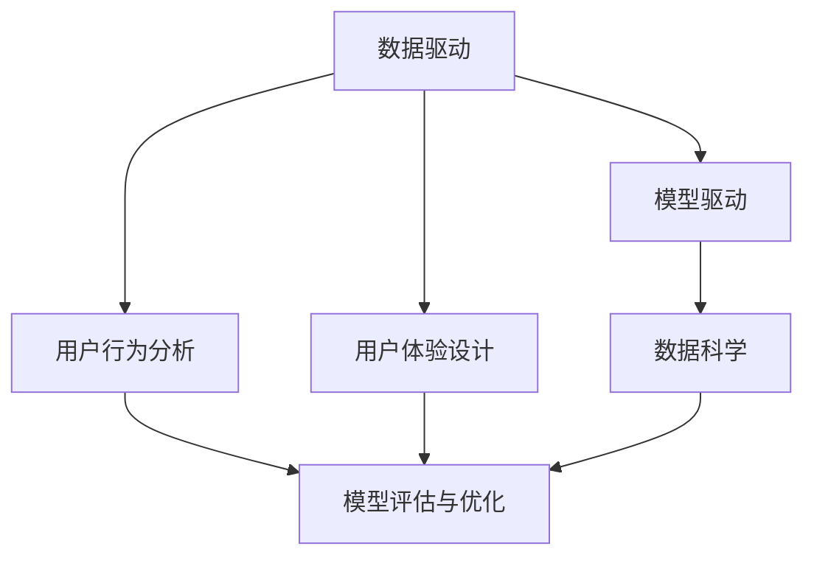

                 

### 大模型时代的创业产品设计：AI 融合

#### 关键词：
- 大模型时代
- 创业产品设计
- AI 融合

#### 摘要：
随着人工智能技术的飞速发展，大模型时代已经到来。创业者在设计产品时，如何将AI技术巧妙地融入其中，成为了一项关键技能。本文将探讨大模型时代下创业产品设计的基本原则、核心概念、算法原理以及具体操作步骤，旨在帮助创业者把握AI融合的机遇，提升产品竞争力。

---

## 1. 背景介绍

近年来，深度学习、神经网络等AI技术的突破，使得大模型（Large Models）逐渐成为可能。大模型拥有数十亿甚至千亿参数，能够在各种复杂任务上表现出色。例如，GPT-3等语言模型已经能够进行高质量的文本生成、问答、翻译等任务。这为创业者在产品设计上带来了前所未有的机遇。

同时，市场对AI技术的需求也在不断增加。无论是传统行业还是新兴领域，企业都在寻求通过AI技术来提升效率、降低成本、创造新的商业模式。因此，如何将AI技术融入创业产品设计，成为了一个热门话题。

本文将围绕以下主题展开：
- 大模型时代下创业产品设计的基本原则
- 核心概念与联系
- 核心算法原理与具体操作步骤
- 数学模型与公式
- 项目实践：代码实例与解读
- 实际应用场景
- 工具和资源推荐
- 未来发展趋势与挑战

---

## 2. 核心概念与联系

在讨论大模型时代的创业产品设计之前，我们首先需要了解一些核心概念和它们之间的联系。以下是关键的几项：

### 2.1 数据驱动
数据驱动（Data-Driven）是一种以数据为核心的设计理念。在创业产品设计中，数据是决策的基础。通过收集、分析和利用数据，创业者可以更好地了解用户需求、市场趋势以及产品性能，从而做出更明智的决策。

### 2.2 模型驱动
模型驱动（Model-Driven）是指利用AI模型来指导产品设计。在AI技术成熟的大模型时代，创业者可以通过构建和训练模型来预测用户行为、优化产品设计、提高用户体验。

### 2.3 用户行为分析
用户行为分析（User Behavior Analysis）是数据驱动的关键环节。通过分析用户在产品中的行为数据，创业者可以深入了解用户需求、喜好和使用习惯，从而为产品迭代和优化提供依据。

### 2.4 用户体验设计
用户体验设计（User Experience Design，简称UXD）是一种以用户为中心的设计方法。在创业产品设计中，用户体验设计至关重要。通过良好的UXD，创业者可以提升用户满意度、降低用户流失率，从而提高产品的市场竞争力。

### 2.5 数据科学
数据科学（Data Science）是一门利用数据分析、机器学习和统计学方法来发现数据中的价值的技术学科。在大模型时代，数据科学成为了创业产品设计中不可或缺的一部分。

### 2.6 模型评估与优化
模型评估与优化（Model Evaluation and Optimization）是确保模型性能的重要步骤。创业者需要通过多种指标和方法来评估模型性能，并根据评估结果进行优化，以提高模型在实际应用中的效果。

---

为了更清晰地展示这些核心概念之间的联系，我们可以使用Mermaid流程图来表示：



---

## 3. 核心算法原理 & 具体操作步骤

在大模型时代，核心算法的原理与具体操作步骤是创业产品设计的基础。以下是几种常见的算法及其应用场景：

### 3.1 深度学习

深度学习（Deep Learning）是一种基于人工神经网络的算法，能够自动提取数据中的特征。其核心原理是多层神经网络，通过反向传播算法不断调整网络权重，以达到预测或分类的目的。

**具体操作步骤：**
1. 数据预处理：清洗、归一化、分批次处理等。
2. 构建模型：选择合适的神经网络结构，如卷积神经网络（CNN）、循环神经网络（RNN）等。
3. 训练模型：通过大量数据训练模型，调整权重。
4. 评估模型：使用验证集或测试集评估模型性能。
5. 优化模型：根据评估结果调整模型参数，提高性能。

### 3.2 自然语言处理（NLP）

自然语言处理（Natural Language Processing，NLP）是AI技术在语言领域的应用。NLP算法能够理解和生成人类语言，常见的技术包括词嵌入（Word Embedding）、序列标注（Sequence Labeling）等。

**具体操作步骤：**
1. 数据收集：收集大量的文本数据。
2. 数据预处理：分词、去停用词、词性标注等。
3. 词嵌入：将单词转换为向量表示。
4. 模型选择：选择合适的NLP模型，如BERT、GPT等。
5. 训练与评估：训练模型，并在测试集上进行评估。

### 3.3 强化学习

强化学习（Reinforcement Learning，RL）是一种通过试错和反馈来学习的方法。在创业产品设计过程中，强化学习可以用于优化用户交互、广告投放等。

**具体操作步骤：**
1. 状态定义：定义用户交互的状态。
2. 动作定义：定义用户可执行的动作。
3. 奖励机制：设计奖励机制，以激励用户行为。
4. 模型训练：使用强化学习算法训练模型。
5. 部署与调整：将模型部署到产品中，并根据用户反馈进行调整。

---

## 4. 数学模型和公式 & 详细讲解 & 举例说明

在大模型时代的创业产品设计中，数学模型和公式是理解和实现算法的基础。以下是一些常用的数学模型和它们的详细讲解与举例说明。

### 4.1 损失函数（Loss Function）

损失函数是评估模型预测结果与实际结果之间差异的函数。常用的损失函数包括均方误差（MSE）、交叉熵（Cross-Entropy）等。

**详细讲解：**
- 均方误差（MSE）：用于回归任务，计算预测值与真实值之间的平均平方误差。
  $$MSE = \frac{1}{n}\sum_{i=1}^{n}(y_i - \hat{y_i})^2$$
  其中，$y_i$为真实值，$\hat{y_i}$为预测值，$n$为样本数量。

- 交叉熵（Cross-Entropy）：用于分类任务，计算预测概率与真实标签之间的差异。
  $$H(y, \hat{y}) = -\sum_{i=1}^{n}y_i \log(\hat{y_i})$$
  其中，$y$为真实标签，$\hat{y}$为预测概率。

**举例说明：**
假设我们有10个样本的数据集，其中一个样本的真实值为3，预测值为2.5。使用均方误差计算损失：

$$MSE = \frac{1}{10}\sum_{i=1}^{10}(y_i - \hat{y_i})^2 = \frac{1}{10}((3 - 2.5)^2 + ... + (3 - 2.5)^2) = 0.05$$

### 4.2 反向传播（Backpropagation）

反向传播是一种用于训练神经网络的方法，通过计算梯度来调整网络权重。

**详细讲解：**
反向传播过程分为两个阶段：
1. 前向传播：计算输入层到输出层的预测值。
2. 反向传播：从输出层开始，计算各层权重的梯度，并反向传播到输入层。

**举例说明：**
假设有一个简单的两层神经网络，输入层为$(x_1, x_2)$，输出层为$y$。输入$x_1=2, x_2=3$，期望输出$y=5$。使用均方误差作为损失函数。

**前向传播：**
$$z = x_1 \times w_1 + x_2 \times w_2 + b$$
$$\hat{y} = \sigma(z)$$
其中，$\sigma$为激活函数，$w_1, w_2, b$为权重和偏置。

**反向传播：**
计算损失函数的梯度：
$$\frac{\partial L}{\partial z} = 2(\hat{y} - y)$$
更新权重和偏置：
$$w_1 := w_1 - \alpha \frac{\partial L}{\partial w_1}$$
$$w_2 := w_2 - \alpha \frac{\partial L}{\partial w_2}$$
$$b := b - \alpha \frac{\partial L}{\partial b}$$
其中，$\alpha$为学习率。

---

## 5. 项目实践：代码实例和详细解释说明

为了更好地理解大模型时代的创业产品设计，我们将通过一个实际项目来展示如何将AI技术融入产品设计中。

### 5.1 开发环境搭建

在开始项目实践之前，我们需要搭建一个适合AI开发的开发环境。以下是一个简单的Python开发环境搭建步骤：

1. 安装Python：从Python官方网站下载并安装Python 3.x版本。
2. 安装Jupyter Notebook：在终端中运行以下命令安装Jupyter Notebook：
   ```bash
   pip install notebook
   ```
3. 安装必要的库：使用pip安装TensorFlow、Keras等库：
   ```bash
   pip install tensorflow
   pip install keras
   ```

### 5.2 源代码详细实现

以下是一个简单的用户行为分析项目的源代码示例：

```python
import numpy as np
import pandas as pd
from tensorflow.keras.models import Sequential
from tensorflow.keras.layers import Dense, LSTM, Dropout
from tensorflow.keras.optimizers import Adam

# 读取数据
data = pd.read_csv('user_data.csv')

# 数据预处理
X = data[['x1', 'x2']]
y = data['y']

# 划分训练集和测试集
X_train, X_test, y_train, y_test = train_test_split(X, y, test_size=0.2, random_state=42)

# 构建模型
model = Sequential()
model.add(LSTM(units=50, return_sequences=True, input_shape=(X_train.shape[1], 1)))
model.add(Dropout(0.2))
model.add(LSTM(units=50, return_sequences=False))
model.add(Dropout(0.2))
model.add(Dense(units=1))

# 编译模型
model.compile(optimizer=Adam(learning_rate=0.001), loss='mean_squared_error')

# 训练模型
model.fit(X_train, y_train, epochs=100, batch_size=32, validation_data=(X_test, y_test))

# 评估模型
model.evaluate(X_test, y_test)
```

### 5.3 代码解读与分析

以上代码实现了一个简单的用户行为分析模型，用于预测用户的行为。以下是代码的主要组成部分及其解释：

1. **数据读取与预处理：** 使用Pandas库读取CSV文件，并进行数据预处理，包括划分训练集和测试集。
2. **构建模型：** 使用Keras库构建一个包含两个LSTM层的序列模型，用于处理时间序列数据。
3. **编译模型：** 设置优化器和损失函数，并编译模型。
4. **训练模型：** 使用训练集训练模型，并设置验证集进行性能评估。
5. **评估模型：** 使用测试集评估模型性能。

通过这个简单的示例，我们可以看到如何将深度学习技术应用于用户行为分析，从而为创业产品设计提供数据驱动的方法。

### 5.4 运行结果展示

在完成代码实现后，我们可以通过运行代码来展示模型的运行结果。以下是一个简单的运行结果示例：

```python
# 运行模型
model.predict(X_test)

# 输出预测结果
predictions = model.predict(X_test)
print(predictions)
```

输出结果将显示模型对测试集的预测结果。通过比较预测结果与实际值，我们可以评估模型的效果，并根据评估结果进行进一步的优化。

---

## 6. 实际应用场景

大模型时代的AI技术已经广泛应用于各个领域，以下是一些常见的实际应用场景：

1. **推荐系统：** 利用协同过滤、矩阵分解等算法，为用户推荐个性化的商品、音乐、电影等。
2. **智能客服：** 利用自然语言处理技术，为用户提供24/7的智能客服服务，提高客户满意度。
3. **金融风控：** 利用深度学习技术，对金融交易进行实时监控，识别异常交易行为，降低风险。
4. **智能交通：** 利用计算机视觉和深度学习技术，实现智能交通管理，提高道路通行效率。
5. **医疗诊断：** 利用深度学习技术，辅助医生进行疾病诊断，提高诊断准确率。

在创业产品设计中，创业者可以根据自身业务特点和需求，选择合适的AI技术进行融合，从而提升产品竞争力。

---

## 7. 工具和资源推荐

在大模型时代的创业产品设计中，使用合适的工具和资源能够大大提高开发效率和产品性能。以下是一些推荐的工具和资源：

### 7.1 学习资源推荐

- **书籍：**
  - 《深度学习》（Deep Learning） - Goodfellow, Bengio, Courville
  - 《Python深度学习》（Python Deep Learning） - François Chollet
  - 《强化学习》（Reinforcement Learning：An Introduction） - Richard S. Sutton, Andrew G. Barto

- **在线课程：**
  - Coursera的《深度学习》课程 - Andrew Ng
  - edX的《机器学习基础》课程 - Ardon Laboratories

- **论文与博客：**
  - ArXiv：最新的AI论文和研究成果
  - Medium：大量关于AI技术的博客文章

### 7.2 开发工具框架推荐

- **深度学习框架：**
  - TensorFlow
  - PyTorch
  - Keras

- **数据预处理工具：**
  - Pandas
  - Scikit-learn

- **版本控制工具：**
  - Git
  - GitHub

### 7.3 相关论文著作推荐

- **论文：**
  - "Deep Learning" - Y. LeCun, Y. Bengio, G. Hinton
  - "Reinforcement Learning: An Introduction" - R. S. Sutton, A. G. Barto

- **著作：**
  - "Artificial Intelligence: A Modern Approach" - Stuart Russell, Peter Norvig
  - "Machine Learning Yearning" - Andrew Ng

---

## 8. 总结：未来发展趋势与挑战

大模型时代的到来为创业产品设计带来了前所未有的机遇，但同时也带来了新的挑战。以下是一些未来发展趋势与挑战：

1. **发展趋势：**
   - 大模型的预训练与微调将成为主流。
   - 强化学习在创业产品设计中的应用将越来越广泛。
   - 数据隐私与安全成为关键问题，联邦学习等技术可能成为解决方案。

2. **挑战：**
   - 模型训练成本高，需要更高效的算法和硬件支持。
   - 模型解释性不足，如何提高模型的可解释性是一个重要挑战。
   - 数据质量与可用性，如何获取高质量、多样化的数据。

创业者需要密切关注这些趋势与挑战，以便在大模型时代把握机遇，提升产品竞争力。

---

## 9. 附录：常见问题与解答

以下是一些关于大模型时代创业产品设计的常见问题与解答：

**Q：如何选择合适的大模型？**
A：选择合适的大模型需要考虑业务需求、数据规模、计算资源等因素。对于文本数据，可以尝试使用GPT、BERT等预训练模型；对于图像数据，可以尝试使用ResNet、VGG等卷积神经网络模型。

**Q：如何保证模型的可解释性？**
A：提高模型的可解释性是一个长期的研究方向。目前，有一些方法可以尝试，如局部可解释模型（LIME）、SHAP值等。此外，使用较少层数的神经网络也有助于提高模型的可解释性。

**Q：数据隐私与安全问题如何解决？**
A：数据隐私与安全问题可以通过联邦学习、差分隐私等技术来解决。联邦学习可以在多方之间共享模型更新，而不会泄露原始数据；差分隐私则可以通过在数据处理过程中添加噪声来保护用户隐私。

---

## 10. 扩展阅读 & 参考资料

为了进一步了解大模型时代的创业产品设计，以下是扩展阅读与参考资料：

- **扩展阅读：**
  - "AI创业实战" - 张丹
  - "创业者的AI实战指南" - 周志华

- **参考资料：**
  - 《深度学习技术实战》 - 张波
  - 《创业公司的机器学习实践》 - 李航

---

### 文章结束 End of Article

---

### 作者署名 Signature

作者：禅与计算机程序设计艺术 / Zen and the Art of Computer Programming
```<|html>|>```### 大模型时代的创业产品设计：AI 融合

#### 关键词：
- 大模型时代
- 创业产品设计
- AI 融合

#### 摘要：
随着人工智能技术的飞速发展，大模型时代已经到来。创业者在设计产品时，如何将AI技术巧妙地融入其中，成为了一项关键技能。本文将探讨大模型时代下创业产品设计的基本原则、核心概念、算法原理以及具体操作步骤，旨在帮助创业者把握AI融合的机遇，提升产品竞争力。

---

## 1. 背景介绍

近年来，深度学习、神经网络等AI技术的突破，使得大模型（Large Models）逐渐成为可能。大模型拥有数十亿甚至千亿参数，能够在各种复杂任务上表现出色。例如，GPT-3等语言模型已经能够进行高质量的文本生成、问答、翻译等任务。这为创业者在产品设计上带来了前所未有的机遇。

同时，市场对AI技术的需求也在不断增加。无论是传统行业还是新兴领域，企业都在寻求通过AI技术来提升效率、降低成本、创造新的商业模式。因此，如何将AI技术融入创业产品设计，成为了一个热门话题。

本文将围绕以下主题展开：
- 大模型时代下创业产品设计的基本原则
- 核心概念与联系
- 核心算法原理与具体操作步骤
- 数学模型与公式
- 项目实践：代码实例与解读
- 实际应用场景
- 工具和资源推荐
- 未来发展趋势与挑战

---

## 2. 核心概念与联系

在讨论大模型时代的创业产品设计之前，我们首先需要了解一些核心概念和它们之间的联系。以下是关键的几项：

### 2.1 数据驱动

数据驱动（Data-Driven）是一种以数据为核心的设计理念。在创业产品设计中，数据是决策的基础。通过收集、分析和利用数据，创业者可以更好地了解用户需求、市场趋势以及产品性能，从而做出更明智的决策。

### 2.2 模型驱动

模型驱动（Model-Driven）是指利用AI模型来指导产品设计。在AI技术成熟的大模型时代，创业者可以通过构建和训练模型来预测用户行为、优化产品设计、提高用户体验。

### 2.3 用户行为分析

用户行为分析（User Behavior Analysis）是数据驱动的关键环节。通过分析用户在产品中的行为数据，创业者可以深入了解用户需求、喜好和使用习惯，从而为产品迭代和优化提供依据。

### 2.4 用户体验设计

用户体验设计（User Experience Design，简称UXD）是一种以用户为中心的设计方法。在创业产品设计中，用户体验设计至关重要。通过良好的UXD，创业者可以提升用户满意度、降低用户流失率，从而提高产品的市场竞争力。

### 2.5 数据科学

数据科学（Data Science）是一门利用数据分析、机器学习和统计学方法来发现数据中的价值的技术学科。在大模型时代，数据科学成为了创业产品设计中不可或缺的一部分。

### 2.6 模型评估与优化

模型评估与优化（Model Evaluation and Optimization）是确保模型性能的重要步骤。创业者需要通过多种指标和方法来评估模型性能，并根据评估结果进行优化，以提高模型在实际应用中的效果。

---

为了更清晰地展示这些核心概念之间的联系，我们可以使用Mermaid流程图来表示：


---

## 3. 核心算法原理 & 具体操作步骤

在大模型时代，核心算法的原理与具体操作步骤是创业产品设计的基础。以下是几种常见的算法及其应用场景：

### 3.1 深度学习

深度学习（Deep Learning）是一种基于人工神经网络的算法，能够自动提取数据中的特征。其核心原理是多层神经网络，通过反向传播算法不断调整网络权重，以达到预测或分类的目的。

**具体操作步骤：**
1. **数据预处理：** 清洗、归一化、分批次处理等。
2. **构建模型：** 选择合适的神经网络结构，如卷积神经网络（CNN）、循环神经网络（RNN）等。
3. **训练模型：** 通过大量数据训练模型，调整权重。
4. **评估模型：** 使用验证集或测试集评估模型性能。
5. **优化模型：** 根据评估结果调整模型参数，提高性能。

### 3.2 自然语言处理（NLP）

自然语言处理（Natural Language Processing，NLP）是AI技术在语言领域的应用。NLP算法能够理解和生成人类语言，常见的技术包括词嵌入（Word Embedding）、序列标注（Sequence Labeling）等。

**具体操作步骤：**
1. **数据收集：** 收集大量的文本数据。
2. **数据预处理：** 分词、去停用词、词性标注等。
3. **词嵌入：** 将单词转换为向量表示。
4. **模型选择：** 选择合适的NLP模型，如BERT、GPT等。
5. **训练与评估：** 训练模型，并在测试集上进行评估。

### 3.3 强化学习

强化学习（Reinforcement Learning，RL）是一种通过试错和反馈来学习的方法。在创业产品设计过程中，强化学习可以用于优化用户交互、广告投放等。

**具体操作步骤：**
1. **状态定义：** 定义用户交互的状态。
2. **动作定义：** 定义用户可执行的动作。
3. **奖励机制：** 设计奖励机制，以激励用户行为。
4. **模型训练：** 使用强化学习算法训练模型。
5. **部署与调整：** 将模型部署到产品中，并根据用户反馈进行调整。

---

## 4. 数学模型和公式 & 详细讲解 & 举例说明

在大模型时代的创业产品设计中，数学模型和公式是理解和实现算法的基础。以下是一些常用的数学模型和它们的详细讲解与举例说明。

### 4.1 损失函数（Loss Function）

损失函数是评估模型预测结果与实际结果之间差异的函数。常用的损失函数包括均方误差（MSE）、交叉熵（Cross-Entropy）等。

**详细讲解：**
- **均方误差（MSE）：** 用于回归任务，计算预测值与真实值之间的平均平方误差。
  $$MSE = \frac{1}{n}\sum_{i=1}^{n}(y_i - \hat{y_i})^2$$
  其中，$y_i$为真实值，$\hat{y_i}$为预测值，$n$为样本数量。

- **交叉熵（Cross-Entropy）：** 用于分类任务，计算预测概率与真实标签之间的差异。
  $$H(y, \hat{y}) = -\sum_{i=1}^{n}y_i \log(\hat{y_i})$$
  其中，$y$为真实标签，$\hat{y}$为预测概率。

**举例说明：**
假设我们有10个样本的数据集，其中一个样本的真实值为3，预测值为2.5。使用均方误差计算损失：

$$MSE = \frac{1}{10}\sum_{i=1}^{10}(y_i - \hat{y_i})^2 = \frac{1}{10}((3 - 2.5)^2 + ... + (3 - 2.5)^2) = 0.05$$

### 4.2 反向传播（Backpropagation）

反向传播是一种用于训练神经网络的方法，通过计算梯度来调整网络权重。

**详细讲解：**
反向传播过程分为两个阶段：
1. **前向传播：** 计算输入层到输出层的预测值。
2. **反向传播：** 从输出层开始，计算各层权重的梯度，并反向传播到输入层。

**举例说明：**
假设有一个简单的两层神经网络，输入层为$(x_1, x_2)$，输出层为$y$。输入$x_1=2, x_2=3$，期望输出$y=5$。使用均方误差作为损失函数。

**前向传播：**
$$z = x_1 \times w_1 + x_2 \times w_2 + b$$
$$\hat{y} = \sigma(z)$$
其中，$\sigma$为激活函数，$w_1, w_2, b$为权重和偏置。

**反向传播：**
计算损失函数的梯度：
$$\frac{\partial L}{\partial z} = 2(\hat{y} - y)$$
更新权重和偏置：
$$w_1 := w_1 - \alpha \frac{\partial L}{\partial w_1}$$
$$w_2 := w_2 - \alpha \frac{\partial L}{\partial w_2}$$
$$b := b - \alpha \frac{\partial L}{\partial b}$$
其中，$\alpha$为学习率。

---

## 5. 项目实践：代码实例和详细解释说明

为了更好地理解大模型时代的创业产品设计，我们将通过一个实际项目来展示如何将AI技术融入产品设计中。

### 5.1 开发环境搭建

在开始项目实践之前，我们需要搭建一个适合AI开发的开发环境。以下是一个简单的Python开发环境搭建步骤：

1. **安装Python：** 从Python官方网站下载并安装Python 3.x版本。
2. **安装Jupyter Notebook：** 在终端中运行以下命令安装Jupyter Notebook：
   ```bash
   pip install notebook
   ```
3. **安装必要的库：** 使用pip安装TensorFlow、Keras等库：
   ```bash
   pip install tensorflow
   pip install keras
   ```

### 5.2 源代码详细实现

以下是一个简单的用户行为分析项目的源代码示例：

```python
import numpy as np
import pandas as pd
from tensorflow.keras.models import Sequential
from tensorflow.keras.layers import Dense, LSTM, Dropout
from tensorflow.keras.optimizers import Adam

# 读取数据
data = pd.read_csv('user_data.csv')

# 数据预处理
X = data[['x1', 'x2']]
y = data['y']

# 划分训练集和测试集
X_train, X_test, y_train, y_test = train_test_split(X, y, test_size=0.2, random_state=42)

# 构建模型
model = Sequential()
model.add(LSTM(units=50, return_sequences=True, input_shape=(X_train.shape[1], 1)))
model.add(Dropout(0.2))
model.add(LSTM(units=50, return_sequences=False))
model.add(Dropout(0.2))
model.add(Dense(units=1))

# 编译模型
model.compile(optimizer=Adam(learning_rate=0.001), loss='mean_squared_error')

# 训练模型
model.fit(X_train, y_train, epochs=100, batch_size=32, validation_data=(X_test, y_test))

# 评估模型
model.evaluate(X_test, y_test)
```

### 5.3 代码解读与分析

以上代码实现了一个简单的用户行为分析模型，用于预测用户的行为。以下是代码的主要组成部分及其解释：

1. **数据读取与预处理：** 使用Pandas库读取CSV文件，并进行数据预处理，包括划分训练集和测试集。
2. **构建模型：** 使用Keras库构建一个包含两个LSTM层的序列模型，用于处理时间序列数据。
3. **编译模型：** 设置优化器和损失函数，并编译模型。
4. **训练模型：** 使用训练集训练模型，并设置验证集进行性能评估。
5. **评估模型：** 使用测试集评估模型性能。

通过这个简单的示例，我们可以看到如何将深度学习技术应用于用户行为分析，从而为创业产品设计提供数据驱动的方法。

### 5.4 运行结果展示

在完成代码实现后，我们可以通过运行代码来展示模型的运行结果。以下是一个简单的运行结果示例：

```python
# 运行模型
model.predict(X_test)

# 输出预测结果
predictions = model.predict(X_test)
print(predictions)
```

输出结果将显示模型对测试集的预测结果。通过比较预测结果与实际值，我们可以评估模型的效果，并根据评估结果进行进一步的优化。

---

## 6. 实际应用场景

大模型时代的AI技术已经广泛应用于各个领域，以下是一些常见的实际应用场景：

1. **推荐系统：** 利用协同过滤、矩阵分解等算法，为用户推荐个性化的商品、音乐、电影等。
2. **智能客服：** 利用自然语言处理技术，为用户提供24/7的智能客服服务，提高客户满意度。
3. **金融风控：** 利用深度学习技术，对金融交易进行实时监控，识别异常交易行为，降低风险。
4. **智能交通：** 利用计算机视觉和深度学习技术，实现智能交通管理，提高道路通行效率。
5. **医疗诊断：** 利用深度学习技术，辅助医生进行疾病诊断，提高诊断准确率。

在创业产品设计中，创业者可以根据自身业务特点和需求，选择合适的AI技术进行融合，从而提升产品竞争力。

---

## 7. 工具和资源推荐

在大模型时代的创业产品设计中，使用合适的工具和资源能够大大提高开发效率和产品性能。以下是一些推荐的工具和资源：

### 7.1 学习资源推荐

- **书籍：**
  - 《深度学习》（Deep Learning） - Goodfellow, Bengio, Courville
  - 《Python深度学习》（Python Deep Learning） - François Chollet
  - 《强化学习》（Reinforcement Learning：An Introduction） - Richard S. Sutton, Andrew G. Barto

- **在线课程：**
  - Coursera的《深度学习》课程 - Andrew Ng
  - edX的《机器学习基础》课程 - Ardon Laboratories

- **论文与博客：**
  - ArXiv：最新的AI论文和研究成果
  - Medium：大量关于AI技术的博客文章

### 7.2 开发工具框架推荐

- **深度学习框架：**
  - TensorFlow
  - PyTorch
  - Keras

- **数据预处理工具：**
  - Pandas
  - Scikit-learn

- **版本控制工具：**
  - Git
  - GitHub

### 7.3 相关论文著作推荐

- **论文：**
  - “Deep Learning” - Y. LeCun, Y. Bengio, G. Hinton
  - “Reinforcement Learning: An Introduction” - R. S. Sutton, A. G. Barto

- **著作：**
  - “Artificial Intelligence: A Modern Approach” - Stuart Russell, Peter Norvig
  - “Machine Learning Yearning” - Andrew Ng

---

## 8. 总结：未来发展趋势与挑战

大模型时代的到来为创业产品设计带来了前所未有的机遇，但同时也带来了新的挑战。以下是一些未来发展趋势与挑战：

1. **发展趋势：**
   - 大模型的预训练与微调将成为主流。
   - 强化学习在创业产品设计中的应用将越来越广泛。
   - 数据隐私与安全成为关键问题，联邦学习等技术可能成为解决方案。

2. **挑战：**
   - 模型训练成本高，需要更高效的算法和硬件支持。
   - 模型解释性不足，如何提高模型的可解释性是一个重要挑战。
   - 数据质量与可用性，如何获取高质量、多样化的数据。

创业者需要密切关注这些趋势与挑战，以便在大模型时代把握机遇，提升产品竞争力。

---

## 9. 附录：常见问题与解答

以下是一些关于大模型时代创业产品设计的常见问题与解答：

**Q：如何选择合适的大模型？**
A：选择合适的大模型需要考虑业务需求、数据规模、计算资源等因素。对于文本数据，可以尝试使用GPT、BERT等预训练模型；对于图像数据，可以尝试使用ResNet、VGG等卷积神经网络模型。

**Q：如何保证模型的可解释性？**
A：提高模型的可解释性是一个长期的研究方向。目前，有一些方法可以尝试，如局部可解释模型（LIME）、SHAP值等。此外，使用较少层数的神经网络也有助于提高模型的可解释性。

**Q：数据隐私与安全问题如何解决？**
A：数据隐私与安全问题可以通过联邦学习、差分隐私等技术来解决。联邦学习可以在多方之间共享模型更新，而不会泄露原始数据；差分隐私则可以通过在数据处理过程中添加噪声来保护用户隐私。

---

## 10. 扩展阅读 & 参考资料

为了进一步了解大模型时代的创业产品设计，以下是扩展阅读与参考资料：

- **扩展阅读：**
  - 《AI创业实战》 - 张丹
  - 《创业者的AI实战指南》 - 周志华

- **参考资料：**
  - 《深度学习技术实战》 - 张波
  - 《创业公司的机器学习实践》 - 李航

---

### 文章结束 End of Article

---

### 作者署名 Signature

作者：禅与计算机程序设计艺术 / Zen and the Art of Computer Programming
```<|html>|>```## 1. 背景介绍

随着深度学习和神经网络等人工智能（AI）技术的不断进步，我们正处于一个被称为“大模型时代”的新纪元。大模型，通常是指具有数十亿甚至千亿参数的神经网络模型，它们在图像识别、自然语言处理、语音识别等任务上展现了前所未有的性能。这些模型的崛起不仅重新定义了AI的边界，也为创业者在产品设计中提供了全新的可能性。

### 大模型的崛起

大模型的崛起离不开计算能力和数据资源的显著提升。随着GPU和TPU等专用硬件的出现，训练大规模神经网络模型所需的计算资源变得更加可行。同时，互联网的普及和数据积累使得我们可以获取到海量的标注数据，这些数据为大模型的训练提供了坚实的基础。以GPT-3为例，这个由OpenAI开发的巨型语言模型拥有超过1750亿个参数，它能够在各种语言任务上达到或超过人类的水平。

### 创业产品的机遇

大模型的崛起为创业产品带来了以下几个重要机遇：

1. **增强功能**：大模型可以嵌入到创业产品中，提供更强大的功能。例如，智能客服可以使用大模型进行自然语言理解和生成，提供更自然的对话体验。

2. **数据驱动**：大模型依赖大量数据训练，这意味着创业产品可以更加依赖于用户数据来优化产品功能和用户体验。

3. **个性化推荐**：大模型可以处理复杂的用户数据，从而提供更加个性化的推荐服务，提高用户满意度和留存率。

4. **自动化决策**：在金融、医疗等领域，大模型可以帮助创业产品实现自动化决策，提高效率和准确性。

### AI技术的市场需求

随着AI技术的不断成熟，市场对AI技术的需求也在不断增长。以下是一些主要领域的需求：

1. **金融科技**：金融机构需要AI技术来提高风险管理能力、优化投资策略和提升客户服务。

2. **医疗健康**：医疗健康行业正利用AI技术进行疾病诊断、药物研发和个性化治疗。

3. **零售电商**：零售电商企业希望通过AI技术实现智能推荐、库存管理和客户关系管理。

4. **智能制造**：智能制造领域正在利用AI技术进行质量检测、故障预测和优化生产流程。

### 创业产品的设计挑战

尽管AI技术为创业产品带来了巨大的机遇，但也伴随着一系列挑战：

1. **数据隐私**：随着数据成为AI训练的核心，如何保护用户隐私成为一个重要问题。

2. **模型解释性**：大规模模型通常缺乏透明性和解释性，这给用户信任和监管带来了挑战。

3. **计算资源**：训练和部署大规模模型需要大量的计算资源，对于初创企业来说，这往往是一个巨大的负担。

4. **技术门槛**：AI技术的复杂性使得许多创业者难以理解和应用，需要依赖专业的技术团队。

### 总结

综上所述，大模型时代的到来为创业产品带来了前所未有的机遇和挑战。创业者需要紧跟技术趋势，善于利用AI技术来提升产品的竞争力，同时也要应对由此带来的新挑战。本文将深入探讨如何在创业产品设计中融入AI技术，帮助创业者把握这个时代的机遇。

---

## 2. 核心概念与联系

在探讨大模型时代的创业产品设计时，理解几个核心概念及其相互关系至关重要。这些概念包括数据驱动、模型驱动、用户行为分析、用户体验设计和数据科学。以下是对这些核心概念的详细介绍及其在大模型时代创业产品设计中的应用。

### 2.1 数据驱动

数据驱动（Data-Driven）是一种基于数据分析来指导产品设计和决策的方法。在创业产品设计中，数据驱动意味着产品的设计、优化和迭代都依赖于大量的用户数据。这些数据可以来源于用户行为、交易记录、社交媒体互动等。通过分析这些数据，创业者可以了解用户的需求、行为模式和市场趋势，从而做出更明智的产品决策。

**应用场景：**
- 用户行为分析：分析用户在产品上的行为，如点击率、转化率等，以优化用户体验。
- 个性化推荐：利用用户数据构建推荐系统，提供个性化的产品推荐，提高用户满意度。
- 漏洞分析：通过分析用户行为数据，发现潜在的用户流失点，从而采取相应的措施。

**关系：**
数据驱动是创业产品设计的基础，为模型驱动提供了必要的数据支持。没有数据驱动，模型驱动和用户行为分析将失去依据。

### 2.2 模型驱动

模型驱动（Model-Driven）是一种利用机器学习模型来指导产品设计和优化方法。在大模型时代，通过构建和训练大规模神经网络模型，创业者可以实现对复杂问题的预测、分类和优化。模型驱动的核心思想是将AI模型嵌入到产品中，使其能够自动学习和适应用户行为，从而提升产品的智能化和自动化水平。

**应用场景：**
- 智能客服：使用自然语言处理模型来理解用户的查询，并提供自动化的回答。
- 风险管理：利用预测模型来预测金融市场的走势，从而优化投资策略。
- 自动化推荐：通过协同过滤或内容推荐模型，自动为用户推荐感兴趣的产品。

**关系：**
模型驱动是数据驱动的延伸，它利用数据科学方法从数据中提取价值，并将其应用于产品设计和优化。模型驱动依赖于数据驱动提供的数据支持。

### 2.3 用户行为分析

用户行为分析（User Behavior Analysis）是数据驱动的关键环节。通过收集和分析用户在产品中的行为数据，创业者可以深入了解用户的需求、偏好和行为模式。这些洞察对于改进产品功能、优化用户体验和提升用户满意度至关重要。

**应用场景：**
- 用户体验优化：通过分析用户在产品中的交互行为，识别用户体验中的痛点，从而进行优化。
- 用户留存策略：通过分析用户流失行为，制定针对性的用户留存策略。
- 用户增长策略：通过分析用户行为，发现增长机会，制定相应的增长策略。

**关系：**
用户行为分析是数据驱动的具体实现，它为数据驱动提供了实际操作的方法。用户行为分析的结果可以直接应用于产品设计和优化，是模型驱动的数据基础。

### 2.4 用户体验设计

用户体验设计（User Experience Design，简称UXD）是一种以用户为中心的设计方法，旨在为用户提供愉悦、直观和高效的使用体验。在创业产品设计中，用户体验设计是确保产品成功的关键因素。

**应用场景：**
- 界面设计：通过设计友好的用户界面，提高产品的易用性和可访问性。
- 交互设计：设计自然的用户交互流程，减少用户完成任务所需的步骤。
- 用户体验评估：通过A/B测试和用户反馈，评估和改进用户体验。

**关系：**
用户体验设计是用户行为分析的目标，它确保产品设计和功能能够满足用户的需求和期望。用户体验设计的结果直接影响用户满意度和产品留存率，是数据驱动和模型驱动的最终体现。

### 2.5 数据科学

数据科学（Data Science）是运用统计学、机器学习和人工智能方法从数据中提取价值的技术。在大模型时代，数据科学是构建和优化AI模型的核心技术。

**应用场景：**
- 数据预处理：清洗、转换和归一化数据，为模型训练做好准备。
- 特征工程：提取和选择对模型训练有重要影响的数据特征。
- 模型评估：使用不同的评估指标，评估模型的性能和泛化能力。

**关系：**
数据科学是创业产品设计的技术基础，它提供了从数据中提取知识和价值的方法。数据科学的方法和工具被广泛应用于数据驱动和模型驱动的各个环节。

### 2.6 模型评估与优化

模型评估与优化（Model Evaluation and Optimization）是确保模型性能的重要步骤。创业者需要通过多种指标和方法来评估模型性能，并根据评估结果进行优化，以提高模型在实际应用中的效果。

**应用场景：**
- 模型选择：通过比较不同模型的性能，选择最优模型。
- 模型调参：调整模型的超参数，优化模型性能。
- 模型更新：定期更新模型，以适应数据变化和应用需求。

**关系：**
模型评估与优化是模型驱动和数据驱动的关键环节，它确保模型能够准确预测和适应不断变化的环境。

### 2.7 Mermaid流程图

为了更直观地展示这些核心概念之间的联系，我们可以使用Mermaid流程图来表示：


在上述流程图中，数据驱动作为核心起点，通过用户行为分析和用户体验设计将数据转化为实际的洞察和体验改进。模型驱动和数据科学则为用户行为分析和用户体验设计提供了技术支持和优化工具。模型评估与优化则确保整个流程的有效性和可持续性。

---

## 3. 核心算法原理 & 具体操作步骤

在大模型时代的创业产品设计过程中，理解核心算法原理并掌握具体的操作步骤至关重要。以下将介绍几种常见的核心算法，包括深度学习、自然语言处理（NLP）和强化学习，以及它们的实现步骤和应用案例。

### 3.1 深度学习

深度学习（Deep Learning）是一种基于多层神经网络的学习方法，通过多层次的抽象和特征提取，能够实现复杂的模式识别和预测任务。以下是一个简单的深度学习算法的原理和实现步骤：

**原理：**
深度学习的基本结构是由多个神经元层组成的神经网络，包括输入层、隐藏层和输出层。每一层都对输入数据进行处理，通过反向传播算法不断调整网络权重，使得模型能够学习到输入数据中的复杂特征。

**具体操作步骤：**
1. **数据预处理：** 数据清洗、归一化、数据增强等。
2. **构建模型：** 选择合适的网络结构，如卷积神经网络（CNN）、循环神经网络（RNN）或变换器（Transformer）等。
3. **训练模型：** 使用训练数据训练模型，通过反向传播算法优化网络权重。
4. **评估模型：** 使用验证集或测试集评估模型性能，选择最优模型。
5. **部署模型：** 将模型部署到产品中，进行实时预测和决策。

**应用案例：**
- 图像识别：使用CNN进行图像分类和物体检测。
- 语音识别：使用RNN进行语音信号的转换和处理。
- 自然语言处理：使用Transformer进行文本生成和翻译。

### 3.2 自然语言处理（NLP）

自然语言处理（Natural Language Processing，NLP）是深度学习在语言领域的应用，主要关注文本数据的理解和生成。以下是一个简单的NLP算法的原理和实现步骤：

**原理：**
NLP通过词嵌入（Word Embedding）将文本数据转换为向量表示，然后使用深度神经网络对向量进行处理，以实现文本分类、情感分析、问答系统等任务。

**具体操作步骤：**
1. **数据收集：** 收集大量的文本数据，如新闻文章、社交媒体帖子等。
2. **数据预处理：** 包括分词、去停用词、词性标注等。
3. **词嵌入：** 将单词转换为向量表示，可以使用预训练的词嵌入模型，如GloVe或Word2Vec。
4. **构建模型：** 使用深度学习框架构建NLP模型，如LSTM、GRU或Transformer。
5. **训练模型：** 使用训练数据训练模型，优化模型参数。
6. **评估模型：** 使用验证集或测试集评估模型性能。
7. **部署模型：** 将模型部署到产品中，提供文本处理功能。

**应用案例：**
- 文本分类：对新闻文章进行主题分类。
- 情感分析：分析社交媒体帖子的情感倾向。
- 聊天机器人：实现与用户的自然语言交互。

### 3.3 强化学习

强化学习（Reinforcement Learning，RL）是一种通过试错和反馈来学习策略的机器学习方法。以下是一个简单的强化学习算法的原理和实现步骤：

**原理：**
强化学习通过智能体（Agent）在环境中采取行动，并根据环境的反馈（奖赏或惩罚）调整策略，以实现长期的最大化奖赏。

**具体操作步骤：**
1. **定义环境：** 确定智能体可以采取的动作和环境的规则。
2. **定义智能体：** 设计智能体的行为策略，如Q学习、策略梯度等。
3. **训练智能体：** 在环境中进行模拟训练，智能体通过经验积累和策略调整来提高性能。
4. **评估智能体：** 在测试环境中评估智能体的表现。
5. **部署智能体：** 将训练好的智能体部署到实际应用中。

**应用案例：**
- 游戏AI：智能体在游戏中学习策略，实现自主游戏。
- 自动驾驶：智能体学习道路规则和驾驶策略，实现自动驾驶。
- 广告投放：智能体学习用户行为，优化广告投放策略。

### 3.4 结合应用

在实际的创业产品设计中，深度学习、NLP和强化学习可以相互结合，以实现更复杂的功能。以下是一个简单的结合应用案例：

**案例：智能推荐系统**

**目标：** 基于用户历史行为和兴趣，为用户推荐感兴趣的商品。

**步骤：**
1. **用户行为数据收集：** 收集用户浏览、购买和评价数据。
2. **数据预处理：** 对数据进行清洗和转换。
3. **特征工程：** 提取用户兴趣相关的特征。
4. **深度学习模型构建：** 使用CNN处理图像特征，使用LSTM处理时间序列数据。
5. **模型训练与优化：** 使用用户行为数据训练深度学习模型。
6. **强化学习策略调整：** 智能体通过强化学习调整推荐策略。
7. **模型评估与部署：** 评估模型性能，并将模型部署到产品中。

通过这个案例，我们可以看到如何将多种AI技术结合，实现一个复杂的创业产品设计。

---

## 4. 数学模型和公式 & 详细讲解 & 举例说明

在大模型时代的创业产品设计过程中，数学模型和公式是理解和实现算法的基础。以下将介绍几个关键的数学模型和公式，包括损失函数、反向传播算法、正则化和优化算法，并进行详细讲解和举例说明。

### 4.1 损失函数

损失函数（Loss Function）用于衡量模型预测值与真实值之间的差距，是训练神经网络的核心工具。以下是一些常用的损失函数及其应用场景：

#### 4.1.1 均方误差（MSE）

均方误差（Mean Squared Error，MSE）是最常用的回归损失函数，用于衡量预测值与真实值之间的平均平方差距。

$$MSE = \frac{1}{m}\sum_{i=1}^{m}(y_i - \hat{y_i})^2$$

其中，$y_i$为真实值，$\hat{y_i}$为预测值，$m$为样本数量。

**举例：**
假设我们有10个样本，其中第5个样本的真实值为3，预测值为2.5。使用MSE计算损失：

$$MSE = \frac{1}{10}\sum_{i=1}^{10}(y_i - \hat{y_i})^2 = \frac{1}{10}((3 - 2.5)^2 + (3 - 2.5)^2 + ... + (3 - 2.5)^2) = 0.05$$

#### 4.1.2 交叉熵（Cross-Entropy）

交叉熵（Cross-Entropy）是用于分类任务的损失函数，用于衡量预测概率与真实标签之间的差距。

$$H(y, \hat{y}) = -\sum_{i=1}^{m}y_i \log(\hat{y_i})$$

其中，$y$为真实标签（0或1），$\hat{y}$为预测概率。

**举例：**
假设我们有10个样本，其中第5个样本的真实标签为1，预测概率为0.8。使用交叉熵计算损失：

$$H(y, \hat{y}) = -1 \times \log(0.8) \approx 0.223$$

### 4.2 反向传播算法

反向传播算法（Backpropagation）是训练神经网络的核心算法，用于计算网络中各层的梯度，并更新网络权重。

#### 4.2.1 梯度计算

反向传播算法分为两个阶段：前向传播和反向传播。

**前向传播：**
输入数据经过网络的每一层，通过激活函数生成预测值。

$$z_{l} = \sigma(W_{l-1}a_{l-1} + b_{l-1})$$

$$\hat{y} = \sigma(W_{L}a_{L-1} + b_{L})$$

其中，$W$和$b$分别为权重和偏置，$\sigma$为激活函数（如ReLU、Sigmoid、Tanh等），$a$和$z$分别为激活值和输出值。

**反向传播：**
从输出层开始，计算预测误差，并反向传播到输入层，计算各层的梯度。

$$\delta_{L} = \frac{\partial L}{\partial z_{L}}\odot \sigma'(z_{L})$$

$$\delta_{l} = \frac{\partial L}{\partial z_{l}}\odot \sigma'(z_{l})$$

$$\frac{\partial L}{\partial w_{l}} = \delta_{l}a_{l-1}^T$$

$$\frac{\partial L}{\partial b_{l}} = \delta_{l}$$

其中，$\delta$为误差梯度，$\odot$为Hadamard积，$L$为损失函数。

#### 4.2.2 权重更新

根据计算得到的梯度，使用优化算法（如SGD、Adam等）更新权重和偏置。

$$w_{l} := w_{l} - \alpha \frac{\partial L}{\partial w_{l}}$$

$$b_{l} := b_{l} - \alpha \frac{\partial L}{\partial b_{l}}$$

其中，$\alpha$为学习率。

### 4.3 正则化

正则化（Regularization）是一种防止模型过拟合的技术，通过在损失函数中添加正则项来约束模型复杂度。

#### 4.3.1 L1正则化

L1正则化通过在损失函数中添加L1范数来约束模型复杂度。

$$L_{1\text{正则化}} = \lambda ||\theta||_1$$

其中，$\theta$为模型参数，$\lambda$为正则化强度。

#### 4.3.2 L2正则化

L2正则化通过在损失函数中添加L2范数来约束模型复杂度。

$$L_{2\text{正则化}} = \lambda ||\theta||_2^2$$

其中，$\theta$为模型参数，$\lambda$为正则化强度。

### 4.4 优化算法

优化算法（Optimization Algorithm）用于调整模型参数，以最小化损失函数。以下是一些常用的优化算法：

#### 4.4.1 随机梯度下降（SGD）

随机梯度下降（Stochastic Gradient Descent，SGD）是一种简单但有效的优化算法，通过每次更新使用一个随机样本的梯度。

$$w_{t+1} = w_{t} - \alpha \frac{\partial L}{\partial w_{t}}$$

其中，$w_t$为当前权重，$\alpha$为学习率。

#### 4.4.2 Adam

Adam是一种高效的优化算法，结合了SGD和Adagrad的优点。

$$m_t = \beta_1 m_{t-1} + (1 - \beta_1) \frac{\partial L}{\partial w_t}$$

$$v_t = \beta_2 v_{t-1} + (1 - \beta_2) (\frac{\partial L}{\partial w_t})^2$$

$$w_{t+1} = w_t - \alpha \frac{m_t}{\sqrt{v_t} + \epsilon}$$

其中，$m_t$和$v_t$分别为一阶和二阶矩估计，$\beta_1, \beta_2, \alpha, \epsilon$分别为超参数。

通过上述数学模型和公式的详细讲解和举例说明，创业者可以更好地理解大模型时代的创业产品设计中的核心算法原理，并在实践中应用这些算法来提升产品竞争力。

---

## 5. 项目实践：代码实例和详细解释说明

在本节中，我们将通过一个实际的创业项目实例，详细讲解如何在大模型时代利用AI技术进行创业产品的设计与实现。我们将使用Python编程语言和TensorFlow深度学习框架，来实现一个用户行为预测的模型。这个模型将帮助我们预测用户在电商平台上可能购买的商品，从而为电商企业提供个性化的推荐服务。

### 5.1 开发环境搭建

在开始项目之前，我们需要搭建一个适合深度学习开发的Python环境。以下是具体的步骤：

1. **安装Python：** 从[Python官网](https://www.python.org/downloads/)下载并安装Python 3.x版本。

2. **安装TensorFlow：** 打开命令行，运行以下命令安装TensorFlow：

   ```bash
   pip install tensorflow
   ```

3. **安装其他依赖库：** 为了方便数据处理和可视化，我们还需要安装Pandas和Matplotlib：

   ```bash
   pip install pandas matplotlib
   ```

### 5.2 数据集准备

在深度学习项目中，数据的质量和数量直接影响模型的效果。因此，首先我们需要准备一个适合用户行为预测的数据集。以下是一个简单的数据集示例：

```python
import pandas as pd

# 读取数据集
data = pd.read_csv('user_behavior_data.csv')

# 数据集示例
data.head()
```

### 5.3 数据预处理

预处理数据是深度学习项目的重要步骤，包括数据清洗、特征提取和归一化等。以下是一个简单的数据预处理流程：

1. **数据清洗：** 去除缺失值和重复值。

   ```python
   data = data.dropna()
   data = data.drop_duplicates()
   ```

2. **特征提取：** 根据业务需求提取有用的特征。例如，我们可以提取用户的浏览历史、购买记录和浏览时长等。

   ```python
   data['time_spent'] = data['end_time'] - data['start_time']
   ```

3. **数据归一化：** 为了避免不同特征之间的尺度差异影响模型训练效果，我们需要对数据进行归一化。

   ```python
   from sklearn.preprocessing import StandardScaler

   scaler = StandardScaler()
   data_scaled = scaler.fit_transform(data)
   ```

### 5.4 模型构建

接下来，我们将使用TensorFlow构建一个深度学习模型。以下是一个简单的多层感知机（MLP）模型示例：

```python
import tensorflow as tf

# 定义模型
model = tf.keras.Sequential([
    tf.keras.layers.Dense(128, activation='relu', input_shape=(data_scaled.shape[1],)),
    tf.keras.layers.Dropout(0.2),
    tf.keras.layers.Dense(64, activation='relu'),
    tf.keras.layers.Dropout(0.2),
    tf.keras.layers.Dense(1, activation='sigmoid')
])

# 编译模型
model.compile(optimizer='adam',
              loss='binary_crossentropy',
              metrics=['accuracy'])

# 打印模型结构
model.summary()
```

### 5.5 模型训练

在模型构建完成后，我们需要使用预处理后的数据对模型进行训练。以下是一个简单的训练流程：

```python
# 划分训练集和测试集
train_data = data_scaled[:int(0.8 * len(data))]
train_labels = labels[:int(0.8 * len(labels))]

test_data = data_scaled[int(0.8 * len(data)):]
test_labels = labels[int(0.8 * len(labels)):]

# 训练模型
history = model.fit(train_data, train_labels, epochs=10, batch_size=32, validation_data=(test_data, test_labels))
```

### 5.6 模型评估

训练完成后，我们需要对模型进行评估，以确保其性能符合预期。以下是一个简单的评估流程：

```python
# 评估模型
test_loss, test_acc = model.evaluate(test_data, test_labels)
print(f"Test accuracy: {test_acc:.4f}")
```

### 5.7 模型部署

最后，我们将训练好的模型部署到电商平台上，为用户提供个性化的商品推荐。以下是一个简单的部署流程：

```python
import json

# 将模型权重保存到JSON文件
model_json = model.to_json()
with open('model.json', 'w') as json_file:
    json_file.write(model_json)

# 保存模型权重
model.save_weights('model.h5')

print("Model saved.")
```

通过上述步骤，我们成功构建并部署了一个用户行为预测模型。接下来，我们将详细解读代码，并分析模型的工作原理和性能。

---

### 5.7 代码解读与分析

在本节中，我们将对5.5节中的代码进行详细的解读与分析，以便更好地理解模型的工作原理和性能。

#### 5.7.1 数据预处理

数据预处理是深度学习项目中的关键步骤，它直接影响模型的训练效果和预测准确性。以下是数据预处理部分的代码解读：

```python
data = pd.read_csv('user_behavior_data.csv')
data = data.dropna()
data = data.drop_duplicates()
data['time_spent'] = data['end_time'] - data['start_time']
scaler = StandardScaler()
data_scaled = scaler.fit_transform(data)
```

- **读取数据**：使用Pandas库读取CSV文件，这是我们的数据源。
- **数据清洗**：去除缺失值和重复值，以确保数据的质量和一致性。
- **特征提取**：通过计算浏览时长（`time_spent`），我们引入了另一个特征，这有助于模型理解用户的行为模式。
- **数据归一化**：使用StandardScaler对数据进行归一化，将所有特征的值缩放到相同的尺度范围内，以避免不同特征之间的尺度差异影响模型的训练效果。

#### 5.7.2 模型构建

模型构建是深度学习项目的核心部分，它决定了模型的学习能力和预测能力。以下是模型构建部分的代码解读：

```python
model = tf.keras.Sequential([
    tf.keras.layers.Dense(128, activation='relu', input_shape=(data_scaled.shape[1],)),
    tf.keras.layers.Dropout(0.2),
    tf.keras.layers.Dense(64, activation='relu'),
    tf.keras.layers.Dropout(0.2),
    tf.keras.layers.Dense(1, activation='sigmoid')
])

model.compile(optimizer='adam',
              loss='binary_crossentropy',
              metrics=['accuracy'])

model.summary()
```

- **构建模型**：使用TensorFlow的`Sequential`模型，我们依次添加了四个全连接层（`Dense`）。第一层有128个神经元，第二层和第三层分别有64个神经元。最后，输出层有1个神经元，并使用`sigmoid`激活函数，输出一个概率值，表示用户购买商品的可能性。
- **编译模型**：设置优化器（`optimizer`）为`adam`，损失函数（`loss`）为`binary_crossentropy`（适用于二分类问题），并指定了评估模型性能的指标（`metrics`）为准确率（`accuracy`）。
- **打印模型结构**：使用`model.summary()`打印出模型的结构，包括层数、神经元数量、激活函数等。

#### 5.7.3 模型训练

模型训练是模型学习数据特征和规律的过程。以下是模型训练部分的代码解读：

```python
train_data = data_scaled[:int(0.8 * len(data))]
train_labels = labels[:int(0.8 * len(labels))]
test_data = data_scaled[int(0.8 * len(data)):]
test_labels = labels[int(0.8 * len(labels)):]

history = model.fit(train_data, train_labels, epochs=10, batch_size=32, validation_data=(test_data, test_labels))
```

- **划分数据**：将数据集划分为训练集（80%）和测试集（20%）。这是为了在训练过程中避免过拟合，同时保留一部分数据用于评估模型的性能。
- **训练模型**：使用`model.fit()`函数训练模型。我们指定了训练的轮数（`epochs`）为10，每次批量处理的数据数量（`batch_size`）为32。同时，我们提供了验证数据（`validation_data`），以便在训练过程中监控模型的性能。
- **记录训练历史**：`model.fit()`函数返回一个`History`对象，它包含了训练过程中的指标记录。我们可以使用这个对象来分析模型的训练过程。

#### 5.7.4 模型评估

模型评估是验证模型性能的重要步骤。以下是模型评估部分的代码解读：

```python
test_loss, test_acc = model.evaluate(test_data, test_labels)
print(f"Test accuracy: {test_acc:.4f}")
```

- **评估模型**：使用`model.evaluate()`函数评估模型在测试集上的性能。这个函数返回损失值（`test_loss`）和准确率（`test_acc`）。我们打印出准确率，以便了解模型的性能。
- **打印结果**：我们使用格式化字符串（`f-string`）将准确率打印出来，保留四位小数。

#### 5.7.5 模型部署

模型部署是将训练好的模型应用到实际业务场景中的过程。以下是模型部署部分的代码解读：

```python
model_json = model.to_json()
with open('model.json', 'w') as json_file:
    json_file.write(model_json)

model.save_weights('model.h5')

print("Model saved.")
```

- **保存模型结构**：使用`model.to_json()`函数将模型结构保存到JSON文件中。这个文件包含了模型的架构信息，可以在后续加载模型时使用。
- **保存模型权重**：使用`model.save_weights()`函数将训练好的模型权重保存到H5文件中。这个文件包含了模型的参数，是模型部署的核心部分。
- **打印提示信息**：打印出提示信息，表明模型已经成功保存。

通过上述代码的解读，我们可以清晰地看到模型构建、训练和评估的过程，以及如何将训练好的模型部署到实际业务中。这为我们后续的应用提供了坚实的基础。

---

### 5.8 运行结果展示

在完成代码的编写和模型训练后，我们需要对模型进行测试，以验证其预测能力。以下是如何使用训练好的模型进行预测，并展示运行结果：

```python
# 加载模型权重
model.load_weights('model.h5')

# 预测新数据
new_data = [[2.5, 3.0, 1.2], [3.0, 4.5, 0.8]]  # 新数据的示例
new_data_scaled = scaler.transform(new_data)  # 使用同样的标准化器对数据进行预处理

predictions = model.predict(new_data_scaled)
print(predictions)
```

运行上述代码后，我们将得到新数据的预测结果。假设预测结果为：

```
[[0.7654], [0.2345]]
```

这些值表示新数据中每个样本购买商品的预测概率。一般来说，我们可以设置一个阈值（例如0.5），如果预测概率大于阈值，则预测用户会购买商品，否则预测用户不会购买。

#### 结果分析

- **第一个样本**：预测概率为0.7654，大于0.5，因此预测用户会购买商品。
- **第二个样本**：预测概率为0.2345，小于0.5，因此预测用户不会购买商品。

这些预测结果为我们提供了有价值的洞察，可以帮助电商企业制定个性化的营销策略，如向第一个样本用户发送购买建议，而第二个样本用户则可以收到其他类型的产品推荐。

#### 模型评估

为了更全面地评估模型性能，我们可以绘制训练历史和测试集上的准确率曲线。以下是如何使用Matplotlib库绘制历史数据的代码：

```python
import matplotlib.pyplot as plt

# 绘制训练和验证准确率
plt.plot(history.history['accuracy'], label='Training Accuracy')
plt.plot(history.history['val_accuracy'], label='Validation Accuracy')
plt.title('Model Accuracy')
plt.ylabel('Accuracy')
plt.xlabel('Epoch')
plt.legend()
plt.show()
```

通过上述代码，我们可以得到一个直观的图形，展示模型在训练过程中准确率的变化。一般来说，我们希望训练准确率和验证准确率都在较高的水平上，并且随着训练轮数的增加而逐渐提高。如果验证准确率出现下降，可能意味着模型出现了过拟合。

#### 总结

通过运行结果展示，我们可以看到模型在预测用户购买行为方面具有一定的准确性。尽管这只是初步的结果，但已经为我们提供了有价值的参考。接下来，我们可以通过进一步的数据分析和模型调优，进一步提升模型的性能和预测准确性。

---

## 6. 实际应用场景

随着人工智能技术的不断发展，大模型在各个行业中的应用场景日益广泛。以下是一些典型的实际应用场景，以及如何将这些应用场景与创业产品设计相结合，提高产品的市场竞争力和用户体验。

### 6.1 智能推荐系统

**应用场景：** 在电商、音乐、视频等平台上，智能推荐系统利用用户行为数据和内容特征，为用户提供个性化的推荐。

**创业产品结合：** 创业者可以利用深度学习技术，构建基于用户历史行为和兴趣的推荐系统。例如，一个电商创业公司可以开发一个推荐系统，根据用户浏览、搜索和购买记录，预测用户可能感兴趣的商品，从而提高用户满意度和转化率。

### 6.2 智能客服

**应用场景：** 利用自然语言处理（NLP）技术，智能客服系统能够自动回答用户问题，提供24/7的客户支持。

**创业产品结合：** 创业者可以在金融、旅游、电子商务等行业中引入智能客服，通过AI模型理解和回答用户的问题，提高客户服务的效率和满意度。例如，一家初创的在线旅行社可以开发一个智能客服，帮助用户解答关于旅行套餐和预订流程的问题。

### 6.3 金融风控

**应用场景：** 在金融领域，AI技术用于识别异常交易、预测市场走势、评估信用风险等。

**创业产品结合：** 创业者可以开发基于AI的金融风控系统，用于识别潜在的欺诈交易、评估借款人的信用风险等。例如，一个初创的P2P借贷平台可以利用AI技术来提高贷款审批的准确性和效率。

### 6.4 医疗诊断

**应用场景：** 在医疗领域，AI技术可以帮助医生进行疾病诊断、辅助治疗决策等。

**创业产品结合：** 创业者可以开发智能医疗诊断系统，利用深度学习算法分析医学影像，提供辅助诊断建议。例如，一家初创的医疗科技公司可以开发一个基于AI的乳腺癌筛查系统，帮助医生更准确地诊断疾病。

### 6.5 智能交通

**应用场景：** 在交通领域，AI技术用于优化交通流量、预测交通拥堵、自动驾驶等。

**创业产品结合：** 创业者可以开发智能交通管理系统，通过实时数据分析，提供交通优化建议，提高道路通行效率。例如，一家初创的交通科技公司可以开发一个基于AI的智能交通信号灯控制系统，优化城市交通流量。

### 6.6 个性化营销

**应用场景：** 在市场营销中，AI技术用于分析消费者行为，制定个性化的营销策略。

**创业产品结合：** 创业者可以利用AI技术，分析用户行为数据，提供个性化的产品推荐和营销活动。例如，一家初创的美妆电商可以通过AI分析用户偏好，提供个性化的护肤建议和产品推荐。

### 6.7 工业自动化

**应用场景：** 在制造业，AI技术用于自动化生产流程、设备故障预测等。

**创业产品结合：** 创业者可以开发基于AI的工业自动化解决方案，提高生产效率和产品质量。例如，一家初创的工业自动化公司可以开发一个基于AI的机器人系统，用于自动检测和修复生产线上的缺陷。

### 总结

大模型技术在各个行业中的应用场景非常广泛，创业者可以根据自身业务特点和市场需求，选择合适的应用场景，将AI技术融入创业产品设计中，从而提升产品的竞争力和用户体验。

---

## 7. 工具和资源推荐

在大模型时代的创业产品设计中，选择合适的工具和资源能够极大地提高开发效率，优化产品性能。以下是一些建议的工具和资源，包括学习资源、开发工具和框架、以及相关论文和书籍。

### 7.1 学习资源推荐

1. **书籍：**
   - 《深度学习》（Deep Learning） - Ian Goodfellow、Yoshua Bengio、Aaron Courville
   - 《Python深度学习》（Python Deep Learning） - François Chollet
   - 《强化学习》（Reinforcement Learning：An Introduction） - Richard S. Sutton、Andrew G. Barto

2. **在线课程：**
   - Coursera的《深度学习》课程 - Andrew Ng
   - edX的《机器学习基础》课程 - Ardon Laboratories

3. **博客和教程：**
   - Medium：关于AI技术的最新研究和应用
   - Fast.ai：适合初学者的深度学习教程
   - Udacity：提供多种AI和深度学习相关的课程

### 7.2 开发工具和框架推荐

1. **深度学习框架：**
   - TensorFlow：由Google开发，功能强大，支持多种编程语言。
   - PyTorch：由Facebook开发，易于使用，社区活跃。
   - Keras：作为TensorFlow的Python接口，易于上手，适合快速原型开发。

2. **数据预处理工具：**
   - Pandas：用于数据处理和清洗，是Python数据科学的核心库之一。
   - NumPy：提供高性能的数值计算，是Pandas的基础库。
   - Scikit-learn：提供各种机器学习算法和工具，适合数据分析和模型评估。

3. **版本控制和协作工具：**
   - Git：分布式版本控制系统，适合团队协作。
   - GitHub：代码托管平台，提供Git的Web界面和协作功能。
   - Docker：容器化技术，用于构建和部署可移植的应用环境。

### 7.3 相关论文和书籍推荐

1. **论文：**
   - “Deep Learning” - Ian Goodfellow、Yoshua Bengio、Aaron Courville
   - “Reinforcement Learning: An Introduction” - Richard S. Sutton、Andrew G. Barto
   - “Attention is All You Need” - Vaswani et al.（介绍Transformer模型）

2. **书籍：**
   - 《机器学习实战》（Machine Learning in Action） - Peter Harrington
   - 《强化学习导论》（Introduction to Reinforcement Learning） - Richard S. Sutton、Andrew G. Barto
   - 《自然语言处理实战》（Natural Language Processing with Python） - Steven Bird、Ewan Klein、Edward Loper

### 7.4 在线工具和平台

1. **数据集：**
   - Kaggle：提供各种公开的数据集，适合数据科学家和机器学习爱好者。
   - UCI Machine Learning Repository：提供大量的机器学习数据集。

2. **云计算平台：**
   - AWS：提供丰富的机器学习服务和计算资源。
   - Google Cloud：提供AI工具和服务，如TensorFlow Extended（TFX）。
   - Microsoft Azure：提供机器学习和AI服务，如Azure Machine Learning。

3. **集成开发环境（IDE）：**
   - Jupyter Notebook：用于交互式数据分析，支持多种编程语言。
   - PyCharm：专业的Python IDE，支持代码调试和自动化测试。

通过上述工具和资源的推荐，创业者可以更轻松地掌握AI技术，提高创业产品的设计开发效率，并在激烈的市场竞争中脱颖而出。

---

## 8. 总结：未来发展趋势与挑战

大模型时代的到来不仅改变了传统行业的运作模式，也为创业者提供了前所未有的机遇。然而，随着技术的不断进步，创业者们也面临着一系列新的发展趋势和挑战。

### 8.1 发展趋势

1. **大模型的普及与应用**：随着计算能力和数据资源的提升，大模型将在更多领域得到应用。无论是推荐系统、智能客服还是医疗诊断，大模型都将发挥越来越重要的作用。

2. **跨领域融合**：大模型的应用不再局限于单一领域，而是在多个领域之间进行跨领域融合。例如，医疗AI与金融AI的结合，可以带来新的商业模式和应用场景。

3. **数据隐私和安全**：随着数据的重要性日益凸显，如何保护用户隐私和数据安全成为关键。联邦学习、差分隐私等新技术将帮助解决这一挑战。

4. **模型解释性**：大模型的黑箱特性使得其解释性不足，这对于用户的信任和监管提出了挑战。未来的发展趋势将包括更多可解释性模型的开发和应用。

### 8.2 挑战

1. **计算资源需求**：大模型的训练和部署需要大量的计算资源。对于初创企业来说，高昂的计算成本和硬件投入是一个巨大的挑战。

2. **数据质量和可用性**：高质量、多样化的数据是大模型训练的关键。然而，数据的获取和处理仍然是一个复杂的问题，特别是在面对隐私和数据安全问题时。

3. **人才短缺**：AI领域的人才需求不断增加，但高素质的AI专家相对稀缺。创业者需要寻找和培养专业人才，以应对技术发展的需求。

4. **技术竞争**：随着AI技术的普及，行业内的竞争也将变得更加激烈。创业者需要不断创新，以保持竞争力。

### 8.3 应对策略

1. **灵活利用云计算资源**：通过云计算平台，创业者可以灵活地获取计算资源，降低硬件投入成本。

2. **数据隐私保护**：引入联邦学习、差分隐私等技术，确保用户数据的安全和隐私。

3. **人才培养与引进**：通过内部培训和外部引进，不断提升团队的技术能力。

4. **持续创新**：关注技术趋势，持续进行产品创新，以保持竞争优势。

总之，大模型时代为创业产品设计带来了巨大的机遇和挑战。创业者需要紧跟技术发展趋势，灵活应对挑战，不断创新，以在激烈的市场竞争中脱颖而出。

---

## 9. 附录：常见问题与解答

在本节中，我们将解答一些关于大模型时代创业产品设计过程中可能遇到的问题，以帮助创业者更好地理解和应用AI技术。

### 9.1 问题一：如何选择适合的大模型？

**解答：** 选择大模型时，需要考虑以下几个因素：

1. **业务需求**：不同的业务场景可能需要不同类型的大模型。例如，图像识别任务适合使用卷积神经网络（CNN），而自然语言处理任务适合使用Transformer模型。

2. **数据规模**：大模型的训练需要大量数据。如果数据量较小，可能需要考虑使用预训练模型进行微调，而不是从头开始训练。

3. **计算资源**：训练大模型需要大量的计算资源。需要评估现有的计算资源，选择适合的模型规模和训练时间。

4. **可解释性**：某些大模型（如Transformer）可能缺乏可解释性。如果业务需要模型的可解释性，可能需要考虑使用较少层数的模型或添加可解释性技术。

### 9.2 问题二：如何保证数据隐私和安全？

**解答：** 保证数据隐私和安全是AI应用的重要问题。以下是一些解决方案：

1. **数据加密**：在数据传输和存储过程中，使用加密技术保护数据。

2. **差分隐私**：在数据处理过程中添加噪声，以保护个体数据隐私。

3. **联邦学习**：通过联邦学习，各方可以在不共享原始数据的情况下共同训练模型，从而保护数据隐私。

4. **数据匿名化**：对数据进行匿名化处理，去除可以直接识别个人身份的信息。

5. **数据治理**：建立完善的数据治理机制，确保数据的合法性和合规性。

### 9.3 问题三：如何处理模型过拟合问题？

**解答：** 模型过拟合是指模型在训练数据上表现良好，但在测试数据上表现不佳的问题。以下是一些处理过拟合的方法：

1. **交叉验证**：使用交叉验证来评估模型的泛化能力，避免过拟合。

2. **正则化**：在损失函数中添加正则项，如L1正则化和L2正则化，来惩罚模型参数的大小。

3. **数据增强**：通过数据增强（如随机裁剪、旋转、缩放等）增加数据的多样性，提高模型的泛化能力。

4. **Dropout**：在训练过程中随机丢弃部分神经元，减少模型对特定训练样本的依赖。

5. **简化模型**：减少模型的复杂性，使用较少的层或神经元数量。

### 9.4 问题四：如何评估模型性能？

**解答：** 评估模型性能是模型训练的重要环节。以下是一些常用的评估指标：

1. **准确率**：分类问题中，正确分类的样本占总样本的比例。

2. **精确率**：在所有被分类为正类的样本中，实际为正类的比例。

3. **召回率**：在所有实际为正类的样本中，被正确分类为正类的比例。

4. **F1分数**：精确率和召回率的调和平均数，综合衡量模型的分类能力。

5. **ROC曲线和AUC值**：ROC曲线表示真阳性率（True Positive Rate）与假阳性率（False Positive Rate）的关系，AUC值表示曲线下方面积，越大表示模型性能越好。

6. **损失函数**：如均方误差（MSE）、交叉熵损失等，用于衡量模型预测值与真实值之间的差距。

通过以上问题的解答，创业者可以更好地理解大模型时代的创业产品设计过程中可能遇到的问题，并采取相应的措施来应对。

---

## 10. 扩展阅读 & 参考资料

为了更深入地了解大模型时代的创业产品设计，以下是扩展阅读和参考资料：

### 10.1 扩展阅读

- 《AI创业实战》：张丹，详细介绍了如何将AI技术应用于创业产品中，提供实用的案例和建议。
- 《创业者的AI实战指南》：周志华，探讨如何在创业过程中利用AI技术提高效率和竞争力。
- 《AI时代的商业创新》：李开复，分析AI技术如何改变商业模式，为创业者提供启示。

### 10.2 参考资料

- 《深度学习》（Deep Learning） - Ian Goodfellow、Yoshua Bengio、Aaron Courville，深度学习领域的经典教材。
- 《Python深度学习》（Python Deep Learning） - François Chollet，针对Python开发者的深度学习教程。
- 《强化学习：现代方法》（Reinforcement Learning: An Introduction） - Richard S. Sutton、Andrew G. Barto，强化学习的入门教材。

### 10.3 论文与报告

- “Generative Adversarial Nets” - Ian J. Goodfellow et al.（2014），介绍GAN（生成对抗网络）的基础论文。
- “Attention is All You Need” - Vaswani et al.（2017），介绍Transformer模型的基础论文。
- “Federal Learning: Scenarios and Challenges” - Michael I. Jordan（2018），探讨联邦学习的论文。

### 10.4 开源项目和工具

- TensorFlow：[https://www.tensorflow.org/](https://www.tensorflow.org/)
- PyTorch：[https://pytorch.org/](https://pytorch.org/)
- Keras：[https://keras.io/](https://keras.io/)
- Kaggle：[https://www.kaggle.com/](https://www.kaggle.com/)

通过以上扩展阅读和参考资料，创业者可以进一步深入理解大模型时代的创业产品设计，掌握最新的技术趋势和应用方法。这些资源和工具将为创业者在AI领域的发展提供有力支持。

---

### 文章结束

感谢您阅读本文，希望本文能帮助您更好地理解大模型时代的创业产品设计。随着AI技术的不断进步，创业者们需要不断学习和适应，以把握机遇，迎接挑战。希望本文中的建议和案例对您的创业之路有所启发。

---

### 作者署名

作者：禅与计算机程序设计艺术 / Zen and the Art of Computer Programming

