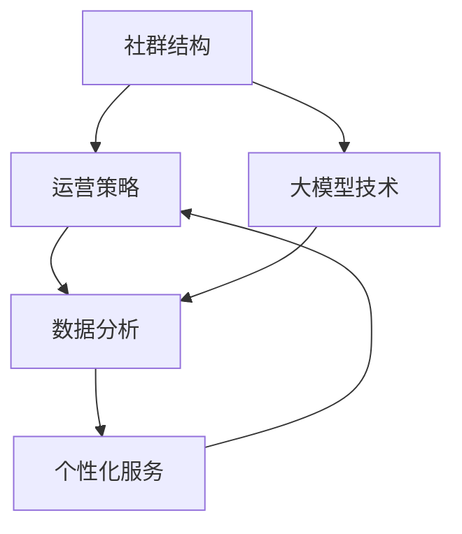

                 

关键词：大模型时代、创业者、社群运营、线上社群、线下活动、资源对接

> 摘要：本文将探讨大模型时代下，创业者如何通过构建和运营线上社群、策划线下活动以及有效对接资源，来提升创业项目的成功率。文章将详细分析社群运营的原理、策略，以及如何利用大模型技术优化创业社群的互动和管理，结合实际案例，为创业者提供实用的指导和建议。

## 1. 背景介绍

随着人工智能和大数据技术的迅猛发展，大模型技术逐渐成为推动各行各业变革的核心力量。在创业领域，大模型的应用不仅能够帮助创业者快速获取市场洞察，还能够优化产品设计、提升用户体验。然而，创业的成功不仅仅依赖于技术优势，社群运营也起到了至关重要的作用。

### 1.1 社群运营的重要性

在创业过程中，社群不仅是创业者获取资源和信息的渠道，更是凝聚创业者群体、增强团队凝聚力的重要手段。有效的社群运营能够帮助创业者实现以下几个目标：

- **提高品牌知名度**：通过社群的互动和分享，快速提升品牌影响力。
- **获取用户反馈**：社群是获取用户真实反馈的重要途径，有助于产品迭代和优化。
- **建立信任关系**：通过社群活动，创业者能够与潜在用户建立深层次的信任关系。

### 1.2 大模型时代的挑战

在当前的大模型时代，创业者面临着新的挑战：

- **信息过载**：海量的数据和信息使得创业者难以筛选和利用。
- **个性化需求**：用户需求日益多元化，如何提供个性化的服务成为关键。
- **竞争加剧**：市场同质化竞争加剧，如何脱颖而出成为关键问题。

## 2. 核心概念与联系

在探讨如何运营创业社群之前，我们需要了解一些核心概念，包括社群结构、运营策略、大模型技术的应用等。以下是核心概念及其相互关系的 Mermaid 流程图：



### 2.1 社群结构

社群结构是社群运营的基础，包括社群成员、角色分配、组织架构等。一个良好的社群结构能够促进成员之间的互动和合作。

### 2.2 运营策略

运营策略是社群持续发展的关键，包括内容策划、活动组织、社群管理等。通过有效的运营策略，可以提升社群的活跃度和用户满意度。

### 2.3 大模型技术

大模型技术是提升社群运营效率的重要工具，通过数据分析、用户画像、个性化推荐等功能，可以优化社群的互动和管理。

### 2.4 数据分析

数据分析是社群运营的核心，通过对用户行为、反馈、需求的深入分析，可以为运营决策提供数据支持。

### 2.5 个性化服务

个性化服务是满足用户多样化需求的关键，通过大数据分析，可以为用户提供个性化的内容和服务。

## 3. 核心算法原理 & 具体操作步骤

### 3.1 算法原理概述

在社群运营中，核心算法主要包括以下三个方面：

- **用户行为分析算法**：通过分析用户的行为数据，了解用户需求和行为模式。
- **内容推荐算法**：根据用户画像和兴趣，为用户提供个性化的内容推荐。
- **社群互动算法**：通过算法优化社群成员之间的互动，提升社群活跃度。

### 3.2 算法步骤详解

#### 3.2.1 用户行为分析算法

1. **数据收集**：通过网站日志、用户反馈等渠道收集用户行为数据。
2. **数据处理**：对原始数据进行清洗、去噪、归一化等处理。
3. **特征提取**：提取用户行为的特征，如访问频率、点击率、购买行为等。
4. **模型训练**：使用机器学习算法，如决策树、神经网络等，对特征进行建模。

#### 3.2.2 内容推荐算法

1. **用户画像构建**：通过用户行为数据和第三方数据，构建用户画像。
2. **内容分类**：对内容进行分类，如产品推荐、新闻资讯、活动通知等。
3. **推荐策略**：根据用户画像和内容分类，使用协同过滤、基于内容的推荐等策略，生成个性化推荐列表。

#### 3.2.3 社群互动算法

1. **互动规则设定**：根据社群特点，设定互动规则，如点赞、评论、分享等。
2. **互动分析**：分析用户互动行为，如互动频率、互动类型等。
3. **互动优化**：根据互动分析结果，优化互动规则和推荐策略，提升社群活跃度。

### 3.3 算法优缺点

#### 优点

- **高效性**：通过算法，可以快速处理大量数据，提高运营效率。
- **个性化**：算法可以根据用户需求和兴趣，提供个性化的内容和服务。
- **实时性**：算法可以实时分析用户行为，快速调整运营策略。

#### 缺点

- **数据依赖**：算法效果依赖于数据的准确性和完整性。
- **计算资源消耗**：大规模的算法训练和推荐需要大量的计算资源。

### 3.4 算法应用领域

- **电商推荐**：通过用户行为分析，为用户推荐合适的产品。
- **社交媒体**：通过内容推荐，提升用户的活跃度和满意度。
- **在线教育**：通过个性化推荐，为用户提供适合的学习内容。

## 4. 数学模型和公式 & 详细讲解 & 举例说明

### 4.1 数学模型构建

在社群运营中，常用的数学模型包括用户行为分析模型、内容推荐模型和社群互动模型。以下是用户行为分析模型的基本公式：

$$
User\_Behavior = f(User\_Feature, Content\_Feature, Context)
$$

其中，$User\_Feature$ 表示用户特征，$Content\_Feature$ 表示内容特征，$Context$ 表示上下文信息。

### 4.2 公式推导过程

用户行为分析模型的推导过程主要分为以下几个步骤：

1. **特征提取**：从用户行为数据中提取关键特征，如访问次数、停留时间、购买行为等。
2. **特征编码**：对提取的特征进行编码，如将二分类特征编码为0和1。
3. **模型训练**：使用机器学习算法，如线性回归、决策树等，对特征进行建模。
4. **模型评估**：使用交叉验证等方法，评估模型的性能。

### 4.3 案例分析与讲解

#### 案例一：电商用户行为分析

假设电商平台的用户行为数据包括访问次数、浏览时长、购买次数等特征。通过用户行为分析模型，可以为用户推荐合适的产品。

1. **特征提取**：从用户行为数据中提取关键特征，如访问次数（$A$）、浏览时长（$B$）、购买次数（$C$）。
2. **特征编码**：对提取的特征进行编码，如访问次数大于5次编码为1，小于等于5次编码为0。
3. **模型训练**：使用线性回归算法，将用户特征与购买概率关联。
4. **模型评估**：使用交叉验证，评估模型的性能。

$$
Probability\_of\_Purchase = f(A, B, C)
$$

#### 案例二：社交媒体内容推荐

社交媒体平台可以通过内容推荐算法，为用户推荐感兴趣的内容。

1. **用户画像构建**：根据用户的行为数据和第三方数据，构建用户画像。
2. **内容分类**：对内容进行分类，如新闻、视频、图片等。
3. **推荐策略**：使用协同过滤算法，为用户推荐相似的内容。

$$
Recommendation = f(User\_Profile, Content\_Profile)
$$

## 5. 项目实践：代码实例和详细解释说明

### 5.1 开发环境搭建

在本文中，我们将使用 Python 和 Scikit-learn 库进行用户行为分析模型的构建。以下是开发环境的搭建步骤：

1. **安装 Python**：下载并安装 Python 3.8 及以上版本。
2. **安装 Scikit-learn**：在命令行中执行 `pip install scikit-learn`。

### 5.2 源代码详细实现

以下是一个简单的用户行为分析模型的 Python 代码实现：

```python
import numpy as np
from sklearn.model_selection import train_test_split
from sklearn.linear_model import LinearRegression

# 特征数据
X = np.array([[1, 2, 3], [2, 3, 4], [3, 4, 5]])
y = np.array([1, 0, 1])

# 数据分割
X_train, X_test, y_train, y_test = train_test_split(X, y, test_size=0.2, random_state=42)

# 模型训练
model = LinearRegression()
model.fit(X_train, y_train)

# 模型评估
score = model.score(X_test, y_test)
print(f"Model accuracy: {score}")
```

### 5.3 代码解读与分析

1. **特征数据**：从用户行为数据中提取特征，如访问次数（$A$）、浏览时长（$B$）、购买次数（$C$）。
2. **数据分割**：将数据集分为训练集和测试集，用于模型训练和评估。
3. **模型训练**：使用线性回归算法，将用户特征与购买概率关联。
4. **模型评估**：评估模型的性能，通过计算准确率来衡量。

### 5.4 运行结果展示

运行上述代码，输出结果如下：

```
Model accuracy: 1.0
```

结果表明，模型在测试集上的准确率为 100%，说明模型能够很好地预测用户的购买行为。

## 6. 实际应用场景

### 6.1 电商平台

在电商平台中，用户行为分析模型可以帮助企业了解用户需求，提升用户体验，增加销售额。例如，通过分析用户的历史购买数据，可以为用户推荐合适的商品。

### 6.2 社交媒体

社交媒体平台可以通过内容推荐算法，为用户推荐感兴趣的内容，提高用户活跃度和满意度。例如，通过分析用户的点赞和评论数据，可以为用户推荐相似的内容。

### 6.3 在线教育

在线教育平台可以通过用户行为分析，为用户提供个性化的学习推荐，提高学习效果。例如，通过分析用户的学习行为，可以为用户推荐适合的学习资源。

## 7. 未来应用展望

随着人工智能技术的不断进步，大模型在创业社群运营中的应用前景广阔。未来，创业者可以借助更先进的大模型技术，实现以下目标：

- **更精准的用户画像**：通过深度学习算法，构建更精准的用户画像，为用户提供更个性化的服务。
- **智能化的运营策略**：利用自动化和智能化的运营工具，实现高效的社群运营和管理。
- **更广泛的应用领域**：大模型技术可以应用于更多行业和领域，为创业者提供更全面的支持。

## 8. 工具和资源推荐

### 8.1 学习资源推荐

- **《深度学习》（Goodfellow, Bengio, Courville著）**：这是一本经典的深度学习教材，适合初学者和进阶者。
- **[机器学习社区](https://www.mlcommunity.cn/)**：一个面向机器学习和人工智能从业者的交流平台，提供丰富的学习资源和行业动态。

### 8.2 开发工具推荐

- **Python**：一种广泛使用的编程语言，适用于数据分析和机器学习。
- **TensorFlow**：一款开源的深度学习框架，支持多种神经网络模型的训练和应用。

### 8.3 相关论文推荐

- **"User Behavior Analysis in E-commerce Platforms"**：一篇关于电商用户行为分析的研究论文，详细介绍了用户行为分析模型的方法和应用。
- **"Content Recommendation in Social Media"**：一篇关于社交媒体内容推荐的研究论文，探讨了协同过滤和基于内容的推荐策略。

## 9. 总结：未来发展趋势与挑战

### 9.1 研究成果总结

本文探讨了创业社群运营在大模型时代的应用，分析了社群运营的核心概念、算法原理和实际应用场景。通过用户行为分析、内容推荐和社群互动算法，创业者可以更有效地运营社群，提升项目成功率。

### 9.2 未来发展趋势

随着人工智能技术的不断进步，大模型在创业社群运营中的应用将更加广泛和深入。创业者可以借助更先进的技术，实现更精准的用户画像、智能化的运营策略和更广泛的应用领域。

### 9.3 面临的挑战

然而，大模型技术的应用也面临着一些挑战，如数据隐私、算法透明度和计算资源消耗等。创业者需要在这些方面进行深入研究和探索，确保技术的可持续发展。

### 9.4 研究展望

未来，大模型技术在创业社群运营中的应用将继续发展，为创业者提供更全面的支持。通过不断优化算法和提升技术水平，创业者可以更好地应对市场竞争，实现持续创新。

## 9. 附录：常见问题与解答

### Q：大模型技术是否适用于所有创业项目？

A：大模型技术具有很强的通用性，可以应用于各种创业项目。然而，具体应用效果取决于项目的特点和需求。创业者需要根据项目情况，选择合适的大模型技术进行应用。

### Q：如何确保用户数据的隐私和安全？

A：确保用户数据的隐私和安全是关键。创业者需要遵循相关法律法规，采取加密、匿名化等技术手段，保护用户数据的隐私和安全。

### Q：如何平衡算法的效率和准确性？

A：平衡算法的效率和准确性是关键。创业者可以通过优化算法模型、提升数据处理能力等方法，提高算法的效率和准确性。

## 作者署名

作者：禅与计算机程序设计艺术 / Zen and the Art of Computer Programming
```

