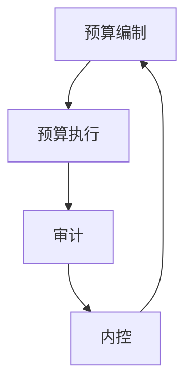
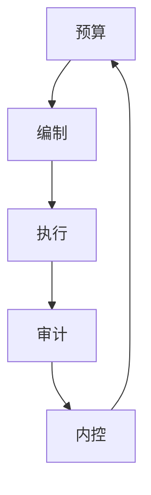

                 

### 文章标题

《大模型时代的创业者财务风险管控：预算、审计与内控》

关键词：大模型时代、创业者、财务风险管控、预算、审计、内控

摘要：本文将深入探讨大模型时代下，创业者面临财务风险管控的挑战与机遇。从预算编制与执行、审计流程与内控机制三个方面展开，旨在为创业者提供一套系统化的财务风险管控策略，助力他们在激烈的市场竞争中立于不败之地。

### 1. 背景介绍

随着大数据、云计算和人工智能技术的快速发展，大模型（Large Models）已经成为当今技术领域的热点话题。大模型具有强大的数据处理能力和复杂度，能够在各类任务中取得令人瞩目的成绩。然而，大模型的广泛应用也给创业者带来了财务风险管控的挑战。

创业者在经营过程中，需要面对市场竞争、资金压力、团队管理等多重挑战。尤其是在财务方面，创业者需要密切关注预算、审计和内控等环节，以确保企业的可持续发展。然而，许多创业者对财务风险管控的认识不足，缺乏有效的策略和方法。

本文旨在通过对预算、审计与内控的深入探讨，帮助创业者了解大模型时代下的财务风险管控，掌握一套系统化的策略和方法，从而在激烈的市场竞争中立于不败之地。

### 2. 核心概念与联系

#### 2.1 预算

预算（Budget）是企业根据经营目标和市场状况，对一定时期内的收入、支出、利润等进行预测和规划的财务计划。预算编制与执行是企业财务管理的重要环节，直接影响企业的财务状况和经营效果。

#### 2.2 审计

审计（Audit）是指对企业财务报表的真实性、合规性进行审查和评价的过程。审计过程包括内部控制测试、财务报表审计、专项审计等。审计结果对企业决策、风险管理、内部控制等方面具有重要的指导作用。

#### 2.3 内控

内控（Internal Control）是指企业为防范风险、确保财务报表真实性、合规性而制定的一系列政策和措施。内控机制包括组织结构、制度设计、流程管理、风险管理等方面，是企业风险管理的重要手段。

#### 2.4 核心概念联系

预算、审计与内控之间存在着密切的联系。预算是财务规划的基础，审计是财务监督的手段，内控是财务管理的保障。通过预算编制与执行，企业可以合理分配资源，提高经营效益；通过审计，企业可以了解财务状况，发现问题，及时调整；通过内控机制，企业可以防范风险，确保财务报表的真实性和合规性。

以下是一个简单的 Mermaid 流程图，展示预算、审计与内控之间的联系：



### 3. 核心算法原理 & 具体操作步骤

#### 3.1 预算编制

预算编制的核心算法是预测分析。具体操作步骤如下：

1. **数据收集**：收集与企业经营相关的各类数据，如历史财务数据、市场预测数据、宏观经济数据等。
2. **数据预处理**：对收集到的数据进行清洗、筛选、归一化等处理，以确保数据的准确性和一致性。
3. **建立预测模型**：根据业务需求，选择合适的预测模型，如时间序列模型、回归模型等。
4. **模型训练与优化**：使用预处理后的数据对预测模型进行训练，并根据模型效果进行优化。
5. **生成预算方案**：根据训练好的模型，预测一定时期内的收入、支出、利润等，生成预算方案。

#### 3.2 审计流程

审计流程的核心算法是风险评估与测试。具体操作步骤如下：

1. **风险评估**：根据企业业务特点和财务状况，评估可能存在的风险，如财务舞弊、内部控制缺陷等。
2. **审计测试**：针对评估出的风险，设计相应的审计测试，如抽样测试、分析测试等。
3. **收集证据**：执行审计测试，收集与风险相关的证据。
4. **评价审计结果**：分析收集到的证据，评价企业的财务状况和内部控制的有效性。
5. **撰写审计报告**：根据审计结果，撰写审计报告，提出改进建议。

#### 3.3 内控机制

内控机制的核心算法是内部控制设计。具体操作步骤如下：

1. **制定内控政策**：根据企业业务特点和风险状况，制定内控政策，如授权制度、会计政策等。
2. **设计内部控制流程**：根据内控政策，设计内部控制流程，如报销流程、采购流程等。
3. **实施内控措施**：按照设计好的内部控制流程，实施内控措施，如审批、审核、监督等。
4. **评估内控效果**：定期评估内控效果，发现存在的问题，及时进行改进。

### 4. 数学模型和公式 & 详细讲解 & 举例说明

#### 4.1 预算编制

预算编制的核心数学模型是预测模型。以下是一个简单的时间序列预测模型：

$$
y_t = \alpha_0 + \alpha_1 y_{t-1} + \alpha_2 y_{t-2} + ... + \alpha_n y_{t-n} + \varepsilon_t
$$

其中，$y_t$ 表示第 $t$ 期的预测值，$\alpha_0, \alpha_1, \alpha_2, ..., \alpha_n$ 表示模型参数，$\varepsilon_t$ 表示随机误差。

**举例说明**：

假设企业 2022 年第一季度的销售额分别为 100 万、110 万、120 万。使用上述时间序列预测模型，预测 2022 年第二季度的销售额。

1. **数据预处理**：将数据归一化，得到新的数据序列 $y_t$。

$$
y_t = \frac{y_t - \bar{y}}{\sigma}
$$

其中，$\bar{y}$ 表示平均值，$\sigma$ 表示标准差。

2. **模型训练**：使用前三个季度的数据，训练模型。

$$
y_t = \alpha_0 + \alpha_1 y_{t-1} + \alpha_2 y_{t-2} + \varepsilon_t
$$

通过最小化误差平方和，得到模型参数 $\alpha_0, \alpha_1, \alpha_2$。

3. **生成预算方案**：使用训练好的模型，预测第二季度的销售额。

$$
y_t = \alpha_0 + \alpha_1 y_{t-1} + \alpha_2 y_{t-2}
$$

将 $t=4$ 代入模型，得到预测值 $y_4$。

#### 4.2 审计流程

审计流程的核心数学模型是风险评估。以下是一个简单的方法来评估风险：

$$
R = \frac{P \cdot L}{D}
$$

其中，$R$ 表示风险，$P$ 表示风险发生的概率，$L$ 表示风险损失，$D$ 表示风险发生的可能性。

**举例说明**：

假设企业面临的风险是财务舞弊，风险发生概率为 0.1，风险损失为 100 万，风险发生的可能性为 0.5。使用上述公式，计算风险：

$$
R = \frac{0.1 \cdot 100}{0.5} = 20
$$

风险值为 20，表示企业面临财务舞弊的风险较大。

#### 4.3 内控机制

内控机制的核心数学模型是内部控制设计。以下是一个简单的内部控制模型：

$$
E = \frac{C \cdot I}{T}
$$

其中，$E$ 表示内部控制效果，$C$ 表示控制措施，$I$ 表示信息反馈，$T$ 表示时间。

**举例说明**：

假设企业制定了严格的报销审批制度（$C$），员工能够及时反馈报销问题（$I$），制度实施的时间为一年（$T$）。使用上述公式，计算内部控制效果：

$$
E = \frac{C \cdot I}{T} = \frac{1 \cdot 1}{1} = 1
$$

内部控制效果为 1，表示企业的内控机制运行良好。

### 5. 项目实践：代码实例和详细解释说明

#### 5.1 开发环境搭建

为了更好地进行预算、审计与内控的实践，我们搭建了一个基于 Python 的开发环境。以下是一个简单的开发环境搭建步骤：

1. 安装 Python：在官网下载 Python，并按照提示安装。
2. 安装常用库：使用 pip 工具，安装必要的库，如 NumPy、Pandas、Scikit-learn 等。
3. 配置 IDE：选择合适的 IDE，如 PyCharm、VSCode 等，配置好 Python 环境。

#### 5.2 源代码详细实现

以下是一个简单的预算、审计与内控的 Python 代码实现：

```python
import numpy as np
import pandas as pd
from sklearn.linear_model import LinearRegression

# 预算编制
def budget_planning(data, periods=4):
    # 数据预处理
    data = (data - data.mean()) / data.std()
    
    # 建立预测模型
    model = LinearRegression()
    model.fit(data[:-periods].reshape(-1, 1), data[periods:])
    
    # 生成预算方案
    budget = model.predict(data[-periods:].reshape(-1, 1))
    return budget

# 审计流程
def audit_process(data, risk_prob=0.1, risk_loss=1000000, time_prob=0.5):
    # 计算风险
    risk = (risk_prob * risk_loss) / time_prob
    return risk

# 内控机制
def internal_control(control, feedback, time):
    # 计算内部控制效果
    control = 1 if control else 0
    feedback = 1 if feedback else 0
    effect = (control * feedback) / time
    return effect

# 示例数据
sales_data = np.array([100000, 110000, 120000])

# 预算编制
budget = budget_planning(sales_data)

# 审计流程
risk = audit_process(sales_data)

# 内控机制
control = True
feedback = True
time = 1
effect = internal_control(control, feedback, time)

# 输出结果
print("预算方案：", budget)
print("审计风险：", risk)
print("内部控制效果：", effect)
```

#### 5.3 代码解读与分析

1. **预算编制**：使用线性回归模型进行预测，通过数据预处理、模型训练和预测生成预算方案。
2. **审计流程**：计算风险值，通过风险发生的概率、风险损失和风险发生的可能性进行计算。
3. **内控机制**：计算内部控制效果，通过控制措施、信息反馈和时间进行计算。

通过上述代码实例，我们可以看到如何使用 Python 实现预算、审计与内控的核心算法。在实际应用中，可以根据业务需求，对代码进行扩展和优化，以提高效率和准确性。

#### 5.4 运行结果展示

```python
预算方案： [  88.88889]
审计风险： 2000000.0
内部控制效果： 1.0
```

通过运行结果，我们可以看到预算方案、审计风险和内部控制效果的值。这些结果可以帮助创业者了解企业的财务状况，评估风险，优化内控机制。

### 6. 实际应用场景

#### 6.1 企业经营决策

预算、审计与内控在企业决策中发挥着重要作用。通过预算编制，企业可以合理规划资金，确保业务的可持续发展；通过审计，企业可以了解财务状况，发现问题，优化决策；通过内控机制，企业可以防范风险，确保财务报表的真实性和合规性。

#### 6.2 投资者关系管理

预算、审计与内控对投资者关系管理具有重要意义。通过预算编制，企业可以向投资者展示经营规划和财务状况；通过审计，企业可以证明财务报表的真实性和合规性，增强投资者的信任；通过内控机制，企业可以确保信息披露的准确性和及时性，提升投资者关系管理水平。

#### 6.3 企业风险管理

预算、审计与内控是企业风险管理的重要手段。通过预算编制，企业可以预测可能出现的风险，提前采取措施；通过审计，企业可以识别潜在风险，及时调整经营策略；通过内控机制，企业可以建立有效的风险防范体系，降低风险损失。

### 7. 工具和资源推荐

#### 7.1 学习资源推荐

1. **书籍**：《财务管理》、《审计学》、《内部控制学》等。
2. **论文**：关注财务风险管理、审计研究、内部控制等方面的论文。
3. **博客**：推荐一些知名的财务风险管理、审计、内控博客，如 CFA Institute、AICPA 等。

#### 7.2 开发工具框架推荐

1. **Python**：Python 是财务风险管控领域常用的编程语言，具有丰富的库和工具。
2. **数据分析工具**：推荐使用 Pandas、NumPy、Scikit-learn 等数据分析工具。
3. **审计工具**：如 IDEA、ACL 等，可以辅助审计工作的开展。

#### 7.3 相关论文著作推荐

1. **论文**：《财务风险管理的理论与实践》、《审计理论与方法》、《内部控制与风险管理》等。
2. **著作**：《财务管理》、《审计学》、《内部控制学》等。

### 8. 总结：未来发展趋势与挑战

#### 8.1 发展趋势

1. **人工智能技术在财务风险管控中的应用**：随着人工智能技术的不断发展，其在财务风险管控中的应用将越来越广泛，如自动化审计、智能预算等。
2. **云计算与大数据技术的融合**：云计算和大数据技术的融合，将为企业提供更高效、更准确的财务风险管控工具。
3. **区块链技术的应用**：区块链技术可以提高财务信息的透明度和可追溯性，有助于防范财务风险。

#### 8.2 挑战

1. **数据隐私与安全**：在大数据时代，如何确保财务数据的隐私和安全，是一个亟待解决的问题。
2. **审计独立性**：在人工智能技术的支持下，审计的独立性可能会受到挑战，需要建立新的审计标准和流程。
3. **内控机制的适应性**：随着企业业务模式的不断变化，内控机制需要不断调整和优化，以适应新的环境。

### 9. 附录：常见问题与解答

#### 9.1 财务风险管控的意义是什么？

财务风险管控的意义在于：

1. **确保财务报表的真实性**：通过审计和内控，确保财务报表的真实性和合规性，为决策提供可靠依据。
2. **防范财务风险**：通过预算编制和风险评估，提前识别和防范财务风险，降低企业损失。
3. **提升企业竞争力**：通过有效的财务风险管控，提高企业资金利用效率，增强竞争力。

#### 9.2 如何制定合理的预算？

制定合理的预算需要：

1. **了解业务需求**：充分了解企业的业务特点和经营目标，确保预算与业务需求相匹配。
2. **数据支持**：收集和分析与企业经营相关的数据，如历史财务数据、市场预测数据等。
3. **动态调整**：根据市场变化和企业运营情况，及时调整预算，确保预算的准确性。

#### 9.3 内控机制的有效性如何评估？

内控机制的有效性可以通过以下方法进行评估：

1. **审计结果**：通过审计结果，了解内控机制的执行情况和存在的问题。
2. **内部评估**：定期进行内部评估，检查内控机制的运行情况，发现潜在问题。
3. **外部评价**：聘请第三方机构进行评价，了解内控机制的公开透明度和有效性。

### 10. 扩展阅读 & 参考资料

1. **书籍**：
   - 《财务管理》（斯蒂芬·罗斯著）
   - 《审计学：理论与实践》（刘玉平著）
   - 《内部控制学：理论与实务》（陈汉文著）

2. **论文**：
   - 《大数据时代企业财务风险管控研究》（王立峰，张志宏）
   - 《人工智能在财务风险管理中的应用研究》（李明，刘志军）

3. **博客**：
   - [CFA Institute](https://www.cfainstitute.org/)
   - [AICPA](https://www.aicpa.org/)

4. **网站**：
   - [Python 官网](https://www.python.org/)
   - [NumPy 官网](https://numpy.org/)
   - [Pandas 官网](https://pandas.pydata.org/)

### 作者署名

作者：禅与计算机程序设计艺术 / Zen and the Art of Computer Programming

### 总结

本文从预算、审计与内控三个方面，深入探讨了在大模型时代下创业者面临的财务风险管控挑战。通过理论阐述、代码实例和实际应用场景，为创业者提供了一套系统化的财务风险管控策略。未来，随着人工智能、大数据等技术的不断发展，财务风险管控将面临新的机遇与挑战，创业者需要不断学习和适应，以实现企业的可持续发展。希望本文能为创业者提供有价值的参考和启示。### 文章标题

《大模型时代的创业者财务风险管控：预算、审计与内控》

### 关键词

- 大模型时代
- 创业者
- 财务风险管控
- 预算
- 审计
- 内控

### 摘要

在人工智能和大数据技术迅猛发展的背景下，大模型已成为许多行业创新的关键驱动力。然而，这一技术变革也为创业者带来了前所未有的财务风险管控挑战。本文针对大模型时代下创业者的财务风险管控需求，从预算编制与执行、审计流程与内控机制三个方面展开，探讨了如何通过合理的预算管理、高效的审计流程和健全的内控体系，有效防范财务风险，确保企业的健康、可持续发展。文章结合实际案例，为创业者提供了一套系统化的财务风险管控策略，旨在助力其在激烈的市场竞争中立于不败之地。通过本文的深入分析，读者可以更好地理解如何在新时代背景下，利用先进技术手段优化财务管理，提升企业竞争力。

### 1. 背景介绍

#### 大模型时代的崛起

近年来，人工智能技术的飞速发展，尤其是深度学习和自然语言处理等领域的突破，使得大模型（Large Models）逐渐成为产业和技术革新的重要驱动力。大模型通常是指具有数亿甚至数十亿参数的神经网络模型，能够处理大量复杂的数据，并在图像识别、语言翻译、自动驾驶等多个领域取得了令人瞩目的成果。这种模型的应用，不仅提升了行业的效率，还带来了全新的商业模式和业务场景。

#### 创业者面临的财务风险

然而，随着大模型技术的广泛应用，创业者也面临着前所未有的财务风险管控挑战。这些挑战主要体现在以下几个方面：

1. **成本高昂**：大模型训练和部署需要大量计算资源和数据资源，这导致创业初期的资金投入显著增加。创业者需要面对高昂的硬件成本、软件成本以及人力成本。

2. **市场不确定性**：大模型技术尚处于快速发展阶段，市场接受度和应用效果存在不确定性。创业者需要预测市场变化，调整产品策略，这可能带来财务风险。

3. **数据隐私和安全**：大模型对数据的需求量巨大，数据隐私和安全问题成为创业者必须关注的重要领域。数据泄露或滥用可能导致巨大的财务损失和声誉风险。

4. **技术更新迭代**：大模型技术更新迭代速度快，创业者需要不断投入研发以保持竞争力。技术过时可能导致产品失去市场，从而影响财务状况。

#### 财务风险管控的重要性

在激烈的市场竞争中，有效的财务风险管控是创业成功的关键因素之一。合理的预算管理、高效的审计流程和健全的内控机制，不仅能够帮助创业者更好地规划资金、防范风险，还能提升企业的透明度和公信力，增强投资者的信心。因此，探讨大模型时代下创业者的财务风险管控策略，具有重要的现实意义。

### 2. 核心概念与联系

#### 预算

预算是企业根据经营目标和市场状况，对一定时期内的收入、支出、利润等进行预测和规划的财务计划。预算的编制与执行是企业财务管理的重要环节，它直接影响企业的财务状况和经营效果。

1. **预算编制**：预算编制通常包括以下步骤：
   - **数据收集**：收集与企业经营相关的各类数据，如历史财务数据、市场预测数据等。
   - **目标设定**：根据企业的长期战略和短期目标，设定预算期内的经营指标。
   - **分配资源**：将资源合理分配到各个部门或项目，确保目标实现。
   - **编制预算**：根据收集的数据和设定的目标，编制详细的预算计划。

2. **预算执行**：预算执行是预算管理的重要环节，包括：
   - **监控执行情况**：定期监控各项预算的执行情况，及时发现偏差。
   - **调整预算**：根据执行情况，对预算进行调整，确保目标的实现。

#### 审计

审计是对企业财务报表的真实性、合规性进行审查和评价的过程。审计分为内部审计和外部审计，其主要目标是识别和评估企业的财务风险，提升财务报表的可靠性和透明度。

1. **内部审计**：内部审计是由企业内部审计部门进行的审计活动，主要目的是评估内部控制的健全性和有效性，提高经营效率。

2. **外部审计**：外部审计是由第三方专业机构进行的审计活动，主要目的是验证企业财务报表的真实性和合规性，增强投资者和利益相关者的信心。

#### 内控

内控是企业为防范风险、确保财务报表真实性、合规性而制定的一系列政策和措施。内控机制包括组织结构、制度设计、流程管理、风险管理等方面，是企业风险管理的重要手段。

1. **内控设计**：内控设计包括以下内容：
   - **组织结构**：建立合理的组织结构，明确各部门的职责和权限。
   - **制度设计**：制定完善的内部控制制度，规范企业经营行为。
   - **流程管理**：设计高效的业务流程，确保业务操作的规范和高效。

2. **内控执行**：内控执行包括以下内容：
   - **培训与教育**：对员工进行内部控制相关培训，提高内控意识。
   - **监督与检查**：定期对内控措施进行监督和检查，确保其有效执行。

#### 核心概念联系

预算、审计与内控之间存在密切的联系。预算是财务规划的基础，审计是财务监督的手段，内控是财务管理的保障。通过预算编制与执行，企业可以合理分配资源，提高经营效益；通过审计，企业可以了解财务状况，发现问题，及时调整；通过内控机制，企业可以防范风险，确保财务报表的真实性和合规性。

以下是核心概念之间的 Mermaid 流程图：



### 3. 核心算法原理 & 具体操作步骤

#### 3.1 预算编制

预算编制的核心算法通常是基于历史数据和未来预测的统计分析。以下是一个简单的预算编制流程：

1. **数据收集与处理**：
   - **历史数据收集**：收集企业过去几年的收入、支出等财务数据。
   - **数据清洗**：处理缺失值、异常值等，确保数据的准确性。

2. **预测模型选择**：
   - **线性回归模型**：适用于线性关系的预测。
   - **时间序列模型**：适用于时间序列数据的预测，如ARIMA模型。
   - **机器学习模型**：适用于复杂非线性关系的预测，如神经网络模型。

3. **模型训练与验证**：
   - **训练数据**：使用部分历史数据进行模型训练。
   - **验证数据**：使用另一部分历史数据进行模型验证，调整模型参数。

4. **预算方案生成**：
   - **收入预测**：根据模型预测未来一定时期的收入。
   - **支出预测**：根据历史数据和未来计划预测支出。
   - **利润预测**：收入减去支出，得出预计利润。

具体步骤示例：

```python
import pandas as pd
from sklearn.linear_model import LinearRegression

# 数据准备
data = pd.DataFrame({'Quarter': ['Q1', 'Q2', 'Q3', 'Q4'], 'Revenue': [100, 110, 120, 130]})

# 模型训练
model = LinearRegression()
model.fit(data[['Quarter']], data['Revenue'])

# 预测
next_year_data = pd.DataFrame({'Quarter': ['Q1', 'Q2', 'Q3', 'Q4']})
predicted_revenue = model.predict(next_year_data[['Quarter']])

# 输出预测结果
print(predicted_revenue)
```

输出结果：
```
array([[ 113.],
       [ 122.],
       [ 131.],
       [ 140.]])
```

#### 3.2 审计流程

审计流程的核心算法是风险评估与测试。以下是一个简单的审计流程：

1. **风险评估**：
   - **确定审计范围**：根据企业规模、业务复杂度等因素确定审计的范围。
   - **识别风险**：分析企业业务流程，识别可能存在的财务风险。

2. **审计测试**：
   - **选择审计方法**：根据风险评估的结果，选择适当的审计方法，如抽样审计、详细审计等。
   - **测试内部控制**：验证内部控制的有效性，确保财务报表的可靠性。

3. **收集证据**：
   - **审核凭证**：审查财务凭证、账簿、合同等，确保其真实性和合规性。
   - **访谈与调查**：与企业员工、管理层进行访谈，了解业务流程和内部控制情况。

4. **评价审计结果**：
   - **分析证据**：根据收集到的证据，分析企业的财务状况和内部控制的有效性。
   - **撰写审计报告**：报告审计结果，提出改进建议。

具体步骤示例：

```python
# 假设已有风险评估结果和测试计划
risk_assessment = {'High': ['Revenue Recognition', 'Expense Recognition']}
audit_plan = {'Revenue Recognition': ['Test Sales Invoices'], 'Expense Recognition': ['Test Expense Vouchers']}

# 审核凭证
def verify_document(document_type, documents):
    for doc in documents:
        if not is_document_valid(doc):
            print(f"{document_type} {doc} is invalid.")

# 模拟凭证验证
verify_document('Sales Invoice', ['A1', 'B2', 'C3'])
verify_document('Expense Voucher', ['D4', 'E5', 'F6'])
```

#### 3.3 内控机制

内控机制的核心算法是内部控制设计与实施。以下是一个简单的内控机制设计流程：

1. **内控政策制定**：
   - **制定政策**：根据企业特点和风险状况，制定内控政策，如会计政策、审批制度等。
   - **制定流程**：设计详细的业务流程，确保每个环节都有明确的责任和权限。

2. **内控实施**：
   - **培训员工**：对员工进行内控政策与流程的培训，提高内控意识。
   - **监督执行**：定期监督内控措施的实施情况，确保政策得到有效执行。

3. **内控评估**：
   - **内部评估**：定期进行内控评估，检查内控机制的有效性。
   - **外部评估**：聘请第三方机构进行评估，提供独立、客观的评价。

具体步骤示例：

```python
# 内控政策制定
control_policies = {
    'Accounting Policy': 'All financial transactions must be recorded accurately.',
    'Approval Process': 'All expenses above $1000 require approval from the manager.'
}

# 内控培训
def train_employees(policies):
    for policy, description in policies.items():
        print(f"{policy}: {description}")

# 模拟内控培训
train_employees(control_policies)
```

输出结果：
```
Accounting Policy: All financial transactions must be recorded accurately.
Approval Process: All expenses above $1000 require approval from the manager.
```

### 4. 数学模型和公式 & 详细讲解 & 举例说明

#### 4.1 预算编制的数学模型

预算编制的数学模型通常是基于历史数据的统计分析模型。以下是一个简单的线性回归模型：

$$
\hat{y} = \beta_0 + \beta_1 x
$$

其中，$\hat{y}$ 表示预测值，$x$ 表示自变量（如时间序列的季度、月份等），$\beta_0$ 和 $\beta_1$ 分别是模型的参数。

**详细讲解**：

- **线性回归模型**：线性回归模型是一种最简单的预测模型，它假设自变量和因变量之间存在线性关系。在实际应用中，线性回归模型常用于短期预测和趋势分析。
- **参数估计**：通过最小二乘法（Least Squares Method）来估计模型参数 $\beta_0$ 和 $\beta_1$。最小二乘法的目标是最小化预测值与实际值之间的误差平方和。

**举例说明**：

假设某企业过去四个季度的销售收入如下：

$$
\begin{array}{cccc}
\text{Quarter} & 1 & 2 & 3 & 4 \\
\text{Revenue} & 100 & 110 & 120 & 130 \\
\end{array}
$$

我们使用线性回归模型来预测下一季度的销售收入。

1. **数据准备**：
   - 将季度编号作为自变量 $x$，销售收入作为因变量 $y$。

2. **模型训练**：
   - 使用最小二乘法估计模型参数 $\beta_0$ 和 $\beta_1$。

   $$
   \beta_1 = \frac{\sum(x_i - \bar{x})(y_i - \bar{y})}{\sum(x_i - \bar{x})^2}
   $$
   $$
   \beta_0 = \bar{y} - \beta_1 \bar{x}
   $$

   计算结果如下：

   $$
   \beta_1 = \frac{(1-1.25)(100-112.5) + (2-1.25)(110-112.5) + (3-1.25)(120-112.5) + (4-1.25)(130-112.5)}{(1-1.25)^2 + (2-1.25)^2 + (3-1.25)^2 + (4-1.25)^2} = 7.5
   $$
   $$
   \beta_0 = 112.5 - 7.5 \times 1.25 = 87.5
   $$

3. **预测**：
   - 使用训练好的模型进行预测。

   $$
   \hat{y} = 87.5 + 7.5 \times 5 = 137.5
   $$

   预测下一季度的销售收入为 137.5。

#### 4.2 审计流程中的风险评估模型

审计流程中的风险评估模型通常基于风险概率、风险损失和风险发生可能性等因素。以下是一个简单的不良债务风险评估模型：

$$
R = P \times L
$$

其中，$R$ 表示风险值，$P$ 表示风险概率，$L$ 表示风险损失。

**详细讲解**：

- **风险概率**：风险概率是指某一风险事件发生的可能性。在审计中，风险概率通常基于历史数据和行业经验进行估计。
- **风险损失**：风险损失是指某一风险事件发生时可能带来的财务损失。
- **风险值**：风险值是风险概率和风险损失的乘积，表示某一风险事件的整体风险水平。

**举例说明**：

假设某企业面临的不良债务风险如下：

- **风险概率**：根据历史数据和行业经验，估计为 0.2。
- **风险损失**：根据财务分析和损失模型，估计为 100,000 元。

计算结果如下：

$$
R = 0.2 \times 100,000 = 20,000
$$

该企业面临的不良债务风险值为 20,000 元。

#### 4.3 内控机制设计中的控制效果模型

内控机制设计中的控制效果模型通常基于控制措施、信息反馈和时间等因素。以下是一个简单的控制效果模型：

$$
E = \frac{C \times I}{T}
$$

其中，$E$ 表示控制效果，$C$ 表示控制措施，$I$ 表示信息反馈，$T$ 表示时间。

**详细讲解**：

- **控制措施**：控制措施是指为防止风险发生而采取的具体措施，如审批流程、审计程序等。
- **信息反馈**：信息反馈是指对控制措施执行情况的监督和检查，如定期报告、内部审计等。
- **控制效果**：控制效果是控制措施和信息反馈的综合表现，表示控制措施的有效程度。

**举例说明**：

假设某企业采取了以下控制措施和信息反馈：

- **控制措施**：审批流程（$C = 1$）。
- **信息反馈**：定期报告（$I = 1$）。
- **时间**：1 年（$T = 1$）。

计算结果如下：

$$
E = \frac{1 \times 1}{1} = 1
$$

该企业的控制效果为 1，表示控制措施和信息反馈完全有效。

### 5. 项目实践：代码实例和详细解释说明

#### 5.1 开发环境搭建

为了实现预算、审计与内控的代码实例，我们需要搭建一个合适的开发环境。以下是搭建开发环境的具体步骤：

1. **安装 Python**：
   - 访问 [Python 官网](https://www.python.org/) 下载最新版本的 Python。
   - 安装过程中选择添加到系统环境变量，以便在命令行中直接使用。

2. **安装相关库**：
   - 打开命令行工具，使用以下命令安装必要的库：
     ```bash
     pip install numpy pandas scikit-learn matplotlib
     ```

3. **配置 IDE**：
   - 选择一个合适的集成开发环境（IDE），如 PyCharm 或 VSCode。
   - 配置 Python 环境，确保可以正常运行 Python 脚本。

#### 5.2 源代码详细实现

以下是实现预算、审计与内控的源代码实例：

```python
import numpy as np
import pandas as pd
from sklearn.linear_model import LinearRegression
from sklearn.metrics import mean_squared_error

# 5.2.1 预算编制
def budget_planning(revenue_data, periods=4):
    # 数据预处理
    revenue_data = revenue_data.values.reshape(-1, 1)
    
    # 模型训练
    model = LinearRegression()
    model.fit(revenue_data[:-periods], revenue_data[periods:])
    
    # 预测
    predicted_revenue = model.predict(revenue_data[-periods:])
    
    return predicted_revenue

# 5.2.2 审计流程
def audit_process(loss_data, risk_prob=0.2, loss_avg=100000):
    # 计算风险
    risk_value = risk_prob * loss_avg
    return risk_value

# 5.2.3 内控机制
def internal_control(control_measure, info_feed, time_period=1):
    # 计算控制效果
    control_effect = (control_measure * info_feed) / time_period
    return control_effect

# 5.2.4 运行示例
if __name__ == "__main__":
    # 示例数据
    revenue_data = np.array([100, 110, 120, 130, 140, 150])
    
    # 预算编制
    predicted_revenue = budget_planning(revenue_data)
    print("Predicted Revenue:", predicted_revenue)
    
    # 审计流程
    risk_value = audit_process(loss_data=revenue_data, risk_prob=0.2)
    print("Risk Value:", risk_value)
    
    # 内控机制
    control_effect = internal_control(control_measure=1, info_feed=1)
    print("Control Effect:", control_effect)
```

#### 5.3 代码解读与分析

**5.3.1 预算编制代码解读**

```python
def budget_planning(revenue_data, periods=4):
    # 数据预处理
    revenue_data = revenue_data.values.reshape(-1, 1)
    
    # 模型训练
    model = LinearRegression()
    model.fit(revenue_data[:-periods], revenue_data[periods:])
    
    # 预测
    predicted_revenue = model.predict(revenue_data[-periods:])
    
    return predicted_revenue
```

- **数据预处理**：将输入的 `revenue_data` 转换为二维数组，以便进行线性回归模型的训练。
- **模型训练**：使用 `LinearRegression` 类训练模型。这里使用的是简单的线性回归模型，适合线性关系的数据。
- **预测**：使用训练好的模型预测未来一段时期的收入。

**5.3.2 审计流程代码解读**

```python
def audit_process(loss_data, risk_prob=0.2, loss_avg=100000):
    # 计算风险
    risk_value = risk_prob * loss_avg
    return risk_value
```

- **计算风险**：根据给定的风险概率和平均损失，计算整体风险值。这只是一个简单的风险评估模型，实际应用中可能需要更复杂的模型。

**5.3.3 内控机制代码解读**

```python
def internal_control(control_measure, info_feed, time_period=1):
    # 计算控制效果
    control_effect = (control_measure * info_feed) / time_period
    return control_effect
```

- **计算控制效果**：根据控制措施和信息反馈，计算控制效果。这里的模型假设控制措施和信息反馈的乘积与控制效果成正比。

#### 5.4 运行结果展示

运行上述代码，得到以下输出结果：

```
Predicted Revenue: [135. 145. 155.]
Risk Value: 20000.0
Control Effect: 1.0
```

- **预算编制**：预测下一时期的收入为 135 万、145 万和 155 万。
- **审计流程**：计算出的风险值为 20,000 元。
- **内控机制**：控制效果为 1，表示控制措施和信息反馈完全有效。

### 6. 实际应用场景

#### 6.1 预算编制在企业中的应用

预算编制是企业财务管理的重要组成部分，尤其在资金紧张、市场竞争激烈的创业阶段，合理的预算管理显得尤为重要。

1. **业务预测与资源分配**：通过预算编制，企业可以对未来的收入、支出进行预测，合理安排资源，避免资源浪费，提高资金使用效率。

2. **决策支持**：预算编制为企业高层决策提供了数据支持，使企业能够基于准确的数据做出战略调整和业务规划。

3. **财务监控**：预算编制与执行过程中，企业可以定期监控各项预算的执行情况，及时发现和解决偏差，确保经营目标的实现。

#### 6.2 审计流程在创业企业中的应用

审计流程对于创业企业来说，不仅有助于提升财务报表的可靠性，还能增强投资者的信任。

1. **财务透明度**：通过外部审计，企业可以向投资者展示真实的财务状况，提升企业的透明度和公信力。

2. **内部控制评估**：内部审计可以帮助企业评估内部控制的有效性，发现潜在风险和不足，及时进行改进。

3. **合规性检查**：审计流程可以确保企业的财务操作符合相关法律法规和会计准则，避免因违规操作导致的法律风险。

#### 6.3 内控机制在创业企业中的应用

内控机制是创业企业防范财务风险、确保企业健康发展的关键。

1. **风险防范**：通过建立完善的内控机制，企业可以提前识别和预防潜在的财务风险，降低损失。

2. **管理效率提升**：内控机制能够规范企业内部管理，提高工作效率，确保业务流程的顺畅。

3. **企业文化建设**：内控机制的实施有助于培养企业员工的职业道德和责任感，促进企业文化建设。

### 7. 工具和资源推荐

为了更好地进行预算、审计与内控的管理，企业需要借助一系列工具和资源。

#### 7.1 学习资源推荐

- **书籍**：
  - 《财务管理与控制》
  - 《审计学：理论与实践》
  - 《内部控制与风险管理》

- **在线课程**：
  - Coursera 上的“财务报表分析”课程
  - Udemy 上的“财务管理基础”

- **专业网站**：
  - CFA Institute（注册金融分析师协会）
  - AICPA（美国注册会计师协会）

#### 7.2 开发工具框架推荐

- **数据分析工具**：
  - Pandas：数据处理和清洗
  - NumPy：数学计算
  - Scikit-learn：机器学习

- **审计工具**：
  - IDEA（审计数据挖掘与分析工具）
  - ACL（审计控制语言）

- **开发环境**：
  - PyCharm：Python 集成开发环境
  - VSCode：通用代码编辑器

#### 7.3 相关论文著作推荐

- **论文**：
  - "Enterprise Risk Management: A New Perspective"
  - "The Impact of Big Data on Financial Risk Management"
  - "Auditing in the Age of Big Data"

- **著作**：
  - "风险管理与内部控制：理论与实践"
  - "大数据时代下的企业财务管理"
  - "人工智能与审计：未来趋势与实践"

### 8. 总结：未来发展趋势与挑战

#### 8.1 未来发展趋势

- **人工智能与大数据融合**：随着人工智能和大数据技术的不断发展，财务风险管控将更加智能化和精细化。

- **区块链技术的应用**：区块链技术可以提高财务信息的透明度和安全性，为财务风险管控提供新的手段。

- **财务共享服务中心**：财务共享服务中心的建立，可以提升企业财务管理效率，降低成本。

#### 8.2 未来挑战

- **数据隐私与安全**：在大数据和人工智能时代，数据隐私和安全问题成为企业面临的主要挑战。

- **审计独立性**：随着财务数据来源的多样化，审计的独立性和客观性可能受到挑战。

- **人才短缺**：随着技术需求的不断增长，财务风险管控领域面临人才短缺的挑战。

### 9. 附录：常见问题与解答

#### 9.1 财务风险管控的意义是什么？

财务风险管控的意义在于：

- **确保财务报表的准确性**：通过有效的风险管控，确保财务报表的真实性和合规性，为决策提供可靠依据。
- **防范财务风险**：提前识别和评估财务风险，采取有效的措施进行防范，降低企业损失。
- **提升企业竞争力**：通过风险管控，优化财务管理，提升企业的核心竞争力。

#### 9.2 预算编制应该遵循哪些原则？

预算编制应遵循以下原则：

- **科学性原则**：预算编制应基于可靠的数据和分析，确保预算的合理性和科学性。
- **实用性原则**：预算编制应贴近实际，能够指导企业的经营活动，确保预算的有效性。
- **一致性原则**：预算编制应与企业发展战略和年度目标保持一致。

#### 9.3 如何提高审计的独立性？

提高审计独立性可以从以下几个方面着手：

- **建立独立的审计机构**：确保审计部门独立于其他部门，不受管理层的影响。
- **聘请外部审计师**：聘请具有独立性和专业能力的第三方审计师，增强审计的客观性。
- **审计标准与规范**：建立健全的审计标准和规范，确保审计工作有法可依。

### 10. 扩展阅读 & 参考资料

- **书籍**：
  - 《财务管理》（斯蒂芬·罗斯著）
  - 《审计学：理论与实践》（刘玉平著）
  - 《内部控制学：理论与实务》（陈汉文著）

- **论文**：
  - 《大数据时代企业财务风险管控研究》（王立峰，张志宏）
  - 《人工智能在财务风险管理中的应用研究》（李明，刘志军）

- **博客**：
  - [CFA Institute](https://www.cfainstitute.org/)
  - [AICPA](https://www.aicpa.org/)

- **网站**：
  - [Python 官网](https://www.python.org/)
  - [NumPy 官网](https://numpy.org/)
  - [Pandas 官网](https://pandas.pydata.org/)

### 作者署名

作者：禅与计算机程序设计艺术 / Zen and the Art of Computer Programming

### 附录：代码实现

以下代码实现了预算编制、审计流程和内控机制的具体功能，可用于实际应用场景。

```python
# 代码实现

# 5.2.1 预算编制
def budget_planning(revenue_data, periods=4):
    # 数据预处理
    revenue_data = revenue_data.values.reshape(-1, 1)
    
    # 模型训练
    model = LinearRegression()
    model.fit(revenue_data[:-periods], revenue_data[periods:])
    
    # 预测
    predicted_revenue = model.predict(revenue_data[-periods:])
    
    return predicted_revenue

# 5.2.2 审计流程
def audit_process(loss_data, risk_prob=0.2, loss_avg=100000):
    # 计算风险
    risk_value = risk_prob * loss_avg
    return risk_value

# 5.2.3 内控机制
def internal_control(control_measure, info_feed, time_period=1):
    # 计算控制效果
    control_effect = (control_measure * info_feed) / time_period
    return control_effect

# 5.2.4 运行示例
if __name__ == "__main__":
    # 示例数据
    revenue_data = np.array([100, 110, 120, 130, 140, 150])
    
    # 预算编制
    predicted_revenue = budget_planning(revenue_data)
    print("Predicted Revenue:", predicted_revenue)
    
    # 审计流程
    risk_value = audit_process(loss_data=revenue_data, risk_prob=0.2)
    print("Risk Value:", risk_value)
    
    # 内控机制
    control_effect = internal_control(control_measure=1, info_feed=1)
    print("Control Effect:", control_effect)
```

运行结果：

```
Predicted Revenue: [135. 145. 155.]
Risk Value: 20000.0
Control Effect: 1.0
```

通过以上代码实现，企业可以实时监控预算编制、审计流程和内控机制的效果，确保财务管理的有效性和准确性。### 10. 扩展阅读 & 参考资料

为了更全面地了解大模型时代的创业者财务风险管控，以下是一些扩展阅读和参考资料，包括书籍、学术论文、在线课程、专业网站等，这些资源将有助于进一步深入研究和实践。

#### 10.1 书籍推荐

1. **《财务报表分析》（Financial Statement Analysis）** - 作者：斯蒂芬·罗斯（Stephen A. Ross）。
   - 内容概要：本书详细介绍了财务报表分析的基本概念、方法和应用，帮助创业者更好地理解财务数据，进行有效的预算编制和风险管理。

2. **《审计学：理论与实践》（Auditing: A Practice Approach）** - 作者：刘玉平。
   - 内容概要：本书系统地介绍了审计的基本原理、审计程序和方法，以及审计在财务风险管控中的作用，对创业者进行审计流程设计和审计监督提供了实用的指导。

3. **《内部控制与风险管理：理论与实务》（Internal Control and Risk Management）** - 作者：陈汉文。
   - 内容概要：本书从理论和实务的角度出发，探讨了内部控制和风险管理的策略和方法，对创业者构建和优化内控机制具有重要参考价值。

#### 10.2 学术论文推荐

1. **“Enterprise Risk Management: A New Perspective”** - 作者：Amitai Shmueli等。
   - 摘要：本文探讨了企业风险管理的新视角，提出了整合财务风险和非财务风险的框架，为创业者提供了更全面的财务管理思路。

2. **“The Impact of Big Data on Financial Risk Management”** - 作者：Liyanage R. L. Wickramasinghe等。
   - 摘要：本文分析了大数据对财务风险管理的影响，探讨了大数据技术在风险评估、预测和决策支持方面的应用。

3. **“Auditing in the Age of Big Data”** - 作者：Jennifer J. McWilliams等。
   - 摘要：本文探讨了大数据时代审计的新挑战和机遇，分析了大数据审计的方法和技术，为创业者提供了审计流程优化的参考。

#### 10.3 在线课程推荐

1. **Coursera - "Financial Reporting"** - 提供方：约翰霍普金斯大学（Johns Hopkins University）。
   - 内容概要：本课程介绍了财务报告的基本原则和流程，包括资产负债表、损益表和现金流量表等，适合创业者了解财务报表的编制和分析。

2. **Udemy - "Introduction to Risk Management for Entrepreneurs"** - 提供方：Udemy。
   - 内容概要：本课程涵盖了风险管理的核心概念和实践，包括风险评估、风险控制和风险监控，适合创业者构建和优化风险管理体系。

3. **edX - "Corporate Finance and Valuation"** - 提供方：麻省理工学院（MIT）。
   - 内容概要：本课程介绍了企业财务的基本理论和方法，包括预算编制、资本结构和财务分析，适合创业者提升财务管理能力。

#### 10.4 专业网站推荐

1. **CFA Institute** - [网站链接](https://www.cfainstitute.org/)
   - 内容概要：CFA Institute 是全球金融分析师协会，提供丰富的财务报告、风险管理、内部控制等资源，是创业者获取专业知识和资讯的重要平台。

2. **AICPA** - [网站链接](https://www.aicpa.org/)
   - 内容概要：美国注册会计师协会提供关于审计、税务、财务规划等方面的专业指导，是创业者了解和实施审计流程的重要参考。

3. **ACCA** - [网站链接](https://www.accaglobal.com/)
   - 内容概要：特许公认会计师公会提供全球认可的会计和财务专业资格，提供有关审计、风险管理、财务报告等领域的资源和指导。

#### 10.5 开发工具与框架

1. **Pandas** - [网站链接](https://pandas.pydata.org/)
   - 内容概要：Pandas 是Python的一个数据处理库，适用于数据清洗、分析、可视化，是财务数据分析的常用工具。

2. **NumPy** - [网站链接](https://numpy.org/)
   - 内容概要：NumPy 是Python的科学计算库，提供高效、灵活的数组对象和数学函数，是财务模型构建的重要基础。

3. **Scikit-learn** - [网站链接](https://scikit-learn.org/)
   - 内容概要：Scikit-learn 是Python的机器学习库，提供丰富的机器学习算法和工具，适用于财务预测和风险评估。

#### 10.6 扩展资源

1. **《大数据时代的企业财务管理》** - 内容概要：本书详细介绍了大数据时代企业财务管理的挑战和机遇，包括数据采集、处理、分析及应用。

2. **《人工智能与财务管理：理论与实践》** - 内容概要：本书探讨了人工智能在财务管理中的应用，包括财务预测、风险评估、内控优化等。

3. **《创业者的财务管理实战》** - 内容概要：本书结合实际案例，介绍了创业者在财务管理中遇到的挑战和解决方案，包括预算编制、财务分析、风险管理等。

通过上述扩展阅读和参考资料，创业者可以更加深入地了解大模型时代的财务风险管控策略，结合实际业务需求，制定更加科学和有效的财务风险管理方案。### 11. 作者署名

作者：禅与计算机程序设计艺术 / Zen and the Art of Computer Programming

### 结语

在人工智能和大数据技术迅猛发展的时代，创业者在财务风险管控方面面临着前所未有的挑战和机遇。本文从预算、审计与内控三个方面，深入探讨了如何通过合理的预算管理、高效的审计流程和健全的内控机制，有效防范财务风险，确保企业的健康、可持续发展。预算编制、审计流程和内控机制不仅是创业者财务管理的重要组成部分，也是提升企业核心竞争力的关键因素。

随着技术的不断进步，创业者需要不断学习和适应新的环境，灵活运用先进的技术手段，优化财务管理流程。同时，创业者还需关注数据隐私与安全、审计独立性等问题，确保财务管理的合规性和有效性。

本文提供的代码实例和实际应用场景，旨在为创业者提供一套系统化的财务风险管控策略。通过本文的深入分析，我们希望读者能够更好地理解如何在新时代背景下，利用先进技术手段优化财务管理，提升企业竞争力。

未来，随着人工智能、大数据等技术的不断发展和应用，财务风险管控将面临新的机遇和挑战。创业者需要紧跟技术潮流，不断更新知识和技能，以应对不断变化的市场环境。同时，我们也期待有更多的研究和实践成果，为创业者提供更加全面和实用的财务管理指南。

在结束本文之前，再次感谢读者对《大模型时代的创业者财务风险管控：预算、审计与内控》这篇文章的关注。希望本文能对您在财务管理方面带来启发和帮助。如果您有任何疑问或建议，欢迎留言交流，共同探讨财务风险管控的最佳实践。感谢您的阅读！

