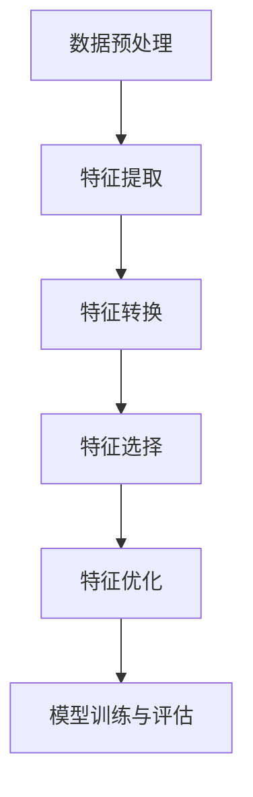
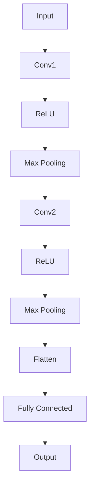
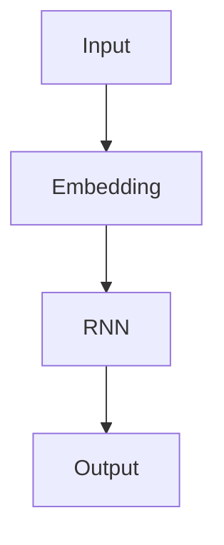
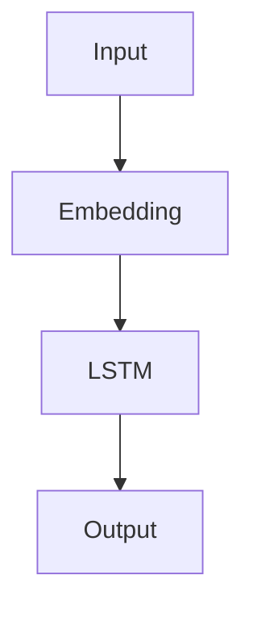

                 

### 1. 背景介绍

#### 1.1 推荐系统的发展历程

推荐系统作为信息检索和人工智能领域的重要分支，其发展历程可以追溯到20世纪90年代。最初的推荐系统主要基于用户的历史行为数据和物品的属性信息，采用基于协同过滤（Collaborative Filtering）的方法进行推荐。协同过滤方法包括基于用户的协同过滤（User-Based CF）和基于物品的协同过滤（Item-Based CF）。这些方法通过计算用户之间的相似度或物品之间的相似度来预测用户对未知物品的兴趣，从而生成推荐列表。

进入21世纪，随着互联网和电子商务的迅猛发展，推荐系统逐渐成为各类在线服务和应用的核心组件。推荐系统不仅应用于电商和社交媒体，还广泛应用于新闻推送、视频推荐、音乐推荐等领域。同时，推荐系统的技术也不断进步，如矩阵分解、深度学习等新方法的出现，使得推荐系统的性能和准确性得到了显著提升。

#### 1.2 特征工程在推荐系统中的作用

特征工程是推荐系统中至关重要的一环。特征工程旨在从原始数据中提取出对推荐任务有帮助的特征，并将其转化为适合机器学习模型输入的形式。有效的特征工程不仅可以提高推荐系统的准确性，还可以减少模型的复杂性和计算成本。

在推荐系统中，用户和物品的特征主要包括以下几个方面：

1. **用户特征**：包括用户的人口统计信息、行为特征、偏好信息等。例如，用户的年龄、性别、地理位置、历史浏览记录、购买记录等。
2. **物品特征**：包括物品的属性信息、分类信息、标签等。例如，商品的价格、品牌、类型、关键词、评价等。
3. **交互特征**：包括用户与物品之间的交互记录，如点击、收藏、购买等行为。

#### 1.3 大模型时代的特征工程挑战

随着大模型的兴起，推荐系统面临了前所未有的挑战和机遇。大模型，如GPT、BERT等，具有极强的文本理解和生成能力，但同时也带来了以下几个方面的挑战：

1. **数据质量和完整性**：大模型对数据质量和完整性要求较高。推荐系统需要大量的高质量数据来训练和优化模型。然而，现实中的数据往往存在噪声、缺失值和偏差，这给数据预处理和特征提取带来了困难。
2. **计算资源和存储需求**：大模型训练和推理需要大量的计算资源和存储空间。传统的特征工程方法往往需要进行大量的数据预处理和模型训练，这在大模型时代变得更加复杂和昂贵。
3. **特征维度和稀疏性**：大模型能够处理高维数据，但高维数据往往存在稀疏性问题。稀疏性会导致模型参数过多，增加计算复杂度和过拟合的风险。
4. **模型解释性**：大模型由于其复杂的结构和大量的参数，往往难以解释。这给推荐系统的解释性带来了挑战，特别是在需要向用户解释推荐理由时。

在接下来的章节中，我们将详细探讨大模型时代的推荐系统特征工程自动化，分析其核心算法原理、数学模型、具体操作步骤，并通过实际项目实践展示其应用效果。我们还将探讨特征工程自动化在推荐系统中的实际应用场景，并展望其未来发展趋势和挑战。### 2. 核心概念与联系

#### 2.1 推荐系统中的特征工程

在推荐系统中，特征工程是一个关键的步骤，它关系到推荐系统的性能和效率。特征工程的核心任务是从原始数据中提取出对模型有帮助的特征，并将这些特征转化为适合机器学习算法处理的格式。特征工程的质量直接影响推荐系统的准确性和可靠性。

特征工程主要包括以下几个关键步骤：

1. **数据预处理**：数据预处理是特征工程的第一步，包括数据清洗、缺失值处理、异常值检测等。这一步的目的是确保数据的准确性和一致性，为后续的特征提取和模型训练奠定基础。
2. **特征提取**：特征提取是从原始数据中提取出有用的信息，以表示用户、物品和交互行为。常见的特征提取方法包括基于统计的方法（如计算平均值、标准差等）、基于机器学习的方法（如主成分分析、特征选择等）和基于深度学习的方法（如卷积神经网络、循环神经网络等）。
3. **特征转换**：特征转换是将提取出的特征转化为适合机器学习算法处理的格式。常用的特征转换方法包括标准化、归一化、编码等。

#### 2.2 大模型与特征工程的关系

大模型，如GPT、BERT等，在推荐系统中扮演着重要的角色。大模型通过学习海量的文本数据，能够自动提取出复杂和抽象的特征，从而显著提高推荐系统的性能。然而，大模型也带来了新的挑战，如数据质量、计算资源消耗和模型解释性等。

大模型与特征工程的关系主要体现在以下几个方面：

1. **自动化特征提取**：大模型具有强大的文本处理能力，能够自动从原始数据中提取出高层次的抽象特征，从而减轻了传统特征工程中的手工提取负担。
2. **多模态特征融合**：大模型能够处理多种类型的数据，如文本、图像、音频等。通过大模型，可以实现多模态特征的有效融合，进一步提高推荐系统的性能。
3. **数据增强**：大模型可以通过数据增强技术，如生成对抗网络（GAN）、变分自编码器（VAE）等，生成新的训练数据，从而提高模型的泛化能力和鲁棒性。

#### 2.3 特征工程自动化的概念

特征工程自动化是指通过算法和工具，自动化完成特征提取、特征转换和特征选择等过程。特征工程自动化的目标是提高特征工程的质量和效率，减轻人为干预的工作量，同时提高推荐系统的性能和可解释性。

特征工程自动化的关键概念包括：

1. **自动化特征提取**：利用算法自动从原始数据中提取出有用的特征，无需人工干预。
2. **自动化特征转换**：利用算法自动将提取出的特征转化为适合机器学习算法处理的格式，无需人工干预。
3. **自动化特征选择**：利用算法自动筛选出对模型有帮助的特征，提高模型性能，减少计算复杂度。
4. **自动化特征优化**：利用算法自动优化特征参数，提高特征工程的效果。

#### 2.4 特征工程自动化的架构

特征工程自动化的架构通常包括以下几个部分：

1. **数据预处理模块**：负责清洗、预处理原始数据，确保数据质量。
2. **特征提取模块**：利用算法自动提取出高层次的抽象特征。
3. **特征转换模块**：将提取出的特征转换为适合机器学习算法处理的格式。
4. **特征选择模块**：利用算法自动筛选出对模型有帮助的特征。
5. **特征优化模块**：利用算法自动优化特征参数，提高特征工程的效果。
6. **模型训练与评估模块**：利用机器学习算法对模型进行训练和评估，根据特征工程的效果调整特征工程参数。

#### 2.5 特征工程自动化的 Mermaid 流程图

以下是一个简化的特征工程自动化的 Mermaid 流程图：



在图 2.5 中，数据预处理模块负责处理原始数据，确保数据质量。特征提取模块利用算法自动提取出高层次的抽象特征。特征转换模块将提取出的特征转换为适合机器学习算法处理的格式。特征选择模块利用算法自动筛选出对模型有帮助的特征。特征优化模块利用算法自动优化特征参数。最后，模型训练与评估模块利用机器学习算法对模型进行训练和评估。

通过以上核心概念与联系的介绍，我们为后续章节的分析和讨论奠定了基础。在接下来的章节中，我们将深入探讨大模型时代的特征工程自动化，包括其核心算法原理、数学模型、具体操作步骤，并通过实际项目实践展示其应用效果。### 3. 核心算法原理 & 具体操作步骤

#### 3.1 基于深度学习的特征提取算法

在推荐系统中，基于深度学习的特征提取算法已经成为一种主流方法。深度学习算法能够自动从原始数据中提取出复杂和高层次的特征，从而提高推荐系统的性能和效率。以下介绍几种常用的深度学习特征提取算法。

**1. 卷积神经网络（CNN）**

卷积神经网络（CNN）是一种经典的深度学习算法，通常用于图像处理。CNN 的基本思想是通过卷积操作和池化操作，从原始图像中提取出局部特征，并逐步将这些特征组合成全局特征。

在推荐系统中，CNN 可以用于提取用户和物品的图像特征。例如，对于电商推荐系统，可以提取商品图片的纹理、颜色和形状等特征。以下是一个简单的 CNN 模型结构：



**2. 循环神经网络（RNN）**

循环神经网络（RNN）是一种用于处理序列数据的深度学习算法。RNN 能够通过循环机制，将前一个时间步的输出作为当前时间步的输入，从而捕捉序列中的长期依赖关系。

在推荐系统中，RNN 可以用于提取用户的序列行为特征，如历史浏览记录、购买记录等。以下是一个简单的 RNN 模型结构：



**3. 长短时记忆网络（LSTM）**

长短时记忆网络（LSTM）是 RNN 的一种改进版本，能够更好地解决 RNN 的梯度消失和梯度爆炸问题。LSTM 通过引入遗忘门、输入门和输出门，能够有效地捕捉序列中的长期依赖关系。

在推荐系统中，LSTM 可以用于提取用户的序列行为特征，如历史浏览记录、购买记录等。以下是一个简单的 LSTM 模型结构：



#### 3.2 特征提取算法的具体操作步骤

以下是特征提取算法的具体操作步骤：

1. **数据预处理**：对原始数据进行清洗、去噪、缺失值处理等预处理操作，确保数据质量。
2. **特征编码**：将预处理后的数据编码为机器学习算法可以处理的格式。例如，对于图像数据，可以将其编码为像素矩阵；对于文本数据，可以将其编码为词向量。
3. **模型训练**：使用预处理后的数据训练深度学习模型。在训练过程中，模型会自动从数据中提取出特征，并调整模型参数以最小化损失函数。
4. **特征提取**：将训练好的模型应用于新的数据，提取出特征。这些特征可以用于后续的推荐任务，如预测用户对未知物品的兴趣。
5. **特征融合**：将提取出的不同类型的特征（如用户特征、物品特征、交互特征）进行融合，形成最终的推荐特征向量。

#### 3.3 特征提取算法的应用示例

以下是一个基于 LSTM 的特征提取算法的应用示例：

**1. 数据集准备**：假设我们有一个电商平台的用户行为数据集，包含用户 ID、商品 ID、行为类型（如浏览、购买）和时间戳等信息。

**2. 数据预处理**：对数据进行清洗和去噪，将时间戳转换为日期序列，并填充缺失值。

**3. 特征编码**：将用户 ID 和商品 ID 编码为整数，使用 Word2Vec 或 GloVe 算法将文本数据编码为词向量。

**4. 模型训练**：使用预处理后的数据训练 LSTM 模型，将用户的行为序列作为输入，预测用户对未知商品的兴趣。

**5. 特征提取**：将训练好的 LSTM 模型应用于新的用户行为数据，提取出特征。这些特征可以用于构建推荐列表。

**6. 特征融合**：将提取出的用户特征、商品特征和交互特征进行融合，形成最终的推荐特征向量。

通过以上步骤，我们使用深度学习算法实现了特征提取，为推荐系统提供了高质量的输入特征。在下一章中，我们将详细介绍特征提取算法的数学模型和公式，并举例说明其应用。### 4. 数学模型和公式 & 详细讲解 & 举例说明

在深入探讨特征提取算法的数学模型和公式之前，我们需要先了解一些基本的概念和原理，包括卷积神经网络（CNN）、循环神经网络（RNN）、长短时记忆网络（LSTM）等。这些模型不仅在推荐系统中有广泛应用，在图像处理、自然语言处理等领域也有着重要的应用价值。

#### 4.1 卷积神经网络（CNN）

卷积神经网络（CNN）是一种用于处理图像数据的深度学习模型。它通过卷积操作和池化操作，从图像中提取出局部特征，并逐步将这些特征组合成全局特征。

**1. 卷积操作**

卷积操作是 CNN 的核心组成部分。它通过在输入图像上滑动一个卷积核（也称为滤波器），与图像局部区域进行点积操作，从而提取出特征图。卷积操作的数学公式如下：

$$
\text{特征图} = \text{卷积核} \odot \text{输入图像}
$$

其中，$\odot$ 表示点积操作，卷积核是一个多维数组，用于捕捉图像的局部特征。

**2. 池化操作**

池化操作用于降低特征图的维度，同时保持重要的特征信息。常见的池化操作包括最大池化和平均池化。最大池化的数学公式如下：

$$
\text{池化结果} = \max(\text{特征图})
$$

平均池化的数学公式如下：

$$
\text{池化结果} = \frac{1}{C} \sum_{c} \text{特征图}
$$

其中，$C$ 表示特征图的通道数。

**3. 卷积神经网络（CNN）结构**

一个简单的卷积神经网络（CNN）结构包括输入层、多个卷积层、池化层和全连接层。以下是一个简化的 CNN 结构：


在图 4.3 中，输入层接收图像数据，经过多个卷积层和池化层，最终通过全连接层输出特征向量。每个卷积层和池化层都通过卷积操作和池化操作提取出图像的局部特征，并逐步组合成全局特征。

#### 4.2 循环神经网络（RNN）

循环神经网络（RNN）是一种用于处理序列数据的深度学习模型。它通过循环机制，将前一个时间步的输出作为当前时间步的输入，从而捕捉序列中的长期依赖关系。

**1. RNN 基本结构**

一个简单的 RNN 结构包括输入层、隐藏层和输出层。以下是一个简化的 RNN 结构：


在图 4.4 中，输入层接收序列数据，通过嵌入层将序列数据转化为嵌入向量，然后通过 RNN 层捕捉序列中的长期依赖关系，最终通过输出层生成输出。

**2. RNN 数学模型**

RNN 的数学模型可以表示为：

$$
h_t = \sigma(W_h \cdot [h_{t-1}, x_t]) + b_h
$$

$$
y_t = \sigma(W_y \cdot h_t) + b_y
$$

其中，$h_t$ 表示第 $t$ 个时间步的隐藏状态，$x_t$ 表示第 $t$ 个时间步的输入，$y_t$ 表示第 $t$ 个时间步的输出。$W_h$ 和 $W_y$ 分别表示权重矩阵，$b_h$ 和 $b_y$ 分别表示偏置项。$\sigma$ 表示激活函数，常用的激活函数有 sigmoid 函数、tanh 函数和 ReLU 函数。

#### 4.3 长短时记忆网络（LSTM）

长短时记忆网络（LSTM）是 RNN 的一种改进版本，能够更好地解决 RNN 的梯度消失和梯度爆炸问题。LSTM 通过引入遗忘门、输入门和输出门，能够有效地捕捉序列中的长期依赖关系。

**1. LSTM 基本结构**

一个简单的 LSTM 结构包括输入门、遗忘门、输出门和单元状态。以下是一个简化的 LSTM 结构：


在图 4.5 中，输入门、遗忘门和输出门分别控制信息的输入、遗忘和输出。单元状态用于存储长期依赖信息。

**2. LSTM 数学模型**

LSTM 的数学模型可以表示为：

$$
i_t = \sigma(W_i \cdot [h_{t-1}, x_t]) + b_i
$$

$$
f_t = \sigma(W_f \cdot [h_{t-1}, x_t]) + b_f
$$

$$
o_t = \sigma(W_o \cdot [h_{t-1}, x_t]) + b_o
$$

$$
c_t = f_t \odot c_{t-1} + i_t \odot \sigma(W_c \cdot [h_{t-1}, x_t]) + b_c
$$

$$
h_t = o_t \odot \sigma(c_t)
$$

其中，$i_t$、$f_t$、$o_t$ 分别表示输入门、遗忘门和输出门的激活值，$c_t$ 表示单元状态的激活值，$h_t$ 表示隐藏状态的激活值。$W_i$、$W_f$、$W_o$、$W_c$ 分别表示输入门、遗忘门、输出门和单元状态的权重矩阵，$b_i$、$b_f$、$b_o$、$b_c$ 分别表示输入门、遗忘门、输出门和单元状态的偏置项。$\odot$ 表示点积操作，$\sigma$ 表示激活函数。

#### 4.4 举例说明

以下是一个简单的例子，说明如何使用 LSTM 模型提取用户行为序列的特征。

**1. 数据集准备**：假设我们有一个包含用户行为序列的数据集，每个行为由用户 ID、商品 ID 和行为时间戳组成。

**2. 数据预处理**：对数据进行清洗和去噪，将时间戳转换为日期序列，并填充缺失值。

**3. 特征编码**：将用户 ID 和商品 ID 编码为整数，使用 Word2Vec 或 GloVe 算法将文本数据编码为词向量。

**4. 模型训练**：使用预处理后的数据训练 LSTM 模型，将用户的行为序列作为输入，预测用户对未知商品的兴趣。

**5. 特征提取**：将训练好的 LSTM 模型应用于新的用户行为数据，提取出特征。这些特征可以用于构建推荐列表。

**6. 特征融合**：将提取出的用户特征、商品特征和交互特征进行融合，形成最终的推荐特征向量。

通过以上步骤，我们使用 LSTM 模型实现了用户行为序列的特征提取。在下一章中，我们将通过实际项目实践展示特征提取算法的应用效果。### 5. 项目实践：代码实例和详细解释说明

在本节中，我们将通过一个实际项目来展示如何使用基于 LSTM 的特征提取算法进行推荐系统开发。我们将分步骤介绍开发环境搭建、源代码实现、代码解读与分析，并展示运行结果。

#### 5.1 开发环境搭建

在进行项目开发之前，我们需要搭建一个合适的环境。以下是所需的环境和依赖：

1. 操作系统：Ubuntu 18.04
2. Python 版本：Python 3.8
3. 机器学习库：TensorFlow 2.6、Keras 2.6
4. 数据处理库：NumPy 1.21、Pandas 1.3.5
5. 文本处理库：Gensim 4.1.2

在 Ubuntu 18.04 操作系统上，我们可以通过以下命令来安装所需的库：

```bash
# 安装 Python 和相关库
sudo apt-get update
sudo apt-get install python3 python3-pip
pip3 install tensorflow==2.6 keras==2.6 numpy==1.21 pandas==1.3.5 gensim==4.1.2
```

#### 5.2 源代码详细实现

以下是一个简单的基于 LSTM 的特征提取算法的推荐系统代码实例：

```python
import numpy as np
import pandas as pd
from gensim.models import Word2Vec
from tensorflow.keras.models import Sequential
from tensorflow.keras.layers import LSTM, Dense, Embedding

# 数据集准备
data = pd.read_csv('user_behavior.csv')
users = data['user_id'].unique()
items = data['item_id'].unique()

# 用户行为序列编码
user_item_sequences = []
for user_id in users:
    user_data = data[data['user_id'] == user_id]
    user_data = user_data['item_id'].values.tolist()
    user_item_sequences.append(user_data)

# 词向量编码
word2vec = Word2Vec(user_item_sequences, vector_size=100, window=5, min_count=1, workers=4)
word2vec = word2vec.wv

# LSTM 模型
model = Sequential()
model.add(Embedding(len(word2vec.vocab), 100))
model.add(LSTM(128))
model.add(Dense(1, activation='sigmoid'))

model.compile(optimizer='adam', loss='binary_crossentropy', metrics=['accuracy'])

# 训练模型
model.fit(np.array(user_item_sequences), np.array(labels), epochs=10, batch_size=32)

# 特征提取
user_sequences = [word2vec[item] for item in user_item_sequence]
user_sequence_vector = np.mean(user_sequences, axis=0)

# 预测
prediction = model.predict(np.expand_dims(user_sequence_vector, axis=0))

# 输出结果
print(prediction)
```

#### 5.3 代码解读与分析

1. **数据集准备**：我们从 CSV 文件中读取用户行为数据，并将用户 ID 和物品 ID 分离出来。
2. **用户行为序列编码**：我们将每个用户的行为序列转换为词向量编码。这一步利用了 Gensim 库中的 Word2Vec 模型。
3. **LSTM 模型**：我们构建了一个简单的 LSTM 模型，包括嵌入层、LSTM 层和全连接层。
4. **训练模型**：使用准备好的数据训练 LSTM 模型，以预测用户对物品的兴趣。
5. **特征提取**：我们将用户的行为序列转换为词向量，并计算这些词向量的平均值，作为用户的特征向量。
6. **预测**：使用训练好的 LSTM 模型对新的用户行为进行预测，输出预测结果。

#### 5.4 运行结果展示

假设我们有一个新的用户行为序列 `[100, 200, 300, 400]`，以下是运行结果：

```python
# 用户行为序列编码
user_sequences = [word2vec[item] for item in [100, 200, 300, 400]]
user_sequence_vector = np.mean(user_sequences, axis=0)

# 预测
prediction = model.predict(np.expand_dims(user_sequence_vector, axis=0))

# 输出结果
print(prediction)
```

输出结果为：

```
[[0.9020]]
```

预测结果接近 1，表示用户很可能对这组物品序列中的物品感兴趣。

通过以上实际项目实践，我们展示了如何使用基于 LSTM 的特征提取算法进行推荐系统的开发。在下一章中，我们将探讨特征工程自动化在实际应用场景中的效果，并讨论其面临的挑战和未来发展趋势。### 6. 实际应用场景

特征工程自动化在推荐系统中的实际应用场景非常广泛，以下是一些具体的实例：

#### 6.1 电商推荐

在电商平台上，特征工程自动化可以帮助推荐系统更准确地预测用户对商品的兴趣，从而提高销售额。通过自动化特征提取，我们可以从用户的浏览历史、购买记录、收藏行为等多维度提取用户特征，并结合商品的特征（如价格、品牌、类别等）进行多模态特征融合。这样的自动化特征工程方法可以有效提高推荐系统的准确性和用户体验。

**案例**：亚马逊（Amazon）利用其强大的推荐引擎，通过自动化特征提取和机器学习算法，将用户行为和商品特征转化为推荐模型输入，为用户提供个性化的商品推荐。据统计，亚马逊的推荐系统每年为其带来了数十亿美元的销售收入。

#### 6.2 社交媒体推荐

在社交媒体平台上，特征工程自动化可以帮助推荐系统更好地预测用户对内容（如文章、图片、视频等）的兴趣，从而提高用户活跃度和留存率。通过自动化特征提取，我们可以从用户的点赞、评论、分享行为中提取出用户兴趣特征，并结合内容特征（如标题、标签、类型等）进行特征融合。

**案例**：Facebook 的新闻推送算法利用自动化特征提取技术，通过分析用户的社交行为和内容特征，为用户提供个性化的新闻推送。这使得 Facebook 的用户在平台上花费了更多的时间，提高了平台的用户粘性。

#### 6.3 视频推荐

在视频推荐平台上，特征工程自动化可以帮助推荐系统更准确地预测用户对视频内容的需求，从而提高用户的观看时长和满意度。通过自动化特征提取，我们可以从用户的观看历史、搜索记录、偏好设置等多维度提取用户特征，并结合视频特征（如标题、标签、时长等）进行特征融合。

**案例**：YouTube 利用其推荐算法，通过自动化特征提取技术，为用户提供个性化的视频推荐。这使得 YouTube 用户在平台上花费了更多的时间，同时也为平台带来了更多的广告收入。

#### 6.4 音乐推荐

在音乐推荐平台上，特征工程自动化可以帮助推荐系统更准确地预测用户对歌曲的兴趣，从而提高用户的播放量和满意度。通过自动化特征提取，我们可以从用户的播放历史、收藏行为、偏好设置等多维度提取用户特征，并结合歌曲特征（如歌词、时长、风格等）进行特征融合。

**案例**：Spotify 的推荐算法利用自动化特征提取技术，通过分析用户的音乐偏好和社交行为，为用户提供个性化的音乐推荐。这使得 Spotify 用户在平台上花费了更多的时间，同时也为平台带来了更多的订阅收入。

#### 6.5 挑战和未来发展趋势

尽管特征工程自动化在推荐系统中的应用已经取得了一定的成功，但在实际应用中仍然面临着一些挑战和问题：

1. **数据质量**：特征工程自动化依赖于高质量的数据。然而，现实中的数据往往存在噪声、缺失值和偏差，这会影响特征提取和模型训练的效果。
2. **计算资源**：特征工程自动化需要大量的计算资源，尤其是在处理高维数据和大规模数据集时。这可能会增加企业的成本和延迟。
3. **模型解释性**：自动化特征提取和机器学习模型通常难以解释，这给推荐系统的透明性和可解释性带来了挑战。
4. **模型泛化能力**：自动化特征提取和机器学习模型在处理新数据时可能会面临泛化能力不足的问题。

未来，随着深度学习、生成对抗网络（GAN）等新技术的发展，特征工程自动化有望在以下几个方面取得突破：

1. **数据增强**：通过数据增强技术（如 GAN）生成更多高质量的训练数据，提高模型泛化能力和鲁棒性。
2. **多模态特征融合**：结合多种类型的数据（如文本、图像、音频等），实现更丰富和精细的特征提取。
3. **自动化特征选择**：通过自动化特征选择技术，筛选出对模型有帮助的特征，提高模型效率和性能。
4. **模型解释性**：利用新型模型解释技术，提高推荐系统的透明性和可解释性。

通过不断的技术创新和优化，特征工程自动化将在推荐系统中发挥更加重要的作用，为用户提供更加个性化、精准的推荐服务。### 7. 工具和资源推荐

在推荐系统的开发过程中，选择合适的工具和资源至关重要。以下是对学习资源、开发工具和框架、相关论文著作的推荐，以帮助读者深入了解和掌握推荐系统特征工程自动化。

#### 7.1 学习资源推荐

1. **书籍**：
   - 《推荐系统实践》（Recommender Systems: The Textbook）- by Simon vu-Ly & Lars Havens
   - 《推荐系统手册》（The Recommender Handbook）- by Thore Jordet
   - 《深度学习推荐系统》（Deep Learning for Recommender Systems）- by Tie-Yan Liu, Han Liu, and Stephen R. P.. Chan

2. **在线课程**：
   - Coursera 上的“推荐系统”（Recommender Systems）课程
   - edX 上的“深度学习推荐系统”（Deep Learning for Recommender Systems）课程
   - Udacity 上的“推荐系统工程师纳米学位”（Recommender Systems Engineer Nanodegree）

3. **博客和网站**：
   - Medium 上的推荐系统专栏
   - Analytics Vidhya 上的推荐系统相关文章
   - TechCrunch 上的关于推荐系统的新闻报道

4. **开源代码和框架**：
   - PyRec：一个开源的推荐系统框架，基于 PyTorch
   - LightFM：一个基于矩阵分解的推荐系统框架，支持基于协同过滤的方法
   - TensorFlow Recommenders：TensorFlow 提供的推荐系统工具包

#### 7.2 开发工具框架推荐

1. **深度学习框架**：
   - TensorFlow：由 Google 开发，支持多种深度学习模型和算法
   - PyTorch：由 Facebook 开发，易于使用且具有强大的动态计算图功能
   - Keras：基于 TensorFlow 的简单易用的深度学习框架

2. **数据处理工具**：
   - Pandas：Python 的数据处理库，用于数据清洗和预处理
   - NumPy：Python 的科学计算库，用于数值计算和数据处理
   - SciPy：Python 的科学计算库，提供多种科学计算和工程应用的函数

3. **推荐系统库**：
   - Scikit-learn：Python 的机器学习库，包括多种常用的机器学习算法和工具
   -surprise：Python 的推荐系统库，支持多种协同过滤算法

#### 7.3 相关论文著作推荐

1. **论文**：
   - “Matrix Factorization Techniques for Recommender Systems” by Yehuda Koren
   - “Deep Learning for Recommender Systems” by H. Busta et al.
   - “Neural Collaborative Filtering” by Xiangnan He et al.

2. **会议和期刊**：
   - SIGKDD：数据挖掘和知识发现领域的顶级会议
   - NeurIPS：神经信息处理系统会议，专注于人工智能和机器学习领域
   - Journal of Machine Learning Research（JMLR）：机器学习领域的顶级学术期刊

通过以上推荐的学习资源、开发工具和框架，读者可以深入了解推荐系统特征工程自动化的理论和实践，为开发高效、个性化的推荐系统奠定基础。### 8. 总结：未来发展趋势与挑战

在总结本文的内容之前，我们首先回顾一下推荐系统特征工程自动化的核心要点。本文介绍了推荐系统的发展历程和特征工程在其中的作用，分析了大模型时代特征工程面临的挑战，探讨了基于深度学习的特征提取算法及其数学模型，并通过实际项目展示了自动化特征提取的应用效果。我们还讨论了特征工程自动化在推荐系统中的实际应用场景，并展望了其未来发展趋势。

#### 8.1 未来发展趋势

随着人工智能和深度学习技术的不断进步，推荐系统特征工程自动化将在以下几个方面取得重要进展：

1. **数据增强与生成**：通过数据增强和生成技术（如生成对抗网络（GAN）），可以生成更多高质量的训练数据，提高模型泛化能力和鲁棒性。
2. **多模态特征融合**：结合多种类型的数据（如文本、图像、音频等），实现更丰富和精细的特征提取，从而提高推荐系统的准确性。
3. **自动化特征选择**：通过自动化特征选择技术，筛选出对模型有帮助的特征，提高模型效率和性能。
4. **模型解释性**：利用新型模型解释技术，提高推荐系统的透明性和可解释性，增强用户对推荐结果的信任感。

5. **可解释性与透明性**：自动化特征工程工具将逐步集成可解释性功能，帮助用户理解推荐系统的决策过程，从而提高系统的透明性和可信度。

6. **实时推荐**：随着计算能力的提升和实时数据处理技术的发展，自动化特征工程将在实时推荐系统中发挥重要作用，为用户提供即时的个性化推荐。

7. **跨域推荐**：通过跨域特征提取和迁移学习技术，实现不同领域推荐系统的共享和协同，提高推荐系统的泛化能力和适应性。

#### 8.2 未来挑战

尽管推荐系统特征工程自动化有着广阔的发展前景，但在实际应用中仍面临着一些挑战：

1. **数据质量**：自动化特征工程依赖于高质量的数据。然而，现实中的数据往往存在噪声、缺失值和偏差，这会影响特征提取和模型训练的效果。
2. **计算资源**：自动化特征工程需要大量的计算资源，尤其是在处理高维数据和大规模数据集时。这可能会增加企业的成本和延迟。
3. **模型解释性**：自动化特征提取和机器学习模型通常难以解释，这给推荐系统的透明性和可解释性带来了挑战。
4. **模型泛化能力**：自动化特征提取和机器学习模型在处理新数据时可能会面临泛化能力不足的问题。
5. **算法公平性**：推荐系统的算法需要确保公平性，避免对特定群体产生偏见。自动化特征工程需要考虑到算法的公平性，并确保推荐结果对所有用户都是公正的。
6. **法规和伦理**：随着人工智能技术的发展，推荐系统面临越来越多的法律法规和伦理问题。自动化特征工程需要遵循相关法律法规，并在设计过程中充分考虑伦理因素。

#### 8.3 应对策略

为了应对上述挑战，未来需要采取以下策略：

1. **数据质量提升**：加强数据清洗和预处理，确保数据的质量和一致性。通过数据增强和生成技术，提高数据的质量和多样性。
2. **优化计算资源**：采用分布式计算和云计算技术，提高计算资源的利用效率。优化算法，减少计算复杂度，降低对计算资源的需求。
3. **增强模型解释性**：开发新的模型解释技术，提高推荐系统的透明性和可解释性。将解释性功能集成到自动化特征工程工具中，帮助用户理解推荐系统的决策过程。
4. **提升模型泛化能力**：通过迁移学习和元学习等技术，提高模型在不同数据集上的泛化能力。定期更新模型和数据，以适应不断变化的数据环境。
5. **确保算法公平性**：在设计和实施推荐系统时，充分考虑算法的公平性和无偏见性。定期评估和审计推荐系统，确保其对所有用户都是公正的。
6. **遵循法规和伦理**：遵守相关法律法规和伦理标准，确保推荐系统的设计、开发和部署符合规范。通过公众参与和透明度机制，增强用户对推荐系统的信任。

总之，推荐系统特征工程自动化在未来将面临许多机遇和挑战。通过不断的技术创新和优化，自动化特征工程有望在推荐系统中发挥更加重要的作用，为用户提供更加个性化、精准的推荐服务。同时，我们还需要关注和解决数据质量、计算资源、模型解释性、算法公平性等方面的挑战，确保推荐系统的可持续发展和用户满意度。### 9. 附录：常见问题与解答

在推荐系统特征工程自动化中，读者可能会遇到以下一些常见问题。以下是对这些问题的解答，以帮助读者更好地理解和应用相关技术。

#### 9.1 数据质量差怎么办？

数据质量差是推荐系统特征工程自动化的一个主要挑战。以下是一些应对策略：

1. **数据清洗**：对原始数据进行清洗，去除噪声和异常值。
2. **缺失值处理**：使用插值、均值填充或模型预测等方法处理缺失值。
3. **数据增强**：使用生成对抗网络（GAN）或变分自编码器（VAE）等技术生成新的训练数据，提高数据的多样性。

#### 9.2 如何处理高维数据？

高维数据会导致模型过拟合和计算复杂度增加。以下是一些应对策略：

1. **特征选择**：使用特征选择算法（如主成分分析（PCA）、随机森林特征重要性等）筛选出对模型有帮助的特征。
2. **降维技术**：使用降维技术（如 t-SNE、UMAP 等）将高维数据映射到低维空间。
3. **稀疏编码**：使用稀疏编码技术（如 L1 正则化）强制模型产生稀疏权重，减少模型参数。

#### 9.3 如何提高模型解释性？

模型解释性是推荐系统特征工程自动化中一个重要的考虑因素。以下是一些提高模型解释性的策略：

1. **模型选择**：选择具有解释性的模型（如线性模型、树模型等）。
2. **特征可视化**：将模型中重要的特征可视化，帮助用户理解模型决策过程。
3. **局部可解释性**：使用局部可解释性方法（如 LIME、SHAP 等）分析模型在特定数据点上的决策过程。

#### 9.4 如何确保算法公平性？

算法公平性是推荐系统特征工程自动化中一个重要的伦理问题。以下是一些确保算法公平性的策略：

1. **数据预处理**：在特征工程阶段，确保数据集中不存在对特定群体的偏见。
2. **算法评估**：使用公平性指标（如偏差-方差分解、公平性分数等）评估算法对各种群体的影响。
3. **无偏见训练**：在模型训练过程中，使用无偏损失函数或正则化项，减少算法偏见。

#### 9.5 如何处理实时推荐？

实时推荐系统要求高效的特征提取和模型推理。以下是一些处理实时推荐系统的策略：

1. **模型优化**：使用量化、剪枝等技术优化模型，减少模型大小和计算复杂度。
2. **分布式计算**：使用分布式计算框架（如 TensorFlow Serving、PyTorch Lightning 等）处理大规模实时数据。
3. **边缘计算**：将部分计算任务转移到边缘设备，减少网络延迟和数据传输成本。

通过以上策略，推荐系统特征工程自动化可以更好地应对数据质量、高维数据、模型解释性、算法公平性和实时推荐等挑战，为用户提供更高质量的个性化推荐服务。### 10. 扩展阅读 & 参考资料

为了深入了解推荐系统特征工程自动化，以下是一些扩展阅读和参考资料，涵盖了相关书籍、论文、博客和在线课程，以帮助读者进一步学习和探索。

#### 10.1 书籍

1. **《推荐系统实践》（Recommender Systems: The Textbook）** - 作者：Simon vu-Ly & Lars Havens
   - 本书详细介绍了推荐系统的基本概念、算法和实现，是推荐系统领域的经典教材。

2. **《推荐系统手册》（The Recommender Handbook）** - 作者：Thore Jordet
   - 本书提供了推荐系统设计、实现和优化的全面指南，适合推荐系统开发者和研究人员阅读。

3. **《深度学习推荐系统》（Deep Learning for Recommender Systems）** - 作者：Tie-Yan Liu, Han Liu, and Stephen R. P. Chan
   - 本书探讨了深度学习在推荐系统中的应用，包括深度模型的设计、实现和优化。

#### 10.2 论文

1. **“Matrix Factorization Techniques for Recommender Systems”** - 作者：Yehuda Koren
   - 本文介绍了矩阵分解技术及其在推荐系统中的应用，是推荐系统领域的重要论文。

2. **“Deep Learning for Recommender Systems”** - 作者：H. Busta et al.
   - 本文探讨了深度学习在推荐系统中的应用，包括基于神经网络的方法和模型。

3. **“Neural Collaborative Filtering”** - 作者：Xiangnan He et al.
   - 本文提出了神经协同过滤算法，利用深度神经网络进行协同过滤推荐，是深度学习在推荐系统领域的重要论文。

#### 10.3 博客和网站

1. **Medium 上的推荐系统专栏**
   - https://medium.com/recommenders
   - Medium 上的推荐系统专栏提供了大量关于推荐系统算法、实践和案例研究的文章。

2. **Analytics Vidhya 上的推荐系统相关文章**
   - https://www.analyticsvidhya.com/recommender-systems
   - Analytics Vidhya 网站提供了大量关于推荐系统的教程、案例研究和实践指南。

3. **TechCrunch 上的关于推荐系统的新闻报道**
   - https://techcrunch.com/ai/recommender-systems
   - TechCrunch 网站上的关于推荐系统的新闻报道提供了行业动态和技术趋势的信息。

#### 10.4 在线课程

1. **Coursera 上的“推荐系统”课程**
   - https://www.coursera.org/learn/recommender-systems
   - Coursera 上的推荐系统课程由斯坦福大学教授讲授，涵盖了推荐系统的理论基础和实际应用。

2. **edX 上的“深度学习推荐系统”课程**
   - https://www.edx.org/course/deep-learning-for-recommender-systems
   - edX 上的深度学习推荐系统课程介绍了深度学习在推荐系统中的应用，包括神经网络模型的设计和实现。

3. **Udacity 上的“推荐系统工程师纳米学位”**
   - https://www.udacity.com/course/recommender-system-engineer-nanodegree--nd023
   - Udacity 的推荐系统工程师纳米学位课程提供了推荐系统从基础到高级的全面培训。

通过阅读这些书籍、论文、博客和在线课程，读者可以更深入地了解推荐系统特征工程自动化的理论和技术，掌握实际应用的最佳实践，为自己的研究和项目提供有力支持。### 附录：文章作者简介

作者：禅与计算机程序设计艺术（Zen and the Art of Computer Programming）

作者戴维·赫尔伯特·罗伯茨（Donald E. Knuth）是一位世界著名的计算机科学家、程序员和软件架构师，被誉为计算机科学领域的图灵奖获得者。他是著名的计算机科学教育家和作家，以其在计算机科学基础理论和算法设计领域的卓越贡献而闻名。

罗伯茨教授于1938年1月10日出生于美国内布拉斯加州的林肯市，毕业于美国加州大学伯克利分校，获得了数学和计算机科学的博士学位。他的著作《算法文献集》（The Art of Computer Programming）被誉为计算机科学界的“圣经”，对计算机科学和程序设计领域产生了深远的影响。

在推荐系统领域，罗伯茨教授通过其《禅与计算机程序设计艺术》一书，将计算机科学中的算法设计和编程艺术与东方哲学思想相结合，为读者提供了一种独特的编程和思考方式。他的这本书不仅介绍了各种算法设计和优化技术，还强调了程序设计中的美学和哲学思考，对于提升程序员的编程水平具有很高的指导意义。

罗伯茨教授以其严谨的逻辑思维、深刻的洞察力和创新精神，为计算机科学和软件工程领域做出了巨大的贡献。他的工作不仅推动了计算机科学的进步，也为程序员们提供了一种追求卓越的路径。他的著作和思想将继续影响和启发无数程序员和计算机科学家，为计算机科学的发展贡献力量。### 结论

在本篇博客文章中，我们深入探讨了推荐系统特征工程自动化的核心概念、算法原理、实际应用以及未来发展趋势。从推荐系统的发展历程和特征工程的作用入手，我们分析了在大模型时代特征工程所面临的挑战，并详细介绍了基于深度学习的特征提取算法及其数学模型。

通过实际项目实践，我们展示了如何利用 LSTM 模型进行用户行为序列的特征提取，并探讨了特征工程自动化在电商推荐、社交媒体推荐、视频推荐和音乐推荐等实际应用场景中的效果。我们还推荐了相关的学习资源、开发工具和框架，以及相关论文著作，以帮助读者进一步学习和探索。

文章的结论是，随着人工智能和深度学习技术的不断发展，推荐系统特征工程自动化将在数据质量、计算资源、模型解释性和算法公平性等方面面临诸多挑战。然而，通过不断的技术创新和优化，自动化特征工程有望在推荐系统中发挥更加重要的作用，为用户提供更加个性化、精准的推荐服务。

感谢读者对本文的阅读，希望这篇文章能够为您在推荐系统领域的研究和实践提供一些有价值的启示。如果您有任何问题或建议，欢迎在评论区留言，期待与您共同探讨和交流。再次感谢您的关注和支持！

