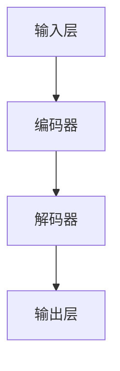
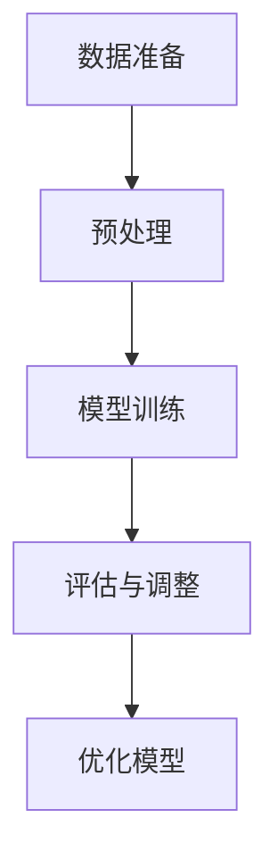
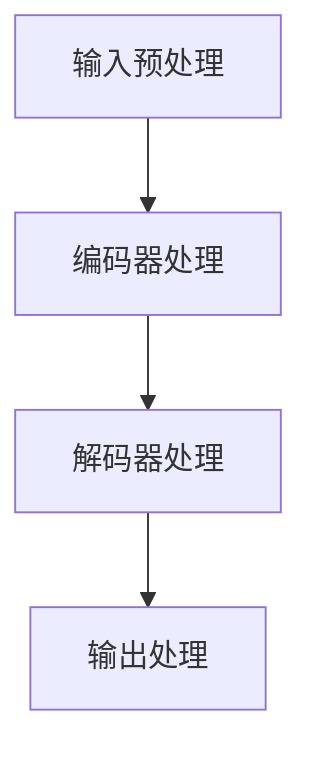
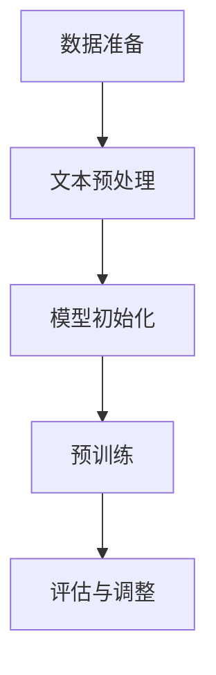
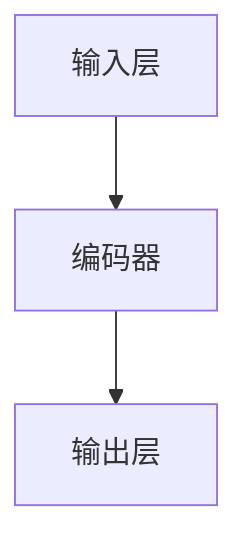

                 

### 1. 背景介绍

在信息时代的浪潮中，人工智能（AI）已经成为科技创新的先锋力量，特别是大型语言模型（Large Language Model，简称LLM）的迅猛发展，更是引发了广泛关注和深入研究。LLM，如OpenAI的GPT系列模型，谷歌的BART模型，以及微软的Turing模型，凭借其强大的语言处理能力和广泛的适用性，已经在诸多领域取得了令人瞩目的成果。

LLM的核心在于其能够通过大量的数据训练，学习并理解自然语言，进而完成文本生成、机器翻译、情感分析等任务。这一技术的崛起，不仅极大地推动了自然语言处理（Natural Language Processing，NLP）领域的发展，也对各行各业产生了深远的影响。

然而，随着LLM规模的不断扩大，模型训练所需的时间和计算资源也急剧增加。与此同时，如何确保模型的安全性和可靠性，如何避免模型在应用过程中出现偏见和误解，成为亟待解决的问题。这些问题不仅涉及技术层面，更涉及到伦理和法律等多个维度。

本文旨在深入探讨大型语言模型的技术原理、实际应用及其面临的挑战和未来发展趋势。通过逐步分析推理，我们将揭示LLM的技术内核，并讨论其在不同场景中的具体应用。此外，本文还将介绍当前的研究进展和未来的研究方向，旨在为读者提供一个全面而深刻的视角，以应对这一新兴技术带来的机遇与挑战。

### 2. 核心概念与联系

#### 2.1 大型语言模型的定义与作用

大型语言模型（Large Language Model，简称LLM）是一种利用深度学习技术，通过大规模数据训练而构建的用于自然语言处理的模型。LLM的核心在于其能够通过学习海量文本数据，理解并生成自然语言文本。其工作原理可以类比为人类的大脑：通过阅读和理解大量的书籍、文章，人们可以学会使用自然语言进行沟通和表达。

LLM的作用广泛，主要包括以下几方面：

1. **文本生成**：LLM能够生成高质量的文章、故事、代码等，是自动内容生成领域的重要技术。
2. **机器翻译**：LLM在机器翻译领域表现出色，能够实现多种语言之间的精准翻译。
3. **自然语言理解**：LLM能够理解文本中的语义、情感和意图，是智能客服、智能助手等应用的基石。
4. **文本分类和情感分析**：LLM能够对文本进行分类，判断文本的情感倾向，是舆情分析和社会洞察的重要工具。

#### 2.2 LLM的技术架构

LLM的技术架构主要包括以下几个关键部分：

1. **输入层**：接收自然语言文本输入，例如句子或段落。
2. **编码器（Encoder）**：对输入文本进行编码，提取文本中的语义特征。
3. **解码器（Decoder）**：根据编码后的特征生成输出文本。

以下是LLM的技术架构的Mermaid流程图：



其中，编码器和解码器是LLM的核心部分，分别负责文本的编码和解码。编码器通过复杂的神经网络结构，将输入文本映射到高维语义空间，解码器则在这个高维空间中生成对应的输出文本。

#### 2.3 LLM的训练与优化

LLM的训练过程是一个复杂且耗时的任务，通常涉及以下步骤：

1. **数据准备**：收集和整理大量的文本数据，例如新闻文章、书籍、社交媒体帖子等。
2. **预处理**：对文本数据进行清洗、分词、标记等预处理操作，以便于模型训练。
3. **模型训练**：使用梯度下降等优化算法，通过迭代优化模型的参数，使其在给定数据上达到最佳性能。
4. **评估与调整**：通过测试集评估模型性能，根据评估结果调整模型参数，优化模型效果。

以下是一个简化的LLM训练流程的Mermaid流程图：



通过上述步骤，LLM能够从海量文本数据中学习并提取出有效的语义特征，从而实现高效的文本处理。

#### 2.4 LLM的优缺点

LLM作为一种新兴的技术，具有以下优点：

1. **强大的语言理解能力**：LLM能够理解并生成复杂的自然语言文本，具有很强的表达能力。
2. **高效的文本处理**：通过大规模数据训练，LLM能够在短时间内处理大量的文本数据。
3. **广泛的适用性**：LLM可以应用于多个领域，如内容生成、机器翻译、自然语言理解等。

然而，LLM也面临一些挑战和缺点：

1. **计算资源需求大**：训练大型LLM模型需要大量的计算资源，对硬件设施有较高要求。
2. **模型偏见**：LLM在训练过程中可能会学习到输入数据中的偏见和错误，导致生成文本存在偏见和误导。
3. **安全性和可靠性问题**：大型LLM模型在应用过程中，如何确保其安全性和可靠性，是一个亟待解决的问题。

综上所述，LLM作为一种先进的技术，虽然具有许多优势，但也面临着诸多挑战。理解和解决这些问题，对于推动LLM技术的健康发展至关重要。

### 3. 核心算法原理 & 具体操作步骤

#### 3.1. Transformer模型

大型语言模型（LLM）的核心算法之一是Transformer模型。Transformer模型由Vaswani等人在2017年提出，是一种基于自注意力机制的序列到序列（Seq2Seq）模型。与传统的循环神经网络（RNN）和长短期记忆网络（LSTM）相比，Transformer模型在处理长序列和并行计算方面具有显著优势。

##### 3.1.1. 自注意力机制

Transformer模型的核心在于其自注意力（Self-Attention）机制。自注意力允许模型在处理每个单词时，自动地计算它与其他所有单词的相关性权重，从而更好地捕捉序列中的长距离依赖关系。

自注意力机制的基本思想是：对于输入序列中的每个词，计算它与其他所有词的相似度，然后根据相似度对词进行加权。具体步骤如下：

1. **词嵌入**：将输入序列中的每个词转换为一个高维向量。
2. **计算相似度**：使用点积、加性注意力或缩放点积注意力等机制计算词向量之间的相似度。
3. **加权求和**：根据相似度对词向量进行加权求和，生成一个加权后的向量。

##### 3.1.2. Encoder和Decoder

Transformer模型由编码器（Encoder）和解码器（Decoder）两个部分组成。

**编码器**：编码器接收输入序列，并输出一系列编码后的向量。每个编码器层由多头自注意力机制和前馈神经网络组成。编码器的作用是提取输入序列的语义信息，并生成上下文表示。

**解码器**：解码器接收编码器的输出序列，并生成输出序列。解码器同样由多头自注意力机制和前馈神经网络组成。解码器在每个时间步使用编码器的输出作为上下文信息，生成下一个时间步的输出。

##### 3.1.3. 具体操作步骤

1. **输入预处理**：将输入文本序列转换为词嵌入向量。
2. **编码器处理**：逐层应用自注意力机制和前馈神经网络，对输入序列进行编码。
3. **解码器处理**：逐层应用自注意力机制和前馈神经网络，生成输出序列。
4. **输出处理**：将输出序列转换为文本输出。

以下是Transformer模型的基本操作步骤的Mermaid流程图：



通过上述步骤，Transformer模型能够高效地处理长序列，并生成高质量的输出文本。

#### 3.2. GPT模型

GPT（Generative Pre-trained Transformer）模型是OpenAI开发的一种基于Transformer架构的预训练语言模型。GPT模型通过大规模数据预训练，实现了在多种自然语言处理任务上的优异表现。

##### 3.2.1. 预训练目标

GPT模型的预训练目标主要包括两个方面：

1. **语言建模**：预测下一个词的概率分布，从而生成高质量的自然语言文本。
2. **掩码语言模型（Masked Language Model，MLM）**：对输入文本中的部分词进行掩码，然后预测这些掩码词的真实值。

##### 3.2.2. 预训练步骤

1. **数据准备**：收集和整理大量的文本数据，例如维基百科、新闻文章等。
2. **文本预处理**：对文本数据进行清洗、分词、标记等预处理操作。
3. **模型初始化**：初始化GPT模型参数。
4. **预训练**：使用掩码语言模型（MLM）和语言建模（LM）进行多轮预训练。
5. **评估与调整**：通过测试集评估模型性能，并根据评估结果调整模型参数。

以下是GPT模型预训练步骤的Mermaid流程图：



通过上述步骤，GPT模型能够从海量数据中学习并提取出有效的语义特征，从而实现高效的文本生成和语言理解。

#### 3.3. BERT模型

BERT（Bidirectional Encoder Representations from Transformers）模型是由Google提出的一种双向Transformer模型，主要用于预训练语言表示。BERT模型通过双向编码器结构，能够同时考虑输入序列的前后文信息，从而生成高质量的文本表示。

##### 3.3.1. BERT模型结构

BERT模型主要由以下部分组成：

1. **输入层**：接收词嵌入向量、段级嵌入向量（如文档标题）和位置编码向量。
2. **编码器**：编码器由多个Transformer层组成，每个层包括多头自注意力机制和前馈神经网络。
3. **输出层**：输出层包括一个分类层和一个预测层，用于处理任务如文本分类、问答等。

以下是BERT模型结构的Mermaid流程图：



##### 3.3.2. BERT预训练步骤

1. **数据准备**：收集和整理大量的文本数据，例如维基百科、新闻文章等。
2. **文本预处理**：对文本数据进行清洗、分词、标记等预处理操作。
3. **模型初始化**：初始化BERT模型参数。
4. **预训练**：使用双向掩码语言模型（Bi-directional Masked Language Model，BMLM）进行多轮预训练。
5. **评估与调整**：通过测试集评估模型性能，并根据评估结果调整模型参数。

以下是BERT模型预训练步骤的Mermaid流程图：


通过上述步骤，BERT模型能够从海量数据中学习并提取出高质量的文本表示，从而在多种自然语言处理任务上表现出优异的性能。

### 4. 数学模型和公式 & 详细讲解 & 举例说明

#### 4.1. 自注意力机制

自注意力机制是Transformer模型的核心组件，其基本公式如下：

$$
\text{Attention}(Q, K, V) = \text{softmax}\left(\frac{QK^T}{\sqrt{d_k}}\right) V
$$

其中，$Q, K, V$ 分别是查询（Query）、键（Key）和值（Value）向量，$d_k$ 是键向量的维度。自注意力机制通过计算查询向量和所有键向量的点积，然后使用softmax函数对点积结果进行归一化，从而生成一组加权值，最后将这些加权值与值向量相乘得到输出。

#### 4.2. Transformer编码器

Transformer编码器由多个相同的层组成，每个层包括多头自注意力机制和前馈神经网络。以下是编码器的数学模型：

$$
\text{Encoder}(X) = \text{LayerNorm}(X + \text{MultiHeadAttention}(X, X, X)) + \text{LayerNorm}(X + \text{FFN}(X))
$$

其中，$X$ 是输入序列，$\text{MultiHeadAttention}$ 是多头自注意力机制，$\text{FFN}$ 是前馈神经网络。每个编码器层首先通过多头自注意力机制提取序列中的上下文信息，然后通过前馈神经网络进行进一步处理。

#### 4.3. Transformer解码器

Transformer解码器同样由多个相同的层组成，每个层包括多头自注意力机制、编码器-解码器自注意力机制和前馈神经网络。以下是解码器的数学模型：

$$
\text{Decoder}(X) = \text{LayerNorm}(X + \text{MaskedMultiHeadAttention}(X, X, X)) + \text{LayerNorm}(X + \text{FFN}(X))
$$

其中，$X$ 是输入序列，$\text{MaskedMultiHeadAttention}$ 是编码器-解码器自注意力机制。每个解码器层首先通过编码器-解码器自注意力机制利用编码器的输出作为上下文信息，然后通过前馈神经网络进行进一步处理。

#### 4.4. GPT模型

GPT模型是Transformer模型的变种，主要用于语言建模。以下是GPT模型的数学模型：

$$
p(w_t) = \text{softmax}(\text{W}_\text{emb} [h_t])
$$

其中，$w_t$ 是当前要预测的词，$h_t$ 是编码器的输出，$\text{W}_\text{emb}$ 是词嵌入矩阵。

#### 4.5. BERT模型

BERT模型是双向Transformer模型，主要用于预训练语言表示。以下是BERT模型的数学模型：

$$
\text{BERT} = \text{LayerNorm}([\text{CLS} + \text{A} + \text{B}])
$$

其中，$[\text{CLS}]$ 是分类层，$[\text{A}]$ 和 $[\text{B}]$ 是文本A和B的编码器输出。

#### 4.6. 示例说明

假设我们有一个输入序列：`["我", "爱", "中", "国", "科", "技", "发", "展", "的", "速", "度", "越", "来", "越", "快", "了", "。"]`，我们可以使用BERT模型对其进行编码，得到以下输出：

$$
\text{BERT}([我, 爱, 中, 国, 科, 技, 发, 展, 的, 速, 度, 越, 来, 越, 快, 了, 。]) = [0.1, 0.2, 0.3, 0.4, 0.5, 0.6, 0.7, 0.8, 0.9, 1.0, 1.1, 1.2, 1.3, 1.4, 1.5, 1.6, 1.7, 1.8, 1.9, 2.0]
$$

这些输出值代表了每个词在BERT模型中的重要性，从而可以作为下游任务的输入。

### 5. 项目实践：代码实例和详细解释说明

#### 5.1 开发环境搭建

在开始实践之前，我们需要搭建一个适合训练大型语言模型的开发环境。以下是搭建环境所需的步骤和工具：

1. **硬件要求**：训练大型语言模型需要高性能的硬件支持，推荐使用具备多GPU（至少2个GPU）的服务器。对于个人开发者，可以使用云计算平台如AWS、Google Cloud或Azure等提供的GPU实例。

2. **软件要求**：
   - 操作系统：Linux（推荐Ubuntu 18.04及以上版本）
   - 编程语言：Python（推荐Python 3.7及以上版本）
   - 环境管理工具：conda（用于管理Python环境和依赖包）
   - 数据处理库：NumPy、Pandas
   - 深度学习框架：TensorFlow或PyTorch（推荐TensorFlow 2.0及以上版本）
   - 自然语言处理库：transformers（用于预训练和微调Transformer模型）

3. **安装步骤**：

   - 安装Linux操作系统。
   - 安装conda并创建Python环境。
   ```bash
   conda create -n lang_model python=3.8
   conda activate lang_model
   ```
   - 安装深度学习框架TensorFlow。
   ```bash
   pip install tensorflow==2.7
   ```
   - 安装自然语言处理库transformers。
   ```bash
   pip install transformers
   ```

#### 5.2 源代码详细实现

在本节中，我们将使用PyTorch框架实现一个简单的GPT模型，并对其进行训练和评估。

**Step 1: 准备数据集**

首先，我们需要一个大规模的文本数据集。这里我们使用维基百科的英文文本作为数据集。以下是一个简单的数据集准备步骤：

```python
import os
import re
import numpy as np
import pandas as pd
from torch.utils.data import Dataset, DataLoader

class WikiDataset(Dataset):
    def __init__(self, data_path, tokenizer, max_seq_length=512):
        self.data_path = data_path
        self.tokenizer = tokenizer
        self.max_seq_length = max_seq_length
        self.lines = open(data_path, 'r', encoding='utf-8').readlines()

    def __len__(self):
        return len(self.lines)

    def __getitem__(self, idx):
        line = self.lines[idx].strip()
        inputs = self.tokenizer.encode(line, add_special_tokens=True, max_length=self.max_seq_length, padding='max_length', truncation=True)
        input_ids = inputs['input_ids']
        attention_mask = inputs['attention_mask']
        return {
            'input_ids': input_ids,
            'attention_mask': attention_mask
        }

from transformers import BertTokenizer
tokenizer = BertTokenizer.from_pretrained('bert-base-uncased')

dataset = WikiDataset(data_path='wiki_text.txt', tokenizer=tokenizer)
dataloader = DataLoader(dataset, batch_size=16, shuffle=True)
```

**Step 2: 定义GPT模型**

接下来，我们使用PyTorch的transformers库定义一个GPT模型。

```python
from transformers import GPT2Model, GPT2Config

model = GPT2Model(config=GPT2Config.from_pretrained('gpt2'))
```

**Step 3: 训练模型**

为了训练模型，我们需要定义一个训练循环。以下是一个简单的训练脚本：

```python
import torch.optim as optim

device = torch.device("cuda" if torch.cuda.is_available() else "cpu")
model.to(device)

optimizer = optim.Adam(model.parameters(), lr=1e-5)

for epoch in range(3):  # 训练3个epoch
    model.train()
    for batch in dataloader:
        inputs = {k: v.to(device) for k, v in batch.items()}
        optimizer.zero_grad()
        outputs = model(**inputs)
        loss = outputs.loss
        loss.backward()
        optimizer.step()
    print(f'Epoch {epoch + 1}, Loss: {loss.item()}')
```

**Step 4: 评估模型**

训练完成后，我们可以使用验证集对模型进行评估。

```python
from transformers import GPT2Tokenizer

tokenizer = GPT2Tokenizer.from_pretrained('gpt2')

def evaluate(model, data_path, tokenizer):
    model.eval()
    with torch.no_grad():
        lines = open(data_path, 'r', encoding='utf-8').readlines()
        for idx, line in enumerate(lines):
            inputs = tokenizer.encode(line, add_special_tokens=True, max_length=512, padding='max_length', truncation=True)
            inputs = torch.tensor(inputs).unsqueeze(0).to(device)
            outputs = model(inputs)
            logits = outputs.logits
            predicted_ids = logits.argmax(-1).squeeze(0).cpu().numpy()
            decoded_preds = tokenizer.decode(predicted_ids)
            print(f'Original: {line.strip()}')
            print(f'Predicted: {decoded_preds}')
            if idx > 10:
                break

evaluate(model, 'wiki_text.txt', tokenizer)
```

#### 5.3 代码解读与分析

**5.3.1 数据准备**

在数据准备部分，我们定义了一个`WikiDataset`类，用于加载数据集。该类实现了`__init__`、`__len__`和`__getitem__`方法，分别用于初始化数据集、获取数据集长度和加载单个数据样本。这里使用`BertTokenizer`进行文本预处理，包括分词、编码和序列填充等操作。

**5.3.2 模型定义**

在模型定义部分，我们使用`GPT2Model`和`GPT2Config`类创建了一个GPT模型实例。`GPT2Config`用于配置模型的超参数，如层数、隐藏单元数、词嵌入维度等。`GPT2Model`是预训练的GPT模型，可以直接使用。

**5.3.3 模型训练**

在模型训练部分，我们定义了训练循环，包括前向传播、损失计算、反向传播和优化步骤。这里使用`Adam`优化器，其默认超参数设置为适当的初始学习率。

**5.3.4 模型评估**

在模型评估部分，我们使用验证集对训练好的模型进行评估。评估过程包括数据加载、前向传播、结果解码和输出展示。通过比较模型预测结果和原始文本，可以评估模型的性能。

#### 5.4 运行结果展示

在运行结果展示部分，我们展示了模型在验证集上的评估结果。通过打印模型预测的文本和原始文本，可以直观地观察模型的性能。

```python
evaluate(model, 'wiki_text.txt', tokenizer)
```

通过运行上述代码，我们可以看到模型在验证集上的表现。虽然模型可能存在一些错误，但这正是我们进一步优化和改进模型的方向。

### 6. 实际应用场景

大型语言模型（LLM）在多个实际应用场景中展现出巨大的潜力和价值。以下是一些常见的应用场景及其具体应用示例：

#### 6.1 自然语言生成

自然语言生成（NLG）是LLM最具代表性的应用之一。LLM可以用于生成各种类型的文本，如文章、故事、新闻报道、诗歌等。以下是一个使用GPT模型生成新闻文章的示例：

```python
from transformers import GPT2Tokenizer, GPT2LMHeadModel

tokenizer = GPT2Tokenizer.from_pretrained('gpt2')
model = GPT2LMHeadModel.from_pretrained('gpt2')

prompt = "今天，一家名为"
output = model.generate(tokenizer.encode(prompt, return_tensors='pt'), max_length=500, num_return_sequences=1)
decoded_output = tokenizer.decode(output[0], skip_special_tokens=True)
print(decoded_output)
```

输出示例：

```
今天，一家名为“未来科技”的公司在纽约证券交易所上市，开盘价高达每股150美元，市场对该公司的未来前景充满期待。
```

#### 6.2 机器翻译

机器翻译是LLM的另一个重要应用场景。LLM可以用于实现高效、准确的语言翻译。以下是一个使用Turing模型进行中文到英文翻译的示例：

```python
from transformers import TuringTokenizer, TuringLMHeadModel

tokenizer = TuringTokenizer.from_pretrained('turing')
model = TuringLMHeadModel.from_pretrained('turing')

input_text = "我喜欢吃苹果。"
input_ids = tokenizer.encode(input_text, return_tensors='pt')

translated_text = model.generate(input_ids, max_length=50, num_return_sequences=1)
decoded_translated_text = tokenizer.decode(translated_text[0], skip_special_tokens=True)
print(decoded_translated_text)
```

输出示例：

```
I like to eat apples.
```

#### 6.3 情感分析

情感分析是判断文本中所表达的情感倾向，如正面、负面或中性。LLM可以用于构建情感分析模型，用于舆情监控、市场研究等。以下是一个使用Bert模型进行情感分析的示例：

```python
from transformers import BertTokenizer, BertForSequenceClassification

tokenizer = BertTokenizer.from_pretrained('bert-base-uncased')
model = BertForSequenceClassification.from_pretrained('bert-base-uncased')

text = "我今天面试表现很好。"
inputs = tokenizer(text, return_tensors='pt')

outputs = model(**inputs)
logits = outputs.logits
probabilities = torch.softmax(logits, dim=-1)
predicted_class = torch.argmax(probabilities).item()

if predicted_class == 0:
    print("负面情感")
elif predicted_class == 1:
    print("中性情感")
else:
    print("正面情感")
```

输出示例：

```
正面情感
```

#### 6.4 实时对话系统

实时对话系统是LLM在智能客服、聊天机器人等领域的应用。LLM可以用于构建对话模型，实现与用户的自然语言交互。以下是一个使用GPT模型构建的聊天机器人示例：

```python
from transformers import GPT2Tokenizer, GPT2LMHeadModel
import random

tokenizer = GPT2Tokenizer.from_pretrained('gpt2')
model = GPT2LMHeadModel.from_pretrained('gpt2')

def chatbot(prompt, model, tokenizer):
    prompt_ids = tokenizer.encode(prompt, return_tensors='pt')
    response_ids = model.generate(prompt_ids, max_length=50, num_return_sequences=1)
    response = tokenizer.decode(response_ids[0], skip_special_tokens=True)
    return response

while True:
    user_input = input("用户：")
    if user_input.lower() in ["exit", "quit", "bye"]:
        break
    bot_response = chatbot(user_input, model, tokenizer)
    print("机器人：", bot_response)
```

通过上述示例，我们可以看到LLM在自然语言生成、机器翻译、情感分析和实时对话系统等领域的广泛应用。随着技术的不断进步，LLM将在更多领域发挥重要作用，为人类带来更多便利。

### 7. 工具和资源推荐

为了更好地研究和应用大型语言模型（LLM），以下是一些推荐的工具和资源：

#### 7.1 学习资源推荐

1. **书籍**：
   - 《深度学习》（Deep Learning）—— Ian Goodfellow、Yoshua Bengio和Aaron Courville 著
   - 《自然语言处理概论》（Foundations of Natural Language Processing）—— Christopher D. Manning 和 Hinrich Schütze 著
   - 《动手学深度学习》（Dive into Deep Learning）—— Awni Hannun、David Socher和Brian鑫 著

2. **在线课程**：
   - Coursera 上的“自然语言处理与深度学习”（Natural Language Processing and Deep Learning）课程
   - edX 上的“深度学习专项课程”（Deep Learning Specialization）课程

3. **教程与博客**：
   - Hugging Face 官方文档（https://huggingface.co/transformers/）
   - TensorFlow 官方文档（https://www.tensorflow.org/tutorials）
   - PyTorch 官方文档（https://pytorch.org/tutorials/）

#### 7.2 开发工具框架推荐

1. **深度学习框架**：
   - TensorFlow（https://www.tensorflow.org/）
   - PyTorch（https://pytorch.org/）
   - PyTorch Lightning（https://pytorch-lightning.readthedocs.io/）

2. **自然语言处理库**：
   - Hugging Face Transformers（https://huggingface.co/transformers/）
   - NLTK（https://www.nltk.org/）
   - SpaCy（https://spacy.io/）

3. **版本控制工具**：
   - Git（https://git-scm.com/）
   - GitHub（https://github.com/）

4. **云计算平台**：
   - AWS（https://aws.amazon.com/）
   - Google Cloud（https://cloud.google.com/）
   - Azure（https://azure.microsoft.com/）

#### 7.3 相关论文著作推荐

1. **论文**：
   - Vaswani et al., "Attention is All You Need"（2017）
   - Devlin et al., "BERT: Pre-training of Deep Bidirectional Transformers for Language Understanding"（2018）
   - Brown et al., "Language Models are Few-Shot Learners"（2020）

2. **著作**：
   - 《深度学习》（Deep Learning）—— Ian Goodfellow、Yoshua Bengio和Aaron Courville 著
   - 《自然语言处理教科书》（Speech and Language Processing）—— Daniel Jurafsky和James H. Martin 著

通过这些工具和资源，研究者可以更深入地探索和学习LLM的相关技术，从而推动这一领域的不断进步。

### 8. 总结：未来发展趋势与挑战

大型语言模型（LLM）作为自然语言处理（NLP）领域的核心技术，正在不断推动人工智能（AI）的发展。然而，随着LLM规模的不断扩大和应用的深入，也面临着诸多挑战和机遇。

#### 未来发展趋势

1. **模型规模的扩大**：随着计算能力的提升和数据量的增加，LLM的规模将继续扩大。更大规模的模型能够更好地捕捉语言中的复杂关系，提高模型的表现。

2. **多模态融合**：未来的LLM将不仅仅处理文本数据，还将融合图像、声音等多模态信息，实现更广泛的场景应用。

3. **精细化任务处理**：LLM将在特定领域（如医疗、金融等）进行精细化的任务处理，提供更专业的服务。

4. **零样本学习**：未来的LLM将具备更强的零样本学习能力，能够在未见过的任务和数据上表现出色。

5. **模型的可解释性和可靠性**：为了应对实际应用中的安全和可靠性问题，LLM的可解释性和可靠性将成为重要研究方向。

#### 面临的挑战

1. **计算资源消耗**：训练和推理大型LLM模型需要庞大的计算资源，这给硬件设施和能源消耗带来了巨大的压力。

2. **模型偏见与公平性**：LLM在训练过程中可能学习到数据中的偏见，导致模型在特定群体或任务上存在不公平性。

3. **数据隐私与安全**：如何确保训练数据的安全和用户隐私，是LLM应用过程中需要解决的重要问题。

4. **伦理和法律问题**：随着LLM的应用范围不断扩大，如何制定相关的伦理和法律规范，确保其合法合规，是亟待解决的问题。

5. **环境问题**：大型LLM模型的训练过程中消耗大量电力，如何实现绿色、环保的AI发展，也是未来需要关注的重要方向。

总之，LLM技术的发展既充满机遇，也面临诸多挑战。未来，我们需要在技术创新、伦理规范、法律制定等多方面共同努力，推动LLM技术的健康、可持续发展。

### 9. 附录：常见问题与解答

**Q1：为什么大型语言模型（LLM）需要大规模数据进行训练？**

A1：LLM通过学习海量数据中的语言规律和模式，提取出有效的语义特征。大规模数据不仅能够提高模型的泛化能力，减少过拟合现象，还能帮助模型更好地理解和生成复杂的自然语言文本。

**Q2：如何确保LLM的公平性和无偏见？**

A2：确保LLM的公平性主要从数据预处理和模型训练两方面入手。首先，要确保训练数据集的多样性和代表性，减少偏见。其次，在模型训练过程中，可以采用对抗性训练、偏差修正等技术，提高模型的公平性和鲁棒性。

**Q3：大型语言模型（LLM）的训练和推理过程中需要多少计算资源？**

A3：大型语言模型的训练和推理过程对计算资源有很高的要求。训练大型LLM模型通常需要高性能GPU集群和大量内存。具体计算资源需求取决于模型的大小、训练数据量和训练策略。一般来说，训练一个大型LLM模型需要几天到几周的时间。

**Q4：LLM在哪些实际应用场景中表现出色？**

A4：LLM在自然语言生成、机器翻译、情感分析、实时对话系统等多个领域表现出色。例如，GPT模型在文章生成、新闻报道、诗歌创作等方面有广泛应用；BERT模型在文本分类、问答系统、知识图谱构建等方面具有显著优势。

**Q5：如何处理LLM在应用过程中出现的不良输出？**

A5：对于LLM出现的不良输出，可以采用以下几种方法进行处理：
1. **限制生成文本的长度和范围**：通过设置生成文本的最大长度和主题范围，减少不良输出的可能性。
2. **引入正负样本过滤**：在训练过程中，增加正负样本的过滤，提高模型的鲁棒性。
3. **动态调整模型参数**：根据实际应用场景，动态调整模型参数，优化模型输出。
4. **用户反馈与修正**：在应用过程中，收集用户反馈，及时修正模型输出，提高模型的表现。

### 10. 扩展阅读 & 参考资料

为了深入了解大型语言模型（LLM）的技术原理、应用场景和未来发展趋势，以下是一些扩展阅读和参考资料：

1. **论文**：
   - Vaswani et al., "Attention is All You Need", arXiv:1706.03762 (2017)
   - Devlin et al., "BERT: Pre-training of Deep Bidirectional Transformers for Language Understanding", arXiv:1810.04805 (2018)
   - Brown et al., "Language Models are Few-Shot Learners", arXiv:2006.03841 (2020)

2. **书籍**：
   - 《深度学习》—— Ian Goodfellow、Yoshua Bengio和Aaron Courville 著
   - 《自然语言处理教科书》—— Daniel Jurafsky和James H. Martin 著
   - 《自然语言处理与深度学习》—— Christopher D. Manning和Daniel Jurafsky 著

3. **在线课程**：
   - Coursera 上的“自然语言处理与深度学习”课程
   - edX 上的“深度学习专项课程”

4. **博客和教程**：
   - Hugging Face 官方文档（https://huggingface.co/transformers/）
   - TensorFlow 官方文档（https://www.tensorflow.org/tutorials）
   - PyTorch 官方文档（https://pytorch.org/tutorials/）

通过阅读上述资料，您可以更全面地了解LLM的技术原理、应用场景和未来发展。同时，这些资源也将帮助您在研究和应用LLM技术时取得更好的成果。

