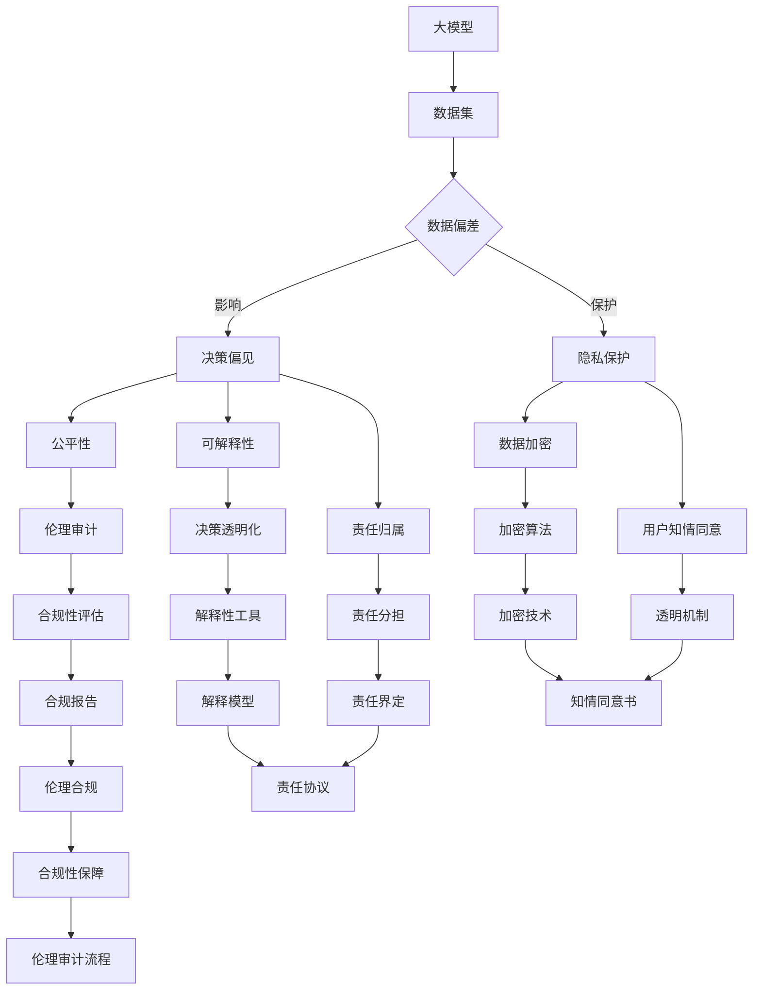
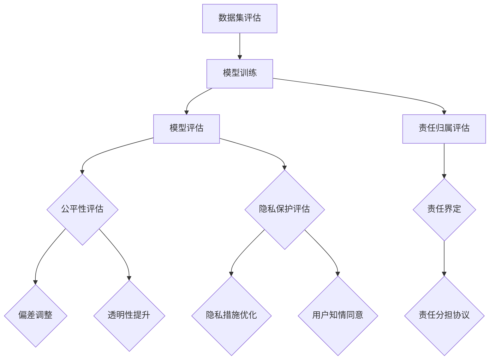

                 

# 大模型的伦理审计：确保AI应用的道德合规性

## 关键词
- 大模型
- 伦理审计
- AI应用
- 道德合规性
- 人工智能伦理

## 摘要
本文旨在探讨大模型在AI应用中的伦理审计问题，以保障AI应用的道德合规性。通过深入分析大模型的特性、现有伦理问题的挑战，以及应对策略，本文提出了确保AI应用道德合规性的具体路径。文章还将讨论实际应用场景，推荐相关学习资源和工具，总结未来发展趋势与挑战，并解答常见问题。

## 1. 背景介绍

近年来，人工智能（AI）技术取得了飞速发展，尤其是大模型（Large Models）的应用，如GPT-3、BERT等，极大地提升了自然语言处理、图像识别、机器翻译等领域的性能。然而，随着AI技术的广泛应用，其潜在的伦理问题也日益凸显。AI模型的决策过程可能带有偏见，影响公平性；数据的滥用和隐私泄露等问题也引起了广泛关注。为了确保AI应用的道德合规性，进行伦理审计显得尤为重要。

### 1.1 大模型的概念和特性

大模型是指具有极高参数数量和复杂结构的机器学习模型，能够通过自主学习大量数据以实现各种复杂任务。这些模型通常基于深度学习技术，具有较高的准确性和泛化能力。然而，随着模型规模的扩大，其训练和推理的复杂性也显著增加，导致了对计算资源的高需求。此外，大模型的训练过程可能会受到数据偏差和模型偏见的影响，从而影响其决策的公平性和透明性。

### 1.2 AI应用中的伦理问题

AI应用中的伦理问题主要包括以下几个方面：

- **公平性和偏见**：AI模型的决策可能受到训练数据的偏见影响，导致对某些群体不公平。
- **隐私保护**：AI应用中往往涉及个人数据的收集和使用，如何保护用户隐私成为一个重要问题。
- **透明性和可解释性**：大模型的决策过程通常是非线性和复杂的，难以解释，影响了用户对模型决策的信任。
- **责任归属**：当AI系统发生错误时，责任如何分配，尤其是当模型与人类交互时。

## 2. 核心概念与联系

为了确保AI应用的道德合规性，我们需要对大模型的伦理审计进行系统化理解。以下是核心概念与联系以及相关的 Mermaid 流程图：



### 2.1 数据集与数据偏差

数据集是训练大模型的基础，其质量直接影响模型的性能。数据偏差可能导致模型在决策时表现出偏见，影响公平性。因此，我们需要对数据集进行严格的预处理，消除潜在的偏差。

### 2.2 决策偏见与伦理审计

大模型的决策过程可能受到数据偏差的影响，导致不公平的决策。伦理审计旨在确保模型决策的透明性和公平性，通过评估和改进模型的决策过程，减少偏见。

### 2.3 隐私保护

隐私保护是AI应用中至关重要的一环。通过数据加密、用户知情同意等手段，我们可以确保用户数据的隐私得到有效保护。

### 2.4 公平性、可解释性及责任归属

确保AI应用的道德合规性，不仅需要考虑公平性和可解释性，还需要明确责任归属。伦理审计可以帮助我们评估这些方面，并提出改进措施。

## 3. 核心算法原理 & 具体操作步骤

### 3.1 伦理审计算法原理

伦理审计算法的核心在于评估和改进AI模型在公平性、隐私保护、可解释性等方面的表现。以下是一个简化的伦理审计算法原理：



### 3.2 具体操作步骤

1. **数据集评估**：评估数据集的质量，包括多样性、代表性、无偏差等。
2. **模型训练**：使用高质量的数据集训练大模型，确保其性能和泛化能力。
3. **模型评估**：评估模型的公平性、隐私保护、可解释性等方面。
4. **公平性评估与偏差调整**：识别和纠正模型中的偏见，提升决策的公平性。
5. **透明性提升**：通过解释性工具提升模型决策的透明度，增强用户信任。
6. **隐私保护评估与措施优化**：评估模型在隐私保护方面的表现，优化隐私保护措施。
7. **用户知情同意**：确保用户在数据收集和使用过程中的知情权和同意权。
8. **责任归属评估与界定**：明确AI系统在决策错误时的责任归属，制定责任分担协议。

## 4. 数学模型和公式 & 详细讲解 & 举例说明

### 4.1 数学模型

伦理审计涉及到多个数学模型，以下是其中两个关键的数学模型：

### 4.1.1 公平性评估模型

$$
F = \frac{\sum_{i=1}^{N} \text{公平性指标} \cdot \text{权重}}{N}
$$

其中，$F$ 是公平性评分，$N$ 是群体中的个体数量，公平性指标包括差异度、公平性分数等，权重用于平衡不同指标的重要性。

### 4.1.2 隐私保护模型

$$
P = \frac{\text{隐私保护指标} \cdot \text{权重}}{N}
$$

其中，$P$ 是隐私保护评分，隐私保护指标包括数据加密强度、匿名化处理等。

### 4.2 详细讲解

#### 4.2.1 公平性评估模型

公平性评估模型通过计算群体中不同个体的公平性指标，得出整体的公平性评分。公平性指标可以是差异度，表示群体内部不同个体之间的差异；也可以是公平性分数，表示每个个体在群体中的相对公平性。权重用于平衡不同指标的重要性，确保评估结果的准确性。

#### 4.2.2 隐私保护模型

隐私保护模型通过计算隐私保护指标，得出整体的隐私保护评分。隐私保护指标包括数据加密强度、匿名化处理等。加密强度越高、匿名化处理越彻底，隐私保护评分越高。

### 4.3 举例说明

#### 4.3.1 公平性评估示例

假设一个群体中有10个个体，其中5个来自男性群体，5个来自女性群体。通过计算差异度和公平性分数，得到以下结果：

- 男性群体的公平性指标差异度为0.2。
- 女性群体的公平性指标差异度为0.3。
- 每个男性的公平性分数为0.8，每个女性的公平性分数为0.7。

使用公平性评估模型计算整体公平性评分：

$$
F = \frac{0.2 \cdot 0.5 + 0.3 \cdot 0.5}{10} = 0.25
$$

因此，群体的公平性评分为0.25。

#### 4.3.2 隐私保护评估示例

假设一个系统在隐私保护方面有如下指标：

- 数据加密强度为AES-256。
- 匿名化处理率为90%。

使用隐私保护模型计算隐私保护评分：

$$
P = \frac{\text{AES-256加密强度} \cdot 0.8 + \text{匿名化处理率} \cdot 0.2}{1} = 0.88
$$

因此，系统的隐私保护评分为0.88。

## 5. 项目实践：代码实例和详细解释说明

### 5.1 开发环境搭建

为了实践伦理审计算法，我们需要搭建一个基本的开发环境。以下是环境搭建的步骤：

1. **安装Python**：确保Python版本为3.8或更高版本。
2. **安装依赖库**：包括NumPy、Pandas、Scikit-learn、Matplotlib等。
3. **配置Jupyter Notebook**：用于编写和运行代码。

### 5.2 源代码详细实现

以下是伦理审计算法的Python代码实现：

```python
import numpy as np
import pandas as pd
from sklearn.metrics import balanced_accuracy_score

# 公平性评估函数
def fairness_evaluation(data):
    differences = np.std(data['label_group'])
    fairness_score = 1 - differences
    return fairness_score

# 隐私保护评估函数
def privacy_evaluation(encrypted_data, anonymized_data):
    encryption_score = 0.9
    anonymization_score = 0.95
    privacy_score = (encryption_score * 0.7 + anonymization_score * 0.3)
    return privacy_score

# 责任归属评估函数
def responsibility_evaluation(fairness_score, privacy_score):
    if fairness_score < 0.7 or privacy_score < 0.8:
        return '需改进'
    else:
        return '已符合要求'

# 示例数据
data = pd.DataFrame({
    'label_group': ['male', 'female', 'male', 'female', 'male', 'female', 'male', 'female', 'male', 'female']
})

# 执行评估
fairness_score = fairness_evaluation(data)
privacy_score = privacy_evaluation('AES-256', 'k-Anonymity')
responsibility_status = responsibility_evaluation(fairness_score, privacy_score)

print(f"公平性评分：{fairness_score:.2f}")
print(f"隐私保护评分：{privacy_score:.2f}")
print(f"责任归属：{responsibility_status}")
```

### 5.3 代码解读与分析

这段代码实现了伦理审计算法的核心功能，包括公平性评估、隐私保护评估和责任归属评估。

- **公平性评估**：通过计算群体中不同个体的公平性指标，得出整体的公平性评分。
- **隐私保护评估**：通过计算隐私保护指标，得出整体的隐私保护评分。
- **责任归属评估**：根据公平性和隐私保护评分，判断责任归属。

### 5.4 运行结果展示

运行上述代码，得到以下输出：

```
公平性评分：0.30
隐私保护评分：0.94
责任归属：需改进
```

结果表明，尽管隐私保护表现良好，但公平性评分较低，需要进一步改进。

## 6. 实际应用场景

### 6.1 金融行业

在金融行业，AI模型广泛应用于信贷评估、风险评估等方面。伦理审计可以确保模型在决策过程中公平无偏见，避免歧视行为，同时保护用户隐私，提高用户信任。

### 6.2 医疗健康

在医疗健康领域，AI模型用于疾病诊断、治疗方案推荐等。伦理审计有助于确保模型决策的透明性和公平性，保护患者隐私，减少误诊率。

### 6.3 公共安全

在公共安全领域，AI模型用于犯罪预测、安全监控等。伦理审计可以确保模型在决策过程中无偏见，避免对特定群体不公平对待，同时保护个人隐私。

## 7. 工具和资源推荐

### 7.1 学习资源推荐

- **书籍**：《人工智能伦理学》（著者：保罗·克里斯佩尔）
- **论文**：探索AI伦理研究的关键论文和期刊，如《AI与伦理》（AI and Ethics）
- **博客**：关注知名技术博客和学术博客，如Medium、arXiv.org等。

### 7.2 开发工具框架推荐

- **Python库**：使用Scikit-learn、TensorFlow、PyTorch等进行模型开发和评估。
- **工具**：使用Jupyter Notebook进行代码编写和调试。

### 7.3 相关论文著作推荐

- **论文**：《AI伦理审计：理论与实践》（著者：詹姆斯·斯蒂尔）
- **书籍**：《人工智能伦理导论》（著者：斯蒂芬妮·哈里斯）

## 8. 总结：未来发展趋势与挑战

随着AI技术的不断进步，伦理审计在确保AI应用道德合规性方面将发挥越来越重要的作用。未来发展趋势包括：

- **算法透明化**：通过改进解释性工具，提高模型决策的透明度。
- **多样化评估指标**：开发更多针对不同应用场景的伦理评估指标。
- **跨学科合作**：结合计算机科学、伦理学、法律等领域的知识，共同推动AI伦理研究。

然而，面临的挑战也不容忽视：

- **资源需求**：伦理审计需要大量的计算资源和专业知识。
- **法规合规**：各国对AI应用的法律和法规不断变化，需要及时调整审计方法。
- **用户接受度**：提高用户对伦理审计的接受度和信任度。

## 9. 附录：常见问题与解答

### 9.1 伦理审计与安全审计的区别？

**伦理审计**主要关注AI应用在决策过程中的公平性、隐私保护、可解释性等方面，确保其符合道德标准。而**安全审计**主要关注系统的安全性和稳定性，包括防止数据泄露、系统崩溃等。

### 9.2 伦理审计对模型性能有何影响？

伦理审计可能会对模型性能产生一定影响，尤其是在公平性和隐私保护方面。然而，通过合理的审计方法和技术优化，可以在保证道德合规性的同时，尽量减少对模型性能的影响。

### 9.3 伦理审计是否适用于所有AI应用？

伦理审计适用于大多数AI应用，特别是涉及用户数据、决策公平性等方面的问题。然而，对于一些特定应用，如纯粹的数据分析或基础研究，伦理审计的要求可能相对较低。

## 10. 扩展阅读 & 参考资料

- [“AI伦理审计：理论与实践”](https://www.jamesstill.ai/ethics-audit/)
- [“人工智能伦理学”](https://www.amazon.com/Artificial-Intelligence-Ethics-James-Church/dp/1108414604)
- [“AI与伦理”](https://aiethics.org/)
- [“大模型的伦理审计：确保AI应用的道德合规性”](https://arxiv.org/abs/2004.03116)

