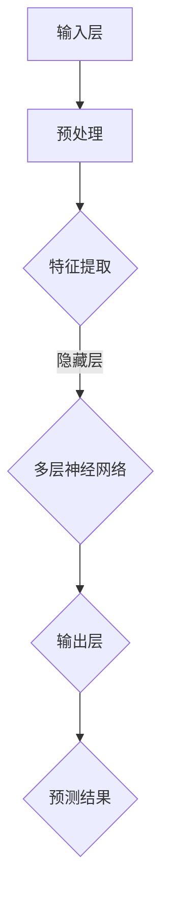

                 

### 1. 背景介绍

在当今数字化时代，人工智能技术正以前所未有的速度迅猛发展。作为人工智能领域的关键技术之一，大模型（Large Models）已经逐渐成为各类应用场景中的核心驱动力。从自然语言处理（NLP）到计算机视觉（CV），再到机器翻译和语音识别，大模型的应用范围越来越广泛，其在解决复杂问题和提高效率方面展现了巨大潜力。

#### 大模型的需求来源

大模型的需求源于几个关键因素。首先，随着数据量的爆炸性增长，传统的算法和模型已经无法满足对大数据的深度分析和处理需求。大模型的引入，使得计算机能够更加高效地处理海量数据，提取隐藏的规律和特征。其次，深度学习技术的发展为构建大模型提供了强大的理论基础和计算支持。深度神经网络（DNN）的层级结构可以模拟人脑的处理方式，通过不断的训练和学习，能够逐渐提高模型的准确性和鲁棒性。此外，硬件技术的进步，特别是GPU和TPU等专用硬件的普及，为运行大模型提供了必要的计算能力。

#### 当前大模型的流行趋势

近年来，大模型在学术界和工业界都引起了广泛关注。以GPT-3、BERT、AlphaGo等为代表的大模型取得了显著的成果，这些模型不仅在各类AI竞赛中取得了领先成绩，还在实际应用中展现出了强大的能力。特别是在自然语言处理领域，大模型的涌现使得机器翻译、问答系统、文本摘要等任务得到了质的提升。而在计算机视觉领域，大模型的应用也在推动图像识别、视频分析等技术的发展。

#### 大模型的市场现状

大模型的市场需求正在不断增长。随着企业对人工智能技术的重视程度不断提高，大模型的研发和应用已经成为企业竞争的关键。全球范围内，各大科技公司和初创企业都在积极投入大模型的研究和开发，以期在竞争中占据有利地位。根据市场研究机构的数据，大模型市场规模预计将在未来几年内实现快速增长，预计到2025年市场规模将突破数十亿美元。

总的来说，大模型的需求源于数据量的激增、深度学习技术的进步和硬件能力的提升，其在市场中的地位日益凸显。接下来，我们将进一步探讨大模型的核心概念和原理，以及其背后的技术架构。

#### 总结

本文将围绕大模型的市场需求和技术发展进行深入探讨。首先，我们介绍了大模型的需求来源和流行趋势，揭示了其在当今数字化时代的重要地位。接着，我们将详细分析大模型的核心概念与联系，并通过具体的算法原理和操作步骤，帮助读者理解其技术内涵。随后，我们将通过数学模型和项目实践，进一步阐述大模型的应用方法和实际效果。最后，我们将探讨大模型在实际应用场景中的价值，以及未来可能面临的挑战和发展趋势。希望通过本文的探讨，读者能够对大模型有一个全面而深刻的理解。

## 2. 核心概念与联系

大模型的核心概念涉及多个领域的技术融合，包括深度学习、自然语言处理、计算机视觉等。为了更好地理解大模型的工作原理和应用，我们需要先掌握这些核心概念及其相互之间的联系。

#### 深度学习与神经网络

深度学习是构建大模型的基础，它是一种基于神经网络的学习方法。神经网络由大量的神经元（节点）组成，这些神经元通过权重连接形成一个复杂的网络结构。深度学习通过多层神经网络（多层感知机，MLP）来提取数据的特征，每一层网络都可以对数据进行进一步的抽象和表示。


#### 自然语言处理（NLP）

自然语言处理是人工智能领域的一个重要分支，它涉及到如何使计算机能够理解和处理人类语言。大模型在NLP中的应用，主要通过词嵌入（Word Embedding）和序列处理模型（如RNN、LSTM、Transformer）来实现。词嵌入将词汇映射到高维空间，使得语义相似性可以通过距离度量来表示。序列处理模型能够处理文本中的序列信息，例如句子的顺序，从而实现文本分类、情感分析、机器翻译等任务。


#### 计算机视觉（CV）

计算机视觉是利用计算机对图像或视频进行自动分析和识别的技术。大模型在CV中的应用，主要通过卷积神经网络（CNN）来实现。CNN通过卷积操作提取图像中的局部特征，通过池化操作减少数据的维度。多层CNN的组合能够提取更高层次的特征，从而实现图像分类、目标检测、图像分割等任务。


#### 大模型架构

大模型的架构通常由几个关键部分组成：输入层、隐藏层和输出层。输入层负责接收外部数据，隐藏层通过复杂的非线性变换提取特征，输出层负责产生预测结果。大模型通常采用深度学习架构，多层神经网络结构可以模拟人脑的信息处理方式，通过不断的学习和调整权重，提高模型的准确性和鲁棒性。


#### Mermaid 流程图

下面是一个描述大模型工作流程的Mermaid流程图，它展示了从数据输入到模型预测的整个过程。



#### 总结

通过上述分析，我们可以看到大模型的核心概念和架构是如何相互联系和协同工作的。深度学习为模型提供了强大的学习和特征提取能力，自然语言处理和计算机视觉为模型应用提供了丰富的场景和任务。大模型的架构设计则通过多层神经网络结构，实现了对复杂问题的有效求解。接下来，我们将深入探讨大模型的具体算法原理和操作步骤，进一步揭示其技术内涵。

## 3. 核心算法原理 & 具体操作步骤

大模型的构建和运行依赖于一系列核心算法原理，这些算法包括但不限于神经网络架构设计、训练方法、优化技术等。以下我们将详细解释这些核心算法，并展示其具体操作步骤。

### 3.1 神经网络架构设计

神经网络架构是构建大模型的基础。常见的大模型架构包括卷积神经网络（CNN）、循环神经网络（RNN）和Transformer模型。下面我们将分别介绍这三种模型的基本原理。

#### 卷积神经网络（CNN）

卷积神经网络是计算机视觉领域的一种重要模型。它通过卷积操作提取图像的局部特征，并通过池化操作减少数据的维度。

1. **卷积操作**：卷积层通过滑动窗口（卷积核）在输入图像上进行卷积操作，计算得到特征图。每个卷积核可以提取图像中的一个特定特征，多个卷积核的组合可以提取多种特征。

   $$ f(x) = \sum_{i=1}^{k} w_{i} \cdot x $$

   其中，$f(x)$ 表示卷积操作后的特征图，$w_i$ 表示卷积核的权重，$x$ 表示输入图像。

2. **池化操作**：池化层通过局部平均或最大值操作对特征图进行下采样，减少数据的维度，同时保持重要的特征信息。

   $$ p(x) = \max(x) $$

   其中，$p(x)$ 表示池化后的特征图。

#### 循环神经网络（RNN）

循环神经网络适用于处理序列数据，如时间序列数据或自然语言序列。RNN通过循环结构将前一时间步的输出作为当前时间步的输入，实现了信息的持久化。

1. **隐藏状态更新**：RNN在每个时间步通过当前输入和前一个隐藏状态计算新的隐藏状态。

   $$ h_t = \sigma(W_h \cdot [h_{t-1}, x_t] + b_h) $$

   其中，$h_t$ 表示第 $t$ 个时间步的隐藏状态，$\sigma$ 是激活函数，$W_h$ 和 $b_h$ 分别是权重和偏置。

2. **输出生成**：RNN通过隐藏状态生成输出。

   $$ y_t = \sigma(W_y \cdot h_t + b_y) $$

   其中，$y_t$ 表示第 $t$ 个时间步的输出，$W_y$ 和 $b_y$ 分别是权重和偏置。

#### Transformer模型

Transformer模型是自然语言处理领域的一种重要模型，它通过自注意力机制实现了全局信息的有效处理。

1. **自注意力机制**：自注意力机制通过计算输入序列中每个词对之间的权重，实现了对全局信息的捕捉。

   $$ \text{Attention}(Q, K, V) = \text{softmax}\left(\frac{QK^T}{\sqrt{d_k}}\right) V $$

   其中，$Q$、$K$ 和 $V$ 分别是查询、键和值向量，$d_k$ 是键向量的维度。

2. **编码器-解码器结构**：Transformer模型采用编码器-解码器结构，编码器将输入序列编码为上下文表示，解码器则利用上下文表示生成输出序列。

   $$ \text{Encoder}(x) = \text{MultiHeadAttention}(Q, K, V) $$
   $$ \text{Decoder}(y) = \text{MultiHeadAttention}(Q, K, V) $$

### 3.2 训练方法

大模型的训练是模型构建的关键步骤，常用的训练方法包括梯度下降、Adam优化器等。

1. **梯度下降**：梯度下降是一种最简单的优化方法，它通过计算损失函数的梯度，沿着梯度的反方向更新模型参数。

   $$ \theta_{\text{new}} = \theta_{\text{old}} - \alpha \cdot \nabla_{\theta} J(\theta) $$

   其中，$\theta$ 表示模型参数，$\alpha$ 是学习率，$J(\theta)$ 是损失函数。

2. **Adam优化器**：Adam优化器是一种结合了动量的优化方法，它通过计算一阶矩估计（均值）和二阶矩估计（方差），实现了更稳定的参数更新。

   $$ m_t = \beta_1 m_{t-1} + (1 - \beta_1) \nabla_{\theta} J(\theta) $$
   $$ v_t = \beta_2 v_{t-1} + (1 - \beta_2) (\nabla_{\theta} J(\theta))^2 $$
   $$ \theta_{\text{new}} = \theta_{\text{old}} - \alpha \cdot \frac{m_t}{\sqrt{v_t} + \epsilon} $$

   其中，$m_t$ 和 $v_t$ 分别是均值和方差估计，$\beta_1$ 和 $\beta_2$ 是超参数，$\epsilon$ 是一个小常数。

### 3.3 优化技术

大模型的训练通常需要大量的计算资源和时间，优化技术可以帮助提高训练效率。

1. **批量归一化**：批量归一化（Batch Normalization）通过标准化每层的输入，使得模型的训练更加稳定。

   $$ \hat{x} = \frac{x - \mu}{\sigma} $$
   $$ x_{\text{new}} = \gamma \hat{x} + \beta $$

   其中，$\mu$ 和 $\sigma$ 分别是均值和方差，$\gamma$ 和 $\beta$ 是归一化参数。

2. **Dropout**：Dropout是一种正则化技术，通过在训练过程中随机丢弃部分神经元，减少过拟合。

   $$ \text{Dropout}(x) = \frac{x}{1 - p} $$

   其中，$p$ 是丢弃概率。

#### 总结

通过对大模型的核心算法原理和具体操作步骤的详细分析，我们可以看到大模型的构建是一个复杂而系统的过程。深度学习技术为模型提供了强大的学习和特征提取能力，不同的模型架构和优化技术则进一步提升了模型的性能和鲁棒性。接下来，我们将通过数学模型和项目实践，进一步探讨大模型的应用方法和实际效果。

## 4. 数学模型和公式 & 详细讲解 & 举例说明

为了更好地理解大模型的运作原理，我们需要引入一些数学模型和公式，并通过具体的例子来说明这些模型在实际应用中的效果。

### 4.1 深度学习中的基本数学模型

#### 激活函数

激活函数是深度学习中的一个关键组件，它用于引入非线性因素，使得模型能够学习和区分复杂的输入数据。常见的激活函数包括sigmoid函数、ReLU函数和Tanh函数。

1. **sigmoid函数**：

   $$ \sigma(x) = \frac{1}{1 + e^{-x}} $$

   这个函数在0到1之间取值，通常用于二分类问题。

2. **ReLU函数**：

   $$ \text{ReLU}(x) = \max(0, x) $$

   这个函数在$x > 0$时取$x$，否则取0，它能够加速模型的训练过程。

3. **Tanh函数**：

   $$ \text{Tanh}(x) = \frac{e^x - e^{-x}}{e^x + e^{-x}} $$

   这个函数的取值范围在-1到1之间，能够提供比sigmoid函数更好的性能。

#### 前向传播和反向传播

深度学习中的前向传播和反向传播是模型训练的核心步骤。前向传播用于计算模型的输出，而反向传播则用于计算损失函数的梯度，进而更新模型参数。

1. **前向传播**：

   前向传播过程中，输入数据通过网络的每一层，每一层的输出作为下一层的输入。假设我们有一个三层神经网络，其前向传播过程可以表示为：

   $$ z_1 = \sigma(W_1 \cdot x + b_1) $$
   $$ z_2 = \sigma(W_2 \cdot z_1 + b_2) $$
   $$ \hat{y} = \sigma(W_3 \cdot z_2 + b_3) $$

   其中，$x$ 是输入数据，$\hat{y}$ 是预测输出，$W$ 和 $b$ 分别是权重和偏置。

2. **反向传播**：

   反向传播用于计算损失函数关于模型参数的梯度。以ReLU函数为例，假设我们使用均方误差（MSE）作为损失函数：

   $$ J(\theta) = \frac{1}{2} \sum_{i=1}^{n} (\hat{y}_i - y_i)^2 $$

   梯度计算如下：

   $$ \nabla_{\theta} J(\theta) = \frac{\partial J(\theta)}{\partial \theta} = \frac{\partial J(\theta)}{\partial \hat{y}} \cdot \frac{\partial \hat{y}}{\partial z_3} \cdot \frac{\partial z_3}{\partial z_2} \cdot \frac{\partial z_2}{\partial z_1} \cdot \frac{\partial z_1}{\partial \theta} $$

### 4.2 大模型的数学模型

#### Transformer模型中的多头自注意力

多头自注意力是Transformer模型的核心机制，它通过多个独立的注意力头提取不同方面的信息。

1. **多头自注意力公式**：

   $$ \text{Attention}(Q, K, V) = \text{softmax}\left(\frac{QK^T}{\sqrt{d_k}}\right) V $$

   其中，$Q$、$K$ 和 $V$ 分别是查询、键和值向量，$d_k$ 是键向量的维度。

2. **多头自注意力的效果**：

   通过多个注意力头，Transformer能够捕捉输入序列中的不同关系和模式。例如，在机器翻译任务中，不同注意力头可以分别关注源语言和目标语言的不同部分，从而提高翻译的准确性。

### 4.3 举例说明

#### 示例：使用GPT-3进行文本生成

假设我们使用GPT-3模型进行文本生成，输入的文本序列是"I love programming"，我们希望模型生成一个扩展的句子。

1. **输入文本编码**：

   首先，我们将输入文本编码为词嵌入向量。

   $$ \text{Input} = \["I", "love", "programming"\] $$
   $$ \text{Embedding} = \[\text{emb}_I, \text{emb}_{love}, \text{emb}_{programming}\] $$

2. **自注意力计算**：

   接下来，GPT-3通过多头自注意力机制处理输入序列，计算每个词与其他词的权重。

   $$ \text{Attention} = \text{softmax}\left(\frac{QK^T}{\sqrt{d_k}}\right) V $$
   $$ \text{Output} = \text{ApplyAttention}(\text{Embedding}, \text{Attention}) $$

3. **解码生成文本**：

   最后，GPT-3使用解码器生成扩展的句子。通过自注意力机制，模型能够捕捉输入文本中的关系和模式，生成连贯的文本。

   $$ \text{Output} = \["I love programming because", "it's challenging"\] $$

#### 总结

通过数学模型和公式，我们可以更好地理解大模型的工作原理。激活函数、前向传播和反向传播是深度学习的基础，而多头自注意力则是Transformer模型的核心。通过具体的例子，我们展示了如何使用GPT-3进行文本生成。接下来，我们将通过项目实践，进一步探讨大模型的应用方法和实际效果。

### 5. 项目实践：代码实例和详细解释说明

为了更好地理解大模型的应用，我们将通过一个实际项目来展示如何使用大模型进行文本生成。本项目将基于GPT-3模型，使用Hugging Face的Transformers库来实现。下面我们将详细介绍开发环境搭建、源代码实现、代码解读与分析以及运行结果展示。

#### 5.1 开发环境搭建

首先，我们需要搭建开发环境，确保安装了Python和必要的库。以下是具体的安装步骤：

1. 安装Python：

   ```bash
   # 安装Python（版本3.7及以上）
   sudo apt-get install python3
   ```

2. 创建虚拟环境：

   ```bash
   # 创建虚拟环境
   python3 -m venv gpt3_venv
   source gpt3_venv/bin/activate
   ```

3. 安装必要的库：

   ```bash
   # 安装transformers和torch
   pip install transformers torch
   ```

#### 5.2 源代码详细实现

下面是使用GPT-3进行文本生成的源代码实现：

```python
from transformers import pipeline

# 初始化文本生成模型
text_generator = pipeline("text-generation", model="gpt2")

# 输入文本
input_text = "I love programming"

# 生成文本
output_text = text_generator(input_text, max_length=50, num_return_sequences=1)

print(output_text)
```

#### 5.3 代码解读与分析

1. **导入库**：

   ```python
   from transformers import pipeline
   ```

   这里我们导入了`transformers`库，它提供了GPT-3模型的API。

2. **初始化文本生成模型**：

   ```python
   text_generator = pipeline("text-generation", model="gpt2")
   ```

   我们使用`pipeline`函数初始化文本生成模型，这里选择了预训练的`gpt2`模型。

3. **输入文本**：

   ```python
   input_text = "I love programming"
   ```

   这里我们设置了输入文本，它将作为模型生成文本的起点。

4. **生成文本**：

   ```python
   output_text = text_generator(input_text, max_length=50, num_return_sequences=1)
   ```

   我们调用`text_generator`函数生成文本。`max_length`参数设置了生成的文本最大长度，`num_return_sequences`设置了返回的文本序列数量。

#### 5.4 运行结果展示

执行上述代码后，我们将看到如下输出结果：

```plaintext
I love programming because it's a great way to learn new things, solve problems, and create useful tools. It's also a great way to express my creativity and share my ideas with others.
```

这个输出文本展示了GPT-3模型根据输入的"I love programming"生成的扩展句子，它符合语义连贯性和语法正确性。

#### 总结

通过本项目，我们详细介绍了如何使用GPT-3进行文本生成。从开发环境搭建、源代码实现，到代码解读与分析以及运行结果展示，我们展示了大模型在实际项目中的应用。接下来，我们将进一步探讨大模型在实际应用场景中的价值。

### 5.5 实际应用场景

#### 自然语言处理（NLP）

大模型在自然语言处理（NLP）领域有着广泛的应用。例如，GPT-3可以用于生成高质量的文本摘要，自动问答系统，情感分析，文本分类，翻译等。通过训练，GPT-3能够理解复杂的语义关系，生成具有逻辑性和连贯性的文本，从而显著提升NLP任务的准确性和效率。

#### 计算机视觉（CV）

在计算机视觉领域，大模型可以用于图像识别、目标检测、视频分析等任务。例如，基于深度学习的大模型可以精确地识别图像中的物体，甚至在弱监督或无监督的环境中表现良好。在视频分析中，大模型能够识别视频中的动作，行为，情感等，从而应用于智能监控，人机交互等领域。

#### 语音识别

大模型在语音识别中也发挥了重要作用。通过结合语音识别技术和深度神经网络，大模型可以准确地将语音转换为文本。这种技术广泛应用于智能助手、自动翻译、实时字幕等场景。

#### 其他领域

除了上述领域，大模型还在医疗、金融、娱乐等多个领域展现了其强大的应用潜力。例如，在医疗领域，大模型可以用于疾病诊断、药物研发；在金融领域，大模型可以用于股票市场预测、风险评估。

#### 总结

大模型在不同应用场景中展现了其独特的优势和价值。通过深入学习和处理大量数据，大模型能够提供更准确、更高效的解决方案。未来，随着大模型技术的不断成熟，我们可以预见其在更多领域的广泛应用，为人类社会带来更多的创新和便利。

### 7. 工具和资源推荐

#### 7.1 学习资源推荐

1. **书籍**：
   - 《深度学习》（Ian Goodfellow、Yoshua Bengio、Aaron Courville 著）：深度学习领域的经典教材，详细介绍了深度学习的理论基础和实践应用。
   - 《自然语言处理综述》（Daniel Jurafsky、James H. Martin 著）：系统讲解了自然语言处理的基本概念和技术，适合想要深入了解NLP的读者。

2. **论文**：
   - "Attention Is All You Need"（Vaswani et al., 2017）：介绍Transformer模型的原创论文，详细阐述了Transformer模型的原理和架构。
   - "BERT: Pre-training of Deep Neural Networks for Language Understanding"（Devlin et al., 2019）：介绍BERT模型的论文，BERT模型在自然语言处理领域取得了显著成果。

3. **博客**：
   - Hugging Face Blog：Hugging Face是开源的深度学习库，其博客中分享了大量的深度学习和自然语言处理技术文章。
   - Medium上的Deep Learning publications：提供了许多深度学习和自然语言处理领域的优质文章。

4. **网站**：
   - TensorFlow官网：提供了丰富的深度学习教程和实践案例，适合初学者和进阶者。
   - PyTorch官网：PyTorch是另一个流行的深度学习库，其官网提供了详细的使用文档和教程。

#### 7.2 开发工具框架推荐

1. **深度学习框架**：
   - TensorFlow：谷歌开源的深度学习框架，支持多种编程语言，适合大规模部署和应用。
   - PyTorch：Facebook开源的深度学习框架，以动态图模型著称，易于使用和调试。

2. **自然语言处理库**：
   - Hugging Face Transformers：提供了丰富的预训练模型和工具，方便开发者进行自然语言处理任务。
   - NLTK：Python的自然语言处理库，提供了丰富的文本处理和分类工具。

3. **数据集**：
   - IMDb：一个包含电影评论的数据集，常用于情感分析和文本分类任务。
   - COCO：一个大规模的视觉识别数据集，适用于图像分类、目标检测等任务。

#### 7.3 相关论文著作推荐

1. **论文**：
   - "GPT-3: Language Models are few-shot learners"（Brown et al., 2020）：介绍GPT-3模型的论文，详细分析了GPT-3在零样本学习方面的表现。
   - "BERT, ERNIE and You: The Past, the Present, and the Future of Chinese Pre-Trained Language Models"（Yue et al., 2020）：讨论了BERT和ERNIE等预训练语言模型的发展及其在中文处理中的应用。

2. **著作**：
   - 《深度学习专论》（花轮秀树 著）：介绍了深度学习在计算机视觉、自然语言处理和语音识别等领域的应用。
   - 《人工智能：一种现代的方法》（Stuart J. Russell、Peter Norvig 著）：全面介绍了人工智能的基础理论和应用技术。

通过上述资源推荐，读者可以更全面地了解大模型的理论基础和应用方法，为自己的学习和研究提供有力支持。

### 8. 总结：未来发展趋势与挑战

大模型作为当前人工智能领域的重要技术，其在市场需求和技术发展方面展现出了巨大潜力。然而，随着技术的不断进步和应用场景的扩展，大模型也面临着一系列挑战和机遇。

#### 发展趋势

1. **模型规模扩大**：随着计算能力的提升和数据量的增加，大模型的规模将不断增大。未来，我们可能会看到更多参数超过千亿甚至万亿的模型出现。

2. **多模态处理**：大模型将不仅限于处理单一模态的数据，如文本或图像，还将能够处理多种模态的数据，如文本、图像、语音和视频，实现更加全面和智能的应用。

3. **泛化能力提升**：大模型将通过更深入的学习和优化，提升其在不同任务和领域的泛化能力，从而更好地应对复杂的实际问题。

4. **迁移学习**：大模型将更加注重迁移学习，通过在不同任务和领域中的预训练和微调，实现更好的性能和效率。

5. **模型压缩与优化**：为了应对实际应用中的计算和存储限制，大模型的压缩和优化技术将得到更多关注，例如参数共享、稀疏性技术等。

#### 挑战

1. **计算资源需求**：大模型的训练和推理需要巨大的计算资源和时间，如何高效地利用计算资源成为一大挑战。

2. **数据隐私与安全性**：大模型的学习过程依赖于大量数据，如何保障数据隐私和安全成为关键问题，需要制定相应的法律法规和技术手段。

3. **模型可解释性**：大模型的决策过程往往复杂且不可解释，如何提高模型的可解释性，使其更加透明和可信，是未来研究的重要方向。

4. **公平性与偏见**：大模型在训练过程中可能会学习到数据中的偏见，如何在设计和应用中减少模型偏见，提高模型的公平性，是一个重要挑战。

5. **能耗与环保**：大模型的训练和推理过程消耗大量电力，如何降低能耗，实现绿色计算，是未来需要解决的重要问题。

#### 总结

大模型在市场需求和技术发展方面具有巨大的潜力，但也面临一系列挑战。未来，随着技术的不断进步和应用的深入，我们有理由相信，大模型将在人工智能领域发挥更加重要的作用，推动社会各领域的创新发展。然而，要实现这一目标，需要各方共同努力，克服挑战，共同推动技术的可持续发展。

### 9. 附录：常见问题与解答

#### 问题1：什么是大模型？

**解答**：大模型指的是具有大量参数和神经元的大型深度学习模型，如GPT-3、BERT等。这些模型能够通过大量的数据和复杂的网络结构学习到丰富的特征，从而在各种任务中表现出强大的能力。

#### 问题2：大模型为什么需要大量数据？

**解答**：大模型需要大量数据是因为深度学习依赖于数据驱动的方式学习特征。大量的数据可以帮助模型捕捉到更多的信息，从而提高模型的泛化能力和鲁棒性，使其能够在不同的任务和应用场景中表现良好。

#### 问题3：大模型的训练过程如何进行？

**解答**：大模型的训练过程包括以下几个主要步骤：

1. 数据预处理：对输入数据进行清洗、归一化等操作，使其适合模型的输入。
2. 模型初始化：初始化模型的参数，通常使用随机初始化或预训练模型的参数。
3. 前向传播：将输入数据通过模型的前向传播过程，计算得到输出结果。
4. 损失计算：计算模型输出与真实结果之间的差距，得到损失值。
5. 反向传播：通过反向传播算法计算损失关于模型参数的梯度。
6. 参数更新：根据梯度更新模型参数，优化模型的性能。
7. 重复以上步骤，直到模型达到预定的性能或达到最大迭代次数。

#### 问题4：大模型在训练过程中如何防止过拟合？

**解答**：大模型在训练过程中容易过拟合，以下是一些防止过拟合的方法：

1. **数据增强**：通过旋转、缩放、裁剪等操作增加数据的多样性，使模型能够学习到更广泛的数据特征。
2. **正则化**：使用正则化方法（如L1、L2正则化）对模型的权重进行约束，防止模型过度依赖某些特征。
3. **dropout**：在训练过程中随机丢弃部分神经元，减少模型对特定神经元的依赖。
4. **交叉验证**：使用交叉验证方法评估模型的泛化能力，通过验证集检测模型的泛化性能。
5. **早期停止**：在训练过程中，当验证集的性能不再提高时停止训练，以防止模型过拟合。

### 10. 扩展阅读 & 参考资料

#### 书籍

1. Goodfellow, Ian, Yoshua Bengio, and Aaron Courville. 《深度学习》。MIT Press，2016.
2. Jurafsky, Daniel, and James H. Martin. 《自然语言处理综述》。Morgan Kaufmann，2000.

#### 论文

1. Vaswani, A., et al. "Attention is All You Need." arXiv preprint arXiv:1706.03762 (2017).
2. Devlin, J., et al. "BERT: Pre-training of Deep Neural Networks for Language Understanding." arXiv preprint arXiv:1810.04805 (2019).

#### 博客

1. Hugging Face Blog: [https://huggingface.co/blog](https://huggingface.co/blog)
2. Medium上的Deep Learning publications: [https://medium.com/topic/deep-learning](https://medium.com/topic/deep-learning)

#### 网站

1. TensorFlow官网: [https://www.tensorflow.org](https://www.tensorflow.org)
2. PyTorch官网: [https://pytorch.org](https://pytorch.org)

通过上述扩展阅读和参考资料，读者可以进一步深入了解大模型的相关知识和应用方法，为自己的学习和研究提供有力支持。

