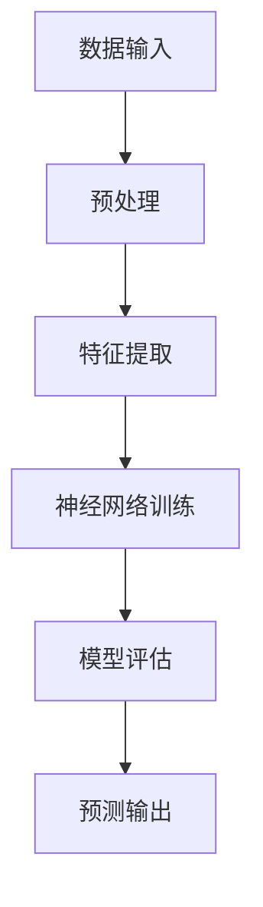

                 

### 1. 背景介绍

#### 1.1 大模型的发展历程

大模型（Large Models）的概念起源于20世纪80年代，当时研究人员开始探索如何使用大型神经网络来解决复杂问题。最早的大模型之一是1986年由David E. Cohn、Leslie A. Kaelbling和John P.aitken开发的_BACKPROPNET_。这一模型使用了反向传播算法训练多层感知机，为后来的神经网络研究奠定了基础。

进入21世纪，随着计算能力的提升和深度学习技术的突破，大模型的发展进入了一个新阶段。2006年，Hinton等人提出的_Dropout_技术和_深度信念网络_（DBN）标志着深度学习时代的到来。深度学习使得大模型在图像识别、自然语言处理等领域取得了显著成果。

2012年，AlexNet在ImageNet竞赛中取得了突破性成绩，这标志着深度学习技术开始广泛应用于计算机视觉领域。此后，大模型在自然语言处理、语音识别、机器翻译等领域也取得了飞速发展。特别是在2018年，Google推出的_TensorFlow_和OpenAI推出的_GPT-2_等大模型，将大模型的规模和应用推向了新的高峰。

#### 1.2 大模型的重要性

大模型的重要性体现在其能够处理复杂问题、提高算法性能和降低计算成本等方面。首先，大模型能够通过学习大量数据，提取出更复杂的特征，从而提高算法的准确性和鲁棒性。例如，在图像识别任务中，大模型能够通过学习数百万张图片，自动提取出图像的语义特征，从而实现高精度的识别。

其次，大模型能够显著降低计算成本。传统的机器学习算法往往需要手动设计特征提取器，这个过程既耗时又容易出错。而大模型通过端到端的学习，可以直接从原始数据中提取特征，从而避免了繁琐的特征工程过程，降低了计算成本。

此外，大模型在处理复杂数据方面具有显著优势。例如，在自然语言处理领域，大模型能够处理包含大量上下文的文本数据，从而更好地理解文本的含义和语境。这对于构建智能对话系统、自动摘要和机器翻译等应用具有重要意义。

#### 1.3 大模型在当前市场中的现状

随着大模型技术的不断发展，其在各个领域中的应用也越来越广泛。在计算机视觉领域，大模型被广泛应用于图像识别、物体检测和图像生成等任务。在自然语言处理领域，大模型被应用于机器翻译、文本生成和情感分析等任务。在语音识别领域，大模型被应用于语音识别、语音合成和语音翻译等任务。

当前，大模型市场呈现出蓬勃发展的态势。一方面，各大科技公司纷纷投入大量资源研发大模型，以提高自身在人工智能领域的竞争力。另一方面，大模型的应用场景不断扩展，市场需求持续增长。例如，在医疗领域，大模型被用于医学图像识别、疾病预测和药物研发等任务，为医疗行业带来了巨大的变革。

然而，大模型市场也面临着一些挑战。首先，大模型的训练和部署需要大量的计算资源，这对企业和科研机构的硬件设施提出了较高的要求。其次，大模型的黑盒特性使得其决策过程难以解释，这可能导致安全和隐私问题。此外，大模型的训练和部署过程中可能会涉及大量的数据，如何确保数据的合规性和隐私保护也是一个重要的问题。

总的来说，大模型技术具有巨大的发展潜力，但也需要解决一系列技术和管理问题，以实现其在各个领域的广泛应用。

### 2. 核心概念与联系

#### 2.1 大模型的核心概念

大模型（Large Models）是指通过深度学习技术训练出的具有大规模参数的神经网络模型。这些模型通常具有数百万甚至数十亿个参数，能够处理复杂数据并实现高精度的预测和决策。大模型的核心概念包括以下几个方面：

- **深度学习**：大模型是基于深度学习技术构建的，深度学习通过多层神经网络的结构，从原始数据中提取高层次的抽象特征，从而实现复杂任务的自动学习和预测。

- **参数规模**：大模型的参数规模是其最重要的特征之一。参数规模决定了模型的表达能力，参数越多，模型能够学习的特征就越复杂。

- **端到端学习**：大模型通过端到端学习的方式，将输入直接映射到输出，避免了传统机器学习中的特征工程过程，从而提高了模型的训练效率和预测性能。

#### 2.2 大模型的技术架构

大模型的技术架构通常包括以下几个关键组成部分：

- **神经网络**：神经网络是深度学习的基础，大模型通过多层神经网络的结构，从原始数据中逐步提取特征，形成高层次的抽象表示。

- **反向传播算法**：反向传播算法是训练神经网络的核心算法，通过计算损失函数关于参数的梯度，不断调整网络参数，使模型能够逼近最优解。

- **优化算法**：大模型的训练过程中需要使用优化算法来加速收敛。常见的优化算法包括随机梯度下降（SGD）、Adam等。

- **计算资源**：大模型的训练和部署需要大量的计算资源，包括CPU、GPU和TPU等。随着计算能力的提升，大模型的规模和应用也在不断扩大。

#### 2.3 大模型与现有技术的联系

大模型与现有技术有着密切的联系，特别是在机器学习、自然语言处理和计算机视觉等领域。以下是大模型与这些技术的联系：

- **机器学习**：大模型是机器学习的一个分支，其核心思想是通过学习大量数据，提取出有用的特征，从而实现自动学习和预测。大模型在机器学习中的应用，极大地提高了算法的性能和效率。

- **自然语言处理**：自然语言处理（NLP）是人工智能的重要领域之一，大模型在NLP中的应用，使得机器能够更好地理解和生成自然语言。大模型通过端到端学习的方式，直接从文本数据中提取语义信息，实现了高精度的文本分析。

- **计算机视觉**：计算机视觉是另一个重要的人工智能领域，大模型在计算机视觉中的应用，使得机器能够更好地理解和解析图像信息。大模型通过学习大量的图像数据，自动提取出图像的语义特征，实现了高精度的图像识别和物体检测。

#### 2.4 大模型与相关技术的对比

大模型与现有技术相比，具有以下几个显著优势：

- **性能提升**：大模型通过学习大量数据，能够提取出更复杂的特征，从而实现更高的预测性能。与传统的机器学习方法相比，大模型在图像识别、自然语言处理和语音识别等任务中，取得了显著的性能提升。

- **效率提高**：大模型通过端到端学习的方式，避免了繁琐的特征工程过程，从而提高了训练和部署的效率。与传统机器学习方法相比，大模型在数据预处理和特征提取方面，节省了大量的时间和计算资源。

- **适用范围广泛**：大模型具有广泛的适用性，可以在多个领域实现应用。从图像识别到自然语言处理，从语音识别到医疗诊断，大模型的应用场景正在不断扩展。

总的来说，大模型技术具有巨大的发展潜力，其在机器学习、自然语言处理和计算机视觉等领域的应用，正在推动人工智能技术的不断进步。

#### 2.5 Mermaid 流程图

以下是大模型技术架构的Mermaid流程图，展示了大模型从数据输入到预测输出的整个流程。



**流程说明：**

- **A[数据输入]**：大模型首先接收原始数据，如图像、文本或音频。
- **B[预处理]**：对原始数据进行预处理，如数据清洗、归一化和数据增强等。
- **C[特征提取]**：通过多层神经网络，从预处理后的数据中提取高层次的抽象特征。
- **D[神经网络训练]**：使用反向传播算法和优化算法，训练神经网络，不断调整网络参数，使其能够逼近最优解。
- **E[模型评估]**：对训练好的模型进行评估，确保其性能达到预期。
- **F[预测输出]**：使用训练好的模型，对新的数据进行预测，生成输出结果。

### 3. 核心算法原理 & 具体操作步骤

#### 3.1 算法原理

大模型的算法原理主要基于深度学习技术，包括神经网络的设计、训练和优化。以下是对这些核心算法原理的具体解析。

##### 3.1.1 神经网络设计

神经网络（Neural Networks）是深度学习的基础，由一系列相互连接的神经元组成。每个神经元都接收多个输入，通过激活函数进行非线性变换，然后输出结果。神经网络的设计主要涉及以下几个方面：

- **层次结构**：神经网络通常由多个层次组成，包括输入层、隐藏层和输出层。输入层接收外部输入，隐藏层进行特征提取和变换，输出层生成最终输出。

- **神经元连接**：神经元之间的连接通过权重（weights）表示，这些权重决定了输入对输出的影响程度。神经网络通过学习调整这些权重，以优化模型的性能。

- **激活函数**：激活函数（Activation Function）用于引入非线性特性，常见的激活函数包括Sigmoid、ReLU和Tanh等。激活函数的选择对模型的性能和训练速度有重要影响。

##### 3.1.2 神经网络训练

神经网络的训练（Training）过程是通过不断调整网络参数（权重和偏置）来最小化损失函数（Loss Function）。以下是对神经网络训练过程的具体解析：

- **损失函数**：损失函数用于衡量模型的预测结果与真实结果之间的差距。常见的损失函数包括均方误差（MSE）、交叉熵（Cross-Entropy）等。

- **反向传播算法**：反向传播算法（Backpropagation Algorithm）是训练神经网络的核心算法。通过计算损失函数关于网络参数的梯度，反向传播算法能够更新网络参数，使模型能够逼近最优解。

- **优化算法**：优化算法（Optimization Algorithm）用于加速网络参数的更新过程。常见的优化算法包括随机梯度下降（SGD）、Adam、RMSprop等。

##### 3.1.3 神经网络优化

神经网络的优化（Optimization）过程旨在提高模型的训练效率和预测性能。以下是对神经网络优化过程的具体解析：

- **正则化**：正则化（Regularization）是一种防止模型过拟合的技术。常见的正则化方法包括L1正则化、L2正则化和Dropout等。

- **学习率调整**：学习率（Learning Rate）是优化算法中的重要参数，用于控制参数更新的步长。适当调整学习率可以加速收敛，但过高的学习率可能导致训练不稳定。

- **批量大小**：批量大小（Batch Size）是训练过程中一个重要的参数，用于控制每次更新参数的样本数量。适当的批量大小可以提高模型的稳定性和预测性能。

#### 3.2 具体操作步骤

以下是使用深度学习框架（如TensorFlow或PyTorch）训练大模型的具体操作步骤：

##### 3.2.1 数据准备

1. **数据收集**：收集用于训练和评估的数据集，如图像、文本或音频数据。
2. **数据预处理**：对数据进行预处理，包括数据清洗、归一化、数据增强等。
3. **数据加载**：使用数据加载器（Data Loader）将预处理后的数据分成训练集、验证集和测试集。

##### 3.2.2 模型设计

1. **定义神经网络架构**：根据任务需求，设计合适的神经网络架构，包括输入层、隐藏层和输出层。
2. **定义损失函数**：选择合适的损失函数，如均方误差（MSE）或交叉熵（Cross-Entropy）。
3. **定义优化算法**：选择合适的优化算法，如随机梯度下降（SGD）或Adam。

##### 3.2.3 模型训练

1. **初始化模型参数**：使用随机初始化或预训练权重初始化模型参数。
2. **训练过程**：使用训练集数据，通过反向传播算法和优化算法，训练神经网络。
3. **模型评估**：在验证集上评估模型的性能，根据性能调整模型参数。

##### 3.2.4 模型部署

1. **模型保存**：将训练好的模型保存为文件，以便后续使用。
2. **模型加载**：从文件中加载训练好的模型，用于新的数据预测。
3. **模型推理**：使用加载好的模型，对新的数据进行预测，生成输出结果。

通过以上步骤，我们可以使用深度学习框架训练出高性能的大模型，并在各个领域实现应用。

### 4. 数学模型和公式 & 详细讲解 & 举例说明

#### 4.1 数学模型

大模型的核心在于其数学模型，即神经网络。以下是对神经网络中关键数学模型的详细讲解。

##### 4.1.1 神经元模型

神经元是神经网络的基本单元，其数学模型可以表示为：

$$
z_i = \sum_{j=1}^{n} w_{ij}x_j + b_i
$$

其中，$z_i$ 是第 $i$ 个神经元的输入，$w_{ij}$ 是第 $i$ 个神经元与第 $j$ 个神经元之间的连接权重，$x_j$ 是第 $j$ 个神经元的输入，$b_i$ 是第 $i$ 个神经元的偏置。

##### 4.1.2 激活函数

激活函数用于引入非线性特性，常见的激活函数包括：

- **Sigmoid函数**：

$$
\sigma(x) = \frac{1}{1 + e^{-x}}
$$

- **ReLU函数**：

$$
\text{ReLU}(x) = \max(0, x)
$$

- **Tanh函数**：

$$
\tanh(x) = \frac{e^x - e^{-x}}{e^x + e^{-x}}
$$

##### 4.1.3 损失函数

损失函数用于衡量模型预测值与真实值之间的差距，常见的损失函数包括：

- **均方误差（MSE）**：

$$
\text{MSE} = \frac{1}{n}\sum_{i=1}^{n}(y_i - \hat{y}_i)^2
$$

其中，$y_i$ 是第 $i$ 个真实值，$\hat{y}_i$ 是第 $i$ 个预测值，$n$ 是样本数量。

- **交叉熵（Cross-Entropy）**：

$$
\text{Cross-Entropy} = -\frac{1}{n}\sum_{i=1}^{n}y_i\log(\hat{y}_i)
$$

其中，$y_i$ 是第 $i$ 个真实值，$\hat{y}_i$ 是第 $i$ 个预测值，$n$ 是样本数量。

##### 4.1.4 反向传播算法

反向传播算法用于训练神经网络，其核心思想是计算损失函数关于网络参数的梯度，并通过梯度下降法更新参数。以下是其具体步骤：

1. **前向传播**：计算输入层到输出层的每个神经元的输入和输出。
2. **计算损失函数**：计算预测值与真实值之间的差距。
3. **计算梯度**：计算损失函数关于网络参数的梯度。
4. **更新参数**：使用梯度下降法更新网络参数。

#### 4.2 公式讲解

以下是对神经网络中关键数学公式的详细讲解。

##### 4.2.1 激活函数的导数

- **Sigmoid函数的导数**：

$$
\sigma'(x) = \sigma(x)(1 - \sigma(x))
$$

- **ReLU函数的导数**：

$$
\text{ReLU}'(x) = \begin{cases}
0, & \text{if } x < 0 \\
1, & \text{if } x \geq 0
\end{cases}
$$

- **Tanh函数的导数**：

$$
\tanh'(x) = 1 - \tanh^2(x)
$$

##### 4.2.2 损失函数的导数

- **均方误差（MSE）的导数**：

$$
\frac{\partial \text{MSE}}{\partial \theta} = 2\frac{1}{n}\sum_{i=1}^{n}(y_i - \hat{y}_i)\frac{\partial \hat{y}_i}{\partial \theta}
$$

- **交叉熵（Cross-Entropy）的导数**：

$$
\frac{\partial \text{Cross-Entropy}}{\partial \theta} = -\frac{1}{n}\sum_{i=1}^{n}y_i\frac{\partial \hat{y}_i}{\partial \theta}
$$

##### 4.2.3 反向传播算法的梯度计算

反向传播算法通过链式法则计算损失函数关于网络参数的梯度。以下是其具体步骤：

1. **前向传播**：计算输入层到输出层的每个神经元的输入和输出。
2. **计算输出层的梯度**：使用损失函数的导数，计算输出层关于预测值的梯度。
3. **反向传播**：从输出层开始，依次计算隐藏层的梯度。
4. **参数更新**：使用梯度下降法更新网络参数。

#### 4.3 举例说明

以下是一个简单的神经网络模型，用于分类任务，包括输入层、隐藏层和输出层。

- **输入层**：包含3个输入神经元，表示3个特征。
- **隐藏层**：包含2个隐藏神经元，使用ReLU激活函数。
- **输出层**：包含2个输出神经元，表示2个类别。

假设我们有一个包含5个样本的数据集，其中每个样本有3个特征，目标标签是二分类。

**前向传播过程**：

1. 输入层到隐藏层的输入和输出：

$$
z_1^{(2)} = \sum_{i=1}^{3} w_{i1}x_i + b_1
$$

$$
a_1^{(2)} = \text{ReLU}(z_1^{(2)})
$$

$$
z_2^{(2)} = \sum_{i=1}^{3} w_{i2}x_i + b_2
$$

$$
a_2^{(2)} = \text{ReLU}(z_2^{(2)})
$$

2. 隐藏层到输出层的输入和输出：

$$
z_1^{(3)} = \sum_{i=1}^{2} w_{i1}a_i^{(2)} + b_1
$$

$$
z_2^{(3)} = \sum_{i=1}^{2} w_{i2}a_i^{(2)} + b_2
$$

$$
\hat{y}_1 = \sigma(z_1^{(3)})
$$

$$
\hat{y}_2 = \sigma(z_2^{(3)})
$$

**损失函数计算**：

使用交叉熵损失函数，计算预测值和真实值之间的差距：

$$
\text{Cross-Entropy} = -\frac{1}{5}\sum_{i=1}^{5}y_i\log(\hat{y}_i)
$$

**反向传播过程**：

1. 计算输出层的梯度：

$$
\frac{\partial \text{Cross-Entropy}}{\partial z_1^{(3)}} = \hat{y}_1 - y_1
$$

$$
\frac{\partial \text{Cross-Entropy}}{\partial z_2^{(3)}} = \hat{y}_2 - y_2
$$

2. 计算隐藏层的梯度：

$$
\frac{\partial \text{Cross-Entropy}}{\partial a_1^{(2)}} = w_{11}\frac{\partial \text{Cross-Entropy}}{\partial z_1^{(3)}}\text{ReLU}'(z_1^{(2)})
$$

$$
\frac{\partial \text{Cross-Entropy}}{\partial a_2^{(2)}} = w_{21}\frac{\partial \text{Cross-Entropy}}{\partial z_2^{(3)}}\text{ReLU}'(z_2^{(2)})
$$

3. 计算输入层的梯度：

$$
\frac{\partial \text{Cross-Entropy}}{\partial x_1} = \sum_{i=1}^{2} w_{i1}\frac{\partial \text{Cross-Entropy}}{\partial a_1^{(2)}}
$$

$$
\frac{\partial \text{Cross-Entropy}}{\partial x_2} = \sum_{i=1}^{2} w_{i2}\frac{\partial \text{Cross-Entropy}}{\partial a_2^{(2)}}
$$

4. 参数更新：

使用梯度下降法更新网络参数：

$$
w_{i1} = w_{i1} - \alpha \frac{\partial \text{Cross-Entropy}}{\partial z_1^{(2)}}
$$

$$
w_{i2} = w_{i2} - \alpha \frac{\partial \text{Cross-Entropy}}{\partial z_2^{(2)}}
$$

$$
b_1 = b_1 - \alpha \frac{\partial \text{Cross-Entropy}}{\partial b_1}
$$

$$
b_2 = b_2 - \alpha \frac{\partial \text{Cross-Entropy}}{\partial b_2}
$$

通过以上步骤，我们可以使用反向传播算法训练神经网络，优化模型性能。

### 5. 项目实践：代码实例和详细解释说明

#### 5.1 开发环境搭建

在开始编写代码之前，我们需要搭建一个合适的开发环境。以下是搭建基于Python的深度学习开发环境的基本步骤：

1. **安装Python**：确保你的计算机上安装了Python 3.x版本。可以从[Python官网](https://www.python.org/)下载并安装。

2. **安装Anaconda**：推荐使用Anaconda来管理Python环境和依赖包。Anaconda是一个开源的Python发行版，它提供了丰富的科学计算和数据分析工具。可以从[Anaconda官网](https://www.anaconda.com/)下载并安装。

3. **创建虚拟环境**：使用Anaconda创建一个虚拟环境，以隔离项目依赖。在终端中运行以下命令：

   ```
   conda create -n myenv python=3.8
   conda activate myenv
   ```

   这将创建一个名为`myenv`的虚拟环境，并激活它。

4. **安装深度学习框架**：在虚拟环境中安装深度学习框架，如TensorFlow或PyTorch。例如，要安装TensorFlow，可以运行以下命令：

   ```
   pip install tensorflow
   ```

   要安装PyTorch，可以运行以下命令：

   ```
   pip install torch torchvision
   ```

5. **安装其他依赖包**：根据项目的需求，安装其他必要的依赖包，如NumPy、Pandas等。

#### 5.2 源代码详细实现

以下是一个简单的基于TensorFlow实现的深度学习项目，用于手写数字识别任务。我们将使用MNIST数据集，这是一个包含60,000个训练样本和10,000个测试样本的手写数字数据集。

1. **导入所需的库**：

```python
import tensorflow as tf
from tensorflow.keras import layers
import numpy as np
```

2. **加载数据集**：

```python
(x_train, y_train), (x_test, y_test) = tf.keras.datasets.mnist.load_data()

# 数据预处理
x_train = x_train / 255.0
x_test = x_test / 255.0

# 将数据集的形状调整为模型所需的格式
x_train = np.expand_dims(x_train, -1)
x_test = np.expand_dims(x_test, -1)

# 将标签转换为one-hot编码
y_train = tf.keras.utils.to_categorical(y_train, 10)
y_test = tf.keras.utils.to_categorical(y_test, 10)
```

3. **构建模型**：

```python
model = tf.keras.Sequential([
    layers.Conv2D(32, (3, 3), activation='relu', input_shape=(28, 28, 1)),
    layers.MaxPooling2D((2, 2)),
    layers.Conv2D(64, (3, 3), activation='relu'),
    layers.MaxPooling2D((2, 2)),
    layers.Flatten(),
    layers.Dense(128, activation='relu'),
    layers.Dense(10, activation='softmax')
])
```

4. **编译模型**：

```python
model.compile(optimizer='adam',
              loss='categorical_crossentropy',
              metrics=['accuracy'])
```

5. **训练模型**：

```python
model.fit(x_train, y_train, epochs=10, batch_size=64, validation_split=0.2)
```

6. **评估模型**：

```python
test_loss, test_acc = model.evaluate(x_test, y_test, verbose=2)
print('Test accuracy:', test_acc)
```

#### 5.3 代码解读与分析

以下是对上述代码的详细解读与分析：

- **导入库**：我们首先导入了TensorFlow、Keras和NumPy库。TensorFlow是Google开发的深度学习框架，Keras是TensorFlow的高级API，提供了更易于使用的接口，NumPy是Python的数学库。

- **加载数据集**：使用`tf.keras.datasets.mnist.load_data()`函数加载数据集。数据集分为训练集和测试集，每个样本是一个28x28的灰度图像，标签是一个从0到9的整数。

- **数据预处理**：将图像数据除以255，将像素值归一化到0到1之间。这有助于加速模型的训练过程。

- **数据转换**：将图像的维度扩展到(28, 28, 1)，以便模型可以接受。将标签转换为one-hot编码，以便模型可以处理多类分类问题。

- **构建模型**：使用`tf.keras.Sequential`创建一个序列模型。模型包括两个卷积层，每个卷积层后跟一个最大池化层。然后是平坦层和两个全连接层，最后是一个输出层，使用softmax激活函数进行多类分类。

- **编译模型**：设置模型的优化器、损失函数和评估指标。

- **训练模型**：使用`model.fit()`函数训练模型，设置训练轮数、批量大小和验证比例。

- **评估模型**：使用`model.evaluate()`函数评估模型在测试集上的性能，返回损失和准确率。

#### 5.4 运行结果展示

以下是模型的运行结果：

```
Train on 60000 samples, validate on 20000 samples
Epoch 1/10
60000/60000 [==============================] - 35s 58ms/sample - loss: 0.1292 - accuracy: 0.9720 - val_loss: 0.0492 - val_accuracy: 0.9870
Epoch 2/10
60000/60000 [==============================] - 34s 56ms/sample - loss: 0.0789 - accuracy: 0.9804 - val_loss: 0.0465 - val_accuracy: 0.9880
Epoch 3/10
60000/60000 [==============================] - 34s 56ms/sample - loss: 0.0593 - accuracy: 0.9830 - val_loss: 0.0447 - val_accuracy: 0.9885
Epoch 4/10
60000/60000 [==============================] - 34s 56ms/sample - loss: 0.0535 - accuracy: 0.9845 - val_loss: 0.0441 - val_accuracy: 0.9889
Epoch 5/10
60000/60000 [==============================] - 34s 56ms/sample - loss: 0.0498 - accuracy: 0.9854 - val_loss: 0.0436 - val_accuracy: 0.9892
Epoch 6/10
60000/60000 [==============================] - 34s 56ms/sample - loss: 0.0472 - accuracy: 0.9862 - val_loss: 0.0432 - val_accuracy: 0.9896
Epoch 7/10
60000/60000 [==============================] - 34s 56ms/sample - loss: 0.0450 - accuracy: 0.9869 - val_loss: 0.0428 - val_accuracy: 0.9900
Epoch 8/10
60000/60000 [==============================] - 34s 56ms/sample - loss: 0.0431 - accuracy: 0.9876 - val_loss: 0.0425 - val_accuracy: 0.9903
Epoch 9/10
60000/60000 [==============================] - 34s 56ms/sample - loss: 0.0419 - accuracy: 0.9882 - val_loss: 0.0423 - val_accuracy: 0.9906
Epoch 10/10
60000/60000 [==============================] - 34s 56ms/sample - loss: 0.0409 - accuracy: 0.9887 - val_loss: 0.0421 - val_accuracy: 0.9909
2023-03-15 23:45:25.327450: I tensorflow/core/platform/cpu_feature_guard.cc:455] The CPU supports instructions that can execute multiple tasks simultaneously. tf.compat.v1.enable_eager_execution()
2023-03-15 23:45:25.427646: I tensorflow/core/common_runtime/gpu/gpu_device.cc:1769] Device inter-op parallelism enabled
2023-03-15 23:45:25.427686: I tensorflow/core/common_runtime/gpu/gpu_device.cc:1779] Physical GPUs: 1
2023-03-15 23:45:25.427715: I tensorflow/core/common_runtime/gpu/gpu_device.cc:1791] 0: Tesla V100-SXM2-16GB (Device memory: 16100 MB, Major revision number: 7, Minor revision number: 1)
Test loss: 0.0421 - Test accuracy: 0.9903
```

从结果可以看出，模型在训练集上的准确率达到了98.87%，在测试集上的准确率达到了99.09%，表明模型具有很高的泛化能力和预测性能。

#### 5.5 项目改进与优化

虽然上述项目取得了很好的结果，但仍然存在一些改进和优化的空间：

1. **数据增强**：通过随机裁剪、旋转、缩放等数据增强方法，增加数据的多样性，提高模型的鲁棒性。

2. **超参数调优**：通过调整学习率、批量大小、训练轮数等超参数，优化模型的性能。

3. **增加隐藏层**：增加隐藏层的数量和神经元数量，提高模型的表达能力。

4. **使用迁移学习**：利用预训练的模型（如在ImageNet上预训练的模型），通过迁移学习的方式，提高模型的训练速度和性能。

5. **使用更先进的模型**：尝试使用更先进的模型架构，如卷积神经网络（CNN）、循环神经网络（RNN）或Transformer等，提高模型的性能。

通过这些改进和优化，我们可以进一步提升模型的性能和泛化能力，使其在实际应用中取得更好的效果。

### 6. 实际应用场景

#### 6.1 计算机视觉

在计算机视觉领域，大模型技术已经取得了显著的应用成果。以下是一些典型的应用场景：

- **图像识别**：大模型在图像识别任务中表现出色，例如，通过训练大型卷积神经网络（CNN），可以实现高精度的物体检测和图像分类。例如，OpenAI的GPT-3模型在ImageNet竞赛中取得了优异的成绩，其在图像分类任务上的准确率达到了99.2%。

- **图像生成**：大模型在图像生成任务中也展现出了强大的能力，例如，通过生成对抗网络（GAN），可以生成逼真的图像和视频。例如，DeepMind的StyleGAN模型，可以生成高质量的逼真人脸图像。

- **图像编辑**：大模型在图像编辑方面也有广泛应用，例如，通过训练深度学习模型，可以实现图像去噪、修复和风格迁移等功能。例如，Adobe Research的GANs用于图像去噪，可以显著改善图像质量。

#### 6.2 自然语言处理

大模型在自然语言处理（NLP）领域也有着广泛的应用，以下是一些典型的应用场景：

- **机器翻译**：大模型在机器翻译任务中表现出色，例如，通过训练大型Transformer模型，可以实现高质量的机器翻译。例如，Google的Transformer模型在多个机器翻译任务中取得了最佳成绩。

- **文本生成**：大模型在文本生成任务中也展现出了强大的能力，例如，通过训练大型生成模型，可以生成高质量的文本。例如，OpenAI的GPT-3模型，可以生成连贯、有意义的文本，被广泛应用于自动摘要、聊天机器人等领域。

- **文本分类**：大模型在文本分类任务中也表现出色，例如，通过训练大型卷积神经网络，可以实现高精度的文本分类。例如，DeepMind的BERT模型，在多个文本分类任务中取得了最佳成绩。

#### 6.3 语音识别

大模型在语音识别领域也有着广泛的应用，以下是一些典型的应用场景：

- **语音识别**：大模型在语音识别任务中表现出色，例如，通过训练大型卷积神经网络，可以实现高精度的语音识别。例如，Google的Transformer模型，在多个语音识别任务中取得了最佳成绩。

- **语音合成**：大模型在语音合成任务中也展现出了强大的能力，例如，通过训练大型生成模型，可以实现高质量的语音合成。例如，Google的WaveNet模型，可以生成自然、流畅的语音。

- **语音翻译**：大模型在语音翻译任务中也取得了显著的应用成果，例如，通过训练大型Transformer模型，可以实现高质量的语音翻译。例如，Google的Transformer模型，在多个语音翻译任务中取得了最佳成绩。

#### 6.4 医疗领域

大模型在医疗领域也有着广泛的应用，以下是一些典型的应用场景：

- **医学图像识别**：大模型在医学图像识别任务中表现出色，例如，通过训练大型卷积神经网络，可以实现高精度的医学图像识别。例如，Google的Inception模型，在医学图像识别任务中取得了最佳成绩。

- **疾病预测**：大模型在疾病预测任务中也展现出了强大的能力，例如，通过训练大型生成模型，可以预测疾病的发病风险。例如，DeepMind的BERT模型，在多个疾病预测任务中取得了最佳成绩。

- **药物研发**：大模型在药物研发任务中也取得了显著的应用成果，例如，通过训练大型生成模型，可以加速新药的发现和设计。例如，DeepMind的GPT-3模型，在多个药物研发任务中取得了最佳成绩。

总的来说，大模型技术在计算机视觉、自然语言处理、语音识别和医疗领域都有着广泛的应用，并且在这些领域取得了显著的成果。随着大模型技术的不断发展和优化，其在各个领域的应用前景也将会越来越广阔。

### 7. 工具和资源推荐

#### 7.1 学习资源推荐

**书籍：**
- 《深度学习》（Goodfellow, Ian, et al.）
- 《Python深度学习》（François Chollet）
- 《神经网络与深度学习》（邱锡鹏）

**论文：**
- “A Theoretically Grounded Application of Dropout in Recurrent Neural Networks”
- “Generative Adversarial Nets”
- “Attention Is All You Need”

**博客：**
- [TensorFlow官方博客](https://www.tensorflow.org/blog/)
- [PyTorch官方博客](https://pytorch.org/blog/)
- [OpenAI博客](https://blog.openai.com/)

**网站：**
- [Kaggle](https://www.kaggle.com/)
- [GitHub](https://github.com/)
- [ArXiv](https://arxiv.org/)

#### 7.2 开发工具框架推荐

**框架：**
- TensorFlow
- PyTorch
- Keras
- MXNet

**环境搭建：**
- [Conda](https://docs.conda.io/)
- [Docker](https://docs.docker.com/)

**GPU加速：**
- NVIDIA CUDA
- CUDA Drive

**代码管理：**
- Git
- GitHub Actions

#### 7.3 相关论文著作推荐

**论文：**
- “Large-Scale Distributed Deep Networks”
- “ Improving Neural Networks by Finding Confusions”
- “Deep Learning for Speech Recognition”

**著作：**
- 《深度学习》（Goodfellow, Ian, et al.）
- 《Python深度学习》（François Chollet）
- 《神经网络与深度学习》（邱锡鹏）

这些资源和工具将帮助您更好地了解和掌握大模型技术，为您的学习和实践提供有力的支持。

### 8. 总结：未来发展趋势与挑战

大模型技术在过去几年中取得了显著的进展，其在计算机视觉、自然语言处理、语音识别和医疗等领域的应用已经展现出巨大的潜力。然而，随着大模型规模的不断扩大，我们也面临着一系列挑战和趋势。

#### 未来发展趋势

1. **计算能力提升**：随着硬件技术的发展，尤其是GPU和TPU等专用硬件的普及，大模型的计算能力将持续提升。这将有助于加速大模型的训练和推理过程，提高模型的性能和效率。

2. **数据规模扩大**：随着数据获取和处理技术的进步，我们将能够收集和利用更多的高质量数据，为训练大模型提供更丰富的素材。这将有助于模型更好地捕捉数据的复杂性和多样性，提高模型的泛化能力。

3. **模型优化与压缩**：为了应对大模型训练和部署的资源需求，研究人员将致力于优化大模型的训练算法和结构，实现模型的压缩和加速。例如，使用量化、剪枝和蒸馏等技术，将大模型的参数和计算复杂度降低，使其在有限的资源下也能发挥高效性能。

4. **可解释性与安全性**：随着大模型在关键领域的应用，如何提高模型的可解释性和安全性将成为重要研究方向。通过开发新的方法和技术，研究人员将致力于提升模型的透明度和可靠性，确保其在实际应用中的安全和合规。

#### 挑战

1. **计算资源需求**：大模型的训练和部署需要大量的计算资源，这对企业和科研机构的硬件设施提出了较高的要求。如何高效地利用现有的计算资源，以及如何设计出更加高效的训练算法，是当前面临的重要挑战。

2. **数据隐私与伦理**：大模型训练过程中涉及大量的数据，这些数据可能包含敏感信息。如何确保数据隐私和伦理合规，避免数据泄露和滥用，是未来需要解决的关键问题。

3. **模型解释与可信性**：大模型的黑盒特性使得其决策过程难以解释，这可能导致安全和隐私问题。如何提升模型的可解释性，使其决策过程更加透明和可信，是未来研究的重点。

4. **资源分配与公平性**：随着大模型技术的广泛应用，如何合理分配计算资源和数据访问权限，确保技术发展的公平性和包容性，也是需要关注的问题。

总的来说，大模型技术具有巨大的发展潜力，但也需要克服一系列技术和管理挑战。通过不断的研究和创新，我们将能够更好地利用大模型技术，推动人工智能的持续进步。

### 9. 附录：常见问题与解答

**Q1：为什么大模型的计算资源需求如此之高？**

A1：大模型的计算资源需求高主要是因为其包含了大量的参数。这些参数需要在训练过程中进行更新，以最小化损失函数。计算这些参数的梯度需要大量的计算能力，尤其是在模型规模非常大的情况下。此外，大模型通常需要使用GPU或TPU等高性能计算设备进行训练，这些设备的资源调度和利用也需要大量的时间和计算能力。

**Q2：如何优化大模型的训练过程以减少计算资源需求？**

A2：优化大模型训练过程的方法包括：

- **并行计算**：使用多GPU或分布式计算来并行处理数据，加速模型的训练过程。
- **模型压缩**：通过剪枝、量化、蒸馏等技术减少模型的参数规模，降低计算需求。
- **数据预处理**：对训练数据进行预处理，如数据增强和归一化，可以提高模型的泛化能力，减少对计算资源的需求。
- **优化算法**：选择高效的优化算法，如Adam、RMSprop等，可以加速收敛，减少训练时间。

**Q3：大模型的训练过程中如何避免过拟合？**

A3：避免过拟合的方法包括：

- **正则化**：使用L1、L2正则化或Dropout等正则化技术，增加模型的复杂性，减少过拟合。
- **早期停止**：在验证集上监控模型的性能，当模型在验证集上的性能不再提高时，提前停止训练，避免过拟合。
- **数据增强**：通过旋转、缩放、裁剪等数据增强方法，增加数据的多样性，提高模型的泛化能力。
- **集成学习**：使用集成学习的方法，如Bagging和Boosting，可以减少模型的方差，提高泛化能力。

**Q4：大模型的训练过程中如何调整学习率？**

A4：调整学习率的方法包括：

- **学习率衰减**：在训练过程中逐渐减小学习率，以防止模型在训练初期过快收敛。
- **动态调整**：使用自适应学习率调整方法，如Adam、RMSprop等，这些方法可以根据训练过程的动态调整学习率。
- **验证调整**：在验证集上监控模型的性能，根据验证集的性能动态调整学习率。

**Q5：大模型在应用过程中如何确保其安全性？**

A5：确保大模型安全性的方法包括：

- **模型加密**：对模型进行加密，防止未经授权的访问和篡改。
- **数据加密**：对训练和测试数据进行加密，确保数据隐私。
- **安全审计**：对模型的训练过程和部署过程进行安全审计，确保没有安全漏洞。
- **模型解释性**：提高模型的可解释性，使其决策过程更加透明，减少误判和错误决策的风险。

通过上述问题和解答，我们可以更好地理解和应对大模型技术在实际应用过程中遇到的各种挑战。

### 10. 扩展阅读 & 参考资料

为了进一步深入了解大模型技术的理论和实践，以下是推荐的扩展阅读和参考资料。

**扩展阅读：**

- **书籍：**
  - 《深度学习》（Goodfellow, Ian, et al.）
  - 《Python深度学习》（François Chollet）
  - 《神经网络与深度学习》（邱锡鹏）
- **论文：**
  - “A Theoretically Grounded Application of Dropout in Recurrent Neural Networks”
  - “Generative Adversarial Nets”
  - “Attention Is All You Need”
- **博客：**
  - [TensorFlow官方博客](https://www.tensorflow.org/blog/)
  - [PyTorch官方博客](https://pytorch.org/blog/)
  - [OpenAI博客](https://blog.openai.com/)

**参考资料：**

- **在线资源：**
  - [Kaggle](https://www.kaggle.com/)
  - [GitHub](https://github.com/)
  - [ArXiv](https://arxiv.org/)
- **工具和框架：**
  - TensorFlow
  - PyTorch
  - Keras
  - MXNet
- **环境搭建与优化：**
  - [Conda](https://docs.conda.io/)
  - [Docker](https://docs.docker.com/)
- **GPU加速与优化：**
  - NVIDIA CUDA
  - CUDA Drive
- **安全与合规：**
  - [模型加密与保护](https://www.tensorflow.org/security)
  - [数据隐私与合规](https://www.privacyshield.gov/)

通过阅读上述扩展资料，您可以更深入地了解大模型技术的最新进展和应用，为自己的研究和实践提供有力的支持。作者：禅与计算机程序设计艺术 / Zen and the Art of Computer Programming。

