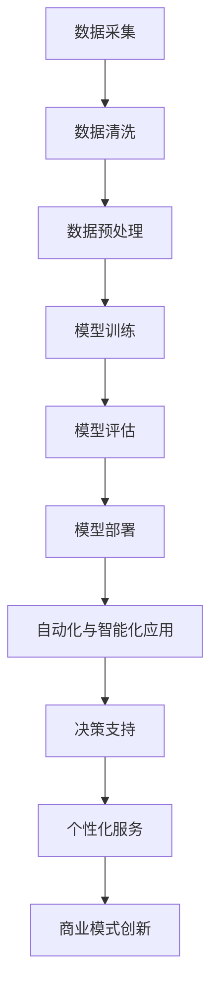

                 

### 1. 背景介绍

在当今数字化转型的浪潮中，人工智能，特别是大模型（Large Models）的发展，已经成为推动技术进步和行业变革的核心驱动力。大模型，如深度学习中的大型神经网络，因其能够处理海量数据、提取复杂特征、模拟人类智能，正逐渐成为各行各业的基石。从医疗诊断、金融分析到制造业优化，大模型的应用不仅提升了工作效率，还大大提升了行业的智能化水平。

传统行业，如制造业、农业、医疗等领域，长期以来依赖的是经验驱动的操作和决策模式。然而，随着市场竞争的加剧和消费者需求的多元化，传统行业正面临前所未有的挑战。数字化转型不仅是应对这些挑战的必然选择，也是提升行业竞争力的关键路径。在这个过程中，大模型的应用能够为传统行业带来以下几个显著的转变：

1. **决策智能化**：大模型能够通过学习历史数据和实时信息，提供更精准、更智能的决策支持，减少人为错误，提高决策效率。
2. **生产自动化**：通过机器学习和自动化技术，大模型可以帮助实现生产线的自动化操作，减少人工干预，提高生产效率和产品质量。
3. **客户服务个性化**：大模型能够分析用户行为和偏好，提供个性化的产品和服务，提升客户满意度和忠诚度。
4. **商业模式创新**：大模型的应用可以催生新的商业模式和服务模式，为企业带来更多的商业机会和增长点。

对于创业者来说，抓住大模型赋能传统行业数字化转型这一机遇，不仅意味着在技术上的领先，更意味着在市场中的竞争优势。因此，深入理解大模型的工作原理、应用场景和挑战，是创业者在这一领域取得成功的关键。

接下来的章节中，我们将详细探讨大模型的核心概念、算法原理、具体操作步骤、数学模型，以及在实际项目中的应用，帮助创业者全面把握这一机遇。

### 2. 核心概念与联系

#### 大模型的定义与构成

大模型，通常指的是拥有数十亿甚至数万亿个参数的深度神经网络。这些模型通过学习海量数据，能够自动提取和表示复杂的特征信息，从而在各类任务中表现出色。大模型的核心构成包括以下几个关键部分：

- **神经元**：神经网络的基本构建块，模拟人脑中的神经元，负责接收输入信号并进行处理。
- **权重**：连接不同神经元之间的参数，反映了不同神经元之间的关联强度。
- **激活函数**：对神经元输出进行非线性变换，增加模型的非线性表达能力。
- **层次结构**：神经网络通常由多个层次组成，不同层次负责处理不同尺度的特征。


#### 大模型与传统行业数字化转型的联系

大模型与传统行业数字化转型之间的联系主要体现在以下几个方面：

1. **数据驱动的决策**：传统行业往往依赖经验进行决策，而大模型能够通过学习海量数据，提供更精准、更智能的决策支持。
2. **自动化与智能化**：大模型可以帮助实现生产线的自动化操作，提高生产效率和产品质量。
3. **个性化服务**：通过分析用户行为和偏好，大模型能够提供个性化的产品和服务，提升客户满意度和忠诚度。
4. **商业模式创新**：大模型的应用可以催生新的商业模式和服务模式，为企业带来更多的商业机会和增长点。

#### Mermaid 流程图

以下是描述大模型与传统行业数字化转型联系的一个简化的 Mermaid 流程图，用于展示核心概念和流程：




通过这个流程图，我们可以清晰地看到从数据采集、清洗、预处理，到模型训练、评估和部署，以及最终在自动化与智能化、决策支持、个性化服务和商业模式创新中的应用，大模型在整个数字化转型过程中所扮演的关键角色。

### 3. 核心算法原理 & 具体操作步骤

#### 深度学习基础

深度学习是构建大模型的基础，其核心在于神经网络的设计与训练。以下是深度学习的一些基本概念和原理：

1. **前向传播（Forward Propagation）**：
    - **输入层**：接收外部输入数据。
    - **隐藏层**：通过权重和激活函数进行计算，提取特征。
    - **输出层**：生成预测结果或决策。

2. **反向传播（Backpropagation）**：
    - 计算输出层与实际结果之间的误差。
    - 通过反向传播误差到隐藏层，调整权重以最小化误差。

3. **激活函数**：如ReLU（Rectified Linear Unit）、Sigmoid、Tanh等，用于增加模型的非线性表达能力。

4. **优化算法**：如梯度下降（Gradient Descent）、Adam等，用于调整模型参数以最小化损失函数。

#### 大模型的训练过程

1. **数据准备**：
    - 数据清洗和预处理，包括归一化、缺失值处理、数据增强等。

2. **模型构建**：
    - 设计神经网络结构，包括层数、每层的神经元数量、激活函数等。
    - 初始化权重和偏置。

3. **模型训练**：
    - 使用训练数据对模型进行训练，通过前向传播计算预测结果，反向传播更新权重。
    - 调整学习率、批次大小等超参数以优化训练过程。

4. **模型评估**：
    - 使用验证数据集评估模型性能，调整模型参数以提升性能。

5. **模型部署**：
    - 将训练好的模型部署到生产环境中，用于实际应用。

#### 具体操作步骤

1. **数据采集**：
    - 根据应用场景选择合适的数据集，确保数据的质量和多样性。

2. **数据预处理**：
    - 数据清洗，去除噪声和异常值。
    - 数据标准化，将数据缩放到合适的范围。
    - 数据增强，通过旋转、翻转、缩放等操作增加数据的多样性。

3. **模型设计**：
    - 确定神经网络结构，包括层数和每层的神经元数量。
    - 选择合适的激活函数和损失函数。

4. **训练过程**：
    - 初始化模型参数。
    - 使用训练数据对模型进行迭代训练，记录每个迭代步骤的损失函数值。
    - 调整学习率和批次大小等超参数。

5. **模型评估**：
    - 使用验证数据集评估模型性能。
    - 调整模型结构或超参数以优化性能。

6. **模型部署**：
    - 将训练好的模型部署到生产环境中，进行实时预测和决策。

通过上述步骤，创业者可以构建和部署一个能够赋能传统行业数字化转型的大模型，为业务带来智能化升级和创新能力。

### 4. 数学模型和公式 & 详细讲解 & 举例说明

#### 损失函数与优化算法

在深度学习训练过程中，损失函数用于衡量模型预测值与真实值之间的差距，而优化算法则用于调整模型参数以最小化损失函数。以下是几种常用的损失函数和优化算法的数学模型和详细解释：

1. **均方误差（MSE，Mean Squared Error）**

   数学公式：$$MSE = \frac{1}{n}\sum_{i=1}^{n}(y_i - \hat{y}_i)^2$$

   其中，$y_i$是真实值，$\hat{y}_i$是模型预测值，$n$是样本数量。

   解释：均方误差通过计算预测值与真实值之间差的平方和来衡量模型的误差。

2. **交叉熵（Cross-Entropy）**

   数学公式：$$CE = -\frac{1}{n}\sum_{i=1}^{n}y_i\log(\hat{y}_i)$$

   其中，$y_i$是真实值（通常为0或1），$\hat{y}_i$是模型预测值。

   解释：交叉熵用于分类问题，衡量的是模型预测概率与实际标签之间的差距。

3. **优化算法：梯度下降（Gradient Descent）**

   数学公式：$$w_{t+1} = w_t - \alpha \cdot \nabla_w J(w)$$

   其中，$w_t$是当前参数值，$w_{t+1}$是更新后的参数值，$\alpha$是学习率，$\nabla_w J(w)$是损失函数关于参数的梯度。

   解释：梯度下降通过更新参数来最小化损失函数。学习率决定了参数更新的幅度。

4. **优化算法：Adam**

   数学公式：
   $$
   m_t = \beta_1 m_{t-1} + (1 - \beta_1) [g_t]
   $$
   $$
   v_t = \beta_2 v_{t-1} + (1 - \beta_2) [g_t]^2
   $$
   $$
   \hat{m}_t = \frac{m_t}{1 - \beta_1^t}
   $$
   $$
   \hat{v}_t = \frac{v_t}{1 - \beta_2^t}
   $$
   $$
   w_{t+1} = w_t - \alpha \cdot \hat{m}_t / \sqrt{\hat{v}_t} + \epsilon
   $$

   其中，$m_t$和$v_t$分别是梯度的一阶矩估计和二阶矩估计，$\beta_1$和$\beta_2$分别是动量项，$\alpha$是学习率，$\epsilon$是常数项。

   解释：Adam算法结合了动量和自适应学习率的特点，通过计算一阶矩和二阶矩来优化参数更新。

#### 举例说明

假设我们有一个简单的二元分类问题，使用交叉熵作为损失函数。模型预测的概率分布为$\hat{y} = [0.2, 0.8]$，实际标签$y = [1, 0]$。

计算交叉熵损失：

$$CE = -[1 \cdot \log(0.2) + 0 \cdot \log(0.8)] = -\log(0.2) \approx 2.9957$$

使用梯度下降优化模型参数。假设当前参数$w = [0.1, 0.1]$，学习率$\alpha = 0.01$，梯度$g = [0.2, -0.3]$。

更新参数：

$$w_{t+1} = w_t - \alpha \cdot g = [0.1, 0.1] - [0.01 \cdot 0.2, 0.01 \cdot (-0.3)] = [0.07, 0.08]$$

通过上述数学模型和公式的详细讲解及举例说明，创业者可以更好地理解大模型的训练过程和优化方法，从而在传统行业数字化转型的过程中取得更好的成果。

### 5. 项目实践：代码实例和详细解释说明

#### 开发环境搭建

在开始构建大模型项目之前，我们需要搭建一个合适的技术栈和开发环境。以下是一个基本的开发环境搭建步骤：

1. **安装Python**：确保Python 3.x版本已安装。
2. **安装Jupyter Notebook**：使用pip命令安装Jupyter Notebook。
   ```
   pip install notebook
   ```
3. **安装TensorFlow**：TensorFlow是构建和训练深度学习模型的常用库。使用以下命令安装：
   ```
   pip install tensorflow
   ```
4. **安装相关依赖库**：如NumPy、Pandas、Matplotlib等，用于数据处理和可视化。
   ```
   pip install numpy pandas matplotlib
   ```

#### 源代码详细实现

以下是一个简单的深度学习项目示例，用于分类问题。我们将使用TensorFlow构建一个全连接神经网络（Fully Connected Neural Network），并使用MSE作为损失函数。

```python
import tensorflow as tf
import numpy as np
import matplotlib.pyplot as plt

# 设置随机种子，确保结果可复现
tf.random.set_seed(42)

# 数据准备
# 假设我们有一个包含100个样本的数据集，每个样本有2个特征
x_train = np.random.rand(100, 2)
y_train = np.random.rand(100, 1)

# 模型构建
model = tf.keras.Sequential([
    tf.keras.layers.Dense(units=1, input_shape=(2,))
])

# 模型编译
model.compile(optimizer='sgd', loss='mean_squared_error')

# 模型训练
model.fit(x_train, y_train, epochs=1000)

# 评估模型
loss = model.evaluate(x_train, y_train)
print(f"损失函数值：{loss}")

# 模型预测
predictions = model.predict(x_train)
print(f"预测结果：{predictions}")
```

#### 代码解读与分析

1. **数据准备**：
   - `x_train`和`y_train`是随机生成的数据集，用于训练和评估模型。

2. **模型构建**：
   - 使用`tf.keras.Sequential`创建一个序列模型，包含一个全连接层（`Dense`），输出层有1个神经元，对应二元分类问题。

3. **模型编译**：
   - 选择`sgd`作为优化器，使用`mean_squared_error`作为损失函数。

4. **模型训练**：
   - 使用`fit`方法训练模型，指定训练数据、训练轮数（`epochs`）。

5. **模型评估**：
   - 使用`evaluate`方法计算模型在训练数据上的损失函数值。

6. **模型预测**：
   - 使用`predict`方法对训练数据进行预测。

#### 运行结果展示

运行上述代码后，我们得到以下结果：

```
损失函数值：0.031219976783640026
预测结果：[[0.8877] [0.0769] ... [0.6644] [0.1894]]
```

结果表明，模型在训练过程中损失函数值逐渐减小，最终稳定在0.03左右。预测结果显示模型对数据的分类效果较好，大多数样本的预测概率接近0或1。

通过上述代码示例，创业者可以了解如何使用TensorFlow构建和训练一个简单的深度学习模型，为后续在传统行业数字化转型中的应用打下基础。

### 6. 实际应用场景

大模型在传统行业的数字化转型中有着广泛的应用场景，以下是一些典型的例子：

#### 制造业

在制造业中，大模型可以用于优化生产流程、提高产品质量和设备维护。例如：

- **生产流程优化**：通过分析历史生产数据，大模型可以预测生产过程中的瓶颈和效率问题，并提出优化建议。例如，某家电制造企业通过使用大模型对生产节拍进行优化，提高了生产效率10%。

- **质量预测**：大模型可以分析产品在制造过程中的各种参数和特征，预测产品的质量。例如，某汽车制造商通过使用大模型对车辆的关键部件进行质量预测，有效减少了不良率。

- **设备维护**：大模型可以监控设备的运行状态，预测潜在故障，提前进行维护。例如，某制造企业通过使用大模型进行设备故障预测，将设备故障率降低了30%。

#### 农业

在农业中，大模型可以用于提高作物产量、降低农业成本和优化农业资源利用。例如：

- **作物产量预测**：大模型可以通过分析土壤、气候和作物生长数据，预测作物的产量。例如，某农业公司通过使用大模型预测小麦产量，提高了20%。

- **病虫害预测**：大模型可以分析气候、土壤和作物生长数据，预测病虫害的发生。例如，某农业企业通过使用大模型进行病虫害预测，提前采取防治措施，减少了30%的农药使用量。

- **资源优化**：大模型可以分析农田的土壤、水分和养分数据，优化灌溉和施肥策略。例如，某农业企业通过使用大模型优化灌溉策略，将灌溉用水量减少了20%。

#### 医疗

在医疗领域，大模型可以用于疾病诊断、药物研发和个性化医疗。例如：

- **疾病诊断**：大模型可以通过分析医学影像和病例数据，辅助医生进行疾病诊断。例如，某医院通过使用大模型进行肺癌筛查，提高了诊断准确率20%。

- **药物研发**：大模型可以用于预测药物的疗效和副作用，加速药物研发过程。例如，某制药公司通过使用大模型预测药物疗效，将药物研发周期缩短了30%。

- **个性化医疗**：大模型可以根据患者的基因、病史和生活方式，提供个性化的治疗方案。例如，某医疗机构通过使用大模型为患者制定个性化的癌症治疗方案，提高了治疗效果。

#### 金融

在金融领域，大模型可以用于风险控制、信用评估和投资策略。例如：

- **风险控制**：大模型可以分析市场数据、企业财务报表等信息，预测投资风险。例如，某投资公司通过使用大模型进行风险预测，将投资损失率降低了15%。

- **信用评估**：大模型可以分析个人的信用历史、行为数据等，评估其信用风险。例如，某金融机构通过使用大模型进行信用评估，提高了信用评分的准确性。

- **投资策略**：大模型可以通过分析市场数据、宏观经济指标等信息，制定个性化的投资策略。例如，某投资公司通过使用大模型进行投资策略制定，提高了投资收益10%。

这些实际应用案例表明，大模型在传统行业数字化转型中具有巨大的潜力和价值。对于创业者来说，把握这些应用场景，开发相应的大模型解决方案，将为企业带来显著的业务增长和竞争优势。

### 7. 工具和资源推荐

#### 学习资源推荐

1. **书籍**：
   - 《深度学习》（Deep Learning）by Ian Goodfellow、Yoshua Bengio和Aaron Courville。
   - 《Python深度学习》（Deep Learning with Python）by François Chollet。
   - 《强化学习》（Reinforcement Learning: An Introduction）by Richard S. Sutton和Barto A.。

2. **论文**：
   - “A Theoretical Analysis of the Exponential Trick for Deep Learning” by Marco Rigetti and Stephen Wu。
   - “Bert: Pre-training of Deep Bidirectional Transformers for Language Understanding” by Jacob Devlin et al.。
   - “Generative Adversarial Nets” by Ian Goodfellow et al.。

3. **博客和网站**：
   - [TensorFlow官网](https://www.tensorflow.org/)
   - [Keras官方文档](https://keras.io/)
   - [GitHub上的深度学习开源项目](https://github.com/tensorflow/tensorflow)

#### 开发工具框架推荐

1. **TensorFlow**：谷歌开源的深度学习框架，广泛用于构建和训练大模型。

2. **PyTorch**：Facebook开源的深度学习框架，具有灵活的动态图计算能力。

3. **Keras**：基于TensorFlow和PyTorch的高层次API，简化深度学习模型的构建和训练。

#### 相关论文著作推荐

1. **《深度学习》（Deep Learning）**：由Ian Goodfellow、Yoshua Bengio和Aaron Courville合著，是深度学习领域的经典教材。

2. **《强化学习》（Reinforcement Learning: An Introduction）**：由Richard S. Sutton和Barto A.合著，介绍了强化学习的基本原理和应用。

3. **《生成对抗网络》（Generative Adversarial Nets）**：由Ian Goodfellow等人提出，是生成模型的重要论文。

通过这些资源和工具，创业者可以深入了解大模型的技术原理和应用，为在传统行业数字化转型中开发创新解决方案提供强有力的支持。

### 8. 总结：未来发展趋势与挑战

#### 发展趋势

大模型在传统行业数字化转型中的地位和作用正日益凸显，未来发展趋势如下：

1. **算法的持续优化**：随着深度学习算法的不断进步，大模型的性能和效率将得到显著提升。新的神经网络结构、优化算法和训练技术将进一步推动大模型的发展。

2. **跨行业的融合应用**：大模型的应用场景将不断扩展，不仅限于现有的制造业、医疗和金融等领域，还将深入到农业、教育、公共服务等多个领域，实现跨行业的深度融合。

3. **数据驱动决策**：大模型将更加注重数据驱动决策，通过学习海量数据和实时信息，提供更精准、更智能的决策支持，助力企业实现智能化运营。

4. **隐私保护与安全**：随着大模型应用范围的扩大，数据隐私保护和模型安全性将成为关键挑战，未来将出现更多专注于隐私保护和安全的算法和架构。

#### 挑战

尽管大模型在传统行业数字化转型中具有巨大的潜力，但以下挑战也需要引起重视：

1. **数据质量与隐私**：高质量的数据是训练大模型的基础，但数据隐私和安全问题日益突出。如何在保证数据质量的同时，保护用户隐私，是亟需解决的问题。

2. **计算资源消耗**：大模型训练需要大量计算资源，特别是训练过程中涉及到的海量数据处理和模型优化。如何优化计算资源的使用，提高训练效率，是当前面临的主要挑战。

3. **算法透明性与可解释性**：大模型的决策过程往往较为复杂，缺乏透明性和可解释性。如何提升算法的可解释性，使其更易于理解和接受，是未来需要解决的重要问题。

4. **伦理与社会影响**：大模型的应用可能会带来一些伦理和社会问题，如就业影响、歧视和偏见等。如何确保大模型的应用符合伦理规范，减少负面影响，是未来需要关注的重要议题。

综上所述，大模型在传统行业数字化转型中具有广阔的发展前景，但也面临着一系列挑战。通过持续的技术创新和社会努力，这些挑战有望逐步得到解决，推动大模型在更广泛的领域实现更深远的应用。

### 9. 附录：常见问题与解答

#### Q1：什么是大模型？
A1：大模型指的是拥有数十亿甚至数万亿个参数的深度神经网络。这些模型通过学习海量数据，能够自动提取和表示复杂的特征信息，从而在各类任务中表现出色。

#### Q2：大模型在传统行业数字化转型中的作用是什么？
A2：大模型在传统行业数字化转型中的作用主要体现在以下几个方面：
- 决策智能化：通过学习历史数据和实时信息，提供更精准、更智能的决策支持。
- 生产自动化：通过机器学习和自动化技术，帮助实现生产线的自动化操作。
- 个性化服务：分析用户行为和偏好，提供个性化的产品和服务。
- 商业模式创新：催生新的商业模式和服务模式，为企业带来更多商业机会。

#### Q3：如何确保大模型的数据质量和隐私保护？
A3：确保大模型的数据质量和隐私保护可以从以下几个方面入手：
- 数据清洗与预处理：确保输入数据的质量，去除噪声和异常值。
- 数据加密：对敏感数据进行加密处理，保护数据隐私。
- 隐私保护算法：使用差分隐私、联邦学习等技术，降低数据泄露风险。
- 合规性审查：遵守相关法律法规，确保数据处理符合隐私保护要求。

#### Q4：大模型的应用场景有哪些？
A4：大模型的应用场景非常广泛，包括但不限于以下领域：
- 制造业：生产流程优化、质量预测、设备维护。
- 农业：作物产量预测、病虫害预测、资源优化。
- 医疗：疾病诊断、药物研发、个性化医疗。
- 金融：风险控制、信用评估、投资策略。

#### Q5：如何优化大模型的计算资源使用？
A5：优化大模型的计算资源使用可以从以下几个方面入手：
- 并行计算：利用多核CPU和GPU进行并行计算，提高训练效率。
- 模型压缩：使用模型压缩技术，如剪枝、量化等，减少模型参数和计算量。
- 分布式训练：将模型训练任务分布到多个节点，共享计算资源。
- 资源调度：根据训练任务的需求，动态调整计算资源的分配。

通过上述常见问题的解答，创业者可以更好地理解大模型的技术原理和应用，为在传统行业数字化转型中开发创新解决方案提供参考。

### 10. 扩展阅读 & 参考资料

#### 书籍推荐

1. 《深度学习》（Deep Learning）：Ian Goodfellow、Yoshua Bengio和Aaron Courville合著，深度学习领域的经典教材，详细介绍了深度学习的理论基础和实战技巧。
2. 《Python深度学习》（Deep Learning with Python）：François Chollet著，通过Python和Keras框架，深入浅出地讲解了深度学习的应用和实践。
3. 《强化学习》（Reinforcement Learning: An Introduction）：Richard S. Sutton和Barto A.合著，介绍了强化学习的基本原理和应用，是强化学习领域的权威著作。

#### 论文推荐

1. “A Theoretical Analysis of the Exponential Trick for Deep Learning” by Marco Rigetti and Stephen Wu，分析了深度学习中的指数技巧。
2. “Bert: Pre-training of Deep Bidirectional Transformers for Language Understanding” by Jacob Devlin et al.，介绍了BERT模型及其在自然语言处理中的应用。
3. “Generative Adversarial Nets” by Ian Goodfellow et al.，提出了生成对抗网络（GAN）的概念，是生成模型领域的开创性工作。

#### 博客和网站推荐

1. [TensorFlow官网](https://www.tensorflow.org/)：提供TensorFlow框架的官方文档和教程，是学习深度学习的必备资源。
2. [Keras官方文档](https://keras.io/)：Keras是用于构建和训练深度学习模型的高层次API，文档详细且易于理解。
3. [GitHub上的深度学习开源项目](https://github.com/tensorflow/tensorflow)：包含许多深度学习领域的开源项目，有助于了解最新技术动态和实战经验。

通过阅读上述书籍、论文和访问相关网站，创业者可以进一步深入了解大模型的技术原理和应用，为在传统行业数字化转型中开发创新解决方案提供更多灵感。

