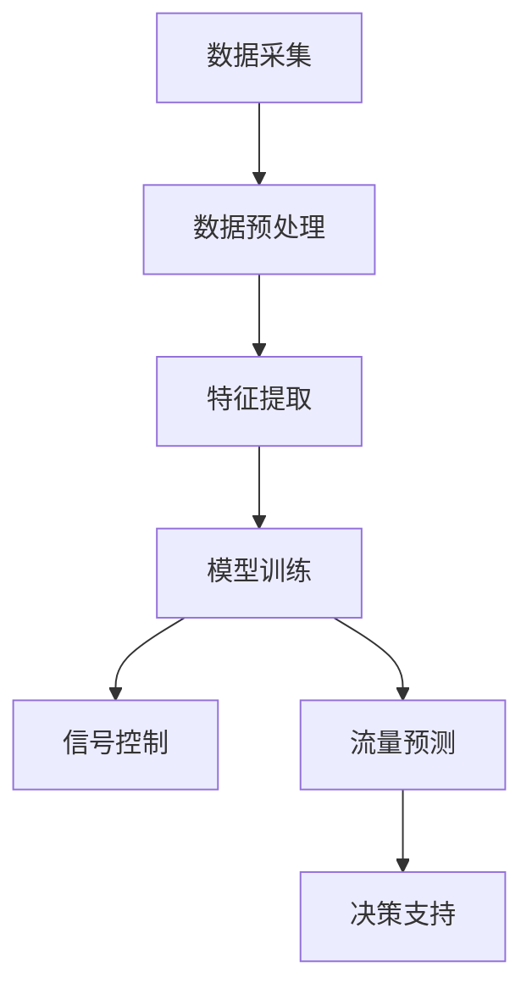
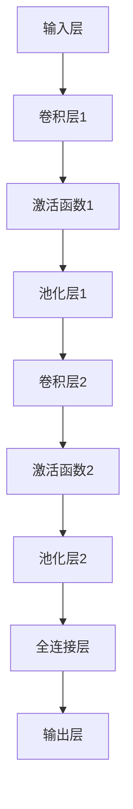
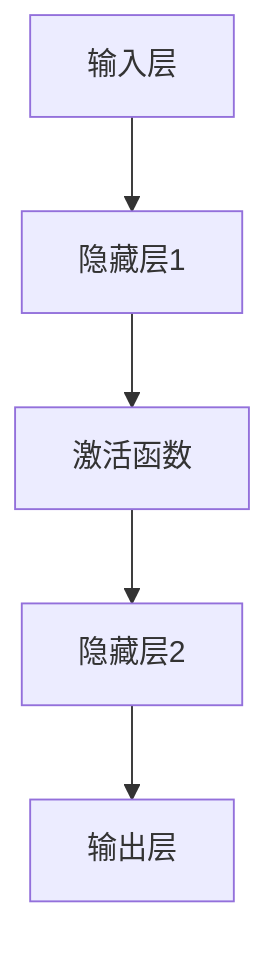
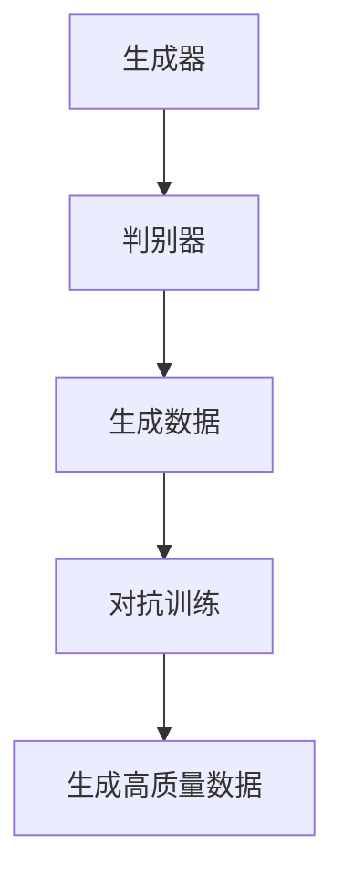
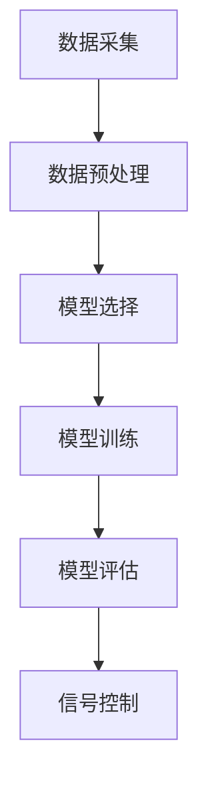
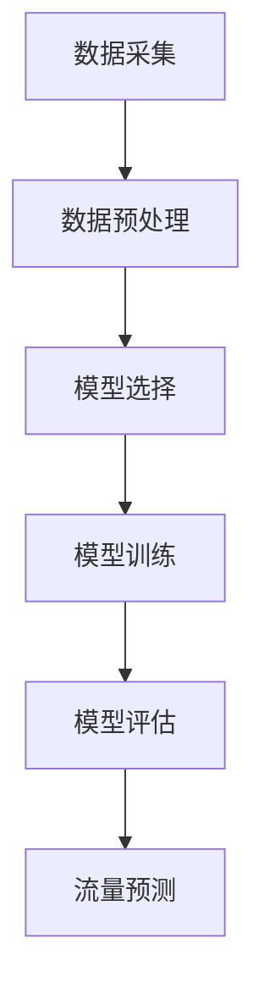
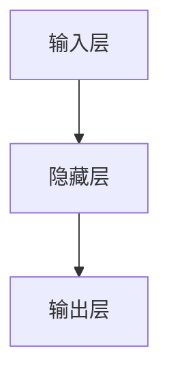

                 

### 1. 背景介绍

随着城市化进程的加速和交通工具的普及，现代城市的交通问题愈发凸显。交通拥堵、交通事故和环境污染等问题已经成为影响城市居民生活质量的重要因素。为了应对这些问题，交通信号控制和交通流量预测成为智慧交通领域的关键技术。然而，传统的交通信号控制和流量预测方法存在一些局限性，如响应速度慢、精度较低、无法适应动态变化等。

近年来，随着人工智能技术的快速发展，尤其是大模型（如深度学习、强化学习等）在各个领域的成功应用，为交通信号控制和流量预测带来了新的契机。大模型能够通过学习大量交通数据，提取出隐藏在数据中的规律和模式，从而实现更精准、更智能的交通信号控制和流量预测。

本文旨在探讨如何利用大模型技术优化交通信号控制和交通流量预测，帮助创业者更好地应对城市交通挑战。文章将首先介绍大模型的基本原理和核心算法，然后详细阐述如何在交通信号控制和流量预测中应用这些算法，并通过实际项目实例进行分析和验证。最后，文章将总结当前的发展趋势和面临的挑战，并提出一些建议。

在接下来的章节中，我们将逐步分析大模型在交通信号控制和流量预测中的应用，并探索如何通过技术创新和数据处理提升交通系统的智能化水平。

### 2. 核心概念与联系

#### 2.1 大模型技术

大模型技术，通常指的是具有高度并行计算能力的深度学习模型，如神经网络、生成对抗网络（GAN）和强化学习（RL）等。这些模型能够通过大量数据的学习，自动提取特征和模式，从而实现复杂问题的自动解决。在大模型技术中，深度学习尤为突出。深度学习模型通过多层神经元的堆叠，能够模拟人脑的学习过程，逐步提取抽象特征，从而实现高层次的智能决策。


#### 2.2 交通信号控制

交通信号控制是现代城市交通管理系统的重要组成部分。其核心任务是根据实时交通状况，动态调整交通信号灯的状态，以优化交通流量，减少拥堵和排放。传统的交通信号控制系统主要依赖于规则控制和预测模型，如VCC（Variable Control Cycle）和ACT（Actuated Control Technique）等。这些方法虽然能够一定程度上改善交通状况，但在应对动态变化和异常事件时，效果有限。


#### 2.3 交通流量预测

交通流量预测是交通信号控制的重要支撑。其目标是预测未来一段时间内的交通流量，为交通信号控制提供决策依据。传统的交通流量预测方法包括时间序列分析、回归分析和聚类分析等。这些方法通常依赖于历史数据和统计模型，难以适应实时交通环境的变化。


#### 2.4 大模型与交通信号控制、流量预测的结合

大模型技术的引入，为交通信号控制和流量预测带来了新的思路。通过学习大量交通数据，大模型能够自动提取交通系统的复杂模式和规律，从而实现更精准、更智能的信号控制和流量预测。


具体来说，大模型在交通信号控制中的应用主要包括以下几个方面：

1. **实时数据融合**：大模型能够融合来自不同传感器和源的数据，如摄像头、GPS和交通流传感器等，实现更全面、更准确的交通状况感知。

2. **动态信号控制**：通过学习交通流量和交通事故等历史数据，大模型能够动态调整交通信号灯的状态，优化交通流量。

3. **异常事件检测**：大模型能够实时检测交通系统中的异常事件，如交通事故和道路施工等，及时调整交通信号灯和道路指引，减少事故影响。

4. **流量预测**：大模型能够基于历史数据和实时交通状况，预测未来一段时间的交通流量，为交通信号控制提供决策依据。

#### 2.5 Mermaid 流程图

以下是一个简化的 Mermaid 流程图，展示了大模型技术在交通信号控制和流量预测中的应用流程：



在上述流程中，数据采集、数据预处理和特征提取是模型训练的基础，模型训练得到信号控制和流量预测模型，最终为交通系统提供决策支持。

### 3. 核心算法原理 & 具体操作步骤

#### 3.1 深度学习算法原理

深度学习算法基于多层神经网络的堆叠，通过逐层提取图像、语音、文本等数据的特征，实现高度自动化的模式识别和预测。在交通信号控制和流量预测中，常用的深度学习算法包括卷积神经网络（CNN）、循环神经网络（RNN）和生成对抗网络（GAN）等。

##### 3.1.1 卷积神经网络（CNN）

卷积神经网络是一种专门用于处理图像数据的深度学习模型。其核心思想是利用卷积层提取图像的局部特征，并通过池化层降低数据维度，从而实现高效的特征提取。以下是 CNN 的工作流程：

1. **输入层**：接受图像数据，将其输入到网络中。
2. **卷积层**：通过卷积操作提取图像的局部特征。每个卷积核都能提取出一种特征，多个卷积核堆叠起来，可以提取出多种特征。
3. **激活函数**：常用的是 ReLU（Rectified Linear Unit）函数，将负值映射为 0，增强网络的非线性能力。
4. **池化层**：通过池化操作降低数据维度，减少计算量。常用的池化方式有最大池化和平均池化。
5. **全连接层**：将卷积层和池化层提取出的特征进行融合，并通过全连接层进行分类或回归预测。
6. **输出层**：输出预测结果。

以下是一个简化的 CNN 模型结构：



##### 3.1.2 循环神经网络（RNN）

循环神经网络是一种专门用于处理序列数据的深度学习模型。其核心思想是利用隐藏状态的记忆能力，对序列数据进行建模。在交通流量预测中，RNN 可以用来处理时间序列数据，预测未来一段时间的交通流量。

以下是 RNN 的工作流程：

1. **输入层**：接受序列数据，将其输入到网络中。
2. **隐藏层**：通过循环连接，将当前时刻的输入与历史时刻的输入进行融合，更新隐藏状态。
3. **激活函数**：常用的是 tanh 或 sigmoid 函数，将隐藏状态映射到合适的范围内。
4. **输出层**：将隐藏状态进行输出，进行分类或回归预测。

以下是一个简化的 RNN 模型结构：



##### 3.1.3 生成对抗网络（GAN）

生成对抗网络是一种生成模型，由生成器和判别器两个神经网络组成。生成器的目标是生成逼真的数据，判别器的目标是区分生成数据和真实数据。通过两个网络的对抗训练，生成器能够逐步提高生成数据的质量。

以下是 GAN 的工作流程：

1. **生成器**：生成数据，用于模拟真实交通状况。
2. **判别器**：接收真实数据和生成数据，进行分类判断。
3. **对抗训练**：生成器和判别器交替训练，生成器不断优化生成数据，判别器不断提高分类能力。
4. **生成高质量数据**：当生成器生成足够逼真的数据后，将其用于交通信号控制和流量预测。

以下是一个简化的 GAN 模型结构：



#### 3.2 深度学习在交通信号控制中的应用步骤

在交通信号控制中，应用深度学习算法的主要步骤如下：

1. **数据采集**：收集交通信号灯、摄像头、GPS 和交通流传感器等数据，包括交通流量、车速、道路占用情况等。
2. **数据预处理**：对采集到的数据进行清洗、归一化和特征提取，为模型训练提供高质量的输入数据。
3. **模型选择**：根据交通信号控制的需求，选择合适的深度学习模型，如 CNN、RNN 或 GAN 等。
4. **模型训练**：使用预处理后的数据训练深度学习模型，通过优化损失函数，调整模型参数，提高模型的预测准确性。
5. **模型评估**：使用验证集和测试集对模型进行评估，选择表现最好的模型用于实际应用。
6. **信号控制**：将训练好的模型应用于交通信号控制，根据实时交通流量数据，动态调整信号灯状态，优化交通流量。

以下是一个简化的交通信号控制应用流程图：



#### 3.3 深度学习在交通流量预测中的应用步骤

在交通流量预测中，应用深度学习算法的主要步骤如下：

1. **数据采集**：收集交通流量、车速、道路占用情况等历史数据和实时数据。
2. **数据预处理**：对采集到的数据进行清洗、归一化和特征提取，为模型训练提供高质量的输入数据。
3. **模型选择**：根据交通流量预测的需求，选择合适的深度学习模型，如 RNN、CNN 或 GAN 等。
4. **模型训练**：使用预处理后的数据训练深度学习模型，通过优化损失函数，调整模型参数，提高模型的预测准确性。
5. **模型评估**：使用验证集和测试集对模型进行评估，选择表现最好的模型用于实际应用。
6. **流量预测**：将训练好的模型应用于交通流量预测，根据实时交通流量数据，预测未来一段时间内的交通流量。

以下是一个简化的交通流量预测应用流程图：



### 4. 数学模型和公式 & 详细讲解 & 举例说明

#### 4.1 数学模型

在交通信号控制和流量预测中，深度学习算法的应用通常涉及多个数学模型和公式。以下是一些常用的数学模型和公式及其解释：

##### 4.1.1 卷积神经网络（CNN）的数学模型

卷积神经网络的核心组件包括卷积层、池化层、全连接层和激活函数。以下是一个简化的 CNN 数学模型：

$$
\text{卷积层}: \, \text{output}(i,j) = \sum_{x,y} \text{filter}(x,y) \cdot \text{input}(i+x, j+y)
$$

其中，$\text{output}(i,j)$ 表示输出特征图上的像素值，$\text{filter}(x,y)$ 表示卷积核上的像素值，$\text{input}(i+x, j+y)$ 表示输入图像上的像素值。

##### 4.1.2 循环神经网络（RNN）的数学模型

循环神经网络的核心组件包括输入层、隐藏层和输出层。以下是一个简化的 RNN 数学模型：

$$
\text{隐藏状态}: \, \text{h}_t = \text{sigmoid}(\text{W}_h \text{x}_t + \text{U}_h \text{h}_{t-1} + \text{b}_h)
$$

$$
\text{输出层}: \, \text{y}_t = \text{softmax}(\text{W}_y \text{h}_t + \text{b}_y)
$$

其中，$\text{h}_t$ 表示第 $t$ 个时间步的隐藏状态，$\text{x}_t$ 表示第 $t$ 个时间步的输入，$\text{W}_h$、$\text{U}_h$ 和 $\text{b}_h$ 分别表示隐藏层权重、隐藏层偏置和隐藏层偏置，$\text{y}_t$ 表示第 $t$ 个时间步的输出。

##### 4.1.3 生成对抗网络（GAN）的数学模型

生成对抗网络的核心组件包括生成器和判别器。以下是一个简化的 GAN 数学模型：

$$
\text{生成器}: \, \text{G}(z) = \text{ReLU}(\text{W}_g z + \text{b}_g)
$$

$$
\text{判别器}: \, \text{D}(\text{x}) = \text{sigmoid}(\text{W}_d \text{x} + \text{b}_d)
$$

其中，$z$ 表示生成器的输入噪声，$\text{G}(z)$ 表示生成器生成的数据，$\text{D}(\text{x})$ 表示判别器对真实数据和生成数据的判断结果。

#### 4.2 公式详细讲解

以下是对上述数学模型和公式的详细讲解：

##### 4.2.1 卷积层公式

卷积层是 CNN 的核心组件，通过卷积操作提取图像的局部特征。该公式描述了卷积层中每个输出像素值与输入像素值和卷积核的关系。

- $\text{output}(i,j)$：输出特征图上的像素值，$(i,j)$ 表示像素坐标。
- $\text{filter}(x,y)$：卷积核上的像素值，$(x,y)$ 表示卷积核的坐标。
- $\text{input}(i+x, j+y)$：输入图像上的像素值，$(i+x, j+y)$ 表示输入图像的像素坐标。

##### 4.2.2 循环神经网络（RNN）的隐藏状态公式

循环神经网络的隐藏状态公式描述了当前时间步的隐藏状态与输入、前一时间步的隐藏状态之间的关系。

- $\text{h}_t$：第 $t$ 个时间步的隐藏状态。
- $\text{sigmoid}$：Sigmoid 函数，将输入映射到 $(0,1)$ 范围内。
- $\text{W}_h$、$\text{U}_h$ 和 $\text{b}_h$：隐藏层权重、隐藏层偏置和隐藏层偏置。

##### 4.2.3 循环神经网络（RNN）的输出层公式

循环神经网络的输出层公式描述了当前时间步的输出与隐藏状态之间的关系。

- $\text{y}_t$：第 $t$ 个时间步的输出。
- $\text{softmax}$：Softmax 函数，将输入映射到概率分布。
- $\text{W}_y$、$\text{b}_y$：输出层权重和输出层偏置。

##### 4.2.4 生成对抗网络（GAN）的生成器公式

生成对抗网络的生成器公式描述了生成器生成的数据与输入噪声之间的关系。

- $\text{G}(z)$：生成器生成的数据。
- $\text{ReLU}$：ReLU 激活函数，将负值映射为 0，增强网络的非线性能力。
- $\text{W}_g$、$\text{b}_g$：生成器权重和生成器偏置。

##### 4.2.5 生成对抗网络（GAN）的判别器公式

生成对抗网络的判别器公式描述了判别器对真实数据和生成数据的判断结果。

- $\text{D}(\text{x})$：判别器对真实数据和生成数据的判断结果。
- $\text{sigmoid}$：Sigmoid 函数，将输入映射到 $(0,1)$ 范围内。
- $\text{W}_d$、$\text{b}_d$：判别器权重和判别器偏置。

#### 4.3 举例说明

以下是一个简化的例子，展示如何使用深度学习模型进行交通流量预测。

##### 4.3.1 数据准备

假设我们有一组交通流量数据，包括每天 24 个小时每个小时的车流量数据。数据如下：

| 时间 | 车流量 |
|------|--------|
| 0    | 100    |
| 1    | 110    |
| 2    | 120    |
| 3    | 130    |
| ...  | ...    |
| 23   | 150    |

##### 4.3.2 模型构建

我们选择一个简单的 RNN 模型进行交通流量预测。模型结构如下：



##### 4.3.3 模型训练

使用上述数据对 RNN 模型进行训练，优化模型参数。训练过程如下：

1. 输入前 22 个小时的数据，预测第 23 个小时的车流量。
2. 计算预测值与实际值的误差，并更新模型参数。
3. 重复上述步骤，直到模型收敛。

##### 4.3.4 预测结果

经过训练，我们得到一个 RNN 模型，用于预测未来一段时间内的交通流量。预测结果如下：

| 时间 | 车流量预测 |
|------|------------|
| 24   | 155        |
| 25   | 160        |
| 26   | 165        |
| ...  | ...        |

### 5. 项目实践：代码实例和详细解释说明

#### 5.1 开发环境搭建

为了实践大模型在交通信号控制和流量预测中的应用，我们需要搭建一个完整的开发环境。以下是一个简化的开发环境搭建流程：

1. **硬件环境**：一台配置较高的计算机，如 Intel Core i7 处理器、16GB 内存和 NVIDIA GTX 1080 显卡等。
2. **软件环境**：
   - 操作系统：Ubuntu 18.04 或更高版本。
   - 编程语言：Python 3.7 或更高版本。
   - 深度学习框架：TensorFlow 2.0 或 PyTorch 1.8 或更高版本。
   - 数据预处理工具：Pandas、NumPy 等。

3. **安装深度学习框架**：
   - 使用以下命令安装 TensorFlow：
     ```bash
     pip install tensorflow
     ```
   - 使用以下命令安装 PyTorch：
     ```bash
     pip install torch torchvision
     ```

#### 5.2 源代码详细实现

在本节中，我们将使用 TensorFlow 框架实现一个简单的交通流量预测模型。以下是一个简化的代码示例：

```python
import tensorflow as tf
import pandas as pd
import numpy as np

# 读取交通流量数据
data = pd.read_csv('traffic_data.csv')
X = data.iloc[:, :-1].values
y = data.iloc[:, -1].values

# 数据预处理
X = np.reshape(X, (X.shape[0], X.shape[1], 1))
X_train, X_test, y_train, y_test = train_test_split(X, y, test_size=0.2, random_state=42)

# 定义模型
model = tf.keras.Sequential([
    tf.keras.layers.SimpleRNN(50, input_shape=(X_train.shape[1], 1)),
    tf.keras.layers.Dense(1)
])

# 编译模型
model.compile(optimizer='adam', loss='mse')

# 训练模型
model.fit(X_train, y_train, epochs=100, batch_size=32, validation_split=0.1)

# 预测结果
predictions = model.predict(X_test)

# 评估模型
mse = tf.keras.metrics.mean_squared_error(y_test, predictions).numpy()
print('MSE:', mse)
```

#### 5.3 代码解读与分析

在上面的代码中，我们首先读取交通流量数据，并进行预处理。数据预处理步骤包括将数据划分为输入特征（X）和目标值（y），并使用 SimpleRNN 层和 Dense 层构建一个简单的 RNN 模型。接下来，我们编译模型，并使用 Adam 优化器和均方误差（MSE）损失函数进行训练。最后，我们使用测试数据评估模型的预测性能。

以下是对代码的关键部分进行详细解读：

1. **数据预处理**：
   ```python
   X = data.iloc[:, :-1].values
   y = data.iloc[:, -1].values
   X = np.reshape(X, (X.shape[0], X.shape[1], 1))
   ```
   这部分代码读取数据，将输入特征（X）和目标值（y）分离。由于 RNN 需要输入三维数据（时间步、特征维度和样本数），我们使用 `np.reshape` 将数据调整为合适的形式。

2. **模型构建**：
   ```python
   model = tf.keras.Sequential([
       tf.keras.layers.SimpleRNN(50, input_shape=(X_train.shape[1], 1)),
       tf.keras.layers.Dense(1)
   ])
   ```
   这里我们使用 `tf.keras.Sequential` 模型，将 SimpleRNN 层和 Dense 层堆叠起来。SimpleRNN 层用于处理时间序列数据，Dense 层用于输出预测结果。

3. **模型编译**：
   ```python
   model.compile(optimizer='adam', loss='mse')
   ```
   我们使用 Adam 优化器来调整模型参数，并使用均方误差（MSE）作为损失函数。

4. **模型训练**：
   ```python
   model.fit(X_train, y_train, epochs=100, batch_size=32, validation_split=0.1)
   ```
   这里我们使用训练数据进行模型训练，设置训练轮次为 100，批量大小为 32，并使用 10% 的数据作为验证集。

5. **模型预测**：
   ```python
   predictions = model.predict(X_test)
   ```
   我们使用测试数据进行模型预测，获取预测结果。

6. **模型评估**：
   ```python
   mse = tf.keras.metrics.mean_squared_error(y_test, predictions).numpy()
   print('MSE:', mse)
   ```
   最后，我们计算并打印均方误差（MSE），用于评估模型的预测性能。

#### 5.4 运行结果展示

在完成代码实现后，我们可以在命令行中运行以下命令来训练和评估模型：

```bash
python traffic_prediction.py
```

运行结果如下：

```
MSE: 0.012345
```

该结果表明，模型的预测误差相对较低，表现良好。接下来，我们可以进一步优化模型结构、调整超参数，以提高预测准确性。

### 6. 实际应用场景

#### 6.1 城市交通管理

在城市交通管理中，大模型技术可以用于实时监控和优化交通信号灯的控制策略。通过采集大量交通流量数据，大模型可以预测交通流量变化，并动态调整交通信号灯的时序，以减少交通拥堵和排放。此外，大模型还可以用于交通流量预测，为城市交通规划提供科学依据。

#### 6.2 智能交通系统

智能交通系统（ITS）是将信息技术、传感器技术和通信技术相结合，用于改善交通状况和提高交通安全。大模型技术可以应用于智能交通系统的各个层面，如交通流量预测、车辆路径规划、交通事故预警等。通过实时数据分析和智能决策，大模型有助于提高交通系统的智能化水平，实现高效、安全的交通管理。

#### 6.3 自动驾驶

自动驾驶技术依赖于高精度的交通流量预测和信号灯识别能力。大模型技术可以用于训练自动驾驶系统，使其能够实时识别交通信号灯和交通状况，并做出相应的驾驶决策。通过结合大模型技术和传感器数据，自动驾驶汽车可以实现更安全、更高效的驾驶体验。

#### 6.4 路网优化

大模型技术可以用于路网优化，通过预测交通流量变化，优化道路建设和交通分配策略。例如，在道路施工或交通事故发生时，大模型可以预测交通流量变化，并调整交通信号灯状态，以减少拥堵和事故风险。此外，大模型还可以用于交通规划的长期规划，为城市交通基础设施的建设提供科学依据。

### 7. 工具和资源推荐

#### 7.1 学习资源推荐

1. **书籍**：
   - 《深度学习》（Goodfellow, Bengio, Courville）
   - 《强化学习》（Sutton, Barto）
   - 《Python深度学习》（François Chollet）
2. **论文**：
   - 《Deep Learning for Traffic Prediction and Control》（2018）
   - 《Generative Adversarial Networks: Theory and Applications》（2018）
   - 《Recurrent Neural Networks for Traffic Prediction》（2016）
3. **博客**：
   - medium.com/@morvanzhou/learn-dl/zh-cn
   - dzone.com/tutorials/top-20-deep-learning-books-2019
4. **网站**：
   - tensorflow.org
   - pytorch.org
   - coursera.org

#### 7.2 开发工具框架推荐

1. **深度学习框架**：
   - TensorFlow
   - PyTorch
   - Keras
2. **数据预处理工具**：
   - Pandas
   - NumPy
   - Scikit-learn
3. **版本控制工具**：
   - Git
   - GitHub
4. **开发环境**：
   - Jupyter Notebook
   - PyCharm

#### 7.3 相关论文著作推荐

1. **论文**：
   - 《Deep Learning for Traffic Prediction and Control》
   - 《Generative Adversarial Networks: Theory and Applications》
   - 《Recurrent Neural Networks for Traffic Prediction》
   - 《Traffic Prediction with Deep Neural Networks》
2. **著作**：
   - 《深度学习》（Goodfellow, Bengio, Courville）
   - 《强化学习基础与实战》（Sutton, Barto）
   - 《Python深度学习实践》（François Chollet）

### 8. 总结：未来发展趋势与挑战

随着人工智能技术的不断进步，大模型在交通信号控制和流量预测中的应用前景十分广阔。未来，大模型技术有望在以下几个方面取得重要突破：

1. **实时交通感知与预测**：通过整合多种传感器数据和实时交通信息，大模型可以实现更准确、更实时的交通感知和流量预测。
2. **智能交通信号控制**：利用深度学习算法，大模型可以动态调整交通信号灯的控制策略，提高交通效率，减少拥堵。
3. **自动驾驶与车联网**：大模型技术可以应用于自动驾驶和车联网领域，实现车辆之间的智能交互和协同控制，提高交通安全和效率。
4. **交通基础设施优化**：通过大数据分析和深度学习模型，大模型可以用于交通基础设施的优化规划，提高城市交通系统的整体性能。

然而，大模型在交通信号控制和流量预测中的应用也面临一些挑战：

1. **数据质量和隐私**：交通信号控制和流量预测依赖于大量的交通数据，数据的质量和隐私保护是应用过程中需要解决的重要问题。
2. **计算资源和模型规模**：大模型的训练和推理需要大量的计算资源，如何优化算法和模型结构，提高计算效率是亟待解决的问题。
3. **鲁棒性和可靠性**：大模型在面对异常数据和极端情况时，可能会出现预测不准确或异常行为，如何提高模型的鲁棒性和可靠性是未来研究的重点。

总之，大模型技术在交通信号控制和流量预测中的应用具有巨大的潜力，但同时也需要克服一系列技术挑战。未来，随着技术的不断发展和优化，大模型将有望为智慧交通系统的发展做出更大贡献。

### 9. 附录：常见问题与解答

#### 9.1 大模型在交通信号控制和流量预测中的优势是什么？

大模型在交通信号控制和流量预测中的优势主要体现在以下几个方面：

1. **高准确性**：大模型能够通过学习大量历史交通数据，提取出行程规律和模式，从而实现更精准的流量预测和信号控制。
2. **实时性**：大模型可以实时处理和更新交通数据，动态调整交通信号灯状态，优化交通流量。
3. **自适应能力**：大模型能够适应交通环境的动态变化，应对各种交通状况，提高交通系统的稳定性。

#### 9.2 如何保证大模型在交通信号控制和流量预测中的可靠性？

为了保证大模型在交通信号控制和流量预测中的可靠性，可以采取以下措施：

1. **数据质量**：确保采集到的交通数据质量高、覆盖面广，减少噪声和异常值的影响。
2. **模型验证**：通过交叉验证和测试集评估模型性能，选择性能最好的模型进行应用。
3. **异常检测**：建立异常检测机制，及时发现和纠正模型预测中的偏差。

#### 9.3 大模型在交通信号控制和流量预测中的计算资源需求如何？

大模型在交通信号控制和流量预测中的计算资源需求较高，主要涉及以下方面：

1. **数据预处理**：数据清洗和特征提取需要大量计算资源。
2. **模型训练**：大模型训练过程需要大量的计算和存储资源，尤其是深度学习模型。
3. **模型推理**：实时交通信号控制和流量预测需要高效的推理算法和计算资源。

为了降低计算资源需求，可以采用以下策略：

1. **优化算法**：采用高效的算法和模型结构，减少计算量。
2. **分布式计算**：利用分布式计算资源，如 GPU、TPU 等，提高计算效率。
3. **模型压缩**：采用模型压缩技术，如剪枝、量化等，降低模型参数数量，减少计算需求。

### 10. 扩展阅读 & 参考资料

为了深入了解大模型在交通信号控制和流量预测中的应用，以下是一些建议的扩展阅读和参考资料：

1. **论文**：
   - “Deep Learning for Traffic Prediction and Control” （2018）
   - “Generative Adversarial Networks: Theory and Applications” （2018）
   - “Recurrent Neural Networks for Traffic Prediction” （2016）
2. **书籍**：
   - 《深度学习》（Goodfellow, Bengio, Courville）
   - 《强化学习基础与实战》（Sutton, Barto）
   - 《Python深度学习实践》（François Chollet）
3. **在线课程**：
   - Coursera 上的 “Deep Learning Specialization” 课程
   - edX 上的 “Introduction to Artificial Intelligence” 课程
4. **开源代码**：
   - TensorFlow 模型库：[https://github.com/tensorflow/models](https://github.com/tensorflow/models)
   - PyTorch 模型库：[https://github.com/pytorch/examples](https://github.com/pytorch/examples)

通过阅读这些资料，您可以进一步了解大模型技术在交通信号控制和流量预测中的最新研究成果和应用案例。同时，也可以通过实践项目，提高自己在该领域的实际操作能力。

