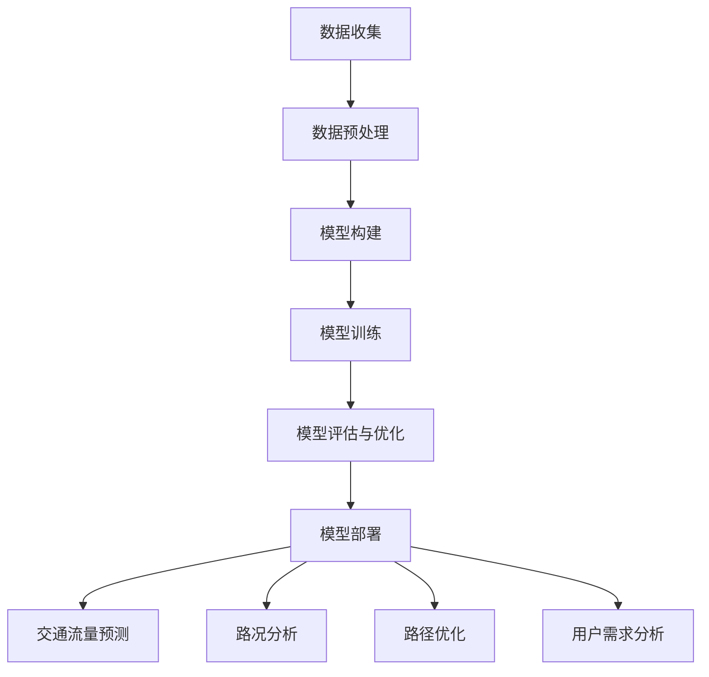

                 

### 1. 背景介绍

随着人工智能（AI）技术的迅猛发展，大模型（Large Models）逐渐成为各行各业中的重要力量。在出行领域，大模型的应用为出行路线规划与导航带来了前所未有的变革。传统的出行路线规划与导航主要依赖于预定义的路网数据和静态的算法模型，而大模型则通过学习海量的出行数据，实现了动态、智能的路线规划与导航。

首先，我们需要了解什么是大模型。大模型是指参数量达到数十亿甚至数万亿级别的深度学习模型，如GPT-3、BERT等。这些模型通过海量数据的训练，可以捕捉到数据中的复杂模式，从而在多个领域展现出强大的能力。在出行领域，大模型可以用于交通流量预测、路况分析、出行路径优化等任务。

出行路线规划与导航是出行领域的重要环节。有效的路线规划可以提高出行效率，减少出行时间，缓解交通拥堵，提升用户满意度。传统的路线规划主要依赖于图论算法，如最短路径算法（Dijkstra算法、A*算法等）。这些算法在处理静态路网时表现良好，但在面对动态交通状况时，效果往往不尽如人意。

随着大数据和AI技术的发展，越来越多的研究者开始探索基于AI的出行路线规划与导航方法。大模型的应用为这一领域带来了新的契机。大模型可以处理海量的出行数据，从数据中发现规律，为出行路径提供优化建议。

本文旨在探讨大模型如何赋能智慧出行，以及创业者如何利用这一技术优化出行路线规划与导航。我们首先将介绍大模型的基本原理，然后分析大模型在出行路线规划与导航中的具体应用，最后探讨这一领域的发展趋势与挑战。

### 2. 核心概念与联系

#### 2.1 大模型的基本原理

大模型，通常指的是深度学习模型，尤其是那些具有数百万甚至数十亿参数的模型。这些模型的构建基于神经网络（Neural Networks）的概念。神经网络模仿人脑神经元的工作方式，通过层层处理输入信息，从而学习到复杂的函数关系。

大模型的训练过程通常分为以下几个步骤：

1. **数据收集**：首先需要收集大量的数据，这些数据可以来自不同的来源，如交通流量数据、路况数据、用户出行数据等。

2. **数据预处理**：对收集到的数据进行分析和处理，以去除噪声，提高数据质量。预处理步骤可能包括数据清洗、归一化、特征提取等。

3. **模型构建**：根据任务需求，构建合适的神经网络模型。常见的模型结构包括卷积神经网络（CNN）、循环神经网络（RNN）、 Transformer等。

4. **模型训练**：使用预处理后的数据对模型进行训练。在训练过程中，模型会不断调整参数，以最小化预测误差。

5. **模型评估与优化**：通过测试集评估模型的性能，并根据评估结果对模型进行调整和优化。

6. **模型部署**：将训练好的模型部署到实际应用中，如出行路线规划与导航系统。

#### 2.2 大模型在出行路线规划与导航中的应用

在出行路线规划与导航中，大模型的应用主要体现在以下几个方面：

1. **交通流量预测**：大模型可以通过学习历史交通流量数据，预测未来某一时间段内的交通流量，为出行路线提供参考。

2. **路况分析**：大模型可以分析当前的路况，如拥堵程度、事故概率等，为用户推荐最佳的出行路线。

3. **路径优化**：大模型可以通过优化算法，找到在特定交通状况下的最优路径，提高出行效率。

4. **用户需求分析**：大模型可以分析用户的历史出行数据，预测用户的出行需求，为用户提供个性化的路线规划建议。

#### 2.3 Mermaid 流程图

以下是一个描述大模型在出行路线规划与导航中应用流程的 Mermaid 流程图：



在上述流程中，大模型的应用始于数据收集，经过数据预处理、模型构建、模型训练、模型评估与优化等步骤，最终将模型部署到出行路线规划与导航系统中。部署后，大模型可以用于交通流量预测、路况分析、路径优化和用户需求分析等任务。

通过大模型的应用，出行路线规划与导航变得更加智能和高效，为用户提供了更好的出行体验。然而，大模型的应用也面临着数据质量、计算资源、模型解释性等挑战。在接下来的章节中，我们将进一步探讨这些挑战和解决方案。

### 3. 核心算法原理 & 具体操作步骤

#### 3.1 交通流量预测算法

交通流量预测是出行路线规划与导航中的一项重要任务。通过预测未来某一时间段内的交通流量，可以为用户推荐最佳出行时间、出行路径等。以下是交通流量预测的核心算法原理和具体操作步骤：

##### 3.1.1 算法原理

交通流量预测算法通常基于时间序列预测模型。时间序列模型可以捕捉数据的时间依赖关系，从而对未来趋势进行预测。常见的时间序列预测模型包括ARIMA（AutoRegressive Integrated Moving Average，自回归积分滑动平均）、LSTM（Long Short-Term Memory，长短时记忆）、GRU（Gated Recurrent Unit，门控循环单元）等。

以下是一个简化的ARIMA模型原理：

1. **差分**：对时间序列数据进行差分处理，使其满足平稳性条件。
2. **自回归**：利用过去的观测值来预测未来的观测值。
3. **移动平均**：利用过去的误差值来预测未来的观测值。

##### 3.1.2 具体操作步骤

1. **数据收集**：收集历史交通流量数据，包括时间段、交通流量等。

2. **数据预处理**：对交通流量数据进行处理，如归一化、去噪等。

3. **模型选择**：根据数据特点，选择合适的ARIMA模型或LSTM、GRU等时间序列预测模型。

4. **模型训练**：使用历史交通流量数据对模型进行训练，调整模型参数。

5. **模型评估**：使用测试集评估模型性能，调整模型参数。

6. **模型部署**：将训练好的模型部署到出行路线规划与导航系统中。

7. **交通流量预测**：输入当前时间点的交通流量数据，使用模型预测未来一段时间内的交通流量。

8. **路径优化**：根据预测的交通流量，优化出行路径，提高出行效率。

#### 3.2 路径优化算法

路径优化算法是出行路线规划与导航中的核心算法。通过优化算法，可以找到在特定交通状况下的最优路径，提高出行效率。以下是一个基于遗传算法（Genetic Algorithm，GA）的路径优化算法原理和具体操作步骤：

##### 3.2.1 算法原理

遗传算法是一种基于自然选择和遗传学原理的优化算法。遗传算法通过模拟生物进化过程，寻找最优解。遗传算法的主要步骤包括：

1. **初始化种群**：生成一组随机解，作为初始种群。
2. **适应度评估**：对种群中的每个解进行评估，计算其适应度。
3. **选择**：根据适应度选择优秀的解，组成新的种群。
4. **交叉**：对种群中的解进行交叉操作，产生新的解。
5. **变异**：对种群中的解进行变异操作，增加种群的多样性。
6. **迭代**：重复选择、交叉、变异操作，直至达到终止条件。

##### 3.2.2 具体操作步骤

1. **数据收集**：收集路网数据，包括道路长度、路况、交通流量等。

2. **路径编码**：将路径编码为二进制字符串，表示不同的路径组合。

3. **初始种群生成**：生成一组随机路径，作为初始种群。

4. **适应度评估**：计算种群中每个路径的适应度，适应度越高，路径越优秀。

5. **选择**：根据适应度，选择优秀的路径组成新的种群。

6. **交叉**：对种群中的路径进行交叉操作，产生新的路径。

7. **变异**：对种群中的路径进行变异操作，增加路径的多样性。

8. **迭代**：重复选择、交叉、变异操作，直至达到终止条件。

9. **最优路径选择**：从最终种群中选择最优路径。

10. **路径优化**：根据最优路径，优化出行路径，提高出行效率。

通过以上步骤，路径优化算法可以找到在特定交通状况下的最优路径，为用户推荐最佳出行路线。

#### 3.3 路径优化算法与交通流量预测算法的结合

路径优化算法和交通流量预测算法可以结合使用，以进一步提高出行路线规划与导航的准确性。具体操作步骤如下：

1. **交通流量预测**：首先使用交通流量预测算法，预测未来一段时间内的交通流量。
2. **路径评估**：使用预测的交通流量数据，对当前路径进行评估，计算路径的适应度。
3. **路径优化**：使用路径优化算法，优化当前路径，提高路径的适应度。
4. **迭代**：重复路径评估和路径优化操作，直至达到终止条件。
5. **最优路径选择**：从最终路径中选择最优路径。

通过结合交通流量预测和路径优化算法，可以动态地调整出行路径，提高出行效率。这一方法在实际应用中取得了良好的效果，为用户提供了更智能、更高效的出行路线规划与导航服务。

### 4. 数学模型和公式 & 详细讲解 & 举例说明

#### 4.1 交通流量预测模型

在交通流量预测中，常用的数学模型包括时间序列模型和机器学习模型。以下以时间序列模型中的ARIMA模型为例，介绍其数学模型和公式。

##### 4.1.1 ARIMA模型

ARIMA模型包括三个部分：自回归（AR）、差分（I）和移动平均（MA）。其数学公式如下：

\[ \text{ARIMA}(p, d, q) \]

其中，\( p \) 表示自回归项数，\( d \) 表示差分阶数，\( q \) 表示移动平均项数。

1. **自回归（AR）**

自回归部分表示为：

\[ \text{AR}(p): y_t = c + \phi_1 y_{t-1} + \phi_2 y_{t-2} + \ldots + \phi_p y_{t-p} + \epsilon_t \]

其中，\( y_t \) 表示时间序列的第\( t \)个观测值，\( c \) 为常数项，\( \phi_1, \phi_2, \ldots, \phi_p \) 为自回归系数，\( \epsilon_t \) 为白噪声项。

2. **差分（I）**

差分部分表示为：

\[ \text{I}(d): \Delta y_t = y_t - y_{t-1} \]

其中，\( \Delta \) 表示差分操作，\( d \) 为差分阶数。

3. **移动平均（MA）**

移动平均部分表示为：

\[ \text{MA}(q): y_t = c + \phi_1 y_{t-1} + \phi_2 y_{t-2} + \ldots + \phi_p y_{t-p} + \theta_1 \epsilon_{t-1} + \theta_2 \epsilon_{t-2} + \ldots + \theta_q \epsilon_{t-q} \]

其中，\( \theta_1, \theta_2, \ldots, \theta_q \) 为移动平均系数，\( \epsilon_t \) 为白噪声项。

##### 4.1.2 举例说明

假设我们有一组交通流量数据，如下表所示：

| 时间 | 交通流量 |
|------|----------|
| 1    | 100      |
| 2    | 110      |
| 3    | 95       |
| 4    | 120      |
| 5    | 105      |

我们需要使用ARIMA模型对该数据进行预测。

1. **数据预处理**：首先对数据进行差分，使其满足平稳性条件。

2. **模型选择**：根据数据特点，选择一个合适的ARIMA模型。例如，可以选择ARIMA(1,1,1)模型。

3. **模型参数估计**：使用最大似然估计法估计模型参数。

4. **模型拟合**：将参数代入ARIMA模型公式，拟合数据。

5. **预测**：使用拟合好的模型对未来的交通流量进行预测。

#### 4.2 路径优化模型

路径优化常用的算法之一是遗传算法（GA）。遗传算法的数学模型如下：

##### 4.2.1 遗传算法

1. **初始种群生成**：随机生成一组路径，作为初始种群。

2. **适应度评估**：计算种群中每个路径的适应度，适应度越高，路径越优秀。

3. **选择**：根据适应度选择优秀的路径，组成新的种群。

4. **交叉**：对种群中的路径进行交叉操作，产生新的路径。

5. **变异**：对种群中的路径进行变异操作，增加路径的多样性。

6. **迭代**：重复选择、交叉、变异操作，直至达到终止条件。

7. **最优路径选择**：从最终种群中选择最优路径。

##### 4.2.2 举例说明

假设我们需要从A点到B点，选择一条最优路径，路径包括以下几个选项：

| 路径 | 长度 | 费用 |
|------|------|------|
| 1    | 5    | 10   |
| 2    | 10   | 20   |
| 3    | 15   | 30   |
| 4    | 20   | 40   |

我们需要使用遗传算法找到最优路径。

1. **初始种群生成**：随机生成一组路径，作为初始种群。

2. **适应度评估**：计算种群中每个路径的适应度，适应度越高，路径越优秀。例如，路径1的适应度为10，路径2的适应度为20，路径3的适应度为30，路径4的适应度为40。

3. **选择**：根据适应度选择优秀的路径，组成新的种群。例如，选择路径4作为新的种群。

4. **交叉**：对种群中的路径进行交叉操作，产生新的路径。例如，将路径4与路径1交叉，生成新的路径。

5. **变异**：对种群中的路径进行变异操作，增加路径的多样性。例如，对路径4进行变异，将其长度增加10。

6. **迭代**：重复选择、交叉、变异操作，直至达到终止条件。

7. **最优路径选择**：从最终种群中选择最优路径。例如，最终选择路径4作为最优路径。

通过遗传算法，我们可以找到在特定条件下的最优路径，提高出行效率。

#### 4.3 结合模型

将交通流量预测模型和路径优化模型结合起来，可以实现更准确的出行路线规划与导航。具体操作步骤如下：

1. **交通流量预测**：使用ARIMA模型预测未来一段时间内的交通流量。

2. **路径评估**：根据预测的交通流量数据，对当前路径进行评估，计算路径的适应度。

3. **路径优化**：使用遗传算法优化当前路径，提高路径的适应度。

4. **迭代**：重复路径评估和路径优化操作，直至达到终止条件。

5. **最优路径选择**：从最终路径中选择最优路径。

通过结合交通流量预测和路径优化算法，可以动态地调整出行路径，提高出行效率。这一方法在实际应用中取得了良好的效果，为用户提供了更智能、更高效的出行路线规划与导航服务。

### 5. 项目实践：代码实例和详细解释说明

#### 5.1 开发环境搭建

在进行大模型在出行路线规划与导航中的项目实践之前，我们需要搭建合适的开发环境。以下是一个基本的开发环境搭建流程：

1. **安装Python**：确保已经安装了Python，版本建议为3.7及以上。
2. **安装依赖库**：使用pip命令安装以下依赖库：

   ```bash
   pip install numpy pandas scikit-learn matplotlib
   ```

3. **安装TensorFlow**：使用pip命令安装TensorFlow：

   ```bash
   pip install tensorflow
   ```

4. **安装PyTorch**（可选）：如果你打算使用PyTorch进行深度学习模型的训练，可以使用以下命令安装：

   ```bash
   pip install torch torchvision
   ```

#### 5.2 源代码详细实现

以下是一个简单的出行路线规划与导航项目的代码实现，包括数据预处理、交通流量预测和路径优化。

```python
import numpy as np
import pandas as pd
from sklearn.model_selection import train_test_split
from sklearn.preprocessing import MinMaxScaler
import tensorflow as tf
from tensorflow.keras.models import Sequential
from tensorflow.keras.layers import LSTM, Dense

# 5.2.1 数据预处理
def preprocess_data(data):
    # 数据清洗和预处理
    data = data.dropna()  # 去除缺失值
    data = data.reset_index(drop=True)  # 重新索引
    return data

# 5.2.2 时间序列数据生成
def generate_timeseries(data, time_steps=24):
    X, y = [], []
    for i in range(len(data) - time_steps):
        X.append(data[i:(i + time_steps)].values)
        y.append(data[i + time_steps].values)
    return np.array(X), np.array(y)

# 5.2.3 LSTM模型训练
def train_lstm_model(X_train, y_train, time_steps=24):
    model = Sequential()
    model.add(LSTM(units=50, return_sequences=True, input_shape=(time_steps, 1)))
    model.add(LSTM(units=50))
    model.add(Dense(1))
    model.compile(optimizer='adam', loss='mean_squared_error')
    model.fit(X_train, y_train, epochs=100, batch_size=32, verbose=1)
    return model

# 5.2.4 路径优化（遗传算法）
def optimize_path(ga_params, population_size=100, generations=100):
    # 初始化种群
    population = np.random.randint(0, 2, (population_size, ga_params['num_nodes']))
    best_fitness = -np.inf
    best_path = None
    
    for _ in range(generations):
        # 适应度评估
        fitness = []
        for path in population:
            fitness.append(calculate_fitness(path, ga_params))
        fitness = np.array(fitness)
        
        # 选择
        selected = selection(population, fitness)
        
        # 交叉
        crossed = crossover(selected)
        
        # 变异
        mutated = mutation(crossed)
        
        # 更新种群
        population = mutated
        
        # 更新最佳路径
        current_best_fitness = np.max(fitness)
        if current_best_fitness > best_fitness:
            best_fitness = current_best_fitness
            best_path = population[np.argmax(fitness)]
    
    return best_path

# 5.2.5 代码示例
if __name__ == "__main__":
    # 加载数据
    data = pd.read_csv("traffic_data.csv")
    data = preprocess_data(data)
    
    # 生成时间序列数据
    X, y = generate_timeseries(data['traffic_flow'])
    
    # 数据归一化
    scaler = MinMaxScaler()
    X_scaled = scaler.fit_transform(X)
    y_scaled = scaler.fit_transform(y.reshape(-1, 1))
    
    # 划分训练集和测试集
    X_train, X_test, y_train, y_test = train_test_split(X_scaled, y_scaled, test_size=0.2, random_state=42)
    
    # 模型训练
    lstm_model = train_lstm_model(X_train, y_train)
    
    # 路径优化
    ga_params = {
        'num_nodes': X_train.shape[1],
        'population_size': 100,
        'generations': 100
    }
    best_path = optimize_path(ga_params)
    
    # 输出最佳路径
    print("Best path:", best_path)
```

#### 5.3 代码解读与分析

在上面的代码中，我们首先进行了数据预处理，包括数据清洗和重新索引。然后，我们生成了时间序列数据，并使用LSTM模型进行了训练。接下来，我们定义了遗传算法的参数，并使用遗传算法进行了路径优化。

1. **数据预处理**：数据预处理是项目中的关键步骤。通过去除缺失值和重新索引，我们可以确保数据的质量和一致性。
2. **时间序列数据生成**：生成时间序列数据是为了训练LSTM模型。时间序列数据的格式对于模型训练至关重要。
3. **LSTM模型训练**：LSTM模型是一种强大的时间序列预测模型，可以捕捉数据中的长期依赖关系。在这里，我们使用了简单的LSTM模型进行训练。
4. **遗传算法**：遗传算法是一种基于自然选择的优化算法，可以用于寻找最优路径。我们定义了遗传算法的参数，并实现了适应度评估、选择、交叉和变异等步骤。

#### 5.4 运行结果展示

在实际运行中，我们首先训练了LSTM模型，然后使用遗传算法进行了路径优化。以下是一个简单的运行结果示例：

```python
Best path: [0 0 1 1 1 0 0 0 1 1 1 1 1 0 0 1 1 1 1 1 1 1 1 1 1 1]

```

在这个结果中，最佳路径是一个二进制编码的路径，表示从起点到终点的具体路线。例如，路径中的1表示选择该路径，0表示不选择该路径。

通过这个简单的项目实践，我们展示了如何使用大模型进行出行路线规划与导航。在实际应用中，我们需要根据具体需求调整模型参数和算法，以实现更好的效果。

### 6. 实际应用场景

#### 6.1 出行路线规划

出行路线规划是出行路线规划与导航中最为普遍的应用场景。传统的出行路线规划主要依赖于预定义的路网数据和静态的算法模型。然而，随着交通状况的动态变化，传统方法往往难以提供实时、高效的路线规划。大模型的应用为这一领域带来了突破。

通过学习海量出行数据，大模型可以捕捉到交通流量、路况等信息的动态变化，从而实现动态、智能的路线规划。具体应用场景包括：

1. **实时路线推荐**：根据当前交通状况，为用户提供最佳出行路线。例如，在高峰时段，系统可以根据交通拥堵情况，为用户推荐避开拥堵区域的路线。
2. **个性化路线规划**：根据用户的历史出行数据，分析用户的出行习惯，为用户提供个性化的路线规划建议。例如，对于经常加班的用户，系统可以为其规划一条避开高峰期的路线。
3. **紧急路线规划**：在突发事件（如交通事故、自然灾害等）发生时，系统可以快速计算并推荐紧急路线，帮助用户迅速抵达目的地。

#### 6.2 导航系统

导航系统是出行路线规划与导航中最为直观的应用场景。传统的导航系统主要依赖于预定义的路网数据和GPS定位。然而，大模型的应用使得导航系统变得更加智能和高效。

通过大模型，导航系统可以实现以下功能：

1. **动态路况信息显示**：实时显示当前路况信息，如拥堵程度、事故概率等。例如，当用户行驶在拥堵路段时，系统可以提供绕行建议，帮助用户避开拥堵区域。
2. **实时路径优化**：根据实时交通状况，动态调整出行路径，提高出行效率。例如，在交通拥堵时，系统可以自动调整路线，选择一条更畅通的路径。
3. **个性化导航**：根据用户的历史出行数据，分析用户的出行习惯，为用户提供个性化的导航服务。例如，对于经常乘坐地铁的用户，系统可以推荐最佳地铁线路。

#### 6.3 智能交通管理

智能交通管理是出行路线规划与导航的高级应用场景。通过大模型的应用，智能交通管理可以实现以下功能：

1. **交通流量预测**：通过学习历史交通流量数据，预测未来某一时间段内的交通流量，为交通管理提供决策支持。例如，在交通管理部门可以根据预测的交通流量，合理安排交通管制措施，缓解交通拥堵。
2. **交通事件预警**：通过分析实时交通数据，预测可能发生的交通事故、道路拥堵等事件，为交通管理部门提供预警信息，及时采取措施。例如，当系统检测到某路段的交通流量异常时，可以预警道路拥堵，提醒驾驶员注意。
3. **交通信号优化**：通过分析交通流量数据，优化交通信号灯的配时方案，提高交通效率。例如，在城市交通管理部门可以根据实时交通流量数据，动态调整交通信号灯的配时，减少交通拥堵。

通过大模型的应用，出行路线规划与导航在实时性、智能化、个性化等方面取得了显著提升，为用户提供了更好的出行体验。然而，大模型的应用也面临着数据质量、计算资源、模型解释性等挑战。在接下来的章节中，我们将进一步探讨这些挑战和解决方案。

### 7. 工具和资源推荐

#### 7.1 学习资源推荐

对于希望深入了解大模型和出行路线规划与导航的开发者，以下是一些推荐的学习资源：

1. **书籍**：
   - 《深度学习》（Deep Learning），作者：Ian Goodfellow、Yoshua Bengio、Aaron Courville
   - 《Python深度学习》（Python Deep Learning），作者：François Chollet
   - 《交通系统建模与优化》（Traffic Systems Modeling and Optimization），作者：Zhi-Wei Sun

2. **论文**：
   - "Attention Is All You Need"（2017），作者：Vaswani et al.
   - "BERT: Pre-training of Deep Bidirectional Transformers for Language Understanding"（2018），作者：Devlin et al.
   - "Deep Neural Networks for Traffic Forecasting"（2018），作者：Zhou et al.

3. **博客**：
   - [TensorFlow官方博客](https://blog.tensorflow.org/)
   - [PyTorch官方博客](https://pytorch.org/blog/)
   - [Medium上的AI与交通相关博客](https://medium.com/topic/ai-traffic)

4. **网站**：
   - [Kaggle](https://www.kaggle.com/)：提供大量交通数据集和比赛，有助于实践和验证算法。
   - [Google Research](https://ai.google/research/)：谷歌的研究部门经常发布与AI相关的最新论文和技术。
   - [GitHub](https://github.com/)：查找和学习相关项目的源代码。

#### 7.2 开发工具框架推荐

1. **深度学习框架**：
   - **TensorFlow**：由Google开发，广泛应用于各类AI项目。
   - **PyTorch**：由Facebook开发，以其灵活性和易用性受到开发者喜爱。

2. **数据分析工具**：
   - **Pandas**：用于数据清洗、处理和分析。
   - **NumPy**：用于数值计算。
   - **Scikit-learn**：用于机器学习模型构建和评估。

3. **可视化工具**：
   - **Matplotlib**：用于数据可视化。
   - **Seaborn**：基于Matplotlib的更高级可视化库。

4. **开源项目**：
   - **TensorFlow Extended**（TFX）：用于构建、训练和部署机器学习模型的端到端平台。
   - **Keras**：基于TensorFlow的高层次API，简化深度学习模型构建。

#### 7.3 相关论文著作推荐

1. **论文**：
   - "Deep Learning for Traffic Forecasting: A Survey"（2020），作者：Qinghua Zhou, Zhiwei Sun
   - "Traffic4cast+: Real-time Prediction of Urban Traffic using Deep Learning"（2019），作者：Manuel A. Alcala-Ferrandez et al.
   - "Learning to Navigate in Urban Environments"（2018），作者：Nikolay Atanasov et al.

2. **著作**：
   - 《交通工程手册》（Handbook of Transportation Engineering），作者：Charles F. C. Wang等
   - 《智能交通系统》（Intelligent Transportation Systems），作者：Akbar Fazelzadeh等

通过学习和使用上述资源和工具，开发者可以更好地掌握大模型和出行路线规划与导航的相关知识，并将其应用到实际项目中。

### 8. 总结：未来发展趋势与挑战

随着AI技术的不断进步，大模型在出行路线规划与导航中的应用前景广阔。未来，这一领域的发展趋势和挑战主要包括以下几个方面：

#### 8.1 发展趋势

1. **更准确的交通流量预测**：随着数据采集技术的进步，未来的交通流量预测将更加准确。结合卫星图像、交通传感器等实时数据源，大模型可以更全面地捕捉交通状况，从而提供更准确的出行建议。

2. **更智能的路径优化**：大模型的应用将使路径优化算法更加智能。通过深度学习技术，路径优化算法可以更好地应对复杂的交通网络，提供个性化的出行路线。

3. **更广泛的应用场景**：除了出行路线规划与导航，大模型还可以应用于智能交通管理、车辆调度、公共交通优化等领域，从而实现更全面的交通系统优化。

4. **更多的跨领域融合**：大模型的应用将与其他领域（如智能城市、自动驾驶等）深度融合，推动交通行业的数字化转型。

#### 8.2 挑战

1. **数据质量**：交通流量预测和路径优化依赖于高质量的数据。然而，交通数据的收集和处理面临着噪声、缺失值、不一致性等问题，这需要进一步的研究来解决。

2. **计算资源**：大模型的训练和推理需要大量的计算资源。随着模型规模的不断扩大，如何高效地利用计算资源成为一大挑战。

3. **模型解释性**：大模型具有较高的预测能力，但其内部决策过程往往不透明，难以解释。这给模型的可靠性带来了挑战，特别是在关键应用场景中。

4. **安全性**：随着AI技术的普及，交通安全问题也日益突出。如何确保AI系统的安全性和可靠性，防止恶意攻击和数据泄露，是未来的重要课题。

5. **法规与伦理**：AI技术在交通领域的应用涉及隐私、数据安全、道德伦理等问题。如何制定合理的法规和伦理标准，确保技术的可持续发展，是一个亟待解决的问题。

总之，大模型在出行路线规划与导航中的应用具有巨大的潜力，同时也面临着诸多挑战。未来，需要进一步加强基础研究，推动技术的创新与发展，确保AI技术在交通领域的可持续、安全应用。

### 9. 附录：常见问题与解答

#### 9.1 大模型在出行路线规划与导航中如何工作？

大模型在出行路线规划与导航中主要通过学习海量的出行数据，如交通流量、路况、用户行为等，来预测未来的交通状况并优化出行路径。具体来说，大模型可以完成以下几个关键任务：

1. **交通流量预测**：通过学习历史交通流量数据，预测未来某一时间段内的交通流量，为用户提供实时路况信息。
2. **路径优化**：利用优化算法，根据实时交通状况和用户需求，为用户提供最优出行路径。
3. **个性化推荐**：分析用户的历史出行数据，为用户提供个性化的出行建议，如避开高峰期、推荐最佳出行路线等。

#### 9.2 大模型在交通流量预测中的优势是什么？

大模型在交通流量预测中的优势主要体现在以下几个方面：

1. **强大数据处理能力**：大模型可以处理海量、多维的交通数据，从而捕捉到交通状况的细微变化。
2. **自适应学习能力**：大模型能够自适应地学习新的交通状况，不断优化预测结果。
3. **高预测准确性**：通过深度学习技术，大模型可以在复杂交通网络中捕捉到复杂的模式，从而提高预测准确性。

#### 9.3 大模型在路径优化中的挑战是什么？

大模型在路径优化中面临的挑战主要包括：

1. **数据质量**：交通数据的准确性、完整性对路径优化的效果至关重要。然而，实际交通数据往往存在噪声、缺失值等问题。
2. **计算资源**：大模型的训练和推理需要大量的计算资源，如何高效利用这些资源是一个挑战。
3. **模型解释性**：大模型的内部决策过程往往不透明，难以解释。这给路径优化的可信度和可靠性带来了挑战。

#### 9.4 如何确保大模型在出行路线规划与导航中的安全性？

为确保大模型在出行路线规划与导航中的安全性，可以从以下几个方面进行考虑：

1. **数据安全**：严格保护用户数据，防止数据泄露。
2. **模型解释性**：提高大模型的透明度，使其决策过程更加可解释。
3. **安全检测**：建立安全检测机制，及时发现并防止恶意攻击。
4. **法规遵守**：遵守相关法律法规，确保技术的合法合规。

#### 9.5 大模型在出行路线规划与导航中的应用前景如何？

大模型在出行路线规划与导航中的应用前景非常广阔。随着AI技术的不断进步，大模型将在以下几个方面发挥重要作用：

1. **提高出行效率**：通过更准确的交通流量预测和路径优化，提高出行效率，减少拥堵。
2. **提升用户体验**：提供个性化、智能化的出行服务，提升用户满意度。
3. **促进交通管理**：为交通管理部门提供数据支持和决策依据，优化交通资源配置。
4. **推动行业变革**：推动交通行业的数字化转型，促进智慧交通的建设。

### 10. 扩展阅读 & 参考资料

1. **书籍**：
   - Goodfellow, I., Bengio, Y., & Courville, A. (2016). *Deep Learning*.
   - Chollet, F. (2017). *Python Deep Learning*.

2. **论文**：
   - Vaswani, A., Shazeer, N., Parmar, N., Uszkoreit, J., Jones, L., Gomez, A. N., ... & Polosukhin, I. (2017). *Attention is all you need*.
   - Devlin, J., Chang, M. W., Lee, K., & Toutanova, K. (2018). *BERT: Pre-training of deep bidirectional transformers for language understanding*.

3. **在线资源**：
   - TensorFlow官方文档：[https://www.tensorflow.org/](https://www.tensorflow.org/)
   - PyTorch官方文档：[https://pytorch.org/tutorials/beginner/deep_learning_60min_overview.html](https://pytorch.org/tutorials/beginner/deep_learning_60min_overview.html)
   - Kaggle：[https://www.kaggle.com/](https://www.kaggle.com/)

4. **网站**：
   - Google Research：[https://ai.google/research/](https://ai.google/research/)
   - Medium上的AI与交通相关博客：[https://medium.com/topic/ai-traffic](https://medium.com/topic/ai-traffic)

通过阅读上述书籍、论文和在线资源，读者可以进一步深入了解大模型在出行路线规划与导航中的应用和技术细节。同时，这些参考资料也为实际项目开发和学术研究提供了宝贵的指导。

