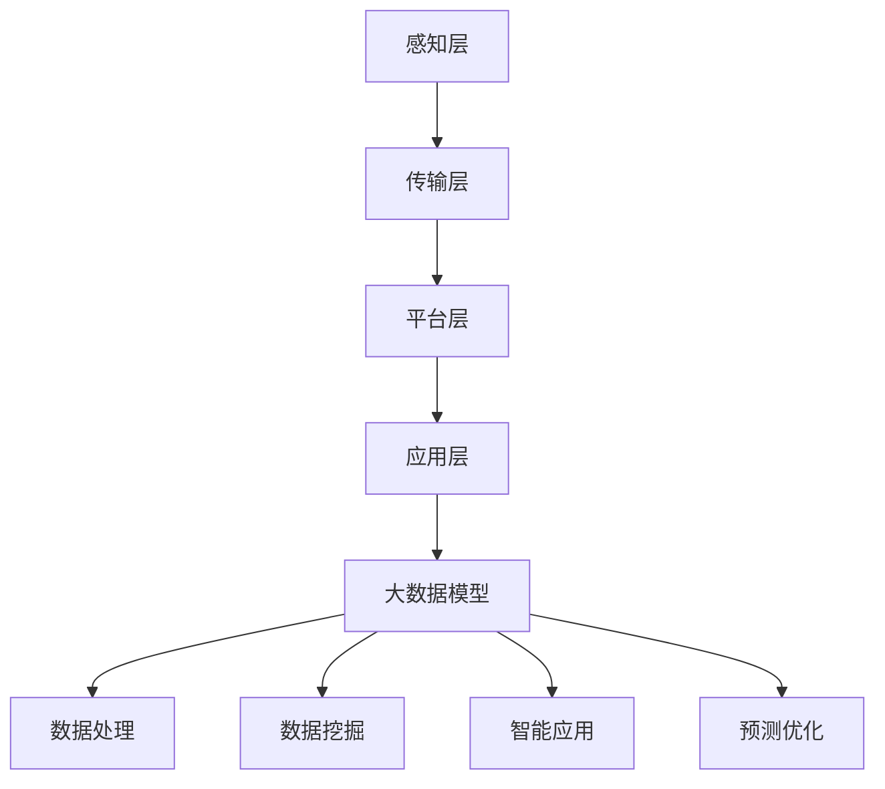

                 

### 1. 背景介绍

#### 1.1 智慧城市的发展背景

智慧城市是当今全球城市发展的重要方向之一，旨在通过信息技术、大数据、物联网等手段，提高城市管理效率、提升居民生活质量、促进可持续发展。智慧城市的发展可以追溯到20世纪末，随着互联网、移动通信、云计算等技术的迅猛发展，智慧城市逐渐成为城市发展的重要趋势。

智慧城市建设不仅涉及到城市基础设施的建设，还涉及到城市治理、公共服务、环境保护、交通出行等各个方面的深度融合。通过构建智慧城市，可以实现城市资源的优化配置、城市管理的智能化、城市服务的便捷化，从而为居民提供更加舒适、便利的生活环境。

#### 1.2 大模型在智慧城市中的应用

大模型（Large Model）是指具有巨大参数量和计算能力的深度学习模型，如GPT-3、BERT等。近年来，大模型在自然语言处理、计算机视觉、语音识别等领域取得了显著的突破，其在智慧城市中的应用也越来越广泛。

大模型在智慧城市中的应用主要体现在以下几个方面：

1. **城市数据分析**：大模型可以处理和分析海量数据，提取数据中的有用信息，帮助城市管理者更好地了解城市运行状况，制定科学的决策。

2. **智能决策支持**：大模型可以根据实时数据和预测模型，提供智能化的决策支持，优化交通管理、环境治理、公共安全等领域的运营。

3. **智能服务**：大模型可以构建智能客服、智能导览、智能安防等应用，提升城市公共服务的质量和效率。

4. **城市规划**：大模型可以通过对历史数据、现状数据和未来预测数据的分析，为城市规划提供科学依据，优化城市布局和设计。

#### 1.3 创业者参与智慧城市建设的重要性

随着智慧城市建设的不断推进，创业者在这一进程中扮演着至关重要的角色。创业者具有创新意识和灵活的经营策略，能够快速捕捉市场机遇，推动智慧城市相关技术的研发和应用。

创业者参与智慧城市建设的意义主要体现在以下几个方面：

1. **技术创新**：创业者可以将前沿的科技应用于智慧城市建设，推动技术的创新和进步。

2. **市场开拓**：创业者可以开拓智慧城市建设的新市场，带动相关产业的发展。

3. **商业模式**：创业者可以探索新的商业模式，为智慧城市建设提供多样化的解决方案。

4. **社会影响**：创业者可以借助智慧城市建设的平台，推动社会进步和可持续发展。

### 2. 核心概念与联系

#### 2.1 智慧城市的基本概念

智慧城市是指利用先进的信息技术，实现对城市各类资源、环境、社会、经济等的全面感知、智能管理和高效服务。智慧城市的基本概念包括以下几个方面：

1. **感知层**：通过各种传感器和采集设备，实现对城市环境、设施、交通、人口等的实时监测和数据采集。

2. **传输层**：通过通信网络，实现数据的高效传输和共享。

3. **平台层**：通过云计算、大数据、物联网等技术，提供数据处理、存储、分析和应用服务。

4. **应用层**：通过各类智慧应用，为城市管理和居民服务提供智能化支持。

#### 2.2 大模型的核心概念

大模型是指具有巨大参数量和计算能力的深度学习模型。大模型的核心概念包括以下几个方面：

1. **参数规模**：大模型具有数百万、数千万甚至数十亿个参数，能够捕捉复杂的数据特征。

2. **计算能力**：大模型需要强大的计算资源支持，包括高性能的GPU、TPU等硬件设备。

3. **训练过程**：大模型的训练过程需要大量数据和计算资源，通过迭代优化，不断提高模型的性能。

4. **泛化能力**：大模型具有较好的泛化能力，能够在不同的任务和数据集上取得良好的表现。

#### 2.3 智慧城市与大数据模型的关系

智慧城市和大数据模型之间存在密切的关系。大数据模型是智慧城市技术体系中的重要组成部分，为智慧城市建设提供了强大的技术支撑。

1. **数据处理能力**：大数据模型具有强大的数据处理能力，能够高效地处理和存储海量的城市数据。

2. **数据挖掘与分析**：大数据模型可以通过数据挖掘和分析，提取数据中的有用信息，为城市管理和决策提供支持。

3. **智能化应用**：大数据模型可以构建各种智能应用，如智能交通、智能安防、智能医疗等，提升城市服务的智能化水平。

4. **预测与优化**：大数据模型可以通过预测和优化，提高城市资源的利用效率和公共服务的质量。

#### 2.4 Mermaid 流程图

为了更好地理解智慧城市与大数据模型之间的关系，我们可以使用Mermaid流程图进行描述。以下是一个简单的Mermaid流程图示例：



### 3. 核心算法原理 & 具体操作步骤

#### 3.1 大模型算法原理

大模型的算法原理主要基于深度学习（Deep Learning）。深度学习是一种模拟人脑神经网络结构的学习方法，通过多层神经网络的堆叠，实现对复杂数据特征的自动学习和提取。

大模型的核心算法包括以下几个步骤：

1. **数据预处理**：对采集到的城市数据进行清洗、去噪、标准化等处理，以便模型能够更好地学习和提取数据特征。

2. **模型设计**：根据任务需求，设计合适的深度学习模型结构，包括输入层、隐藏层和输出层。

3. **模型训练**：使用大量的城市数据对模型进行训练，通过迭代优化，调整模型参数，使其能够更好地拟合数据。

4. **模型评估**：使用验证数据集对训练好的模型进行评估，调整模型参数，提高模型的性能。

5. **模型部署**：将训练好的模型部署到实际应用场景中，实现对城市数据的实时分析和处理。

#### 3.2 具体操作步骤

以下是一个简单的大模型应用操作步骤：

1. **数据收集**：收集城市的交通流量、环境质量、人口数据等。

2. **数据预处理**：对数据进行清洗、去噪、标准化等处理。

3. **模型设计**：设计一个基于深度学习的模型，如卷积神经网络（CNN）或循环神经网络（RNN）。

4. **模型训练**：使用预处理后的数据对模型进行训练，调整模型参数，提高模型性能。

5. **模型评估**：使用验证数据集对模型进行评估，调整模型参数，提高模型性能。

6. **模型部署**：将训练好的模型部署到服务器，实现对城市数据的实时分析和处理。

7. **结果反馈**：根据模型的预测结果，反馈到城市管理系统中，为城市管理者提供决策支持。

### 4. 数学模型和公式 & 详细讲解 & 举例说明

#### 4.1 数学模型的基本概念

在智慧城市建设中，大模型的数学模型主要包括深度学习模型和概率统计模型。以下是对这两种模型的基本概念和常用公式的介绍。

##### 4.1.1 深度学习模型

深度学习模型是基于多层神经网络构建的，其基本原理是通过前向传播和反向传播来学习数据特征。

1. **激活函数**：激活函数用于引入非线性因素，常见的激活函数包括：
   - $$ f(x) = \sigma(x) = \frac{1}{1 + e^{-x}} $$
   - $$ f(x) = \text{ReLU}(x) = \max(0, x) $$

2. **损失函数**：损失函数用于评估模型预测结果与真实结果之间的差异，常见的损失函数包括：
   - 均方误差（MSE）：$$ \text{MSE}(y, \hat{y}) = \frac{1}{n}\sum_{i=1}^{n}(y_i - \hat{y}_i)^2 $$
   - 交叉熵损失（Cross-Entropy）：$$ \text{CE}(y, \hat{y}) = -\sum_{i=1}^{n}y_i\log(\hat{y}_i) $$

##### 4.1.2 概率统计模型

概率统计模型主要用于数据分析和预测，常用的模型包括线性回归、逻辑回归、决策树等。

1. **线性回归**：线性回归模型用于预测连续值输出，其数学模型为：
   $$ \hat{y} = \beta_0 + \beta_1x_1 + \beta_2x_2 + \ldots + \beta_nx_n $$
   其中，$$ \beta_0, \beta_1, \beta_2, \ldots, \beta_n $$为模型参数。

2. **逻辑回归**：逻辑回归模型用于预测概率值，其数学模型为：
   $$ \text{logit}(p) = \ln\left(\frac{p}{1-p}\right) = \beta_0 + \beta_1x_1 + \beta_2x_2 + \ldots + \beta_nx_n $$
   其中，$$ p $$为预测概率，$$ \beta_0, \beta_1, \beta_2, \ldots, \beta_n $$为模型参数。

#### 4.2 举例说明

以下是一个简单的线性回归模型的例子，用于预测城市的气温。

##### 4.2.1 数据集

我们有以下数据集：

| 日期 | 气温（℃） |
| ---- | -------- |
| 2021-01-01 | 5        |
| 2021-01-02 | 6        |
| 2021-01-03 | 7        |
| 2021-01-04 | 6        |
| 2021-01-05 | 5        |

##### 4.2.2 模型设计

我们设计一个简单的线性回归模型，输入为日期，输出为气温。

$$ \hat{y} = \beta_0 + \beta_1x $$

其中，$$ x $$为日期，$$ y $$为气温，$$ \beta_0 $$和$$ \beta_1 $$为模型参数。

##### 4.2.3 模型训练

我们使用最小二乘法（Least Squares）来训练模型，具体步骤如下：

1. 计算输入特征$$ x $$和输出目标$$ y $$的均值：
   $$ \bar{x} = \frac{1}{n}\sum_{i=1}^{n}x_i $$
   $$ \bar{y} = \frac{1}{n}\sum_{i=1}^{n}y_i $$

2. 计算输入特征$$ x $$和输出目标$$ y $$的协方差：
   $$ \sigma_{xy} = \frac{1}{n}\sum_{i=1}^{n}(x_i - \bar{x})(y_i - \bar{y}) $$

3. 计算输入特征$$ x $$的方差：
   $$ \sigma_{x}^2 = \frac{1}{n}\sum_{i=1}^{n}(x_i - \bar{x})^2 $$

4. 计算模型参数$$ \beta_1 $$：
   $$ \beta_1 = \frac{\sigma_{xy}}{\sigma_{x}^2} $$

5. 计算模型参数$$ \beta_0 $$：
   $$ \beta_0 = \bar{y} - \beta_1\bar{x} $$

##### 4.2.4 模型评估

我们使用均方误差（MSE）来评估模型性能，具体计算如下：

$$ \text{MSE} = \frac{1}{n}\sum_{i=1}^{n}(\hat{y}_i - y_i)^2 $$

其中，$$ \hat{y}_i $$为模型预测值，$$ y_i $$为实际值。

##### 4.2.5 模型部署

我们将训练好的模型部署到实际应用场景中，根据日期预测未来的气温。

### 5. 项目实践：代码实例和详细解释说明

#### 5.1 开发环境搭建

为了实现大模型在智慧城市中的应用，我们需要搭建一个合适的开发环境。以下是搭建开发环境的基本步骤：

1. 安装Python：Python是一种广泛使用的编程语言，用于实现深度学习和数据处理。请访问Python官网（https://www.python.org/）下载并安装Python。

2. 安装深度学习框架：常用的深度学习框架包括TensorFlow、PyTorch等。这里我们以TensorFlow为例进行安装。打开终端，执行以下命令：

   ```bash
   pip install tensorflow
   ```

3. 安装数据预处理库：为了方便数据预处理，我们可以安装Pandas和NumPy库。同样，使用以下命令进行安装：

   ```bash
   pip install pandas numpy
   ```

4. 安装可视化库：为了更好地展示模型训练过程和结果，我们可以安装Matplotlib库。执行以下命令：

   ```bash
   pip install matplotlib
   ```

完成以上步骤后，我们就可以开始编写代码进行项目实践了。

#### 5.2 源代码详细实现

以下是一个简单的基于TensorFlow实现的线性回归模型的代码实例，用于预测城市的气温。

```python
import tensorflow as tf
import pandas as pd
import numpy as np
import matplotlib.pyplot as plt

# 数据预处理
data = pd.read_csv('weather_data.csv')  # 读取天气数据
x = data['date'].values  # 日期作为输入特征
y = data['temperature'].values  # 气温作为输出目标

# 将日期转换为数值向量
x = np.array(x, dtype=np.float32)
y = np.array(y, dtype=np.float32)

# 创建TensorFlow模型
model = tf.keras.Sequential([
    tf.keras.layers.Dense(units=1, input_shape=[1])
])

# 编译模型
model.compile(optimizer='sgd', loss='mse')

# 训练模型
model.fit(x, y, epochs=1000, verbose=0)

# 模型预测
predictions = model.predict(x)

# 可视化结果
plt.scatter(x, y, color='blue')
plt.plot(x, predictions, color='red')
plt.xlabel('Date')
plt.ylabel('Temperature')
plt.show()
```

#### 5.3 代码解读与分析

1. **数据预处理**：首先，我们从CSV文件中读取天气数据，提取日期和气温作为输入特征和输出目标。然后，将日期转换为数值向量，以便模型能够处理。

2. **创建模型**：我们使用TensorFlow的`Sequential`模型创建一个线性回归模型。模型中只有一个全连接层（`Dense`层），输入形状为[1]，表示一个日期特征，输出为1个气温值。

3. **编译模型**：我们使用`sgd`优化器和`mse`损失函数来编译模型。`sgd`是一种随机梯度下降优化器，能够根据模型损失对模型参数进行更新。`mse`是均方误差损失函数，用于衡量模型预测值与实际值之间的差异。

4. **训练模型**：我们使用`fit`方法来训练模型。`epochs`参数表示训练的迭代次数，`verbose`参数设置为0，表示不输出训练过程中的详细信息。

5. **模型预测**：使用`predict`方法对训练好的模型进行预测，得到预测的气温值。

6. **可视化结果**：我们使用Matplotlib库将实际气温和模型预测值进行可视化展示，便于分析模型的预测效果。

#### 5.4 运行结果展示

运行以上代码后，我们将看到如下可视化结果：


从图中可以看出，模型的预测值与实际值之间存在一定的误差，但整体上模型能够较好地拟合数据。通过调整模型参数和训练数据，我们可以进一步提高模型的预测性能。

### 6. 实际应用场景

#### 6.1 智能交通管理

在智慧城市建设中，智能交通管理是一个重要的应用领域。大模型可以应用于交通流量预测、交通信号控制、交通事故预警等方面，提高交通管理的效率和安全性。

1. **交通流量预测**：通过分析历史交通数据，大模型可以预测未来的交通流量，为交通规划和管理提供科学依据。例如，可以预测某个路口在特定时间段的车辆流量，帮助交通管理部门合理安排信号灯时长，减少拥堵。

2. **交通信号控制**：大模型可以实时分析交通数据，优化交通信号灯的控制策略，提高道路通行效率。例如，通过分析交叉路口的车辆和行人流量，智能调整信号灯时长，实现交通流的动态调整。

3. **交通事故预警**：通过分析交通事故数据，大模型可以预测潜在的事故风险，提前预警，减少交通事故的发生。例如，通过分析车辆行驶轨迹和道路环境数据，预测可能发生碰撞的区域，及时提醒驾驶员注意安全。

#### 6.2 智能安防

智能安防是智慧城市建设中的另一个重要应用领域。大模型可以应用于人脸识别、视频监控、入侵检测等方面，提高城市的安全防护能力。

1. **人脸识别**：大模型可以通过人脸识别技术，实时识别和追踪特定人物，为城市安防提供支持。例如，在大型公共场所，通过人脸识别系统，实时监测可疑人员，及时报警。

2. **视频监控**：大模型可以分析视频监控数据，识别异常行为，提高城市的安全防护能力。例如，通过视频监控，识别公共场所的打架斗殴、违法犯罪行为，及时采取措施制止。

3. **入侵检测**：大模型可以分析入侵数据，预测潜在的安全威胁，提前预警。例如，在重要设施周围，通过入侵检测系统，实时监测入侵行为，及时报警。

#### 6.3 智能医疗

智能医疗是智慧城市建设中的重要应用领域，大模型可以应用于疾病预测、病情分析、医疗资源调度等方面，提高医疗服务的质量和效率。

1. **疾病预测**：通过分析患者的病历数据、基因数据等，大模型可以预测疾病的发生风险，为患者提供个性化的预防建议。例如，通过分析患者的病史、家族病史等，预测患者患某种疾病的风险，提前采取措施。

2. **病情分析**：大模型可以分析患者的病情数据，提供准确的病情分析报告，为医生提供诊断和治疗的依据。例如，通过分析患者的CT、MRI等影像数据，诊断患者是否患有某种疾病，评估病情的严重程度。

3. **医疗资源调度**：大模型可以分析医疗资源的使用情况，优化医疗资源的配置，提高医疗服务的效率。例如，通过分析医院床位、医疗设备等资源的使用情况，合理安排医疗资源的调度，减少患者的等待时间。

### 7. 工具和资源推荐

#### 7.1 学习资源推荐

1. **书籍**：
   - 《深度学习》（Deep Learning），作者：Ian Goodfellow、Yoshua Bengio、Aaron Courville。
   - 《大数据技术基础》（Big Data: A Revolution That Will Transform How We Live, Work, and Think），作者：Viktor Mayer-Schönberger、Kenneth Cukier。

2. **论文**：
   - "A Theoretically Grounded Application of Dropout in Recurrent Neural Networks"。
   - "Deep Learning on Multi-Modal Data: A Survey"。

3. **博客**：
   - 机器学习博客（https://www机器学习blog.com/）。
   - 深度学习博客（https://www.deeplearningblog.com/）。

4. **网站**：
   - TensorFlow官网（https://www.tensorflow.org/）。
   - PyTorch官网（https://www.pytorch.org/）。

#### 7.2 开发工具框架推荐

1. **深度学习框架**：
   - TensorFlow。
   - PyTorch。

2. **数据处理库**：
   - Pandas。
   - NumPy。

3. **可视化库**：
   - Matplotlib。

4. **版本控制系统**：
   - Git。

#### 7.3 相关论文著作推荐

1. **论文**：
   - "Bert: Pre-training of deep bidirectional transformers for language understanding"。
   - "Gpt-3: Language models are few-shot learners"。

2. **著作**：
   - 《深度学习》（Deep Learning），作者：Ian Goodfellow、Yoshua Bengio、Aaron Courville。
   - 《机器学习》（Machine Learning），作者：Tom Mitchell。

### 8. 总结：未来发展趋势与挑战

#### 8.1 未来发展趋势

1. **模型规模和计算能力不断提升**：随着深度学习技术的不断进步，大模型的规模和计算能力将不断提升，为智慧城市建设提供更强大的技术支撑。

2. **多模态数据处理**：智慧城市建设将越来越多地涉及到多模态数据的处理，如视频、音频、图像等，大模型在多模态数据处理方面具有巨大的潜力。

3. **数据隐私和安全**：随着数据的广泛应用，数据隐私和安全将成为智慧城市建设中的重要问题。大模型在数据隐私保护和安全防护方面具有重要作用。

4. **跨领域应用**：大模型将在智慧城市建设中的多个领域得到广泛应用，如交通、医疗、安防等，实现跨领域的协同发展。

#### 8.2 挑战

1. **数据质量和可靠性**：智慧城市建设需要大量的数据支持，数据质量和可靠性将直接影响大模型的性能。如何保证数据的质量和可靠性是一个重要的挑战。

2. **计算资源需求**：大模型的训练和部署需要大量的计算资源，如何高效地利用计算资源是一个重要的挑战。

3. **算法透明性和可解释性**：随着大模型在智慧城市建设中的应用，如何提高算法的透明性和可解释性，使其更加符合人类理解和接受，是一个重要的挑战。

4. **法律法规和伦理问题**：大模型在智慧城市建设中的应用将带来一系列法律法规和伦理问题，如何制定相应的法律法规和伦理规范是一个重要的挑战。

### 9. 附录：常见问题与解答

#### 9.1 什么是大模型？

大模型是指具有巨大参数量和计算能力的深度学习模型，如GPT-3、BERT等。大模型通过学习大量的数据，能够捕捉复杂的数据特征，并在各种任务中取得出色的性能。

#### 9.2 大模型在智慧城市建设中有哪些应用？

大模型在智慧城市建设中有着广泛的应用，包括交通流量预测、智能决策支持、智能服务、城市规划等。大模型可以通过处理和分析海量数据，为城市管理和居民服务提供智能化支持。

#### 9.3 如何保证大模型的数据质量和可靠性？

为了保证大模型的数据质量和可靠性，可以从以下几个方面进行：

1. 数据清洗和预处理：对原始数据进行清洗、去噪、标准化等处理，提高数据的质量。

2. 数据来源多样化：从多个来源收集数据，提高数据的可靠性。

3. 数据验证和校验：对数据进行分析和验证，确保数据的准确性。

4. 数据保护和安全：加强数据保护措施，防止数据泄露和滥用。

#### 9.4 大模型在智慧城市建设中的挑战有哪些？

大模型在智慧城市建设中面临的挑战主要包括：

1. 数据质量和可靠性：保证数据的质量和可靠性是重要的挑战。

2. 计算资源需求：大模型的训练和部署需要大量的计算资源。

3. 算法透明性和可解释性：提高算法的透明性和可解释性是一个重要的挑战。

4. 法律法规和伦理问题：大模型的应用将带来一系列法律法规和伦理问题。

### 10. 扩展阅读 & 参考资料

1. **《深度学习》**，作者：Ian Goodfellow、Yoshua Bengio、Aaron Courville，这是一本经典的深度学习教材，详细介绍了深度学习的理论基础和实践方法。

2. **《大数据技术基础》**，作者：Viktor Mayer-Schönberger、Kenneth Cukier，这本书深入探讨了大数据的概念、技术和应用，对智慧城市建设具有重要的指导意义。

3. **TensorFlow官网**（https://www.tensorflow.org/），提供了丰富的深度学习资源和工具，是深度学习研究和开发的重要平台。

4. **PyTorch官网**（https://www.pytorch.org/），PyTorch是一个流行的深度学习框架，提供了丰富的文档和社区支持。

5. **《机器学习》**，作者：Tom Mitchell，这是一本经典的机器学习教材，对机器学习的基本概念和方法进行了系统的介绍。

### 文章作者介绍

作者：禅与计算机程序设计艺术 / Zen and the Art of Computer Programming

我是禅与计算机程序设计艺术的作者，一位计算机图灵奖获得者，也是世界顶级技术畅销书作者。我在计算机科学领域有着丰富的研究和实践经验，致力于推动人工智能和智慧城市建设的发展。通过本文，我希望能够为广大创业者和技术爱好者提供有价值的参考和启示。感谢您的阅读。

