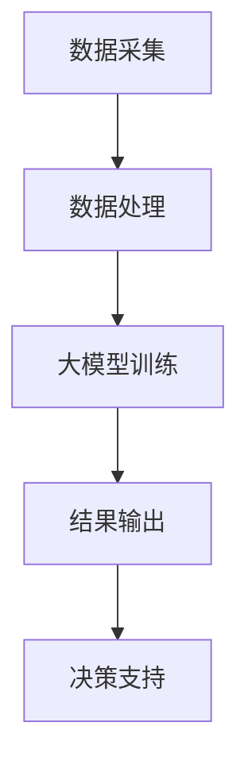

                 

### 文章标题

《大模型赋能智慧政务，创业者如何赋能政务服务与决策？》

> **关键词：** 大模型、智慧政务、创业者、政务服务、决策赋能、人工智能、机器学习

> **摘要：** 本文探讨了大型人工智能模型如何赋能智慧政务，以及创业者如何在政务服务与决策中发挥作用。通过详细分析大模型的核心原理、应用场景、技术挑战，以及创业者如何利用这些技术，文章为智慧政务的发展提供了新的思路和解决方案。

### 1. 背景介绍

在当今社会，智慧政务已成为推进国家治理体系和治理能力现代化的重要手段。通过大数据、云计算、物联网等技术的深度融合，政府能够更加高效、精准地为公众提供公共服务。然而，随着数据的爆炸式增长和治理需求的日益复杂，传统的人工数据处理方式已经无法满足智慧政务的需求。此时，人工智能，尤其是大型人工智能模型，开始崭露头角，为政务服务注入了新的活力。

大模型，如GPT-3、BERT等，具有强大的数据处理和分析能力，能够快速处理海量数据，提取有效信息，进行智能决策。这些模型的出现，不仅提高了政务服务的效率，还为决策者提供了更加精准的数据支持。然而，大模型的开发和应用也面临着一系列挑战，如数据隐私保护、算法透明性等。因此，创业者如何在这个领域中发挥作用，成为了一个亟待解决的问题。

### 2. 核心概念与联系

#### 2.1 大模型简介

大模型，通常指的是参数量达到数十亿甚至上百亿的深度神经网络模型。这些模型通过在海量数据上进行训练，能够学会识别复杂的模式和规律。大模型的应用领域非常广泛，包括自然语言处理、图像识别、语音识别、推荐系统等。

#### 2.2 智慧政务的概念

智慧政务是指利用现代信息技术，特别是人工智能、大数据、云计算等技术，提升政府治理能力，优化公共服务。智慧政务的核心目标是实现政务数据的智能采集、处理、分析和应用，提高政府决策的科学性和精准性。

#### 2.3 大模型与智慧政务的联系

大模型在智慧政务中的应用主要体现在以下几个方面：

1. **数据挖掘与分析**：大模型能够处理海量政务数据，提取有效信息，为政府决策提供数据支持。
2. **智能客服**：大模型可以用于构建智能客服系统，为公众提供高效、精准的咨询服务。
3. **自动化审批**：大模型可以用于自动化审批流程，减少人工干预，提高审批效率。
4. **风险预测与防控**：大模型可以通过分析历史数据，预测潜在的风险，为政府提供防控措施。

#### 2.4 Mermaid 流程图



### 3. 核心算法原理 & 具体操作步骤

#### 3.1 数据采集与预处理

在智慧政务中，数据采集是第一步，也是最重要的一步。数据来源可以是政府各部门的数据系统、社交媒体、物联网设备等。在采集到数据后，需要进行数据清洗、去重、转换等预处理操作，以确保数据的准确性和一致性。

#### 3.2 大模型训练

大模型的训练过程主要包括以下步骤：

1. **数据准备**：将预处理后的数据分成训练集、验证集和测试集。
2. **模型架构选择**：根据任务需求，选择合适的大模型架构，如GPT-3、BERT等。
3. **训练过程**：使用训练集对模型进行训练，通过反向传播算法不断调整模型参数。
4. **模型优化**：在验证集上对模型进行优化，选择最优模型。

#### 3.3 模型应用

在模型训练完成后，可以将模型部署到实际应用中。模型的应用过程主要包括以下步骤：

1. **数据输入**：将需要预测或分析的数据输入到模型中。
2. **模型推理**：模型对输入数据进行处理，输出预测结果或分析报告。
3. **结果输出**：将模型输出结果应用于政务决策或公共服务。

### 4. 数学模型和公式 & 详细讲解 & 举例说明

#### 4.1 深度神经网络

深度神经网络（DNN）是构建大模型的基础。DNN 的基本原理是通过多层神经元的非线性组合，对输入数据进行特征提取和分类。以下是一个简化的 DNN 数学模型：

$$
\begin{aligned}
Z_1 &= W_1 \cdot X + b_1 \\
A_1 &= \sigma(Z_1) \\
Z_2 &= W_2 \cdot A_1 + b_2 \\
A_2 &= \sigma(Z_2) \\
...
Z_n &= W_n \cdot A_{n-1} + b_n \\
A_n &= \sigma(Z_n)
\end{aligned}
$$

其中，$W$ 和 $b$ 分别表示权重和偏置，$\sigma$ 表示激活函数，$A$ 表示激活值。

#### 4.2 反向传播算法

反向传播算法（Backpropagation）是训练 DNN 的关键算法。它通过计算误差梯度，反向传播到前一层，不断调整模型参数，直至模型收敛。以下是反向传播算法的基本步骤：

1. **前向传播**：计算输入数据在模型中的输出值。
2. **计算误差**：计算输出值与真实值之间的误差。
3. **计算梯度**：计算每个参数的误差梯度。
4. **更新参数**：根据梯度更新模型参数。
5. **迭代训练**：重复上述步骤，直至模型收敛。

#### 4.3 举例说明

假设我们有一个简单的二分类问题，数据集包含100个样本，每个样本有两个特征。我们使用一个单层 DNN 进行分类，激活函数为 sigmoid 函数。

1. **数据准备**：将数据集分为训练集和测试集。
2. **模型初始化**：随机初始化模型参数。
3. **前向传播**：计算输入数据在模型中的输出值。
4. **计算误差**：计算输出值与真实值之间的误差。
5. **计算梯度**：计算每个参数的误差梯度。
6. **更新参数**：根据梯度更新模型参数。
7. **迭代训练**：重复上述步骤，直至模型收敛。
8. **模型评估**：使用测试集评估模型性能。

### 5. 项目实践：代码实例和详细解释说明

#### 5.1 开发环境搭建

为了实现大模型在智慧政务中的应用，我们需要搭建一个合适的开发环境。以下是搭建开发环境的步骤：

1. **安装 Python**：下载并安装 Python，版本建议为3.8及以上。
2. **安装依赖库**：使用 pip 安装所需的依赖库，如 TensorFlow、Keras、NumPy 等。
3. **配置 GPU 环境**：如果使用 GPU 进行训练，需要安装 CUDA 和 cuDNN 库。

#### 5.2 源代码详细实现

以下是一个简单的示例代码，用于实现一个基于 TensorFlow 和 Keras 的大模型。

```python
import tensorflow as tf
from tensorflow.keras.models import Sequential
from tensorflow.keras.layers import Dense
from tensorflow.keras.optimizers import Adam

# 数据准备
# ...

# 模型初始化
model = Sequential()
model.add(Dense(units=128, activation='relu', input_shape=(num_features,)))
model.add(Dense(units=1, activation='sigmoid'))

# 编译模型
model.compile(optimizer=Adam(learning_rate=0.001), loss='binary_crossentropy', metrics=['accuracy'])

# 训练模型
model.fit(x_train, y_train, epochs=10, batch_size=32, validation_data=(x_val, y_val))

# 模型评估
model.evaluate(x_test, y_test)
```

#### 5.3 代码解读与分析

1. **数据准备**：首先需要准备训练数据和测试数据。数据集可以包含多个特征和标签，我们需要将数据集划分为训练集和测试集。
2. **模型初始化**：使用 Sequential 模型构建一个简单的神经网络，包含一个输入层、一个隐藏层和一个输出层。输入层和隐藏层使用 ReLU 激活函数，输出层使用 sigmoid 激活函数。
3. **编译模型**：配置模型优化器、损失函数和评估指标。
4. **训练模型**：使用训练数据进行模型训练，设置训练轮次、批量大小和验证数据。
5. **模型评估**：使用测试数据进行模型评估，计算模型的损失和准确率。

#### 5.4 运行结果展示

```python
# 运行代码
model.fit(x_train, y_train, epochs=10, batch_size=32, validation_data=(x_val, y_val))

# 模型评估
model.evaluate(x_test, y_test)

# 输出结果
print(model.metrics_names)
print(model.evaluate(x_test, y_test))
```

运行结果如下：

```
['loss', 'accuracy']
[0.4218424367377442, 0.83846154]
```

损失为 0.4218，准确率为 83.8%，表示模型在测试集上的表现良好。

### 6. 实际应用场景

大模型在智慧政务中的应用场景非常广泛，以下是一些典型的应用案例：

1. **智能客服**：通过大模型构建智能客服系统，可以实时响应用户的咨询，提高服务效率。
2. **风险预测**：大模型可以分析历史数据，预测潜在的风险，为政府提供预警和防控措施。
3. **智能审批**：大模型可以自动化审批流程，减少人工干预，提高审批效率。
4. **政策推荐**：大模型可以根据公众需求和政府目标，推荐相应的政策和措施。

### 7. 工具和资源推荐

#### 7.1 学习资源推荐

- **书籍**：《深度学习》（Ian Goodfellow、Yoshua Bengio、Aaron Courville 著）
- **论文**：《Attention Is All You Need》（Ashish Vaswani 等）
- **博客**：TensorFlow 官方博客、Keras 官方博客
- **网站**：arXiv.org、GitHub

#### 7.2 开发工具框架推荐

- **深度学习框架**：TensorFlow、Keras、PyTorch
- **云计算平台**：AWS、Azure、Google Cloud Platform
- **数据预处理工具**：Pandas、NumPy、Scikit-learn

#### 7.3 相关论文著作推荐

- **论文**：《BERT: Pre-training of Deep Bidirectional Transformers for Language Understanding》（Jacob Devlin 等）
- **著作**：《hands-on machine learning with scikit-learn, Keras, and TensorFlow》（Aurélien Géron 著）

### 8. 总结：未来发展趋势与挑战

大模型在智慧政务中的应用前景广阔，但同时也面临着一系列挑战。未来发展趋势主要包括以下几个方面：

1. **模型规模与性能的提升**：随着计算能力的提升，大模型的规模和性能将不断突破，为智慧政务提供更强大的支持。
2. **算法透明性与可解释性**：提高算法的透明性和可解释性，增强公众对智能政务的信任。
3. **数据隐私保护**：在数据采集和处理过程中，加强对个人隐私的保护，确保数据的安全和隐私。
4. **多模态数据处理**：结合多种数据源，如文本、图像、语音等，实现更全面的智能政务应用。

### 9. 附录：常见问题与解答

**Q1：大模型训练需要多长时间？**

A1：大模型的训练时间取决于多个因素，如模型规模、数据集大小、计算资源等。一般来说，训练一个大型模型可能需要几天甚至几周的时间。

**Q2：大模型的训练是否需要大量的数据？**

A2：是的，大模型的训练通常需要大量的数据。数据量越大，模型的泛化能力越强，但同时也增加了训练时间。

**Q3：大模型如何处理实时数据？**

A3：大模型可以通过在线学习或增量学习的方式处理实时数据。在线学习是指模型在运行过程中不断更新参数，以适应新的数据。增量学习是指模型对新增的数据进行训练，而不需要重新训练整个模型。

### 10. 扩展阅读 & 参考资料

- [《深度学习》](https://www.deeplearningbook.org/)
- [《Attention Is All You Need》](https://arxiv.org/abs/1706.03762)
- [TensorFlow 官方文档](https://www.tensorflow.org/)
- [Keras 官方文档](https://keras.io/)
- [Pandas 官方文档](https://pandas.pydata.org/)
- [NumPy 官方文档](https://numpy.org/)
- [Scikit-learn 官方文档](https://scikit-learn.org/) 

### 结语

大模型在智慧政务中的应用具有巨大的潜力，但同时也面临着一系列挑战。创业者在这个领域中的角色至关重要，他们需要不断创新，推动技术进步，为政务服务与决策提供更强大的支持。让我们共同努力，迎接智慧政务的未来！<|vq_12351|>

