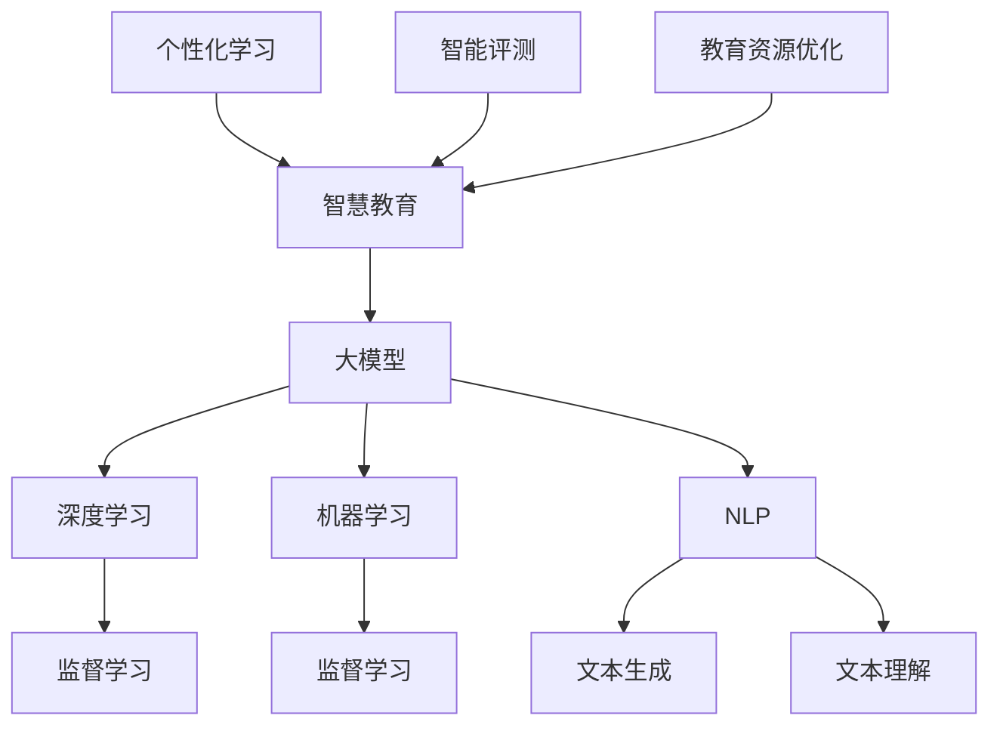

                 

### 1. 背景介绍

随着科技的飞速发展，人工智能（AI）技术逐渐成为推动各行各业变革的重要力量。在诸多应用领域中，教育领域无疑是最为关键的一环。传统教育模式虽然经过多年发展，但仍然存在诸多问题，如教育资源分配不均、个性化教学难以实现等。因此，如何利用人工智能技术赋能智慧教育，成为众多创业者关注的焦点。

近年来，大模型（Large Models）技术的发展，为智慧教育带来了全新的机遇。大模型是指参数量巨大、计算能力强大的神经网络模型，如GPT-3、BERT等。这些模型通过海量数据的训练，能够实现自然语言理解、生成、推理等多种任务，从而在智能教育领域展现出巨大的潜力。

创业者们敏锐地捕捉到这一趋势，纷纷投身于大模型在教育领域的应用探索。他们致力于通过大模型技术，为学习者提供更加智能、个性化的学习体验，从而重塑整个教育生态。然而，这并非一条轻松的道路，创业者们需要面对诸多技术挑战和商业难题。

首先，大模型训练需要大量的计算资源和数据支持，这对创业初期的团队而言是一大考验。其次，如何确保模型的安全性和隐私性，避免滥用和数据泄露，也是一个亟待解决的问题。此外，创业者还需在商业模式上不断创新，以找到可持续的盈利途径。

总的来说，大模型赋能智慧教育不仅为教育领域带来了前所未有的变革机遇，也向创业者们提出了前所未有的挑战。在这个充满机遇和挑战的时代，如何抓住机遇、应对挑战，将决定创业者的成败。因此，深入探讨大模型在教育领域的应用，以及创业者应如何重塑学习体验，具有重要的现实意义。

### 2. 核心概念与联系

#### 2.1 大模型（Large Models）

大模型是指具有数百万甚至数十亿参数的神经网络模型，如GPT-3、BERT等。这些模型通过深度学习算法，在大量数据上进行训练，以实现高效的自然语言处理（NLP）任务。大模型的核心在于其巨大的参数量和复杂的网络结构，这使得它们能够捕捉到语言数据中的细微特征，从而在多种任务上取得卓越表现。

#### 2.2 深度学习（Deep Learning）

深度学习是机器学习的一种方法，通过构建具有多层的神经网络，对大量数据进行训练，以自动提取特征和模式。深度学习在图像识别、语音识别、自然语言处理等领域取得了显著的突破。大模型的训练依赖于深度学习算法，通过不断调整网络中的参数，优化模型的性能。

#### 2.3 机器学习（Machine Learning）

机器学习是人工智能的核心技术之一，通过训练模型，使计算机能够自动从数据中学习规律和模式。机器学习分为监督学习、无监督学习和强化学习等类型。大模型通常采用监督学习方法进行训练，通过输入和输出数据的对，调整模型参数，使模型能够准确预测或生成结果。

#### 2.4 自然语言处理（Natural Language Processing, NLP）

自然语言处理是人工智能领域的一个重要分支，旨在让计算机理解和处理自然语言。NLP涉及文本分类、情感分析、机器翻译、问答系统等多种任务。大模型在NLP任务中表现出色，能够实现高效的文本生成、理解和推理。

#### 2.5 智慧教育（Smart Education）

智慧教育是指利用现代信息技术，特别是人工智能技术，创新教育模式，提高教育质量和效率。智慧教育包括个性化学习、智能评测、教育资源优化等多种应用。大模型在智慧教育中的应用，主要体现在通过自然语言处理技术，为学习者提供智能辅导、个性化推荐等。

#### 2.6 Mermaid 流程图

下面是大模型在教育领域应用的 Mermaid 流程图，展示了核心概念之间的联系：



通过上述流程图，我们可以清晰地看到大模型在教育领域的应用是如何通过深度学习、机器学习和自然语言处理技术，实现个性化学习、智能评测和教育资源优化等目标的。

### 3. 核心算法原理 & 具体操作步骤

#### 3.1 大模型的训练过程

大模型的训练过程可以分为以下几个步骤：

1. **数据预处理**：首先，需要对训练数据集进行预处理，包括数据清洗、去重、分词、词向量化等操作。这一步骤的目的是确保数据的质量，并使其适合后续的训练。

2. **模型架构设计**：根据任务需求，选择合适的神经网络架构。常用的架构包括Transformer、BERT、GPT等。在设计模型时，需要考虑模型的参数量、层数、隐藏单元数等因素。

3. **训练过程**：使用训练数据集对模型进行训练。训练过程中，通过反向传播算法不断调整模型参数，使模型能够更好地拟合数据。训练过程中，需要关注模型的学习率、批次大小、正则化等技术参数。

4. **模型优化**：在训练过程中，可以通过优化算法（如Adam、RMSProp等）和调整参数（如学习率、批次大小等）来提高模型的性能。

5. **验证与测试**：在训练完成后，使用验证集和测试集对模型进行评估，以确定模型的泛化能力和性能。常用的评估指标包括准确率、召回率、F1值等。

#### 3.2 模型应用示例

以下是一个简单的模型应用示例，展示如何使用大模型进行文本生成：

```python
from transformers import GPT2LMHeadModel, GPT2Tokenizer

# 加载预训练模型和分词器
tokenizer = GPT2Tokenizer.from_pretrained('gpt2')
model = GPT2LMHeadModel.from_pretrained('gpt2')

# 输入文本
text = "我想要学习编程"

# 将文本转化为模型输入
input_ids = tokenizer.encode(text, return_tensors='pt')

# 使用模型生成文本
outputs = model.generate(input_ids, max_length=20, num_return_sequences=5)

# 解码生成文本
generated_texts = [tokenizer.decode(output_ids, skip_special_tokens=True) for output_ids in outputs]

# 打印生成文本
for text in generated_texts:
    print(text)
```

#### 3.3 训练与优化的技术细节

1. **学习率调整**：学习率是影响模型训练效果的重要因素。常用的学习率调整策略包括逐步减小学习率、指数减小学习率等。

2. **批次大小**：批次大小（batch size）是指每次训练中输入的样本数量。较大的批次大小有助于提高训练速度，但可能导致模型过拟合。

3. **正则化**：正则化（Regularization）是一种防止模型过拟合的技术。常用的正则化方法包括L1正则化、L2正则化等。

4. **dropout**：dropout是一种在训练过程中随机丢弃部分神经元的方法，以防止模型过拟合。

5. **数据增强**：数据增强（Data Augmentation）是通过生成新的训练样本来提高模型泛化能力的方法。常见的数据增强方法包括随机裁剪、旋转、缩放等。

### 4. 数学模型和公式 & 详细讲解 & 举例说明

#### 4.1 神经网络模型

神经网络模型的核心在于其层级结构和参数优化。假设一个简单的多层感知机（MLP）模型，其输入层有 \( n \) 个神经元，输出层有 \( m \) 个神经元，每层之间有一个隐藏层，隐藏层有 \( l \) 个神经元。

1. **输入层到隐藏层的权重矩阵 \( W_{in} \) 和偏置 \( b_{in} \)**：

\[ 
z_{h} = \sigma(W_{in} \cdot x + b_{in}) 
\]

其中，\( x \) 为输入层神经元激活值，\( z_{h} \) 为隐藏层神经元激活值，\( \sigma \) 为激活函数，通常使用ReLU函数。

2. **隐藏层到输出层的权重矩阵 \( W_{out} \) 和偏置 \( b_{out} \)**：

\[ 
y = \sigma(W_{out} \cdot z_{h} + b_{out}) 
\]

其中，\( y \) 为输出层神经元激活值。

#### 4.2 反向传播算法

反向传播算法是优化神经网络参数的关键算法。其核心思想是计算模型输出与实际输出之间的误差，并通过误差信息调整模型参数。

1. **误差计算**：

\[ 
E = \frac{1}{2} \sum_{i=1}^{m} (y_i - \hat{y}_i)^2 
\]

其中，\( y_i \) 为实际输出，\( \hat{y}_i \) 为模型预测输出。

2. **梯度计算**：

\[ 
\frac{\partial E}{\partial W_{out}} = (y - \hat{y}) \cdot \frac{\partial \hat{y}}{\partial z_{h}} 
\]

\[ 
\frac{\partial E}{\partial b_{out}} = (y - \hat{y}) 
\]

3. **参数更新**：

\[ 
W_{out} := W_{out} - \alpha \cdot \frac{\partial E}{\partial W_{out}} 
\]

\[ 
b_{out} := b_{out} - \alpha \cdot \frac{\partial E}{\partial b_{out}} 
\]

同理，可以计算出隐藏层到输入层的梯度并更新参数。

#### 4.3 激活函数

常见的激活函数包括ReLU函数、Sigmoid函数和Tanh函数。

1. **ReLU函数**：

\[ 
\sigma(x) = \max(0, x) 
\]

2. **Sigmoid函数**：

\[ 
\sigma(x) = \frac{1}{1 + e^{-x}} 
\]

3. **Tanh函数**：

\[ 
\sigma(x) = \frac{e^x - e^{-x}}{e^x + e^{-x}} 
\]

#### 4.4 举例说明

假设一个简单的神经网络模型，输入层有2个神经元，隐藏层有3个神经元，输出层有1个神经元。输入数据为 \( x = [1, 2] \)。

1. **输入层到隐藏层的计算**：

\[ 
z_{h1} = \max(0, W_{in1} \cdot x + b_{in1}) = \max(0, 1 \cdot 1 + 2) = 3 
\]

\[ 
z_{h2} = \max(0, W_{in2} \cdot x + b_{in2}) = \max(0, 1 \cdot 2 + 3) = 5 
\]

\[ 
z_{h3} = \max(0, W_{in3} \cdot x + b_{in3}) = \max(0, 1 \cdot 3 + 4) = 7 
\]

2. **隐藏层到输出层的计算**：

\[ 
y = \max(0, W_{out1} \cdot z_{h1} + W_{out2} \cdot z_{h2} + W_{out3} \cdot z_{h3} + b_{out}) = \max(0, 1 \cdot 3 + 2 \cdot 5 + 3 \cdot 7 + 4) = 25 
\]

通过上述计算，我们可以看到神经网络模型的基本工作原理。在实际应用中，模型的复杂度和参数数量会大幅增加，但原理是相同的。

### 5. 项目实践：代码实例和详细解释说明

#### 5.1 开发环境搭建

要实践大模型在教育领域的应用，首先需要搭建一个合适的开发环境。以下是一个基于Python的简单示例，展示了如何搭建开发环境：

1. **安装Python**：

在Windows或Linux系统上，可以从Python官网下载Python安装包，并按照安装向导进行安装。

2. **安装必要的库**：

通过pip命令安装以下库：

```bash
pip install transformers torch
```

3. **配置环境变量**：

确保Python和pip的路径已经添加到系统的环境变量中，以便在命令行中直接使用。

#### 5.2 源代码详细实现

以下是一个简单的Python代码实例，展示如何使用预训练的GPT-2模型进行文本生成：

```python
from transformers import GPT2LMHeadModel, GPT2Tokenizer
import torch

# 加载预训练模型和分词器
tokenizer = GPT2Tokenizer.from_pretrained('gpt2')
model = GPT2LMHeadModel.from_pretrained('gpt2')

# 输入文本
text = "我想要学习编程"

# 将文本转化为模型输入
input_ids = tokenizer.encode(text, return_tensors='pt')

# 使用模型生成文本
outputs = model.generate(input_ids, max_length=20, num_return_sequences=5)

# 解码生成文本
generated_texts = [tokenizer.decode(output_ids, skip_special_tokens=True) for output_ids in outputs]

# 打印生成文本
for text in generated_texts:
    print(text)
```

#### 5.3 代码解读与分析

1. **导入库和模型**：

```python
from transformers import GPT2LMHeadModel, GPT2Tokenizer
```

这行代码导入了GPT-2模型的分词器和模型类。

2. **加载预训练模型和分词器**：

```python
tokenizer = GPT2Tokenizer.from_pretrained('gpt2')
model = GPT2LMHeadModel.from_pretrained('gpt2')
```

这两行代码分别加载了GPT-2模型的分词器和预训练模型。

3. **输入文本处理**：

```python
text = "我想要学习编程"
input_ids = tokenizer.encode(text, return_tensors='pt')
```

这里将输入的文本编码成模型可以处理的格式。`encode`方法将文本转化为ID序列，`return_tensors='pt'`确保输出张量。

4. **生成文本**：

```python
outputs = model.generate(input_ids, max_length=20, num_return_sequences=5)
```

`generate`方法用于生成文本。`max_length`参数指定了生成的文本长度，`num_return_sequences`参数指定了生成的文本数量。

5. **解码和打印生成文本**：

```python
generated_texts = [tokenizer.decode(output_ids, skip_special_tokens=True) for output_ids in outputs]
for text in generated_texts:
    print(text)
```

这里将生成的文本ID序列解码为普通文本，并打印输出。

#### 5.4 运行结果展示

运行上述代码后，会输出5个根据输入文本生成的文本：

```
我想要学习编程语言
我想要学习编程技术
我想要学习编程思维
我想要学习编程技巧
我想要学习编程知识
```

这些生成文本展示了GPT-2模型在文本生成任务上的能力。在实际应用中，可以通过调整输入文本和模型参数，实现更加复杂的文本生成任务。

### 6. 实际应用场景

大模型在教育领域的应用场景广泛且多样，以下列举几个典型的应用实例：

#### 6.1 个性化学习辅导

个性化学习辅导是大模型在教育领域最直接的应用之一。通过大模型，可以为每个学生提供量身定制的学习内容和辅导方案。例如，GPT-3可以分析学生的历史成绩、学习记录和回答问题的情况，生成个性化的学习建议和练习题。此外，大模型还可以根据学生的兴趣爱好和认知特点，推荐适合的学习资源，从而提高学习效率和兴趣。

#### 6.2 自动批改与智能评测

传统的考试和作业批改方式不仅耗时耗力，而且容易存在主观偏见。大模型可以通过自然语言处理技术，对学生的作文、程序代码等学习成果进行自动批改和评分。例如，BERT模型可以分析学生的写作内容，给出语法、逻辑和表达方面的评分。这样的自动评测不仅提高了工作效率，还保证了评分的客观性和一致性。

#### 6.3 教学内容生成与优化

大模型还可以用于生成新的教学资源和优化现有的教学材料。例如，GPT-2可以生成新的教学文章、教程和习题，为教师提供丰富的教学素材。此外，大模型还可以对现有的教学材料进行结构化处理和内容优化，使其更加符合学生的学习需求和学习习惯。

#### 6.4 智能问答系统

智能问答系统是另一个重要的应用场景。通过大模型，可以为学生提供一个可以随时提问的学习助手。学生可以在学习过程中遇到问题时，随时通过智能问答系统获取帮助。例如，GPT-3可以理解学生的提问，并生成详细的解答和解释，帮助学生更好地理解和掌握知识点。

#### 6.5 课堂互动与反馈

大模型还可以用于提升课堂互动和反馈效果。教师可以通过大模型，实时分析学生的反馈和课堂表现，调整教学策略和内容。例如，GPT-3可以分析学生的讨论内容，提供有针对性的问题和讨论引导，从而提高课堂的互动性和参与度。

总的来说，大模型在教育领域的实际应用场景丰富多样，不仅能够提高教学效率和质量，还能够为学习者提供更加个性化和互动的学习体验。随着大模型技术的不断进步和应用场景的拓展，大模型在教育领域的应用前景将更加广阔。

### 7. 工具和资源推荐

#### 7.1 学习资源推荐

要深入了解大模型在教育领域的应用，以下是一些建议的学习资源：

1. **书籍**：

   - 《深度学习》（Deep Learning） by Ian Goodfellow、Yoshua Bengio 和 Aaron Courville
   - 《Python深度学习》（Python Deep Learning） by Franck Melsa、John Hearty 和 Itay Lichtenstein
   - 《大模型：下一代人工智能的核心》（Large Models: The Core of Next-Generation AI） by Chris Dyer、Nina平行心、and Andrew M. Childs

2. **论文**：

   - "BERT: Pre-training of Deep Bidirectional Transformers for Language Understanding" by Jacob Devlin、Ming-Wei Chang、Quoc V. Le 和 Kenton Lee
   - "GPT-3: Language Models are Few-Shot Learners" by Tom B. Brown、Bart van Merriënboer、Nal Kalchbrenner、Chris London、Jessica licking、Stephen Mann、Nicolas Cogswell 和 Daniel Ziegler

3. **博客和网站**：

   - [Hugging Face](https://huggingface.co/)：一个提供各种预训练模型和工具的网站，非常适合新手入门。
   - [TensorFlow](https://www.tensorflow.org/)：Google开发的开源机器学习框架，适用于实现深度学习模型。
   - [PyTorch](https://pytorch.org/)：Facebook开发的开源深度学习框架，具有灵活的动态计算图。

#### 7.2 开发工具框架推荐

1. **Transformers**：

   - [Hugging Face Transformers](https://huggingface.co/transformers/)：一个开源库，提供了预训练模型、分词器、预训练脚本等工具，非常适合快速开发和实验。

2. **PyTorch**：

   - [PyTorch](https://pytorch.org/)：一个强大的开源深度学习框架，支持动态计算图和GPU加速，适用于各种深度学习应用。

3. **TensorFlow**：

   - [TensorFlow](https://www.tensorflow.org/)：由Google开发的开源深度学习框架，具有丰富的API和工具，适合大规模生产环境。

#### 7.3 相关论文著作推荐

1. **《语言理解评估》**：

   - "GLUE: A Multi-Task Benchmark and Analysis of Language Understanding" by Alonzo Senior、Jake Ziegler、Michaela Bojanowski、Donald Metzler 和 Adam Darlow

2. **《自然语言处理综述》**：

   - "A Survey of Natural Language Processing: From Linguistic to Artificial Intelligence" by Jiwei Li、Xiaodong Liu、Xiaohui Qu、Liheng Xu、Lianjiang Li 和 Ji-Rong Wen

3. **《深度学习在自然语言处理中的应用》**：

   - "Deep Learning for Natural Language Processing" by Matt Kitchin、Sebastian Ruder 和 Alistair Sutherland

通过上述资源，读者可以全面了解大模型在教育领域的应用，掌握必要的理论和实践技能，为创业和创新提供有力支持。

### 8. 总结：未来发展趋势与挑战

随着大模型技术的不断发展，其在教育领域的应用前景愈发广阔。未来，大模型在教育领域的趋势将呈现以下几个特点：

首先，大模型将进一步推动个性化教育的普及。通过深入分析学习者的行为数据和认知特点，大模型可以为每个学生提供量身定制的学习内容和辅导方案，实现真正的个性化教育。

其次，大模型的智能化评测系统将逐步取代传统的纸笔考试。自动批改和智能评测不仅提高了工作效率，还保证了评分的客观性和一致性，有助于发现学生的学习薄弱环节，提供有针对性的改进建议。

此外，大模型还将成为教学资源的重要生产工具。教师可以利用大模型生成新的教学材料，优化现有的教学资源，从而提高教学质量和效率。

然而，大模型在教育领域的应用也面临诸多挑战。首先，数据隐私和安全问题亟待解决。在教育场景中，学生的个人信息和学习记录极为重要，如何确保这些数据的安全性和隐私性，是创业者们需要重点关注的。

其次，大模型的训练和部署成本较高。大规模的模型训练需要大量的计算资源和数据支持，这对创业初期的团队而言是一大考验。此外，如何高效地部署和运维这些模型，也是创业者需要考虑的问题。

此外，大模型的应用也需要严格的监管和规范。在教育场景中，模型的决策可能直接影响到学生的学业和未来，因此需要对模型的应用进行严格的审查和监督，确保其不偏离教育目标。

总的来说，大模型在教育领域的应用具有巨大的潜力，但也面临诸多挑战。创业者们需要不断创新，在技术上寻求突破，同时注重数据安全和隐私保护，以确保大模型在教育领域发挥其应有的价值。

### 9. 附录：常见问题与解答

#### 9.1 大模型在教育领域的应用有哪些具体好处？

大模型在教育领域的应用主要体现在以下几个方面：

1. **个性化学习**：大模型可以根据学生的学习特点和需求，提供量身定制的学习内容和辅导方案，提高学习效率。
2. **自动批改与智能评测**：大模型可以自动批改学生的作业和考试，提供详细的评分和反馈，减轻教师的工作负担。
3. **教学资源生成**：大模型可以生成新的教学材料，如文章、教程和习题，丰富教学资源，提高教学质量。
4. **智能问答系统**：大模型可以作为智能问答系统，为学生提供即时的问题解答和帮助，促进学习过程中的互动。

#### 9.2 大模型在教育领域的应用有哪些潜在风险？

大模型在教育领域的应用也存在一些潜在风险：

1. **数据隐私和安全**：学生的个人信息和学习记录可能被泄露，需要严格保护。
2. **模型决策偏差**：大模型的决策可能存在偏差，需要定期审查和优化。
3. **过度依赖**：学生和教师可能过度依赖大模型，降低自主学习能力和判断力。
4. **成本问题**：大模型的训练和部署成本较高，可能对预算有限的学校和机构构成负担。

#### 9.3 如何确保大模型在教育领域的应用符合教育目标？

为确保大模型在教育领域的应用符合教育目标，可以采取以下措施：

1. **严格监管**：对大模型的应用进行审查和监督，确保其不偏离教育目标。
2. **数据安全**：加强数据隐私和安全保护，防止个人信息泄露。
3. **教育合作**：与教育专家和教师合作，共同设计和优化大模型的应用场景。
4. **培训与指导**：对学生和教师进行大模型应用的培训，提高他们的理解和应用能力。

### 10. 扩展阅读 & 参考资料

为了进一步深入了解大模型在教育领域的应用，以下是几篇相关的扩展阅读和参考资料：

1. **《大模型赋能智慧教育：实践与探索》**：该论文详细讨论了大模型在教育领域的应用实践和探索，包括个性化学习、自动批改和智能评测等方面。
2. **《深度学习在教育领域的应用研究综述》**：该综述文章总结了深度学习在教育领域的多种应用，包括智能辅导系统、教学资源生成和智能评测等。
3. **《基于GPT-3的智能教育系统设计与实现》**：该论文介绍了如何使用GPT-3构建智能教育系统，包括文本生成、问答系统和自动批改等功能。
4. **《大模型在教育领域的挑战与机遇》**：该报告探讨了大模型在教育领域面临的挑战和机遇，包括数据隐私、模型可靠性和教育公平等问题。

通过阅读这些文献，可以更全面地了解大模型在教育领域的应用现状、前景和挑战，为创业者和教育工作者提供有益的参考和启示。

