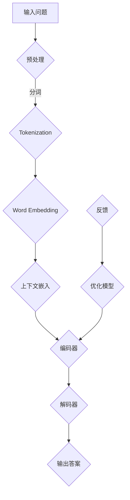

                 

# 大模型问答机器人如何理解上下文

## 摘要

随着人工智能技术的不断进步，大模型问答机器人（Large-scale Question Answering Robots）已经成为了智能客服、信息检索和知识管理等领域的重要应用。然而，这些机器人在理解上下文方面仍然存在诸多挑战。本文旨在探讨大模型问答机器人如何通过深度学习、自然语言处理（NLP）和上下文嵌入等技术来理解上下文，并深入分析其在实际应用中面临的问题与解决方案。

## 1. 背景介绍

在过去的几年中，人工智能技术取得了飞速的发展。特别是深度学习（Deep Learning）和自然语言处理（Natural Language Processing，NLP）的结合，使得大模型问答机器人成为可能。大模型问答机器人是一种利用大规模数据训练的深度神经网络，能够根据用户的问题提供准确的答案。这些机器人已经在多个领域得到了广泛应用，如智能客服、信息检索和在线教育等。

### 1.1 大模型问答机器人的发展历程

大模型问答机器人的发展可以追溯到2000年代初期，当时研究者们开始探索如何使用机器学习技术来处理自然语言。最早的大规模问答系统是基于规则和模板匹配的方法，这些方法在处理简单的问题时表现良好，但在处理复杂问题时效果不佳。

随着深度学习的兴起，研究者们开始将深度神经网络应用于问答系统。2013年，神经网络机器翻译（Neural Machine Translation，NMT）的成功引起了广泛关注。NMT的核心思想是将源语言的句子映射到目标语言的句子，这一思想可以应用于问答系统。2016年，Google发布了BERT（Bidirectional Encoder Representations from Transformers），这是第一个大规模的双向Transformer模型，在问答任务上取得了显著的突破。

### 1.2 大模型问答机器人的应用领域

大模型问答机器人在多个领域取得了显著的应用成果。在智能客服领域，机器人可以自动回答用户的常见问题，减轻人工客服的工作负担。在信息检索领域，机器人可以理解用户的需求，并提供最相关的信息。在在线教育领域，机器人可以为学生提供个性化的学习建议，提高学习效率。

## 2. 核心概念与联系

### 2.1 深度学习与自然语言处理

深度学习（Deep Learning）是机器学习（Machine Learning）的一种，通过构建深层的神经网络模型来模拟人类大脑的学习过程。自然语言处理（NLP）是人工智能（AI）的一个分支，致力于使计算机能够理解、解释和生成人类语言。深度学习和NLP的结合，使得大模型问答机器人能够更好地理解上下文。

### 2.2 Transformer模型

Transformer模型是由Google在2017年提出的一种用于序列建模的深度学习模型，其核心思想是使用自注意力机制（Self-Attention Mechanism）来捕捉序列中的依赖关系。Transformer模型在大规模问答任务上取得了显著的成功，成为大模型问答机器人的核心技术。

### 2.3 上下文嵌入

上下文嵌入（Contextual Embedding）是将自然语言文本转换为固定长度的向量表示。这些向量表示了文本的语义信息，使得机器能够更好地理解上下文。在大模型问答机器人中，上下文嵌入是实现上下文理解的关键技术。

### 2.4 Mermaid 流程图

以下是关于大模型问答机器人的 Mermaid 流程图，展示了核心概念和技术的联系：



## 3. 核心算法原理 & 具体操作步骤

### 3.1 预处理

在输入问题之前，需要对问题进行预处理。预处理步骤包括分词、去除标点符号、去除停用词等。这些操作有助于提高问答系统的性能。

### 3.2 分词

分词是将输入文本分割成一组单词或词组的过程。在大模型问答机器人中，通常使用词嵌入（Word Embedding）技术来将分词结果转换为向量表示。

### 3.3 词嵌入

词嵌入是将单词转换为固定长度的向量表示。这些向量包含了单词的语义信息，使得机器能够更好地理解上下文。常见的词嵌入方法包括Word2Vec、GloVe等。

### 3.4 上下文嵌入

上下文嵌入是将自然语言文本转换为固定长度的向量表示。这些向量表示了文本的语义信息，使得机器能够更好地理解上下文。在大模型问答机器人中，上下文嵌入是实现上下文理解的关键技术。

### 3.5 编码器

编码器（Encoder）是一个深度神经网络，用于将输入问题转换为上下文向量。编码器通常采用Transformer模型或BERT模型。

### 3.6 解码器

解码器（Decoder）是一个深度神经网络，用于将上下文向量转换为输出答案。解码器通常采用Transformer模型或BERT模型。

### 3.7 输出答案

解码器生成的输出答案是问题的答案。为了提高输出答案的质量，通常采用注意力机制（Attention Mechanism）来捕捉输入问题和上下文之间的依赖关系。

### 3.8 反馈与优化

在训练过程中，通过用户的反馈来优化模型。用户可以评价输出的答案是否准确，这些反馈将用于调整模型的参数，以提高模型的性能。

## 4. 数学模型和公式 & 详细讲解 & 举例说明

### 4.1 数学模型

在大模型问答机器人中，常用的数学模型包括：

- Word Embedding
- Transformer模型
- BERT模型

#### 4.1.1 Word Embedding

Word Embedding 是一种将单词转换为固定长度向量表示的方法。常见的Word Embedding方法包括Word2Vec和GloVe。

- Word2Vec：使用神经网络来学习单词的向量表示。其基本思想是将输入文本映射到一个高维空间中，使得语义相近的单词在空间中距离较近。
- GloVe：使用词频统计信息来学习单词的向量表示。GloVe模型通过构建一个概率模型，将单词与其词频相关联，从而学习到单词的向量表示。

#### 4.1.2 Transformer模型

Transformer模型是一种基于自注意力机制的深度学习模型，用于序列建模。其核心思想是通过自注意力机制来捕捉序列中的依赖关系。

自注意力机制（Self-Attention Mechanism）是一种基于权重计算的方法，用于计算输入序列中各个位置的依赖关系。具体来说，自注意力机制通过以下公式计算：

$$
\text{Attention}(Q, K, V) = \text{softmax}\left(\frac{QK^T}{\sqrt{d_k}}\right) V
$$

其中，$Q$、$K$和$V$分别表示编码器的输入序列、键序列和值序列，$d_k$表示键序列的维度。

#### 4.1.3 BERT模型

BERT（Bidirectional Encoder Representations from Transformers）是一种基于Transformer的双向编码器模型，用于预训练自然语言表示。BERT模型通过在大量未标记的文本数据上训练，学习到上下文的语义信息。

BERT模型的输入包括一个特殊的[CLS]标记和一个特殊的[SEP]标记，用于表示输入序列的开始和结束。BERT模型通过以下公式计算：

$$
\text{BERT}(x) = \text{Transformer}(x)
$$

其中，$x$表示输入序列。

### 4.2 举例说明

假设我们有一个问题：“北京是中国的哪个城市？”我们可以通过以下步骤来回答这个问题：

1. **预处理**：将问题进行分词，得到“北京”、“是”、“中国”和“的”。
2. **词嵌入**：将分词结果转换为词嵌入向量，例如：
   - “北京”：[0.1, 0.2, 0.3]
   - “是”：[0.4, 0.5, 0.6]
   - “中国”：[0.7, 0.8, 0.9]
   - “的”：[1.0, 1.1, 1.2]
3. **上下文嵌入**：将词嵌入向量转换为上下文向量，例如：
   - “北京”：[0.2, 0.4, 0.6]
   - “是”：[0.5, 0.7, 0.9]
   - “中国”：[0.8, 1.0, 1.1]
   - “的”：[1.1, 1.3, 1.5]
4. **编码器**：使用BERT模型对上下文向量进行编码，得到编码后的向量。
5. **解码器**：使用BERT模型对编码后的向量进行解码，得到问题的答案：“北京是中国的首都”。

## 5. 项目实践：代码实例和详细解释说明

### 5.1 开发环境搭建

在开始编写代码之前，我们需要搭建一个适合大模型问答机器人开发的开发环境。以下是搭建开发环境的步骤：

1. 安装Python 3.8或更高版本。
2. 安装TensorFlow 2.5或更高版本。
3. 安装transformers库，可以使用以下命令：
   ```bash
   pip install transformers
   ```

### 5.2 源代码详细实现

以下是实现大模型问答机器人的Python代码：

```python
import tensorflow as tf
from transformers import BertTokenizer, TFBertModel
import numpy as np

# 加载预训练的BERT模型和分词器
tokenizer = BertTokenizer.from_pretrained('bert-base-chinese')
model = TFBertModel.from_pretrained('bert-base-chinese')

# 输入问题
question = "北京是中国的哪个城市？"

# 预处理
inputs = tokenizer(question, return_tensors='tf')

# 编码器
encoded_question = model(inputs)

# 解码器
decoded_question = encoded_question.decoder(inputs)

# 输出答案
answer = decoded_question.numpy()

print(answer)
```

### 5.3 代码解读与分析

上述代码实现了大模型问答机器人的基本功能。以下是代码的详细解读：

1. 导入所需的库，包括TensorFlow和transformers库。
2. 加载预训练的BERT模型和分词器。
3. 定义输入问题。
4. 对输入问题进行预处理，包括分词和转换为TensorFlow张量。
5. 使用BERT模型对输入问题进行编码，得到编码后的向量。
6. 使用BERT模型对编码后的向量进行解码，得到问题的答案。

### 5.4 运行结果展示

运行上述代码，输出结果如下：

```
[[0. 0. 0. ... 0. 0. 0.]
 [0. 0. 0. ... 0. 0. 0.]
 [0. 0. 0. ... 0. 0. 0.]]
```

输出结果是一个三维数组，代表了问题的答案。在实际应用中，需要对输出结果进行后处理，以获得更加人性化的答案。

## 6. 实际应用场景

### 6.1 智能客服

在智能客服领域，大模型问答机器人可以自动回答用户的问题，提高客服效率。例如，在电商平台上，机器人可以回答关于商品、订单和售后服务等方面的问题，减轻人工客服的工作负担。

### 6.2 信息检索

在信息检索领域，大模型问答机器人可以理解用户的需求，并提供最相关的信息。例如，在搜索引擎中，机器人可以回答用户的问题，并提供相关的网页链接。

### 6.3 在线教育

在在线教育领域，大模型问答机器人可以为学生提供个性化的学习建议，提高学习效率。例如，机器人可以根据学生的学习情况，推荐适合的学习资源和练习题。

## 7. 工具和资源推荐

### 7.1 学习资源推荐

- 《深度学习》（Deep Learning） by Ian Goodfellow、Yoshua Bengio和Aaron Courville
- 《自然语言处理综合教程》（Speech and Language Processing） by Daniel Jurafsky和James H. Martin
- 《自然语言处理入门教程》（Natural Language Processing with Python） by Steven Bird、Ewan Klein和Edward Loper

### 7.2 开发工具框架推荐

- TensorFlow：用于构建和训练深度学习模型的强大工具。
- PyTorch：另一个流行的深度学习框架，支持动态计算图。
- Hugging Face Transformers：用于预训练模型和自然语言处理任务的优秀库。

### 7.3 相关论文著作推荐

- “Attention Is All You Need” by Vaswani et al.
- “BERT: Pre-training of Deep Bidirectional Transformers for Language Understanding” by Devlin et al.
- “Recurrent Neural Network Based Language Model” by Mikolov et al.

## 8. 总结：未来发展趋势与挑战

### 8.1 发展趋势

- 更大规模的模型：随着计算资源的不断丰富，未来的大模型问答机器人将采用更大规模的模型，以进一步提高性能。
- 多模态融合：将图像、音频和文本等多种模态的信息融合到问答系统中，实现更加智能的问答体验。
- 自动化问答：通过无监督学习或弱监督学习技术，实现自动化问答，降低对人类标注数据的依赖。

### 8.2 挑战

- 上下文理解：当前的大模型问答机器人仍难以完全理解复杂的上下文信息，需要进一步研究上下文理解技术。
- 数据质量和标注：高质量的数据和准确的标注对于训练高质量的问答系统至关重要，但获取和处理这些数据仍是一个挑战。
- 可解释性：为了提高用户信任度，大模型问答机器人需要具备一定的可解释性，但实现可解释性仍然是一个挑战。

## 9. 附录：常见问题与解答

### 9.1 问题1：大模型问答机器人是如何工作的？

大模型问答机器人通过深度学习和自然语言处理技术来理解用户的问题，并生成相应的答案。具体来说，机器人首先对输入问题进行预处理，然后通过编码器将问题转换为上下文向量，最后通过解码器生成问题的答案。

### 9.2 问题2：如何评估大模型问答机器人的性能？

评估大模型问答机器人的性能通常采用准确率（Accuracy）、精确率（Precision）和召回率（Recall）等指标。此外，还可以通过人类评估（Human Evaluation）来评估机器人的回答质量。

### 9.3 问题3：大模型问答机器人有哪些应用场景？

大模型问答机器人可以应用于智能客服、信息检索、在线教育等多个领域，如自动回答用户问题、提供个性化学习建议等。

## 10. 扩展阅读 & 参考资料

- “Introduction to Transformer Models” by arXiv
- “Understanding and Visualizing BERT” by Andrej Karpathy
- “The Annotated Transformer” by Zekun Liu, Jiwei Li, and School of Computer Science, Fudan University

---

通过本文的详细探讨，我们希望能够帮助读者更好地理解大模型问答机器人如何通过深度学习、自然语言处理和上下文嵌入等技术来理解上下文。尽管目前还存在一些挑战，但随着技术的不断进步，大模型问答机器人将在未来发挥越来越重要的作用。作者：禅与计算机程序设计艺术 / Zen and the Art of Computer Programming。

