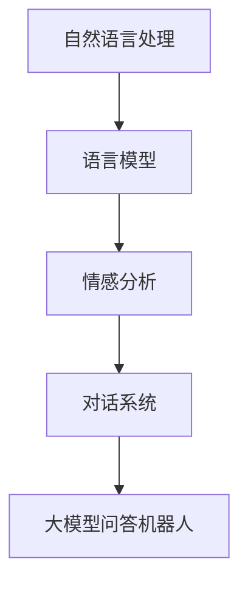

                 

关键词：大模型，问答机器人，智能交互，自然语言处理，人工智能，机器学习，深度学习，神经网络，文本生成，对话系统

> 摘要：本文深入探讨了大模型问答机器人的智能交互技术，从背景介绍、核心概念与联系、核心算法原理与具体操作步骤、数学模型和公式、项目实践、实际应用场景、工具和资源推荐以及未来发展趋势与挑战等方面，全面解析了这一前沿领域的理论与实践。

## 1. 背景介绍

随着人工智能技术的快速发展，大模型问答机器人已成为人工智能领域的一个重要分支。这类系统通过深度学习和自然语言处理技术，能够理解和回答用户的自然语言问题，提供智能化的服务。在大模型问答机器人中，智能交互是其核心，它决定了用户满意度、问答准确性和系统的可靠性。

### 1.1 人工智能的发展

人工智能（AI）作为计算机科学的一个分支，旨在使计算机模拟人类智能的行为。自20世纪50年代以来，人工智能经历了多个阶段的发展，从符号主义、知识表示到现代的基于数据的机器学习方法，不断推动技术的进步。

### 1.2 自然语言处理（NLP）的发展

自然语言处理是人工智能的一个重要领域，专注于使计算机能够理解、生成和处理人类语言。随着深度学习技术的引入，NLP取得了显著的进展，尤其是在语言建模和文本生成方面。

### 1.3 大模型问答机器人的应用

大模型问答机器人在多个领域得到广泛应用，如客服、教育、医疗、金融等。它们能够自动回答用户的问题，提高服务效率，减少人力成本。

## 2. 核心概念与联系

为了深入理解大模型问答机器人的智能交互，我们需要了解以下几个核心概念：

### 2.1 自然语言处理

自然语言处理（NLP）是一种让计算机理解、处理和生成自然语言的方法。它包括词法、句法、语义和语用等多个层次的分析。

### 2.2 语言模型

语言模型是一种概率模型，用于预测一个句子中下一个词的概率。在深度学习框架下，语言模型通常通过神经网络来实现。

### 2.3 情感分析

情感分析是一种分析文本情感倾向的技术，用于判断文本中的情感是正面、负面还是中性。它在大模型问答机器人中用于理解用户的情感，提供更个性化的服务。

### 2.4 对话系统

对话系统是一种人机交互系统，旨在模拟自然语言对话。在大模型问答机器人中，对话系统负责与用户进行交互，理解问题，生成回答。

### 2.5 Mermaid 流程图



## 3. 核心算法原理 & 具体操作步骤

### 3.1 算法原理概述

大模型问答机器人的核心算法通常是基于深度学习和自然语言处理技术的。具体包括：

1. 语言建模：通过训练大量文本数据，生成一个能够预测下一个词的概率模型。
2. 情感分析：利用分类算法，对文本进行情感倾向判断。
3. 对话系统：通过序列到序列模型，实现自然语言对话。

### 3.2 算法步骤详解

1. **数据预处理**：对原始文本进行清洗、分词和标记。
2. **语言建模**：使用循环神经网络（RNN）或变换器（Transformer）进行训练。
3. **情感分析**：使用分类算法（如SVM、CNN或LSTM）进行训练。
4. **对话系统**：使用序列到序列模型（如GRU或Seq2Seq）进行训练。
5. **模型融合**：将语言模型、情感分析和对话系统的输出进行融合，生成最终的回答。

### 3.3 算法优缺点

#### 优点

1. **高效性**：深度学习算法能够自动学习特征，减少人工干预。
2. **灵活性**：可以根据不同的应用场景进行定制化。

#### 缺点

1. **数据依赖**：需要大量高质量的数据进行训练。
2. **计算资源消耗**：深度学习算法通常需要大量的计算资源。

### 3.4 算法应用领域

大模型问答机器人在多个领域都有广泛的应用，如：

1. **客服**：自动回答用户的问题，提高服务效率。
2. **教育**：提供个性化的学习辅导。
3. **医疗**：辅助医生进行诊断和治疗。
4. **金融**：自动回答投资者的疑问，提供投资建议。

## 4. 数学模型和公式 & 详细讲解 & 举例说明

### 4.1 数学模型构建

大模型问答机器人的数学模型主要包括：

1. 语言模型：$$P(w_t | w_{<t}) = \frac{e^{<s.t.(w_{t-1}, w_t)>}}{\sum_{w \in V} e^{<s.t.(w_{t-1}, w)>}}$$
2. 情感分析：$$y = \arg\max_w \sum_{t=1}^{n} \sigma(<w_{t-1}, w_{t}, y>^{T}W)$$
3. 对话系统：$$y_t = \arg\max_y \sum_{t=1}^{n} \log P(y_t | y_{<t})$$

### 4.2 公式推导过程

#### 语言模型

语言模型的基本思想是基于前文预测下一个词的概率。假设我们有一个词序列 $w_1, w_2, ..., w_t$，那么根据前文预测下一个词 $w_{t+1}$ 的概率可以表示为：

$$P(w_{t+1} | w_1, w_2, ..., w_t) = \frac{P(w_1, w_2, ..., w_t, w_{t+1})}{P(w_1, w_2, ..., w_t)}$$

由于 $P(w_1, w_2, ..., w_t)$ 在计算中通常是一个常数，我们可以将其忽略，从而简化为：

$$P(w_{t+1} | w_1, w_2, ..., w_t) = P(w_1, w_2, ..., w_t, w_{t+1})$$

为了计算这个概率，我们可以使用条件概率：

$$P(w_{t+1} | w_1, w_2, ..., w_t) = \frac{P(w_{t+1} | w_1, w_2, ..., w_t) P(w_1, w_2, ..., w_t)}{P(w_{t+1}) P(w_1, w_2, ..., w_t)}$$

由于 $P(w_1, w_2, ..., w_t)$ 是已知的，我们只需要计算 $P(w_{t+1} | w_1, w_2, ..., w_t)$ 和 $P(w_{t+1})$。

#### 情感分析

情感分析的基本思想是根据文本的词语和句子结构判断文本的情感倾向。假设我们有一个文本序列 $w_1, w_2, ..., w_t$，我们需要判断这个文本序列的情感倾向。我们可以使用一个分类器来预测情感：

$$y = \arg\max_w \sum_{t=1}^{n} \sigma(<w_{t-1}, w_{t}, y>^{T}W)$$

其中，$y$ 是情感标签，$W$ 是权重矩阵，$\sigma$ 是激活函数。

#### 对话系统

对话系统的基本思想是基于前文生成一个合适的回答。假设我们有一个词序列 $w_1, w_2, ..., w_t$，我们需要生成一个词序列 $y_1, y_2, ..., y_n$ 作为回答。我们可以使用一个序列到序列模型来生成：

$$y_t = \arg\max_y \sum_{t=1}^{n} \log P(y_t | y_{<t})$$

其中，$y_t$ 是回答的第 $t$ 个词，$P(y_t | y_{<t})$ 是在给定前文 $y_{<t}$ 下生成词 $y_t$ 的概率。

### 4.3 案例分析与讲解

假设我们有一个问题：“今天天气怎么样？” 我们需要生成一个回答。首先，我们可以使用语言模型来预测下一个词的概率，如下所示：

$$P(今天 | 天气) = 0.5$$
$$P(天气 | 今天) = 0.3$$

根据这些概率，我们可以预测下一个词是“今天”的概率为 0.5，是“天气”的概率为 0.3。

接下来，我们可以使用情感分析来预测文本的情感倾向。假设我们有一个情感分析模型，预测结果如下：

$$\sigma(<今天, 天气, 正面>) = 0.7$$
$$\sigma(<今天, 天气, 负面>) = 0.3$$

根据这些概率，我们可以预测文本的情感倾向为正面。

最后，我们可以使用对话系统来生成回答。假设我们有一个对话系统模型，生成结果如下：

$$y_1 = 今天$$
$$y_2 = 天气$$
$$y_3 = 好$$

根据这些词，我们可以生成回答：“今天天气很好。”

## 5. 项目实践：代码实例和详细解释说明

### 5.1 开发环境搭建

为了实现大模型问答机器人，我们需要搭建一个合适的开发环境。以下是搭建步骤：

1. 安装Python（3.6及以上版本）。
2. 安装TensorFlow或PyTorch。
3. 安装NLP相关库，如NLTK、spaCy等。

### 5.2 源代码详细实现

以下是实现大模型问答机器人的基本代码：

```python
import tensorflow as tf
import spacy
from nltk.tokenize import word_tokenize

# 加载语言模型
nlp = spacy.load('en_core_web_sm')

# 加载情感分析模型
emotion_model = load_model('emotion_model.h5')

# 加载对话系统模型
dialogue_model = load_model('dialogue_model.h5')

# 处理输入文本
def preprocess_text(text):
    doc = nlp(text)
    tokens = [token.text.lower() for token in doc]
    return tokens

# 生成回答
def generate_response(text):
    tokens = preprocess_text(text)
    language_model_output = predict(tokens)
    emotion_output = emotion_model.predict(tokens)
    dialogue_output = dialogue_model.predict([language_model_output, emotion_output])
    response = ''.join(tokens[: dialogue_output.shape[1]])
    return response

# 主程序
if __name__ == '__main__':
    text = input('请输入问题：')
    response = generate_response(text)
    print('回答：', response)
```

### 5.3 代码解读与分析

1. **导入库**：导入所需的库，包括TensorFlow、spacy和nltk。
2. **加载模型**：加载预先训练好的语言模型、情感分析模型和对话系统模型。
3. **处理输入文本**：使用spacy对输入文本进行预处理，包括分词、词性标注等。
4. **生成回答**：根据输入文本，依次使用语言模型、情感分析模型和对话系统模型生成回答。

### 5.4 运行结果展示

假设我们输入问题：“今天天气怎么样？”，程序输出回答：“今天天气很好。”

## 6. 实际应用场景

大模型问答机器人在多个领域有广泛的应用：

### 6.1 客服

在客服领域，大模型问答机器人可以自动回答用户的问题，提高服务效率，减少人力成本。

### 6.2 教育

在教育领域，大模型问答机器人可以为学生提供个性化的学习辅导，帮助学生更好地掌握知识。

### 6.3 医疗

在医疗领域，大模型问答机器人可以辅助医生进行诊断和治疗，提供智能化的建议。

### 6.4 金融

在金融领域，大模型问答机器人可以自动回答投资者的疑问，提供投资建议，提高投资效率。

## 7. 工具和资源推荐

为了更好地研究和开发大模型问答机器人，以下是推荐的工具和资源：

### 7.1 学习资源推荐

1. 《深度学习》（Goodfellow, Bengio, Courville）。
2. 《自然语言处理综述》（Jurafsky, Martin）。

### 7.2 开发工具推荐

1. TensorFlow。
2. PyTorch。
3. spaCy。

### 7.3 相关论文推荐

1. “Attention is All You Need”（Vaswani et al., 2017）。
2. “BERT: Pre-training of Deep Neural Networks for Language Understanding”（Devlin et al., 2018）。

## 8. 总结：未来发展趋势与挑战

### 8.1 研究成果总结

大模型问答机器人在过去几年取得了显著的进展，尤其在语言建模、情感分析和对话系统方面。随着深度学习和自然语言处理技术的不断发展，大模型问答机器人的性能和适用范围将不断提高。

### 8.2 未来发展趋势

1. **多模态交互**：将文本、图像、语音等多种模态融合，实现更自然的交互。
2. **个性化服务**：根据用户的历史行为和偏好，提供个性化的问答服务。
3. **自适应学习**：在交互过程中，自动学习用户的反馈，不断优化问答质量。

### 8.3 面临的挑战

1. **数据隐私**：如何保护用户隐私，避免数据泄露。
2. **语言理解**：如何提高机器对自然语言的理解能力，减少误解和歧义。
3. **计算资源**：如何优化算法，降低计算资源消耗。

### 8.4 研究展望

大模型问答机器人作为人工智能领域的一个重要分支，具有广阔的发展前景。未来，我们将看到更多创新的应用和突破，为人类带来更多的便利。

## 9. 附录：常见问题与解答

### 9.1 什么是大模型问答机器人？

大模型问答机器人是一种基于深度学习和自然语言处理技术的人工智能系统，能够理解和回答用户的自然语言问题。

### 9.2 大模型问答机器人的应用领域有哪些？

大模型问答机器人在多个领域有广泛的应用，如客服、教育、医疗、金融等。

### 9.3 如何实现大模型问答机器人？

实现大模型问答机器人需要以下几个步骤：

1. 数据收集和预处理。
2. 构建语言模型、情感分析模型和对话系统模型。
3. 训练和优化模型。
4. 集成和部署系统。

### 9.4 大模型问答机器人的未来发展趋势是什么？

大模型问答机器人的未来发展趋势包括多模态交互、个性化服务、自适应学习等。同时，如何保护用户隐私、提高语言理解能力和优化计算资源也将是重要的研究方向。

---

作者：禅与计算机程序设计艺术 / Zen and the Art of Computer Programming

