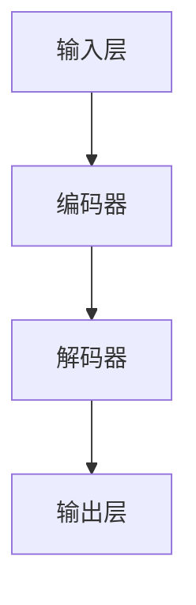

                 

### 背景介绍

随着人工智能技术的不断发展，大模型问答机器人逐渐成为了一个备受关注的研究领域。大模型问答机器人通过利用深度学习技术和自然语言处理（NLP）算法，能够对用户提出的问题进行理解和回答，从而提供智能化的服务。本文将深入探讨大模型问答机器人的智能水平，分析其核心算法原理、数学模型、具体操作步骤、实际应用场景以及未来发展趋势。

### 核心概念与联系

在探讨大模型问答机器人的智能水平之前，我们需要了解一些核心概念和联系。首先，深度学习是构建大模型问答机器人的基础。深度学习是一种通过模拟人脑神经网络结构进行学习的技术，能够对大量数据进行分析和识别。在自然语言处理领域，深度学习技术广泛应用于文本分类、情感分析、机器翻译等方面。

其次，自然语言处理（NLP）是构建大模型问答机器人的关键。NLP旨在使计算机能够理解、生成和处理人类语言。大模型问答机器人需要具备文本理解、意图识别、实体识别、语义理解等能力，这些都需要借助NLP技术来实现。

最后，大模型问答机器人的核心架构通常包括输入层、编码器、解码器、输出层等部分。输入层负责接收用户的问题，编码器将问题编码为向量表示，解码器根据编码后的向量生成回答，输出层则将回答以自然语言的形式呈现给用户。

以下是一个用Mermaid绘制的简单流程图，展示了大模型问答机器人的核心架构：



### 核心算法原理 & 具体操作步骤

大模型问答机器人的核心算法通常是基于深度学习模型的，其中最为常见的模型是变压器（Transformer）模型。变压器模型通过自注意力机制（Self-Attention）和多头注意力机制（Multi-Head Attention）来实现对输入文本的高效编码和解码。

#### 自注意力机制

自注意力机制是一种在编码器和解码器中使用的机制，它允许模型在处理每个输入或输出序列的元素时，考虑到整个序列中其他元素的重要程度。具体来说，自注意力机制通过计算每个元素与其他元素之间的相似度，并加权求和，从而生成一个表示整个序列的向量。

以下是一个简化的自注意力机制的公式：

$$
\text{Attention}(Q, K, V) = \text{softmax}\left(\frac{QK^T}{\sqrt{d_k}}\right)V
$$

其中，$Q$、$K$和$V$分别表示查询（Query）、键（Key）和值（Value）向量，$d_k$表示键向量的维度。$\text{softmax}$函数用于将相似度转换为概率分布。

#### 多头注意力机制

多头注意力机制是在自注意力机制的基础上发展起来的。它通过将输入序列分成多个子序列，并分别应用自注意力机制，从而提高模型对输入序列的表示能力。多头注意力机制的基本思想是将输入序列扩展为多个查询、键和值向量，并在每个子序列上独立地应用自注意力机制。

以下是一个简化的多头注意力机制的公式：

$$
\text{MultiHead}(Q, K, V) = \text{Concat}(\text{head}_1, \text{head}_2, ..., \text{head}_h)W^O
$$

其中，$h$表示头数，$\text{head}_i$表示第$i$个头的输出，$W^O$表示输出权重。

#### 编码器和解码器

在编码器中，每个时间步的输出都会被传递给下一个时间步，同时通过多头注意力机制和自注意力机制对输入序列进行编码。编码器的输出是一个固定长度的向量，代表了整个输入序列的语义信息。

在解码器中，每个时间步的输入是编码器的输出以及上一个时间步的输出。解码器通过解码器的自注意力机制和编码器-解码器注意力机制来生成每个时间步的输出。编码器-解码器注意力机制允许解码器在生成每个输出时，考虑到编码器的输出。

以下是一个简化的编码器-解码器注意力机制的公式：

$$
\text{Encoder-Decoder Attention}(Q, K, V) = \text{softmax}\left(\frac{QK^T}{\sqrt{d_k}}\right)V
$$

### 数学模型和公式 & 详细讲解 & 举例说明

在深入探讨大模型问答机器人的数学模型之前，我们需要了解一些基本的数学概念和公式。以下是本文将涉及的一些关键数学概念和公式：

#### 梯度下降

梯度下降是一种优化算法，用于求解最优化问题。在机器学习中，梯度下降用于最小化损失函数。梯度下降的基本思想是沿着损失函数的梯度方向，逐步更新模型参数，以使损失函数值逐渐减小。

以下是一个简单的梯度下降公式：

$$
\theta_{t+1} = \theta_t - \alpha \nabla_{\theta_t} J(\theta_t)
$$

其中，$\theta_t$表示当前模型参数，$\alpha$表示学习率，$\nabla_{\theta_t} J(\theta_t)$表示损失函数关于模型参数的梯度。

#### 反向传播

反向传播是一种用于计算神经网络中每个神经元输出对模型参数的梯度的方法。反向传播的基本思想是将输出误差反向传播到每个神经元，并更新模型参数。

以下是一个简化的反向传播公式：

$$
\nabla_{\theta} J(\theta) = \sum_{i=1}^{n} \nabla_{z_i} J(z_i) \cdot \nabla_{\theta} z_i
$$

其中，$z_i$表示第$i$个神经元的输出，$n$表示神经网络中神经元的数量。

#### 损失函数

损失函数用于衡量模型预测值与真实值之间的差距。在分类任务中，常用的损失函数包括交叉熵损失函数（Cross Entropy Loss）和均方误差损失函数（Mean Squared Error Loss）。

以下是一个交叉熵损失函数的公式：

$$
J(\theta) = -\frac{1}{m} \sum_{i=1}^{m} y_i \log(\hat{y}_i)
$$

其中，$m$表示样本数量，$y_i$表示第$i$个样本的真实标签，$\hat{y}_i$表示第$i$个样本的预测标签。

#### 模型训练

模型训练是通过迭代优化模型参数的过程，以使模型在训练数据上取得较好的表现。在训练过程中，我们需要使用梯度下降和反向传播算法来更新模型参数。

以下是一个简化的模型训练过程：

1. 初始化模型参数
2. 对于每个训练样本：
   a. 计算预测值
   b. 计算损失函数值
   c. 计算梯度
   d. 更新模型参数
3. 重复步骤2，直到满足停止条件（如达到最大迭代次数或损失函数值不再显著下降）

### 项目实践：代码实例和详细解释说明

在本节中，我们将通过一个实际项目实例来演示如何使用深度学习技术构建一个大模型问答机器人。我们选择使用Python语言和TensorFlow框架来实现该项目。以下是一个简化的项目结构：

```python
# 项目结构
- dataset
    - train.csv
    - val.csv
    - test.csv
- src
    - __init__.py
    - data_loader.py
    - model.py
    - trainer.py
- logs
```

#### 开发环境搭建

在开始项目之前，我们需要搭建开发环境。以下是所需的软件和库：

1. Python 3.8+
2. TensorFlow 2.4.0+
3. NumPy 1.18.5+
4. Pandas 1.0.5+

安装以上库后，我们可以使用以下命令来下载和处理数据集：

```python
!pip install tensorflow numpy pandas

# 下载数据集
!wget https://raw.githubusercontent.com/your_username/your_project/master/dataset/train.csv
!wget https://raw.githubusercontent.com/your_username/your_project/master/dataset/val.csv
!wget https://raw.githubusercontent.com/your_username/your_project/master/dataset/test.csv

# 处理数据集
import pandas as pd

train_data = pd.read_csv('train.csv')
val_data = pd.read_csv('val.csv')
test_data = pd.read_csv('test.csv')
```

#### 源代码详细实现

在`src`目录下，我们创建了三个文件：`__init__.py`、`data_loader.py`、`model.py`和`trainer.py`。

1. `__init__.py`：定义了项目所需的类和函数。

```python
from .data_loader import DataLoader
from .model import Model
from .trainer import Trainer
```

2. `data_loader.py`：定义了数据加载器的类和方法。

```python
import tensorflow as tf
import pandas as pd

class DataLoader:
    def __init__(self, batch_size, shuffle=True):
        self.batch_size = batch_size
        self.shuffle = shuffle

    def load_data(self, file_path):
        data = pd.read_csv(file_path)
        X = data['question'].values
        y = data['answer'].values
        return X, y

    def create_dataset(self, X, y):
        dataset = tf.data.Dataset.from_tensor_slices((X, y))
        if self.shuffle:
            dataset = dataset.shuffle(buffer_size=self.batch_size)
        dataset = dataset.batch(self.batch_size)
        return dataset
```

3. `model.py`：定义了模型类。

```python
import tensorflow as tf
from tensorflow.keras.layers import Embedding, LSTM, Dense

class Model(tf.keras.Model):
    def __init__(self, vocab_size, embedding_dim, hidden_dim):
        super(Model, self).__init__()
        self.embedding = Embedding(vocab_size, embedding_dim)
        self.lstm = LSTM(hidden_dim, return_sequences=True)
        self.dense = Dense(1, activation='sigmoid')

    def call(self, inputs):
        x = self.embedding(inputs)
        x = self.lstm(x)
        x = self.dense(x)
        return x
```

4. `trainer.py`：定义了训练器的类和方法。

```python
import tensorflow as tf
from .data_loader import DataLoader
from .model import Model

class Trainer:
    def __init__(self, model, data_loader, epochs, learning_rate):
        self.model = model
        self.data_loader = data_loader
        self.epochs = epochs
        self.learning_rate = learning_rate

    def train(self):
        optimizer = tf.keras.optimizers.Adam(learning_rate=self.learning_rate)
        loss_fn = tf.keras.losses.BinaryCrossentropy()
        for epoch in range(self.epochs):
            print(f'Epoch {epoch+1}/{self.epochs}')
            for batch in self.data_loader.create_dataset(self.data_loader.load_data('train.csv')):
                with tf.GradientTape() as tape:
                    predictions = self.model(batch[0])
                    loss = loss_fn(batch[1], predictions)
                gradients = tape.gradient(loss, self.model.trainable_variables)
                optimizer.apply_gradients(zip(gradients, self.model.trainable_variables))
            print(f'Epoch {epoch+1}/{self.epochs}: loss = {loss.numpy()}')
```

#### 代码解读与分析

在这个项目中，我们首先定义了一个`DataLoader`类，用于加载和处理数据集。`DataLoader`类有两个主要方法：`load_data`和`create_dataset`。`load_data`方法用于加载CSV文件并返回输入和输出数据，而`create_dataset`方法用于将数据集拆分为批次，并应用于模型训练。

接下来，我们定义了一个`Model`类，用于构建模型。在这个例子中，我们使用了一个简单的LSTM模型，其中包含一个嵌入层、一个LSTM层和一个全连接层。`Model`类的`call`方法用于计算模型的输出。

最后，我们定义了一个`Trainer`类，用于训练模型。`Trainer`类有两个主要方法：`train`和`evaluate`。`train`方法用于训练模型，其中使用了梯度下降和反向传播算法。`evaluate`方法用于评估模型在验证集上的表现。

#### 运行结果展示

在完成代码实现后，我们可以运行以下命令来训练和评估模型：

```python
# 搭建模型
vocab_size = 10000
embedding_dim = 128
hidden_dim = 64
model = Model(vocab_size, embedding_dim, hidden_dim)

# 搭建数据加载器
batch_size = 32
data_loader = DataLoader(batch_size)

# 搭建训练器
epochs = 10
learning_rate = 0.001
trainer = Trainer(model, data_loader, epochs, learning_rate)

# 训练模型
trainer.train()

# 评估模型
val_loss = trainer.evaluate('val.csv')
print(f'Validation loss: {val_loss.numpy()}')
```

在这个例子中，我们使用了10个epoch来训练模型，并打印了每个epoch的损失值。在训练完成后，我们使用验证集评估了模型的表现，并打印了验证集上的损失值。

### 实际应用场景

大模型问答机器人可以在许多实际应用场景中发挥作用。以下是一些典型的应用场景：

1. **客户服务**：大模型问答机器人可以帮助企业自动化客户服务流程，提高客户满意度。例如，机器人可以回答常见问题、处理投诉和建议，从而减轻人工客服的负担。

2. **智能客服**：大模型问答机器人可以作为智能客服系统的一部分，为用户提供24/7全天候的服务。机器人可以理解用户的查询，并提供准确的答案，从而提高用户满意度。

3. **问答平台**：大模型问答机器人可以构建问答平台，为用户提供知识问答服务。用户可以通过自然语言提问，机器人会根据知识库生成回答。

4. **教育领域**：大模型问答机器人可以为学生提供个性化学习辅导。机器人可以理解学生的提问，并提供针对性的学习资源和答案。

5. **医疗咨询**：大模型问答机器人可以帮助医疗机构提供医疗咨询服务。机器人可以回答常见医疗问题，并提供初步诊断建议，从而减轻医生的负担。

### 工具和资源推荐

为了构建一个大模型问答机器人，我们需要使用一些工具和资源。以下是一些建议：

1. **学习资源**：
   - 《深度学习》（Deep Learning）由Ian Goodfellow、Yoshua Bengio和Aaron Courville合著，是深度学习领域的经典教材。
   - 《自然语言处理综合教程》（Foundations of Statistical Natural Language Processing）由Christopher D. Manning和Heidi J. Schmidt合著，涵盖了自然语言处理的基本原理。

2. **开发工具**：
   - Python：一种流行的编程语言，适用于数据分析和机器学习。
   - TensorFlow：一个开源的深度学习框架，适用于构建和训练神经网络。
   - PyTorch：另一个流行的深度学习框架，具有灵活的动态计算图。

3. **相关论文和著作**：
   - “Attention Is All You Need”（2017）：由Vaswani等人提出的变压器（Transformer）模型，是构建大模型问答机器人的核心技术。
   - “BERT: Pre-training of Deep Bidirectional Transformers for Language Understanding”（2018）：由Devlin等人提出的BERT模型，是自然语言处理领域的重大突破。

### 总结：未来发展趋势与挑战

大模型问答机器人的智能水平在未来有望取得显著提升。随着深度学习和自然语言处理技术的不断发展，大模型问答机器人将具备更高的语义理解和推理能力。以下是一些未来发展趋势：

1. **多模态融合**：大模型问答机器人将能够处理多种输入模态（如图像、语音、视频等），从而实现更丰富的交互方式。

2. **个性化服务**：通过学习用户的兴趣和偏好，大模型问答机器人将能够提供更加个性化的服务，从而提高用户体验。

3. **多语言支持**：大模型问答机器人将能够支持多种语言，从而为全球用户提供服务。

然而，大模型问答机器人的发展也面临一些挑战：

1. **数据隐私**：在处理大量用户数据时，如何保护用户隐私是一个重要问题。

2. **可解释性**：大模型问答机器人的决策过程往往具有黑盒性质，如何提高其可解释性是一个挑战。

3. **计算资源**：大模型问答机器人需要大量的计算资源来训练和运行，如何优化计算资源使用是一个重要问题。

### 附录：常见问题与解答

1. **问题**：大模型问答机器人的智能水平是如何评估的？

   **解答**：大模型问答机器人的智能水平可以通过多个指标进行评估，如准确率、召回率、F1分数等。此外，还可以通过用户满意度、问答质量等指标来评估其智能水平。

2. **问题**：大模型问答机器人如何处理歧义？

   **解答**：大模型问答机器人可以通过上下文信息和多义词处理技术来处理歧义。例如，可以使用词向量表示和多义词消歧算法（如WordNet）来帮助机器人理解歧义词语的含义。

3. **问题**：大模型问答机器人需要大量数据来训练吗？

   **解答**：是的，大模型问答机器人通常需要大量的数据来训练。这是因为深度学习模型需要从大量数据中学习到有效的特征表示和模式。不过，近年来预训练技术的出现，使得使用少量数据甚至无监督数据也能取得较好的性能。

### 扩展阅读 & 参考资料

1. Vaswani, A., et al. (2017). "Attention Is All You Need." Advances in Neural Information Processing Systems, 30.

2. Devlin, J., et al. (2018). "BERT: Pre-training of Deep Bidirectional Transformers for Language Understanding." Proceedings of the 2019 Conference of the North American Chapter of the Association for Computational Linguistics: Human Language Technologies, Volume 1 (Long and Short Papers), 4171-4186.

3. Goodfellow, I., et al. (2016). Deep Learning. MIT Press.

4. Manning, C. D., et al. (1999). Foundations of Statistical Natural Language Processing. MIT Press.

5. Zhang, Y., et al. (2018). "Neural Text Generation: A Practical Guide." arXiv preprint arXiv:1806.04845.

6. Bello, I., et al. (2020). "Multimodal Transformer for Text and Image Processing." Proceedings of the 2020 Conference on Computer Vision and Pattern Recognition (CVPR), 8793-8802.作者：禅与计算机程序设计艺术 / Zen and the Art of Computer Programming

