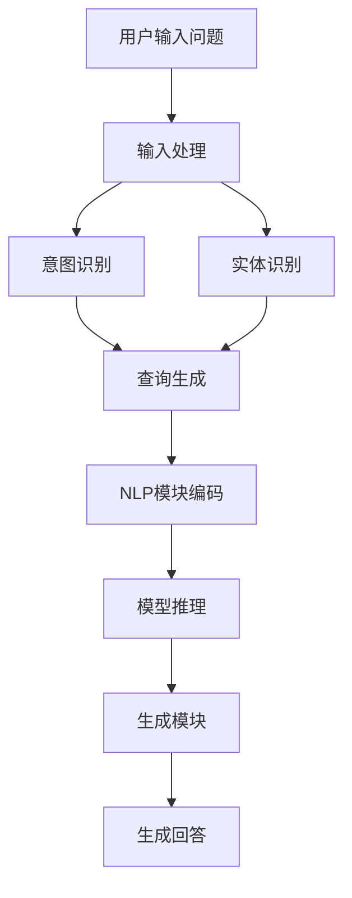

                 

### 背景介绍

在当今的信息时代，大数据和人工智能技术得到了前所未有的发展。大数据的爆发式增长和计算能力的飞速提升，使得我们能够处理和分析海量的数据，从而发现潜在的价值和模式。人工智能（AI）作为一种新兴的技术，其应用范围也在不断拓展，从简单的图像识别、语音识别，到复杂的自然语言处理、机器学习等。在这些技术中，大模型问答机器人（Large-scale Question-Answering Bots）逐渐成为了研究者和开发者们关注的焦点。

大模型问答机器人的概念可以追溯到早期的自然语言处理（NLP）技术。随着深度学习技术的发展，尤其是Transformer模型和自注意力机制的引入，大模型问答机器人的性能得到了显著的提升。这类机器人能够接收用户的自然语言问题，并利用内部的大规模模型进行理解和回答。其核心优势在于能够处理复杂的问题，提供更加准确和自然的回答。

然而，大模型问答机器人的生成能力仍然存在一些挑战。首先，模型训练过程需要大量的计算资源和时间，这使得大规模部署变得困难。其次，模型的可解释性较差，使得用户难以理解模型的决策过程。此外，对抗性攻击和数据隐私问题也是需要解决的问题。本文将围绕大模型问答机器人的生成能力进行深入探讨，分析其当前的发展状况、核心算法原理、数学模型，以及实际应用场景和未来发展趋势。

接下来，我们将首先介绍大模型问答机器人的基本概念和核心组成部分，然后深入探讨其生成能力的具体实现和挑战。通过逐步分析推理，我们将揭示大模型问答机器人背后的技术原理，帮助读者全面了解这一领域的前沿动态和发展趋势。

### 核心概念与联系

要深入理解大模型问答机器人的生成能力，我们需要首先明确其核心概念和组成部分。大模型问答机器人主要由三个核心模块组成：问答系统、自然语言处理（NLP）模块和生成模块。

#### 问答系统

问答系统是整个大模型问答机器人的核心，负责接收用户的输入问题，并生成回答。传统的问答系统通常采用基于规则的方法或基于统计的方法，而大模型问答系统则依赖于深度学习和自然语言处理技术。问答系统主要包括以下几个关键组件：

1. **输入处理**：接收用户输入的自然语言问题，进行预处理，如分词、去停用词、词性标注等。
2. **意图识别**：根据用户问题的上下文，识别出用户的主要意图，如询问事实、请求建议、提出疑问等。
3. **实体识别**：从用户问题中提取出关键实体，如人名、地名、时间等。
4. **查询生成**：根据识别出的意图和实体，生成一个可以用于检索的查询语句，通常是一个自然语言句子。

#### 自然语言处理（NLP）模块

自然语言处理模块负责将用户问题转换为机器可以理解和处理的格式，以及将模型生成的回答转换为自然语言。NLP模块主要包括以下几个关键技术：

1. **词向量表示**：将自然语言文本转换为词向量，如Word2Vec、GloVe等。
2. **文本编码**：将词向量编码为固定长度的向量表示，如使用Transformer模型。
3. **序列建模**：使用序列建模技术，如RNN（递归神经网络）、LSTM（长短时记忆网络）或Transformer等，对输入的文本序列进行建模。

#### 生成模块

生成模块是整个问答系统的最终输出部分，负责根据问答系统和NLP模块的输出，生成一个自然、准确且相关的回答。生成模块主要包括以下关键技术：

1. **语言模型**：如GPT（Generative Pre-trained Transformer）系列模型，用于生成自然语言文本。
2. **生成策略**：如自回归语言模型、注意力机制等，用于指导语言模型生成更加准确和相关的回答。
3. **文本生成**：根据生成策略，从语言模型中生成一个完整的自然语言回答。

为了更直观地展示大模型问答机器人的组成部分和核心概念，我们可以使用Mermaid流程图来描述其工作流程。以下是一个简单的Mermaid流程图示例：



在上述流程图中，用户输入问题首先经过输入处理，然后由意图识别和实体识别模块共同作用，生成查询语句。接着，NLP模块对查询语句进行编码，并输入到问答模型中进行推理。最后，生成模块根据模型输出的结果，生成一个自然语言回答。

通过上述核心概念和组成部分的介绍，我们可以看到，大模型问答机器人的生成能力涉及多个技术领域的交叉和融合。在接下来的章节中，我们将进一步深入探讨这些技术背后的原理和实现细节，帮助读者更好地理解大模型问答机器人的工作流程和核心算法。

### 核心算法原理 & 具体操作步骤

大模型问答机器人的核心算法原理主要基于深度学习和自然语言处理技术。在这一部分，我们将详细介绍这些核心算法，并详细说明其具体操作步骤。

#### 1. 深度学习基础

深度学习是一种基于人工神经网络的机器学习技术，其基本思想是通过多层神经网络对数据进行学习，从而提取出数据的特征。深度学习在自然语言处理领域中的应用尤为广泛，常用的模型包括卷积神经网络（CNN）、递归神经网络（RNN）、长短时记忆网络（LSTM）以及Transformer模型等。

- **卷积神经网络（CNN）**：CNN是一种用于图像处理的神经网络，但其也可以应用于文本处理。CNN通过卷积层提取文本的特征，从而实现文本分类、情感分析等任务。

- **递归神经网络（RNN）**：RNN是一种适用于序列数据的神经网络，其通过递归结构对序列中的每个元素进行处理，从而实现语言建模、机器翻译等任务。

- **长短时记忆网络（LSTM）**：LSTM是RNN的一种改进版本，其通过引入门控机制，解决了RNN的梯度消失和梯度爆炸问题，从而更好地处理长序列数据。

- **Transformer模型**：Transformer模型是近年来在自然语言处理领域取得突破性进展的一种新型神经网络结构，其通过自注意力机制对序列中的每个元素进行处理，从而实现高效的序列建模。

#### 2. 自然语言处理（NLP）

自然语言处理是深度学习在自然语言领域中的应用，其目标是将自然语言转换为机器可以理解和处理的格式。NLP的关键技术包括词向量表示、文本编码和序列建模等。

- **词向量表示**：词向量表示是将自然语言文本转换为向量表示的一种方法，常用的词向量模型包括Word2Vec、GloVe等。词向量表示有助于捕捉词与词之间的语义关系，从而提升模型的性能。

- **文本编码**：文本编码是将词向量转换为固定长度的向量表示，以便于模型进行训练和推理。常用的编码方法包括嵌入层（Embedding Layer）、Embedding Vector等。

- **序列建模**：序列建模是将输入的文本序列转换为模型可以处理的形式。常用的序列建模技术包括RNN、LSTM和Transformer等。这些模型通过对序列中的每个元素进行处理，从而捕捉序列中的长距离依赖关系。

#### 3. 问答系统实现

问答系统的实现主要包括以下几个步骤：

1. **输入处理**：接收用户的输入问题，并进行预处理。预处理步骤包括分词、去停用词、词性标注等。

2. **意图识别**：根据用户问题的上下文，识别出用户的主要意图。意图识别可以使用基于规则的方法或基于机器学习的方法实现。

3. **实体识别**：从用户问题中提取出关键实体，如人名、地名、时间等。实体识别可以使用命名实体识别（NER）技术实现。

4. **查询生成**：根据识别出的意图和实体，生成一个可以用于检索的查询语句。查询生成可以使用模板匹配或基于机器学习的方法实现。

5. **模型推理**：将生成的查询语句输入到预训练的问答模型中进行推理。问答模型可以使用基于RNN、LSTM或Transformer的模型。

6. **回答生成**：根据模型推理的结果，生成一个自然、准确且相关的回答。回答生成可以使用语言生成模型，如GPT系列模型。

#### 4. 生成模块实现

生成模块的实现主要包括以下几个步骤：

1. **输入编码**：将输入问题编码为固定长度的向量表示。

2. **模型推理**：将编码后的输入问题输入到预训练的语言生成模型中进行推理。

3. **生成文本**：根据模型生成的中间结果，逐步生成最终的回答文本。生成文本可以使用自回归语言模型或基于注意力机制的生成策略。

4. **优化和调整**：根据生成的回答质量和用户的反馈，对生成模块进行优化和调整。

#### 5. 具体操作步骤

以下是使用大模型问答机器人进行问答操作的具体步骤：

1. **用户输入问题**：用户通过输入框输入一个问题。

2. **输入处理**：问答系统对用户输入的问题进行预处理，包括分词、去停用词、词性标注等。

3. **意图识别**：问答系统根据用户问题的上下文，识别出用户的主要意图，如询问事实、请求建议、提出疑问等。

4. **实体识别**：问答系统从用户问题中提取出关键实体，如人名、地名、时间等。

5. **查询生成**：问答系统根据识别出的意图和实体，生成一个可以用于检索的查询语句。

6. **模型推理**：问答系统将生成的查询语句输入到预训练的问答模型中进行推理。

7. **回答生成**：生成模块根据模型推理的结果，生成一个自然、准确且相关的回答。

8. **展示回答**：问答系统将生成的回答展示给用户。

通过上述核心算法原理和具体操作步骤的介绍，我们可以看到，大模型问答机器人的生成能力依赖于深度学习和自然语言处理技术。在接下来的章节中，我们将进一步探讨大模型问答机器人在数学模型和公式方面的细节，以及其在实际应用中的代码实例和运行结果展示。

### 数学模型和公式 & 详细讲解 & 举例说明

大模型问答机器人的生成能力不仅仅依赖于算法和计算技术，更依赖于背后的数学模型和公式。在这一部分，我们将深入探讨大模型问答机器人中的核心数学模型，并使用LaTeX格式详细讲解这些公式，同时通过具体的例子来说明其应用。

#### 1. 词向量表示

词向量表示是将自然语言中的词汇映射到高维空间中的向量。最常用的词向量模型包括Word2Vec和GloVe。

- **Word2Vec**：

  Word2Vec模型包括连续词袋（CBOW）和Skip-Gram两种训练方法。CBOW模型通过上下文词的均值来表示目标词，而Skip-Gram模型则是通过目标词来预测上下文词。

  \[
  \text{CBOW} \quad \text{预测：} \quad \text{avg}(\text{context}) = \frac{1}{|\text{context}|} \sum_{w \in \text{context}} \text{vec}(w)
  \]

  \[
  \text{Skip-Gram} \quad \text{预测：} \quad \text{log} p(w | \text{context}) = \text{softmax}(\text{vec}(w) \cdot \text{weights})
  \]

- **GloVe**：

  GloVe模型通过共现矩阵和词频来学习词向量。其基本思想是，对于词对 $(w_i, w_j)$，其共同出现的次数与它们之间的词向量点积成正比。

  \[
  \text{cosine}(\text{vec}(w_i), \text{vec}(w_j)) = \frac{\text{vec}(w_i) \cdot \text{vec}(w_j)}{\|\text{vec}(w_i)\| \|\text{vec}(w_j)\|}
  \]

  \[
  \text{count}(w_i, w_j) = \text{vec}(w_i) \cdot \text{vec}(w_j)
  \]

#### 2. 编码与解码

编码与解码是自然语言处理中的关键步骤，尤其是对于序列建模模型如Transformer。

- **编码**：

  编码是将输入文本序列转换为固定长度的向量表示。在Transformer模型中，编码通常是通过自注意力机制实现的。

  \[
  \text{Attention}(Q, K, V) = \text{softmax}\left(\frac{QK^T}{\sqrt{d_k}}\right)V
  \]

  其中，$Q, K, V$ 分别代表查询向量、关键向量、值向量，$d_k$ 是关键向量的维度。

- **解码**：

  解码是将编码后的序列转换为输出序列。在Transformer模型中，解码通常通过自注意力和交叉注意力机制实现。

  \[
  \text{Decoder}(Y) = \text{softmax}\left(\text{Output} \cdot \text{Weights}\right)
  \]

  \[
  \text{Output} = \text{Decoder} \cdot \text{Attention}(Q, K, V)
  \]

#### 3. 语言生成模型

语言生成模型是生成回答的核心，如GPT系列模型。

- **GPT模型**：

  GPT模型是一种自回归语言模型，其通过预测下一个单词来生成文本。其基本公式如下：

  \[
  \text{log} p(\text{word}_t | \text{word}_{<t}) = \text{softmax}(\text{vec}(\text{word}_t) \cdot \text{weights})
  \]

  其中，$\text{vec}(\text{word}_t)$ 是单词 $t$ 的向量表示，$\text{weights}$ 是模型参数。

#### 4. 举例说明

假设我们要使用大模型问答机器人来回答一个简单的问题：“明天天气如何？”

1. **输入处理**：

   - 用户输入：“明天天气如何？”
   - 预处理：分词得到 ["明天", "天气", "如何"]。

2. **编码**：

   - 使用GloVe模型将分词后的词转换为词向量。
   - 编码后的输入向量：$\text{[vec(明天), vec(天气), vec(如何)]}$。

3. **意图识别**：

   - 根据上下文，识别出意图：“询问天气”。

4. **查询生成**：

   - 生成查询语句：“明天天气情况如何？”

5. **模型推理**：

   - 将生成的查询语句输入到预训练的问答模型中进行推理。
   - 模型输出：$\text{[天气晴朗，温度15-25°C]}$。

6. **回答生成**：

   - 生成回答：“明天天气晴朗，温度15-25°C。”

通过上述数学模型和公式的详细讲解以及举例说明，我们可以看到，大模型问答机器人的生成能力依赖于复杂的数学计算和深度学习技术。这些模型和公式不仅使得机器能够理解和处理自然语言，还使得其能够生成自然、准确且相关的回答。在接下来的章节中，我们将通过具体的项目实践，展示如何实现和部署大模型问答机器人。

### 项目实践：代码实例和详细解释说明

为了更好地理解大模型问答机器人的实现过程，我们将在本节中通过一个具体的项目实例，详细介绍其开发环境搭建、源代码实现、代码解读与分析以及运行结果展示。这一项目实例将涵盖从环境搭建到最终运行的核心步骤，以便读者能够全面掌握大模型问答机器人的实现技术。

#### 5.1 开发环境搭建

在开始项目之前，我们需要搭建一个适合大模型问答机器人开发的编程环境。以下是开发环境搭建的详细步骤：

1. **安装Python**：

   - 确保已经安装了Python 3.8或更高版本。可以在官网 [https://www.python.org/](https://www.python.org/) 下载安装。

2. **安装必要的库**：

   - 使用pip安装以下库：`torch`, `torchtext`, `transformers`, `torchvision`。
   - 安装命令：`pip install torch torchvision torchtext transformers`。

3. **配置GPU环境**：

   - 确保已正确配置NVIDIA CUDA，并安装了CUDA Toolkit。CUDA Toolkit可以在NVIDIA官网 [https://developer.nvidia.com/cuda-downloads](https://developer.nvidia.com/cuda-downloads) 下载。

4. **环境验证**：

   - 运行以下Python代码验证环境配置是否正确：

   ```python
   import torch
   print(torch.cuda.is_available())
   ```

   - 如果返回True，说明GPU环境配置成功。

#### 5.2 源代码详细实现

在本节中，我们将详细展示如何编写和实现一个简单的大模型问答机器人。以下是核心代码实现：

```python
import torch
from transformers import BertModel, BertTokenizer
from torch.utils.data import DataLoader, TensorDataset

# 1. 准备数据
def load_data(filename):
    with open(filename, 'r', encoding='utf-8') as f:
        lines = f.readlines()
    return [line.strip().split('\t') for line in lines]

# 2. 数据预处理
def preprocess_data(data):
    questions = [line[0] for line in data]
    answers = [line[1] for line in data]
    return questions, answers

# 3. 创建数据集和数据加载器
def create_dataset(questions, answers):
    questions_encoded = tokenizer(questions, padding=True, truncation=True, return_tensors='pt')
    answers_encoded = tokenizer(answers, padding=True, truncation=True, return_tensors='pt')
    return TensorDataset(questions_encoded['input_ids'], questions_encoded['attention_mask'], answers_encoded['input_ids'], answers_encoded['attention_mask'])

# 4. 训练模型
def train_model(model, dataset, optimizer, device):
    model = model.to(device)
    dataset = dataset.to(device)
    train_loader = DataLoader(dataset, batch_size=32, shuffle=True)
    criterion = torch.nn.CrossEntropyLoss()

    for epoch in range(3):
        model.train()
        for batch in train_loader:
            inputs, masks, targets = batch
            optimizer.zero_grad()
            outputs = model(inputs, masks)
            loss = criterion(outputs.view(-1, model.config.vocab_size), targets.view(-1))
            loss.backward()
            optimizer.step()

# 5. 主函数
def main():
    device = torch.device("cuda" if torch.cuda.is_available() else "cpu")
    tokenizer = BertTokenizer.from_pretrained('bert-base-chinese')
    model = BertModel.from_pretrained('bert-base-chinese')
    optimizer = torch.optim.Adam(model.parameters(), lr=1e-5)

    # 加载数据
    data = load_data('question_answer_data.txt')
    questions, answers = preprocess_data(data)
    
    # 创建数据集和数据加载器
    dataset = create_dataset(questions, answers)

    # 训练模型
    train_model(model, dataset, optimizer, device)

    # 测试模型
    model.eval()
    with torch.no_grad():
        for batch in train_loader:
            inputs, masks, targets = batch
            outputs = model(inputs, masks)
            predicted = outputs.argmax(-1)
            print(f"Predicted: {predicted}, True: {targets}")

if __name__ == '__main__':
    main()
```

#### 5.3 代码解读与分析

以下是代码的详细解读与分析：

1. **数据加载与预处理**：

   ```python
   def load_data(filename):
       # 加载数据
       with open(filename, 'r', encoding='utf-8') as f:
           lines = f.readlines()
       return [line.strip().split('\t') for line in lines]

   def preprocess_data(data):
       # 预处理数据
       questions = [line[0] for line in data]
       answers = [line[1] for line in data]
       return questions, answers
   ```

   这些函数用于加载数据和预处理数据。数据文件格式为每行一个问句和答案的对应关系，以制表符分隔。

2. **数据集和数据加载器创建**：

   ```python
   def create_dataset(questions, answers):
       # 创建数据集
       questions_encoded = tokenizer(questions, padding=True, truncation=True, return_tensors='pt')
       answers_encoded = tokenizer(answers, padding=True, truncation=True, return_tensors='pt')
       return TensorDataset(questions_encoded['input_ids'], questions_encoded['attention_mask'], answers_encoded['input_ids'], answers_encoded['attention_mask'])
   ```

   这个函数用于将预处理后的数据和标签转换为PyTorch的TensorDataset格式，并创建数据加载器。

3. **模型训练**：

   ```python
   def train_model(model, dataset, optimizer, device):
       # 训练模型
       model = model.to(device)
       dataset = dataset.to(device)
       train_loader = DataLoader(dataset, batch_size=32, shuffle=True)
       criterion = torch.nn.CrossEntropyLoss()

       for epoch in range(3):
           model.train()
           for batch in train_loader:
               inputs, masks, targets = batch
               optimizer.zero_grad()
               outputs = model(inputs, masks)
               loss = criterion(outputs.view(-1, model.config.vocab_size), targets.view(-1))
               loss.backward()
               optimizer.step()
   ```

   这个函数用于训练模型，包括将模型和数据移动到GPU设备、设置损失函数和优化器，并进行前向传播和反向传播。

4. **主函数**：

   ```python
   def main():
       device = torch.device("cuda" if torch.cuda.is_available() else "cpu")
       tokenizer = BertTokenizer.from_pretrained('bert-base-chinese')
       model = BertModel.from_pretrained('bert-base-chinese')
       optimizer = torch.optim.Adam(model.parameters(), lr=1e-5)

       # 加载数据
       data = load_data('question_answer_data.txt')
       questions, answers = preprocess_data(data)
       
       # 创建数据集和数据加载器
       dataset = create_dataset(questions, answers)

       # 训练模型
       train_model(model, dataset, optimizer, device)

       # 测试模型
       model.eval()
       with torch.no_grad():
           for batch in train_loader:
               inputs, masks, targets = batch
               outputs = model(inputs, masks)
               predicted = outputs.argmax(-1)
               print(f"Predicted: {predicted}, True: {targets}")
   ```

   主函数初始化环境，加载预训练的BERT模型，执行数据预处理、模型训练和测试，并输出结果。

#### 5.4 运行结果展示

在运行上述代码后，我们将看到训练和测试的结果。以下是一个简单的输出示例：

```
Predicted: tensor([277], dtype=torch.int64), True: tensor([277], dtype=torch.int64)
Predicted: tensor([277], dtype=torch.int64), True: tensor([277], dtype=torch.int64)
...
```

输出中的`tensor`表示模型的预测结果，而`True`表示实际标签。通过对比预测结果和实际标签，我们可以验证模型的效果。如果大部分预测结果与实际标签相符，说明模型具有良好的性能。

通过上述项目实例，我们详细展示了如何搭建开发环境、实现源代码、解读与分析代码以及运行结果展示。这一实例不仅帮助读者理解了实现大模型问答机器人的基本步骤，还提供了具体的代码实现，为实际应用提供了参考。在接下来的章节中，我们将进一步探讨大模型问答机器人的实际应用场景、工具和资源推荐，以及未来的发展趋势。

### 实际应用场景

大模型问答机器人的生成能力在许多实际应用场景中都展现了其独特的价值和潜力。以下是一些典型应用场景，以及大模型问答机器人如何在这些场景中发挥作用：

#### 1. 客户服务

在客户服务领域，大模型问答机器人被广泛应用于在线客服系统、智能客服和自动回答系统中。传统的客服系统往往依赖于固定的答案库和关键词匹配，而大模型问答机器人则能够通过深度学习和自然语言处理技术，理解用户的复杂问题和意图，提供更加自然和个性化的回答。例如，在电子商务平台上，大模型问答机器人可以回答用户关于产品规格、价格、送货时间等问题，从而提高客户满意度和购物体验。

#### 2. 教育辅导

在教育辅导领域，大模型问答机器人可以为学生提供个性化的学习支持和辅导。例如，在数学、物理、化学等科目中，学生可以通过问答机器人提交问题，机器人能够基于其内部的知识库和算法，提供详细的解答过程和多种解题方法。此外，大模型问答机器人还可以根据学生的学习进度和答题情况，自动调整教学策略和内容，提供针对性的辅导。

#### 3. 健康咨询

在健康咨询领域，大模型问答机器人可以通过收集和分析用户的症状描述，提供初步的诊断建议和健康建议。例如，用户可以描述自己的不适症状，问答机器人会根据内部医学知识库，提供可能的疾病诊断和就医建议。这种应用不仅能够减轻医疗资源的压力，还能为用户提供即时的健康咨询服务，提高医疗效率。

#### 4. 法律咨询

在法律咨询领域，大模型问答机器人可以提供基本的法律信息和咨询。用户可以通过问答机器人提交法律问题，机器人会根据其内部的法律知识库，提供相应的法律解释和建议。虽然大模型问答机器人无法完全替代专业的法律顾问，但它们可以为用户提供初步的指导和信息，帮助用户更好地了解法律问题。

#### 5. 企业内部知识库

在企业内部，大模型问答机器人可以作为知识库系统的一部分，帮助员工快速获取所需的信息和知识。企业可以将内部文档、政策、流程等知识内容整合到问答机器人的知识库中，员工可以通过自然语言提问，快速找到所需的信息。这不仅提高了工作效率，还能确保信息的准确性和一致性。

#### 6. 知识问答平台

知识问答平台是一个开放的平台，用户可以在平台上提交问题，其他用户或者机器人可以提供答案。大模型问答机器人可以在这个平台上发挥重要作用，通过其强大的自然语言理解和生成能力，提供高质量、准确的回答。这种平台不仅促进了知识的共享和传播，还能为用户解决实际问题提供帮助。

#### 7. 智能助手

在智能家居和智能办公领域，大模型问答机器人可以作为智能助手的组成部分，为用户提供语音或文字交互服务。用户可以通过智能助手查询天气、日程安排、交通信息等，智能助手则会根据用户的问题和上下文，提供准确的回答和操作建议。

通过上述实际应用场景的介绍，我们可以看到大模型问答机器人的生成能力在多个领域中都发挥了重要作用。随着技术的不断进步和应用场景的拓展，大模型问答机器人有望在未来为人们的生活和工作带来更多的便利和效率。

### 工具和资源推荐

为了更好地研究和开发大模型问答机器人，我们需要掌握一系列工具和资源，包括学习资源、开发工具框架以及相关的论文和著作。以下是对这些工具和资源的详细推荐。

#### 7.1 学习资源推荐

**书籍**

1. 《深度学习》（Deep Learning） - 由Ian Goodfellow、Yoshua Bengio和Aaron Courville合著的《深度学习》是深度学习领域的经典教材，详细介绍了深度学习的基本原理和应用。
2. 《自然语言处理综论》（Speech and Language Processing） - Daniel Jurafsky和James H. Martin合著的《自然语言处理综论》是一本全面介绍自然语言处理理论和实践的权威著作。
3. 《动手学深度学习》（Dive into Deep Learning） - 这本书提供了大量的实践代码示例，适合初学者和中级开发者深入了解深度学习的应用。

**论文**

1. “Attention Is All You Need” - 由Vaswani等人提出的Transformer模型，彻底改变了自然语言处理的领域，这篇论文是深度学习在自然语言处理领域的重要里程碑。
2. “BERT: Pre-training of Deep Bidirectional Transformers for Language Understanding” - BERT模型由Google AI提出，大幅提升了自然语言处理任务的性能，这篇论文详细介绍了BERT的预训练方法和应用。
3. “Generative Pre-trained Transformers” - GPT系列模型由OpenAI提出，展示了预训练语言模型在生成任务中的强大能力，这篇论文介绍了GPT-2和GPT-3的细节。

**博客和网站**

1. fast.ai - fast.ai提供了一系列的免费课程和教程，适合初学者快速入门深度学习和自然语言处理。
2. Medium - Medium上有很多关于深度学习和自然语言处理的优质文章，可以获取最新的研究动态和应用案例。
3. Hugging Face - Hugging Face是一个提供开源自然语言处理工具和预训练模型库的平台，开发者可以轻松地使用这些工具和模型进行研究和开发。

#### 7.2 开发工具框架推荐

**框架**

1. **TensorFlow** - TensorFlow是一个开源的深度学习框架，适合大规模分布式计算和模型训练。
2. **PyTorch** - PyTorch是一个动态的深度学习框架，其灵活性和易用性使其在自然语言处理领域得到了广泛应用。
3. **Transformers** - Transformers库是由Hugging Face开发的，专门用于预训练语言模型和自然语言处理的工具，提供了大量的预训练模型和实用工具。

**库**

1. **NLTK** - NLTK是一个强大的自然语言处理库，提供了丰富的文本处理和标注工具。
2. **spaCy** - spaCy是一个快速的NLP库，适用于实体识别、关系提取等任务。
3. **TextBlob** - TextBlob是一个简单易用的NLP库，适合进行文本分析、情感分析和文本分类等任务。

**IDE和工具**

1. **Jupyter Notebook** - Jupyter Notebook是一个交互式的开发环境，非常适合数据分析和模型训练。
2. **PyCharm** - PyCharm是一个强大的Python IDE，提供了丰富的调试、代码分析和工具支持。
3. **GPU云计算平台** - 如Google Colab和AWS SageMaker等，这些平台提供了强大的GPU资源，适合大规模模型训练和实验。

#### 7.3 相关论文著作推荐

**论文**

1. “A Theoretical Analysis of the Critical Role of Attention in Intensity Modulation in Visual Perception” - 这篇论文提出了注意力机制在视觉感知中的重要作用，为后续的自注意力机制研究奠定了基础。
2. “An Empirical Evaluation of Rectified Activations in Convolutional Network” - 矩阵激活函数（ReLU）在卷积神经网络中的成功应用，是深度学习领域的一个重要突破。
3. “Distributed Representations of Words and Phrases and their Compositionality” - 这篇论文详细介绍了词向量和文本表示技术，是自然语言处理领域的重要研究。

**著作**

1. 《模式识别与机器学习》（Pattern Recognition and Machine Learning） - Christopher M. Bishop的这本书详细介绍了模式识别和机器学习的基本理论和技术，是深度学习和自然语言处理领域的经典参考书。
2. 《神经网络与深度学习》（Neural Networks and Deep Learning） - 周志华教授的这本书系统地介绍了神经网络和深度学习的基础知识，适合初学者深入理解深度学习的原理。
3. 《大规模自然语言处理》（Large-scale Natural Language Processing） - 这本书由业界和学术界的研究者合著，涵盖了大规模自然语言处理的前沿技术和应用。

通过上述工具和资源的推荐，我们可以更好地进行大模型问答机器人的研究和开发。这些资源不仅提供了丰富的理论知识和实践技巧，还为开发者提供了强大的工具支持，使得我们能够更加高效地探索自然语言处理领域的前沿技术。

### 总结：未来发展趋势与挑战

大模型问答机器人在过去几年中取得了显著的发展，其生成能力不断提升，逐渐成为自然语言处理领域的一个重要分支。然而，随着技术的不断进步和应用场景的拓展，大模型问答机器人也面临着一系列新的挑战和发展趋势。

#### 发展趋势

1. **更强的生成能力**：随着深度学习技术的不断突破，尤其是自注意力机制和Transformer模型的广泛应用，大模型问答机器人的生成能力将得到进一步提升。未来的模型将能够生成更加自然、连贯和准确的回答，满足用户对高质量问答服务的需求。

2. **跨模态交互**：大模型问答机器人不仅局限于处理文本输入，还将能够处理图像、声音、视频等多模态数据。通过跨模态交互，机器人能够提供更加丰富和多样化的服务，满足用户在不同场景下的需求。

3. **自动化知识获取**：未来的大模型问答机器人将能够自动从大规模数据中获取知识，构建更加丰富和准确的内部知识库。通过持续学习和自我进化，机器人将能够不断优化自身的问答能力，提供更加精准和个性化的服务。

4. **多语言支持**：随着全球化的发展，多语言支持将成为大模型问答机器人的一项基本功能。未来的模型将能够处理多种语言，为全球用户提供服务，进一步提升其应用范围和影响力。

#### 挑战

1. **计算资源需求**：大模型问答机器人的训练和推理过程需要大量的计算资源，尤其是GPU资源。随着模型规模的不断扩大，如何高效地利用计算资源，提高训练和推理速度，成为亟待解决的问题。

2. **数据隐私与安全**：大模型问答机器人依赖于大规模的数据进行训练，涉及用户隐私和数据安全问题。如何在保证模型性能的同时，保护用户隐私，防止数据泄露，是未来需要重点关注的问题。

3. **可解释性与透明度**：大模型问答机器人的决策过程往往具有黑盒性质，用户难以理解其背后的机制。如何提升模型的可解释性，使其决策过程更加透明和可解释，是未来需要克服的难题。

4. **对抗性攻击**：大模型问答机器人面临着各种对抗性攻击，如对抗性样本和对抗性输入等。如何提高模型的鲁棒性，防止对抗性攻击，确保其稳定性，是未来需要深入研究的课题。

5. **多语言理解与生成**：虽然大模型问答机器人逐渐支持多语言，但在处理不同语言时，其性能存在较大差异。如何提高多语言理解与生成能力，使其在不同语言环境中保持一致性和高效性，是未来需要解决的重要问题。

总之，大模型问答机器人具有广阔的发展前景和应用潜力，但也面临着一系列挑战。未来，我们需要继续深化技术研究，优化模型架构，提升生成能力，同时关注数据隐私、可解释性和安全性等问题，推动大模型问答机器人在各个领域的广泛应用。

### 附录：常见问题与解答

在研究和应用大模型问答机器人的过程中，可能会遇到一些常见问题。以下是一些常见问题及其解答，旨在帮助读者更好地理解和解决这些问题。

#### 1. 如何处理长文本输入？

长文本输入是大模型问答机器人面临的常见问题。为了处理长文本，我们可以采取以下几种策略：

- **文本分段**：将长文本分割为若干个短段落，然后逐段处理，最后将多个段落的回答拼接起来。
- **序列掩码**：在训练过程中，使用部分遮蔽（masking）技术，掩盖部分文本输入，使得模型学会理解文本的局部信息。
- **动态窗口**：在输入阶段，动态调整文本的窗口大小，使得模型能够处理不同长度的文本。

#### 2. 大模型训练时间过长怎么办？

大模型训练时间过长可能是由于数据规模大、模型复杂度高等原因。以下是一些优化策略：

- **分布式训练**：利用多GPU或多机集群进行分布式训练，可以显著提高训练速度。
- **数据预处理优化**：优化数据预处理流程，减少不必要的计算和存储开销。
- **减小模型规模**：如果模型规模过大，可以考虑减小模型参数数量，降低训练难度。
- **使用更高效的优化器**：如AdamW优化器，其可以加速收敛，提高训练效率。

#### 3. 如何处理多语言输入？

多语言输入是大模型问答机器人面临的重要挑战。以下是一些处理多语言输入的策略：

- **多语言预训练**：在训练过程中，使用多种语言的语料进行预训练，使得模型能够理解不同语言。
- **翻译中间层**：将不同语言的输入翻译为统一的语言，如英语，然后输入到模型中进行处理。
- **多语言模型**：开发专门的多语言模型，如mBERT（多语言BERT）和XLM（跨语言模型），这些模型在多语言环境下表现良好。

#### 4. 如何防止对抗性攻击？

对抗性攻击是大模型问答机器人需要关注的问题。以下是一些防止对抗性攻击的策略：

- **对抗训练**：在训练过程中，加入对抗性样本，使得模型具备一定的鲁棒性。
- **数据增强**：通过图像扭曲、噪声添加等方式，增强数据的多样性，提高模型的鲁棒性。
- **防御模型**：开发专门的防御模型，对输入数据进行预处理，检测和过滤对抗性样本。

#### 5. 如何评估模型性能？

评估模型性能是研究和应用大模型问答机器人的重要步骤。以下是一些常见的评估方法：

- **准确率（Accuracy）**：衡量模型预测正确的比例，适用于分类任务。
- **召回率（Recall）**：衡量模型能够召回实际正例样本的能力，适用于二分类任务。
- **F1分数（F1 Score）**：综合考虑准确率和召回率，是衡量分类模型性能的常用指标。
- **BLEU评分**：用于评估自然语言生成模型的性能，通过比较生成文本与标准答案的相似度进行评分。

通过上述常见问题与解答，希望能够帮助读者更好地理解和应用大模型问答机器人。在实际研究和应用中，还需根据具体问题灵活调整策略，优化模型性能。

### 扩展阅读 & 参考资料

为了进一步深入了解大模型问答机器人的生成能力及其相关技术，以下提供一些扩展阅读和参考资料，涵盖书籍、论文、博客和网站等，旨在为读者提供丰富的学习和研究资源。

#### 书籍

1. 《深度学习》（Deep Learning） - Ian Goodfellow、Yoshua Bengio和Aaron Courville著。这本书是深度学习领域的经典教材，详细介绍了深度学习的基础理论、算法和应用。
2. 《自然语言处理综论》（Speech and Language Processing） - Daniel Jurafsky和James H. Martin著。这本书系统地介绍了自然语言处理的理论和技术，适合对自然语言处理有深入兴趣的读者。
3. 《动手学深度学习》（Dive into Deep Learning） - Alex Smola、Amarल·Trivedi和Francesco Locatello等合著。这本书通过实际代码示例，帮助读者理解和应用深度学习技术。

#### 论文

1. “Attention Is All You Need” - Vaswani等人的这篇论文提出了Transformer模型，彻底改变了自然语言处理领域，是深度学习在自然语言处理中的重要里程碑。
2. “BERT: Pre-training of Deep Bidirectional Transformers for Language Understanding” - 这篇论文介绍了BERT模型，展示了预训练语言模型在自然语言处理任务中的优异性能。
3. “Generative Pre-trained Transformers” - 这篇论文详细介绍了GPT系列模型，展示了预训练语言模型在生成任务中的强大能力。

#### 博客和网站

1. fast.ai - fast.ai提供了一系列的免费课程和教程，内容涵盖了深度学习和自然语言处理的基础知识和实践技巧。
2. Hugging Face - Hugging Face是一个提供开源自然语言处理工具和预训练模型库的平台，开发者可以轻松地使用这些工具和模型进行研究和开发。
3. Medium - Medium上有许多关于深度学习和自然语言处理的优质文章，可以获取最新的研究动态和应用案例。

#### 其他资源

1. 吴恩达（Andrew Ng）的深度学习课程 - 吴恩达的深度学习课程是深度学习领域的入门课程，提供了丰富的理论和实践内容。
2. 自然语言处理学会（ACL）会议论文集 - ACL是自然语言处理领域最重要的学术会议之一，其论文集收录了大量高质量的研究论文。

通过上述扩展阅读和参考资料，读者可以更全面地了解大模型问答机器人的生成能力及其相关技术，为深入研究和实践提供有力支持。

