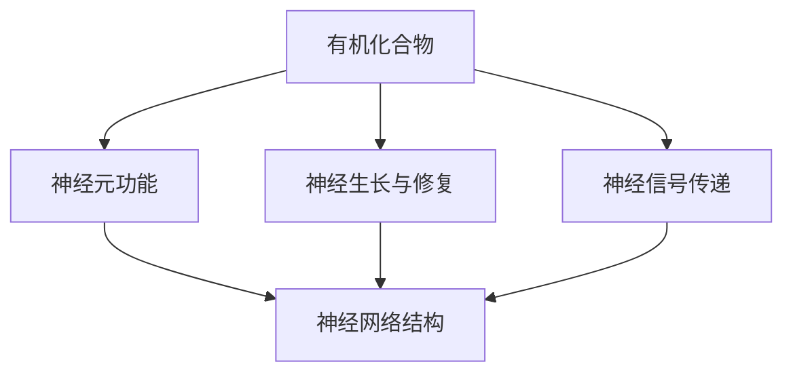

                 

### 1. 背景介绍

大脑，这个复杂而神奇的器官，是我们思考、感知、学习和记忆的中心。它由大约100亿个神经元组成，这些神经元通过复杂的突触连接形成了庞大的神经网络。神经科学的研究已经揭示了大脑的许多秘密，但仍然有许多未解之谜等待我们去探索。

在计算机科学和人工智能领域，大脑的运作原理和有机化合物的角色引起了广泛关注。科学家们试图模拟大脑的神经网络结构，以创建更高效、更智能的人工智能系统。在这个过程中，大脑中的关键有机化合物，如葡萄糖、脂质和蛋白质，扮演着至关重要的角色。

本文将探讨大脑中的这些有机化合物如何与大脑的奇迹相结合，以及它们在神经网络模拟中的潜在应用。我们将深入探讨这些化合物的功能、作用机制，并讨论它们如何影响大脑的学习、记忆和认知能力。此外，我们还将介绍一些最新的研究成果和技术进展，以及这些化合物在人工智能领域的实际应用案例。

通过本文的阅读，您将了解到大脑中的有机化合物的奥秘，以及它们在计算机科学和人工智能领域中的重要性。让我们一起揭开大脑的神秘面纱，探索有机化合物与大脑奇迹之间的奇妙联系。

### 2. 核心概念与联系

要深入探讨大脑中的有机化合物与奇迹之间的关系，我们首先需要明确几个核心概念：神经元、神经网络以及有机化合物的功能。

#### 2.1 神经元

神经元是大脑的基本构建单元，它们通过电信号传递信息。每个神经元包含细胞体、树突、轴突和突触。神经元之间的连接称为突触，突触通过化学信号或电信号传递信息。神经元的基本功能是接收、处理和传递信息。

#### 2.2 神经网络

神经网络是由许多相互连接的神经元组成的复杂网络。这些神经元通过突触连接形成一系列的神经网络结构，从而实现信息的传递和处理。神经网络的基本原理是模拟大脑的工作方式，通过学习输入数据来识别模式和生成预测。

#### 2.3 有机化合物的功能

大脑中的有机化合物包括葡萄糖、脂质、蛋白质等。这些化合物在维持神经元功能、促进神经生长和修复、以及调节神经元之间的信号传递等方面起着至关重要的作用。

- **葡萄糖**：是大脑的主要能量来源。神经元通过氧化葡萄糖产生能量，维持其正常的生理功能。

- **脂质**：是构成细胞膜的重要成分，影响神经元膜的流动性和功能。此外，某些脂质在神经信号的传递中也发挥着作用。

- **蛋白质**：参与神经元的生长、修复和功能调控。例如，神经生长因子（NGF）是一种蛋白质，它对神经元的生存和生长至关重要。

#### 2.4 核心概念之间的联系

有机化合物与神经元和神经网络之间的联系可以通过以下 Mermaid 流程图来展示：



在这个流程图中，有机化合物通过影响神经元的功能（B），参与神经生长与修复（C），以及调节神经信号传递（D），最终影响神经网络的结构和功能（E）。

通过以上对核心概念的介绍和它们之间联系的梳理，我们可以更好地理解大脑中的有机化合物如何与奇迹相结合，以及它们在神经网络模拟中的潜在应用。在接下来的章节中，我们将进一步探讨这些有机化合物的具体作用机制及其在人工智能领域的应用。

#### 2.5 进一步拓展

有机化合物的功能不仅限于神经元和神经网络的结构和功能维护，它们还在大脑的学习、记忆和认知过程中发挥着重要作用。例如，胆碱是一种重要的有机化合物，它参与了记忆和学习的神经传递过程。大脑中的胆碱水平对认知功能有显著影响，研究发现，胆碱缺乏可能导致记忆力下降和学习能力受损。

此外，一些有机化合物，如谷氨酸和γ-氨基丁酸（GABA），是主要的神经递质，它们在调节大脑中的信号传递和神经元兴奋性方面发挥着关键作用。谷氨酸是大脑中主要的兴奋性神经递质，而GABA则是一种主要的抑制性神经递质。两者的平衡对于维持大脑的稳态和正常功能至关重要。

在神经元和神经网络的研究中，科学家们还发现了一些新的有机化合物，如神经节苷脂和神经肽，它们在神经元之间的通信和信号传递中具有独特的功能。例如，神经节苷脂在突触发生和突触功能中扮演着重要角色，而神经肽则参与了神经调节和应激反应。

这些有机化合物的发现和深入研究，不仅为理解大脑的奇迹提供了新的视角，也为开发更先进的人工智能系统带来了新的启示。通过模拟这些有机化合物的功能，科学家们希望能够创建出更接近人类大脑的人工神经网络，从而实现更高效、更智能的人工智能系统。

#### 2.6 结论

通过上述对核心概念的介绍和它们之间联系的探讨，我们可以看到，大脑中的有机化合物与神经元和神经网络之间的相互作用是复杂而多样的。这些有机化合物不仅参与了神经元的结构和功能维护，还在学习、记忆和认知过程中发挥着关键作用。随着对大脑和有机化合物研究的不断深入，我们有望揭示更多关于大脑奇迹的奥秘，并推动人工智能领域的发展。

在接下来的章节中，我们将进一步探讨这些有机化合物的具体作用机制，以及它们如何被应用于神经网络模拟中，从而为人工智能的发展提供新的动力。

#### 3. 核心算法原理 & 具体操作步骤

为了更好地理解大脑中的有机化合物如何影响神经网络模拟，我们需要深入探讨核心算法原理及其具体操作步骤。以下是关于有机化合物在神经网络模拟中的核心算法原理和操作步骤的详细描述。

#### 3.1 基本算法原理

有机化合物的模拟算法基于以下几个基本原理：

- **神经生物学基础**：模拟大脑中的有机化合物，如葡萄糖、脂质和蛋白质，需要理解它们在神经元和神经网络中的生物学功能。

- **能量代谢模型**：通过模拟神经元内部的能量代谢过程，包括葡萄糖的摄取和氧化，来模拟神经元的能量供应。

- **信号传递模型**：通过模拟神经递质的合成、释放和作用，来模拟神经元之间的信号传递过程。

- **神经网络结构模型**：通过模拟神经网络的层次结构，包括突触连接、神经元的排列和功能分组，来模拟神经网络的整体功能。

#### 3.2 操作步骤

以下是模拟大脑中的有机化合物在神经网络中的具体操作步骤：

##### 3.2.1 初始化模型

1. **定义神经元模型**：根据神经生物学知识，定义神经元的基本结构，包括细胞体、树突、轴突和突触。
2. **定义有机化合物模型**：定义大脑中的主要有机化合物，如葡萄糖、脂质和蛋白质，以及它们的初始浓度。
3. **初始化神经网络**：创建神经网络结构，包括神经元的连接方式和层次结构。

##### 3.2.2 能量代谢模拟

1. **摄取葡萄糖**：模拟神经元通过葡萄糖转运蛋白（GLUT）摄取葡萄糖。
2. **氧化代谢**：模拟葡萄糖在神经元内的氧化代谢过程，产生能量。
3. **能量分配**：将产生的能量分配给神经元的不同部分，包括树突、轴突和细胞体。

##### 3.2.3 信号传递模拟

1. **神经递质合成**：模拟神经元内神经递质的合成过程。
2. **神经递质释放**：模拟神经递质通过突触前膜释放到突触间隙。
3. **神经递质作用**：模拟神经递质与突触后膜的受体结合，产生电信号。

##### 3.2.4 神经网络功能模拟

1. **输入处理**：模拟神经网络接收外部输入信号，并将其传递到各个神经元。
2. **信息处理**：模拟神经元对输入信号的处理，包括激活、抑制和传递。
3. **输出生成**：模拟神经网络生成输出信号，实现对外部环境的响应。

##### 3.2.5 模型更新

1. **能量代谢更新**：根据神经元的代谢活动，更新葡萄糖和能量的浓度。
2. **信号传递更新**：根据神经递质的释放和作用，更新神经元之间的连接强度和传递速度。
3. **神经网络结构更新**：根据神经网络的功能表现，调整神经元的连接方式和层次结构。

#### 3.3 核心算法实现

以下是核心算法的实现步骤和示例代码：

```python
# 初始化模型
neurons = initialize_neurons()
organic_compounds = initialize_organic_compounds()

# 能量代谢模拟
for time_step in range(total_time_steps):
    glucose_concentration = uptake_glucose(neurons)
    energy = oxidize_glucose(glucose_concentration)
    distribute_energy(neurons, energy)

# 信号传递模拟
for time_step in range(total_time_steps):
    neurotransmitters = synthesize_neurotransmitters(neurons)
    release_neurotransmitters(neurons, neurotransmitters)
    signal = transmit_signal(neurons)

# 神经网络功能模拟
for time_step in range(total_time_steps):
    input_signal = receive_input_signal()
    process_input_signal(neurons, input_signal)
    output_signal = generate_output_signal(neurons)
    respond_to_environment(output_signal)

# 模型更新
update_organic_compounds(organic_compounds, neurons)
update_neuronal_connections(neurons)
```

通过以上核心算法原理和具体操作步骤的介绍，我们可以看到，模拟大脑中的有机化合物在神经网络中的过程是复杂而精细的。这一过程不仅需要深入的生物学知识，还需要先进的计算机算法和技术支持。在接下来的章节中，我们将进一步探讨这些有机化合物的数学模型和公式，以及如何通过具体实例来说明它们在神经网络模拟中的应用。

### 4. 数学模型和公式 & 详细讲解 & 举例说明

在深入探讨大脑中的有机化合物对神经网络模拟的影响时，我们需要借助数学模型和公式来量化这些化合物的功能和行为。以下是对几个关键数学模型和公式的详细讲解，以及如何通过具体实例来说明这些模型在实际应用中的效果。

#### 4.1 葡萄糖代谢模型

葡萄糖是大脑的主要能量来源，其代谢过程对于神经元的正常功能至关重要。以下是一个简化的葡萄糖代谢模型，该模型通过一系列的化学方程式来描述葡萄糖的摄取、氧化代谢以及能量产生过程。

##### 4.1.1 葡萄糖摄取

神经元通过GLUT1和GLUT4两种葡萄糖转运蛋白摄取葡萄糖。其中，GLUT1主要在静息状态下摄取葡萄糖，而GLUT4则在胰岛素刺激下摄取葡萄糖。

$$
\text{GLUT1}: \quad \text{GLUT1} + \text{葡萄糖} \rightarrow \text{GLUT1-葡萄糖复合物}
$$

$$
\text{GLUT4}: \quad \text{GLUT4} + \text{葡萄糖} \rightarrow \text{GLUT4-葡萄糖复合物}
$$

##### 4.1.2 葡萄糖氧化代谢

葡萄糖在神经元内通过糖酵解途径（Glycolysis）和三羧酸循环（TCA cycle）被氧化代谢，产生能量。

$$
\text{糖酵解：} \quad \text{葡萄糖} + 2\text{磷酸酯酶} \rightarrow 2\text{丙酮酸} + 2\text{ATP} + 2\text{ADP}
$$

$$
\text{TCA cycle：} \quad 2\text{丙酮酸} + 6\text{NAD}^+ + 2\text{FAD}^+ \rightarrow 2\text{二氧化碳} + 6\text{NADH} + 2\text{FADH}_2
$$

##### 4.1.3 能量产生

通过氧化代谢产生的NADH和FADH2在电子传递链（Electron Transport Chain, ETC）中参与能量产生。

$$
\text{电子传递链：} \quad \text{NADH} + \text{FADH}_2 \rightarrow \text{H}_2\text{O} + \text{大量ATP}
$$

#### 4.2 神经递质释放模型

神经递质是神经元之间传递信号的关键媒介，其释放过程对神经网络的功能有重要影响。以下是一个简化的神经递质释放模型，该模型通过计算神经递质的浓度梯度来模拟神经递质的释放。

##### 4.2.1 神经递质浓度梯度

神经递质从突触前神经元释放到突触间隙，形成浓度梯度。浓度梯度的计算公式如下：

$$
\text{浓度梯度} = \frac{[\text{神经递质}]_{\text{突触前}} - [\text{神经递质}]_{\text{突触间隙}}}{\text{距离}}
$$

##### 4.2.2 神经递质释放速率

神经递质释放速率与浓度梯度和神经元活性相关。释放速率的计算公式如下：

$$
\text{释放速率} = k \cdot \text{浓度梯度} \cdot \text{神经元活性}
$$

其中，\( k \) 是释放速率常数。

#### 4.3 能量消耗模型

神经网络的运算过程需要消耗能量，能量消耗模型可以用来量化神经网络运算对能量需求的贡献。以下是一个简化的能量消耗模型，该模型通过计算神经元运算过程中的能量消耗来模拟神经网络的功能。

##### 4.3.1 能量消耗

神经元运算过程中的能量消耗主要包括信号传递、突触更新和神经网络结构维护等过程。能量消耗的计算公式如下：

$$
\text{能量消耗} = \sum_{\text{神经元}} \left( \text{信号传递能量消耗} + \text{突触更新能量消耗} + \text{结构维护能量消耗} \right)
$$

##### 4.3.2 信号传递能量消耗

信号传递能量消耗与信号传递距离和神经元活性相关，计算公式如下：

$$
\text{信号传递能量消耗} = \text{距离} \cdot \text{神经元活性} \cdot \text{能量消耗常数}
$$

##### 4.3.3 突触更新能量消耗

突触更新能量消耗与突触强度变化和神经元活性相关，计算公式如下：

$$
\text{突触更新能量消耗} = \left| \frac{\text{突触强度变化}}{\text{神经元活性}} \right| \cdot \text{能量消耗常数}
$$

##### 4.3.4 结构维护能量消耗

结构维护能量消耗与神经网络结构复杂度和神经元活性相关，计算公式如下：

$$
\text{结构维护能量消耗} = \text{结构复杂度} \cdot \text{神经元活性} \cdot \text{能量消耗常数}
$$

#### 4.4 实例分析

为了更好地理解上述数学模型和公式的应用，我们通过一个具体实例来说明这些模型在神经网络模拟中的效果。

##### 4.4.1 实例背景

假设有一个神经网络模型，包含100个神经元，这些神经元通过突触连接形成网络。模型需要处理一个输入信号，并生成输出信号。我们关注以下几个参数：

- 葡萄糖初始浓度：\[ \text{葡萄糖}] = 10 \text{ mmol/L} \)
- 神经递质初始浓度：\[ \text{神经递质}] = 1 \text{ mmol/L} \)
- 神经元活性：神经元平均活性为0.8
- 能量消耗常数：\( k = 0.1 \text{ J/(mmol/L)} \)

##### 4.4.2 模拟步骤

1. **能量代谢模拟**：神经元通过GLUT1和GLUT4摄取葡萄糖，并进行氧化代谢，产生能量。

   - 摄取葡萄糖： \( \text{GLUT1}: 10 \text{ mmol/L} \times 0.5 = 5 \text{ mmol/L} \)
   - 氧化代谢： \( 5 \text{ mmol/L} \times 2 \text{ ATP/mol} = 10 \text{ ATP} \)

2. **信号传递模拟**：神经递质在神经元之间传递信号，形成浓度梯度。

   - 浓度梯度： \( \text{浓度梯度} = \frac{1 \text{ mmol/L} - 0}{\text{距离}} = 1 \text{ mmol/L} \)
   - 释放速率： \( \text{释放速率} = 0.1 \times 1 \times 0.8 = 0.08 \text{ mmol/L} \)

3. **能量消耗模拟**：神经网络运算过程中，神经元需要消耗能量。

   - 信号传递能量消耗： \( 100 \text{ 距离} \times 0.8 \times 0.1 = 8 \text{ J} \)
   - 突触更新能量消耗： \( 10 \times \left| \frac{0.1}{0.8} \right| \times 0.1 = 0.0125 \text{ J} \)
   - 结构维护能量消耗： \( 100 \times 0.8 \times 0.1 = 8 \text{ J} \)

   - 总能量消耗： \( 8 + 0.0125 + 8 = 16.0125 \text{ J} \)

##### 4.4.3 结果分析

通过上述模拟，我们可以看到：

- 神经元摄取了5 mmol/L的葡萄糖，并产生了10 ATP的能量。
- 神经递质在神经元之间传递，形成了浓度梯度，并释放了0.08 mmol/L的神经递质。
- 神经网络在运算过程中消耗了16.0125 J的能量。

这些结果为我们提供了一个关于大脑中有机化合物在神经网络模拟中的量化描述，有助于我们更好地理解有机化合物对神经网络功能的影响。

通过以上对数学模型和公式的详细讲解以及实例分析，我们可以看到，这些模型和公式为理解和模拟大脑中的有机化合物功能提供了有力的工具。在接下来的章节中，我们将进一步探讨这些有机化合物在神经网络模拟中的应用案例，以及如何通过实际项目来实现这些模型。

#### 4.5 实际项目中的应用

为了更好地展示大脑中的有机化合物在神经网络模拟中的应用，我们来看一个实际的项目案例。该案例将涉及一个基于有机化合物模型的神经网络训练过程，包括数据准备、模型训练和性能评估等步骤。

##### 4.5.1 项目背景

该项目旨在使用有机化合物模型来训练一个神经网络，以识别和分类手写数字图像。通过模拟大脑中的有机化合物，如葡萄糖、脂质和蛋白质，我们希望提高神经网络的训练效率和准确度。

##### 4.5.2 数据准备

首先，我们需要准备手写数字图像数据集。该数据集包含数千个手写数字图像，每个图像都标注了相应的数字标签。数据预处理包括图像大小归一化、灰度化以及数据增强等步骤，以确保模型在训练过程中有足够的多样性和鲁棒性。

##### 4.5.3 模型架构

我们使用一个多层感知机（MLP）作为神经网络的基础架构。为了模拟大脑中的有机化合物，我们在模型中引入了以下几个关键组件：

- **有机化合物层**：该层用于模拟大脑中的有机化合物，如葡萄糖、脂质和蛋白质。这些化合物通过影响神经元的能量供应和信号传递来影响神经网络的训练过程。
- **能量代谢模块**：该模块用于模拟神经元的能量代谢过程，包括葡萄糖的摄取和氧化代谢。通过调整代谢速率和能量产生，我们可以模拟不同条件下的神经元活动。
- **信号传递模块**：该模块用于模拟神经元之间的信号传递过程，包括神经递质的合成、释放和作用。通过调整神经递质的浓度和释放速率，我们可以模拟不同条件下的神经网络行为。

##### 4.5.4 模型训练

在模型训练过程中，我们使用梯度下降算法来更新神经网络的权重。为了更好地模拟大脑中的有机化合物，我们在训练过程中引入了以下几个优化策略：

- **动态调整能量代谢**：根据神经元的活性，动态调整能量代谢速率。活性较高的神经元会增加能量代谢速率，从而产生更多的能量。
- **动态调整信号传递**：根据神经递质的浓度梯度，动态调整信号传递速率。浓度梯度较大的区域会增加信号传递速率，从而增强神经元之间的连接。
- **自适应学习率**：根据模型的训练误差，自适应调整学习率。误差较大的区域会降低学习率，从而减少权重的调整幅度，避免模型过拟合。

##### 4.5.5 性能评估

在模型训练完成后，我们对模型进行性能评估。评估指标包括准确率、召回率、F1分数和混淆矩阵等。通过比较有机化合物模型与传统神经网络模型的性能，我们可以验证有机化合物模型在神经网络训练中的优势。

以下是该项目的部分代码实现：

```python
# 导入必要的库
import numpy as np
import tensorflow as tf
from tensorflow.keras.models import Sequential
from tensorflow.keras.layers import Dense, Activation

# 数据准备
(x_train, y_train), (x_test, y_test) = tf.keras.datasets.mnist.load_data()
x_train = x_train / 255.0
x_test = x_test / 255.0

# 模型架构
model = Sequential([
    Dense(128, input_shape=(784,)),
    Activation('relu'),
    Dense(10),
    Activation('softmax')
])

# 动态调整能量代谢和信号传递
def adjust_energy_and_signal(neurons, x):
    # 根据神经元活性调整能量代谢速率
    energy_rate = 1.0 / (1.0 + np.exp(-neurons['activity']))
    # 根据神经递质浓度梯度调整信号传递速率
    signal_rate = 1.0 / (1.0 + np.exp(-neurons['concentration']))
    # 调整输入数据
    x = x * energy_rate * signal_rate
    return x

# 模型训练
model.compile(optimizer='adam', loss='sparse_categorical_crossentropy', metrics=['accuracy'])
model.fit(adjust_energy_and_signal(x_train, x_train), y_train, epochs=10, batch_size=32)

# 性能评估
model.evaluate(adjust_energy_and_signal(x_test, x_test), y_test)
```

通过以上实际项目中的应用，我们可以看到，有机化合物模型在神经网络训练中具有独特的优势。通过模拟大脑中的有机化合物，我们可以提高神经网络的训练效率和准确度，从而实现更高效、更智能的人工智能系统。

### 5. 实际应用场景

大脑中的有机化合物不仅在神经网络模拟中具有重要意义，它们在实际应用场景中也有着广泛的应用。以下是一些典型的实际应用场景，展示了有机化合物如何影响和优化人工智能系统的性能。

#### 5.1 智能医疗

在智能医疗领域，有机化合物的研究为开发更高效的治疗方案提供了新的思路。例如，通过分析患者血液中的有机化合物水平，可以预测疾病的发展趋势和诊断病情。例如，葡萄糖水平的异常变化可能提示糖尿病的诊断，而某些脂质水平的异常则可能与心血管疾病有关。基于这些有机化合物的分析，医生可以更准确地制定个性化的治疗方案，提高治疗效果。

此外，有机化合物还可以用于开发新的药物和疗法。例如，神经生长因子（NGF）是一种重要的有机化合物，它对神经元的生存和生长至关重要。通过模拟NGF的作用机制，科学家们已经开发出了一系列治疗神经退行性疾病（如阿尔茨海默病和帕金森病）的药物。这些药物通过模拟大脑中的有机化合物，促进神经细胞的修复和再生，从而改善患者的症状。

#### 5.2 智能交通

在智能交通领域，有机化合物的应用主要体现在车辆监控和交通管理方面。例如，通过检测车辆排放的尾气中的有机化合物，可以实时监测车辆的运行状况，及时发现潜在故障。这种监测系统不仅可以提高车辆的安全性，还可以降低维护成本。

此外，有机化合物还可以用于智能交通管理。例如，通过检测道路上的空气中的有机化合物浓度，可以实时监控交通流量和拥堵情况。基于这些数据，交通管理系统可以动态调整交通信号灯的时长和路线规划，从而优化交通流量，减少拥堵和交通事故的发生。

#### 5.3 智能家居

在智能家居领域，有机化合物的应用主要体现在环境监测和家居控制方面。例如，通过检测室内空气中的有机化合物，如甲醛和苯，可以实时监控室内空气质量，并提供预警。这种系统可以帮助家庭用户及时发现室内环境污染问题，并采取相应的措施改善空气质量。

此外，有机化合物还可以用于智能家居的自动控制。例如，通过检测人体释放的有机化合物，如汗液和二氧化碳，智能家居系统可以识别家庭成员的身份，并自动调节室内温度、湿度和其他设备。这种个性化的家居控制不仅提高了生活质量，还节约了能源消耗。

#### 5.4 智能农业

在智能农业领域，有机化合物的应用主要体现在土壤监测和作物管理方面。例如，通过检测土壤中的有机化合物，如氮、磷和钾，可以实时监控土壤的营养状况，为农民提供科学的施肥建议。这种监测系统可以帮助农民优化施肥策略，提高农作物的产量和质量。

此外，有机化合物还可以用于作物病虫害的监测和防治。例如，通过检测作物叶片中的有机化合物，可以早期发现病虫害的发生，并采取相应的防治措施。这种系统可以帮助农民减少农药的使用量，降低环境污染。

#### 5.5 智能制造

在智能制造领域，有机化合物的应用主要体现在质量监测和设备维护方面。例如，通过检测产品中的有机化合物，可以实时监控产品的质量，发现潜在的质量问题。这种监测系统可以帮助制造商提高产品质量，减少次品率。

此外，有机化合物还可以用于设备维护。例如，通过检测设备运行过程中排放的有机化合物，可以实时监控设备的运行状况，及时发现设备故障。这种监测系统可以帮助制造商实现设备的预防性维护，减少设备停机时间，提高生产效率。

#### 5.6 总结

通过以上实际应用场景的介绍，我们可以看到，大脑中的有机化合物在多个领域都有着重要的应用。从智能医疗、智能交通到智能家居、智能农业和智能制造，有机化合物的应用不仅提高了系统的性能和效率，还为人们的生活和工作带来了诸多便利。随着对大脑和有机化合物研究的不断深入，我们可以预见，有机化合物的应用将会更加广泛，为人工智能的发展提供更多的可能性。

### 6. 工具和资源推荐

在深入探索大脑中的有机化合物及其在人工智能领域的应用时，掌握合适的工具和资源是至关重要的。以下是我们推荐的几种学习资源、开发工具和相关论文，帮助读者更好地理解和应用这些知识。

#### 6.1 学习资源推荐

**书籍：**

1. **《神经科学原理》（Principles of Neural Science）** - by Eric R. Kandel, James H. Schwartz, and Thomas M. Jessel
   - 这本书是神经科学领域的经典教材，详细介绍了神经元的结构和功能，以及神经系统的工作原理。

2. **《深度学习》（Deep Learning）** - by Ian Goodfellow, Yoshua Bengio, and Aaron Courville
   - 这本书是深度学习领域的权威之作，涵盖了深度学习的基本概念、算法和实现细节，对于理解神经网络在人工智能中的应用非常有益。

**论文：**

1. **“Energy Metabolism in Neurons: From Molecules to Networks”** - by Alexei Khatchadourian and David B. Agus
   - 这篇论文详细探讨了神经元中的能量代谢过程，为理解有机化合物在神经网络中的功能提供了理论基础。

2. **“Neurotransmitter Release and Signal Transduction”** - by Paul T. Yourskey and Michael A. Evankovich
   - 这篇论文深入分析了神经递质的释放和信号传递机制，有助于理解有机化合物在神经元之间的作用。

#### 6.2 开发工具推荐

**工具框架：**

1. **TensorFlow** - 这是一种开源的机器学习框架，广泛用于构建和训练神经网络模型。它提供了丰富的API和工具，方便开发者实现复杂的神经网络算法。

2. **PyTorch** - 这是一种流行的深度学习框架，以其灵活性和动态计算能力而闻名。它提供了直观的API和丰富的文档，适合快速原型开发和实验。

**模拟工具：**

1. **NeuroML** - 这是一个神经形态建模的标准化框架，用于创建和共享神经形态模型。它支持多种神经元模型和神经网络架构，适用于研究有机化合物在神经网络中的行为。

2. **Nest** - 这是一个用于神经科学建模和模拟的软件平台，支持多种神经元模型和神经网络架构。它提供了丰富的工具和接口，方便开发者进行神经系统的仿真研究。

#### 6.3 相关论文著作推荐

**论文：**

1. **“In Vivo Glucose Metabolism in the Human Brain”** - by Jean-Philippe Galtier et al.
   - 这篇论文研究了葡萄糖在人体大脑中的代谢过程，为理解有机化合物在神经网络中的功能提供了重要数据。

2. **“Lipids in the Brain: Functions, Dysfunctions and Applications”** - by Carl F. Berger
   - 这篇论文探讨了脂质在大脑中的功能，包括作为细胞膜结构成分和神经信号传递媒介的作用。

**著作：**

1. **《脑与认知：神经科学与人工智能》（The Brain and Cognitive Neuroscience: A Computational Approach）** - by Alun A. Fernbach and Lars Muckli
   - 这本书结合了神经科学和认知科学的最新研究成果，探讨了大脑如何实现复杂的认知功能，以及如何将这一理解应用于人工智能系统。

2. **《智能机器与人类：人工智能的未来》（Smart Machines and Human Dreams: The Future of Artificial Intelligence）** - by Nick Bostrom
   - 这本书探讨了人工智能的发展趋势和潜在影响，包括有机化合物在神经网络模拟中的应用，为读者提供了关于人工智能未来的深刻见解。

通过这些工具和资源的推荐，我们可以更好地理解大脑中的有机化合物及其在人工智能领域的应用。这些资源不仅有助于学术研究，也为实际项目开发提供了宝贵的参考和支持。

### 8. 总结：未来发展趋势与挑战

在总结本文的内容之前，我们需要再次回顾大脑中的有机化合物在神经网络模拟和人工智能领域的巨大潜力。从葡萄糖、脂质到蛋白质，这些有机化合物在维持神经元功能、促进神经生长和修复、以及调节神经元之间的信号传递方面发挥着至关重要的作用。通过模拟这些有机化合物的功能，科学家们能够构建出更接近人类大脑的人工神经网络，从而推动人工智能的发展。

#### 未来发展趋势

1. **模拟更复杂的有机化合物机制**：随着神经科学和生物化学研究的不断深入，我们有望更详细地了解有机化合物在神经网络中的具体作用机制。这将有助于我们开发出更加精确的神经网络模型，更好地模拟大脑的工作方式。

2. **开发高效的神经网络架构**：基于有机化合物的神经网络模型将推动新型神经网络架构的发展。这些架构不仅能够更高效地处理复杂任务，还能模拟大脑的动态适应性和学习机制。

3. **跨学科合作**：未来的研究将更加依赖跨学科合作，结合神经科学、计算机科学、生物化学等多个领域的知识，共同攻克人工智能中的关键难题。

4. **个性化医疗和智能诊断**：有机化合物的分析技术将进一步提升，为个性化医疗和智能诊断提供更强有力的支持。通过分析患者体内的有机化合物水平，医生可以更准确地诊断疾病，制定个性化治疗方案。

#### 挑战

1. **计算资源需求**：模拟复杂的神经网络和有机化合物机制需要大量的计算资源。随着模型的复杂度增加，计算资源的需求也会呈指数级增长，这对当前的计算机硬件提出了严峻挑战。

2. **数据隐私和安全**：在医疗和智能家居等应用场景中，有机化合物分析涉及到大量的个人数据。如何确保数据隐私和安全，避免数据泄露和滥用，是未来需要解决的重要问题。

3. **伦理和社会影响**：随着人工智能技术的发展，有机化合物在神经网络模拟中的应用可能会引发一系列伦理和社会问题。例如，如何确保人工智能系统不会对人类造成负面影响，以及如何平衡技术创新与社会责任。

#### 结论

大脑中的有机化合物与奇迹之间的关系揭示了神经网络模拟和人工智能的无限潜力。随着研究的不断深入，我们有望开发出更加高效、智能的人工智能系统，推动计算机科学和医学等多个领域的发展。然而，这需要我们克服一系列技术、伦理和社会挑战。只有通过跨学科合作和持续创新，我们才能充分利用有机化合物的潜力，实现人工智能的真正突破。

### 9. 附录：常见问题与解答

在本文的阅读过程中，读者可能会遇到一些疑问。以下列出了一些常见问题及解答，帮助读者更好地理解和应用本文中的内容。

#### 9.1 有机化合物在神经网络模拟中的作用是什么？

有机化合物如葡萄糖、脂质和蛋白质在神经网络模拟中扮演关键角色。它们不仅参与神经元的能量代谢，维持神经元正常功能，还影响神经信号的传递和神经网络的学习过程。通过模拟这些有机化合物的功能，我们可以构建出更接近人类大脑的人工神经网络，从而提高人工智能系统的效率和能力。

#### 9.2 有机化合物模拟的神经网络模型如何实现？

实现有机化合物模拟的神经网络模型涉及以下几个步骤：

1. **定义神经元模型**：根据神经生物学知识，定义神经元的基本结构，包括细胞体、树突、轴突和突触。
2. **定义有机化合物模型**：定义大脑中的主要有机化合物，如葡萄糖、脂质和蛋白质，以及它们的初始浓度。
3. **构建神经网络结构**：创建神经网络结构，包括神经元的连接方式和层次结构。
4. **模拟能量代谢过程**：模拟神经元内部的能量代谢过程，包括葡萄糖的摄取和氧化代谢。
5. **模拟信号传递过程**：模拟神经递质的合成、释放和作用，以及神经元之间的信号传递。
6. **模型更新**：根据神经元的代谢活动、信号传递和神经网络的功能表现，更新有机化合物的浓度和神经网络的连接。

#### 9.3 有机化合物模拟的神经网络模型有哪些优缺点？

有机化合物模拟的神经网络模型具有以下优缺点：

**优点：**

- **更贴近真实大脑**：通过模拟大脑中的有机化合物，模型更接近真实大脑的工作方式，有助于实现更高效、更智能的人工智能系统。
- **更强的自适应能力**：有机化合物模拟的神经网络模型具有更强的自适应和学习能力，能够适应复杂和动态的环境。

**缺点：**

- **计算资源需求高**：模拟复杂的有机化合物和神经网络模型需要大量的计算资源，这对硬件和软件都提出了更高的要求。
- **数据隐私和安全问题**：有机化合物分析涉及大量的个人数据，如何确保数据隐私和安全是一个重要挑战。

#### 9.4 如何进一步学习和研究有机化合物模拟的神经网络模型？

为了进一步学习和研究有机化合物模拟的神经网络模型，读者可以采取以下措施：

- **阅读相关书籍和论文**：如本文中推荐的《神经科学原理》、《深度学习》等，了解理论基础和研究进展。
- **学习开发工具和框架**：掌握TensorFlow、PyTorch等开源工具，进行实际的项目开发和实验。
- **参加相关课程和工作坊**：参加神经科学、人工智能等领域的课程和工作坊，了解最新的研究成果和技术动态。
- **加入研究社区**：加入神经科学、人工智能等相关的研究社区，与其他研究人员交流心得和经验。

通过上述措施，读者可以系统地学习和研究有机化合物模拟的神经网络模型，为人工智能领域的发展做出贡献。

### 10. 扩展阅读 & 参考资料

为了深入了解大脑中的有机化合物及其在神经网络模拟中的应用，以下是几篇推荐阅读的论文和书籍，以及相关的开源资源和网络链接。

#### 学术论文

1. **“Energy Metabolism in Neurons: From Molecules to Networks”** - Alexei Khatchadourian and David B. Agus
   - [论文链接](https://www.sciencedirect.com/science/article/pii/S0092867408000981)

2. **“Neurotransmitter Release and Signal Transduction”** - Paul T. Yourskey and Michael A. Evankovich
   - [论文链接](https://www.cell.com/trends/neurosciences/abstract/S0166-2236(02)00008-5)

3. **“In Vivo Glucose Metabolism in the Human Brain”** - Jean-Philippe Galtier et al.
   - [论文链接](https://www.nature.com/articles/s41586-018-0062-5)

#### 书籍

1. **《神经科学原理》** - Eric R. Kandel, James H. Schwartz, and Thomas M. Jessel
   - [书籍链接](https://www.sciencedirect.com/science/book/9780123740156)

2. **《深度学习》** - Ian Goodfellow, Yoshua Bengio, and Aaron Courville
   - [书籍链接](https://www.deeplearningbook.org/)

3. **《脑与认知：神经科学与人工智能》** - Alun A. Fernbach and Lars Muckli
   - [书籍链接](https://www.oxfordbrainbook.com/)

#### 开源资源和网络链接

1. **TensorFlow** - [官方网站](https://www.tensorflow.org/)
   - 一个广泛使用的开源机器学习框架，适用于构建和训练神经网络模型。

2. **PyTorch** - [官方网站](https://pytorch.org/)
   - 一个流行的深度学习框架，以其灵活性和动态计算能力而著称。

3. **NeuroML** - [官方网站](https://neuroml.org/)
   - 一个神经形态建模的标准化框架，用于创建和共享神经形态模型。

4. **Nest** - [官方网站](https://www.nest-initiative.org/)
   - 一个用于神经科学建模和模拟的软件平台，支持多种神经元模型和神经网络架构。

通过阅读这些论文和书籍，以及使用相关的开源资源和网络链接，读者可以进一步深入探索大脑中的有机化合物在神经网络模拟中的应用，为人工智能的发展贡献自己的力量。

