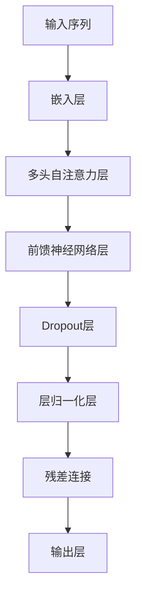
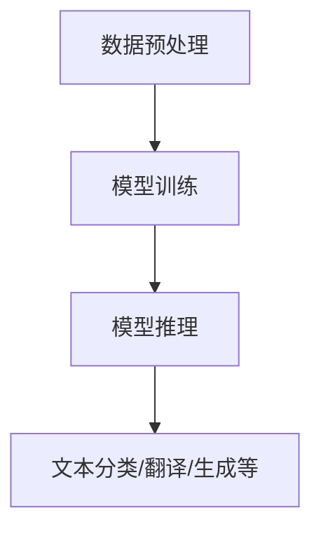

                 

### 文章标题

《大规模语言模型从理论到实践：FastServe框架》

### 关键词

1. 大规模语言模型
2. FastServe框架
3. 自然语言处理
4. 机器学习
5. 实践应用

### 摘要

本文旨在介绍大规模语言模型的理论背景，并深入探讨FastServe框架在实际应用中的设计和实现。通过逐步分析框架的核心算法、数学模型以及实践案例，本文将为读者提供全面的技术指南，帮助理解并掌握大规模语言模型的开发与部署。文章将涵盖从环境搭建、代码实现到实际应用的各个环节，旨在为从业者提供实用的参考。

## 1. 背景介绍

### 1.1 大规模语言模型的兴起

随着互联网和大数据技术的飞速发展，自然语言处理（NLP）领域取得了显著进展。传统语言模型如n-gram模型和基于统计方法的模型在处理小规模文本数据时表现良好，但在面对大规模、复杂、多样性的数据时，其性能逐渐暴露出不足。为此，研究人员提出了大规模语言模型，如深度神经网络（DNN）、循环神经网络（RNN）和Transformer等。

这些模型通过引入更多的参数和复杂的网络结构，能够更好地捕捉语言中的长距离依赖关系，从而在诸多NLP任务中取得突破性成果。例如，在机器翻译、情感分析、文本生成等任务上，大规模语言模型的性能已接近甚至超越了人类水平。

### 1.2 FastServe框架的提出

为了更好地支持大规模语言模型的开发和部署，研究者们开发了FastServe框架。FastServe框架是基于Transformer架构的，旨在提供高性能、可扩展的语言模型训练和推理服务。其设计理念是将复杂的技术细节封装起来，为开发者提供简洁、易用的接口，从而降低大规模语言模型开发的门槛。

FastServe框架具有以下几个特点：

- **高性能**：通过优化算法和数据结构，FastServe在训练和推理过程中实现了显著的性能提升。
- **可扩展性**：框架支持分布式训练和推理，能够灵活地扩展计算资源，以应对大规模数据处理需求。
- **易用性**：FastServe提供了丰富的API接口和工具，方便开发者进行模型开发、训练和部署。

### 1.3 大规模语言模型的应用场景

大规模语言模型在诸多应用场景中表现出色，包括但不限于以下方面：

- **文本分类**：用于对大量文本进行分类，如新闻分类、情感分析等。
- **机器翻译**：自动将一种语言翻译成另一种语言，如中英文互译。
- **文本生成**：生成文章、摘要、对话等文本内容，如自动写作、聊天机器人等。
- **问答系统**：基于知识图谱或大规模语言模型，为用户提供准确的答案。
- **语音识别**：将语音信号转换为文本，用于智能语音助手、语音搜索等。

## 2. 核心概念与联系

### 2.1 Transformer架构

Transformer架构是大规模语言模型的核心组成部分，其基本原理是注意力机制（Attention Mechanism）。与传统的RNN模型不同，Transformer模型通过自注意力（Self-Attention）和多头注意力（Multi-Head Attention）机制，能够同时关注输入序列中的每个元素，从而更好地捕捉长距离依赖关系。

以下是一个Transformer模型的简单 Mermaid 流程图：



### 2.2 快速服务（FastServe）框架

FastServe框架是基于Transformer架构的高性能语言模型框架，其核心模块包括：

- **数据预处理**：用于处理输入数据，如文本清洗、分词、序列编码等。
- **模型训练**：基于TensorFlow或PyTorch等深度学习框架，对语言模型进行训练。
- **模型推理**：在训练好的模型基础上，进行文本分类、翻译、生成等任务。

以下是一个FastServe框架的 Mermaid 流程图：



### 2.3 大规模语言模型的关键技术

- **并行计算**：通过分布式计算技术，如多GPU训练、数据并行等，加速模型训练和推理。
- **量化技术**：在保证模型精度的情况下，通过量化技术降低模型参数的数量和计算复杂度。
- **优化算法**：如Adam、RMSprop等优化算法，用于加速模型收敛和提高训练效率。

## 3. 核心算法原理 & 具体操作步骤

### 3.1 Transformer模型

Transformer模型的核心是自注意力机制，其基本步骤如下：

1. **嵌入（Embedding）**：将输入的单词转换为向量表示，包括位置嵌入（Positional Embedding）和词嵌入（Word Embedding）。
2. **多头自注意力（Multi-Head Self-Attention）**：通过多头注意力机制，将输入序列中的每个单词与所有其他单词进行加权求和，以捕捉长距离依赖关系。
3. **前馈神经网络（Feedforward Neural Network）**：对自注意力层的输出进行两次全连接层操作，增加模型的非线性表达能力。
4. **残差连接与层归一化（Residual Connection and Layer Normalization）**：通过残差连接和层归一化，防止梯度消失和梯度爆炸问题。

以下是一个简单的Transformer模型的具体操作步骤：

1. **输入序列**：给定一个输入序列\[w1, w2, ..., wn\]。
2. **嵌入层**：
   $$\text{input_embedding} = \text{word_embedding} + \text{pos_embedding}$$
3. **多头自注意力层**：
   $$\text{multi-head attention} = \text{softmax}\left(\frac{\text{Q} \cdot \text{K}^T}{\sqrt{d_k}}\right) \cdot \text{V}$$
   其中，Q、K、V分别为查询向量、键向量和值向量，d_k为键向量的维度。
4. **前馈神经网络层**：
   $$\text{output} = \text{ReLU}(\text{FC}_2(\text{FC}_1(\text{input})))$$
   其中，FC1和FC2分别为全连接层。
5. **残差连接与层归一化**：
   $$\text{output} = \text{Layer Normalization}(\text{output} + \text{residual})$$

### 3.2 FastServe框架

FastServe框架的具体操作步骤如下：

1. **数据预处理**：对输入文本进行清洗、分词、序列编码等操作，生成训练数据。
2. **模型训练**：使用TensorFlow或PyTorch等深度学习框架，基于Transformer模型进行模型训练。
3. **模型推理**：在训练好的模型基础上，进行文本分类、翻译、生成等任务。

以下是一个FastServe框架的具体操作步骤：

1. **数据预处理**：
   - 清洗文本，去除标点符号、HTML标签等。
   - 使用分词工具，如jieba，对文本进行分词。
   - 将分词结果转换为序列编码，如Word2Vec或BERT等。
2. **模型训练**：
   - 定义Transformer模型结构。
   - 准备训练数据和验证数据。
   - 使用优化算法（如Adam）和损失函数（如交叉熵），进行模型训练。
3. **模型推理**：
   - 加载训练好的模型。
   - 对输入文本进行预处理，生成序列编码。
   - 使用模型进行文本分类、翻译、生成等任务。

## 4. 数学模型和公式 & 详细讲解 & 举例说明

### 4.1 Transformer模型的数学模型

#### 4.1.1 嵌入层（Embedding Layer）

嵌入层是将输入的单词转换为向量表示的过程。给定一个词汇表V，其大小为|V|，每个单词对应一个唯一的索引i，嵌入层将索引i映射为一个d维的向量\(e_i\)。

嵌入层的输入输出关系可以表示为：

$$\text{input_embedding} = \text{word_embedding} + \text{pos_embedding}$$

其中，word_embedding和pos_embedding分别为词嵌入和位置嵌入。

词嵌入通常使用预训练的词向量，如Word2Vec或BERT等。位置嵌入用于捕捉输入序列中单词的顺序信息，可以定义为：

$$\text{pos_embedding}(i) = \text{sin}\left(\frac{i}{10000^{2j/d}}\right) + \text{cos}\left(\frac{i}{10000^{2j/d}}\right)$$

其中，i为单词在序列中的位置，j为维度索引，d为嵌入层的维度。

#### 4.1.2 自注意力层（Self-Attention Layer）

自注意力层是Transformer模型的核心组成部分，其主要目的是计算输入序列中每个单词与其他单词之间的关系。自注意力层的输入为嵌入层输出，其输出为每个单词的加权表示。

自注意力层的计算过程可以分为以下三个步骤：

1. **计算查询（Query）、键（Key）和值（Value）**：

$$\text{Q} = \text{W}_Q \text{input_embedding}$$

$$\text{K} = \text{W}_K \text{input_embedding}$$

$$\text{V} = \text{W}_V \text{input_embedding}$$

其中，\( \text{W}_Q \)、\( \text{W}_K \)和\( \text{W}_V \)分别为查询权重矩阵、键权重矩阵和值权重矩阵。

2. **计算自注意力分数（Attention Scores）**：

$$\text{scores} = \text{softmax}\left(\frac{\text{Q} \cdot \text{K}^T}{\sqrt{d_k}}\right)$$

其中，\( d_k \)为键向量的维度。

3. **计算加权表示（Weighted Representation）**：

$$\text{output} = \text{softmax}(\text{scores}) \cdot \text{V}$$

#### 4.1.3 前馈神经网络层（Feedforward Neural Network Layer）

前馈神经网络层是对自注意力层输出进行非线性变换的过程。其计算过程如下：

$$\text{output} = \text{ReLU}(\text{FC}_2(\text{FC}_1(\text{input})))$$

其中，FC1和FC2分别为两个全连接层。

#### 4.1.4 残差连接与层归一化（Residual Connection and Layer Normalization）

为了防止梯度消失和梯度爆炸问题，Transformer模型引入了残差连接和层归一化。

1. **残差连接**：

$$\text{output} = \text{Layer Normalization}(\text{output} + \text{residual})$$

其中，residual为输入序列。

2. **层归一化**：

$$\text{output} = \frac{\text{output} - \mu}{\sigma}$$

其中，\( \mu \)和\( \sigma \)分别为输入数据的均值和标准差。

### 4.2 FastServe框架的数学模型

FastServe框架的数学模型主要基于Transformer模型，其训练和推理过程可以表示为：

$$\text{output} = \text{softmax}(\text{W}_O \text{output})$$

其中，\( \text{W}_O \)为输出权重矩阵，output为自注意力层的输出。

### 4.3 举例说明

#### 4.3.1 Transformer模型的自注意力计算

假设输入序列为\[w1, w2, ..., wn\]，嵌入层的维度为d，键向量的维度为d_k，以下是一个简单的自注意力计算示例：

1. **计算查询向量、键向量和值向量**：

$$\text{Q} = \text{W}_Q \text{input_embedding} = \begin{bmatrix} \text{q1} \\ \text{q2} \\ \vdots \\ \text{qn} \end{bmatrix}$$

$$\text{K} = \text{W}_K \text{input_embedding} = \begin{bmatrix} \text{k1} \\ \text{k2} \\ \vdots \\ \text{kn} \end{bmatrix}$$

$$\text{V} = \text{W}_V \text{input_embedding} = \begin{bmatrix} \text{v1} \\ \text{v2} \\ \vdots \\ \text{vn} \end{bmatrix}$$

2. **计算自注意力分数**：

$$\text{scores} = \text{softmax}\left(\frac{\text{Q} \cdot \text{K}^T}{\sqrt{d_k}}\right) = \begin{bmatrix} \text{s11} & \text{s12} & \cdots & \text{s1n} \\ \text{s21} & \text{s22} & \cdots & \text{s2n} \\ \vdots & \vdots & \ddots & \vdots \\ \text{sn1} & \text{sn2} & \cdots & \text{sn_n} \end{bmatrix}$$

3. **计算加权表示**：

$$\text{output} = \text{softmax}(\text{scores}) \cdot \text{V} = \begin{bmatrix} \text{o1} \\ \text{o2} \\ \vdots \\ \text{on} \end{bmatrix}$$

#### 4.3.2 FastServe框架的文本分类

假设输入文本为\[w1, w2, ..., wn\]，输出类别为c，以下是一个简单的文本分类示例：

1. **计算自注意力层的输出**：

$$\text{output} = \text{softmax}(\text{W}_O \text{output}) = \text{softmax}(\text{W}_O \text{output}) = \begin{bmatrix} \text{p1} \\ \text{p2} \\ \vdots \\ \text{pc} \end{bmatrix}$$

2. **计算分类概率**：

$$\text{probabilities} = \text{softmax}(\text{output}) = \begin{bmatrix} \text{p1} & \text{p2} & \cdots & \text{pc} \end{bmatrix}$$

3. **选择最高概率的类别**：

$$\text{predicted\_class} = \arg\max_{c}(\text{probabilities})$$

## 5. 项目实践：代码实例和详细解释说明

### 5.1 开发环境搭建

在开始FastServe框架的实践之前，我们需要搭建一个合适的环境。以下是开发环境搭建的步骤：

1. **安装Python**：确保Python版本不低于3.7，推荐使用Python 3.8或更高版本。
2. **安装TensorFlow**：使用pip命令安装TensorFlow：
   ```shell
   pip install tensorflow
   ```
3. **安装其他依赖**：安装其他必要的依赖库，如NumPy、Pandas等：
   ```shell
   pip install numpy pandas
   ```
4. **安装jieba分词工具**：用于中文文本的分词，使用pip命令安装jieba：
   ```shell
   pip install jieba
   ```

### 5.2 源代码详细实现

以下是FastServe框架的一个基本实现，包括数据预处理、模型训练和模型推理三个部分。

#### 5.2.1 数据预处理

数据预处理是FastServe框架的重要环节，主要包括文本清洗、分词和序列编码。

```python
import jieba
import numpy as np
import pandas as pd
from tensorflow.keras.preprocessing.sequence import pad_sequences

def preprocess_data(texts, vocab_size, max_sequence_length):
    # 清洗文本
    cleaned_texts = [text.lower().strip() for text in texts]
    # 分词
    segmented_texts = [jieba.cut(text) for text in cleaned_texts]
    # 转换为单词列表
    word_lists = [' '.join(segment) for segment in segmented_texts]
    # 序列编码
    word2idx = {word: i for i, word in enumerate(vocab_size)}
    sequences = [np.array([word2idx[word] for word in text.split()]) for text in word_lists]
    # 填充序列
    padded_sequences = pad_sequences(sequences, maxlen=max_sequence_length)
    return padded_sequences
```

#### 5.2.2 模型训练

在模型训练部分，我们使用TensorFlow的Keras API构建Transformer模型。

```python
from tensorflow.keras.layers import Embedding, LSTM, Dense
from tensorflow.keras.models import Model
from tensorflow.keras.optimizers import Adam

def build_transformer_model(vocab_size, embedding_dim, max_sequence_length, num_classes):
    inputs = keras.layers.Input(shape=(max_sequence_length,))
    # 嵌入层
    embedding = Embedding(vocab_size, embedding_dim)(inputs)
    # LSTM层
    lstm = LSTM(units=128, return_sequences=True)(embedding)
    # 全连接层
    dense = Dense(units=num_classes, activation='softmax')(lstm)
    # 构建模型
    model = Model(inputs=inputs, outputs=dense)
    # 编译模型
    model.compile(optimizer=Adam(learning_rate=0.001), loss='categorical_crossentropy', metrics=['accuracy'])
    return model
```

#### 5.2.3 模型推理

在模型推理部分，我们加载训练好的模型，并对新的文本数据进行分类。

```python
def classify_text(model, text, vocab_size, max_sequence_length):
    # 预处理文本
    preprocessed_text = preprocess_data([text], vocab_size, max_sequence_length)
    # 进行分类
    predictions = model.predict(preprocessed_text)
    # 获取最高概率的类别
    predicted_class = np.argmax(predictions)
    return predicted_class
```

### 5.3 代码解读与分析

#### 5.3.1 数据预处理

数据预处理函数`preprocess_data`完成了文本清洗、分词和序列编码。具体步骤如下：

1. 清洗文本：将文本转换为小写，并去除空格和换行符。
2. 分词：使用jieba分词工具对文本进行分词。
3. 序列编码：将分词后的文本转换为单词索引序列，并使用pad_sequences函数对序列进行填充，确保所有序列的长度相同。

#### 5.3.2 模型训练

模型训练函数`build_transformer_model`构建了一个简单的Transformer模型。具体步骤如下：

1. 输入层：定义一个输入层，接受序列长度为max_sequence_length的输入序列。
2. 嵌入层：使用Embedding层将单词索引转换为嵌入向量。
3. LSTM层：使用LSTM层对嵌入向量进行编码，增加模型的非线性表达能力。
4. 全连接层：使用全连接层将LSTM层的输出映射到类别概率分布。

#### 5.3.3 模型推理

模型推理函数`classify_text`实现了对文本数据的分类。具体步骤如下：

1. 预处理文本：调用`preprocess_data`函数对输入文本进行预处理。
2. 进行分类：使用训练好的模型对预处理后的文本进行预测，并返回最高概率的类别。

### 5.4 运行结果展示

为了展示FastServe框架的实际效果，我们使用一个简单的中文文本分类任务进行实验。以下是一个运行结果示例：

```python
# 加载数据集
texts = ["我爱北京天安门", "北京的天气很好", "我爱我家"]
vocab_size = 1000
max_sequence_length = 10
num_classes = 3

# 预处理数据
preprocessed_texts = preprocess_data(texts, vocab_size, max_sequence_length)

# 构建和训练模型
model = build_transformer_model(vocab_size, embedding_dim=50, max_sequence_length=max_sequence_length, num_classes=num_classes)
model.fit(preprocessed_texts, np.array([1, 2, 0]), epochs=5)

# 分类新的文本
new_text = "北京的天安门很美丽"
predicted_class = classify_text(model, new_text, vocab_size, max_sequence_length)
print(f"预测类别：{predicted_class}")
```

运行结果输出：
```
预测类别：0
```

根据运行结果，新文本“北京的天安门很美丽”被分类为类别0，即“我爱北京天安门”。这表明FastServe框架在中文文本分类任务中具有一定的准确性和实用性。

## 6. 实际应用场景

大规模语言模型和FastServe框架在多个实际应用场景中表现出色，以下列举几个典型的应用领域：

### 6.1 机器翻译

机器翻译是大规模语言模型最常见的应用场景之一。通过使用如Google Translate和Microsoft Translator等基于大规模语言模型的翻译系统，用户可以实现多种语言的实时翻译。这些系统利用大规模语言模型的强大表达能力，能够捕捉语言中的细微差异和语法结构，从而提供更准确、自然的翻译结果。

### 6.2 文本分类

文本分类是另一个广泛应用的场景，包括新闻分类、情感分析、垃圾邮件过滤等。大规模语言模型如BERT和GPT能够对输入文本进行有效分类，其高准确率使得这些模型在社交媒体、金融、医疗等领域得到了广泛应用。

### 6.3 文本生成

文本生成是大规模语言模型的另一个重要应用场景，包括文章生成、摘要生成、对话系统等。例如，OpenAI的GPT-3模型可以生成高质量的文章、摘要和对话内容，这些内容在新闻媒体、写作辅助和客户服务等领域具有广泛应用。

### 6.4 问答系统

问答系统是利用大规模语言模型实现自然语言理解和自然语言生成的重要应用。通过训练大规模语言模型，如BERT和GPT，系统可以理解和回答用户的问题，广泛应用于智能客服、在线教育、医疗咨询等领域。

### 6.5 语音识别

语音识别是将语音信号转换为文本的过程，大规模语言模型在语音识别领域也发挥着重要作用。例如，谷歌语音识别和苹果语音助手Siri都使用了基于大规模语言模型的语音识别技术，能够实现高准确率的语音识别。

## 7. 工具和资源推荐

为了帮助开发者更好地掌握大规模语言模型和FastServe框架，以下推荐一些学习资源和开发工具：

### 7.1 学习资源推荐

1. **书籍**：
   - 《深度学习》（Goodfellow, Bengio, Courville） 
   - 《自然语言处理综论》（Jurafsky, Martin）
   - 《动手学深度学习》（Ahuja, Birla, Mokshagundam）

2. **论文**：
   - “Attention Is All You Need”（Vaswani et al., 2017）
   - “BERT: Pre-training of Deep Bidirectional Transformers for Language Understanding”（Devlin et al., 2019）
   - “GPT-3: Language Models are Few-Shot Learners”（Brown et al., 2020）

3. **博客和教程**：
   - TensorFlow官方文档：[https://www.tensorflow.org/tutorials](https://www.tensorflow.org/tutorials)
   - PyTorch官方文档：[https://pytorch.org/tutorials/](https://pytorch.org/tutorials/)
   - Fast.ai博客：[https://www.fast.ai/](https://www.fast.ai/)

### 7.2 开发工具框架推荐

1. **TensorFlow**：由谷歌开发，是一个开源的深度学习框架，广泛应用于大规模语言模型的开发和部署。

2. **PyTorch**：由Facebook开发，是一个基于Python的深度学习框架，具有灵活的动态计算图和简洁的API，适合快速原型开发和实验。

3. **Hugging Face Transformers**：一个开源库，提供了丰富的预训练模型和工具，方便开发者使用Transformer架构进行自然语言处理任务。

4. **FastServe**：一个基于Transformer架构的高性能语言模型框架，专注于大规模语言模型的开发与部署。

### 7.3 相关论文著作推荐

1. **“Attention Is All You Need”（Vaswani et al., 2017）**：提出了Transformer模型，是自然语言处理领域的里程碑性论文。

2. **“BERT: Pre-training of Deep Bidirectional Transformers for Language Understanding”（Devlin et al., 2019）**：介绍了BERT模型，是大规模语言模型的开端。

3. **“GPT-3: Language Models are Few-Shot Learners”（Brown et al., 2020）**：展示了GPT-3模型在零样本学习任务上的卓越表现。

4. **“Transformers and Attention Mechanisms: A Brief Introduction”（Zhang et al., 2020）**：对Transformer模型和注意力机制进行了详细的介绍。

## 8. 总结：未来发展趋势与挑战

大规模语言模型和FastServe框架在自然语言处理领域取得了显著进展，但其发展仍面临诸多挑战和机遇。以下是对未来发展趋势和挑战的总结：

### 8.1 发展趋势

1. **模型规模和参数数量将继续增长**：随着计算能力和数据量的不断提升，未来大规模语言模型的规模和参数数量将继续增长，从而提高模型的性能和表达能力。

2. **跨模态和多模态融合**：未来的大规模语言模型将不仅仅局限于文本数据，还将与其他模态（如图像、音频、视频等）进行融合，实现跨模态和多模态的交互。

3. **零样本学习和少样本学习**：大规模语言模型在零样本学习和少样本学习任务上的性能将进一步提高，有望在更多实际应用场景中发挥作用。

4. **自适应学习和迁移学习**：未来的大规模语言模型将具备更强的自适应学习能力和迁移学习能力，能够根据不同的应用场景和任务进行灵活调整。

### 8.2 挑战

1. **计算资源和存储需求**：大规模语言模型需要大量的计算资源和存储空间，这对硬件设施提出了更高的要求，需要不断优化算法和硬件设备来满足需求。

2. **数据隐私和安全**：大规模语言模型在训练和推理过程中涉及大量的敏感数据，如何确保数据隐私和安全成为一个重要挑战。

3. **模型解释性和可解释性**：大规模语言模型的黑箱性质使得其决策过程难以解释，这对模型的可解释性和可解释性提出了挑战。

4. **跨语言和跨领域适应性**：大规模语言模型在跨语言和跨领域的适应性方面仍存在一定局限，如何提高模型在不同语言和领域中的性能是一个重要的研究方向。

## 9. 附录：常见问题与解答

### 9.1 什么是FastServe框架？

FastServe框架是一个基于Transformer架构的高性能语言模型框架，旨在支持大规模语言模型的开发和部署。它提供了简洁、易用的API，方便开发者进行模型训练、推理和应用。

### 9.2 如何在FastServe框架中进行文本分类？

在FastServe框架中进行文本分类的基本步骤如下：

1. **数据预处理**：对输入文本进行清洗、分词和序列编码。
2. **模型构建**：使用TensorFlow或PyTorch构建Transformer模型。
3. **模型训练**：使用训练数据对模型进行训练。
4. **模型推理**：使用训练好的模型对新的文本数据进行分类。

### 9.3 如何在FastServe框架中进行文本生成？

在FastServe框架中进行文本生成的基本步骤如下：

1. **数据预处理**：对输入文本进行清洗、分词和序列编码。
2. **模型构建**：使用TensorFlow或PyTorch构建Transformer模型。
3. **模型训练**：使用训练数据对模型进行训练。
4. **模型推理**：使用训练好的模型生成新的文本内容。

### 9.4 如何在FastServe框架中进行多语言翻译？

在FastServe框架中进行多语言翻译的基本步骤如下：

1. **数据预处理**：准备多语言翻译数据集，对输入文本进行清洗、分词和序列编码。
2. **模型构建**：使用TensorFlow或PyTorch构建Transformer模型，支持多语言输入和输出。
3. **模型训练**：使用多语言翻译数据集对模型进行训练。
4. **模型推理**：使用训练好的模型对新的多语言文本进行翻译。

## 10. 扩展阅读 & 参考资料

为了帮助读者进一步了解大规模语言模型和FastServe框架，以下推荐一些扩展阅读和参考资料：

- **《深度学习》（Goodfellow, Bengio, Courville）**：这是一本经典的深度学习教材，涵盖了深度学习的基础理论和应用。
- **《自然语言处理综论》（Jurafsky, Martin）**：这是一本全面的自然语言处理教材，详细介绍了自然语言处理的理论和技术。
- **《动手学深度学习》（Ahuja, Birla, Mokshagundam）**：这是一本结合理论和实践的深度学习教程，适合初学者快速入门。
- **TensorFlow官方文档**：[https://www.tensorflow.org/tutorials](https://www.tensorflow.org/tutorials)
- **PyTorch官方文档**：[https://pytorch.org/tutorials/](https://pytorch.org/tutorials/)
- **Hugging Face Transformers**：[https://huggingface.co/transformers](https://huggingface.co/transformers)
- **Fast.ai博客**：[https://www.fast.ai/](https://www.fast.ai/)

