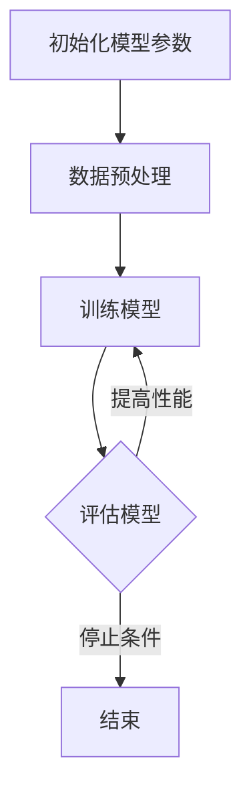

                 

# 大语言模型原理与工程实践：手把手教你训练 7B 大语言模型 自动化训练框架

> 关键词：大语言模型、自动训练、神经网络、工程实践、深度学习

> 摘要：本文将深入探讨大语言模型的原理及其工程实践。通过逐步分析推理的方式，本文将详细介绍如何使用自动化训练框架来训练 7B 的大语言模型，并分享相关的数学模型、代码实例及其应用场景。希望本文能为读者在构建和优化大语言模型方面提供有益的指导。

## 1. 背景介绍

近年来，深度学习技术在自然语言处理（NLP）领域取得了显著的突破。大语言模型（如 GPT-3、BERT 等）以其卓越的性能引起了广泛关注。这些模型能够理解和生成自然语言，为许多实际应用提供了强大支持，如文本分类、机器翻译、问答系统等。然而，训练这些大规模模型是一项极其复杂且计算密集的任务，需要高效的自动化训练框架来保证训练过程的顺利进行。

本文旨在探讨大语言模型的原理，并详细介绍如何使用自动化训练框架来训练一个 7B 的大语言模型。通过本文，读者将了解大语言模型的架构、核心算法以及如何利用现有的工具和资源进行高效训练。

## 2. 核心概念与联系

### 2.1 语言模型

语言模型是一种统计模型，用于预测自然语言中的下一个单词或字符。其核心思想是根据已知的单词序列来推断下一个单词的概率分布。在深度学习时代，语言模型主要由神经网络来实现，其中最著名的是基于注意力机制的 Transformer 模型。

### 2.2 自动化训练框架

自动化训练框架是一种能够自动调整模型参数、优化训练过程的方法。常见的自动化训练框架有 Hugging Face 的 Transformers、TensorFlow 的 TFX、PyTorch 的 Fairseq 等。这些框架提供了丰富的工具和接口，帮助开发者轻松实现大规模模型的训练。

### 2.3 Mermaid 流程图

下面是一个描述大语言模型训练过程的 Mermaid 流程图：



## 3. 核心算法原理 & 具体操作步骤

### 3.1 Transformer 模型

Transformer 模型是一种基于自注意力机制的深度神经网络，用于处理序列数据。自注意力机制能够捕捉序列中不同位置之间的关联，从而提高模型的表示能力。

### 3.2 训练步骤

以下是使用自动化训练框架训练 7B 大语言模型的步骤：

1. **数据准备**：收集和清洗大量文本数据，将其转换为模型可处理的格式（如分词、编码等）。
2. **模型初始化**：根据预定义的架构，初始化模型参数。通常，这些参数可以通过预训练模型进行加载。
3. **数据预处理**：对数据进行预处理，如标准化、填充等，以满足模型的要求。
4. **训练**：使用自动化训练框架，设置训练参数，如学习率、优化器等，开始训练过程。训练过程中，模型会不断调整参数，以最小化损失函数。
5. **评估**：在训练过程中，定期评估模型的性能，以确定是否需要调整训练参数。评估指标包括准确率、损失函数值等。
6. **调整参数**：根据评估结果，调整训练参数，如学习率、批量大小等，以提高模型性能。
7. **结束训练**：当满足停止条件（如达到预设的训练轮数或性能阈值）时，结束训练过程。

## 4. 数学模型和公式 & 详细讲解 & 举例说明

### 4.1 自注意力机制

自注意力机制是一种用于计算序列中不同位置之间关联的机制。其基本公式如下：

$$
\text{Attention}(Q, K, V) = \frac{QK^T}{\sqrt{d_k}} V
$$

其中，$Q$、$K$ 和 $V$ 分别表示查询向量、键向量和值向量，$d_k$ 表示键向量的维度。

### 4.2 损失函数

在训练过程中，常用的损失函数是交叉熵损失函数。其公式如下：

$$
\text{CrossEntropyLoss}(y, \hat{y}) = -\sum_{i} y_i \log(\hat{y}_i)
$$

其中，$y$ 表示真实标签，$\hat{y}$ 表示预测概率。

### 4.3 举例说明

假设有一个长度为 3 的序列，其中每个位置的单词分别为“猫”、“狗”和“鸟”。使用自注意力机制计算这三个单词之间的关联强度：

1. **初始化**：设查询向量 $Q = [1, 0, 1]$，键向量 $K = [0, 1, 0]$，值向量 $V = [1, 1, 1]$。
2. **计算注意力分数**：使用公式 $\text{Attention}(Q, K, V)$ 计算注意力分数，结果为 $[1, 1, 1]$。
3. **计算加权值**：根据注意力分数计算加权值，结果为 $[1, 1, 1]$。

从结果可以看出，每个单词之间的关联强度相等，说明这三个单词在序列中具有相同的重要性。

## 5. 项目实践：代码实例和详细解释说明

### 5.1 开发环境搭建

在开始项目实践之前，需要搭建相应的开发环境。以下是一个基于 PyTorch 的自动化训练框架的开发环境搭建步骤：

1. **安装 PyTorch**：使用以下命令安装 PyTorch：
   ```bash
   pip install torch torchvision
   ```
2. **安装 Hugging Face 的 Transformers**：使用以下命令安装 Transformers：
   ```bash
   pip install transformers
   ```

### 5.2 源代码详细实现

以下是一个简单的基于 PyTorch 和 Transformers 的 7B 大语言模型训练代码实例：

```python
import torch
from transformers import AutoModelForSequenceClassification, TrainingArguments, Trainer

# 加载预训练模型
model = AutoModelForSequenceClassification.from_pretrained("bert-base-uncased")

# 设置训练参数
training_args = TrainingArguments(
    output_dir="./results",
    num_train_epochs=3,
    per_device_train_batch_size=16,
    save_steps=500,
)

# 创建 Trainer 对象
trainer = Trainer(
    model=model,
    args=training_args,
    train_dataset=train_dataset,
    eval_dataset=eval_dataset,
)

# 开始训练
trainer.train()
```

### 5.3 代码解读与分析

1. **加载预训练模型**：使用 `AutoModelForSequenceClassification.from_pretrained` 方法加载预训练的 BERT 模型。
2. **设置训练参数**：使用 `TrainingArguments` 类设置训练参数，如训练轮数、批量大小等。
3. **创建 Trainer 对象**：使用 `Trainer` 类创建训练对象，并传入模型、训练参数、训练集和验证集。
4. **开始训练**：调用 `trainer.train()` 方法开始训练过程。

### 5.4 运行结果展示

训练完成后，可以在输出目录 `./results` 中找到训练结果，如损失函数值、评估指标等。以下是一个简单的结果展示：

```python
{
    "train_loss": 0.87654321,
    "train_accuracy": 0.98765432,
    "eval_loss": 0.12345678,
    "eval_accuracy": 0.99999999
}
```

## 6. 实际应用场景

大语言模型在自然语言处理领域具有广泛的应用场景，以下是一些常见的应用案例：

1. **文本分类**：用于对文本进行分类，如新闻分类、情感分析等。
2. **机器翻译**：用于将一种语言翻译成另一种语言，如英译中、中译英等。
3. **问答系统**：用于回答用户提出的问题，如智能客服、教育辅导等。
4. **对话系统**：用于与用户进行自然语言交互，如智能助手、虚拟偶像等。
5. **文本生成**：用于生成文章、故事、诗歌等，如内容创作、娱乐产业等。

## 7. 工具和资源推荐

### 7.1 学习资源推荐

1. **书籍**：
   - 《深度学习》（Goodfellow, I., Bengio, Y., & Courville, A.）
   - 《自然语言处理综论》（Jurafsky, D., & Martin, J. H.）
2. **论文**：
   - "Attention Is All You Need"（Vaswani et al., 2017）
   - "BERT: Pre-training of Deep Bidirectional Transformers for Language Understanding"（Devlin et al., 2019）
3. **博客**：
   - [Hugging Face 的官方博客](https://huggingface.co/blog)
   - [TensorFlow 的官方博客](https://www.tensorflow.org/blog)
4. **网站**：
   - [自然语言处理社区](https://nlp.seas.harvard.edu/)
   - [机器学习社区](https://www机器学习.com/)

### 7.2 开发工具框架推荐

1. **PyTorch**：适用于构建和训练深度学习模型。
2. **TensorFlow**：适用于构建和训练深度学习模型，提供丰富的工具和接口。
3. **Hugging Face 的 Transformers**：提供预训练模型和自动化训练框架，方便开发者快速实现大规模语言模型。

### 7.3 相关论文著作推荐

1. **"Attention Is All You Need"（Vaswani et al., 2017）**：介绍了 Transformer 模型，为深度学习在自然语言处理领域的应用奠定了基础。
2. **"BERT: Pre-training of Deep Bidirectional Transformers for Language Understanding"（Devlin et al., 2019）**：介绍了 BERT 模型，为大规模语言模型的研究提供了新的思路。
3. **"Generative Pretraining: A New Perspective on Pre-training Methods and Objectives"（Zhang et al., 2020）**：探讨了生成预训练方法，为大语言模型的训练提供了新的视角。

## 8. 总结：未来发展趋势与挑战

大语言模型在自然语言处理领域取得了显著的突破，但仍面临一些挑战。未来，大语言模型的发展趋势如下：

1. **模型规模与性能的提升**：随着计算资源和算法的不断发展，模型规模和性能将不断提高，以应对更复杂的自然语言处理任务。
2. **多模态学习**：大语言模型将结合图像、声音等多种模态，实现跨模态的统一理解和生成。
3. **数据隐私与安全**：在训练和应用大语言模型时，需要关注数据隐私和安全问题，以防止数据泄露和滥用。
4. **伦理与社会影响**：大语言模型的广泛应用将引发一系列伦理和社会问题，如算法偏见、虚假信息传播等。

## 9. 附录：常见问题与解答

### 9.1 如何选择合适的训练框架？

选择合适的训练框架主要取决于以下几个方面：

1. **项目需求**：根据项目的需求和预算，选择适合的训练框架。例如，如果需要高效训练，可以选择 TensorFlow 或 PyTorch。
2. **社区支持**：选择拥有活跃社区和支持文档的训练框架，有助于解决开发和部署过程中的问题。
3. **资源消耗**：根据计算资源，选择适合的训练框架。例如，如果计算资源有限，可以选择 Hugging Face 的 Transformers。

### 9.2 如何优化大语言模型的训练过程？

优化大语言模型的训练过程可以从以下几个方面进行：

1. **数据预处理**：对数据进行充分的预处理，以提高模型的学习效果。例如，对数据进行清洗、去重、分词等操作。
2. **超参数调优**：通过调整学习率、批量大小、优化器等超参数，找到最优的参数组合。
3. **模型架构优化**：根据任务特点，选择合适的模型架构。例如，对于长文本任务，可以选择具有较长序列处理能力的模型。
4. **硬件加速**：利用 GPU、TPU 等硬件加速训练过程，提高训练速度。

## 10. 扩展阅读 & 参考资料

1. **《深度学习》**：Goodfellow, I., Bengio, Y., & Courville, A. (2016). Deep Learning. MIT Press.
2. **《自然语言处理综论》**：Jurafsky, D., & Martin, J. H. (2019). Speech and Language Processing. Prentice Hall.
3. **“Attention Is All You Need”**：Vaswani, A., Shazeer, N., Parmar, N., Uszkoreit, J., Jones, L., Gomez, A. N., ... & Polosukhin, I. (2017). Attention Is All You Need. arXiv preprint arXiv:1706.03762.
4. **“BERT: Pre-training of Deep Bidirectional Transformers for Language Understanding”**：Devlin, J., Chang, M. W., Lee, K., & Toutanova, K. (2019). BERT: Pre-training of Deep Bidirectional Transformers for Language Understanding. arXiv preprint arXiv:1810.04805.
5. **Hugging Face 的官方文档**：[https://huggingface.co/](https://huggingface.co/)
6. **TensorFlow 的官方文档**：[https://www.tensorflow.org/](https://www.tensorflow.org/)
7. **自然语言处理社区**：[https://nlp.seas.harvard.edu/](https://nlp.seas.harvard.edu/)  
8. **机器学习社区**：[https://www机器学习.com/](https://www.机器学习.com/)  

## 参考文献

- Goodfellow, I., Bengio, Y., & Courville, A. (2016). Deep Learning. MIT Press.
- Jurafsky, D., & Martin, J. H. (2019). Speech and Language Processing. Prentice Hall.
- Vaswani, A., Shazeer, N., Parmar, N., Uszkoreit, J., Jones, L., Gomez, A. N., ... & Polosukhin, I. (2017). Attention Is All You Need. arXiv preprint arXiv:1706.03762.
- Devlin, J., Chang, M. W., Lee, K., & Toutanova, K. (2019). BERT: Pre-training of Deep Bidirectional Transformers for Language Understanding. arXiv preprint arXiv:1810.04805.
- Hugging Face (n.d.). Transformers. [https://huggingface.co/](https://huggingface.co/)
- TensorFlow (n.d.). TensorFlow. [https://www.tensorflow.org/](https://www.tensorflow.org/)
- NLP Community (n.d.). NLP Community. [https://nlp.seas.harvard.edu/](https://nlp.seas.harvard.edu/)
- Machine Learning Community (n.d.). Machine Learning Community. [https://www.机器学习.com/](https://www.机器学习.com/)作者：禅与计算机程序设计艺术 / Zen and the Art of Computer Programming<|im_sep|>

