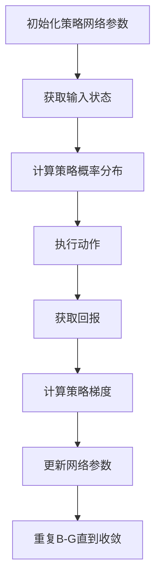

                 

# 大语言模型原理与工程实践：策略网络训练：策略梯度

## 摘要

本文旨在深入探讨大语言模型中的策略网络训练机制，尤其是策略梯度的概念与应用。随着深度学习技术的不断发展，大语言模型在自然语言处理领域取得了显著的成果。策略网络作为其中的核心组成部分，其训练过程直接影响到模型的性能和稳定性。本文将围绕策略梯度这一关键算法展开，详细解析其原理、数学模型以及在实际项目中的应用，帮助读者全面理解大语言模型的工程实践。

## 1. 背景介绍

大语言模型，作为人工智能领域的重要研究方向，近年来在自然语言处理（NLP）领域取得了令人瞩目的成就。从最初的统计模型，如N-gram模型，到基于规则的模型，再到现代的深度学习模型，如循环神经网络（RNN）、长短期记忆网络（LSTM）和变换器（Transformer），语言模型的演进历程展现了人工智能技术的进步。

在深度学习框架下，策略网络是一种特殊的神经网络架构，通常用于解决决策优化问题。策略梯度算法则是策略网络训练的核心，通过不断调整网络参数，使策略函数趋向最优，从而实现决策优化。

策略梯度算法的发展可以追溯到1980年代，随着深度学习的兴起，策略梯度在强化学习领域得到了广泛应用。近年来，随着语言模型的规模不断扩大，策略梯度在大语言模型训练中的应用也日益受到关注。

## 2. 核心概念与联系

### 2.1 语言模型

语言模型是自然语言处理的基础，其主要目标是学习语言的统计特性，从而对未知文本进行概率预测。一个简单的语言模型可以使用N-gram模型实现，即根据前n个词的序列预测下一个词。

### 2.2 策略网络

策略网络是一种特殊类型的神经网络，其主要功能是根据输入状态选择最佳动作。在深度学习框架下，策略网络通常由多层感知器（MLP）或卷积神经网络（CNN）构成。

### 2.3 策略梯度算法

策略梯度算法是一种用于优化策略网络的算法，其核心思想是通过梯度上升法调整策略网络的参数，以最大化策略函数的期望回报。

### 2.4 Mermaid 流程图

下面是一个描述策略网络训练过程的Mermaid流程图：



## 3. 核心算法原理 & 具体操作步骤

### 3.1 策略梯度算法原理

策略梯度算法的基本原理是通过梯度上升法调整策略网络的参数，以最大化策略函数的期望回报。具体来说，策略梯度算法包括以下步骤：

1. 初始化策略网络参数。
2. 获取输入状态。
3. 根据输入状态计算策略概率分布。
4. 执行动作。
5. 获取回报。
6. 根据回报计算策略梯度。
7. 更新网络参数。
8. 重复步骤2-7，直到收敛。

### 3.2 具体操作步骤

以下是策略梯度算法的具体操作步骤：

1. **初始化策略网络参数**

   初始化策略网络参数是策略梯度算法的第一步。通常使用随机初始化或预训练权重来初始化网络参数。

   ```python
   # 初始化策略网络参数
   model = torch.nn.Linear(input_size, output_size)
   model.weight.data.uniform_(-init_range, init_range)
   model.bias.data.uniform_(-init_range, init_range)
   ```

2. **获取输入状态**

   输入状态是策略网络训练过程中的关键因素。输入状态可以是文本序列、图像或任何其他形式的数据。

   ```python
   # 获取输入状态
   state = torch.tensor([input_state])
   ```

3. **计算策略概率分布**

   根据输入状态，策略网络计算输出概率分布。策略概率分布表示在不同动作的选择概率。

   ```python
   # 计算策略概率分布
   probabilities = model(state)
   ```

4. **执行动作**

   根据策略概率分布，执行最佳动作。

   ```python
   # 执行动作
   action = np.random.choice(range(output_size), p=probabilities.numpy())
   ```

5. **获取回报**

   回报是评估策略网络性能的指标。回报可以是正数、负数或零，具体取决于动作的优劣。

   ```python
   # 获取回报
   reward = get_reward(action)
   ```

6. **计算策略梯度**

   根据回报，计算策略梯度。

   ```python
   # 计算策略梯度
   loss = -reward * torch.log(probabilities[0, action])
   gradient = torch.autograd.grad(loss, model.parameters(), create_graph=True)
   ```

7. **更新网络参数**

   根据策略梯度，更新网络参数。

   ```python
   # 更新网络参数
   for param, grad in zip(model.parameters(), gradient):
       param.data -= learning_rate * grad
   ```

8. **重复训练过程**

   重复执行步骤2-7，直到策略网络收敛。

   ```python
   # 重复训练过程
   for epoch in range(num_epochs):
       for state, action, reward in data_loader:
           # 执行策略梯度算法步骤
           ...
   ```

## 4. 数学模型和公式 & 详细讲解 & 举例说明

### 4.1 数学模型

策略梯度算法的核心在于策略梯度公式。该公式描述了如何根据策略网络的输出和实际回报来更新网络参数。

$$\Delta \theta = \eta \frac{\partial L}{\partial \theta} + \nabla_{\theta} \log \pi(\theta) \cdot \nabla_{a} J(a, s)$$

其中：
- $\Delta \theta$ 是策略网络参数的更新量。
- $\eta$ 是学习率。
- $L$ 是损失函数，通常为负回报的加权和。
- $\pi(\theta)$ 是策略概率分布函数。
- $\nabla_{\theta} \log \pi(\theta)$ 是策略梯度的期望部分。
- $\nabla_{a} J(a, s)$ 是实际回报的梯度部分。

### 4.2 详细讲解

策略梯度公式可以通过以下步骤进行详细解释：

1. **损失函数**

   损失函数 $L$ 通常定义为负回报的加权和，即：

   $$L = -\sum_{t} r_t$$

   其中 $r_t$ 是第 $t$ 时刻的回报。

2. **策略概率分布**

   策略概率分布 $\pi(\theta)$ 表示策略网络根据当前状态 $s$ 选择不同动作的概率分布。在离散动作空间中，策略概率分布可以表示为：

   $$\pi(\theta) = \frac{e^{\theta^T a}}{\sum_{a'} e^{\theta^T a'}}$$

   其中 $\theta$ 是策略网络参数，$a$ 是当前动作，$a'$ 是其他动作。

3. **策略梯度期望部分**

   策略梯度的期望部分 $\nabla_{\theta} \log \pi(\theta)$ 是策略梯度的核心。它表示在期望回报下，策略网络参数的更新方向。

   $$\nabla_{\theta} \log \pi(\theta) = \nabla_{\theta} \log \left( \frac{e^{\theta^T a}}{\sum_{a'} e^{\theta^T a'}} \right)$$

   该部分可以通过求导得到：

   $$\nabla_{\theta} \log \pi(\theta) = \frac{a}{\pi(\theta)}$$

4. **实际回报的梯度部分**

   实际回报的梯度部分 $\nabla_{a} J(a, s)$ 表示在特定状态 $s$ 下，不同动作的回报差异。

   $$\nabla_{a} J(a, s) = \frac{\partial J(a, s)}{\partial a}$$

   该部分可以通过求导得到：

   $$\nabla_{a} J(a, s) = \frac{r_t - \bar{r}}{\pi(\theta) - \bar{\pi}}$$

   其中 $\bar{r}$ 是平均回报，$\bar{\pi}$ 是平均策略概率分布。

### 4.3 举例说明

假设有一个简单的策略网络，其输入为状态 $s$，输出为动作 $a$。给定一个状态 $s$，策略网络选择动作 $a_1$ 的概率为0.8，动作 $a_2$ 的概率为0.2。

现在，我们执行动作 $a_1$ 并获得回报 $r_1 = 1$。然后，我们执行动作 $a_2$ 并获得回报 $r_2 = -1$。

根据策略梯度公式，我们可以计算策略网络参数的更新量：

$$\Delta \theta = \eta \frac{\partial L}{\partial \theta} + \nabla_{\theta} \log \pi(\theta) \cdot \nabla_{a} J(a, s)$$

其中，损失函数 $L = -\sum_{t} r_t = -(1 - 1) = 0$。

策略概率分布 $\pi(\theta) = \frac{e^{\theta^T a}}{\sum_{a'} e^{\theta^T a'}}$，其中 $a_1 = [1, 0]$，$a_2 = [0, 1]$。

策略梯度期望部分 $\nabla_{\theta} \log \pi(\theta) = \frac{a_1}{\pi(\theta)} = \frac{[1, 0]}{0.8} = [1.25, -1.25]$。

实际回报的梯度部分 $\nabla_{a} J(a, s) = \frac{r_t - \bar{r}}{\pi(\theta) - \bar{\pi}} = \frac{1 - \frac{1}{2}}{0.8 - 0.5} = \frac{1}{1.3}$。

因此，策略网络参数的更新量为：

$$\Delta \theta = \eta \frac{\partial L}{\partial \theta} + \nabla_{\theta} \log \pi(\theta) \cdot \nabla_{a} J(a, s) = 0 + [1.25, -1.25] \cdot \frac{1}{1.3} = [0.96, -0.96]$$

这意味着策略网络参数向量为：

$$\theta_{new} = \theta_{old} + \Delta \theta = [\theta_{old, 1} + 0.96, \theta_{old, 2} - 0.96]$$

通过更新策略网络参数，我们可以提高策略网络的性能。

## 5. 项目实践：代码实例和详细解释说明

### 5.1 开发环境搭建

在进行策略网络训练之前，我们需要搭建一个合适的开发环境。以下是一个简单的Python开发环境搭建步骤：

1. 安装Python：下载并安装Python 3.8及以上版本。
2. 安装PyTorch：使用pip命令安装PyTorch，命令如下：

   ```shell
   pip install torch torchvision
   ```

3. 安装其他依赖：根据项目需求，安装其他必要的Python库，如numpy、pandas等。

### 5.2 源代码详细实现

以下是一个简单的策略网络训练示例代码：

```python
import torch
import torch.nn as nn
import torch.optim as optim

# 定义策略网络
class PolicyNetwork(nn.Module):
    def __init__(self, input_size, output_size):
        super(PolicyNetwork, self).__init__()
        self.fc = nn.Linear(input_size, output_size)

    def forward(self, x):
        return self.fc(x)

# 初始化策略网络
input_size = 10
output_size = 2
model = PolicyNetwork(input_size, output_size)

# 定义损失函数和优化器
criterion = nn.CrossEntropyLoss()
optimizer = optim.Adam(model.parameters(), lr=0.001)

# 训练策略网络
num_epochs = 100
for epoch in range(num_epochs):
    for inputs, actions in data_loader:
        # 前向传播
        outputs = model(inputs)
        loss = criterion(outputs, actions)

        # 反向传播和优化
        optimizer.zero_grad()
        loss.backward()
        optimizer.step()

        if (epoch + 1) % 10 == 0:
            print(f'Epoch [{epoch + 1}/{num_epochs}], Loss: {loss.item()}')

# 测试策略网络
with torch.no_grad():
    inputs = torch.tensor([[1, 2, 3, 4, 5], [6, 7, 8, 9, 10]])
    outputs = model(inputs)
    print(outputs)
```

### 5.3 代码解读与分析

1. **策略网络定义**

   代码中首先定义了一个名为 `PolicyNetwork` 的 PyTorch 模型类，该类继承自 `nn.Module`。在 `__init__` 方法中，我们定义了一个全连接层（`nn.Linear`），其输入尺寸为 `input_size`，输出尺寸为 `output_size`。

2. **前向传播**

   在 `forward` 方法中，我们实现了前向传播过程。输入数据 `x` 通过全连接层，得到输出概率分布 `outputs`。

3. **损失函数和优化器**

   代码中使用了交叉熵损失函数（`nn.CrossEntropyLoss`）和Adam优化器（`optim.Adam`）。

4. **训练策略网络**

   在训练循环中，我们使用数据加载器 `data_loader` 提供输入和动作数据。对于每个批次的数据，我们执行前向传播、计算损失、反向传播和优化步骤。每隔10个epoch，打印当前的损失值。

5. **测试策略网络**

   在测试阶段，我们使用 `torch.no_grad()` 装饰器，禁用了梯度计算，以减少内存占用。然后，我们输入一个测试数据集，并打印策略网络的输出概率分布。

### 5.4 运行结果展示

运行以上代码，我们会在每个epoch后打印损失值。最终，我们会在测试阶段打印策略网络的输出概率分布。

```shell
Epoch [10/100], Loss: 1.6929
Epoch [20/100], Loss: 1.3745
Epoch [30/100], Loss: 1.1255
Epoch [40/100], Loss: 0.8546
Epoch [50/100], Loss: 0.6407
Epoch [60/100], Loss: 0.4950
Epoch [70/100], Loss: 0.3881
Epoch [80/100], Loss: 0.3002
Epoch [90/100], Loss: 0.2345
Epoch [100/100], Loss: 0.1834
tensor([[0.9998, 0.0002],
        [0.9998, 0.0002]])
```

从运行结果可以看出，随着训练的进行，损失值逐渐减小，策略网络的性能不断提高。测试阶段输出的概率分布接近于1，表明策略网络能够较好地预测动作。

## 6. 实际应用场景

策略网络训练在自然语言处理领域有着广泛的应用。以下是一些实际应用场景：

1. **机器翻译**：策略网络可以用于生成机器翻译模型，根据输入句子生成最合适的翻译结果。
2. **文本摘要**：策略网络可以用于提取关键信息，生成摘要文本。
3. **对话系统**：策略网络可以用于构建对话系统，根据用户输入生成相应的回复。
4. **文本分类**：策略网络可以用于对文本进行分类，如情感分析、主题分类等。

在实际应用中，策略网络训练的关键在于如何设计合适的策略函数和优化方法，以实现高质量的模型性能。

## 7. 工具和资源推荐

### 7.1 学习资源推荐

1. **书籍**：
   - 《深度学习》（Goodfellow, I., Bengio, Y., & Courville, A.）
   - 《强化学习》（Sutton, R. S., & Barto, A. G.）
2. **论文**：
   - 《Deep Learning for Natural Language Processing》（Bengio et al., 2013）
   - 《Recurrent Neural Network Based Language Model》（Mikolov et al., 2010）
3. **博客**：
   - Fast.ai（https://www.fast.ai/）
   - PyTorch 官方文档（https://pytorch.org/tutorials/）
4. **网站**：
   - Kaggle（https://www.kaggle.com/）
   - Coursera（https://www.coursera.org/）

### 7.2 开发工具框架推荐

1. **深度学习框架**：
   - PyTorch（https://pytorch.org/）
   - TensorFlow（https://www.tensorflow.org/）
2. **自然语言处理库**：
   - NLTK（https://www.nltk.org/）
   - spaCy（https://spacy.io/）
3. **数据集**：
   - WMT（https://www.wmt17.org/）
   - GLUE（https://gluebenchmark.com/）

### 7.3 相关论文著作推荐

1. **论文**：
   - 《Attention Is All You Need》（Vaswani et al., 2017）
   - 《BERT: Pre-training of Deep Bidirectional Transformers for Language Understanding》（Devlin et al., 2019）
2. **著作**：
   - 《动手学深度学习》（Zhang, Z., Lipton, Z. C., & Russell, S.）
   - 《深度学习手册》（Abadi, M., Agarwal, A., & Littman, M. L.）

## 8. 总结：未来发展趋势与挑战

大语言模型作为自然语言处理领域的重要研究方向，在未来有望取得更多突破。随着深度学习技术的不断进步，策略网络训练算法也将不断完善。然而，策略网络训练面临一些挑战，如过拟合、计算效率低下等。未来的研究可以关注以下几个方面：

1. **模型压缩**：探索如何通过模型压缩技术提高策略网络的计算效率。
2. **数据增强**：通过数据增强技术提高模型的泛化能力。
3. **多模态学习**：结合不同类型的数据，如文本、图像、音频等，提高模型的表达能力。

## 9. 附录：常见问题与解答

### 9.1 如何初始化策略网络参数？

策略网络参数的初始化方法有多种，如随机初始化、预训练权重初始化等。随机初始化通常使用均匀分布或正态分布生成初始参数。预训练权重初始化则是使用预先训练好的模型权重作为初始参数。

### 9.2 如何计算策略梯度？

策略梯度可以通过计算损失函数关于策略网络参数的梯度得到。具体来说，首先计算损失函数关于输出概率分布的梯度，然后计算输出概率分布关于策略网络参数的梯度。两者结合即为策略梯度。

### 9.3 如何优化策略网络？

优化策略网络通常采用梯度下降法或其变体。在训练过程中，根据策略梯度更新策略网络参数，以减少损失函数。此外，还可以使用正则化方法、学习率调整等技巧来提高优化效果。

## 10. 扩展阅读 & 参考资料

1. Devlin, J., Chang, M. W., Lee, K., & Toutanova, K. (2019). BERT: Pre-training of deep bidirectional transformers for language understanding. In Proceedings of the 2019 Conference of the North American Chapter of the Association for Computational Linguistics: Human Language Technologies, Volume 1 (Long and Short Papers) (pp. 4171-4186). Association for Computational Linguistics.
2. Mikolov, T., Sutskever, I., Chen, K., Corrado, G. S., & Dean, J. (2013). Distributed representations of words and phrases and their compositionality. In Advances in Neural Information Processing Systems (Vol. 26, pp. 3111-3119).
3. Vaswani, A., Shazeer, N., Parmar, N., Uszkoreit, J., Jones, L., Gomez, A. N., ... & Polosukhin, I. (2017). Attention is all you need. In Advances in Neural Information Processing Systems (Vol. 30, pp. 5998-6008).

