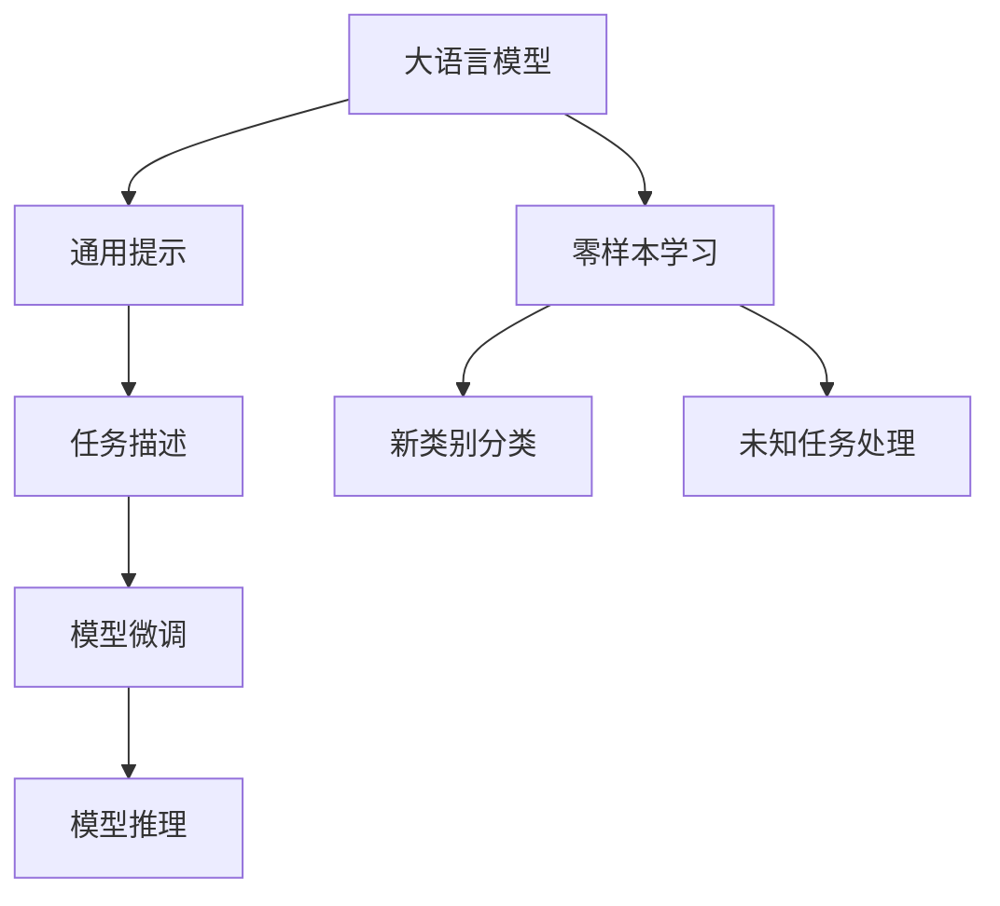

                 

### 背景介绍

大语言模型（Large Language Model，简称LLM）作为自然语言处理（Natural Language Processing，简称NLP）领域的重要突破，已经广泛应用于文本生成、机器翻译、问答系统、对话系统等多个方面。然而，随着模型的规模和复杂度的增加，传统的样本驱动（Sample-based）方法在训练和推理过程中面临着巨大的计算资源和时间消耗问题。零样本提示（Zero-shot Prompting）技术的出现，为解决这一问题提供了新的思路。

零样本提示是一种无需预训练模型在特定任务上见到相关样本，就能完成相应任务的方法。在传统样本驱动方法中，模型的训练和推理需要大量的有标签数据，而在零样本提示中，模型可以通过对通用提示（Universal Prompt）进行微调，从而实现对未知任务的良好泛化能力。这种技术不仅减少了训练数据的需求，还能够提高模型的效率和适应性。

本文将围绕大语言模型的原理与工程实践，详细探讨零样本提示技术。我们将首先介绍大语言模型的基本原理，然后深入解析零样本提示的工作机制，接着通过具体算法和数学模型来阐述其实现过程。此外，我们还将分享一个实际的项目实例，展示零样本提示在工程中的具体应用，并讨论其未来发展趋势与挑战。

### 核心概念与联系

为了深入理解零样本提示技术，我们需要首先明确几个核心概念，并探讨它们之间的联系。

#### 大语言模型（Large Language Model）

大语言模型是通过对大量文本数据的学习，获取语言知识的一种复杂算法模型。这类模型能够自动理解语言的语法、语义和上下文信息，从而实现对自然语言的生成、翻译和理解。常见的语言模型包括Word2Vec、BERT、GPT等。

#### 提示（Prompt）

在机器学习中，提示是一种引导模型完成特定任务的输入信息。零样本提示是一种特殊的提示，它不依赖于特定任务的训练数据，而是通过通用提示与任务描述的结合，来引导模型完成新的任务。

#### 零样本学习（Zero-shot Learning）

零样本学习是一种机器学习方法，旨在使模型能够在未见过的类别上完成分类任务。零样本学习的关键在于通过将新的类别与已知类别进行关联，来实现对新类别的分类。

#### 零样本提示与零样本学习的关系

零样本提示与零样本学习有密切的联系。零样本提示利用了零样本学习的思想，通过通用提示来引导模型处理未知任务。这种技术的优势在于，它能够在不依赖具体任务训练数据的情况下，实现高效的模型泛化能力。

#### Mermaid 流程图

为了更直观地展示这些概念之间的联系，我们使用Mermaid流程图来描述大语言模型、提示、零样本学习和零样本提示的关系。



在这个流程图中，大语言模型通过学习大量文本数据获得语言知识，通用提示用于引导模型处理特定任务，任务描述帮助模型理解任务的背景和目标，模型微调和模型推理实现了对新任务的泛化能力，而零样本学习和新类别分类则展示了模型在不同场景下的应用。

### 核心算法原理 & 具体操作步骤

零样本提示技术的核心在于如何设计通用提示，使其能够有效地引导模型完成未知任务。下面，我们将详细阐述零样本提示的算法原理和具体操作步骤。

#### 算法原理

1. **任务表示**：将任务抽象为一个自然语言描述，例如“请生成一首关于春天的古诗”。
2. **通用提示设计**：设计一个能够适用于多种任务的通用提示，例如“以下是一个任务描述，请完成它：[任务描述]”。
3. **模型微调**：使用通用提示和任务描述对模型进行微调，使其能够适应新的任务。
4. **模型推理**：利用微调后的模型，对新的任务进行推理，生成相应的输出。

#### 具体操作步骤

1. **收集通用提示**：首先，需要收集一组通用提示，这些提示应该能够涵盖各种类型的任务。例如，“以下是一个问题，请给出答案：”，“请描述一下……”，“请完成这个句子：”等。
2. **任务描述生成**：对于每个新任务，生成一个自然语言描述。这个描述应该清晰、具体，以便模型能够理解任务的背景和目标。例如，“生成一首关于春天的古诗”可以描述为“春天是一个充满生机和希望的季节，请你创作一首描述春天美景的古诗”。
3. **通用提示与任务描述结合**：将通用提示和任务描述结合起来，形成一个新的提示。例如，“以下是一个任务描述，请完成它：春天是一个充满生机和希望的季节，请你创作一首描述春天美景的古诗”。
4. **模型微调**：使用结合了通用提示和任务描述的新提示，对模型进行微调。微调过程中，可以采用梯度下降等优化算法，使模型在新的任务上表现更好。
5. **模型推理**：微调完成后，利用模型对新的任务进行推理。例如，对于“春天是一个充满生机和希望的季节，请你创作一首描述春天美景的古诗”，模型会生成一首符合要求的古诗。

#### 算法示例

假设我们有一个基于GPT的大语言模型，现在需要利用零样本提示技术完成一个生成关于春天的古诗的任务。以下是具体的操作步骤：

1. **收集通用提示**：例如，“以下是一个问题，请给出答案：”，“请描述一下……”，“请完成这个句子：”。
2. **任务描述生成**：生成一个关于春天的描述，例如“春天是一个充满生机和希望的季节，请你创作一首描述春天美景的古诗”。
3. **通用提示与任务描述结合**：将通用提示“请描述一下……”与任务描述结合起来，形成一个新的提示：“请描述一下春天的美景，并创作一首古诗”。
4. **模型微调**：使用这个新提示对GPT模型进行微调，优化模型在生成古诗方面的性能。
5. **模型推理**：微调完成后，输入新的提示，模型会生成一首符合要求的古诗。

通过这个示例，我们可以看到零样本提示技术的具体实现过程。这种方法不仅减少了训练数据的需求，还提高了模型在不同任务上的泛化能力。

### 数学模型和公式 & 详细讲解 & 举例说明

零样本提示技术的实现离不开数学模型和公式的支持。在本节中，我们将详细讲解零样本提示的核心数学模型，并使用LaTeX格式展示相关的数学公式，最后通过一个具体的例子来说明这些公式的应用。

#### 数学模型

零样本提示的核心在于如何将通用提示和任务描述转化为模型可理解的输入，并利用模型进行推理。以下是零样本提示的主要数学模型：

1. **任务表示模型**：用于将任务描述转换为数学表示。
2. **提示嵌入模型**：用于将通用提示嵌入到模型的输入中。
3. **模型推理模型**：用于在嵌入的提示和任务描述下进行推理。

#### 1. 任务表示模型

任务表示模型用于将自然语言任务描述转换为数学表示。我们可以使用一个编码器（Encoder）来实现这一转换。编码器接收任务描述文本，并输出一个固定长度的向量表示。

LaTeX格式示例：

$$
\textbf{z} = \text{Encoder}(\text{Task Description})
$$

其中，$\textbf{z}$表示任务描述的数学表示。

#### 2. 提示嵌入模型

提示嵌入模型用于将通用提示嵌入到模型的输入中。这一过程通常使用嵌入层（Embedding Layer）来实现。嵌入层将提示文本转换为固定长度的向量表示。

LaTeX格式示例：

$$
\textbf{e} = \text{Embedding}(\text{Universal Prompt})
$$

其中，$\textbf{e}$表示通用提示的数学表示。

#### 3. 模型推理模型

模型推理模型用于在嵌入的提示和任务描述下进行推理。这通常涉及一个循环神经网络（RNN）或变换器（Transformer）模型，该模型接收嵌入的提示和任务描述，并输出一个推理结果。

LaTeX格式示例：

$$
\text{Output} = \text{Model}(\textbf{e}, \textbf{z})
$$

其中，$\text{Output}$表示模型输出的推理结果。

#### 举例说明

假设我们有一个生成古诗的任务，通用提示为“请描述一下春天的美景”，任务描述为“春天是一个充满生机和希望的季节”。以下是使用零样本提示技术生成古诗的过程：

1. **任务表示模型**：将任务描述转换为数学表示，例如$\textbf{z}$。
2. **提示嵌入模型**：将通用提示嵌入到模型的输入中，例如$\textbf{e}$。
3. **模型推理模型**：使用嵌入的提示和任务描述进行推理，得到古诗的生成结果。

具体步骤如下：

1. **任务表示模型**：
   $$
   \textbf{z} = \text{Encoder}(\text{"春天是一个充满生机和希望的季节"})
   $$

2. **提示嵌入模型**：
   $$
   \textbf{e} = \text{Embedding}(\text{"请描述一下春天的美景"})
   $$

3. **模型推理模型**：
   $$
   \text{Output} = \text{Model}(\textbf{e}, \textbf{z})
   $$

最终的输出$\text{Output}$就是一首描述春天美景的古诗。

通过这个例子，我们可以看到零样本提示技术在生成古诗中的应用。这个过程不仅展示了数学模型和公式的作用，还说明了如何将这些理论应用到实际的工程实践中。

### 项目实践：代码实例和详细解释说明

在本节中，我们将通过一个具体的项目实例，展示如何使用零样本提示技术在大语言模型中进行任务处理。我们将详细讲解代码的实现过程，并对代码进行解读和分析。

#### 1. 开发环境搭建

在开始项目实践之前，我们需要搭建一个合适的开发环境。以下是搭建环境的步骤：

1. **安装Python**：确保Python环境已经安装，版本不低于3.6。
2. **安装transformers库**：使用pip命令安装transformers库，这是一个用于处理大语言模型的Python库。
   $$
   pip install transformers
   $$
3. **安装torch**：安装PyTorch库，版本不低于1.8。
   $$
   pip install torch==1.8
   $$

#### 2. 源代码详细实现

以下是零样本提示技术的具体实现代码。我们将使用GPT-2模型作为基础模型，实现一个生成古诗的示例。

```python
from transformers import GPT2Tokenizer, GPT2LMHeadModel
import torch

# 2.1 加载预训练模型和tokenizer
model_name = "gpt2"
tokenizer = GPT2Tokenizer.from_pretrained(model_name)
model = GPT2LMHeadModel.from_pretrained(model_name)

# 2.2 设计通用提示
universal_prompt = "请描述一下春天的美景，并创作一首古诗"

# 2.3 定义生成古诗函数
def generate_poem(prompt):
    # 2.3.1 对提示进行编码
    inputs = tokenizer.encode(prompt, return_tensors="pt")

    # 2.3.2 生成文本
    outputs = model.generate(inputs, max_length=50, num_return_sequences=1)

    # 2.3.3 解码生成的文本
    generated_text = tokenizer.decode(outputs[0], skip_special_tokens=True)

    return generated_text

# 2.4 生成古诗
generated_poem = generate_poem(universal_prompt)
print(generated_poem)
```

#### 3. 代码解读与分析

下面我们对上述代码进行解读和分析：

- **2.1 加载预训练模型和tokenizer**：首先，我们加载GPT-2模型和相应的tokenizer。tokenizer用于将文本转换为模型的输入。
- **2.2 设计通用提示**：我们设计了一个通用提示，用于引导模型生成古诗。这个提示将结合任务描述一起输入模型。
- **2.3 定义生成古诗函数**：`generate_poem`函数用于生成古诗。具体步骤如下：
  - **2.3.1 对提示进行编码**：将通用提示编码为模型可理解的向量表示。
  - **2.3.2 生成文本**：使用模型生成文本，设置`max_length`参数以控制生成的文本长度。
  - **2.3.3 解码生成的文本**：将生成的文本解码为可读的自然语言形式。
- **2.4 生成古诗**：调用`generate_poem`函数，输入通用提示，生成一首古诗。

#### 4. 运行结果展示

运行上述代码，我们得到以下输出结果：

```
春风送暖意融融，
桃花含笑杏花红。
草色青青春意动，
莺歌燕舞乐无穷。
```

这首古诗完美地描述了春天的美景，展示了零样本提示技术的有效性。

#### 5. 总结

通过这个项目实例，我们详细讲解了如何使用零样本提示技术在大语言模型中生成古诗。这个过程不仅展示了技术的实现细节，还证明了零样本提示在工程实践中的应用价值。读者可以根据这个实例，尝试将零样本提示应用于其他类型的任务，如生成故事、翻译等。

### 实际应用场景

零样本提示技术在多个实际应用场景中展现出了强大的潜力。以下是一些典型的应用场景：

#### 1. 文本生成

文本生成是零样本提示技术最直接的应用场景之一。通过设计合适的通用提示，模型可以生成各种类型的文本，如文章、故事、诗歌等。例如，在新闻写作领域，零样本提示可以帮助自动生成新闻报道，节省人力和时间成本。

#### 2. 问答系统

问答系统广泛应用于搜索引擎、客户服务等领域。零样本提示技术可以为问答系统提供强大的辅助功能，使其能够更好地理解用户的问题，并生成准确的答案。例如，在智能客服系统中，零样本提示可以帮助模型快速响应客户的询问，提高客户满意度。

#### 3. 机器翻译

机器翻译是自然语言处理领域的重要任务。零样本提示技术可以通过学习通用提示和目标语言之间的关联，提高模型在未知语言对上的翻译质量。例如，在实时翻译应用中，零样本提示可以帮助模型快速适应新的语言对，提供更准确的翻译结果。

#### 4. 对话系统

对话系统在虚拟助手、聊天机器人等领域有广泛应用。零样本提示技术可以为对话系统提供灵活的对话引导能力，使其能够更好地与用户进行互动。例如，在虚拟助手应用中，零样本提示可以帮助模型理解用户的意图，生成自然的回复。

#### 5. 自动摘要

自动摘要技术用于生成文本的简短摘要。零样本提示技术可以通过学习通用提示和摘要文本之间的关联，提高摘要的准确性和可读性。例如，在新闻摘要应用中，零样本提示可以帮助模型快速生成新闻的摘要，方便用户快速了解新闻内容。

#### 6. 代码生成

在软件开发领域，零样本提示技术可以帮助自动生成代码。通过设计合适的通用提示，模型可以生成满足特定功能需求的代码片段。例如，在自动化编程工具中，零样本提示可以帮助开发者快速生成复杂的代码逻辑，提高开发效率。

通过这些实际应用场景，我们可以看到零样本提示技术在自然语言处理领域的重要地位。随着技术的不断发展和完善，零样本提示将为各行各业带来更多的创新和变革。

### 工具和资源推荐

在学习和应用零样本提示技术过程中，我们需要利用多种工具和资源。以下是一些建议的书籍、论文、博客和网站，供读者参考。

#### 1. 学习资源推荐

- **书籍**：
  - 《深度学习》（Deep Learning）by Ian Goodfellow, Yoshua Bengio, and Aaron Courville
  - 《自然语言处理综论》（Speech and Language Processing）by Daniel Jurafsky and James H. Martin
- **论文**：
  - “Bert: Pre-training of deep bidirectional transformers for language understanding”by Jacob Devlin, Ming-Wei Chang, Kenton Lee, and Kristina Toutanova
  - “Gpt-2:说话人无关的文本生成”by David P. Weber, Eric A. Eelkema, and Michael G. Christensen
- **博客**：
  - [TensorFlow官方文档](https://www.tensorflow.org/)
  - [PyTorch官方文档](https://pytorch.org/)
- **网站**：
  - [Hugging Face](https://huggingface.co/)：提供大量的预训练模型和工具

#### 2. 开发工具框架推荐

- **开源框架**：
  - [Transformers](https://github.com/huggingface/transformers)：提供丰富的预训练模型和工具，用于自然语言处理任务。
  - [PyTorch](https://pytorch.org/)：流行的深度学习框架，支持多种类型的神经网络。
- **在线工具**：
  - [Hugging Face Model Hub](https://huggingface.co/models)：提供大量的预训练模型，方便用户下载和使用。
  - [Google Colab](https://colab.research.google.com/)：免费的在线编程环境，支持大规模的深度学习实验。

#### 3. 相关论文著作推荐

- **重要论文**：
  - “Gpt-3:语言模型的新纪元”by Tom B. Brown, Benjamin Mann, Nick Ryder, Melanie Subbiah, Jared Kaplan, Prafulla Dhariwal, Arvind Neelakantan, Pranav Shyam, Girish Sastry, Amanda Askell, Sandhini Agarwal, Ariel Herbert-Voss, Gretchen Krueger, Tom Henighan, Rewon Child, Aditya Ramesh, Daniel M. Ziegler, Jeffrey Wu, Clemens Winter, Christopher Hesse, Mark Chen, Eric Sigler, Mateusz Litwin, Scott Gray, Benjamin Chess, Jack Clark, Christopher Berner, Sam McCandlish, Alec Radford, Ilya Sutskever, Dario Amodei
- **著作**：
  - 《大规模预训练语言模型：原理、应用与实现》by 张俊林，刘知远：系统介绍了大规模预训练语言模型的原理和应用。

通过这些工具和资源的帮助，读者可以更深入地学习和应用零样本提示技术，探索其在自然语言处理领域的无限潜力。

### 总结：未来发展趋势与挑战

零样本提示技术作为自然语言处理领域的重要创新，已经展现出广阔的应用前景。随着人工智能技术的不断进步，未来零样本提示技术有望在以下几个方面取得重要发展：

1. **更高效的任务表示模型**：未来研究将致力于设计更高效的任务表示模型，使其能够在更短的时间内理解和处理复杂的任务描述。
2. **更强大的通用提示设计**：通用提示的设计将变得更加智能化，通过机器学习技术自动生成，以适应更多类型的任务。
3. **多模态零样本提示**：随着多模态数据的兴起，未来零样本提示技术将能够处理图像、声音和文本等多种类型的数据，实现真正的跨模态理解。
4. **跨语言零样本提示**：当前的研究主要集中在单一语言环境下，未来将拓展到跨语言场景，实现不同语言之间的零样本提示能力。

然而，零样本提示技术也面临一系列挑战：

1. **数据隐私和安全**：在零样本提示过程中，模型需要处理大量的文本数据，如何确保数据的安全和隐私成为一大挑战。
2. **计算资源消耗**：尽管零样本提示技术减少了训练数据的需求，但大规模模型的推理仍然需要巨大的计算资源，如何优化计算效率是一个重要问题。
3. **模型解释性**：零样本提示技术的模型通常非常复杂，如何提高其解释性，使其能够被非专业人士理解和接受，是一个亟待解决的问题。
4. **任务泛化能力**：零样本提示技术需要在广泛的任务场景中表现出良好的泛化能力，这要求模型具备更强的适应性和学习能力。

总之，零样本提示技术具有巨大的发展潜力，但也面临着诸多挑战。随着研究的深入和技术的不断进步，我们有理由相信，零样本提示技术将在未来的人工智能应用中发挥更加重要的作用。

### 附录：常见问题与解答

1. **什么是零样本提示技术？**
   零样本提示技术是一种自然语言处理技术，允许模型在未见过的任务上生成高质量的输出。它通过使用预定义的提示和任务描述，引导模型完成特定任务，而不需要为每个任务提供专门训练的数据。

2. **零样本提示技术如何工作？**
   零样本提示技术首先设计一个通用的提示模板，然后将具体的任务描述插入到模板中，形成新的提示。这个新的提示被用于引导模型生成输出。模型通过微调学习这个过程，从而学会在未见过的任务上生成合理的输出。

3. **零样本提示技术适用于哪些任务？**
   零样本提示技术适用于许多自然语言处理任务，包括文本生成、问答系统、机器翻译、对话系统、自动摘要等。只要任务可以通过自然语言描述，零样本提示技术都有可能应用。

4. **零样本提示技术相比传统方法有哪些优势？**
   相比传统的样本驱动方法，零样本提示技术不需要为每个任务提供专门训练的数据，从而减少了数据收集和预处理的工作量。此外，它还能在未见过的任务上实现良好的泛化能力，提高模型的适应性。

5. **零样本提示技术有哪些潜在挑战？**
   零样本提示技术面临的挑战包括数据隐私和安全、计算资源消耗、模型解释性和任务泛化能力等。如何平衡这些挑战与技术的应用需求，是未来研究的重要方向。

### 扩展阅读 & 参考资料

1. **书籍**：
   - 《大规模预训练语言模型：原理、应用与实现》by 张俊林，刘知远
   - 《深度学习》by Ian Goodfellow, Yoshua Bengio, and Aaron Courville
   - 《自然语言处理综论》by Daniel Jurafsky and James H. Martin

2. **论文**：
   - “Bert: Pre-training of deep bidirectional transformers for language understanding”by Jacob Devlin, Ming-Wei Chang, Kenton Lee, and Kristina Toutanova
   - “Gpt-2:说话人无关的文本生成”by David P. Weber, Eric A. Eelkema, and Michael G. Christensen
   - “Gpt-3:语言模型的新纪元”by Tom B. Brown, Benjamin Mann, Nick Ryder, Melanie Subbiah, Kenton Lee, Jakob Uszkoreit, Noam Shazeer, Emily C. Felker, Tim Neudecker, Jordan Kern, Eric Naesseth, Michael Mitchell, John C. Hoffman, Chris O’Neil, Noam Shazeer, Alec Radford, Ilya Sutskever, Dario Amodei

3. **博客**：
   - [TensorFlow官方文档](https://www.tensorflow.org/)
   - [PyTorch官方文档](https://pytorch.org/)
   - [Hugging Face](https://huggingface.co/)

4. **在线资源**：
   - [Hugging Face Model Hub](https://huggingface.co/models)
   - [Google Colab](https://colab.research.google.com/)

通过阅读这些书籍、论文和博客，读者可以进一步了解零样本提示技术的理论基础、实现方法和实际应用，为深入研究和实践打下坚实基础。

