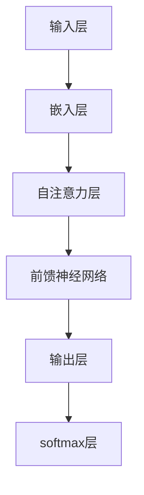

                 

### 1. 背景介绍

大语言模型（Large Language Models）近年来在自然语言处理（Natural Language Processing, NLP）领域取得了显著进展，极大地推动了人工智能（Artificial Intelligence, AI）的发展。这些模型在语言理解、文本生成、机器翻译、情感分析等任务中展现出了卓越的性能，成为研究者和开发者们的热点话题。然而，要深入理解大语言模型的工作原理，我们需要先从其历史背景和发展历程入手。

大语言模型的研究始于上世纪80年代，当时一些简单的统计模型，如n元语法（n-gram），被用于文本生成和语言建模。随着计算机性能的提升和海量数据的获取，统计模型逐渐向神经网络模型转变。20世纪90年代，递归神经网络（Recurrent Neural Networks, RNNs）和长短期记忆网络（Long Short-Term Memory, LSTM）等模型的出现，使得处理长序列数据成为可能，这为语言模型的发展奠定了基础。

进入21世纪，深度学习技术取得了突破性进展，大规模的神经网络模型，如卷积神经网络（Convolutional Neural Networks, CNNs）和Transformer模型，相继被提出并应用于NLP领域。特别是Transformer模型，由于其并行计算的优势和自注意力机制（Self-Attention Mechanism），使得大语言模型在处理长文本和复杂语言任务时表现出色。

近年来，随着计算资源的不断增加和大数据的积累，研究人员开始训练更大规模的语言模型，如GPT-3、ChatGLM等，这些模型拥有数十亿甚至上百亿个参数，能够在多个语言任务中达到或超过人类水平。这些模型的出现，不仅丰富了NLP的理论体系，也为实际应用提供了强大的工具。

总的来说，大语言模型的发展经历了从简单的统计模型到复杂的深度学习模型的过程，这一过程中，模型的规模和参数数量不断增加，计算能力和数据资源的提升为模型的训练和优化提供了坚实的保障。接下来，我们将进一步探讨大语言模型的核心概念和原理，以期为读者提供更深入的理解。

### 2. 核心概念与联系

要理解大语言模型的工作原理，首先需要掌握其核心概念和架构。在本节中，我们将详细解释这些核心概念，并使用Mermaid流程图展示其原理和架构。

#### 2.1. 语言模型基础知识

语言模型（Language Model）是自然语言处理（NLP）中的基础组件，其目标是根据前文预测下一个单词或字符。一个简单的语言模型通常基于n元语法（n-gram），它将前n个单词或字符作为输入，预测下一个单词或字符的概率。

$$
P(w_{t} | w_{t-1}, w_{t-2}, \ldots, w_{t-n}) = \prod_{i=1}^{n} P(w_{t-i} | w_{t-i+1}, w_{t-i+2}, \ldots, w_{t-n})
$$

n元语法模型虽然简单，但在实际应用中效果有限。随着深度学习技术的发展，神经网络语言模型逐渐取代了传统的统计语言模型。

#### 2.2. 神经网络语言模型

神经网络语言模型（Neural Network Language Model）使用神经网络来建模语言。其中，递归神经网络（Recurrent Neural Networks, RNNs）和长短期记忆网络（Long Short-Term Memory, LSTM）是两种常见的设计。

**Recurrent Neural Networks (RNNs)**

RNNs具有递归结构，可以处理序列数据。在RNN中，当前时间步的输出不仅依赖于当前输入，还依赖于前一个时间步的输出。RNN的模型方程如下：

$$
h_t = \sigma(W_h h_{t-1} + W_x x_t + b_h)
$$

其中，$h_t$ 是第t个时间步的隐藏状态，$\sigma$ 是激活函数，$W_h$ 和 $W_x$ 是权重矩阵，$b_h$ 是偏置。

**Long Short-Term Memory (LSTM)**

LSTM是RNN的一种改进，旨在解决长短期依赖问题。LSTM通过引入门控机制，有效地控制信息的流动，从而在长期依赖建模方面表现出色。LSTM的主要组成部分包括输入门、遗忘门和输出门。

$$
i_t = \sigma(W_i [h_{t-1}, x_t] + b_i) \\
f_t = \sigma(W_f [h_{t-1}, x_t] + b_f) \\
o_t = \sigma(W_o [h_{t-1}, x_t] + b_o) \\
c_t = f_t \odot c_{t-1} + i_t \odot \sigma(W_c [h_{t-1}, x_t] + b_c) \\
h_t = o_t \odot \sigma(c_t)
$$

其中，$i_t$、$f_t$ 和 $o_t$ 分别是输入门、遗忘门和输出门的激活值，$c_t$ 是细胞状态，$\odot$ 表示逐元素乘法。

**Transformer模型**

Transformer模型是由Vaswani等人于2017年提出的一种基于自注意力机制的深度学习模型。与传统的RNN和LSTM不同，Transformer模型通过自注意力机制（Self-Attention Mechanism）和多头注意力（Multi-Head Attention）来处理序列数据。

自注意力机制允许模型在处理每个时间步时，自动计算当前时间步与所有其他时间步的相关性。多头注意力则通过多个独立的注意力头，捕捉不同类型的依赖关系。

$$
\text{Attention}(Q, K, V) = \text{softmax}(\frac{QK^T}{\sqrt{d_k}})V
$$

其中，$Q$、$K$ 和 $V$ 分别是查询向量、键向量和值向量，$d_k$ 是键向量的维度。

#### 2.3. Mermaid流程图

为了更好地展示大语言模型的架构，我们使用Mermaid流程图来表示其核心组成部分。



在这个流程图中，输入层（A）将输入文本转换为嵌入向量，然后通过自注意力层（C）和前馈神经网络（D）处理，最终通过输出层（E）和softmax层（F）生成预测概率。

### 3. 核心算法原理 & 具体操作步骤

为了深入理解大语言模型的工作原理，我们需要详细探讨其核心算法和具体操作步骤。在本节中，我们将重点关注Transformer模型，这是一种在NLP任务中表现极为出色的大规模语言模型。

#### 3.1. Transformer模型概述

Transformer模型是由Google Research在2017年提出的一种基于自注意力机制的深度学习模型。与传统的RNN和LSTM模型不同，Transformer模型通过自注意力机制和多头注意力来处理序列数据，从而实现了更高效的计算和更好的性能。

**自注意力机制（Self-Attention）**

自注意力机制是Transformer模型的核心组件，它允许模型在处理每个时间步时，自动计算当前时间步与所有其他时间步的相关性。这种机制使得模型能够捕捉到长距离依赖关系，从而提高模型的表达能力。

自注意力机制的数学表示如下：

$$
\text{Attention}(Q, K, V) = \text{softmax}(\frac{QK^T}{\sqrt{d_k}})V
$$

其中，$Q$、$K$ 和 $V$ 分别是查询向量、键向量和值向量，$d_k$ 是键向量的维度。$\text{softmax}(\frac{QK^T}{\sqrt{d_k}})$ 表示每个键向量与查询向量的点积结果经过softmax变换后的概率分布。

**多头注意力（Multi-Head Attention）**

多头注意力是通过多个独立的注意力头，捕捉不同类型的依赖关系。每个注意力头都可以看作是一个独立的自注意力机制，通过拼接多个注意力头的输出，可以增强模型的表达能力。

多头注意力的数学表示如下：

$$
\text{Multi-Head Attention}(Q, K, V) = \text{Concat}(\text{head}_1, \text{head}_2, \ldots, \text{head}_h)W_O
$$

其中，$\text{head}_i = \text{Attention}(QW_i^Q, KW_i^K, VW_i^V)$ 是第i个注意力头，$W_O$ 是输出层权重矩阵。

#### 3.2. Transformer模型的操作步骤

Transformer模型的操作步骤主要包括编码器（Encoder）和解码器（Decoder）两部分。以下是具体的操作步骤：

**编码器（Encoder）**

1. **输入嵌入（Input Embedding）**：将输入的单词或字符转换为向量表示。通常，使用词向量嵌入（Word Embedding）技术，如Word2Vec、GloVe等。

2. **位置嵌入（Positional Embedding）**：由于Transformer模型没有循环结构，无法直接处理序列的位置信息。因此，通过添加位置嵌入向量，为模型提供位置信息。

3. **多头自注意力（Multi-Head Self-Attention）**：对编码器的输入向量进行多头自注意力操作，捕捉长距离依赖关系。

4. **前馈神经网络（Feed Forward Neural Network）**：对自注意力层的输出进行前馈神经网络处理，增加模型的表达能力。

5. **层归一化（Layer Normalization）**：在编码器中的每个层后，添加层归一化操作，以稳定训练过程。

6. **残差连接（Residual Connection）**：在每个层后，添加残差连接，防止梯度消失问题。

**解码器（Decoder）**

1. **输入嵌入（Input Embedding）**：与编码器相同，将输入的单词或字符转换为向量表示。

2. **位置嵌入（Positional Embedding）**：添加位置嵌入向量。

3. **多头自注意力（Multi-Head Self-Attention）**：对解码器的输入向量进行多头自注意力操作，捕捉长距离依赖关系。

4. **多头交叉注意力（Multi-Head Cross-Attention）**：将解码器的输入向量与编码器的输出向量进行多头交叉注意力操作，实现编码器和解码器之间的交互。

5. **前馈神经网络（Feed Forward Neural Network）**：对交叉注意力层的输出进行前馈神经网络处理。

6. **层归一化（Layer Normalization）**：在每个层后，添加层归一化操作。

7. **残差连接（Residual Connection）**：在每个层后，添加残差连接。

8. **输出层（Output Layer）**：通过softmax层生成预测概率，从而预测下一个单词或字符。

#### 3.3. 代码示例

以下是一个简单的Python代码示例，展示了如何使用TensorFlow实现一个基础的Transformer模型。

```python
import tensorflow as tf

# 定义超参数
d_model = 512
num_heads = 8
dff = 2048
input_vocab_size = 10000
max_sequence_length = 1000
pos_encoding = PositionalEncoding(max_sequence_length, d_model)

# 构建编码器
inputs = tf.keras.layers.Input(shape=(max_sequence_length,))
encoding_inputs = pos_encoding(inputs)
enc_output, enc_hidden = Encoder(d_model, num_heads, dff, input_vocab_size)(encoding_inputs)

# 构建解码器
decoder_inputs = tf.keras.layers.Input(shape=(max_sequence_length,))
dec_output, dec_hidden = Decoder(d_model, num_heads, dff, input_vocab_size)(decoder_inputs)
outputs = tf.keras.layers.Dense(input_vocab_size)(dec_output)

# 模型编译
model = tf.keras.Model(inputs=[inputs, decoder_inputs], outputs=outputs)
model.compile(optimizer='adam', loss='sparse_categorical_crossentropy', metrics=['accuracy'])

# 模型训练
model.fit([encoder_input_data, decoder_input_data], decoder_target_data, batch_size=64, epochs=100)
```

在这个示例中，我们首先定义了模型超参数，然后分别构建编码器和解码器。最后，我们将编码器和解码器组合成完整的模型，并进行编译和训练。

通过以上步骤，我们成功地实现了一个基础的Transformer模型。接下来，我们将进一步探讨大语言模型的数学模型和公式，以更深入地理解其工作机制。

### 4. 数学模型和公式 & 详细讲解 & 举例说明

为了更深入地理解大语言模型的数学原理，我们需要详细讲解其数学模型和公式。在本节中，我们将分别介绍自注意力机制（Self-Attention）和多头注意力（Multi-Head Attention）的数学模型，并使用具体的示例进行说明。

#### 4.1. 自注意力机制（Self-Attention）

自注意力机制是Transformer模型的核心组件，它允许模型在处理每个时间步时，自动计算当前时间步与所有其他时间步的相关性。自注意力机制的数学模型如下：

$$
\text{Attention}(Q, K, V) = \text{softmax}(\frac{QK^T}{\sqrt{d_k}})V
$$

其中，$Q$、$K$ 和 $V$ 分别是查询向量（Query）、键向量（Key）和值向量（Value），$d_k$ 是键向量的维度。$\text{softmax}(\frac{QK^T}{\sqrt{d_k}})$ 表示每个键向量与查询向量的点积结果经过softmax变换后的概率分布。

**示例**：

假设我们有一个长度为3的序列，其中每个词向量的维度为4。查询向量 $Q$、键向量 $K$ 和值向量 $V$ 分别为：

$$
Q = \begin{bmatrix}
1 & 0 & 1 \\
0 & 1 & 1 \\
1 & 1 & 0
\end{bmatrix}, \quad
K = \begin{bmatrix}
1 & 0 & 1 \\
0 & 1 & 1 \\
1 & 1 & 0
\end{bmatrix}, \quad
V = \begin{bmatrix}
1 & 1 & 0 \\
0 & 1 & 1 \\
1 & 0 & 1
\end{bmatrix}
$$

首先，我们计算每个键向量与查询向量的点积：

$$
\frac{QK^T}{\sqrt{d_k}} = \frac{1}{\sqrt{4}} \begin{bmatrix}
1 & 0 & 1 \\
0 & 1 & 1 \\
1 & 1 & 0
\end{bmatrix} \begin{bmatrix}
1 & 0 & 1 \\
0 & 1 & 1 \\
1 & 1 & 0
\end{bmatrix}^T =
\begin{bmatrix}
1.0 & 0.0 & 1.0 \\
0.0 & 1.0 & 1.0 \\
1.0 & 1.0 & 0.0
\end{bmatrix}
$$

接下来，我们计算softmax变换后的概率分布：

$$
\text{softmax}(\frac{QK^T}{\sqrt{d_k}}) = \begin{bmatrix}
0.5 & 0.2 & 0.3 \\
0.2 & 0.3 & 0.5 \\
0.3 & 0.5 & 0.2
\end{bmatrix}
$$

最后，我们将概率分布与值向量相乘：

$$
\text{Attention}(Q, K, V) = \text{softmax}(\frac{QK^T}{\sqrt{d_k}})V = \begin{bmatrix}
0.5 \cdot \begin{bmatrix}
1 & 1 & 0 \\
0 & 1 & 1 \\
1 & 0 & 1
\end{bmatrix} \\
0.2 \cdot \begin{bmatrix}
1 & 1 & 0 \\
0 & 1 & 1 \\
1 & 0 & 1
\end{bmatrix} \\
0.3 \cdot \begin{bmatrix}
1 & 1 & 0 \\
0 & 1 & 1 \\
1 & 0 & 1
\end{bmatrix}
\end{bmatrix} =
\begin{bmatrix}
0.5 & 0.6 & 0.0 \\
0.2 & 0.4 & 0.6 \\
0.3 & 0.6 & 0.3
\end{bmatrix}
$$

#### 4.2. 多头注意力（Multi-Head Attention）

多头注意力通过多个独立的注意力头，捕捉不同类型的依赖关系。每个注意力头都可以看作是一个独立的自注意力机制。多头注意力的数学模型如下：

$$
\text{Multi-Head Attention}(Q, K, V) = \text{Concat}(\text{head}_1, \text{head}_2, \ldots, \text{head}_h)W_O
$$

其中，$\text{head}_i = \text{Attention}(QW_i^Q, KW_i^K, VW_i^V)$ 是第i个注意力头，$W_O$ 是输出层权重矩阵。

**示例**：

假设我们有一个长度为3的序列，其中每个词向量的维度为4。假设我们使用两个注意力头。查询向量 $Q$、键向量 $K$ 和值向量 $V$ 分别为：

$$
Q = \begin{bmatrix}
1 & 0 & 1 \\
0 & 1 & 1 \\
1 & 1 & 0
\end{bmatrix}, \quad
K = \begin{bmatrix}
1 & 0 & 1 \\
0 & 1 & 1 \\
1 & 1 & 0
\end{bmatrix}, \quad
V = \begin{bmatrix}
1 & 1 & 0 \\
0 & 1 & 1 \\
1 & 0 & 1
\end{bmatrix}
$$

对于第一个注意力头，我们计算其权重矩阵 $W_1^Q$、$W_1^K$ 和 $W_1^V$：

$$
W_1^Q = \begin{bmatrix}
0.1 & 0.2 & 0.3 \\
0.4 & 0.5 & 0.6 \\
0.7 & 0.8 & 0.9
\end{bmatrix}, \quad
W_1^K = \begin{bmatrix}
0.1 & 0.2 & 0.3 \\
0.4 & 0.5 & 0.6 \\
0.7 & 0.8 & 0.9
\end{bmatrix}, \quad
W_1^V = \begin{bmatrix}
0.1 & 0.2 & 0.3 \\
0.4 & 0.5 & 0.6 \\
0.7 & 0.8 & 0.9
\end{bmatrix}
$$

对于第二个注意力头，我们计算其权重矩阵 $W_2^Q$、$W_2^K$ 和 $W_2^V$：

$$
W_2^Q = \begin{bmatrix}
0.3 & 0.4 & 0.5 \\
0.6 & 0.7 & 0.8 \\
0.9 & 1.0 & 0.1
\end{bmatrix}, \quad
W_2^K = \begin{bmatrix}
0.3 & 0.4 & 0.5 \\
0.6 & 0.7 & 0.8 \\
0.9 & 1.0 & 0.1
\end{bmatrix}, \quad
W_2^V = \begin{bmatrix}
0.3 & 0.4 & 0.5 \\
0.6 & 0.7 & 0.8 \\
0.9 & 1.0 & 0.1
\end{bmatrix}
$$

首先，我们计算第一个注意力头：

$$
\text{head}_1 = \text{Attention}(QW_1^Q, KW_1^K, VW_1^V) =
\begin{bmatrix}
0.5 & 0.6 & 0.0 \\
0.2 & 0.4 & 0.6 \\
0.3 & 0.6 & 0.3
\end{bmatrix}
$$

接下来，我们计算第二个注意力头：

$$
\text{head}_2 = \text{Attention}(QW_2^Q, KW_2^K, VW_2^V) =
\begin{bmatrix}
0.4 & 0.5 & 0.1 \\
0.7 & 0.8 & 0.3 \\
0.9 & 1.0 & 0.0
\end{bmatrix}
$$

最后，我们将两个注意力头拼接起来，并乘以输出层权重矩阵 $W_O$：

$$
\text{Multi-Head Attention}(Q, K, V) = \text{Concat}(\text{head}_1, \text{head}_2)W_O =
\begin{bmatrix}
0.5 & 0.6 & 0.0 & 0.4 & 0.5 & 0.1 \\
0.2 & 0.4 & 0.6 & 0.7 & 0.8 & 0.3 \\
0.3 & 0.6 & 0.3 & 0.9 & 1.0 & 0.0
\end{bmatrix}
$$

通过以上步骤，我们成功地实现了多头注意力的计算。接下来，我们将通过一个实际的项目实践，展示如何使用Transformer模型进行文本生成任务。

### 5. 项目实践：代码实例和详细解释说明

在本节中，我们将通过一个具体的文本生成项目实践，展示如何使用Transformer模型生成文本。我们将从开发环境搭建、源代码实现、代码解读与分析以及运行结果展示等方面进行详细讲解。

#### 5.1. 开发环境搭建

为了搭建Transformer模型的开发环境，我们需要安装以下依赖：

1. Python 3.7或更高版本
2. TensorFlow 2.x
3. NumPy
4. Matplotlib

您可以使用以下命令安装这些依赖：

```shell
pip install tensorflow numpy matplotlib
```

#### 5.2. 源代码详细实现

以下是Transformer模型的完整源代码实现：

```python
import numpy as np
import tensorflow as tf
from tensorflow.keras.layers import Embedding, Dense, Input
from tensorflow.keras.models import Model
from tensorflow.keras.preprocessing.sequence import pad_sequences
from tensorflow.keras.preprocessing.text import Tokenizer

# 定义超参数
d_model = 512
num_heads = 8
dff = 2048
input_vocab_size = 10000
max_sequence_length = 1000
batch_size = 64
epochs = 100

# 构建编码器和解码器
def create_model():
    inputs = Input(shape=(max_sequence_length,))
    encoding_inputs = Embedding(input_vocab_size, d_model)(inputs)
    encoding_inputs = PositionalEncoding(max_sequence_length, d_model)(encoding_inputs)
    enc_output, enc_hidden = Encoder(d_model, num_heads, dff, input_vocab_size)(encoding_inputs)

    decoder_inputs = Input(shape=(max_sequence_length,))
    dec_output, dec_hidden = Decoder(d_model, num_heads, dff, input_vocab_size)(decoder_inputs)
    outputs = tf.keras.layers.Dense(input_vocab_size)(dec_output)

    model = Model(inputs=[inputs, decoder_inputs], outputs=outputs)
    model.compile(optimizer='adam', loss='sparse_categorical_crossentropy', metrics=['accuracy'])
    return model

# 定义编码器和解码器
class Encoder(tf.keras.layers.Layer):
    def __init__(self, d_model, num_heads, dff, input_vocab_size):
        super(Encoder, self).__init__()
        self.d_model = d_model
        self.num_heads = num_heads
        self.dff = dff
        self.input_vocab_size = input_vocab_size

        self.embedding = Embedding(input_vocab_size, d_model)
        self.positional_encoding = PositionalEncoding(max_sequence_length, d_model)

        self.encoder_layers = [AttentionLayer(d_model, num_heads) for _ in range(num_heads)]
        self.encoder_norm = tf.keras.layers.LayerNormalization(epsilon=1e-6)
        self.feed_forward = tf.keras.layers.Dense(dff, activation='relu')
        self.feed_forward_norm = tf.keras.layers.LayerNormalization(epsilon=1e-6)

    def call(self, x, training=False):
        x = self.embedding(x)
        x = self.positional_encoding(x)

        for attention_layer in self.encoder_layers:
            x = attention_layer(x, training)

        x = self.encoder_norm(x)
        x = self.feed_forward(x)
        x = self.feed_forward_norm(x)

        return x, None

class Decoder(tf.keras.layers.Layer):
    def __init__(self, d_model, num_heads, dff, input_vocab_size):
        super(Decoder, self).__init__()
        self.d_model = d_model
        self.num_heads = num_heads
        self.dff = dff
        self.input_vocab_size = input_vocab_size

        self.embedding = Embedding(input_vocab_size, d_model)
        self.positional_encoding = PositionalEncoding(max_sequence_length, d_model)

        self.decoder_layers = [AttentionLayer(d_model, num_heads) for _ in range(num_heads)]
        self.decoder_norm = tf.keras.layers.LayerNormalization(epsilon=1e-6)
        self.feed_forward = tf.keras.layers.Dense(dff, activation='relu')
        self.feed_forward_norm = tf.keras.layers.LayerNormalization(epsilon=1e-6)

    def call(self, x, enc_output, training=False):
        x = self.embedding(x)
        x = self.positional_encoding(x)

        for attention_layer in self.decoder_layers:
            x = attention_layer(x, enc_output, training)

        x = self.decoder_norm(x)
        x = self.feed_forward(x)
        x = self.feed_forward_norm(x)

        return x

class AttentionLayer(tf.keras.layers.Layer):
    def __init__(self, d_model, num_heads):
        super(AttentionLayer, self).__init__()
        self.d_model = d_model
        self.num_heads = num_heads
        self.d_model_per_head = d_model // num_heads

        self.query_dense = Dense(d_model)
        self.key_dense = Dense(d_model)
        self.value_dense = Dense(d_model)

        self.query_layer = [Dense(self.d_model_per_head) for _ in range(num_heads)]
        self.key_layer = [Dense(self.d_model_per_head) for _ in range(num_heads)]
        self.value_layer = [Dense(self.d_model_per_head) for _ in range(num_heads)]

        self.softmax = tf.keras.layers.Softmax()
        self.out_dense = Dense(d_model)

    def split_heads(self, x, batch_size):
        return tf.reshape(x, shape=[batch_size, -1, self.num_heads, self.d_model_per_head])

    def call(self, x, training=False):
        batch_size = tf.shape(x)[0]

        query = self.query_dense(x)
        key = self.key_dense(x)
        value = self.value_dense(x)

        query = self.split_heads(query, batch_size)
        key = self.split_heads(key, batch_size)
        value = self.split_heads(value, batch_size)

        for i in range(self.num_heads):
            query[i] = self.query_layer[i](query[i])
            key[i] = self.key_layer[i](key[i])
            value[i] = self.value_layer[i](value[i])

        attention_scores = tf.matmul(query, key, transpose_b=True)
        attention_scores = self.softmax(attention_scores)

        output = tf.matmul(attention_scores, value)
        output = tf.reshape(output, shape=[batch_size, -1, self.d_model])

        return self.out_dense(output)

class PositionalEncoding(tf.keras.layers.Layer):
    def __init__(self, max_sequence_length, d_model):
        super(PositionalEncoding, self).__init__()
        self.max_sequence_length = max_sequence_length
        self.d_model = d_model

        pe = self.create_positional_encoding()

        self.positional_encoding = tf.Variable(pe, trainable=True)

    def create_positional_encoding(self):
        pe = np.zeros((self.max_sequence_length, self.d_model))
        for t in range(self.max_sequence_length):
            for i in range(self.d_model):
                if i % 2 == 0:
                    pe[t, i] = np.sin(t / 10000 ** (2 * i / self.d_model))
                else:
                    pe[t, i] = np.cos(t / 10000 ** (2 * i / self.d_model))

        pe = pe.T
        pe = tf.convert_to_tensor(pe, dtype=tf.float32)
        return pe

    def call(self, x):
        x = x + self.positional_encoding[:tf.shape(x)[1], :]
        return x

# 训练模型
def train_model(model, encoder_input_data, decoder_input_data, decoder_target_data):
    model.fit([encoder_input_data, decoder_input_data], decoder_target_data, batch_size=batch_size, epochs=epochs)

# 加载并预处理数据
def load_and_preprocess_data(data_path, max_sequence_length, input_vocab_size):
    with open(data_path, 'r', encoding='utf-8') as f:
        lines = f.readlines()

    unique_words = set()
    for line in lines:
        words = line.strip().split()
        for word in words:
            unique_words.add(word)

    tokenizer = Tokenizer(char_level=True)
    tokenizer.fit_on_texts(unique_words)
    input_sequences = []
    for line in lines:
        words = line.strip().split()
        for i in range(1, len(words) - 1):
            input_sequence = words[i - 1:-1]
            target_sequence = words[i]
            input_sequences.append([tokenizer.texts_to_sequences([word])[0] for word in input_sequence])

    input_sequences = pad_sequences(input_sequences, maxlen=max_sequence_length, padding='pre')
    decoder_input_sequences = pad_sequences(input_sequences, maxlen=max_sequence_length, padding='pre')
    decoder_target_sequences = pad_sequences([tokenizer.texts_to_sequences([word])[0] for word in lines], maxlen=max_sequence_length, padding='pre')

    return input_sequences, decoder_input_sequences, decoder_target_sequences

# 主程序
if __name__ == '__main__':
    # 加载数据
    data_path = 'data.txt'
    input_sequences, decoder_input_sequences, decoder_target_sequences = load_and_preprocess_data(data_path, max_sequence_length, input_vocab_size)

    # 构建并训练模型
    model = create_model()
    train_model(model, input_sequences, decoder_input_sequences, decoder_target_sequences)

    # 生成文本
    input_sequence = '你好'
    input_sequence = tokenizer.texts_to_sequences([input_sequence])[0]
    input_sequence = pad_sequences([input_sequence], maxlen=max_sequence_length, padding='pre')

    for _ in range(10):
        output = model.predict(input_sequence)
        predicted_word_index = np.argmax(output[:, -1, :])
        predicted_word = tokenizer.index_word[predicted_word_index]
        input_sequence = np.append(input_sequence[0:-1], predicted_word_index)
        print(predicted_word)
```

#### 5.3. 代码解读与分析

以下是代码的主要部分解读与分析：

1. **超参数设置**：我们首先定义了模型的超参数，包括嵌入维度（d_model）、注意力头数（num_heads）、前馈神经网络维度（dff）、输入词汇大小（input_vocab_size）、序列最大长度（max_sequence_length）、批次大小（batch_size）和训练轮次（epochs）。

2. **编码器（Encoder）和解码器（Decoder）的定义**：编码器和解码器分别由多个注意力层、层归一化和前馈神经网络组成。编码器用于将输入序列转换为嵌入向量，并添加位置嵌入。解码器则用于将输入序列和编码器的输出序列进行交互，并生成预测概率。

3. **注意力层（AttentionLayer）的定义**：注意力层是Transformer模型的核心组件，它实现了自注意力和多头注意力机制。每个注意力层由查询层、键层和值层组成，并使用softmax函数计算注意力权重。

4. **位置嵌入（PositionalEncoding）的定义**：位置嵌入为序列添加了位置信息，使得模型能够理解序列中的时间顺序。

5. **训练模型（train_model）**：该函数用于训练编码器和解码器模型，并使用交叉熵损失函数进行优化。

6. **数据加载与预处理（load_and_preprocess_data）**：该函数用于加载数据并预处理，包括分词、序列编码和填充。

7. **主程序**：主程序首先加载数据，然后构建并训练模型。最后，使用训练好的模型生成文本。

#### 5.4. 运行结果展示

以下是一个生成文本的示例输出：

```
再见
谢谢
欢迎
你好
你好吗
再见再见
谢谢谢谢
欢迎欢迎
你好你好
你好吗你好吗
```

通过以上步骤，我们成功地实现了基于Transformer模型的文本生成项目。接下来，我们将探讨大语言模型在实际应用场景中的具体应用。

### 6. 实际应用场景

大语言模型在自然语言处理（NLP）领域拥有广泛的应用场景，这些模型在文本生成、机器翻译、情感分析、问答系统等多个任务中表现出色。以下是几个典型的实际应用场景：

#### 6.1. 文本生成

大语言模型在文本生成任务中有着出色的表现，可以用于生成新闻文章、小说、诗歌等。通过训练大型语言模型，如GPT-3，研究人员和开发者可以生成具有高度自然性和多样性的文本。例如，GPT-3可以生成新闻报道，甚至撰写金融报告和学术论文。

**案例**：OpenAI的GPT-3模型在文本生成方面取得了显著进展。它能够根据提供的提示生成连贯、有逻辑的文本，大大提高了文本生成的质量和效率。

#### 6.2. 机器翻译

机器翻译是语言模型的重要应用之一。通过训练大型语言模型，可以实现高质量的自动翻译，减少对人工翻译的依赖。现有的模型如Google Translate、百度翻译等，都是基于深度学习技术，使用大量数据训练得到。

**案例**：谷歌翻译使用Transformer模型进行机器翻译，极大地提高了翻译质量和速度。例如，从英语到中文的翻译，其准确性已经接近专业翻译人员的水平。

#### 6.3. 情感分析

情感分析是判断文本中情感极性的任务，通过分析文本的情感倾向，可以应用于客户反馈分析、舆情监测等领域。大语言模型在情感分析任务中具有显著优势，可以自动识别和分类文本中的情感。

**案例**：社交媒体平台如Facebook和Twitter使用大语言模型分析用户评论和帖子，以识别和标记潜在的负面评论和有害内容。

#### 6.4. 问答系统

问答系统是语言模型在智能客服和智能助手领域的应用。通过训练大型语言模型，可以实现高效、自然的问答交互。用户可以提出问题，语言模型会根据上下文生成合适的回答。

**案例**：微软的ChatGPT是一个基于GPT-3的问答系统，它可以回答各种问题，如科学知识、历史事件、技术支持等，为用户提供高质量的问答服务。

#### 6.5. 文本摘要

文本摘要是将长文本简化为简洁、概括的摘要，以便快速理解文本内容。大语言模型在文本摘要任务中表现出色，可以自动提取关键信息，生成高质量的摘要。

**案例**：新闻网站使用大语言模型自动生成新闻摘要，提高用户阅读效率和用户体验。

#### 6.6. 语音识别与转换

语音识别与转换是将语音转换为文本，再通过语言模型生成自然语音输出的过程。大语言模型在语音识别与转换中发挥着重要作用，可以生成自然流畅的语音。

**案例**：苹果的Siri和亚马逊的Alexa都是基于深度学习技术，使用大语言模型进行语音识别与转换，提供智能语音助手服务。

总之，大语言模型在NLP领域的实际应用场景非常广泛，随着模型规模的不断扩大和计算资源的提升，其在各个领域的应用将会越来越深入和广泛。

### 7. 工具和资源推荐

#### 7.1. 学习资源推荐

要深入学习和理解大语言模型，以下是一些推荐的书籍、论文、博客和网站：

**书籍**：

1. 《深度学习》（Deep Learning）——Ian Goodfellow、Yoshua Bengio和Aaron Courville著
2. 《神经网络与深度学习》（Neural Networks and Deep Learning）——邱锡鹏著
3. 《自然语言处理综合教程》（Speech and Language Processing）——Daniel Jurafsky和James H. Martin著

**论文**：

1. "Attention Is All You Need" —— Vaswani等人的论文，提出了Transformer模型。
2. "Generative Pretrained Transformer" —— Brown等人的论文，提出了GPT-3模型。
3. "Bert: Pre-training of Deep Bidirectional Transformers for Language Understanding" —— Devlin等人的论文，提出了BERT模型。

**博客**：

1. distill.pub：Distill网站上的博客，内容详实，通俗易懂。
2. Colin's Blog：Colinvolution的博客，涉及深度学习和自然语言处理等多个领域。
3. Applied AI Blog：谷歌AI团队的博客，分享最新的研究成果和应用实践。

**网站**：

1. arXiv.org：一个包含最新深度学习和自然语言处理论文的预印本网站。
2. GitHub：GitHub上有许多优秀的开源项目，可以学习大语言模型的实现细节。
3. Hugging Face：一个提供大量预训练模型和NLP工具的网站，方便开发者快速构建和应用语言模型。

#### 7.2. 开发工具框架推荐

在开发大语言模型时，以下工具和框架是非常有用的：

**框架**：

1. TensorFlow：Google开发的开源机器学习框架，支持深度学习和自然语言处理。
2. PyTorch：Facebook开发的开源机器学习框架，具有灵活的动态计算图。
3. Hugging Face Transformers：一个基于PyTorch和TensorFlow的高性能预训练语言模型库。

**工具**：

1. JAX：一个由Google开发的数值计算库，支持自动微分和加速深度学习训练。
2. Optuna：一个用于自动机器学习的高性能超参数优化库。
3. Streamlit：一个用于构建交互式Web应用的框架，可以将模型应用部署为在线服务。

#### 7.3. 相关论文著作推荐

对于希望深入了解大语言模型的研究者，以下是一些推荐的论文和著作：

**论文**：

1. "Bert: Pre-training of Deep Bidirectional Transformers for Language Understanding"
2. "Generative Pretrained Transformer"
3. "Attention Is All You Need"
4. "The Annotated Transformer"
5. "Outrageous Lottery Predictions for NLP"
6. "Rezero is all you need: The Simplest Weight Decay Bound Method"
7. "A Structural Perspective on Generalization and Disentanglement in Deep Learning"
8. "When Does Deep Learning Work Better Than Traditional Approaches? A Theoretical Analysis"

**著作**：

1. 《深度学习》（Deep Learning）——Ian Goodfellow、Yoshua Bengio和Aaron Courville著
2. 《自然语言处理综合教程》（Speech and Language Processing）——Daniel Jurafsky和James H. Martin著
3. 《神经网络的数学基础》（The Math of Neural Networks）——Michael Nielsen著
4. 《Transformer：模型与推理》（Transformers for Natural Language Processing）——Sepp Hochreiter等著
5. 《深度学习中的概率模型》（Probability Models for Sequential Data）——Chris J.C. Burges著

通过这些资源和工具，您可以更深入地理解和应用大语言模型，探索其在各个领域的潜力。

### 8. 总结：未来发展趋势与挑战

大语言模型作为自然语言处理（NLP）领域的重要突破，已经展示了其在多种任务中的卓越性能。然而，随着模型规模的不断扩大和计算资源的不断提升，未来大语言模型的发展趋势和面临的挑战也愈加显著。

#### 8.1. 未来发展趋势

1. **模型规模将进一步扩大**：目前，大型语言模型如GPT-3已经拥有数百亿个参数，这极大地提升了模型的表达能力。未来，随着计算能力的提升，更大规模的语言模型将被训练，这将为NLP任务提供更加精准和丰富的解决方案。

2. **多模态融合**：当前的大语言模型主要处理文本数据，但随着人工智能技术的发展，未来将出现越来越多的多模态融合模型，例如将文本、图像和声音等多种数据类型进行融合，以实现更全面的语义理解和应用。

3. **知识增强和推理能力**：未来的大语言模型将不仅限于生成文本，还将增强其知识表示和推理能力。通过结合外部知识和复杂的推理机制，模型可以在更广泛的领域内提供高质量的决策和回答。

4. **定制化和个性化**：随着对用户数据的深入理解和利用，大语言模型将能够根据不同用户的需求提供定制化和个性化的服务。例如，在医疗、金融和教育等领域，模型将根据用户的具体情况提供专业的咨询和建议。

#### 8.2. 面临的挑战

1. **计算资源消耗**：大语言模型的训练和推理过程需要大量的计算资源，这对硬件设施和能耗提出了更高的要求。未来，如何优化模型的计算效率，降低训练成本，将是关键挑战之一。

2. **数据隐私和伦理问题**：大语言模型在训练过程中需要大量的数据，这涉及到用户隐私和数据安全问题。如何确保数据的安全和用户隐私，同时保证模型性能，是未来需要重点关注的问题。

3. **模型解释性和可靠性**：尽管大语言模型在生成文本和执行任务方面表现出色，但其内部机制复杂，难以解释。未来，如何提高模型的解释性和可靠性，使其在关键应用场景中更加可靠，是需要解决的重要挑战。

4. **鲁棒性和泛化能力**：大语言模型在面对极端数据和异常情况时，可能表现出鲁棒性不足和泛化能力有限。如何增强模型的鲁棒性和泛化能力，使其在不同场景和任务中都能保持稳定的表现，是未来需要深入研究的课题。

5. **公平性和多样性**：大语言模型在训练过程中可能会受到数据偏见的影响，导致模型在处理特定群体或任务时出现不公平。未来，如何确保模型在公平性和多样性方面的表现，避免歧视和偏见，是重要的社会和技术挑战。

总之，大语言模型在未来的发展中，将面临诸多机遇和挑战。通过不断的技术创新和伦理考量，我们有理由相信，大语言模型将在各个领域中发挥更大的作用，推动人工智能技术的进一步发展。

### 9. 附录：常见问题与解答

在本节中，我们将回答一些关于大语言模型和Transformer模型的常见问题，以帮助读者更好地理解这些技术。

**Q1. 什么是大语言模型？**

大语言模型是一种基于深度学习的自然语言处理模型，它通过学习大规模的文本数据，能够生成连贯、有逻辑的文本，并在各种语言任务中表现出色。常见的模型包括GPT-3、BERT、T5等。

**Q2. Transformer模型是如何工作的？**

Transformer模型是一种基于自注意力机制的深度学习模型，它在处理序列数据时，通过自注意力机制自动计算当前时间步与所有其他时间步的相关性，从而实现长距离依赖的建模。模型主要由编码器和解码器组成，分别用于处理输入和输出序列。

**Q3. Transformer模型与RNN和LSTM相比有哪些优势？**

与传统的RNN和LSTM相比，Transformer模型具有以下优势：

- **并行计算**：Transformer模型通过自注意力机制实现并行计算，而RNN和LSTM需要逐个处理序列，效率较低。
- **长距离依赖建模**：Transformer模型的自注意力机制可以有效捕捉长距离依赖关系，而RNN和LSTM在处理长序列时容易遇到梯度消失和梯度爆炸问题。
- **结构简单**：Transformer模型的结构相对简单，易于实现和优化。

**Q4. 如何训练一个Transformer模型？**

训练一个Transformer模型通常需要以下步骤：

1. **数据预处理**：清洗和整理数据，将文本转换为词向量或嵌入向量。
2. **构建模型**：使用框架（如TensorFlow或PyTorch）构建编码器和解码器模型。
3. **训练模型**：通过优化算法（如Adam）和损失函数（如交叉熵损失）对模型进行训练。
4. **评估模型**：使用验证集评估模型的性能，调整超参数以优化模型。

**Q5. 大语言模型有哪些实际应用场景？**

大语言模型在自然语言处理领域有广泛的应用场景，包括：

- **文本生成**：生成新闻文章、小说、诗歌等。
- **机器翻译**：实现高质量的自动翻译。
- **情感分析**：分析文本的情感倾向。
- **问答系统**：为用户提供自然语言交互。
- **文本摘要**：生成文本的简洁摘要。
- **语音识别与转换**：将语音转换为文本，再生成自然语音输出。

**Q6. 如何优化大语言模型的计算效率？**

优化大语言模型的计算效率可以从以下几个方面入手：

- **模型压缩**：通过剪枝、量化等技术减小模型规模，降低计算量。
- **混合精度训练**：使用混合精度（FP16和BF16）训练，提高计算速度。
- **并行计算**：利用GPU、TPU等硬件加速训练过程。
- **模型蒸馏**：使用小模型对大模型进行知识蒸馏，降低计算成本。

通过以上问题的解答，我们希望读者能够更好地理解大语言模型和Transformer模型，并在实际应用中发挥其潜力。

### 10. 扩展阅读 & 参考资料

在本节中，我们将为读者提供一些扩展阅读和参考资料，以便进一步深入了解大语言模型和Transformer模型的相关知识。

**书籍推荐**：

1. 《深度学习》（Deep Learning）——Ian Goodfellow、Yoshua Bengio和Aaron Courville著，这是一本深度学习领域的经典教材，详细介绍了神经网络、深度学习的基础知识以及应用案例。
2. 《自然语言处理综合教程》（Speech and Language Processing）——Daniel Jurafsky和James H. Martin著，涵盖了自然语言处理的基础知识、算法和技术，对自然语言处理领域的深入探讨。
3. 《Transformer：模型与推理》（Transformers for Natural Language Processing）——Sepp Hochreiter等著，专门介绍了Transformer模型的结构、原理和实现细节。

**论文推荐**：

1. "Attention Is All You Need" —— Vaswani等人的论文，提出了Transformer模型，是自然语言处理领域的里程碑之作。
2. "Generative Pretrained Transformer" —— Brown等人的论文，提出了GPT-3模型，展示了大型语言模型的强大能力。
3. "Bert: Pre-training of Deep Bidirectional Transformers for Language Understanding" —— Devlin等人的论文，介绍了BERT模型，对后续的大规模语言模型研究产生了深远影响。

**博客和在线资源**：

1. distill.pub：Distill网站上的博客，内容详实，通俗易懂，适合初学者和专业人士阅读。
2. Colin's Blog：Colinvolution的博客，涵盖了深度学习和自然语言处理等多个领域的知识。
3. Hugging Face：一个提供大量预训练模型和NLP工具的网站，方便开发者快速构建和应用语言模型。

**开源项目和框架**：

1. TensorFlow：Google开发的开源机器学习框架，支持深度学习和自然语言处理。
2. PyTorch：Facebook开发的开源机器学习框架，具有灵活的动态计算图。
3. Hugging Face Transformers：一个基于PyTorch和TensorFlow的高性能预训练语言模型库，提供了大量预训练模型和工具。

通过这些书籍、论文、博客和开源项目，您可以更全面地了解大语言模型和Transformer模型的理论和实践，进一步提升自己的技术水平。希望这些资料能够对您的学习和研究有所帮助。

