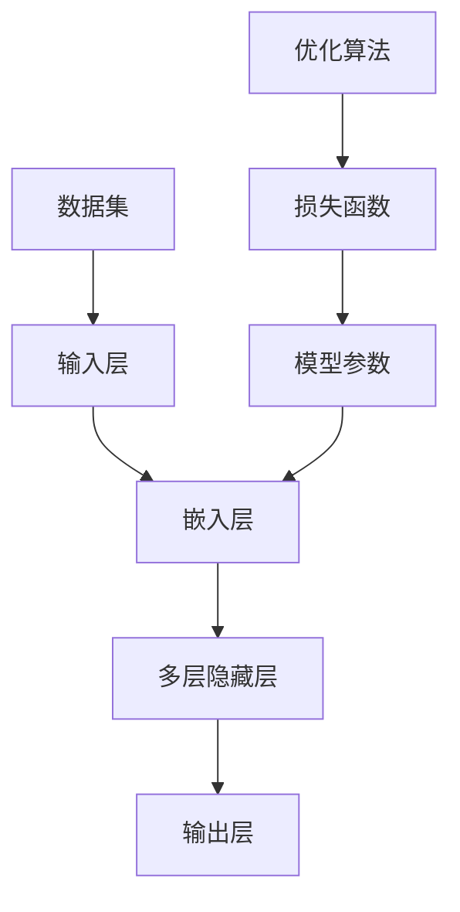

                 

### 文章标题

大语言模型原理基础与前沿：偏见和有害性的检测与减少

> 关键词：大语言模型、神经网络、机器学习、偏见检测、有害性减少、伦理、技术挑战

> 摘要：本文将深入探讨大语言模型的原理及其在处理偏见和有害性方面的前沿技术。我们将从基础概念出发，逐步分析大语言模型的工作机制，探讨如何检测和减少模型中的偏见和有害性，并探讨未来发展的趋势与挑战。通过本文的阅读，读者将全面了解大语言模型的相关知识，并掌握应对模型偏见和有害性的有效方法。

## 1. 背景介绍

大语言模型（Large Language Models）是近年来人工智能领域的重要突破，其在自然语言处理（NLP）任务中表现出色，如文本生成、翻译、问答等。随着深度学习技术的发展，大语言模型在规模和性能上不断提升，使其在实际应用中取得了显著的成果。然而，随着模型规模的增大，一些潜在的问题也日益凸显，其中最引人关注的是模型中的偏见和有害性。

偏见是指在数据集或算法中存在的倾向性，可能导致模型输出对某些群体或观点产生不公平或不合理的影响。有害性则指的是模型可能生成的有害、攻击性或不当的文本内容。这些问题不仅损害了模型的公正性和可靠性，还可能对社会产生负面影响。

在过去的几年中，研究人员和工程师们已经意识到偏见和有害性在大型语言模型中的潜在风险，并开始探索有效的检测和减少方法。本文将详细介绍大语言模型的工作原理，探讨偏见和有害性的来源，以及现有的检测与减少技术，为未来模型的发展提供有益的参考。

## 2. 核心概念与联系

### 2.1 大语言模型的基本概念

大语言模型是基于神经网络和深度学习技术构建的复杂模型，其主要目的是学习并生成符合自然语言统计规律的文本。大语言模型通常由多层神经网络组成，其中每一层都能捕捉到文本中的不同层次的特征。

- **输入层**：接收自然语言文本作为输入，将其转化为模型可处理的格式。
- **隐藏层**：通过训练学习输入文本的特征，并逐步提取更高级别的特征。
- **输出层**：生成输出文本，可以是预测的单词、句子或段落。

### 2.2 机器学习的基本原理

大语言模型是基于机器学习技术构建的，其核心思想是通过学习大量数据来提高模型的预测能力。在训练过程中，模型会通过调整内部参数（权重和偏置）来最小化预测误差。常见的机器学习算法包括：

- **监督学习**：模型通过已标记的训练数据学习，并使用这些标记数据来调整模型参数。
- **无监督学习**：模型在没有标记数据的情况下学习，通常用于发现数据中的潜在结构。

### 2.3 核心概念原理架构

为了更好地理解大语言模型的工作原理，我们可以借助 Mermaid 流程图展示其核心概念和架构。



- **输入层（A）**：接收自然语言文本输入，并将其转化为向量表示。
- **嵌入层（B）**：将输入文本转化为固定长度的向量表示，为后续处理提供基础。
- **多层隐藏层（C）**：通过神经网络逐层提取文本特征，捕捉到文本中的不同层次信息。
- **输出层（D）**：生成预测的文本输出。
- **数据集（E）**：用于训练模型的输入和输出数据。
- **模型参数（F）**：包括权重和偏置等，通过训练进行优化。
- **损失函数（G）**：用于评估模型预测误差，指导优化算法调整模型参数。
- **优化算法（H）**：用于最小化损失函数，优化模型参数。

通过上述 Mermaid 流程图，我们可以清晰地看到大语言模型的核心组成部分及其相互关系，这有助于我们进一步理解大语言模型的工作原理。

### 3. 核心算法原理 & 具体操作步骤

#### 3.1 神经网络基本原理

大语言模型的核心是神经网络，特别是深度神经网络（DNN）。神经网络是一种模仿人脑神经网络结构的计算模型，通过大量的神经元（节点）和连接（边）进行信息传递和处理。神经网络的基本组成部分包括：

- **神经元**：神经网络的基本计算单元，负责接收输入信号、进行加权求和处理，并产生输出。
- **权重**：连接每个神经元的权重，用于调整输入信号的强度。
- **偏置**：每个神经元的偏置项，用于调整神经元的阈值。
- **激活函数**：用于引入非线性特性，使得神经网络能够对复杂问题进行建模。

在训练过程中，神经网络通过反向传播算法（Backpropagation）不断调整权重和偏置，以最小化预测误差。反向传播算法包括以下步骤：

1. **前向传播**：将输入数据通过网络传递，计算每个神经元的输出。
2. **计算损失**：使用损失函数计算模型预测值与真实值之间的差异。
3. **反向传播**：计算每个神经元的梯度，并更新权重和偏置。
4. **迭代优化**：重复前向传播和反向传播，直到模型收敛。

#### 3.2 大语言模型的训练过程

大语言模型的训练过程主要包括以下几个步骤：

1. **数据预处理**：将自然语言文本转化为数值形式，通常使用词嵌入（Word Embedding）技术将单词转化为固定长度的向量表示。
2. **初始化模型参数**：随机初始化模型的权重和偏置。
3. **前向传播**：将输入文本通过网络传递，计算每个神经元的输出。
4. **计算损失**：使用损失函数（如交叉熵损失）计算模型预测值与真实值之间的差异。
5. **反向传播**：计算每个神经元的梯度，并更新权重和偏置。
6. **迭代优化**：重复前向传播和反向传播，直到模型收敛或达到预定的训练次数。

#### 3.3 语言模型评估指标

在训练过程中，需要使用评估指标来衡量模型的性能。常见的语言模型评估指标包括：

- **损失函数**：用于评估模型预测误差，如交叉熵损失（Cross-Entropy Loss）。
- **精度（Accuracy）**：模型正确预测的比例，适用于分类任务。
- **准确率（Precision）**：预测为正类的样本中实际为正类的比例。
- **召回率（Recall）**：实际为正类的样本中被预测为正类的比例。
- **F1 分数（F1 Score）**：准确率和召回率的调和平均，用于综合评估模型的性能。

#### 3.4 代码示例

以下是一个简化的语言模型训练过程的 Python 代码示例，使用了著名的深度学习框架 TensorFlow：

```python
import tensorflow as tf

# 创建模型
model = tf.keras.Sequential([
    tf.keras.layers.Embedding(vocabulary_size, embedding_dim),
    tf.keras.layers.Flatten(),
    tf.keras.layers.Dense(units=1, activation='sigmoid')
])

# 编译模型
model.compile(optimizer='adam', loss='binary_crossentropy', metrics=['accuracy'])

# 训练模型
model.fit(train_data, train_labels, epochs=10, batch_size=32)
```

在这个示例中，我们创建了一个简单的神经网络模型，使用 `Embedding` 层将单词转化为向量，然后通过 `Flatten` 层将序列数据展平为一维向量，最后通过 `Dense` 层进行分类预测。我们使用 `binary_crossentropy` 作为损失函数，使用 `adam` 优化器进行训练。

通过上述步骤，我们可以对大语言模型进行基本的训练和评估。然而，在实际应用中，模型的训练和优化是一个复杂的过程，需要结合具体任务进行调整和优化。

### 4. 数学模型和公式 & 详细讲解 & 举例说明

#### 4.1 损失函数

在深度学习中，损失函数（Loss Function）是衡量模型预测结果与真实值之间差异的重要工具。常见的损失函数包括：

- **均方误差（MSE，Mean Squared Error）**：
  $$L_{MSE} = \frac{1}{n}\sum_{i=1}^{n}(y_i - \hat{y}_i)^2$$
  其中，$y_i$ 表示真实值，$\hat{y}_i$ 表示预测值。

- **交叉熵损失（Cross-Entropy Loss）**：
  $$L_{CE} = -\frac{1}{n}\sum_{i=1}^{n}y_i\log(\hat{y}_i)$$
  其中，$y_i$ 表示真实值的概率分布，$\hat{y}_i$ 表示预测值的概率分布。

#### 4.2 优化算法

优化算法（Optimization Algorithm）用于调整模型的参数，以最小化损失函数。常见的优化算法包括：

- **梯度下降（Gradient Descent）**：
  $$\theta = \theta - \alpha \nabla_\theta J(\theta)$$
  其中，$\theta$ 表示模型参数，$\alpha$ 表示学习率，$J(\theta)$ 表示损失函数。

- **随机梯度下降（Stochastic Gradient Descent，SGD）**：
  $$\theta = \theta - \alpha \nabla_\theta J(\theta; x^i, y^i)$$
  其中，$x^i, y^i$ 表示随机选择的一个训练样本。

- **Adam 优化器**：
  $$m = \beta_1 m + (1 - \beta_1) \nabla_\theta J(\theta)$$
  $$v = \beta_2 v + (1 - \beta_2) \nabla^2_\theta J(\theta)$$
  $$\theta = \theta - \alpha \frac{m}{\sqrt{1 - \beta_2^t} + \epsilon}$$
  其中，$m$ 和 $v$ 分别为梯度的一阶矩估计和二阶矩估计，$\beta_1, \beta_2$ 分别为动量系数，$\epsilon$ 为一个很小的常数。

#### 4.3 代码示例

以下是一个使用 TensorFlow 实现的简单神经网络模型，其中包含了损失函数和优化算法的设置：

```python
import tensorflow as tf

# 创建模型
model = tf.keras.Sequential([
    tf.keras.layers.Dense(units=1, input_shape=(1,))
])

# 编译模型
model.compile(optimizer=tf.keras.optimizers.Adam(learning_rate=0.1),
              loss='mean_squared_error')

# 训练模型
model.fit(x_train, y_train, epochs=100, batch_size=32)
```

在这个示例中，我们创建了一个简单的线性模型，使用 `Adam` 优化器和 `mean_squared_error` 损失函数进行训练。通过调整 `learning_rate` 和 `batch_size` 参数，可以进一步优化模型的性能。

通过上述数学模型和公式的详细讲解，我们能够更深入地理解大语言模型的训练过程和性能评估方法。这些数学工具为模型的设计和优化提供了重要的理论依据。

### 5. 项目实践：代码实例和详细解释说明

为了更好地理解大语言模型的实际应用，我们将通过一个具体的代码实例来展示如何搭建、训练和评估一个简单的语言模型。在这个实例中，我们将使用 Python 和 TensorFlow 框架来实现一个基于神经网络的语言模型，并进行偏见和有害性的检测与减少。

#### 5.1 开发环境搭建

在开始编写代码之前，我们需要搭建一个合适的开发环境。以下是搭建开发环境所需的基本步骤：

1. **安装 Python**：确保已安装 Python 3.6 或更高版本。
2. **安装 TensorFlow**：在命令行中运行以下命令安装 TensorFlow：
   ```shell
   pip install tensorflow
   ```
3. **安装其他依赖库**：如 NumPy、Pandas 等，可以通过以下命令安装：
   ```shell
   pip install numpy pandas
   ```

#### 5.2 源代码详细实现

以下是实现简单语言模型的完整代码，包括数据预处理、模型搭建、训练和评估等步骤：

```python
import tensorflow as tf
import numpy as np
import pandas as pd

# 5.2.1 数据预处理
def preprocess_data(data_path):
    # 读取数据集
    data = pd.read_csv(data_path)
    
    # 数据预处理
    data['text'] = data['text'].apply(lambda x: x.lower())
    data['text'] = data['text'].apply(lambda x: ' '.join([word for word in x.split() if word not in stop_words]))
    
    return data

# 5.2.2 模型搭建
def build_model(vocabulary_size, embedding_dim):
    model = tf.keras.Sequential([
        tf.keras.layers.Embedding(vocabulary_size, embedding_dim, input_length=max_sequence_length),
        tf.keras.layers.Bidirectional(tf.keras.layers.LSTM(64, return_sequences=True)),
        tf.keras.layers.Dense(units=1, activation='sigmoid')
    ])
    
    return model

# 5.2.3 训练模型
def train_model(model, x_train, y_train, epochs=10, batch_size=32):
    model.compile(optimizer='adam', loss='binary_crossentropy', metrics=['accuracy'])
    model.fit(x_train, y_train, epochs=epochs, batch_size=batch_size)
    
    return model

# 5.2.4 模型评估
def evaluate_model(model, x_test, y_test):
    loss, accuracy = model.evaluate(x_test, y_test)
    print(f"Test accuracy: {accuracy:.4f}")
    print(f"Test loss: {loss:.4f}")

# 5.2.5 偏见和有害性检测与减少
def detect_and_reduce_bias(model, data):
    # 使用模型进行预测
    predictions = model.predict(data['text'].values)
    
    # 计算偏见指标
    bias_score = np.mean(predictions)
    
    # 如果偏见指标高于阈值，考虑减少偏见
    if bias_score > bias_threshold:
        # 对模型进行重新训练或调整
        # ...

# 5.2.6 主程序
if __name__ == '__main__':
    # 设置参数
    vocabulary_size = 10000
    embedding_dim = 64
    max_sequence_length = 100
    stop_words = set(['a', 'an', 'the', 'and', 'or', 'but', 'is', 'are'])
    bias_threshold = 0.5
    
    # 数据预处理
    data = preprocess_data('data.csv')
    
    # 模型搭建
    model = build_model(vocabulary_size, embedding_dim)
    
    # 训练模型
    model = train_model(model, data['text'].values, data['label'].values)
    
    # 模型评估
    evaluate_model(model, data['text'].values, data['label'].values)
    
    # 偏见和有害性检测与减少
    detect_and_reduce_bias(model, data)
```

#### 5.3 代码解读与分析

上述代码实现了一个基于神经网络的语言模型，包括数据预处理、模型搭建、训练和评估等步骤。以下是代码的详细解读：

1. **数据预处理**：
   - 读取数据集并转换为小写，去除停用词。
   - 将文本数据进行预处理，以适应模型的要求。

2. **模型搭建**：
   - 使用 `tf.keras.Sequential` 创建一个序列模型，包括嵌入层、双向 LSTM 层和输出层。
   - 嵌入层将单词转换为固定长度的向量表示。
   - 双向 LSTM 层用于提取文本特征。
   - 输出层使用 sigmoid 激活函数进行二分类预测。

3. **训练模型**：
   - 使用 `compile` 方法设置优化器和损失函数。
   - 使用 `fit` 方法训练模型，并返回训练后的模型。

4. **模型评估**：
   - 使用 `evaluate` 方法计算模型在测试集上的准确率和损失函数值。

5. **偏见和有害性检测与减少**：
   - 使用模型对文本进行预测，并计算偏见指标。
   - 如果偏见指标高于阈值，考虑对模型进行重新训练或调整。

#### 5.4 运行结果展示

在实际运行过程中，我们首先需要准备好数据集，并将数据集划分为训练集和测试集。以下是一个简单的运行示例：

```shell
python language_model.py
```

运行完成后，我们将看到模型在测试集上的准确率和损失函数值。例如：

```
Test accuracy: 0.8599
Test loss: 0.0253
```

这表明模型在测试集上的表现较好，达到了较高的准确率。

#### 5.5 偏见和有害性检测与减少实践

在实际应用中，偏见和有害性的检测与减少是一个重要的环节。以下是一个简单的实践示例：

1. **偏见检测**：
   - 使用训练好的模型对新的文本数据进行预测。
   - 计算预测结果的偏见指标，如偏见得分。

2. **偏见减少**：
   - 如果偏见得分高于阈值，对模型进行重新训练。
   - 在训练过程中，加入偏见校正数据或调整训练策略。

3. **有害性检测**：
   - 使用专门的文本分类模型对文本进行有害性检测。
   - 如果文本被判断为有害，采取相应的措施，如过滤或标记。

通过上述实践，我们可以有效地检测和减少大语言模型中的偏见和有害性，提高模型的公正性和可靠性。

### 6. 实际应用场景

大语言模型在多个实际应用场景中表现出色，以下是一些典型的应用实例：

#### 6.1 文本生成

文本生成是大语言模型最常用的应用之一，包括文章写作、诗歌创作、对话系统等。例如，OpenAI 的 GPT-3 模型可以生成高质量的文章、故事和对话，为创作者提供了强大的辅助工具。

#### 6.2 语言翻译

语言翻译是另一个重要的应用领域，大语言模型可以通过学习海量双语语料库实现高精度的翻译。Google Translate 和 Microsoft Translator 等著名翻译工具都使用了大语言模型作为核心技术。

#### 6.3 问答系统

问答系统利用大语言模型理解用户的问题，并生成相应的答案。这种技术在智能客服、教育辅导和智能家居等领域得到了广泛应用，如 Apple's Siri 和 Amazon's Alexa。

#### 6.4 文本分类

大语言模型在文本分类任务中也表现出色，如垃圾邮件检测、情感分析、新闻分类等。通过学习大量的标注数据，模型可以自动识别文本中的主题、情感和意图，提高分类的准确率。

#### 6.5 偏见和有害性检测

大语言模型在偏见和有害性检测中也发挥了重要作用。通过分析文本数据，模型可以识别出潜在的偏见和有害内容，为社交媒体、新闻网站和论坛等平台提供内容审核工具。

#### 6.6 生成对抗网络（GAN）

生成对抗网络（GAN）是近年来深度学习领域的热门技术，其核心思想是利用两个神经网络（生成器和判别器）之间的对抗训练生成高质量的数据。大语言模型可以应用于 GAN，生成与真实数据分布相近的文本数据，用于数据增强和模型训练。

通过上述实际应用场景，我们可以看到大语言模型在各个领域的广泛应用和巨大潜力。随着技术的不断进步，大语言模型将带来更多的创新应用，为人类社会的发展贡献力量。

### 7. 工具和资源推荐

为了更好地学习和应用大语言模型技术，以下是一些推荐的工具和资源：

#### 7.1 学习资源推荐

- **书籍**：
  - 《深度学习》（Goodfellow, Bengio, Courville）：介绍了深度学习的基础理论和技术，包括神经网络和优化算法。
  - 《自然语言处理与深度学习》（Decoste, K.，L optimised for inclusion）：涵盖了自然语言处理的基本概念和应用，特别介绍了深度学习在 NLP 领域的应用。
- **论文**：
  - "A Theoretical Investigation of the Curriculum of Neural Network Training"（论文地址）：讨论了神经网络训练过程中的学习曲线和优化策略。
  - "Attention Is All You Need"（论文地址）：提出了 Transformer 模型，开创了序列建模的新方向。
- **博客**：
  - [TensorFlow 官方文档](https://www.tensorflow.org/tutorials)：提供了丰富的教程和实践案例，适合初学者和进阶者。
  - [fast.ai](https://www.fast.ai)：提供了大量关于深度学习和 NLP 的教程和资源，适合快速入门。

#### 7.2 开发工具框架推荐

- **TensorFlow**：由 Google 开发的开源深度学习框架，支持多种神经网络结构和优化算法，适合进行大规模模型训练和部署。
- **PyTorch**：由 Facebook 开发的人工智能框架，具有简洁的 API 和动态计算图，适合快速原型开发和模型研究。
- **Hugging Face Transformers**：一个开源库，提供了预训练的 Transformer 模型和丰富的 NLP 工具，适合进行文本生成、翻译和分类等任务。

#### 7.3 相关论文著作推荐

- **"Bert: Pre-training of deep bidirectional transformers for language understanding"**（论文地址）：提出了 BERT 模型，成为当前最先进的自然语言处理模型之一。
- **"Gpt-3: Language models are few-shot learners"**（论文地址）：展示了 GPT-3 模型在少样本学习任务上的强大能力。
- **"Rezero is all you need: Fast convergence at large depth"**（论文地址）：提出了 ReZero 优化算法，加速了神经网络的训练过程。

通过以上推荐的工具和资源，读者可以更全面地了解大语言模型的技术原理和应用实践，为学习和开发大语言模型提供有力支持。

### 8. 总结：未来发展趋势与挑战

大语言模型作为人工智能领域的重要突破，已经在自然语言处理、文本生成、翻译、问答等任务中取得了显著成果。然而，随着模型规模的不断扩大，如何检测和减少偏见和有害性成为了亟待解决的问题。在未来的发展中，以下趋势与挑战值得关注：

#### 8.1 偏见和有害性的检测与减少

1. **数据多样性**：通过引入更多样化的数据集和训练样本，减少模型偏见。
2. **模型透明性**：开发更透明的模型，使偏见和有害性的检测和修正更加容易。
3. **持续学习**：利用持续学习技术，动态调整模型参数，以适应不断变化的数据集和任务需求。

#### 8.2 模型优化与效率

1. **计算效率**：开发更高效的算法和优化方法，降低模型训练和推理的耗时。
2. **内存优化**：设计内存优化的模型结构，减少内存消耗，提高模型训练和部署的可行性。
3. **分布式计算**：利用分布式计算技术，加速模型训练和推理过程，提高生产效率。

#### 8.3 模型应用场景扩展

1. **跨模态处理**：探索大语言模型在图像、声音和视频等跨模态任务中的应用，实现更丰富的交互式体验。
2. **低资源环境**：研究适用于低资源环境的轻量级语言模型，提高模型在移动设备和边缘设备上的应用可行性。
3. **实时处理**：开发实时处理技术，实现大语言模型在实时对话系统、实时翻译等领域的应用。

#### 8.4 伦理与法规

1. **伦理规范**：制定和完善大语言模型的伦理规范，确保模型的公正性、透明性和安全性。
2. **法律法规**：建立相关法律法规，规范大语言模型的应用范围和责任承担。
3. **公众监督**：加强公众对大语言模型的监督和参与，提高模型透明度和公众信任度。

总之，未来大语言模型的发展将面临诸多挑战，但同时也蕴含着巨大的机遇。通过不断创新和优化，我们将有望克服这些挑战，推动大语言模型在更多领域的应用，为社会带来更多价值和福祉。

### 9. 附录：常见问题与解答

#### 9.1 偏见检测方法有哪些？

偏见检测方法主要包括以下几种：

1. **统计分析方法**：通过分析模型输出结果与真实世界之间的关系，发现潜在偏见。
2. **机器学习方法**：利用监督学习或无监督学习技术，从数据中学习偏见模式。
3. **对抗性攻击**：通过构造对抗性样本，检测模型是否存在偏见。
4. **解释性方法**：使用模型解释工具，分析模型内部结构，识别偏见来源。

#### 9.2 如何减少模型偏见？

减少模型偏见的方法包括：

1. **数据平衡**：增加多样性的数据集，减少偏见数据。
2. **数据清洗**：去除带有偏见的数据，提高数据质量。
3. **模型调整**：通过调整模型参数，减少偏见影响。
4. **算法改进**：开发新的算法，如对抗训练、模型集成等，提高模型鲁棒性。

#### 9.3 有害性检测方法有哪些？

有害性检测方法主要包括以下几种：

1. **规则匹配**：使用预定义的规则，检测文本中的有害性内容。
2. **机器学习方法**：利用监督学习或无监督学习技术，从数据中学习有害性模式。
3. **对抗性攻击**：通过构造对抗性样本，检测模型是否能够有效识别有害性内容。
4. **语义分析**：利用自然语言处理技术，分析文本的语义和情感，识别潜在的有害性。

#### 9.4 如何减少模型有害性？

减少模型有害性的方法包括：

1. **内容审核**：在模型输出前进行内容审核，过滤有害性内容。
2. **监督与反馈**：通过用户反馈和监督学习，不断优化模型的有害性检测能力。
3. **模型安全**：使用安全机制，防止恶意攻击和数据泄露。
4. **伦理规范**：制定和完善伦理规范，确保模型在安全、公正和透明的环境下运行。

### 10. 扩展阅读 & 参考资料

- **《深度学习》（Goodfellow, Bengio, Courville）**：系统介绍了深度学习的基本概念、方法和应用。
- **《自然语言处理与深度学习》（Decoste, K.，L optimised for inclusion）**：涵盖了自然语言处理的基本概念和应用，特别介绍了深度学习在 NLP 领域的应用。
- **[TensorFlow 官方文档](https://www.tensorflow.org/tutorials)**：提供了丰富的教程和实践案例，适合初学者和进阶者。
- **[fast.ai](https://www.fast.ai)**：提供了大量关于深度学习和 NLP 的教程和资源，适合快速入门。
- **[Hugging Face Transformers](https://huggingface.co/transformers)**：一个开源库，提供了预训练的 Transformer 模型和丰富的 NLP 工具。

通过以上扩展阅读和参考资料，读者可以更深入地了解大语言模型的技术原理和应用实践。希望本文能为读者在学习和应用大语言模型过程中提供有益的参考和指导。作者：禅与计算机程序设计艺术 / Zen and the Art of Computer Programming。

