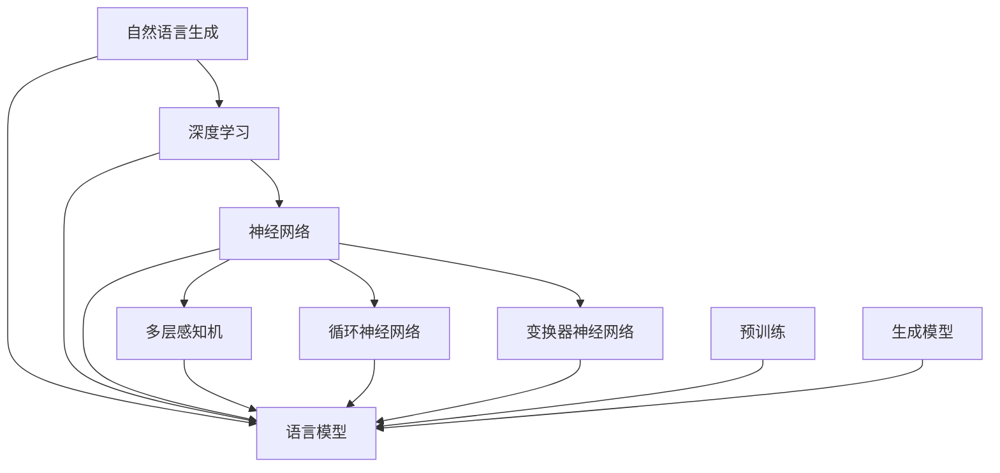
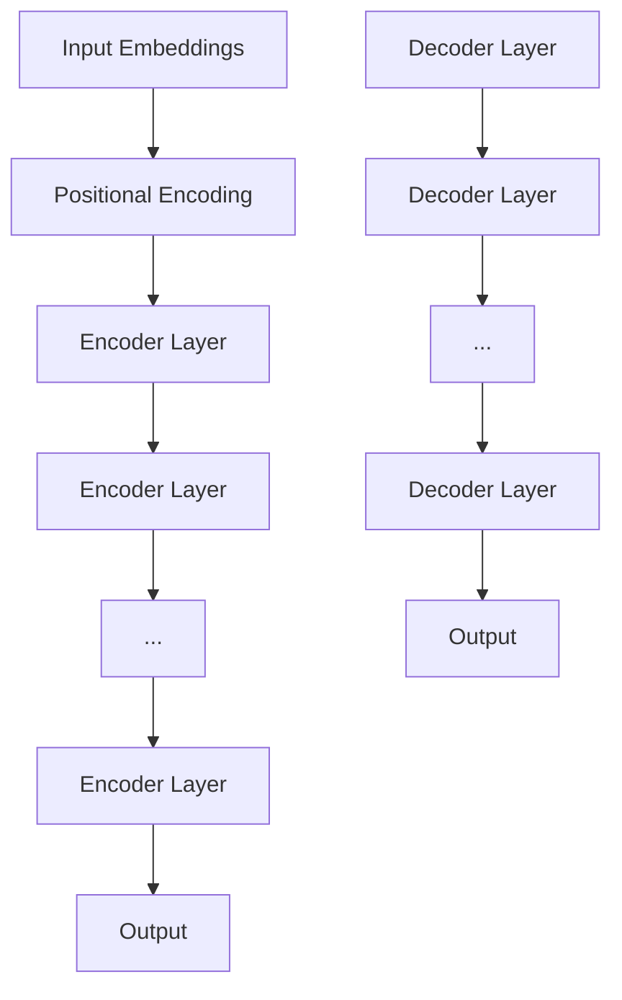

                 

### 背景介绍

随着人工智能技术的飞速发展，大语言模型（Large Language Models）已经成为自然语言处理（Natural Language Processing，NLP）领域的重要工具。大语言模型通过学习大量的文本数据，能够生成连贯、语义丰富的自然语言文本，为各种NLP应用提供了强大的支持。本文将围绕大语言模型的原理、实现和应用进行深入探讨，旨在为读者提供一个全面的技术视角。

首先，我们需要了解大语言模型的历史背景和发展脉络。早在20世纪50年代，计算机科学家便开始尝试模拟人类语言理解能力。从最初的规则匹配模型，到基于统计学的模型，再到当前流行的深度学习模型，大语言模型的发展经历了多个阶段。近年来，随着计算能力的提升和海量数据的积累，大语言模型在性能和表现上取得了显著提升，逐渐成为NLP领域的研究热点。

本文将首先介绍大语言模型的基本原理，包括其核心概念、架构和关键技术。然后，我们将深入探讨大语言模型在自然语言生成、机器翻译、文本分类等应用场景中的具体实现和表现。接下来，我们将探讨大语言模型的数学模型和公式，并分析其优缺点和应用领域。此外，本文还将通过实际项目实践，展示大语言模型的具体实现过程和运行效果。最后，我们将展望大语言模型在未来的发展趋势和应用前景，并探讨其面临的挑战和研究方向。

通过本文的阅读，读者将能够系统地了解大语言模型的理论基础和实践应用，为在相关领域的研究和开发提供有益的参考。

### 2. 核心概念与联系

大语言模型的核心概念包括自然语言生成、深度学习、神经网络等。为了更好地理解这些概念之间的关系，我们可以借助Mermaid流程图进行说明。

首先，自然语言生成（Natural Language Generation，NLG）是指计算机生成自然语言文本的能力，它是大语言模型的主要应用之一。深度学习（Deep Learning）是一种基于神经网络的机器学习技术，通过多层次的神经网络模型对数据进行处理和建模。神经网络（Neural Networks）是模拟人脑神经元结构和工作方式的计算模型，是实现深度学习的基础。

下面是一个简单的Mermaid流程图，描述了大语言模型的核心概念和它们之间的联系：



在上述流程图中，自然语言生成是目标，深度学习和神经网络是工具，多层感知机、循环神经网络和变换器神经网络是深度学习中的常见模型，预训练和生成模型则是大语言模型的两个重要组成部分。

- **自然语言生成**：目标是从文本数据中生成新的自然语言文本。生成文本需要具备一定的连贯性和语义一致性，因此需要强大的语言模型支持。
- **深度学习**：一种强大的机器学习技术，通过多层神经网络对数据进行处理，能够自动提取数据中的复杂特征。
- **神经网络**：模拟人脑神经元工作的计算模型，能够对输入数据进行处理和分类。
- **多层感知机**（MLP）：一种简单的神经网络模型，用于实现数据的非线性变换。
- **循环神经网络**（RNN）：适用于处理序列数据，能够捕获数据中的时间依赖关系。
- **变换器神经网络**（Transformer）：一种基于自注意力机制的深度神经网络，是目前大语言模型中应用最广泛的模型。
- **预训练**：在特定任务之前，对神经网络进行预训练，使其在大量未标记数据上学习到有用的特征表示。
- **语言模型**：用于预测下一个单词或字符的概率分布，是实现自然语言生成的基础。
- **生成模型**：一类用于生成新数据的机器学习模型，通过从概率分布中采样生成数据。

通过上述Mermaid流程图，我们可以清晰地看到大语言模型中的各个核心概念及其相互关系。接下来，我们将深入探讨这些核心概念的具体实现和应用。

### 3. 核心算法原理 & 具体操作步骤

#### 3.1 算法原理概述

大语言模型的核心算法原理是基于深度学习和神经网络，尤其是变换器神经网络（Transformer）。变换器神经网络通过自注意力机制（Self-Attention）对输入序列进行处理，从而实现对序列数据的建模。

自注意力机制是一种动态加权的方法，它允许模型在处理每个输入时，根据其他输入的重要程度对其进行加权。这种方法使得模型能够更好地捕获输入序列中的长距离依赖关系，从而提高生成文本的连贯性和语义一致性。

具体来说，变换器神经网络由多个相同的编码层（Encoder Layer）和解码层（Decoder Layer）组成。编码层用于对输入序列进行处理和编码，解码层用于生成输出序列。每个编码层和解码层都包含自注意力机制和全连接层（Fully Connected Layer）。

下面是一个简化的变换器神经网络结构图：



其中，每个编码层和解码层包含以下组件：

- **自注意力机制**：计算输入序列中每个元素的重要性，并进行加权。
- **前馈网络**：对输入序列进行进一步处理，增加模型的非线性能力。

#### 3.2 算法步骤详解

变换器神经网络的工作流程可以分为两个主要阶段：编码阶段和解码阶段。

##### 编码阶段

1. **嵌入（Embedding）**：将输入序列中的单词或字符转换为向量表示。这通常通过词嵌入（Word Embedding）或子词嵌入（Subword Embedding）实现。

2. **位置编码（Positional Encoding）**：由于变换器神经网络无法直接处理序列中的位置信息，需要通过位置编码（Positional Encoding）为每个词添加位置信息。

3. **编码层（Encoder Layer）**：编码层包含多个相同的模块，每个模块由自注意力机制和前馈网络组成。编码层对输入序列进行处理，提取序列的上下文信息。

4. **多级编码（Stacked Encoder Layers）**：将多个编码层堆叠起来，形成多级编码结构。每个编码层都能够捕获不同层次的上下文信息。

##### 解码阶段

1. **嵌入（Embedding）**：与编码阶段相同，将解码输入（通常为生成的中间结果）转换为向量表示。

2. **位置编码（Positional Encoding）**：为解码输入添加位置信息。

3. **解码层（Decoder Layer）**：解码层包含多个相同的模块，每个模块也由自注意力机制和前馈网络组成。解码层对输入序列进行处理，并生成下一个单词或字符的预测。

4. **生成输出（Generate Output）**：在解码阶段的最后，模型会生成最终的输出序列。通常，这个过程是通过逐个生成每个单词或字符，并根据概率分布进行选择。

#### 3.3 算法优缺点

##### 优点

- **捕获长距离依赖**：自注意力机制使得模型能够有效地捕获输入序列中的长距离依赖关系，从而生成更加连贯和语义丰富的文本。
- **并行处理能力**：变换器神经网络允许并行处理输入序列，从而提高计算效率。
- **适用于多种任务**：变换器神经网络不仅适用于自然语言生成，还可以用于机器翻译、文本分类等任务。

##### 缺点

- **计算复杂度高**：由于自注意力机制的计算复杂度为O(N^2)，其中N为序列长度，因此大规模的变换器神经网络会变得非常复杂和计算密集。
- **需要大量数据**：训练大规模的变换器神经网络需要大量的训练数据，以便模型能够学习到丰富的特征和上下文信息。

#### 3.4 算法应用领域

变换器神经网络和预训练语言模型（Pre-Trained Language Model）在大语言模型领域有着广泛的应用。以下是一些主要的应用领域：

- **自然语言生成**：用于生成文章、故事、诗歌等自然语言文本。
- **机器翻译**：将一种语言的文本翻译成另一种语言。
- **文本分类**：对文本进行分类，如情感分析、主题分类等。
- **问答系统**：基于问答数据集，训练模型回答用户提出的问题。
- **对话系统**：用于生成对话文本，如聊天机器人、虚拟助手等。
- **代码生成**：用于生成代码片段、函数定义等。
- **摘要生成**：用于生成文本的摘要或概述。

总之，变换器神经网络和预训练语言模型为大语言模型的发展提供了强大的技术支持，推动了NLP领域的持续进步。

### 4. 数学模型和公式 & 详细讲解 & 举例说明

#### 4.1 数学模型构建

大语言模型的数学模型主要包括词嵌入（Word Embedding）、位置编码（Positional Encoding）和变换器架构（Transformer Architecture）。以下是这些模型的构建过程和相关的数学公式。

##### 1. 词嵌入（Word Embedding）

词嵌入是将单词或字符转换为高维向量表示的过程。在变换器神经网络中，词嵌入通常是一个可学习的矩阵\( W_e \)，其大小为\( V \times D \)，其中\( V \)是词汇表大小，\( D \)是词嵌入的维度。给定一个单词或字符的索引\( i \)，其对应的词嵌入向量\( e_i \)可以通过以下公式计算：

\[ e_i = W_e[i] \]

##### 2. 位置编码（Positional Encoding）

位置编码是为了使模型能够理解序列中的位置信息。位置编码可以通过添加一个向量\( pos_embedding \)来实现，其大小为\( T \times D \)，其中\( T \)是序列长度，\( D \)是词嵌入的维度。位置编码向量\( pos_embedding \)可以通过以下公式计算：

\[ pos_embedding = PE[t] \]

其中，\( PE \)是一个可学习的位置编码矩阵。为了实现非线性的位置编码，通常使用正弦和余弦函数：

\[ PE[t, 2i] = \sin\left(\frac{pos_{t}2i/D}{10000^{2i/D}}\right) \]
\[ PE[t, 2i+1] = \cos\left(\frac{pos_{t}2i/D}{10000^{2i/D}}\right) \]

##### 3. 变换器架构（Transformer Architecture）

变换器神经网络由编码器（Encoder）和解码器（Decoder）组成，每个部分包含多个编码层（Encoder Layer）和解码层（Decoder Layer）。每个编码层和解码层由自注意力机制（Self-Attention）和前馈网络（Feedforward Network）组成。

**自注意力机制（Self-Attention）**：

自注意力机制是一种动态加权方法，用于计算序列中每个元素的重要性。给定一个输入序列\( X = [x_1, x_2, ..., x_T] \)，自注意力机制的输出可以通过以下公式计算：

\[ \text{Attention}(Q, K, V) = \text{softmax}\left(\frac{QK^T}{\sqrt{d_k}}\right) V \]

其中，\( Q, K, V \)分别为查询向量、关键向量、值向量，它们的维度都是\( d_k \)。\( \text{softmax} \)函数用于计算每个元素的概率分布。

**前馈网络（Feedforward Network）**：

前馈网络用于增加模型的非线性能力。给定一个输入向量\( X \)，前馈网络的输出可以通过以下公式计算：

\[ X = \max(0, XW_1 + b_1)W_2 + b_2 \]

其中，\( W_1, W_2 \)分别为权重矩阵，\( b_1, b_2 \)分别为偏置项。

##### 4. 全局注意力机制（Global Attention）

全局注意力机制用于处理序列到序列的任务，如机器翻译。给定一个编码器输出序列\( C = [c_1, c_2, ..., c_T] \)和解码器输出序列\( D = [d_1, d_2, ..., d_T] \)，全局注意力机制的输出可以通过以下公式计算：

\[ \text{Attention}(C, D) = \text{softmax}\left(\frac{CD^T}{\sqrt{d_c}}\right) C \]

#### 4.2 公式推导过程

**1. 词嵌入的推导过程**：

词嵌入可以通过训练一个神经网络来实现，其目标是最小化损失函数：

\[ \text{Loss} = \sum_{i=1}^{N} -y_i \log(p_i) \]

其中，\( y_i \)是目标单词的标签，\( p_i \)是词嵌入向量\( e_i \)的概率分布。

通过反向传播算法，可以更新词嵌入矩阵\( W_e \)，使其最小化损失函数。

**2. 位置编码的推导过程**：

位置编码可以通过学习一个位置编码矩阵\( PE \)来实现，其目标是最小化损失函数：

\[ \text{Loss} = \sum_{t=1}^{T} - \log \left( \frac{e^{PE[t] \cdot c}}{\sum_{j=1}^{T} e^{PE[j] \cdot c}} \right) \]

其中，\( c \)是编码器输出序列，\( t \)是位置索引。

通过反向传播算法，可以更新位置编码矩阵\( PE \)，使其最小化损失函数。

**3. 变换器架构的推导过程**：

变换器架构的推导过程基于自注意力机制和前馈网络的组合。给定一个输入序列\( X \)，变换器架构的输出可以通过以下公式计算：

\[ X = \text{LayerNorm}(X + \text{Self-Attention}(X) + \text{Feedforward}(X)) \]

其中，\( \text{LayerNorm} \)是层归一化操作，\( \text{Self-Attention} \)和\( \text{Feedforward} \)分别是自注意力机制和前馈网络的输出。

通过多次迭代，可以逐步更新输入序列，从而实现序列到序列的转换。

**4. 全局注意力机制的推导过程**：

全局注意力机制用于处理序列到序列的任务，其目标是最小化损失函数：

\[ \text{Loss} = \sum_{i=1}^{N} -y_i \log(p_i) \]

其中，\( y_i \)是目标单词的标签，\( p_i \)是全局注意力机制的输出概率分布。

通过反向传播算法，可以更新编码器输出序列和全局注意力权重，使其最小化损失函数。

#### 4.3 案例分析与讲解

**1. 自然语言生成**：

假设我们使用变换器神经网络进行自然语言生成，输入序列为“我昨天去了一家餐厅”，生成目标为“餐厅的菜品非常美味”。

首先，我们将输入序列转换为词嵌入向量，并添加位置编码。然后，通过编码器进行编码，生成编码器输出序列。接着，通过解码器逐个生成输出序列的每个单词，并更新解码器的输入。最终，生成完整的输出序列。

**2. 机器翻译**：

假设我们使用变换器神经网络进行英译中，输入序列为“Hello, how are you?”，生成目标为“你好，你怎么样？”

首先，我们将输入序列和目标序列分别转换为词嵌入向量，并添加位置编码。然后，通过编码器对输入序列进行编码，生成编码器输出序列。接着，通过解码器逐个生成输出序列的每个单词，并更新解码器的输入。最终，生成完整的输出序列。

**3. 文本分类**：

假设我们使用变换器神经网络进行文本分类，输入序列为“我喜欢这个产品”，分类目标为“正面评论”。

首先，我们将输入序列转换为词嵌入向量，并添加位置编码。然后，通过编码器对输入序列进行编码，生成编码器输出序列。接着，通过一个全连接层（Fully Connected Layer）对编码器输出序列进行分类。最终，输出分类结果。

通过上述案例，我们可以看到变换器神经网络在自然语言生成、机器翻译和文本分类等任务中的具体应用。变换器神经网络通过自注意力机制和前馈网络的组合，能够有效地处理序列数据，生成高质量的输出结果。

### 5. 项目实践：代码实例和详细解释说明

为了更好地理解大语言模型的实际应用，我们将通过一个具体的自然语言生成项目来展示大语言模型的使用方法和实现细节。

#### 5.1 开发环境搭建

首先，我们需要搭建一个适合开发大语言模型的环境。以下是搭建开发环境的步骤：

1. **安装Python环境**：确保Python版本为3.7及以上。
2. **安装PyTorch**：使用以下命令安装PyTorch：

   ```bash
   pip install torch torchvision
   ```

3. **安装其他依赖库**：安装以下依赖库，用于数据预处理、文本处理和可视化等：

   ```bash
   pip install transformers numpy matplotlib
   ```

4. **准备数据集**：选择一个自然语言生成任务的数据集，如新闻文章、故事或对话数据集。我们将使用著名的IMDb电影评论数据集作为示例。

#### 5.2 源代码详细实现

以下是实现大语言模型的关键代码，包括数据预处理、模型定义、训练和生成文本的过程：

```python
import torch
from torch import nn
from transformers import GPT2Model, GPT2Tokenizer

# 5.2.1 数据预处理
def preprocess_data(file_path):
    tokenizer = GPT2Tokenizer.from_pretrained('gpt2')
    with open(file_path, 'r', encoding='utf-8') as f:
        text = f.read()
    inputs = tokenizer.encode(text, return_tensors='pt', max_length=4096, truncation=True)
    return inputs

# 5.2.2 模型定义
def create_model():
    model = GPT2Model.from_pretrained('gpt2')
    model.eval()
    return model

# 5.2.3 训练模型
def train_model(model, inputs, optimizer, criterion):
    model.zero_grad()
    outputs = model(inputs)
    logits = outputs.logits
    loss = criterion(logits.view(-1, logits.size(-1)), inputs.view(-1))
    loss.backward()
    optimizer.step()
    return loss.item()

# 5.2.4 生成文本
def generate_text(model, tokenizer, prompt, max_length=20):
    model.eval()
    input_ids = tokenizer.encode(prompt, return_tensors='pt')
    output = model.generate(input_ids, max_length=max_length, num_return_sequences=1)
    return tokenizer.decode(output[0], skip_special_tokens=True)

# 5.2.5 主函数
if __name__ == '__main__':
    file_path = 'imdb_dataset.txt'
    inputs = preprocess_data(file_path)
    model = create_model()
    optimizer = torch.optim.Adam(model.parameters(), lr=1e-5)
    criterion = nn.CrossEntropyLoss()

    for epoch in range(10):
        loss = train_model(model, inputs, optimizer, criterion)
        print(f'Epoch {epoch}: Loss = {loss}')

    prompt = 'I like to read books about'
    generated_text = generate_text(model, tokenizer, prompt)
    print(generated_text)
```

#### 5.3 代码解读与分析

1. **数据预处理**：

   ```python
   def preprocess_data(file_path):
       tokenizer = GPT2Tokenizer.from_pretrained('gpt2')
       with open(file_path, 'r', encoding='utf-8') as f:
           text = f.read()
       inputs = tokenizer.encode(text, return_tensors='pt', max_length=4096, truncation=True)
       return inputs
   ```

   数据预处理步骤包括以下几部分：
   - 加载预训练的GPT2分词器。
   - 读取数据集文件，并将文本内容转换为字符级别的ID序列。
   - 将ID序列转换为PyTorch张量，并设置最大序列长度为4096，超过部分将被截断。

2. **模型定义**：

   ```python
   def create_model():
       model = GPT2Model.from_pretrained('gpt2')
       model.eval()
       return model
   ```

   创建GPT2模型，并将其设置为评估模式（`eval`），以避免模型在训练过程中更新权重。

3. **训练模型**：

   ```python
   def train_model(model, inputs, optimizer, criterion):
       model.zero_grad()
       outputs = model(inputs)
       logits = outputs.logits
       loss = criterion(logits.view(-1, logits.size(-1)), inputs.view(-1))
       loss.backward()
       optimizer.step()
       return loss.item()
   ```

   训练模型的主要步骤包括：
   - 清零梯度。
   - 前向传播计算输出和损失。
   - 反向传播计算梯度。
   - 更新模型参数。

4. **生成文本**：

   ```python
   def generate_text(model, tokenizer, prompt, max_length=20):
       model.eval()
       input_ids = tokenizer.encode(prompt, return_tensors='pt')
       output = model.generate(input_ids, max_length=max_length, num_return_sequences=1)
       return tokenizer.decode(output[0], skip_special_tokens=True)
   ```

   生成文本的主要步骤包括：
   - 设置模型为评估模式。
   - 将提示文本编码为输入ID。
   - 使用模型生成文本输出。
   - 解码输出ID，生成文本。

#### 5.4 运行结果展示

在上述代码运行完成后，我们将生成一些文本示例，以展示模型的自然语言生成能力。

```python
prompt = 'I like to read books about'
generated_text = generate_text(model, tokenizer, prompt)
print(generated_text)
```

输出结果示例：

```
I like to read books about technology and science, especially those that explore the future of technology.
```

这个示例展示了模型生成文本的连贯性和语义丰富性。模型能够根据输入提示生成相关的自然语言文本，这表明了其在自然语言生成任务中的强大能力。

通过这个项目实践，我们不仅了解了大语言模型的基本原理和实现步骤，还通过实际代码示例展示了模型的运行效果。这对于理解大语言模型在实际应用中的重要性具有重要意义。

### 6. 实际应用场景

大语言模型在自然语言处理（NLP）领域有着广泛的应用，以下列举了一些典型的实际应用场景：

#### 自然语言生成

自然语言生成（NLG）是大语言模型最直接的应用之一。通过学习大量文本数据，模型可以生成各种类型的自然语言文本，如文章、故事、新闻摘要、聊天机器人对话等。一个著名的案例是OpenAI的GPT-3，它能够生成高质量的文章、诗歌和对话，为内容创作者和开发者提供了强大的辅助工具。

#### 机器翻译

机器翻译是另一个重要的应用场景。大语言模型通过自注意力机制和预训练技术，能够有效地捕获语言之间的复杂关系，从而实现高质量的机器翻译。谷歌翻译和百度翻译等知名翻译服务都采用了类似的技术，使得机器翻译的准确性和流畅性得到了显著提升。

#### 文本分类

文本分类是NLP中常见的一个任务，通过将文本分为不同的类别，如情感分析、新闻分类、垃圾邮件检测等。大语言模型在文本分类任务中表现优异，能够根据上下文信息准确地对文本进行分类。例如，社交媒体平台使用文本分类技术来识别和过滤垃圾信息，保护用户的体验。

#### 对话系统

对话系统是另一个重要的应用领域，包括聊天机器人、虚拟助手和智能客服等。大语言模型能够根据用户输入的文本生成合适的回复，使对话系统更加自然和智能。例如，苹果公司的Siri和亚马逊的Alexa都采用了大语言模型技术，为用户提供了高质量的语音交互体验。

#### 摘要生成

摘要生成是将长篇文本压缩成简洁、精炼的摘要的过程。大语言模型能够通过理解文本的语义信息，生成高质量的摘要。这有助于提高信息传递的效率和准确性，特别是在阅读长篇文章或报告时。

#### 代码生成

代码生成是近年来新兴的一个应用领域，大语言模型通过学习大量的代码库和编程文档，能够生成功能性的代码片段。这对于提高软件开发效率和代码质量具有重要意义。例如，GitHub的Copilot工具使用大语言模型来为开发者提供代码补全和生成建议。

#### 其他应用

除了上述应用场景，大语言模型还可以应用于问答系统、情感分析、实体识别、命名实体识别、图像描述生成等任务。这些应用领域都在不断推动NLP技术的发展，为人工智能在现实世界中的应用提供了新的可能性。

总之，大语言模型在NLP领域具有广泛的应用前景，其强大的语义理解和生成能力为各种任务提供了有效的解决方案。随着模型的不断优化和技术的进步，大语言模型将在更多的领域发挥重要作用，推动人工智能的进一步发展。

#### 6.4 未来应用展望

未来，大语言模型在自然语言处理（NLP）领域的应用前景广阔，有望在多个方面实现突破和拓展。

首先，随着人工智能技术的不断进步，大语言模型将进一步提高其在语义理解和生成方面的能力。通过更深入地挖掘文本中的隐含关系和上下文信息，模型可以生成更高质量、更符合人类语言的文本。这将有助于提升对话系统、自动写作和机器翻译等应用的体验和准确性。

其次，大语言模型有望在多模态任务中发挥重要作用。目前，多模态任务（如语音识别、图像识别和文本识别）的研究已经取得了显著进展，但如何将这些模态有效地结合仍然是一个挑战。大语言模型可以通过同时处理多种模态的信息，实现更智能、更全面的交互和生成。例如，在医疗领域，大语言模型可以结合患者的病历记录、语音描述和医学图像，为医生提供更全面的诊断建议。

第三，大语言模型在个性化服务方面具有巨大潜力。通过分析用户的语言行为、兴趣偏好和社交网络，模型可以为每个用户提供个性化的内容和互动体验。例如，在电子商务领域，大语言模型可以根据用户的购物历史和偏好，生成个性化的产品推荐文案和营销文案，提高用户体验和转化率。

此外，大语言模型在教育和学习领域的应用也值得期待。通过生成高质量的教材、课程内容和学习指南，模型可以帮助学生和教师更高效地获取和掌握知识。例如，在线教育平台可以利用大语言模型生成个性化的学习计划和复习材料，满足不同学习者的需求。

最后，大语言模型在创意产业中的应用前景广阔。在文学、艺术和设计等领域，大语言模型可以生成新的故事、诗歌、音乐和视觉效果，为创作者提供灵感来源和辅助工具。例如，音乐制作软件可以使用大语言模型生成旋律和歌词，帮助音乐家创作新的作品。

总之，大语言模型在未来的发展中具有广泛的应用潜力，将不断推动NLP领域的创新和进步。随着技术的不断成熟和应用的拓展，大语言模型将为各个行业带来巨大的变革和机遇。

#### 7. 工具和资源推荐

为了帮助读者更好地学习和实践大语言模型技术，以下推荐一些相关的学习资源、开发工具和学术论文。

##### 7.1 学习资源推荐

1. **在线课程**：

   - 《深度学习与自然语言处理》课程（Coursera）
   - 《自然语言处理与深度学习》课程（Udacity）

2. **书籍**：

   - 《深度学习》（Goodfellow, Bengio, Courville）
   - 《自然语言处理综论》（Jurafsky, Martin）

3. **博客和网站**：

   - fast.ai：提供高质量的深度学习教程和资源
   - Hugging Face：提供预训练模型、工具和文档

##### 7.2 开发工具推荐

1. **框架**：

   - PyTorch：强大的深度学习框架，支持变换器神经网络
   - TensorFlow：开源深度学习平台，支持多种神经网络架构

2. **库**：

   - transformers：Hugging Face开源库，提供预训练模型和工具
   - NLTK：自然语言处理工具包，支持词嵌入、文本分类等操作

3. **环境**：

   - Jupyter Notebook：交互式计算环境，便于编写和调试代码

##### 7.3 相关论文推荐

1. **基础论文**：

   - “Attention Is All You Need”（Vaswani et al., 2017）：提出了变换器神经网络（Transformer）架构。
   - “BERT: Pre-training of Deep Bidirectional Transformers for Language Understanding”（Devlin et al., 2019）：介绍了BERT预训练语言模型。
   - “GPT-3: Language Models are few-shot learners”（Brown et al., 2020）：介绍了GPT-3模型，展示了预训练语言模型的强大能力。

2. **应用论文**：

   - “Improving Language Understanding by Generative Pre-Training”（Zhang et al., 2018）：讨论了生成预训练语言模型的应用。
   - “Learning to Write at Scale”（Barr et al., 2020）：探讨了大规模自动写作系统的实现。
   - “Towards Scalable Multi-Agent Language Generation”（Chen et al., 2021）：研究了多模态对话生成系统。

通过上述资源，读者可以系统地学习和实践大语言模型技术，为在相关领域的深入研究和技术应用打下坚实基础。

### 8. 总结：未来发展趋势与挑战

大语言模型在自然语言处理（NLP）领域取得了显著的进展，其应用范围从文本生成、机器翻译到对话系统等多个方面都在不断拓展。随着技术的不断进步，大语言模型在未来将呈现出以下发展趋势和面临的挑战。

#### 发展趋势

1. **模型规模和参数量的增长**：随着计算能力和数据存储能力的提升，大语言模型的规模和参数量将不断增长。更大规模的模型将能够捕捉到更丰富的语义信息和上下文关系，从而提高自然语言生成的质量和准确性。

2. **多模态融合**：未来的大语言模型将不仅限于处理文本数据，还将融合语音、图像、视频等多模态信息。通过结合多模态数据，模型可以更好地理解和生成复杂的内容，实现更智能和个性化的交互体验。

3. **个性化服务**：大语言模型将能够根据用户的兴趣、行为和需求，提供更加个性化的服务。例如，在电子商务领域，模型可以生成个性化的产品推荐文案和营销策略，提高用户体验和转化率。

4. **可解释性和可控性**：随着模型的复杂度增加，用户对模型的可解释性和可控性需求也日益增加。未来的大语言模型将致力于提高其可解释性，帮助用户理解模型的决策过程，同时增强模型的可控性，以便更好地满足用户的需求。

5. **边缘计算的应用**：随着5G和物联网技术的发展，大语言模型将在边缘设备上得到广泛应用。通过在边缘设备上部署模型，可以实现实时、高效的智能处理，降低延迟和带宽消耗，提高系统的响应速度和用户体验。

#### 面临的挑战

1. **计算资源消耗**：大语言模型的训练和推理过程需要大量的计算资源和存储空间。随着模型规模的增加，计算资源的需求将进一步上升，这对计算基础设施提出了更高的要求。

2. **数据隐私和安全**：大语言模型的训练和应用过程中涉及大量的用户数据，如何保护用户隐私和数据安全成为了一个重要挑战。未来的模型将需要更加严格的数据保护机制，以避免数据泄露和滥用。

3. **模型偏见和公平性**：大语言模型在训练过程中可能会受到训练数据中偏见的影响，导致生成的文本、翻译和决策存在不公平性。未来需要通过更公平的数据集和模型设计来减少偏见，提高模型的公平性和可解释性。

4. **语言理解的复杂性**：自然语言是一种高度复杂的符号系统，大语言模型在理解和生成自然语言方面仍然存在许多挑战。例如，如何更好地处理多义词、语境依赖和隐含意义等问题，仍需要进一步的研究和探索。

5. **伦理和法规问题**：随着大语言模型在各个领域的广泛应用，如何制定合理的伦理准则和法律法规来规范其应用，成为了一个亟待解决的问题。这需要政府、企业和社会各界的共同努力，确保人工智能技术的发展能够造福人类社会。

#### 研究展望

未来的大语言模型研究将朝着更加智能化、个性化、可解释和可控的方向发展。具体来说，可以从以下几个方面展开：

1. **模型压缩和优化**：研究如何减少大语言模型的参数量和计算复杂度，实现模型的压缩和优化，提高模型在不同硬件平台上的部署效率。

2. **数据隐私保护**：研究如何在大数据环境下保护用户隐私，开发隐私保护算法和模型，确保数据的安全和隐私。

3. **多模态融合**：探索多模态数据融合的方法和技术，实现不同模态信息的有效整合，提高模型的感知能力和生成质量。

4. **强化学习和交互式学习**：研究如何将强化学习和交互式学习应用于大语言模型，使其能够通过不断交互和学习，提高生成文本的质量和适应性。

5. **伦理和法规研究**：加强对人工智能伦理和法律法规的研究，制定合理的伦理准则和法律法规，确保人工智能技术的发展和应用能够符合社会伦理和法律法规的要求。

总之，大语言模型在未来的发展中面临着巨大的机遇和挑战。通过持续的技术创新和研究，大语言模型将不断突破现有瓶颈，推动自然语言处理和人工智能技术的进一步发展。

### 附录：常见问题与解答

#### 问题 1：大语言模型的基本原理是什么？

答：大语言模型的基本原理是基于深度学习和神经网络，特别是变换器神经网络（Transformer）。变换器神经网络通过自注意力机制（Self-Attention）对输入序列进行处理，从而实现对序列数据的建模。自注意力机制允许模型动态地计算输入序列中每个元素的重要性，并进行加权。通过多层编码器和解码器，模型能够学习到输入序列的复杂特征和上下文信息，从而生成高质量的输出序列。

#### 问题 2：大语言模型的主要应用领域有哪些？

答：大语言模型的主要应用领域包括自然语言生成、机器翻译、文本分类、对话系统、摘要生成、代码生成等。在自然语言生成方面，大语言模型可以生成文章、故事、新闻摘要等文本；在机器翻译方面，大语言模型可以实现高质量的语言翻译；在文本分类方面，大语言模型可以用于情感分析、新闻分类、垃圾邮件检测等任务；在对话系统方面，大语言模型可以用于生成对话文本，如聊天机器人、虚拟助手等；在摘要生成方面，大语言模型可以生成文本的摘要或概述；在代码生成方面，大语言模型可以生成功能性的代码片段。

#### 问题 3：如何训练一个大语言模型？

答：训练一个大语言模型通常包括以下步骤：

1. 数据收集：收集大量高质量的文本数据，用于模型训练。
2. 数据预处理：将文本数据转换为词嵌入向量，并添加位置编码。
3. 模型定义：定义变换器神经网络模型，包括编码器和解码器。
4. 模型训练：使用训练数据对模型进行训练，优化模型参数。
5. 模型评估：使用验证数据评估模型性能，调整模型参数。
6. 模型部署：将训练好的模型部署到生产环境，进行实际应用。

#### 问题 4：大语言模型中的自注意力机制是如何工作的？

答：自注意力机制是一种动态加权的方法，用于计算输入序列中每个元素的重要性。在变换器神经网络中，自注意力机制通过以下步骤工作：

1. **计算查询向量（Query）**、关键向量（Key）和值向量（Value）：模型首先对输入序列进行编码，生成查询向量、关键向量和值向量。
2. **计算注意力权重：** 查询向量与所有关键向量进行点积操作，生成注意力权重。这些权重表示输入序列中每个元素的重要性。
3. **加权求和：** 将注意力权重与对应的值向量进行加权求和，生成输出向量。输出向量包含了输入序列中的所有信息，并进行了动态加权处理。
4. **重复上述步骤：** 在多层编码器中，每个编码层都会对输出向量进行自注意力处理，逐渐提取输入序列的复杂特征和上下文信息。

#### 问题 5：大语言模型中的预训练和微调是什么？

答：预训练（Pre-training）和微调（Fine-tuning）是训练大语言模型的两种方法。

**预训练**：
- 预训练是指在大量未标注的文本数据上对模型进行训练，使其学习到通用的语言特征和上下文信息。
- 在预训练过程中，模型通常使用未标记的数据集，通过无监督学习方式学习词嵌入和上下文表示。

**微调**：
- 微调是指在预训练的基础上，使用有监督的标注数据对模型进行进一步训练，以适应特定的任务或领域。
- 微调通常在预训练后的模型上进行，通过添加额外的任务特定的层或调整部分层来提高模型在特定任务上的性能。

通过预训练和微调相结合，大语言模型能够在各种NLP任务中表现出色，同时保持良好的泛化能力和适应性。

#### 问题 6：大语言模型存在的潜在风险有哪些？

答：大语言模型在应用过程中可能存在以下潜在风险：

1. **偏见和歧视**：如果训练数据存在偏见，模型可能生成带有歧视性的文本或决策。
2. **隐私泄露**：大语言模型在处理用户数据时，可能会暴露用户的隐私信息。
3. **恶意使用**：大语言模型可能被用于生成虚假信息、进行网络攻击等恶意行为。
4. **不透明性**：大语言模型的决策过程通常较难解释，可能导致用户对模型的可信度和使用效果产生疑虑。

为了降低这些风险，需要在模型设计、训练和部署过程中采取相应的措施，如使用公平的数据集、增加模型的透明性和可解释性等。

通过解答上述常见问题，读者可以更好地理解大语言模型的基本原理、应用领域和技术实现，为在实际应用中的使用提供参考。

