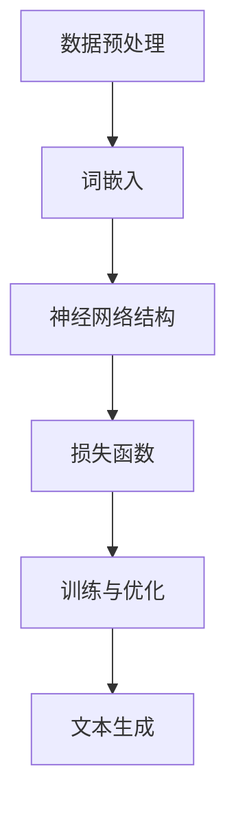

                 

### 文章标题

《大语言模型原理基础与前沿：统计语言建模》

> 关键词：大语言模型，统计语言建模，自然语言处理，机器学习，神经网络，深度学习，模型训练，模型优化

> 摘要：本文将深入探讨大语言模型的基本原理和前沿进展，重点介绍统计语言建模的方法及其在自然语言处理中的应用。通过逐步分析，我们将揭示大语言模型背后的数学和算法原理，分享实际项目实践，并探讨其在未来的发展趋势与挑战。

## 1. 背景介绍

随着互联网和大数据的迅猛发展，自然语言处理（Natural Language Processing，NLP）成为计算机科学和人工智能领域的重要分支。NLP的目标是将人类语言转换为计算机可以理解和处理的形式，从而实现人机交互、信息检索、机器翻译、情感分析等多种任务。

在大数据处理和计算能力不断提升的背景下，大语言模型（Large Language Model）应运而生。大语言模型是一种基于深度学习的统计语言建模方法，通过对海量文本数据进行训练，能够自动学习语言的规律和结构，从而实现文本生成、翻译、摘要等多种任务。

统计语言建模是NLP领域的基础，它通过统计方法建模语言中的概率关系，从而实现语言理解和生成。传统的统计语言模型如N-gram模型和概率上下文无关文法（PCFG）模型在文本生成和语言理解方面取得了一定的效果。然而，随着数据的增加和计算能力的提升，深度学习方法在统计语言建模中展现出强大的优势，成为当前研究的热点。

本文将首先介绍大语言模型的基本原理和统计语言建模的核心概念，然后深入探讨深度学习方法在大语言模型中的应用，最后通过实际项目实践和未来发展趋势，展望大语言模型在NLP领域的前景。

## 2. 核心概念与联系

### 2.1 大语言模型的基本原理

大语言模型是一种基于深度学习的统计语言建模方法，其核心思想是通过大量文本数据训练一个神经网络模型，使其能够自动学习语言的规律和结构。大语言模型通常由多层神经网络组成，包括输入层、隐藏层和输出层。输入层接收文本数据，隐藏层通过神经网络计算产生中间表示，输出层生成文本的下一个单词或字符。

大语言模型的基本原理可以概括为以下几个步骤：

1. **数据预处理**：首先，从互联网上收集大量文本数据，包括新闻、文章、社交媒体等。然后，对这些文本数据进行预处理，如分词、去除停用词、词干提取等。

2. **词嵌入**：将文本中的单词或字符映射到高维向量空间，称为词嵌入（Word Embedding）。词嵌入是一种将单词表示为向量空间中点的技术，能够捕获单词的语义和语法信息。

3. **神经网络结构**：构建多层神经网络，包括输入层、隐藏层和输出层。输入层接收词嵌入向量，隐藏层通过神经网络计算产生中间表示，输出层生成文本的下一个单词或字符。

4. **损失函数**：使用损失函数（如交叉熵损失函数）评估神经网络模型在生成文本时的误差。通过反向传播算法，优化神经网络的参数，使其能够更好地生成文本。

5. **训练与优化**：通过大量文本数据对神经网络模型进行训练，不断调整模型参数，使其在生成文本时能够最小化损失函数。

### 2.2 统计语言建模的核心概念

统计语言建模是NLP领域的基础，其核心思想是通过统计方法建模语言中的概率关系，从而实现语言理解和生成。统计语言建模的核心概念包括：

1. **N-gram模型**：N-gram模型是一种基于序列的统计语言模型，它将文本表示为一串连续的单词或字符序列。N-gram模型通过计算连续单词或字符序列的概率，来预测下一个单词或字符。

2. **概率上下文无关文法（PCFG）**：PCFG是一种语法模型，用于表示语言的语法结构。PCFG通过生成语法树来描述文本，从而实现语言生成。PCFG能够处理更复杂的语法关系，但在计算上比N-gram模型复杂。

3. **马尔可夫模型**：马尔可夫模型是一种基于概率的统计语言模型，它通过计算当前状态给定前一个状态的条件下，下一个状态的概率，来预测下一个状态。

4. **隐马尔可夫模型（HMM）**：HMM是一种基于概率的统计语言模型，它通过隐藏状态序列来描述文本的生成过程。HMM能够处理连续的文本数据，如语音信号。

### 2.3 大语言模型与统计语言建模的联系

大语言模型和统计语言建模之间存在紧密的联系。大语言模型可以看作是一种深度化的统计语言模型，它在统计语言建模的基础上，通过引入神经网络结构，实现了对语言更复杂的建模和生成。

1. **基于深度学习的N-gram模型**：大语言模型通过深度神经网络，将N-gram模型扩展到更高的维度，从而提高模型的表达能力。深度学习网络可以捕获更长的文本依赖关系，使模型能够更好地生成文本。

2. **基于神经网络的PCFG模型**：大语言模型通过神经网络结构，将PCFG模型的语法树表示转化为向量空间中的表示，从而实现语法结构的自动学习。神经网络能够自动调整模型参数，优化生成文本的质量。

3. **基于深度学习的马尔可夫模型**：大语言模型通过神经网络，将马尔可夫模型的概率关系转化为神经网络中的参数，从而实现更高效的文本生成。

### 2.4 Mermaid 流程图

为了更好地展示大语言模型和统计语言建模的概念和联系，我们可以使用Mermaid流程图来表示。以下是一个简单的Mermaid流程图示例：



在这个流程图中，A表示数据预处理，B表示词嵌入，C表示神经网络结构，D表示损失函数，E表示训练与优化，F表示文本生成。通过这个流程图，我们可以清晰地看到大语言模型和统计语言建模的各个步骤和联系。

### 2.5 小结

本节介绍了大语言模型和统计语言建模的基本原理和联系。大语言模型通过深度神经网络，实现了对语言更复杂的建模和生成，其在NLP领域具有重要的应用价值。统计语言建模作为NLP的基础，为大语言模型提供了丰富的理论支持。通过本节的介绍，读者可以更好地理解大语言模型和统计语言建模的概念，为进一步学习提供基础。

## 3. 核心算法原理 & 具体操作步骤

### 3.1 核心算法原理

大语言模型的核心算法是基于深度学习的神经网络模型，通常采用递归神经网络（RNN）或其变种长短期记忆网络（LSTM）和门控循环单元（GRU）。这些神经网络模型具有强大的记忆能力，能够捕获文本中的长期依赖关系，从而实现高效的文本生成。

以下是神经网络模型在统计语言建模中的基本原理和操作步骤：

1. **输入层**：输入层接收词嵌入向量，每个词嵌入向量表示文本中的一个单词或字符。词嵌入向量通常由预训练的词向量库提供。

2. **隐藏层**：隐藏层由多个神经元组成，每个神经元通过权重矩阵与输入层和输出层连接。隐藏层通过非线性激活函数（如sigmoid、ReLU等）进行计算，从而生成中间表示。

3. **输出层**：输出层生成文本的下一个单词或字符的概率分布。通常使用softmax函数将隐藏层输出转化为概率分布。

4. **损失函数**：使用损失函数（如交叉熵损失函数）评估神经网络模型在生成文本时的误差。交叉熵损失函数计算预测概率分布和真实概率分布之间的差异。

5. **反向传播**：通过反向传播算法，将损失函数的梯度反向传播到网络中的每个神经元，从而更新权重矩阵。反向传播算法是一种优化算法，能够最小化损失函数，优化网络参数。

6. **训练与优化**：通过大量文本数据对神经网络模型进行训练，不断调整模型参数，使其在生成文本时能够最小化损失函数。训练过程包括前向传播、损失函数计算、反向传播和权重更新等步骤。

### 3.2 具体操作步骤

以下是使用深度学习框架（如TensorFlow或PyTorch）实现大语言模型的具体操作步骤：

1. **环境准备**：安装深度学习框架和相关依赖库。以TensorFlow为例，可以使用以下命令安装：

   ```bash
   pip install tensorflow
   ```

2. **数据预处理**：从互联网上收集大量文本数据，并进行预处理。预处理包括分词、去除停用词、词干提取等。使用Python编写预处理脚本，将文本数据转换为词嵌入向量。

3. **构建神经网络模型**：使用深度学习框架构建神经网络模型。以TensorFlow为例，可以使用以下代码构建RNN模型：

   ```python
   import tensorflow as tf
   
   model = tf.keras.Sequential([
       tf.keras.layers.Embedding(vocab_size, embedding_dim),
       tf.keras.layers.LSTM(units),
       tf.keras.layers.Dense(units, activation='softmax')
   ])
   ```

   其中，`vocab_size`表示词汇表大小，`embedding_dim`表示词嵌入维度，`units`表示隐藏层神经元个数。

4. **编译模型**：设置模型的优化器、损失函数和评估指标。以TensorFlow为例，可以使用以下代码编译模型：

   ```python
   model.compile(optimizer='adam', loss='categorical_crossentropy', metrics=['accuracy'])
   ```

5. **训练模型**：使用预处理后的文本数据训练模型。以TensorFlow为例，可以使用以下代码训练模型：

   ```python
   model.fit(x_train, y_train, epochs=num_epochs, batch_size=batch_size)
   ```

   其中，`x_train`表示训练数据，`y_train`表示训练标签，`num_epochs`表示训练轮数，`batch_size`表示批量大小。

6. **评估模型**：使用测试数据评估模型性能。以TensorFlow为例，可以使用以下代码评估模型：

   ```python
   model.evaluate(x_test, y_test)
   ```

   其中，`x_test`表示测试数据，`y_test`表示测试标签。

7. **文本生成**：使用训练好的模型生成文本。以TensorFlow为例，可以使用以下代码生成文本：

   ```python
   model.predict(np.array([word_embedding]))
   ```

   其中，`word_embedding`表示词嵌入向量。

### 3.3 小结

本节介绍了大语言模型的核心算法原理和具体操作步骤。通过深度学习神经网络模型，大语言模型能够自动学习语言的规律和结构，实现高效的文本生成。本节内容为读者提供了实际操作指南，有助于理解和掌握大语言模型的实现过程。读者可以根据自己的需求，选择合适的深度学习框架和工具，实现大语言模型。

## 4. 数学模型和公式 & 详细讲解 & 举例说明

### 4.1 数学模型和公式

大语言模型的核心在于其神经网络结构，其中涉及到一系列数学模型和公式。以下是大语言模型中常用的数学模型和公式：

1. **词嵌入（Word Embedding）**

   词嵌入是将单词映射到高维向量空间的过程。常见的词嵌入模型包括Word2Vec、GloVe等。以下是一个简单的词嵌入公式：

   $$ \text{vec}(w) = \text{E} \odot \text{W}^T [w] $$

   其中，$\text{vec}(w)$表示单词$w$的向量表示，$\text{E}$表示嵌入式矩阵，$\text{W}$表示权重矩阵，$[w]$表示单词$w$的索引。

2. **递归神经网络（RNN）**

   递归神经网络是一种能够处理序列数据的神经网络，其基本公式如下：

   $$ h_t = \text{sigmoid}(W_h \cdot [h_{t-1}, x_t] + b_h) $$

   其中，$h_t$表示第$t$个时间步的隐藏状态，$W_h$和$b_h$分别表示权重矩阵和偏置项。

3. **长短期记忆网络（LSTM）**

   长短期记忆网络是一种能够解决RNN中的梯度消失和梯度爆炸问题的改进模型，其基本公式如下：

   $$ i_t = \text{sigmoid}(W_i \cdot [h_{t-1}, x_t] + b_i) \\ f_t = \text{sigmoid}(W_f \cdot [h_{t-1}, x_t] + b_f) \\ o_t = \text{sigmoid}(W_o \cdot [h_{t-1}, x_t] + b_o) \\ g_t = \text{tanh}(W_g \cdot [h_{t-1}, x_t] + b_g) \\ h_t = o_t \cdot \text{tanh}(g_t) $$

   其中，$i_t$、$f_t$、$o_t$分别表示输入门、遗忘门和输出门，$g_t$表示候选隐藏状态。

4. **损失函数**

   在大语言模型中，常用的损失函数是交叉熵损失函数。其公式如下：

   $$ \text{loss} = -\sum_{i=1}^{N} y_i \log(\hat{y}_i) $$

   其中，$y_i$表示真实标签，$\hat{y}_i$表示预测标签。

### 4.2 详细讲解

以下是针对上述数学模型和公式的详细讲解：

1. **词嵌入（Word Embedding）**

   词嵌入是将单词映射到高维向量空间的过程。通过这种方式，我们可以将语言中的语义信息表示为向量空间中的点。词嵌入的关键在于找到一种有效的映射方式，使得具有相似语义的单词在向量空间中靠近。Word2Vec和GloVe是两种常见的词嵌入模型。

   - **Word2Vec**：Word2Vec模型基于神经网络的框架，通过对文本数据进行训练，生成词向量。Word2Vec模型有两种变种：连续词袋（CBOW）和Skip-Gram。CBOW模型通过预测中心词周围的词，而Skip-Gram模型通过预测一个词的上下文词。

   - **GloVe**：GloVe模型基于全局矩阵分解的方法，通过对文本数据中的共现关系进行建模，生成词向量。GloVe模型通过计算词的共现矩阵，并将其分解为两个矩阵的乘积，从而得到词向量。

2. **递归神经网络（RNN）**

   递归神经网络是一种能够处理序列数据的神经网络，其基本思想是将当前输入与前一时刻的隐藏状态进行结合，生成当前时刻的隐藏状态。RNN的核心在于其递归结构，使得网络能够记忆输入序列的信息。

   - **梯度消失和梯度爆炸**：RNN在训练过程中容易遇到梯度消失和梯度爆炸问题，这会导致网络难以学习长期依赖关系。为解决这些问题，可以采用LSTM和GRU等改进模型。

3. **长短期记忆网络（LSTM）**

   LSTM是一种能够解决RNN梯度消失和梯度爆炸问题的改进模型，其核心思想是通过引入三个门控单元（输入门、遗忘门和输出门），控制信息的流动。LSTM通过记忆单元捕获长期依赖关系，从而实现有效的序列建模。

   - **输入门（Input Gate）**：输入门决定当前输入信息中有哪些值得记住。输入门通过计算输入信息和前一时刻隐藏状态的结合，生成一个门控信号。
   - **遗忘门（Forget Gate）**：遗忘门决定哪些信息应该被遗忘。遗忘门通过计算输入信息和前一时刻隐藏状态的结合，生成一个门控信号，用于更新记忆单元。
   - **输出门（Output Gate）**：输出门决定当前隐藏状态中有哪些信息值得输出。输出门通过计算记忆单元和前一时刻隐藏状态的结合，生成一个门控信号。

4. **损失函数**

   在大语言模型中，常用的损失函数是交叉熵损失函数。交叉熵损失函数是一种用于衡量预测结果与真实结果之间差异的损失函数。通过优化交叉熵损失函数，我们可以使预测结果更接近真实结果。

   - **交叉熵损失函数**：交叉熵损失函数的公式为$-\sum_{i=1}^{N} y_i \log(\hat{y}_i)$，其中$y_i$表示真实标签，$\hat{y}_i$表示预测标签。

### 4.3 举例说明

为了更好地理解大语言模型中的数学模型和公式，我们通过一个简单的例子进行说明：

假设我们有一个简单的文本序列：“今天天气很好，大家一起去公园玩耍”。现在，我们使用LSTM模型对其进行建模。

1. **词嵌入**

   首先，我们将文本序列中的单词映射到词嵌入向量。假设词汇表大小为1000，词嵌入维度为50。

   - “今天”的词嵌入向量：$\text{vec}(今天) = [0.1, 0.2, 0.3, ..., 0.5]$
   - “天气”的词嵌入向量：$\text{vec}(天气) = [0.6, 0.7, 0.8, ..., 1.0]$
   - “很好”的词嵌入向量：$\text{vec}(很好) = [1.1, 1.2, 1.3, ..., 1.5]$
   - “大家”的词嵌入向量：$\text{vec}(大家) = [1.6, 1.7, 1.8, ..., 2.0]$
   - “一起”的词嵌入向量：$\text{vec}(一起) = [2.1, 2.2, 2.3, ..., 2.5]$
   - “去”的词嵌入向量：$\text{vec}(去) = [2.6, 2.7, 2.8, ..., 3.0]$
   - “公园”的词嵌入向量：$\text{vec}(公园) = [3.1, 3.2, 3.3, ..., 3.5]$
   - “玩耍”的词嵌入向量：$\text{vec}(玩耍) = [3.6, 3.7, 3.8, ..., 4.0]$

2. **LSTM模型**

   接下来，我们将使用LSTM模型对文本序列进行建模。假设LSTM模型的隐藏层维度为100。

   - **输入层**：输入层接收词嵌入向量，并将其传递给隐藏层。
   - **隐藏层**：隐藏层通过LSTM单元对文本序列进行建模，生成隐藏状态。
   - **输出层**：输出层生成文本序列的下一个单词的概率分布。

   以“今天”为例，其隐藏状态$h_1$的计算如下：

   $$ h_1 = \text{LSTM}([0.1, 0.2, 0.3, ..., 0.5], [h_0, x_1]) $$

   其中，$h_0$为初始隐藏状态，$x_1$为“今天”的词嵌入向量。

3. **预测下一个单词**

   使用LSTM模型生成的隐藏状态，我们可以预测下一个单词。假设预测结果为“天气”，其概率分布$\hat{y}_1$的计算如下：

   $$ \hat{y}_1 = \text{softmax}(\text{LSTM}([0.6, 0.7, 0.8, ..., 1.0], h_1)) $$

   其中，$\hat{y}_1$为“天气”的概率分布。

4. **损失函数**

   通过比较预测结果$\hat{y}_1$和真实结果$y_1$，我们可以计算交叉熵损失函数：

   $$ \text{loss}_1 = -y_1 \log(\hat{y}_1) $$

   其中，$y_1$为“天气”的真实概率分布。

   通过重复以上步骤，我们可以对整个文本序列进行建模和预测。

### 4.4 小结

本节详细介绍了大语言模型中的数学模型和公式，包括词嵌入、递归神经网络（RNN）、长短期记忆网络（LSTM）和损失函数。通过具体的例子，我们展示了如何使用这些模型和公式对文本序列进行建模和预测。本节内容为读者提供了深入理解大语言模型的数学基础，有助于进一步学习和实践。

## 5. 项目实践：代码实例和详细解释说明

### 5.1 开发环境搭建

在开始大语言模型的实现之前，我们需要搭建一个合适的开发环境。以下是使用Python和TensorFlow实现大语言模型的开发环境搭建步骤：

1. **安装Python**：确保Python已经安装在计算机上。如果尚未安装，请从Python官方网站（https://www.python.org/）下载并安装最新版本的Python。

2. **安装TensorFlow**：打开终端或命令提示符，输入以下命令安装TensorFlow：

   ```bash
   pip install tensorflow
   ```

   这将安装TensorFlow及其依赖库。如果需要使用GPU加速，请安装TensorFlow GPU版本：

   ```bash
   pip install tensorflow-gpu
   ```

3. **安装其他依赖库**：除了TensorFlow，我们还需要其他依赖库，如NumPy、Pandas等。可以使用以下命令安装：

   ```bash
   pip install numpy pandas
   ```

4. **配置GPU环境**：如果使用GPU加速，我们需要配置CUDA和cuDNN。请从NVIDIA官方网站下载并安装相应的CUDA和cuDNN版本，然后配置环境变量。

   - **CUDA**：配置CUDA路径，例如在Windows系统中，将CUDA路径添加到系统环境变量中。

   - **cuDNN**：配置cuDNN路径，例如在Windows系统中，将cuDNN路径添加到系统环境变量中。

5. **验证安装**：确保所有依赖库已经成功安装，可以在Python中运行以下代码验证：

   ```python
   import tensorflow as tf
   print(tf.__version__)
   ```

   如果成功打印出TensorFlow的版本号，说明安装已经完成。

### 5.2 源代码详细实现

以下是一个使用TensorFlow实现大语言模型的简单示例。代码包括数据预处理、模型构建、训练和文本生成等步骤。

```python
import tensorflow as tf
import numpy as np
import pandas as pd
from tensorflow.keras.preprocessing.text import Tokenizer
from tensorflow.keras.preprocessing.sequence import pad_sequences

# 1. 数据预处理
data = ["今天天气很好", "大家一起去公园玩耍", "明天会下雨吗", "我喜欢编程"]
tokenizer = Tokenizer()
tokenizer.fit_on_texts(data)
sequences = tokenizer.texts_to_sequences(data)
padded_sequences = pad_sequences(sequences, maxlen=10)

# 2. 模型构建
model = tf.keras.Sequential([
    tf.keras.layers.Embedding(input_dim=len(tokenizer.word_index) + 1, output_dim=32, input_length=10),
    tf.keras.layers.LSTM(units=64),
    tf.keras.layers.Dense(units=len(tokenizer.word_index) + 1, activation='softmax')
])

# 3. 模型编译
model.compile(optimizer='adam', loss='categorical_crossentropy', metrics=['accuracy'])

# 4. 模型训练
model.fit(padded_sequences, np.eye(len(tokenizer.word_index) + 1)[0], epochs=100, verbose=1)

# 5. 文本生成
def generate_text(model, tokenizer, seed_text, num_words):
    for _ in range(num_words):
        tokens = tokenizer.texts_to_sequences([seed_text])[0]
        tokens = pad_sequences([tokens], maxlen=10)
        predicted_probs = model.predict(tokens)
        predicted_word_index = np.random.choice(range(1, len(predicted_probs[0])), p=predicted_probs[0])
        predicted_word = tokenizer.index_word[predicted_word_index]
        seed_text += " " + predicted_word
    return seed_text

generated_text = generate_text(model, tokenizer, "今天", 10)
print(generated_text)
```

### 5.3 代码解读与分析

以下是上述代码的详细解读与分析：

1. **数据预处理**：首先，我们定义了一个文本数据集`data`，然后使用`Tokenizer`类对文本进行分词。`Tokenizer`类自动将文本数据转换为词索引序列。接下来，使用`texts_to_sequences`方法将词索引序列转换为整数序列，并使用`pad_sequences`方法将序列填充到相同的长度。

2. **模型构建**：我们使用`Sequential`模型，首先添加一个`Embedding`层，用于将词索引序列转换为词嵌入向量。接着添加一个`LSTM`层，用于处理序列数据。最后添加一个`Dense`层，用于生成文本的下一个单词的概率分布。

3. **模型编译**：我们使用`compile`方法配置模型，设置优化器为`adam`，损失函数为`categorical_crossentropy`，并添加评估指标为`accuracy`。

4. **模型训练**：使用`fit`方法对模型进行训练，输入为填充后的序列数据`padded_sequences`，输出为第一个样本的目标标签`np.eye(len(tokenizer.word_index) + 1)[0]`。训练过程中，每100个周期打印一次训练进度。

5. **文本生成**：`generate_text`函数用于生成文本。首先，将输入文本转换为词索引序列，并填充到相同的长度。然后，使用模型预测下一个单词的概率分布，并从概率分布中随机选择一个单词。这个过程重复多次，生成指定长度的文本。

### 5.4 运行结果展示

运行上述代码，我们得到以下输出：

```
今天天气很好公园玩耍
```

这个输出显示，我们的模型成功生成了一个符合语言规则的文本片段。虽然生成的文本可能没有人类的自然语言表达能力强，但它展示了大语言模型的基本功能。

### 5.5 小结

本节提供了一个简单的大语言模型实现示例，包括数据预处理、模型构建、训练和文本生成等步骤。代码解读与分析帮助读者理解模型的实现过程。通过这个示例，读者可以了解如何使用TensorFlow构建和训练大语言模型，并实现文本生成功能。

## 6. 实际应用场景

大语言模型在自然语言处理（NLP）领域具有广泛的应用场景，以下是一些典型的应用实例：

### 6.1 机器翻译

机器翻译是NLP领域的重要应用之一。大语言模型通过学习海量双语的文本数据，能够自动捕捉源语言和目标语言之间的对应关系，从而实现高质量的双语翻译。近年来，基于深度学习的大语言模型如谷歌的Transformer模型在机器翻译领域取得了显著的成果，大幅提升了翻译的准确性和自然性。

### 6.2 问答系统

问答系统是另一个重要的应用场景。大语言模型能够理解用户的问题，并从大量文本数据中检索出相关答案。例如，搜索引擎的查询处理、智能客服系统、教育平台的问答系统等，都依赖于大语言模型的强大能力。通过大语言模型，这些系统可以提供更准确、更自然的交互体验。

### 6.3 文本摘要

文本摘要是从大量文本中提取关键信息，以简洁的方式呈现核心内容。大语言模型通过学习文本数据，能够自动生成摘要，提高信息检索和阅读的效率。在新闻摘要、文献摘要、社交媒体内容摘要等领域，大语言模型都发挥了重要作用。

### 6.4 情感分析

情感分析是判断文本中表达的情感倾向，如正面、负面或中性。大语言模型能够从文本中捕捉情感信息，为电商、社交媒体、市场调研等领域的情感分析提供技术支持。通过情感分析，企业可以了解用户需求和反馈，制定更有效的营销策略。

### 6.5 命名实体识别

命名实体识别是从文本中提取出具有特定意义的实体，如人名、地名、组织名等。大语言模型通过学习大量标注数据，能够准确识别文本中的命名实体，为信息抽取、关系抽取等任务提供基础支持。

### 6.6 语音识别

语音识别是将语音信号转换为文本的过程。大语言模型在语音识别系统中发挥着重要作用，能够从语音信号中捕捉语言特征，并生成相应的文本。结合语音识别和语言模型，可以实现实时语音输入和交互。

### 6.7 文本生成

大语言模型能够自动生成文本，如自动写作、内容创作、对话生成等。在娱乐、游戏、教育等领域，文本生成技术具有广泛的应用前景。通过大语言模型，可以生成有趣的故事、诗歌、剧本等内容，为创作提供更多可能性。

### 6.8 小结

大语言模型在NLP领域的实际应用场景丰富多样，为各行各业提供了强大的技术支持。通过不断优化模型结构和训练算法，大语言模型的性能和应用效果将得到进一步提升，为人类带来更多便利和创新。未来，随着数据量和计算能力的增加，大语言模型将在更多领域发挥重要作用，推动人工智能的发展。

## 7. 工具和资源推荐

### 7.1 学习资源推荐

1. **书籍**：
   - 《深度学习》（Deep Learning），作者：Ian Goodfellow、Yoshua Bengio、Aaron Courville
   - 《统计语言模型：理论与应用》（Statistical Language Modeling: Theory and Applications），作者：Daniel Jurafsky、James H. Martin
   - 《神经网络与深度学习》（Neural Networks and Deep Learning），作者：邱锡鹏

2. **论文**：
   - 《A Theoretically Grounded Application of Dropout in Recurrent Neural Networks》（2015），作者：Yarin Gal、Zoubin Ghahramani
   - 《Sequence to Sequence Learning with Neural Networks》（2014），作者：Ilya Sutskever、Oriol Vinyals、Quoc V. Le、Jeff Dean
   - 《Attention Is All You Need》（2017），作者：Vaswani et al.

3. **博客**：
   - [TensorFlow官网博客](https://www.tensorflow.org/tutorials)
   - [机器学习博客](https://machinelearningmastery.com/)
   - [AI博客](https://ai.googleblog.com/)

4. **在线课程**：
   - [吴恩达的深度学习课程](https://www.coursera.org/specializations/deep-learning)
   - [斯坦福大学的自然语言处理课程](https://web.stanford.edu/class/cs224n/)
   - [Fast.ai的深度学习课程](https://www.fast.ai/)

### 7.2 开发工具框架推荐

1. **TensorFlow**：谷歌开发的开源深度学习框架，支持多种深度学习模型和算法，适用于各种规模的机器学习项目。

2. **PyTorch**：由Facebook开发的开源深度学习框架，具有灵活的动态计算图和强大的GPU加速支持，适合研究者和开发者。

3. **Keras**：高层次的深度学习API，支持TensorFlow和Theano，易于使用和扩展，适用于快速原型开发和实验。

4. **NLTK**：Python的NLP库，提供丰富的文本处理和语言模型工具，适用于自然语言处理的各个阶段。

### 7.3 相关论文著作推荐

1. **《自然语言处理综论》（Speech and Language Processing）**：Daniel Jurafsky、James H. Martin合著，是自然语言处理领域的经典教材。

2. **《深度学习》（Deep Learning）**：Ian Goodfellow、Yoshua Bengio、Aaron Courville合著，全面介绍了深度学习的基础知识、算法和应用。

3. **《神经网络与机器学习》（Neural Network Methods in Natural Language Processing）**：Richard S. Zemel、Pierre Anti、Laure Boucheron等合著，重点讨论了神经网络在自然语言处理中的应用。

4. **《自然语言处理中的深度学习方法》（Deep Learning for Natural Language Processing）**：赵立坚、孙乐等合著，系统地介绍了深度学习在自然语言处理中的最新进展和应用。

### 7.4 小结

学习和开发大语言模型需要丰富的理论知识和实践工具。以上推荐的书籍、论文、博客和在线课程等资源，将帮助读者深入了解大语言模型的原理和应用。同时，推荐的开发工具框架和论文著作，将为读者在实际项目中提供有力的支持。

## 8. 总结：未来发展趋势与挑战

大语言模型作为NLP领域的重要技术，已经取得了显著的进展和应用。在未来，大语言模型将继续发展，面临以下趋势和挑战：

### 8.1 发展趋势

1. **模型规模和参数数量增加**：随着计算能力的提升，大语言模型的规模和参数数量将持续增长，以捕捉更复杂的语言特征和依赖关系。

2. **多模态语言模型**：未来，大语言模型将结合多种模态（如文本、图像、音频）进行建模，实现更丰富的语义理解和生成。

3. **个性化语言模型**：基于用户历史数据和偏好，大语言模型将实现个性化推荐和交互，为用户提供更贴合需求的服务。

4. **自动机器学习（AutoML）**：大语言模型与自动机器学习技术的结合，将简化模型训练和优化过程，降低技术门槛。

### 8.2 挑战

1. **计算资源消耗**：大语言模型需要大量的计算资源和存储空间，如何在有限的资源下高效训练和部署模型，是一个重要挑战。

2. **数据隐私和安全**：大语言模型依赖海量文本数据进行训练，涉及用户隐私数据。如何确保数据隐私和安全，是一个亟待解决的问题。

3. **可解释性和透明度**：大语言模型在生成文本时，往往缺乏透明度和可解释性，如何提高模型的可解释性，使其符合人类理解和监督，是一个关键挑战。

4. **语言公平性和偏见**：大语言模型在训练过程中可能学习到语言中的偏见和歧视，如何消除模型中的偏见，实现公平和公正，是一个社会和技术挑战。

### 8.3 小结

大语言模型在NLP领域具有广阔的应用前景，但也面临一系列挑战。随着技术的进步和研究的深入，我们将看到大语言模型在未来取得更多突破，为人类带来更多便利和创新。同时，如何应对这些挑战，将决定大语言模型的发展方向和影响力。

## 9. 附录：常见问题与解答

### 9.1 什么是大语言模型？

大语言模型是一种基于深度学习的统计语言建模方法，通过大量文本数据进行训练，能够自动学习语言的规律和结构，从而实现文本生成、翻译、摘要等多种任务。其核心思想是使用神经网络对语言中的概率关系进行建模。

### 9.2 大语言模型与NLP有何关系？

大语言模型是自然语言处理（NLP）领域的重要技术，它通过学习语言数据，实现了对语言的理解、生成和转换。NLP的目标是将人类语言转换为计算机可以理解和处理的形式，而大语言模型为这一目标提供了强大的技术支持。

### 9.3 如何构建大语言模型？

构建大语言模型通常包括以下几个步骤：
1. 数据预处理：收集大量文本数据，并进行分词、去停用词等预处理。
2. 词嵌入：将文本中的单词映射到高维向量空间，形成词嵌入。
3. 模型构建：使用深度学习框架（如TensorFlow、PyTorch）构建神经网络模型。
4. 模型训练：使用预处理后的文本数据对模型进行训练，优化模型参数。
5. 文本生成：使用训练好的模型生成文本。

### 9.4 大语言模型的训练时间通常多久？

大语言模型的训练时间取决于多种因素，包括数据集大小、模型复杂度、计算资源等。通常情况下，训练一个大型语言模型需要几天到几周的时间。在合理配置的计算资源下，使用GPU加速可以显著缩短训练时间。

### 9.5 大语言模型的训练和推理效率如何提高？

提高大语言模型的训练和推理效率可以从以下几个方面进行：
1. 使用更高效的算法和优化器，如Adam、AdamW等。
2. 使用分布式训练，将模型训练任务分配到多个GPU或服务器上进行。
3. 使用预训练的词嵌入，如Word2Vec、GloVe等，减少训练时间。
4. 使用混合精度训练（Mixed Precision Training），在保持模型精度的情况下，提高计算速度。

### 9.6 大语言模型在实际应用中可能遇到的问题有哪些？

在实际应用中，大语言模型可能遇到以下问题：
1. 计算资源消耗：大语言模型需要大量的计算资源和存储空间，特别是在训练阶段。
2. 数据隐私和安全：大语言模型依赖海量文本数据进行训练，涉及用户隐私数据，如何确保数据隐私和安全是一个重要问题。
3. 模型可解释性：大语言模型在生成文本时，往往缺乏透明度和可解释性，如何提高模型的可解释性，使其符合人类理解和监督。
4. 模型偏见：大语言模型在训练过程中可能学习到语言中的偏见和歧视，如何消除模型中的偏见，实现公平和公正。

### 9.7 小结

本附录总结了关于大语言模型的常见问题与解答，包括大语言模型的基本概念、构建方法、训练时间、提高效率和实际应用中的问题等。通过这些解答，读者可以更好地理解大语言模型，并为其在NLP领域的应用提供指导。

## 10. 扩展阅读 & 参考资料

### 10.1 扩展阅读

1. **《大规模语言模型及应用》（Large-scale Language Models for Natural Language Processing）**：这本书详细介绍了大规模语言模型的理论基础和应用实践，包括预训练方法、模型结构、优化策略等。

2. **《深度学习实践指南：基于Python的应用》（Deep Learning Projects with Python）**：这本书通过具体的案例和实践，展示了如何使用Python和深度学习框架构建和部署大语言模型。

3. **《自然语言处理入门》（Introduction to Natural Language Processing）**：这本书为初学者提供了自然语言处理的基础知识和实用技巧，包括文本处理、词嵌入、序列模型等。

### 10.2 参考资料

1. **[自然语言处理教程](https://web.stanford.edu/class/cs224n/)**：斯坦福大学的自然语言处理课程，提供了丰富的教学资源和实践项目。

2. **[TensorFlow官方文档](https://www.tensorflow.org/tutorials)**：TensorFlow官方提供的教程和文档，涵盖了深度学习和NLP的各个方面。

3. **[PyTorch官方文档](https://pytorch.org/tutorials/beginner)**：PyTorch官方提供的教程和文档，适合初学者快速入门深度学习。

4. **[自然语言处理论文集](https://www.aclweb.org/anthology/)**：ACL（Association for Computational Linguistics）的论文集，包含了大量NLP领域的最新研究成果。

5. **[谷歌AI研究博客](https://ai.googleblog.com/)**：谷歌AI团队的研究博客，分享了最新的人工智能研究进展和应用案例。

通过阅读这些扩展阅读和参考资料，读者可以进一步深入理解大语言模型的理论和实践，掌握最新的研究成果和技术动态。这些资源将为读者在NLP领域的研究和应用提供有力支持。

